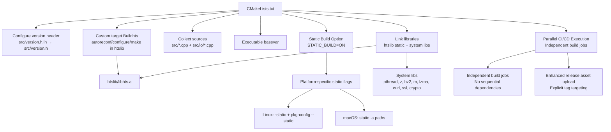
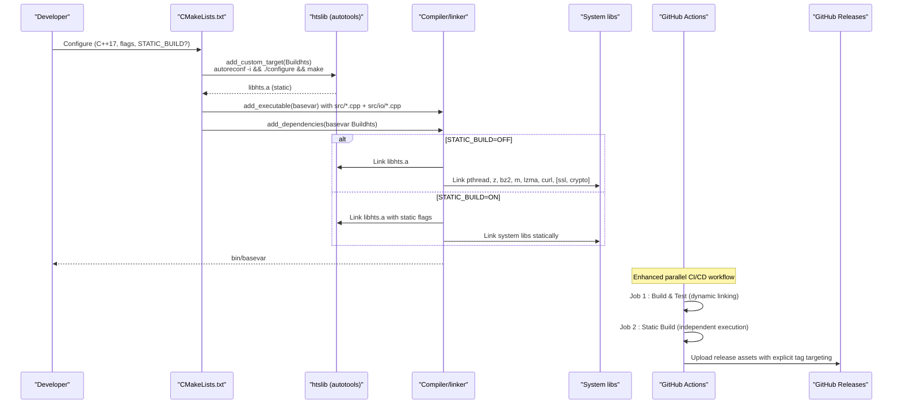
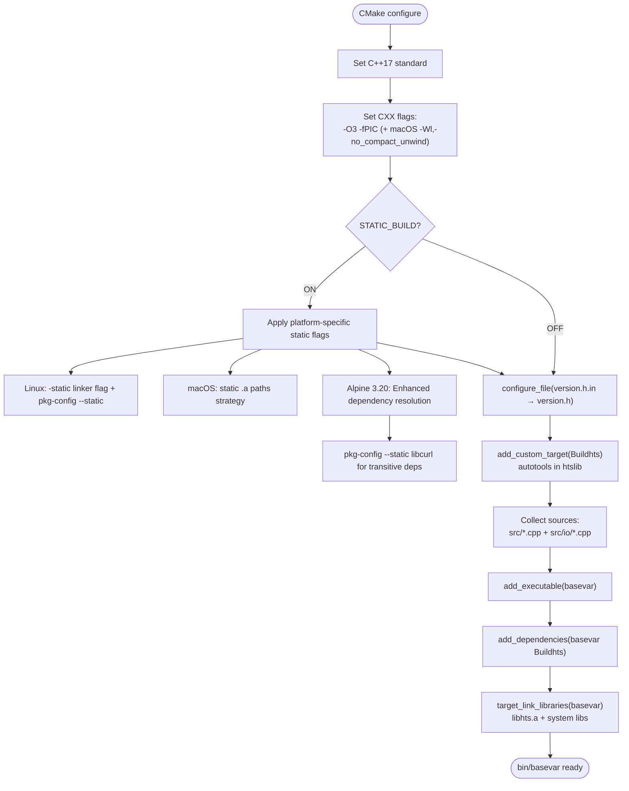
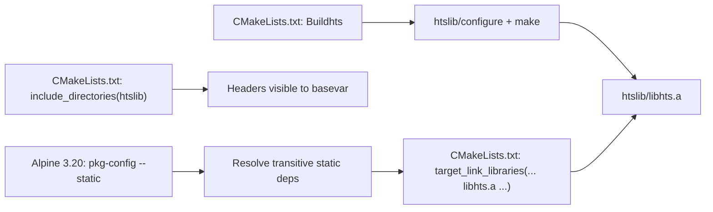
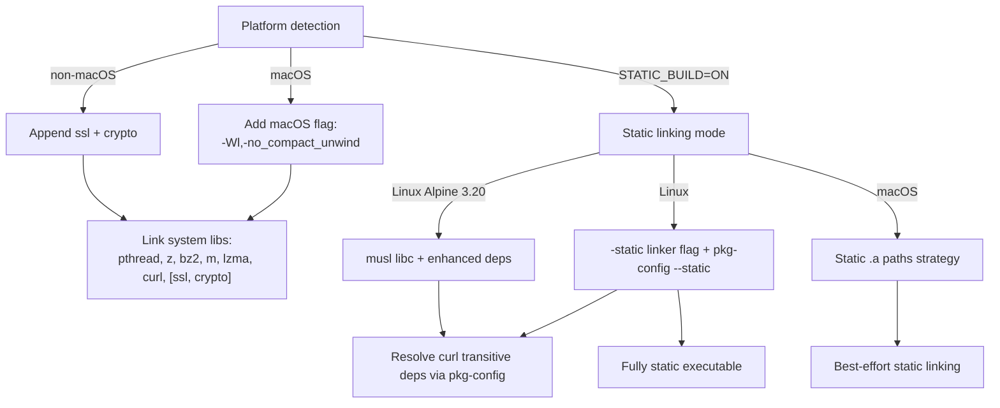
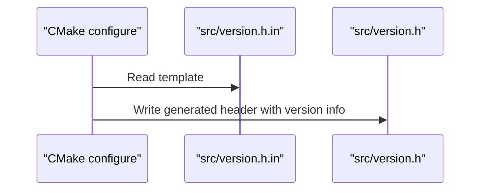
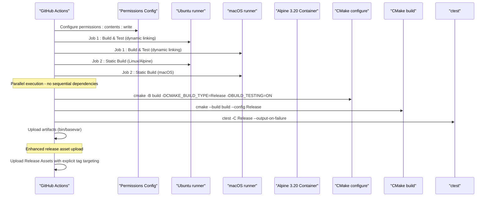
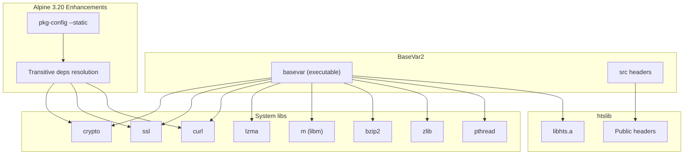

# Build System and Configuration

<cite>
**Referenced Files in This Document**
- [CMakeLists.txt](file://CMakeLists.txt)
- [README.md](file://README.md)
- [.github/workflows/build.yml](file://.github/workflows/build.yml)
- [bin/manual_install.sh](file://bin/manual_install.sh)
- [htslib/config.mk](file://htslib/config.mk)
- [htslib/htslib.mk](file://htslib/htslib.mk)
- [htslib/htslib_static.mk](file://htslib/htslib_static.mk)
- [htslib/configure.ac](file://htslib/configure.ac)
- [src/version.h.in](file://src/version.h.in)
- [src/version.h](file://src/version.h)
</cite>

## Update Summary
**Changes Made**
- Enhanced documentation for GitHub Actions CI/CD workflow with improved permissions configuration
- Updated CI/CD architecture documentation to reflect parallel execution model
- Added documentation for release asset upload enhancements with explicit tag targeting
- Updated static build job documentation to reflect independent execution without sequential dependencies
- Enhanced troubleshooting guide with improved CI/CD workflow verification steps

## Table of Contents
1. [Introduction](#introduction)
2. [Project Structure](#project-structure)
3. [Core Components](#core-components)
4. [Architecture Overview](#architecture-overview)
5. [Detailed Component Analysis](#detailed-component-analysis)
6. [Static Build Configuration](#static-build-configuration)
7. [Dependency Analysis](#dependency-analysis)
8. [Performance Considerations](#performance-considerations)
9. [Troubleshooting Guide](#troubleshooting-guide)
10. [Conclusion](#conclusion)

## Introduction
This document explains BaseVar2's build system and configuration management with a focus on:
- CMake build configuration and control flow
- Dependency management for htslib and system libraries
- Platform-specific considerations (Linux vs macOS)
- Integration with htslib and the embedded bioinformatics library setup
- Compilation and linking requirements
- Runtime dependencies and development environment setup
- Compiler requirements and optimization flags
- **NEW**: Enhanced GitHub Actions CI/CD workflow with improved permissions configuration, parallel execution architecture, and release asset upload enhancements
- **NEW**: Independent static build jobs with explicit tag targeting for release assets

## Project Structure
BaseVar2 integrates a C++ application with an embedded htslib submodule. The build system orchestrates:
- Version header generation via CMake configure_file
- A custom CMake target to build htslib using autotools
- Inclusion of htslib headers and linking against the static htslib archive
- Platform-specific compiler flags and system libraries
- **NEW**: Enhanced CI/CD workflow with parallel execution and improved release asset management



**Diagram sources**
- [CMakeLists.txt:17-20](file://CMakeLists.txt#L17-L20)
- [CMakeLists.txt:32-36](file://CMakeLists.txt#L32-L36)
- [CMakeLists.txt:52-55](file://CMakeLists.txt#L52-L55)
- [CMakeLists.txt:59](file://CMakeLists.txt#L59)
- [CMakeLists.txt:49](file://CMakeLists.txt#L49)
- [CMakeLists.txt:23](file://CMakeLists.txt#L23)
- [CMakeLists.txt:43-46](file://CMakeLists.txt#L43-L46)
- [CMakeLists.txt:128-165](file://CMakeLists.txt#L128-L165)
- [.github/workflows/build.yml:12-13](file://.github/workflows/build.yml#L12-L13)
- [.github/workflows/build.yml:87-88](file://.github/workflows/build.yml#L87-L88)
- [.github/workflows/build.yml:72-77](file://.github/workflows/build.yml#L72-L77)

**Section sources**
- [CMakeLists.txt:1-171](file://CMakeLists.txt#L1-L171)
- [.github/workflows/build.yml:1-184](file://.github/workflows/build.yml#L1-L184)

## Core Components
- CMake configuration enforces C++17, sets optimization flags, and configures platform-specific flags.
- A custom target builds htslib using autotools and places the resulting static library into the expected path.
- The main executable links against the static htslib archive and system libraries.
- Version metadata is templated into a generated header during configuration.
- **NEW**: Enhanced CI/CD workflow with improved permissions configuration for release asset uploads and parallel execution architecture.

Key implementation references:
- C++ standard and flags: [CMakeLists.txt:5](file://CMakeLists.txt#L5), [CMakeLists.txt:26-29](file://CMakeLists.txt#L26-L29)
- htslib build target: [CMakeLists.txt:32-36](file://CMakeLists.txt#L32-L36)
- Include directories and library linkage: [CMakeLists.txt:39-46](file://CMakeLists.txt#L39-L46), [CMakeLists.txt:49](file://CMakeLists.txt#L49), [CMakeLists.txt:61](file://CMakeLists.txt#L61)
- Version header generation: [CMakeLists.txt:17-20](file://CMakeLists.txt#L17-L20), [src/version.h.in:1-13](file://src/version.h.in#L1-L13), [src/version.h:1-13](file://src/version.h#L1-L13)
- Static build option: [CMakeLists.txt:23](file://CMakeLists.txt#L23), [CMakeLists.txt:46-62](file://CMakeLists.txt#L46-L62)
- **NEW**: Enhanced CI/CD workflow: [CMakeLists.txt:128-165](file://CMakeLists.txt#L128-L165), [.github/workflows/build.yml:12-13](file://.github/workflows/build.yml#L12-L13), [.github/workflows/build.yml:87-88](file://.github/workflows/build.yml#L87-L88)

**Section sources**
- [CMakeLists.txt:1-171](file://CMakeLists.txt#L1-L171)
- [src/version.h.in:1-13](file://src/version.h.in#L1-L13)
- [src/version.h:1-13](file://src/version.h#L1-L13)
- [.github/workflows/build.yml:12-13](file://.github/workflows/build.yml#L12-L13)
- [.github/workflows/build.yml:87-88](file://.github/workflows/build.yml#L87-L88)

## Architecture Overview
The build architecture ties together CMake, htslib's autotools build, and system libraries. The enhanced CI/CD workflow now features parallel execution with independent build jobs and improved release asset management.



**Diagram sources**
- [CMakeLists.txt:32-36](file://CMakeLists.txt#L32-L36)
- [CMakeLists.txt:52-55](file://CMakeLists.txt#L52-L55)
- [CMakeLists.txt:59](file://CMakeLists.txt#L59)
- [CMakeLists.txt:61](file://CMakeLists.txt#L61)
- [CMakeLists.txt:43-46](file://CMakeLists.txt#L43-L46)
- [CMakeLists.txt:128-165](file://CMakeLists.txt#L128-L165)
- [.github/workflows/build.yml:12-13](file://.github/workflows/build.yml#L12-L13)
- [.github/workflows/build.yml:87-88](file://.github/workflows/build.yml#L87-L88)
- [.github/workflows/build.yml:72-77](file://.github/workflows/build.yml#L72-L77)

## Detailed Component Analysis

### CMake Build Configuration
- Enforces C++17 and sets common compile flags including optimization level 3 and position-independent code.
- Adds a platform-specific linker flag for macOS to disable compact unwind information.
- Generates a version header from a template using CMake's configure_file mechanism.
- Declares a custom target to build htslib via autotools and ensures it completes before building the main executable.
- Includes htslib headers and links the static htslib archive with system libraries.
- **NEW**: Implements enhanced conditional static linking based on the STATIC_BUILD option with Alpine 3.20 improvements.



**Diagram sources**
- [CMakeLists.txt:5](file://CMakeLists.txt#L5)
- [CMakeLists.txt:26-29](file://CMakeLists.txt#L26-L29)
- [CMakeLists.txt:17-20](file://CMakeLists.txt#L17-L20)
- [CMakeLists.txt:23](file://CMakeLists.txt#L23)
- [CMakeLists.txt:46-62](file://CMakeLists.txt#L46-L62)
- [CMakeLists.txt:128-165](file://CMakeLists.txt#L128-L165)
- [CMakeLists.txt:32-36](file://CMakeLists.txt#L32-L36)
- [CMakeLists.txt:52-55](file://CMakeLists.txt#L52-L55)
- [CMakeLists.txt:59](file://CMakeLists.txt#L59)
- [CMakeLists.txt:61](file://CMakeLists.txt#L61)

**Section sources**
- [CMakeLists.txt:1-171](file://CMakeLists.txt#L1-L171)

### htslib Integration and Embedded Setup
- htslib is built using autotools within the custom target and produces a static library at a fixed path expected by the main build.
- The main build includes htslib headers and links against the static archive.
- htslib's Makefile-based build supports optional plugins and compression libraries; the static archive is sufficient for BaseVar2's needs.
- **NEW**: Enhanced static linking with pkg-config --static for better dependency resolution in Alpine environments.



**Diagram sources**
- [CMakeLists.txt:32-36](file://CMakeLists.txt#L32-L36)
- [CMakeLists.txt:39](file://CMakeLists.txt#L39)
- [CMakeLists.txt:49](file://CMakeLists.txt#L49)
- [CMakeLists.txt:61](file://CMakeLists.txt#L61)
- [CMakeLists.txt:134-135](file://CMakeLists.txt#L134-L135)

**Section sources**
- [CMakeLists.txt:32-36](file://CMakeLists.txt#L32-L36)
- [CMakeLists.txt:39](file://CMakeLists.txt#L39)
- [CMakeLists.txt:49](file://CMakeLists.txt#L49)
- [CMakeLists.txt:61](file://CMakeLists.txt#L61)

### System Libraries and Platform-Specific Considerations
- Common system libraries: pthread, z (zlib), bz2 (bzip2), m (math), lzma (xz), curl.
- On non-macOS platforms, OpenSSL libraries (ssl and crypto) are appended.
- macOS-specific linker flag to disable compact unwind information is conditionally added.
- **NEW**: Enhanced static linking strategies vary by platform with different approaches for Linux and macOS, including Alpine 3.20 support.
- **NEW**: Linux static builds now use pkg-config --static to resolve complete set of link flags for libcurl and its transitive dependencies.



**Diagram sources**
- [CMakeLists.txt:27-29](file://CMakeLists.txt#L27-L29)
- [CMakeLists.txt:44-46](file://CMakeLists.txt#L44-L46)
- [CMakeLists.txt:46-62](file://CMakeLists.txt#L46-L62)
- [CMakeLists.txt:128-165](file://CMakeLists.txt#L128-L165)

**Section sources**
- [CMakeLists.txt:27-29](file://CMakeLists.txt#L27-L29)
- [CMakeLists.txt:44-46](file://CMakeLists.txt#L44-L46)
- [CMakeLists.txt:46-62](file://CMakeLists.txt#L46-L62)
- [CMakeLists.txt:128-165](file://CMakeLists.txt#L128-L165)

### Version Header Generation
- A CMake configure_file step transforms a version template into a generated header containing project metadata.
- The template fields are populated from CMake project version and metadata variables.



**Diagram sources**
- [CMakeLists.txt:17-20](file://CMakeLists.txt#L17-L20)
- [src/version.h.in:1-13](file://src/version.h.in#L1-L13)
- [src/version.h:1-13](file://src/version.h#L1-L13)

**Section sources**
- [CMakeLists.txt:17-20](file://CMakeLists.txt#L17-L20)
- [src/version.h.in:1-13](file://src/version.h.in#L1-L13)
- [src/version.h:1-13](file://src/version.h#L1-L13)

### Enhanced CI/CD Build Workflow
- GitHub Actions builds on Ubuntu and macOS runners with parallel execution architecture.
- **NEW**: Enhanced permissions configuration with `permissions: contents: write` for proper release asset uploads.
- **NEW**: Independent static build jobs that run without sequential dependencies, allowing parallel execution.
- **NEW**: Explicit tag targeting for release assets using `${{ github.ref_name }}`.
- Installs dependencies via package managers (apt on Linux, Homebrew on macOS).
- Configures CMake with Release build type and enables testing.
- Builds and runs tests, then packages the binary artifact.
- **NEW**: Separate static build jobs for Linux (Alpine 3.20 Docker) and macOS with enhanced verification steps and Alpine-specific dependency resolution.



**Diagram sources**
- [.github/workflows/build.yml:12-13](file://.github/workflows/build.yml#L12-L13)
- [.github/workflows/build.yml:87-88](file://.github/workflows/build.yml#L87-L88)
- [.github/workflows/build.yml:72-77](file://.github/workflows/build.yml#L72-L77)
- [.github/workflows/build.yml:25-48](file://.github/workflows/build.yml#L25-L48)
- [.github/workflows/build.yml:50-52](file://.github/workflows/build.yml#L50-L52)
- [.github/workflows/build.yml:54-63](file://.github/workflows/build.yml#L54-L63)
- [.github/workflows/build.yml:112-146](file://.github/workflows/build.yml#L112-L146)
- [.github/workflows/build.yml:153-171](file://.github/workflows/build.yml#L153-L171)
- [.github/workflows/build.yml:114-157](file://.github/workflows/build.yml#L114-L157)

**Section sources**
- [.github/workflows/build.yml:1-184](file://.github/workflows/build.yml#L1-L184)

## Static Build Configuration

### STATIC_BUILD CMake Option
BaseVar2 introduces a comprehensive static linking capability through the `STATIC_BUILD` CMake option. This feature enables the creation of portable, self-contained binaries that can run on systems without the required shared libraries.

**Key Features:**
- **Cross-platform support**: Different strategies for Linux and macOS
- **Zero-dependency distribution**: Fully static Linux binaries with no runtime dependencies
- **Best-effort static linking**: macOS static linking with system framework exceptions
- **Enhanced CI/CD**: Dedicated GitHub Actions jobs for static binary builds with Alpine 3.20 support
- **NEW**: Improved dependency resolution through pkg-config --static for better error handling

### Linux Static Linking Strategy with Alpine 3.20
On Linux, the static build uses the `-static` linker flag combined with pkg-config --static to produce fully static executables with enhanced dependency resolution:

```cmake
if(STATIC_BUILD AND NOT APPLE)
    # ---- Linux fully static build (Alpine musl recommended) ----
    # Use pkg-config --static to resolve the complete set of link flags
    # that libcurl needs (idn2, unistring, nghttp2, cares, ssl, crypto, z, etc.).
    # This avoids manually tracking curl's transitive dependencies,
    # which vary by Alpine version and build configuration.
    find_package(PkgConfig REQUIRED)
    pkg_check_modules(CURL_STATIC REQUIRED IMPORTED_TARGET libcurl)

    # Locate remaining .a archives explicitly
    find_library(ZLIB_STATIC   NAMES libz.a     REQUIRED)
    find_library(BZ2_STATIC    NAMES libbz2.a   REQUIRED)
    find_library(LZMA_STATIC   NAMES liblzma.a  REQUIRED)
    find_library(SSL_STATIC    NAMES libssl.a   REQUIRED)
    find_library(CRYPTO_STATIC NAMES libcrypto.a REQUIRED)

    message(STATUS "Linux static libs:")
    message(STATUS "  zlib=${ZLIB_STATIC} bz2=${BZ2_STATIC} lzma=${LZMA_STATIC}")
    message(STATUS "  ssl=${SSL_STATIC} crypto=${CRYPTO_STATIC}")
    message(STATUS "  curl static flags: ${CURL_STATIC_STATIC_LIBRARIES}")

    # Force static linker flag
    set(CMAKE_EXE_LINKER_FLAGS "${CMAKE_EXE_LINKER_FLAGS} -static")

    target_link_libraries(basevar
        ${HTSLIB}
        # pkg-config resolves libcurl.a + all its transitive static deps
        # (libidn2, libunistring, libnghttp2, libcares, libssl, libcrypto, etc.)
        -Wl,--start-group
        ${CURL_STATIC_STATIC_LIBRARIES}
        ${LZMA_STATIC}
        ${BZ2_STATIC}
        ${ZLIB_STATIC}
        -Wl,--end-group
        pthread
        m
        dl
    )
endif()
```

**Benefits:**
- Zero runtime dependencies on Linux systems
- Compatible with CentOS 7+, Ubuntu 16.04+, Debian 9+, and Alpine 3.20+
- Can run on minimal Docker containers with musl libc
- **NEW**: Enhanced dependency resolution prevents manual tracking of transitive dependencies
- **NEW**: Improved error handling through pkg-config validation

**Requirements:**
- Alpine Linux Docker container (Alpine 3.20) for reliable static linking
- All required libraries must be available as static archives (zlib-static, bzip2-static, etc.)
- May limit certain features that rely on dynamic loading (DNS via NSS)
- **NEW**: Alpine 3.20 provides improved package availability and compatibility

### macOS Static Linking Strategy
macOS has stricter limitations on static linking. The implementation uses a best-effort approach:

```cmake
if(STATIC_BUILD AND APPLE)
    # On macOS, Apple does not support fully static executables.
    # Strategy: statically link zlib, bz2, lzma via Homebrew .a archives.
    # Homebrew's libcurl.a requires ngtcp2/libicucore (QUIC/HTTP3+IDN) which
    # are complex to resolve as .a on macOS — use system curl dylib instead.
    #
    # Homebrew on Apple Silicon: /opt/homebrew/opt/<pkg>
    # Homebrew on Intel Macs:    /usr/local/opt/<pkg>
    find_library(ZLIB_STATIC   libz.a
        HINTS /opt/homebrew/opt/zlib/lib /usr/local/opt/zlib/lib
        REQUIRED NO_DEFAULT_PATH)
    find_library(BZ2_STATIC    libbz2.a
        HINTS /opt/homebrew/opt/bzip2/lib /usr/local/opt/bzip2/lib
        REQUIRED NO_DEFAULT_PATH)
    find_library(LZMA_STATIC   liblzma.a
        HINTS /opt/homebrew/opt/xz/lib /usr/local/opt/xz/lib
        REQUIRED NO_DEFAULT_PATH)

    message(STATUS "Static libs: zlib=${ZLIB_STATIC} bz2=${BZ2_STATIC} lzma=${LZMA_STATIC}")
    message(STATUS "Dynamic (system): curl, ssl, crypto")

    target_link_libraries(basevar
        ${HTSLIB}
        curl            # system /usr/lib/libcurl.4.dylib
        ${LZMA_STATIC}
        ${BZ2_STATIC}
        ${ZLIB_STATIC}
        pthread
        m
    )
endif()
```

**Approach Details:**
- Static linking of compression libraries (zlib, bzip2, lzma) for version stability
- Dynamic linking of system frameworks (curl, ssl, crypto) due to Apple limitations
- Uses Homebrew paths for locating static archives
- Maintains compatibility with macOS system libraries

**Limitations:**
- Cannot create fully static executables on macOS due to Apple restrictions
- Some advanced features may require dynamic libraries
- Requires Homebrew installation of static library dependencies

### Static Build Verification
The enhanced GitHub Actions workflow includes improved verification steps for static binaries with Alpine 3.20 support:

**Linux Verification with Alpine 3.20:**
```bash
echo "=== Installing Alpine 3.20 build dependencies ==="
apk add --no-cache \
  build-base cmake autoconf automake pkgconf \
  zlib-dev zlib-static \
  bzip2-dev bzip2-static \
  xz-dev xz-static \
  curl-dev curl-static \
  openssl-dev openssl-libs-static

echo "=== Configuring (STATIC_BUILD=ON) ==="
cmake -B build-static \
  -DSTATIC_BUILD=ON \
  -DCMAKE_BUILD_TYPE=Release

echo "=== Building ==="
cmake --build build-static --config Release

echo "=== Verifying static binary ==="
file bin/basevar
if ldd bin/basevar 2>&1 | grep -q "not a dynamic executable\|statically linked"; then
  echo "OK: Binary is fully static."
else
  echo "WARNING: Binary has dynamic dependencies:" && ldd bin/basevar 2>&1 || true
fi
```

**macOS Verification:**
```bash
echo "=== Binary info ==="
file bin/basevar
echo "=== Dynamic library dependencies ==="
otool -L bin/basevar
```

**Section sources**
- [CMakeLists.txt:23](file://CMakeLists.txt#L23)
- [CMakeLists.txt:46-62](file://CMakeLists.txt#L46-L62)
- [CMakeLists.txt:97-135](file://CMakeLists.txt#L97-L135)
- [CMakeLists.txt:128-165](file://CMakeLists.txt#L128-L165)
- [.github/workflows/build.yml:83-184](file://.github/workflows/build.yml#L83-L184)

## Dependency Analysis
- Internal dependencies:
  - BaseVar executable depends on the htslib static archive.
  - The build ensures htslib is built before the executable.
- External dependencies:
  - System libraries: pthread, z, bz2, m, lzma, curl, ssl, crypto (conditional).
  - **NEW**: Static linking requires availability of static archives for compression libraries and enhanced dependency resolution via pkg-config.
- htslib internals:
  - htslib's Makefile exposes public headers and build targets for static/shared libraries and tools.
  - Optional plugins and compression libraries are selectable at configure time.
  - **NEW**: Enhanced static linking with pkg-config --static for better transitive dependency resolution.



**Diagram sources**
- [CMakeLists.txt:49](file://CMakeLists.txt#L49)
- [CMakeLists.txt:61](file://CMakeLists.txt#L61)
- [CMakeLists.txt:43-46](file://CMakeLists.txt#L43-L46)
- [htslib/htslib.mk:57-83](file://htslib/htslib.mk#L57-L83)
- [CMakeLists.txt:134-135](file://CMakeLists.txt#L134-L135)

**Section sources**
- [CMakeLists.txt:43-61](file://CMakeLists.txt#L43-L61)
- [htslib/htslib.mk:57-83](file://htslib/htslib.mk#L57-L83)
- [htslib/htslib_static.mk:1-3](file://htslib/htslib_static.mk#L1-L3)

## Performance Considerations
- Optimization flags:
  - The build uses aggressive optimization level 3 for performance-sensitive bioinformatics processing.
- Position-independent code:
  - -fPIC is enabled to support shared library compatibility and modern linkers.
- Platform-specific tuning:
  - macOS disables compact unwind information to avoid linker issues on some systems.
- Compression and networking:
  - htslib's autotools configuration detects CPU features and enables SIMD codecs when available, improving decompression performance.
- **NEW**: Static linking overhead:
  - Static linking increases binary size but eliminates runtime dependency resolution.
  - May slightly reduce startup time by avoiding dynamic loading.
  - Potential performance impact from larger binary size on memory usage.
  - **NEW**: pkg-config --static improves build reliability and reduces manual dependency tracking overhead.

Recommendations:
- Prefer Release builds for production use.
- Ensure sufficient virtual memory for multi-threaded variant calling; the project description indicates modest per-thread memory usage when tuned appropriately.
- **NEW**: Use static builds for environments with limited library availability or strict security requirements.
- **NEW**: For Linux deployments, consider Alpine 3.20 for optimal static binary compatibility and dependency resolution.

**Section sources**
- [CMakeLists.txt:26](file://CMakeLists.txt#L26)
- [CMakeLists.txt:27-29](file://CMakeLists.txt#L27-L29)
- [htslib/configure.ac:86-191](file://htslib/configure.ac#L86-L191)

## Troubleshooting Guide

### Static Build Specific Issues

**Linux Static Build Failures with Alpine 3.20**
- **Symptom**: Linker errors indicating missing static archives or pkg-config failures
- **Resolution**: Ensure all required static libraries are available in Alpine 3.20 container. Use the enhanced dependency installation pattern with zlib-static, bzip2-static, xz-static, curl-static, openssl-libs-static packages.
- **References**: [.github/workflows/build.yml:119-133](file://.github/workflows/build.yml#L119-L133), [CMakeLists.txt:134-142](file://CMakeLists.txt#L134-L142)

**pkg-config --static Dependency Resolution Issues**
- **Symptom**: pkg-config fails to resolve libcurl transitive dependencies
- **Resolution**: Verify that libcurl-dev and all required static packages are installed in the Alpine 3.20 container. Check that pkg-config --static --libs libcurl returns proper flags.
- **References**: [.github/workflows/build.yml:135-136](file://.github/workflows/build.yml#L135-L136), [CMakeLists.txt:134](file://CMakeLists.txt#L134)

**macOS Static Build Library Not Found**
- **Symptom**: CMake cannot locate static archives for zlib, bzip2, or lzma
- **Resolution**: Install dependencies via Homebrew and ensure they're built as static libraries. The build expects Homebrew paths. Note that curl, ssl, and crypto remain dynamic on macOS.
- **References**: [CMakeLists.txt:106-114](file://CMakeLists.txt#L106-L114)

**macOS Fully Static Limitation**
- **Symptom**: Static build still has dynamic dependencies
- **Resolution**: This is expected behavior on macOS. The build statically links third-party libraries while keeping system frameworks dynamic. Use the verification steps to confirm behavior.
- **References**: [CMakeLists.txt:47-57](file://CMakeLists.txt#L47-L57)

### CI/CD Workflow Issues

**GitHub Actions Permissions Error**
- **Symptom**: Release asset upload fails with permission denied
- **Resolution**: The workflow now includes `permissions: contents: write` configuration. Ensure the workflow has the necessary permissions to upload release assets.
- **References**: [.github/workflows/build.yml:12-13](file://.github/workflows/build.yml#L12-L13)

**Static Build Job Dependencies**
- **Symptom**: Static build jobs wait for completion of dynamic build jobs
- **Resolution**: The static build jobs now run independently without `needs:` dependencies, enabling parallel execution. This improves CI/CD performance and reliability.
- **References**: [.github/workflows/build.yml:87-88](file://.github/workflows/build.yml#L87-L88)

**Release Asset Upload Issues**
- **Symptom**: Release assets not uploaded or incorrect tag targeting
- **Resolution**: The workflow now uses explicit tag targeting with `${{ github.ref_name }}` for release assets. Verify that the release event is triggered with the correct tag name.
- **References**: [.github/workflows/build.yml:72-77](file://.github/workflows/build.yml#L72-L77), [.github/workflows/build.yml:178-183](file://.github/workflows/build.yml#L178-L183)

### General Build Issues

**htslib autotools failures**
- Symptom: configure or make errors in htslib.
- Resolution: The project's manual installation notes indicate that certain test-related errors can be ignored; the library still builds successfully. Retry autotools steps if transient network issues caused initial failure.
- References: [README.md:120](file://README.md#L120)

**Missing system libraries**
- Symptom: Linker errors for missing libraries (e.g., ssl, crypto, bz2, lzma, curl).
- Resolution: Install the required development packages using your OS package manager. The CI workflow demonstrates the exact packages installed on Linux and macOS, including Alpine 3.20 static packages.
- References: [.github/workflows/build.yml:32-42](file://.github/workflows/build.yml#L32-L42)

**macOS-specific linker issues**
- Symptom: Link-time errors related to compact unwind or symbol visibility.
- Resolution: The build adds a macOS-specific flag to disable compact unwind; ensure you are using the latest Xcode command line tools.
- References: [CMakeLists.txt:27-29](file://CMakeLists.txt#L27-L29)

**Manual linking differences**
- Symptom: Differences between automated CMake build and manual g++ invocation.
- Resolution: The manual script shows both approaches (using -lhts vs linking the static archive). Ensure include paths and library order match the CMake configuration.
- References: [README.md:109-121](file://README.md#L109-L121), [bin/manual_install.sh:4-10](file://bin/manual_install.sh#L4-L10)

**Version header not updated**
- Symptom: Version metadata not reflecting project version.
- Resolution: Re-run CMake configure to regenerate the version header from the template.
- References: [CMakeLists.txt:17-20](file://CMakeLists.txt#L17-L20), [src/version.h.in:1-13](file://src/version.h.in#L1-L13), [src/version.h:1-13](file://src/version.h#L1-L13)

**Static Binary Verification Issues**
- Symptom: Static binary still shows dynamic dependencies
- Resolution: On macOS, this is expected behavior. The build statically links third-party libraries while keeping system frameworks dynamic. Use the verification steps in the CI workflow to confirm behavior.
- References: [.github/workflows/build.yml:150-156](file://.github/workflows/build.yml#L150-L156), [.github/workflows/build.yml:176-182](file://.github/workflows/build.yml#L176-L182)

**Alpine 3.20 Container Issues**
- **Symptom**: Static build fails in Alpine container
- **Resolution**: Ensure all required static packages are installed (zlib-static, bzip2-static, xz-static, curl-static, openssl-libs-static). Clean stale htslib artifacts before building.
- **References**: [.github/workflows/build.yml:119-140](file://.github/workflows/build.yml#L119-L140)

**Section sources**
- [.github/workflows/build.yml:12-13](file://.github/workflows/build.yml#L12-L13)
- [.github/workflows/build.yml:87-88](file://.github/workflows/build.yml#L87-L88)
- [.github/workflows/build.yml:72-77](file://.github/workflows/build.yml#L72-L77)
- [.github/workflows/build.yml:178-183](file://.github/workflows/build.yml#L178-L183)
- [CMakeLists.txt:106-114](file://CMakeLists.txt#L106-L114)
- [CMakeLists.txt:47-57](file://CMakeLists.txt#L47-L57)
- [README.md:120](file://README.md#L120)
- [.github/workflows/build.yml:32-42](file://.github/workflows/build.yml#L32-L42)
- [CMakeLists.txt:27-29](file://CMakeLists.txt#L27-L29)
- [README.md:109-121](file://README.md#L109-L121)
- [bin/manual_install.sh:4-10](file://bin/manual_install.sh#L4-L10)
- [CMakeLists.txt:17-20](file://CMakeLists.txt#L17-L20)
- [src/version.h.in:1-13](file://src/version.h.in#L1-L13)
- [src/version.h:1-13](file://src/version.h#L1-L13)
- [.github/workflows/build.yml:150-156](file://.github/workflows/build.yml#L150-L156)
- [.github/workflows/build.yml:176-182](file://.github/workflows/build.yml#L176-L182)

## Conclusion
BaseVar2's build system centers on a streamlined CMake configuration that embeds htslib via autotools, enforces C++17, applies performance-oriented compiler flags, and links against essential system libraries. **NEW**: The introduction of the STATIC_BUILD CMake option provides comprehensive cross-platform static linking support, enabling the creation of portable, self-contained binaries for both Linux and macOS environments with enhanced Alpine 3.20 support.

The enhanced CI/CD workflow represents a significant improvement in build automation and release management. **NEW**: The workflow now features improved permissions configuration with `permissions: contents: write` for proper release asset uploads, parallel execution architecture with independent static build jobs, and explicit tag targeting for release assets using `${{ github.ref_name }}`. These enhancements eliminate sequential dependencies between build jobs, improving CI/CD performance and reliability.

The enhanced Linux static build configuration leverages pkg-config --static for improved dependency resolution, eliminating the need for manual tracking of transitive dependencies. The Alpine 3.20 Docker container provides reliable static linking with comprehensive package availability for zlib-static, bzip2-static, xz-static, curl-static, and other required libraries.

The CI workflow validates builds on Linux and macOS, ensuring portability and reliability. The enhanced GitHub Actions workflow now includes dedicated static build jobs with Alpine 3.20 specifications and verification steps, demonstrating the practical benefits of static linking for distribution and deployment scenarios.

Following the troubleshooting guidance and using the documented manual linking examples will resolve most build issues. For development, ensure the required system libraries are installed and use Release builds for optimal performance. **NEW**: For environments requiring zero-dependency deployments or strict security policies, utilize the STATIC_BUILD option with the appropriate platform-specific configuration, particularly leveraging Alpine 3.20 for Linux static builds with its improved dependency resolution capabilities. The enhanced CI/CD workflow ensures reliable and efficient distribution of both dynamic and static binaries through parallel execution and improved release asset management.