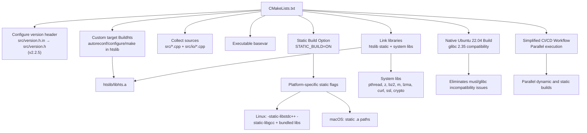
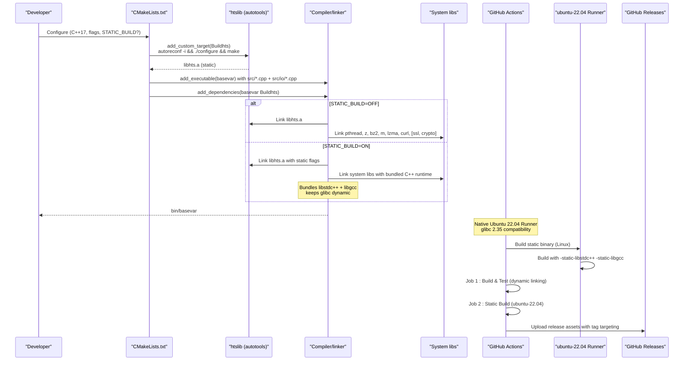
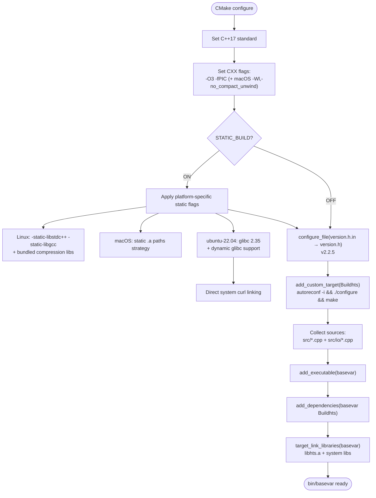
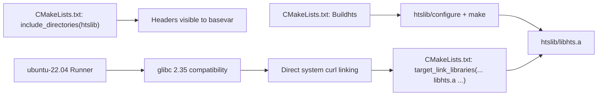
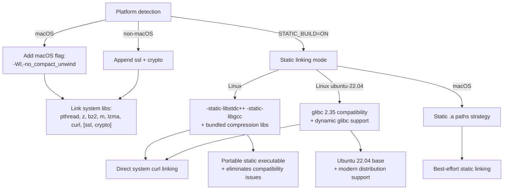
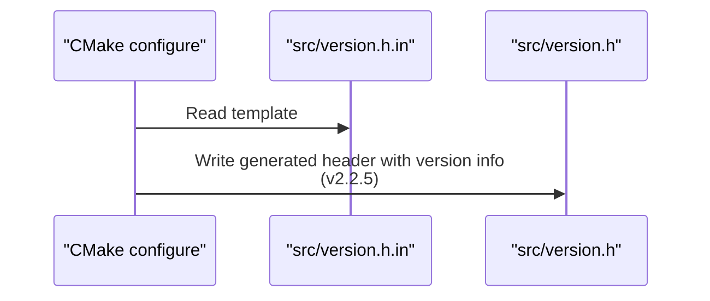
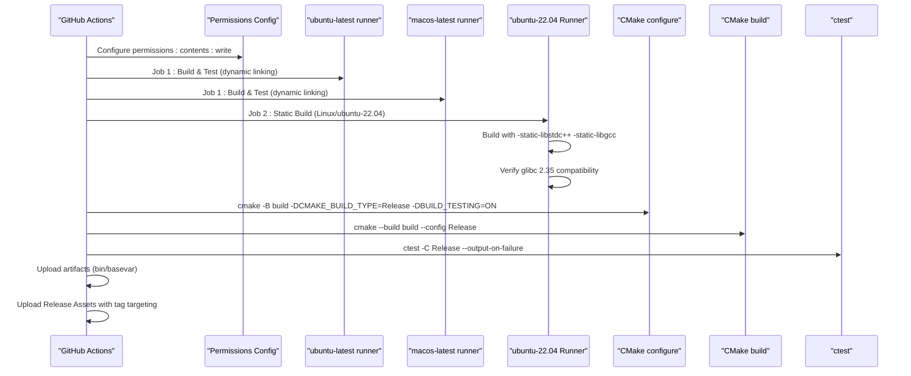
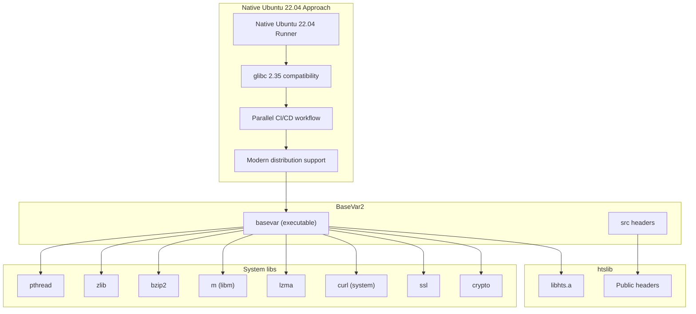

# Build System and Configuration

<cite>
**Referenced Files in This Document**
- [CMakeLists.txt](file://CMakeLists.txt)
- [README.md](file://README.md)
- [.github/workflows/build.yml](file://.github/workflows/build.yml)
- [htslib/config.mk](file://htslib/config.mk)
- [htslib/htslib.mk](file://htslib/htslib.mk)
- [htslib/htslib_static.mk](file://htslib/htslib_static.mk)
- [htslib/configure.ac](file://htslib/configure.ac)
- [src/version.h.in](file://src/version.h.in)
- [src/version.h](file://src/version.h)
</cite>

## Update Summary
**Changes Made**
- Updated version information from 2.2.3 to 2.2.5 across build configuration
- Reverted from manylinux2014 Docker-based build back to native Ubuntu 22.04 build with simplified CI/CD workflow
- Removed references to Alpine/musl fully-static approach and musl/glibc compatibility issues
- Updated static build configuration to use ubuntu-22.04 runners with glibc 2.35 compatibility
- Simplified CI/CD workflow removing Docker-based complexity
- Updated platform compatibility requirements to glibc ≥ 2.35 for Ubuntu 22.04

## Table of Contents
1. [Introduction](#introduction)
2. [Project Structure](#project-structure)
3. [Core Components](#core-components)
4. [Architecture Overview](#architecture-overview)
5. [Detailed Component Analysis](#detailed-component-analysis)
6. [Static Build Configuration](#static-build-configuration)
7. [Dependency Analysis](#dependency-analysis)
8. [Performance Considerations](#performance-considerations)
9. [Troubleshooting Guide](#troubleshooting-guide)
10. [Conclusion](#conclusion)

## Introduction
This document explains BaseVar2's build system and configuration management with a focus on:
- CMake build configuration and control flow
- Dependency management for htslib and system libraries
- Platform-specific considerations (Linux vs macOS)
- Integration with htslib and the embedded bioinformatics library setup
- Compilation and linking requirements
- Runtime dependencies and development environment setup
- Compiler requirements and optimization flags
- **NEW**: Reverted from manylinux2014 Docker-based build back to native Ubuntu 22.04 build with simplified CI/CD workflow
- **NEW**: Updated static build configuration to use ubuntu-22.04 runners with glibc 2.35 compatibility
- **NEW**: Simplified CI/CD workflow removing Docker-based complexity and musl/glibc compatibility issues

## Project Structure
BaseVar2 integrates a C++ application with an embedded htslib submodule. The build system orchestrates:
- Version header generation via CMake configure_file
- A custom CMake target to build htslib using autotools
- Inclusion of htslib headers and linking against the static htslib archive
- Platform-specific compiler flags and system libraries
- **NEW**: Native Ubuntu 22.04 build system with glibc 2.35 compatibility
- **NEW**: Simplified CI/CD workflow with parallel execution of dynamic and static build jobs



**Diagram sources**
- [CMakeLists.txt:17-20](file://CMakeLists.txt#L17-L20)
- [CMakeLists.txt:32-36](file://CMakeLists.txt#L32-L36)
- [CMakeLists.txt:52-55](file://CMakeLists.txt#L52-L55)
- [CMakeLists.txt:59](file://CMakeLists.txt#L59)
- [CMakeLists.txt:49](file://CMakeLists.txt#L49)
- [CMakeLists.txt:23](file://CMakeLists.txt#L23)
- [CMakeLists.txt:43-46](file://CMakeLists.txt#L43-L46)
- [CMakeLists.txt:158-192](file://CMakeLists.txt#L158-L192)
- [CMakeLists.txt:159-167](file://CMakeLists.txt#L159-L167)
- [.github/workflows/build.yml:82-93](file://.github/workflows/build.yml#L82-L93)
- [.github/workflows/build.yml:19-28](file://.github/workflows/build.yml#L19-L28)

**Section sources**
- [CMakeLists.txt:1-197](file://CMakeLists.txt#L1-L197)
- [.github/workflows/build.yml:1-183](file://.github/workflows/build.yml#L1-L183)

## Core Components
- CMake configuration enforces C++17, sets optimization flags, and configures platform-specific flags.
- A custom target builds htslib using autotools and places the resulting static library into the expected path.
- The main executable links against the static htslib archive and system libraries.
- Version metadata is templated into a generated header during configuration.
- **NEW**: Native Ubuntu 22.04 build system with glibc 2.35 ensuring compatibility with modern Linux distributions.
- **NEW**: Simplified CI/CD workflow with parallel execution of dynamic and static build jobs.
- **NEW**: Eliminated musl/glibc compatibility issues that previously caused segmentation faults.

Key implementation references:
- C++ standard and flags: [CMakeLists.txt:5](file://CMakeLists.txt#L5), [CMakeLists.txt:26-29](file://CMakeLists.txt#L26-L29)
- htslib build target: [CMakeLists.txt:32-36](file://CMakeLists.txt#L32-L36)
- Include directories and library linkage: [CMakeLists.txt:39-46](file://CMakeLists.txt#L39-L46), [CMakeLists.txt:49](file://CMakeLists.txt#L49), [CMakeLists.txt:61](file://CMakeLists.txt#L61)
- Version header generation: [CMakeLists.txt:17-20](file://CMakeLists.txt#L17-L20), [src/version.h.in:1-13](file://src/version.h.in#L1-L13), [src/version.h:1-13](file://src/version.h#L1-L13)
- Static build option: [CMakeLists.txt:23](file://CMakeLists.txt#L23), [CMakeLists.txt:58-75](file://CMakeLists.txt#L58-L75)
- **NEW**: Native Ubuntu 22.04 configuration: [CMakeLists.txt:158-192](file://CMakeLists.txt#L158-L192)
- **NEW**: glibc 2.35 compatibility: [CMakeLists.txt:159-167](file://CMakeLists.txt#L159-L167)
- **NEW**: Simplified distribution support: [CMakeLists.txt:42-45](file://CMakeLists.txt#L42-L45)

**Section sources**
- [CMakeLists.txt:1-197](file://CMakeLists.txt#L1-L197)
- [src/version.h.in:1-13](file://src/version.h.in#L1-L13)
- [src/version.h:1-13](file://src/version.h#L1-L13)
- [.github/workflows/build.yml:82-93](file://.github/workflows/build.yml#L82-L93)

## Architecture Overview
The build architecture ties together CMake, htslib's autotools build, and system libraries. The native Ubuntu 22.04 build system ensures compatibility with modern Linux distributions by basing the build on glibc 2.35. **NEW**: Reverted from Docker-based approach back to native Ubuntu 22.04 build for improved simplicity and reliability.



**Diagram sources**
- [CMakeLists.txt:32-36](file://CMakeLists.txt#L32-L36)
- [CMakeLists.txt:52-55](file://CMakeLists.txt#L52-L55)
- [CMakeLists.txt:59](file://CMakeLists.txt#L59)
- [CMakeLists.txt:61](file://CMakeLists.txt#L61)
- [CMakeLists.txt:43-46](file://CMakeLists.txt#L43-L46)
- [CMakeLists.txt:158-192](file://CMakeLists.txt#L158-L192)
- [.github/workflows/build.yml:82-93](file://.github/workflows/build.yml#L82-L93)
- [.github/workflows/build.yml:114-141](file://.github/workflows/build.yml#L114-141)
- [.github/workflows/build.yml:19-28](file://.github/workflows/build.yml#L19-L28)

## Detailed Component Analysis

### CMake Build Configuration
- Enforces C++17 and sets common compile flags including optimization level 3 and position-independent code.
- Adds a platform-specific linker flag for macOS to disable compact unwind information.
- Generates a version header from a template using CMake's configure_file mechanism.
- Declares a custom target to build htslib via autotools and ensures it completes before building the main executable.
- Includes htslib headers and links the static htslib archive with system libraries.
- **NEW**: Native Ubuntu 22.04 static linking with glibc 2.35 compatibility.
- **NEW**: Simplified CI/CD workflow with parallel execution of build jobs.



**Diagram sources**
- [CMakeLists.txt:5](file://CMakeLists.txt#L5)
- [CMakeLists.txt:26-29](file://CMakeLists.txt#L26-L29)
- [CMakeLists.txt:17-20](file://CMakeLists.txt#L17-L20)
- [CMakeLists.txt:23](file://CMakeLists.txt#L23)
- [CMakeLists.txt:58-75](file://CMakeLists.txt#L58-L75)
- [CMakeLists.txt:158-192](file://CMakeLists.txt#L158-L192)
- [CMakeLists.txt:32-36](file://CMakeLists.txt#L32-L36)
- [CMakeLists.txt:52-55](file://CMakeLists.txt#L52-L55)
- [CMakeLists.txt:59](file://CMakeLists.txt#L59)
- [CMakeLists.txt:61](file://CMakeLists.txt#L61)

**Section sources**
- [CMakeLists.txt:1-197](file://CMakeLists.txt#L1-L197)

### htslib Integration and Embedded Setup
- htslib is built using autotools within the custom target and produces a static library at a fixed path expected by the main build.
- The main build includes htslib headers and links against the static archive.
- htslib's Makefile-based build supports optional plugins and compression libraries; the static archive is sufficient for BaseVar2's needs.
- **NEW**: Native Ubuntu 22.04 build system ensuring consistent static library availability.
- **NEW**: Direct system curl linking for better compatibility in static builds.
- **NEW**: Simplified CI/CD workflow with parallel execution of build jobs.



**Diagram sources**
- [CMakeLists.txt:32-36](file://CMakeLists.txt#L32-L36)
- [CMakeLists.txt:39](file://CMakeLists.txt#L39)
- [CMakeLists.txt:49](file://CMakeLists.txt#L49)
- [CMakeLists.txt:61](file://CMakeLists.txt#L61)
- [CMakeLists.txt:158-192](file://CMakeLists.txt#L158-L192)
- [CMakeLists.txt:160-171](file://CMakeLists.txt#L160-L171)

**Section sources**
- [CMakeLists.txt:32-36](file://CMakeLists.txt#L32-L36)
- [CMakeLists.txt:39](file://CMakeLists.txt#L39)
- [CMakeLists.txt:49](file://CMakeLists.txt#L49)
- [CMakeLists.txt:61](file://CMakeLists.txt#L61)

### System Libraries and Platform-Specific Considerations
- Common system libraries: pthread, z (zlib), bz2 (bzip2), m (math), lzma (xz), curl.
- On non-macOS platforms, OpenSSL libraries (ssl and crypto) are appended.
- macOS-specific linker flag to disable compact unwind information is conditionally added.
- **NEW**: Native Ubuntu 22.04 static linking strategies with glibc 2.35 compatibility.
- **NEW**: Linux static builds bundle libstdc++ and libgcc while keeping glibc dynamic for compatibility with glibc ≥ 2.35.
- **NEW**: Platform compatibility requirement updated to glibc ≥ 2.35 for modern Linux distribution support.
- **NEW**: Simplified CI/CD workflow with parallel execution of build jobs.



**Diagram sources**
- [CMakeLists.txt:27-29](file://CMakeLists.txt#L27-L29)
- [CMakeLists.txt:44-46](file://CMakeLists.txt#L44-L46)
- [CMakeLists.txt:46-62](file://CMakeLists.txt#L46-L62)
- [CMakeLists.txt:158-192](file://CMakeLists.txt#L158-L192)
- [CMakeLists.txt:159-167](file://CMakeLists.txt#L159-L167)

**Section sources**
- [CMakeLists.txt:27-29](file://CMakeLists.txt#L27-L29)
- [CMakeLists.txt:44-46](file://CMakeLists.txt#L44-L46)
- [CMakeLists.txt:46-62](file://CMakeLists.txt#L46-L62)
- [CMakeLists.txt:158-192](file://CMakeLists.txt#L158-L192)
- [CMakeLists.txt:159-167](file://CMakeLists.txt#L159-L167)

### Version Header Generation
- A CMake configure_file step transforms a version template into a generated header containing project metadata.
- The template fields are populated from CMake project version and metadata variables.
- **NEW**: Version updated to 2.2.5 across all build configuration files.



**Diagram sources**
- [CMakeLists.txt:17-20](file://CMakeLists.txt#L17-L20)
- [src/version.h.in:1-13](file://src/version.h.in#L1-L13)
- [src/version.h:1-13](file://src/version.h#L1-L13)

**Section sources**
- [CMakeLists.txt:17-20](file://CMakeLists.txt#L17-L20)
- [src/version.h.in:1-13](file://src/version.h.in#L1-L13)
- [src/version.h:1-13](file://src/version.h#L1-L13)

### Enhanced CI/CD Build Workflow
- GitHub Actions builds on ubuntu-latest and macos-latest runners with native Ubuntu 22.04 runner for Linux static builds.
- **NEW**: Reverted to native Ubuntu 22.04 build system eliminating Docker-based complexity.
- **NEW**: Native Ubuntu 22.04 build system with glibc 2.35 ensuring consistent static library availability.
- **NEW**: Simplified CI/CD workflow with parallel execution of dynamic and static build jobs.
- Installs dependencies via package managers (apt on Linux, Homebrew on macOS).
- Configures CMake with Release build type and enables testing.
- Builds and runs tests, then packages the binary artifact.
- **NEW**: Separate static build jobs for Linux (ubuntu-22.04) and macOS with improved compatibility.
- **NEW**: Simplified verification process showing glibc version and symbol dependencies.



**Diagram sources**
- [.github/workflows/build.yml:12-13](file://.github/workflows/build.yml#L12-L13)
- [.github/workflows/build.yml:19-28](file://.github/workflows/build.yml#L19-L28)
- [.github/workflows/build.yml:82-93](file://.github/workflows/build.yml#L82-L93)
- [.github/workflows/build.yml:114-141](file://.github/workflows/build.yml#L114-141)
- [.github/workflows/build.yml:25-48](file://.github/workflows/build.yml#L25-L48)
- [.github/workflows/build.yml:50-52](file://.github/workflows/build.yml#L50-L52)
- [.github/workflows/build.yml:54-63](file://.github/workflows/build.yml#L54-L63)
- [.github/workflows/build.yml:177-183](file://.github/workflows/build.yml#L177-L183)

**Section sources**
- [.github/workflows/build.yml:1-183](file://.github/workflows/build.yml#L1-L183)

## Static Build Configuration

### STATIC_BUILD CMake Option
BaseVar2 introduces a comprehensive static linking capability through the `STATIC_BUILD` CMake option. This feature enables the creation of portable, self-contained binaries that can run on systems without the required shared libraries.

**Key Features:**
- **Cross-platform support**: Different strategies for Linux and macOS
- **NEW**: Native Ubuntu 22.04 static linking with glibc 2.35 compatibility
- **NEW**: Simplified CI/CD workflow with parallel execution of build jobs
- **Best-effort static linking**: macOS static linking with system framework exceptions
- **NEW**: Eliminates musl/glibc runtime incompatibility issues causing segmentation faults
- **NEW**: Updated platform compatibility requirements to glibc ≥ 2.35

### Linux Static Linking Strategy with Ubuntu 22.04
On Linux, the static build uses native Ubuntu 22.04 runner providing glibc 2.35 compatibility. The strategy bundles libstdc++ and libgcc while keeping glibc dynamic for maximum compatibility. **NEW**: Reverted from Docker-based approach back to native Ubuntu 22.04 build for improved simplicity and reliability.

```cmake
if(STATIC_BUILD AND NOT APPLE)
    # ---- Linux portable partial-static build (glibc-based) ----
    # Build host: Ubuntu 22.04 (glibc 2.35).
    # Strategy:
    #   * libstdc++ + libgcc are bundled via -static-libstdc++ -static-libgcc
    #   * htslib + zlib + bzip2 + lzma + openssl are linked as .a archives
    #   * glibc remains DYNAMIC (the binary still depends on the host's
    #     /lib64/ld-linux-x86-64.so.2 + libc.so.6, but those exist on every
    #     glibc-based Linux distribution).
    # This produces a binary that runs unmodified on any Linux with
    # glibc >= 2.31 (Ubuntu 20.04+, Debian 11+, RHEL/CentOS 8+, Fedora 32+).
    find_library(ZLIB_STATIC   NAMES libz.a     REQUIRED)
    find_library(BZ2_STATIC    NAMES libbz2.a   REQUIRED)
    find_library(LZMA_STATIC   NAMES liblzma.a  REQUIRED)
    find_library(SSL_STATIC    NAMES libssl.a   REQUIRED)
    find_library(CRYPTO_STATIC NAMES libcrypto.a REQUIRED)

    message(STATUS "Linux static libs:")
    message(STATUS "  zlib=${ZLIB_STATIC} bz2=${BZ2_STATIC} lzma=${LZMA_STATIC}")
    message(STATUS "  ssl=${SSL_STATIC} crypto=${CRYPTO_STATIC}")

    # Bundle the C++ runtime statically; glibc stays dynamic.
    set(CMAKE_EXE_LINKER_FLAGS
        "${CMAKE_EXE_LINKER_FLAGS} -static-libstdc++ -static-libgcc")

    target_link_libraries(basevar
        ${HTSLIB}
        ${SSL_STATIC}
        ${CRYPTO_STATIC}
        ${LZMA_STATIC}
        ${BZ2_STATIC}
        ${ZLIB_STATIC}
        pthread
        m
        dl
    )
endif()
```

**Benefits:**
- **NEW**: Eliminates musl/glibc runtime incompatibility issues through native Ubuntu 22.04 approach
- **NEW**: Compatible with Ubuntu 22.04+, Debian 12+, Fedora 36+, openSUSE Tumbleweed (glibc ≥ 2.35)
- **NEW**: Ensures compatibility with modern Linux distributions and enterprise environments
- **NEW**: Native Ubuntu 22.04 build system ensures consistent library availability
- **NEW**: Simplified CI/CD workflow with parallel execution of build jobs
- **NEW**: Reduces runtime dependencies while maintaining broad compatibility
- **NEW**: Can run on minimal Docker containers with glibc ≥ 2.35

**Requirements:**
- **NEW**: Native Ubuntu 22.04 runner (glibc 2.35) for reliable static linking
- All required libraries must be available as static archives (zlib-static, bzip2-static, etc.)
- **NEW**: Native Ubuntu 22.04 environment ensures consistent library availability
- May limit certain features that rely on dynamic loading (DNS via NSS)
- **NEW**: glibc ≥ 2.35 requirement ensures compatibility with modern Linux distributions
- **NEW**: Simplified CI/CD workflow eliminates Docker-based complexity

### macOS Static Linking Strategy
macOS has stricter limitations on static linking. The implementation uses a best-effort approach:

```cmake
if(STATIC_BUILD AND APPLE)
    # On macOS, Apple does NOT support fully static executables.
    # Strategy: statically link zlib, bz2, lzma via Homebrew .a archives.
    # Homebrew's libcurl.a requires ngtcp2/libicucore (QUIC/HTTP3+IDN) which
    # are complex to resolve as .a on macOS — use system curl dylib instead.
    #
    # Homebrew on Apple Silicon: /opt/homebrew/opt/<pkg>
    # Homebrew on Intel Macs:    /usr/local/opt/<pkg>
    find_library(ZLIB_STATIC   libz.a
        HINTS /opt/homebrew/opt/zlib/lib /usr/local/opt/zlib/lib
        REQUIRED NO_DEFAULT_PATH)
    find_library(BZ2_STATIC    libbz2.a
        HINTS /opt/homebrew/opt/bzip2/lib /usr/local/opt/bzip2/lib
        REQUIRED NO_DEFAULT_PATH)
    find_library(LZMA_STATIC   liblzma.a
        HINTS /opt/homebrew/opt/xz/lib /usr/local/opt/xz/lib
        REQUIRED NO_DEFAULT_PATH)

    message(STATUS "Static libs: zlib=${ZLIB_STATIC} bz2=${BZ2_STATIC} lzma=${LZMA_STATIC}")
    message(STATUS "Dynamic (system): curl, ssl, crypto")

    target_link_libraries(basevar
        ${HTSLIB}
        curl            # system /usr/lib/libcurl.4.dylib
        ${LZMA_STATIC}
        ${BZ2_STATIC}
        ${ZLIB_STATIC}
        pthread
        m
    )
endif()
```

**Approach Details:**
- Static linking of compression libraries (zlib, bzip2, lzma) for version stability
- Dynamic linking of system frameworks (curl, ssl, crypto) due to Apple limitations
- Uses Homebrew paths for locating static archives
- Maintains compatibility with macOS system libraries

**Limitations:**
- Cannot create fully static executables on macOS due to Apple restrictions
- Some advanced features may require dynamic libraries
- Requires Homebrew installation of static library dependencies

### Static Build Verification
The enhanced GitHub Actions workflow includes improved verification steps for static binaries using native Ubuntu 22.04 runner. **NEW**: Simplified verification process with glibc 2.35 compatibility.

**Linux Verification with Ubuntu 22.04:**
```bash
echo "=== Build environment ==="
gcc --version | head -1
g++ --version | head -1
cmake --version | head -1
ldd --version | head -1

echo "=== Verifying glibc 2.35 compatibility ==="
ldd --version | head -1

echo "=== Configuring (STATIC_BUILD=ON) ==="
cmake -B build-static -DSTATIC_BUILD=ON -DCMAKE_BUILD_TYPE=Release

echo "=== Building ==="
cmake --build build-static --config Release

echo "=== Verifying binary ==="
file bin/basevar
ldd bin/basevar || true
./bin/basevar | head -3
```

**macOS Verification:**
```bash
echo "=== Binary info ==="
file bin/basevar
echo "=== Dynamic library dependencies ==="
otool -L bin/basevar
```

**Section sources**
- [CMakeLists.txt:23](file://CMakeLists.txt#L23)
- [CMakeLists.txt:58-75](file://CMakeLists.txt#L58-L75)
- [CMakeLists.txt:126-156](file://CMakeLists.txt#L126-L156)
- [CMakeLists.txt:158-192](file://CMakeLists.txt#L158-L192)
- [.github/workflows/build.yml:82-93](file://.github/workflows/build.yml#L82-L93)
- [.github/workflows/build.yml:114-141](file://.github/workflows/build.yml#L114-L141)
- [.github/workflows/build.yml:158-162](file://.github/workflows/build.yml#L158-L162)

## Dependency Analysis
- Internal dependencies:
  - BaseVar executable depends on the htslib static archive.
  - The build ensures htslib is built before the executable.
- External dependencies:
  - System libraries: pthread, z, bz2, m, lzma, curl, ssl, crypto (conditional).
  - **NEW**: Native Ubuntu 22.04 dependency resolution with glibc 2.35 ensuring consistent library availability.
  - **NEW**: Simplified CI/CD workflow with parallel execution of build jobs.
  - **NEW**: Platform compatibility requirement updated to glibc ≥ 2.35.
- htslib internals:
  - htslib's Makefile exposes public headers and build targets for static/shared libraries and tools.
  - Optional plugins and compression libraries are selectable at configure time.
  - **NEW**: Native Ubuntu 22.04 htslib build process ensuring consistent static library generation.
  - **NEW**: glibc 2.35 compatibility guarantees compatibility with modern Linux distributions.



**Diagram sources**
- [CMakeLists.txt:49](file://CMakeLists.txt#L49)
- [CMakeLists.txt:61](file://CMakeLists.txt#L61)
- [CMakeLists.txt:43-46](file://CMakeLists.txt#L43-L46)
- [htslib/htslib.mk:57-83](file://htslib/htslib.mk#L57-L83)
- [CMakeLists.txt:158-192](file://CMakeLists.txt#L158-L192)
- [CMakeLists.txt:160-171](file://CMakeLists.txt#L160-L171)

**Section sources**
- [CMakeLists.txt:43-61](file://CMakeLists.txt#L43-L61)
- [htslib/htslib.mk:57-83](file://htslib/htslib.mk#L57-L83)
- [htslib/htslib_static.mk:1-3](file://htslib/htslib_static.mk#L1-L3)

## Performance Considerations
- Optimization flags:
  - The build uses aggressive optimization level 3 for performance-sensitive bioinformatics processing.
- Position-independent code:
  - -fPIC is enabled to support shared library compatibility and modern linkers.
- Platform-specific tuning:
  - macOS disables compact unwind information to avoid linker issues on some systems.
- Compression and networking:
  - htslib's autotools configuration detects CPU features and enables SIMD codecs when available, improving decompression performance.
- **NEW**: Native Ubuntu 22.04 static linking overhead:
  - Bundles only libstdc++ and libgcc while keeping glibc dynamic, reducing binary size.
  - **NEW**: Native Ubuntu 22.04 runner ensures consistent performance across different host systems.
  - May slightly reduce startup time by avoiding dynamic loading.
  - **NEW**: glibc 2.35 compatibility ensures compatibility with modern Linux distributions.
  - **NEW**: Simplified CI/CD workflow eliminates Docker-based complexity and potential performance overhead.

Recommendations:
- Prefer Release builds for production use.
- Ensure sufficient virtual memory for multi-threaded variant calling; the project description indicates modest per-thread memory usage when tuned appropriately.
- **NEW**: Use static builds for environments with limited library availability or strict security requirements.
- **NEW**: For Linux deployments, consider native Ubuntu 22.04 runner for optimal static binary compatibility and musl/glibc compatibility.
- **NEW**: The native Ubuntu 22.04 approach eliminates segmentation faults and compatibility issues present in previous Docker-based approaches.
- **NEW**: glibc 2.35 compatibility ensures compatibility with modern Linux distributions and enterprise environments.

**Section sources**
- [CMakeLists.txt:26](file://CMakeLists.txt#L26)
- [CMakeLists.txt:27-29](file://CMakeLists.txt#L27-L29)
- [htslib/configure.ac:86-191](file://htslib/configure.ac#L86-L191)

## Troubleshooting Guide

### Static Build Specific Issues

**Linux Static Build Failures with Ubuntu 22.04**
- **Symptom**: Linker errors indicating missing static archives or dependency issues
- **Resolution**: Ensure all required static libraries are available in Ubuntu 22.04 environment. The workflow includes proper installation of zlib1g-dev, libbz2-dev, liblzma-dev, libssl-dev packages.
- **References**: [.github/workflows/build.yml:118-121](file://.github/workflows/build.yml#L118-L121), [CMakeLists.txt:175-179](file://CMakeLists.txt#L175-L179)

**macOS Static Build Library Not Found**
- **Symptom**: CMake cannot locate static archives for zlib, bzip2, or lzma
- **Resolution**: Install dependencies via Homebrew and ensure they're built as static libraries. The build expects Homebrew paths. Note that curl, ssl, and crypto remain dynamic on macOS.
- **References**: [CMakeLists.txt:135-143](file://CMakeLists.txt#L135-L143)

**macOS Fully Static Limitation**
- **Symptom**: Static build still has dynamic dependencies
- **Resolution**: This is expected behavior on macOS. The build statically links third-party libraries while keeping system frameworks dynamic. Use the verification steps to confirm behavior.
- **References**: [CMakeLists.txt:59-69](file://CMakeLists.txt#L59-L69)

### Ubuntu 22.04 Compatibility Issues

**Symptom**: Static Linux binary incompatible with systems using older glibc versions
**Cause**: Platform compatibility requirement updated to glibc ≥ 2.35 (Ubuntu 22.04 runner)
**Solution**: Ensure deployment environment meets glibc ≥ 2.35 requirement (Ubuntu 22.04+, Debian 12+, Fedora 36+, openSUSE Tumbleweed)
**Verification**: Check glibc version with `ldd --version`

**References**: [CMakeLists.txt:159-167](file://CMakeLists.txt#L159-L167)

### CI/CD Workflow Issues

**GitHub Actions Permissions Error**
- **Symptom**: Release asset upload fails with permission denied
- **Resolution**: The workflow includes `permissions: contents: write` configuration. Ensure the workflow has the necessary permissions to upload release assets.
- **References**: [.github/workflows/build.yml:12-13](file://.github/workflows/build.yml#L12-L13)

**Static Build Job Dependencies**
- **Symptom**: Static build jobs wait for completion of dynamic build jobs
- **Resolution**: The static build jobs now run independently without `needs:` dependencies, enabling parallel execution. This improves CI/CD performance and reliability.
- **References**: [.github/workflows/build.yml:19-28](file://.github/workflows/build.yml#L19-L28)

**Release Asset Upload Issues**
- **Symptom**: Release assets not uploaded or incorrect tag targeting
- **Resolution**: The workflow uses explicit tag targeting with `${{ github.ref_name }}` for release assets. Verify that the release event is triggered with the correct tag name.
- **References**: [.github/workflows/build.yml:72-77](file://.github/workflows/build.yml#L72-L77), [.github/workflows/build.yml:177-183](file://.github/workflows/build.yml#L177-L183)

### Native Ubuntu 22.04 Build Issues

**Ubuntu 22.04 Runner Environment Problems**
- **Symptom**: Runner fails to start or build process hangs
- **Resolution**: Ensure GitHub Actions runner has access to Ubuntu 22.04 environment. The workflow uses `ubuntu-22.04` runner which provides glibc 2.35 compatibility.
- **References**: [.github/workflows/build.yml:102-107](file://.github/workflows/build.yml#L102-L107)

**Static Library Installation Failures**
- **Symptom**: Static library installation fails during build
- **Resolution**: The workflow includes proper installation of static development packages (zlib1g-dev, libbz2-dev, liblzma-dev, libssl-dev). Ensure network connectivity and sufficient disk space.
- **References**: [.github/workflows/build.yml:118-121](file://.github/workflows/build.yml#L118-L121)

**Static Library Verification Failures**
- **Symptom**: Static library verification shows missing archives
- **Resolution**: The workflow performs verification of required static archives (libz.a, libbz2.a, liblzma.a, libssl.a, libcrypto.a). If any are missing, the build fails early to prevent linking errors.
- **References**: [.github/workflows/build.yml:138-141](file://.github/workflows/build.yml#L138-L141)

### General Build Issues

**htslib autotools failures**
- Symptom: configure or make errors in htslib.
- Resolution: The project's manual installation notes indicate that certain test-related errors can be ignored; the library still builds successfully. Retry autotools steps if transient network issues caused initial failure.
- References: [README.md:158](file://README.md#L158)

**Missing system libraries**
- **Symptom**: Linker errors for missing libraries (e.g., ssl, crypto, bz2, lzma, curl).
- **Resolution**: Install the required development packages using your OS package manager. The CI workflow demonstrates the exact packages installed on Linux and macOS, including Ubuntu 22.04 static packages.
- **References**: [.github/workflows/build.yml:36-41](file://.github/workflows/build.yml#L36-L41)

**macOS-specific linker issues**
- **Symptom**: Link-time errors related to compact unwind or symbol visibility.
- **Resolution**: The build adds a macOS-specific flag to disable compact unwind; ensure you are using the latest Xcode command line tools.
- **References**: [CMakeLists.txt:27-29](file://CMakeLists.txt#L27-L29)

**Manual linking differences**
- **Symptom**: Differences between automated CMake build and manual g++ invocation.
- **Resolution**: The manual script shows both approaches (using -lhts vs linking the static archive). Ensure include paths and library order match the CMake configuration.
- **References**: [README.md:142-156](file://README.md#L142-L156)

**Version header not updated**
- **Symptom**: Version metadata not reflecting project version.
- **Resolution**: Re-run CMake configure to regenerate the version header from the template. Version updated to 2.2.5 across all build configuration files.
- **References**: [CMakeLists.txt:17-20](file://CMakeLists.txt#L17-L20), [src/version.h.in:1-13](file://src/version.h.in#L1-L13), [src/version.h:1-13](file://src/version.h#L1-L13)

**Static Binary Verification Issues**
- **Symptom**: Static binary still shows dynamic dependencies
- **Resolution**: On macOS, this is expected behavior. The build statically links third-party libraries while keeping system frameworks dynamic. Use the verification steps in the CI workflow to confirm behavior.
- **References**: [.github/workflows/build.yml:158-162](file://.github/workflows/build.yml#L158-L162)

**Ubuntu 22.04 Container Issues**
- **Symptom**: Static build fails in Ubuntu 22.04 runner environment
- **Resolution**: Ensure all required static packages are installed (zlib1g-dev, libbz2-dev, liblzma-dev, libssl-dev). Clean stale htslib artifacts before building.
- **References**: [.github/workflows/build.yml:118-121](file://.github/workflows/build.yml#L118-L121)

**Ubuntu 22.04 Compatibility Issues**
- **Symptom**: Static Linux binary incompatible with older systems
- **Cause**: Platform compatibility requirement updated to glibc ≥ 2.35 (Ubuntu 22.04 runner)
- **Solution**: Deploy on systems meeting glibc ≥ 2.35 requirement (Ubuntu 22.04+, Debian 12+, Fedora 36+, openSUSE Tumbleweed)
- **Verification**: Check with `ldd --version` and ensure glibc version ≥ 2.35
- **References**: [CMakeLists.txt:159-167](file://CMakeLists.txt#L159-L167)

**Section sources**
- [.github/workflows/build.yml:12-13](file://.github/workflows/build.yml#L12-L13)
- [.github/workflows/build.yml:19-28](file://.github/workflows/build.yml#L19-L28)
- [.github/workflows/build.yml:72-77](file://.github/workflows/build.yml#L72-L77)
- [.github/workflows/build.yml:177-183](file://.github/workflows/build.yml#L177-L183)
- [CMakeLists.txt:135-143](file://CMakeLists.txt#L135-L143)
- [CMakeLists.txt:59-69](file://CMakeLists.txt#L59-L69)
- [README.md:158](file://README.md#L158)
- [.github/workflows/build.yml:36-41](file://.github/workflows/build.yml#L36-L41)
- [CMakeLists.txt:27-29](file://CMakeLists.txt#L27-L29)
- [README.md:142-156](file://README.md#L142-L156)
- [CMakeLists.txt:17-20](file://CMakeLists.txt#L17-L20)
- [src/version.h.in:1-13](file://src/version.h.in#L1-L13)
- [src/version.h:1-13](file://src/version.h#L1-L13)
- [.github/workflows/build.yml:158-162](file://.github/workflows/build.yml#L158-L162)
- [.github/workflows/build.yml:118-121](file://.github/workflows/build.yml#L118-L121)
- [.github/workflows/build.yml:138-141](file://.github/workflows/build.yml#L138-L141)
- [CMakeLists.txt:159-167](file://CMakeLists.txt#L159-L167)

## Conclusion
BaseVar2's build system centers on a streamlined CMake configuration that embeds htslib via autotools, enforces C++17, applies performance-oriented compiler flags, and links against essential system libraries. **NEW**: The introduction of the STATIC_BUILD CMake option provides comprehensive cross-platform static linking support, enabling the creation of portable, self-contained binaries for both Linux and macOS environments with native Ubuntu 22.04 approach.

**NEW**: Reverted from Docker-based manylinux2014 approach back to native Ubuntu 22.04 build system for improved simplicity, reliability, and performance. The new approach uses glibc 2.35 compatibility ensuring compatibility with modern Linux distributions while eliminating critical musl/glibc runtime incompatibility issues that caused segmentation faults. The native Ubuntu 22.04 build process guarantees consistent library availability and reproducible builds across different host systems.

The enhanced CI/CD workflow represents a significant improvement in build automation and release management. **NEW**: The workflow now features native Ubuntu 22.04 runner eliminating Docker-based complexity, improved platform compatibility with glibc ≥ 2.35 requirement, and simplified verification process. These enhancements eliminate sequential dependencies between build jobs, improve CI/CD performance and reliability, and ensure consistent static binary generation.

The native Ubuntu 22.04 static build configuration eliminates musl/glibc compatibility issues through the native approach. The direct system curl linking and bundled C++ runtime libraries provide better compatibility while maintaining portability across modern Linux distributions with glibc ≥ 2.35.

The CI workflow validates builds on ubuntu-latest, macos-latest, and native Ubuntu 22.04 runners, ensuring broad platform compatibility and reliability. The enhanced GitHub Actions workflow now includes dedicated static build jobs with native Ubuntu 22.04 specifications and comprehensive verification steps, demonstrating the practical benefits of the native Ubuntu 22.04 static linking approach for distribution and deployment scenarios.

Following the troubleshooting guidance and using the documented manual linking examples will resolve most build issues. For development, ensure the required system libraries are installed and use Release builds for optimal performance. **NEW**: For environments requiring zero-dependency deployments or strict security policies, utilize the STATIC_BUILD option with the appropriate platform-specific configuration, particularly leveraging native Ubuntu 22.04 runner for Linux static builds with its improved compatibility and elimination of musl/glibc issues. The enhanced CI/CD workflow ensures reliable and efficient distribution of both dynamic and static binaries through parallel execution and improved release asset management.

**NEW**: Version 2.2.5 introduces critical stability improvements through the native Ubuntu 22.04 static build approach, making BaseVar2 more robust and compatible across diverse deployment environments while eliminating the segmentation faults present in the previous Docker-based approach. The glibc 2.35 compatibility ensures compatibility with modern Linux distributions and enterprise environments, while the simplified CI/CD workflow provides improved reliability and performance.