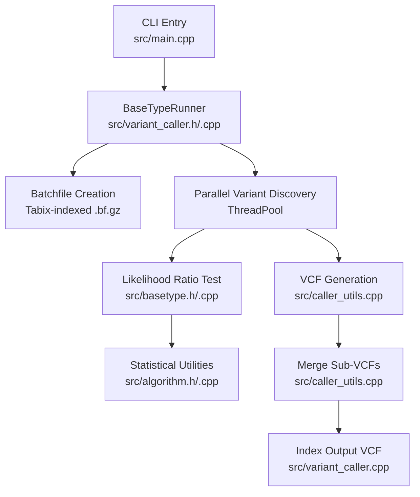
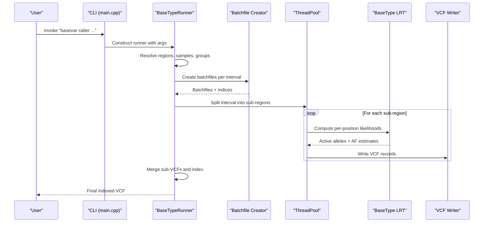
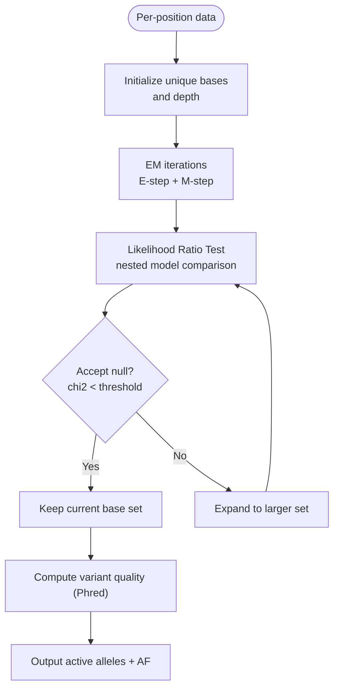
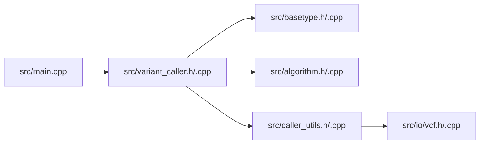

# Caller Command

<cite>
**Referenced Files in This Document**
- [README.md](file://README.md)
- [main.cpp](file://src/main.cpp)
- [variant_caller.h](file://src/variant_caller.h)
- [variant_caller.cpp](file://src/variant_caller.cpp)
- [caller_utils.h](file://src/caller_utils.h)
- [caller_utils.cpp](file://src/caller_utils.cpp)
- [basetype.h](file://src/basetype.h)
- [basetype.cpp](file://src/basetype.cpp)
- [algorithm.h](file://src/algorithm.h)
- [algorithm.cpp](file://src/algorithm.cpp)
- [vcf.h](file://src/io/vcf.h)
- [vcf.cpp](file://src/io/vcf.cpp)
- [sample_group.info](file://tests/data/sample_group.info)
</cite>

## Table of Contents
1. [Introduction](#introduction)
2. [Project Structure](#project-structure)
3. [Core Components](#core-components)
4. [Architecture Overview](#architecture-overview)
5. [Detailed Component Analysis](#detailed-component-analysis)
6. [Dependency Analysis](#dependency-analysis)
7. [Performance Considerations](#performance-considerations)
8. [Troubleshooting Guide](#troubleshooting-guide)
9. [Conclusion](#conclusion)
10. [Appendices](#appendices)

## Introduction
BaseVar2’s caller command performs variant calling and population-level allele frequency estimation from ultra-low-depth whole-genome sequencing (WGS) data. It processes one or more BAM/CRAM files, builds per-position read evidence batches, and applies a likelihood ratio test (LRT) to detect variants and estimate allele frequencies. The output is a VCF file with per-sample genotypes (GT:GQ:PL:AD:DP) and population-level INFO fields (AF, CAF, AC, AN, DP, DP4, FS, SOR), optionally stratified by population groups.

## Project Structure
The caller command is implemented as part of the BaseVar2 CLI. The main entry routes to a runner class that orchestrates batch creation, parallel variant discovery, and VCF merging. Supporting modules include statistical models (BaseType, EM/LRT), utilities for VCF/VCF-like batch formats, and IO wrappers.

**Diagram sources**
- [main.cpp:43-92](file://src/main.cpp#L43-L92)
- [variant_caller.h:41-174](file://src/variant_caller.h#L41-L174)
- [variant_caller.cpp:342-438](file://src/variant_caller.cpp#L342-L438)
- [basetype.h:30-143](file://src/basetype.h#L30-L143)
- [basetype.cpp:14-212](file://src/basetype.cpp#L14-L212)
- [algorithm.h:90-177](file://src/algorithm.h#L90-L177)
- [algorithm.cpp:12-88](file://src/algorithm.cpp#L12-L88)
- [caller_utils.cpp:217-306](file://src/caller_utils.cpp#L217-L306)

**Section sources**
- [README.md:107-148](file://README.md#L107-L148)
- [main.cpp:43-92](file://src/main.cpp#L43-L92)
- [variant_caller.h:41-174](file://src/variant_caller.h#L41-L174)
- [variant_caller.cpp:342-438](file://src/variant_caller.cpp#L342-L438)

## Core Components
- Command-line interface and dispatch: parses arguments and routes to the caller runner.
- Runner orchestration: loads reference, regions, sample IDs, population groups; creates batchfiles; runs parallel variant discovery; merges outputs.
- Statistical model: computes per-position likelihoods and performs LRT to select active alleles and estimate AF.
- Utilities: VCF header construction, sample annotation, merging, and strand-bias metrics.

Key defaults and ranges are enforced in argument parsing and runtime checks.

**Section sources**
- [variant_caller.h:44-71](file://src/variant_caller.h#L44-L71)
- [variant_caller.cpp:130-149](file://src/variant_caller.cpp#L130-L149)
- [basetype.h:24-28](file://src/basetype.h#L24-L28)
- [caller_utils.cpp:217-262](file://src/caller_utils.cpp#L217-L262)

## Architecture Overview
The caller command follows a pipeline:
- Parse and validate arguments.
- Resolve calling intervals (entire genome or specified regions).
- For each interval:
  - Partition input samples into batches.
  - Build batchfiles (per-chromosome, per-interval) with Tabix indices.
  - Parallelize variant discovery across sub-intervals.
  - Merge sub-VCFs into a single VCF and index it.

**Diagram sources**
- [main.cpp:43-92](file://src/main.cpp#L43-L92)
- [variant_caller.cpp:342-438](file://src/variant_caller.cpp#L342-L438)
- [variant_caller.cpp:440-561](file://src/variant_caller.cpp#L440-L561)
- [variant_caller.cpp:842-894](file://src/variant_caller.cpp#L842-L894)
- [variant_caller.cpp:1008-1146](file://src/variant_caller.cpp#L1008-L1146)

## Detailed Component Analysis

### Command Syntax and Parameters
- Required
  - -f, --reference: Reference FASTA file.
  - -o, --output: Output VCF file path.
- Optional
  - -L, --align-file-list: File containing one BAM/CRAM path per line.
  - -r, --regions: Comma-delimited list of regions (e.g., chr1:1000-2000,chr2).
  - -G, --pop-group: Population group file mapping sample IDs to group names.
  - -m, --min-af: Minimum minor allele frequency (prior precision). Default depends on input count.
  - -Q, --min-BQ: Minimum base quality (Phred). Default 10; acceptable range 0–60.
  - -q, --mapq: Minimum mapping quality. Default 5.
  - -B, --batch-count: Samples per batchfile. Default 500.
  - -t, --thread: Number of threads. Default uses hardware concurrency.
  - --filename-has-samplename: Use filename prefix as sample ID to avoid parsing RG tags.
  - --smart-rerun: Reuse existing batchfiles and skip recomputation if present.
  - -h, --help: Print usage.

Notes:
- If -m is not supplied, it is internally set to min(100 / N, default), where N is the number of input BAMs.
- Regions default to the entire genome if not specified.
- Population INFO fields (DP_group, AF_group) are added when a group file is provided.

**Section sources**
- [README.md:119-144](file://README.md#L119-L144)
- [variant_caller.cpp:50-82](file://src/variant_caller.cpp#L50-L82)
- [variant_caller.cpp:91-122](file://src/variant_caller.cpp#L91-L122)
- [variant_caller.cpp:130-149](file://src/variant_caller.cpp#L130-L149)
- [variant_caller.cpp:184-186](file://src/variant_caller.cpp#L184-L186)
- [variant_caller.cpp:302-340](file://src/variant_caller.cpp#L302-L340)

### Parameter Categories and Defaults
- Quality thresholds
  - min-BQ (-Q): default 10; range 0–60.
  - min-mapq (-q): default 5; must be > 0.
- Batch processing
  - batch-count (-B): default 500; must be > 0.
- Threading
  - thread (-t): default equals hardware concurrency; must be > 0.
- Population analysis
  - pop-group (-G): optional; enables population INFO fields.
- Region targeting
  - regions (-r): optional; restricts calling to specified intervals.

Practical usage scenarios:
- Single sample: supply one BAM/CRAM; optionally set -Q/-q/-B/-t.
- Multi-sample population study: provide multiple BAMs and a group file; use -G to enable population AF reporting.
- Large-scale batch: increase -B to reduce batchfile count and overhead; tune -t to match available cores.

**Section sources**
- [variant_caller.h:44-71](file://src/variant_caller.h#L44-L71)
- [variant_caller.cpp:130-149](file://src/variant_caller.cpp#L130-L149)
- [variant_caller.cpp:302-340](file://src/variant_caller.cpp#L302-L340)

### Output File Formats and VCF Generation
- Output: bgzip-compressed VCF (.vcf.gz) with Tabix index (.tbi).
- Header fields include standard VCFv4.2 definitions plus BaseVar-specific INFO/FORMAT tags:
  - INFO: AF (LRT-derived), CAF (raw AC/AN), AC, AN, DP, DP4, FS, SOR.
  - FORMAT: GT, GQ, PL, AD, DP.
- Population INFO fields (when -G is used):
  - DP_<group>, AF_<group> appended to header and populated per record.
- Records are merged from sub-VCFs produced per sub-interval.

Validation and formatting:
- VCFRecord validation ensures REF is canonical and ALT differs from REF.
- Sample annotations compute GT, GQ, PL, AD, DP using per-read qualities and alignments.

**Section sources**
- [caller_utils.cpp:217-262](file://src/caller_utils.cpp#L217-L262)
- [caller_utils.cpp:142-191](file://src/caller_utils.cpp#L142-L191)
- [variant_caller.cpp:424-432](file://src/variant_caller.cpp#L424-L432)
- [variant_caller.cpp:1219-1302](file://src/variant_caller.cpp#L1219-L1302)

### Statistical Model and Variant Calling Logic
- Per-position likelihood modeling:
  - Each read contributes a likelihood vector over the set of unique bases (including A,C,G,T and indel contexts).
  - Base error probabilities are derived from Phred qualities.
- EM algorithm:
  - E-step: compute posterior base probabilities.
  - M-step: update observed base frequencies.
  - Iterates until convergence or a fixed iteration limit.
- LRT selection:
  - Starts with candidate bases meeting min-af threshold.
  - Uses likelihood ratio tests to compare nested hypotheses (smaller vs larger base sets).
  - Accepts null hypothesis (smaller set) if chi-square threshold is not exceeded; otherwise expands.
- Variant scoring:
  - Uses chi-square p-values transformed to Phred scale for QUAL.
  - Special-case handling for mono-allelic high-depth sites.

**Diagram sources**
- [basetype.cpp:14-76](file://src/basetype.cpp#L14-L76)
- [basetype.cpp:137-210](file://src/basetype.cpp#L137-L210)
- [algorithm.cpp:194-292](file://src/algorithm.cpp#L194-L292)

**Section sources**
- [basetype.h:24-28](file://src/basetype.h#L24-L28)
- [basetype.cpp:137-210](file://src/basetype.cpp#L137-L210)
- [algorithm.h:174-177](file://src/algorithm.h#L174-L177)
- [algorithm.cpp:194-292](file://src/algorithm.cpp#L194-L292)

### Population Analysis Settings
- Group file format: two-column file mapping sample ID to group name.
- Runner collects group indices and recomputes AF per group using the same LRT framework.
- INFO fields include DP_group and AF_group for each group.

**Section sources**
- [variant_caller.cpp:302-340](file://src/variant_caller.cpp#L302-L340)
- [variant_caller.cpp:411-421](file://src/variant_caller.cpp#L411-L421)
- [sample_group.info:1-44](file://tests/data/sample_group.info#L1-L44)

### Usage Examples
- Single sample analysis:
  - basevar caller -f reference.fasta -o output.vcf.gz -Q 20 -q 30 -B 500 -t 24 sample1.bam
- Multi-sample population study:
  - basevar caller -f reference.fasta -o output.vcf.gz -Q 20 -q 30 -B 500 -t 24 -G sample_group.info -L bam.list
- Large-scale batch processing:
  - basevar caller -f reference.fasta -o output.vcf.gz -Q 20 -q 30 -B 1000 -t 48 -L bam.list

Notes:
- Use --filename-has-samplename to accelerate sample ID extraction when filenames encode sample IDs.
- Use --smart-rerun to resume partial runs by reusing existing batchfiles.

**Section sources**
- [README.md:140-178](file://README.md#L140-L178)

## Dependency Analysis
- CLI dispatch depends on the runner class.
- Runner depends on:
  - Reference FASTA loader.
  - Batchfile creation and Tabix indexing.
  - Parallel execution via thread pool.
  - Statistical model (BaseType) and utilities (strand bias, merging).
- Output depends on htslib for indexing and VCF writing.

**Diagram sources**
- [main.cpp:43-92](file://src/main.cpp#L43-L92)
- [variant_caller.h:33-34](file://src/variant_caller.h#L33-L34)
- [variant_caller.cpp:342-438](file://src/variant_caller.cpp#L342-L438)
- [basetype.h:29-31](file://src/basetype.h#L29-L31)
- [algorithm.h:174-177](file://src/algorithm.h#L174-L177)
- [caller_utils.h:21-28](file://src/caller_utils.h#L21-L28)
- [vcf.h:21-22](file://src/io/vcf.h#L21-L22)

**Section sources**
- [main.cpp:43-92](file://src/main.cpp#L43-L92)
- [variant_caller.cpp:342-438](file://src/variant_caller.cpp#L342-L438)
- [caller_utils.cpp:281-306](file://src/caller_utils.cpp#L281-L306)

## Performance Considerations
- Memory footprint:
  - Each thread consumes modest memory; batch size (-B) controls per-batch memory usage.
  - Internal chunking avoids loading entire intervals at once.
- Throughput:
  - Increase -t to utilize CPU cores; ensure sufficient RAM.
  - Increase -B to reduce I/O overhead from many small batchfiles.
- I/O:
  - Batchfiles are bgzip-compressed with Tabix indices; ensure disk throughput supports parallel reads.
- Quality filtering:
  - Tighter -Q and -q reduce noise but may lower sensitivity at very low depths.

[No sources needed since this section provides general guidance]

## Troubleshooting Guide
Common issues and resolutions:
- Missing required arguments:
  - Ensure -f, -o, and at least one alignment file are provided.
- Invalid parameter ranges:
  - -Q must be in [0, 60]; -q, -B, -t must be > 0.
- Region errors:
  - Start must not exceed end; ensure contig names match reference.
- Duplicate samples:
  - Runner warns on duplicate sample IDs; deduplicate input files.
- Index building failures:
  - Output VCF must be bgzip-compressed; ensure tbx_index_build succeeds.
- Unexpected empty output:
  - Very low coverage or strict -Q/-q thresholds may yield no variants; relax thresholds or target regions.

**Section sources**
- [variant_caller.cpp:130-149](file://src/variant_caller.cpp#L130-L149)
- [variant_caller.cpp:294-297](file://src/variant_caller.cpp#L294-L297)
- [variant_caller.cpp:428-431](file://src/variant_caller.cpp#L428-L431)
- [variant_caller.cpp:234-240](file://src/variant_caller.cpp#L234-L240)

## Conclusion
BaseVar2’s caller command provides a robust, parallelized workflow for ultra-low-depth WGS variant calling and population AF estimation. By combining efficient batching, parallelism, and a sound statistical model (EM + LRT), it balances accuracy and performance. Proper tuning of quality thresholds, batch sizes, and threads yields reliable results across single and multi-sample studies.

[No sources needed since this section summarizes without analyzing specific files]

## Appendices

### Parameter Interactions and Sensitivity/Specificity Implications
- min-BQ (-Q) and min-mapq (-q):
  - Lower thresholds increase sensitivity but may raise false positives; higher thresholds improve specificity.
- min-af (-m):
  - Controls prior precision; affects which candidate alleles are considered; default adapts to input count.
- batch-count (-B):
  - Larger batches reduce I/O overhead but increase memory per batch; choose based on available RAM.
- regions (-r):
  - Targeted calling improves power in regions of interest and reduces runtime.
- pop-group (-G):
  - Enables population-aware AF reporting; increases output verbosity but adds minimal runtime cost.

[No sources needed since this section provides general guidance]