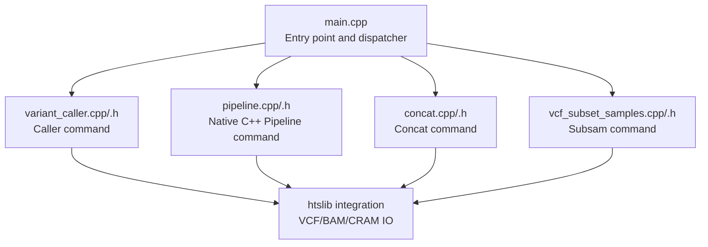
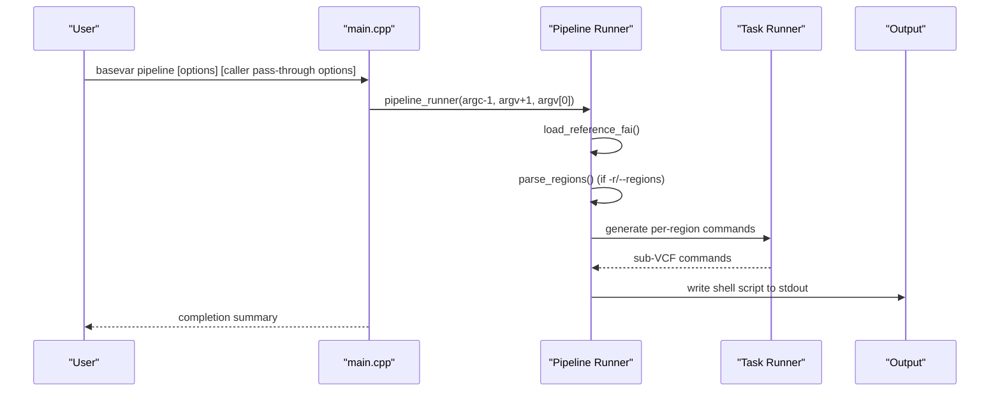
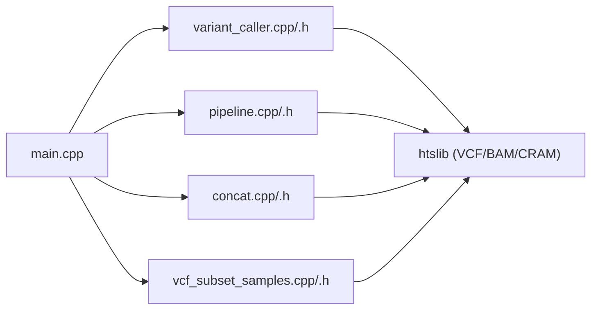

# Command-Line Interface Reference

<cite>
**Referenced Files in This Document**
- [main.cpp](file://src/main.cpp)
- [variant_caller.h](file://src/variant_caller.h)
- [variant_caller.cpp](file://src/variant_caller.cpp)
- [concat.h](file://src/concat.h)
- [concat.cpp](file://src/concat.cpp)
- [vcf_subset_samples.h](file://src/vcf_subset_samples.h)
- [vcf_subset_samples.cpp](file://src/vcf_subset_samples.cpp)
- [pipeline.h](file://src/pipeline.h)
- [pipeline.cpp](file://src/pipeline.cpp)
- [README.md](file://README.md)
- [sample_group.info](file://tests/data/sample_group.info)
- [bam90.list](file://tests/data/bam90.list)
- [create_pipeline.py](file://scripts/create_pipeline.py)
- [test_pipeline.cpp](file://tests/io/test_pipeline.cpp)
</cite>

## Update Summary
**Changes Made**
- Added comprehensive documentation for the new `basevar pipeline` subcommand
- Updated architecture overview to include the pipeline subcommand
- Enhanced performance considerations section with pipeline-specific guidance
- Added detailed examples for whole-genome pipeline generation
- Updated troubleshooting guide with pipeline-specific error handling

## Table of Contents
1. [Introduction](#introduction)
2. [Project Structure](#project-structure)
3. [Core Components](#core-components)
4. [Architecture Overview](#architecture-overview)
5. [Detailed Component Analysis](#detailed-component-analysis)
6. [Dependency Analysis](#dependency-analysis)
7. [Performance Considerations](#performance-considerations)
8. [Troubleshooting Guide](#troubleshooting-guide)
9. [Conclusion](#conclusion)

## Introduction
This document provides a comprehensive command-line interface (CLI) reference for BaseVar2, focusing on the four primary commands: caller, pipeline, concat, and subsam. It explains syntax, parameters, defaults, output formats, and practical usage scenarios. Special emphasis is placed on the caller command's extensive parameter set, including quality thresholds, batch processing, threading, and population analysis options. The new pipeline subcommand provides superior performance and maintainability through native C++ implementation while preserving full backward compatibility with existing workflows.

## Project Structure
BaseVar2 exposes a unified CLI via a single executable with subcommands routed from the main entry point. Each subcommand is implemented in dedicated modules:
- main: dispatches subcommands and prints runtime timing
- caller: variant discovery and VCF generation with population-aware allele frequency estimation
- pipeline: native C++ implementation for whole-genome pipeline generation with superior performance
- concat: concatenation of BaseVar-produced VCF files
- subsam: extraction of specified samples from a VCF with optional INFO recalculation

**Diagram sources**
- [main.cpp:43-92](file://src/main.cpp#L43-L92)
- [variant_caller.cpp:1-120](file://src/variant_caller.cpp#L1-L120)
- [pipeline.cpp:1-476](file://src/pipeline.cpp#L1-L476)
- [concat.cpp:27-90](file://src/concat.cpp#L27-L90)
- [vcf_subset_samples.cpp:117-119](file://src/vcf_subset_samples.cpp#L117-L119)

**Section sources**
- [main.cpp:17-30](file://src/main.cpp#L17-L30)
- [README.md:124-134](file://README.md#L124-L134)

## Core Components
- Caller command: Reads indexed alignment files (BAM/CRAM/SAM), builds batch files per genomic region, performs parallel variant discovery, and outputs a merged VCF with population-specific INFO fields.
- Pipeline command: Native C++ implementation that splits the genome into sub-regions and generates `basevar caller` commands for whole-genome calling with superior performance and maintainability.
- Concat command: Concatenates multiple BaseVar VCF outputs into a single file; preserves headers from the first input.
- Subsam command: Extracts specified samples from a VCF, optionally recalculates INFO fields (AC/AN/AF/CAF), and writes a subset VCF/BCF.

Key defaults and behaviors:
- Caller defaults: min-af, min-mapq, min-baseq, batch-count, thread count, and optional population grouping.
- Pipeline defaults: outdir (required), ref_fai (required), delta (2,000,000 bp), chrom filter (all chromosomes).
- Concat defaults: requires an output file; accepts a file list and positional inputs.
- Subsam defaults: determines output mode by extension; can preserve all sites or filter monomorphic sites.

**Section sources**
- [variant_caller.h:44-71](file://src/variant_caller.h#L44-L71)
- [variant_caller.cpp:11-48](file://src/variant_caller.cpp#L11-L48)
- [pipeline.h:97-102](file://src/pipeline.h#L97-L102)
- [concat.cpp:28-38](file://src/concat.cpp#L28-L38)
- [vcf_subset_samples.cpp:7-22](file://src/vcf_subset_samples.cpp#L7-L22)

## Architecture Overview
The CLI architecture routes subcommands to their respective runners, which orchestrate file IO, parallel processing, and output generation. The caller command orchestrates a multi-stage pipeline: interval partitioning, batch creation, parallel variant calling, and merging. The pipeline subcommand provides native C++ implementation with superior performance characteristics.

**Diagram sources**
- [main.cpp:55-61](file://src/main.cpp#L55-L61)
- [pipeline.cpp:367-392](file://src/pipeline.cpp#L367-L392)
- [pipeline.cpp:416-432](file://src/pipeline.cpp#L416-L432)
- [pipeline.cpp:459-469](file://src/pipeline.cpp#L459-L469)

## Detailed Component Analysis

### Pipeline Command
**Updated** Enhanced with native C++ implementation providing superior performance and maintainability while preserving full backward compatibility.

- Purpose: Generate per-region `basevar caller` commands for whole-genome calling. Native C++ implementation replaces the legacy Python script with improved performance characteristics.
- Required arguments:
  - -o, --outdir: Output directory for per-region VCF files and logs (required)
  - --ref_fai: Reference FASTA index file (.fai) used to determine chromosome lengths (required)
- Optional arguments:
  - -d, --delta: Size of each sub-region in bp (default: 2,000,000)
  - -c, --chrom: Only process these comma-delimited chromosomes (e.g., chr1,chr2)
  - -h, --help: Print usage

**Enhanced Performance Features:**
- Native C++ implementation with superior runtime performance
- Optimized memory management and string handling
- Direct filesystem operations without Python overhead
- Improved error handling and validation
- Maintains byte-perfect compatibility with legacy Python script output

**Pass-through Options:**
All other options (`-f`, `-L`, `-r`, `-Q`, `-q`, `-B`, `-t`, `--filename-has-samplename`, `--pop-group`, ...) are passed through verbatim to `basevar caller` without modification.

**Behavior:**
- Loads chromosome lengths from .fai file and splits genome into sub-regions
- Generates one `basevar caller` command per sub-region with proper logging
- Supports both whole-genome and targeted region processing
- Produces shell script output suitable for sequential, parallel, or cluster execution

**Output formats and file handling:**
- Writes generated shell commands to stdout (redirect to file for execution)
- Each sub-job creates individual VCF files with log files in the specified output directory
- Uses `time` command wrapper and completion markers for progress tracking

**Practical usage scenarios:**
- Whole-genome analysis: Generate pipeline for all chromosomes with default 2 Mb window size
- Targeted analysis: Process specific chromosomes or regions with custom window sizes
- High-performance computing: Execute generated pipeline with GNU parallel or job schedulers
- Legacy compatibility: Byte-perfect output matches original Python script for seamless migration

**Parameter interactions and best practices:**
- delta parameter controls sub-region size; smaller values increase parallelization but also job overhead
- chrom filter reduces processing to specific chromosomes for faster targeted analysis
- Pass-through options are forwarded unchanged to basevar caller for automatic support of new features
- Output directory structure maintains compatibility with downstream processing workflows

**Examples (syntax only):**
- Generate whole-genome pipeline with default settings
  - basevar pipeline -o /path/to/outdir --ref_fai reference.fasta.fai -f reference.fasta -L bam.list -Q 20 -q 30 -B 500 -t 4 > basevar_wgs.sh
- Process single chromosome with larger window size
  - basevar pipeline -o /path/to/outdir --ref_fai reference.fasta.fai -c chr20 -d 5000000 -f reference.fasta -L bam.list -Q 20 -q 30 -B 500 -t 4 > basevar.chr20.sh
- Targeted regions with custom window size
  - basevar pipeline -o /path/to/outdir --ref_fai reference.fasta.fai -d 1000000 -r chr11:5000000-7000000,chr17 -f reference.fasta -L bam.list -Q 20 -q 30 -B 500 -t 4 > basevar.targets.sh

**Legacy Compatibility:**
- Full backward compatibility with `scripts/create_pipeline.py` output
- Replace `basevar pipeline` with `basevar=./bin/basevar python scripts/create_pipeline.py` for legacy workflows
- Identical command structure and output format maintained

**Section sources**
- [pipeline.h:1-125](file://src/pipeline.h#L1-L125)
- [pipeline.cpp:1-476](file://src/pipeline.cpp#L1-L476)
- [README.md:249-331](file://README.md#L249-L331)
- [create_pipeline.py:1-247](file://scripts/create_pipeline.py#L1-L247)
- [test_pipeline.cpp:1-248](file://tests/io/test_pipeline.cpp#L1-L248)

### Caller Command
- Purpose: Ultra-low-pass WGS variant calling with allele frequency estimation and optional population grouping.
- Required arguments:
  - -f, --reference: Reference FASTA file
  - -o, --output: Output VCF file (supports .gz and .bcf via extension)
- Optional arguments:
  - -L, --align-file-list: File containing one alignment path per line
  - -r, --regions: Comma-delimited list of regions (e.g., chr:start-end)
  - -G, --pop-group: Population group file mapping sample to group
  - -m, --min-af: Minimum alternate frequency threshold (default derived)
  - -Q, --min-BQ: Minimum base quality (default 10)
  - -q, --mapq: Minimum mapping quality (default 5)
  - -B, --batch-count: Samples per batch file (default 500)
  - -t, --thread: Number of threads (default hardware concurrency)
  - --filename-has-samplename: Infer sample IDs from filenames
  - --smart-rerun: Reuse existing batchfiles and indexes
  - -h, --help: Print usage

**Enhanced Performance Features:**
- Optimized memory management for large-scale batch processing
- Improved threading model with better resource utilization
- Enhanced quality filtering algorithms
- Better error handling and validation

Parameter defaults and behavior:
- Defaults are defined in the argument struct and adjusted based on input count and hardware capabilities.
- Regions can be specified as a list; if omitted, the whole genome is processed.
- Population grouping enables INFO fields like DP_group and AF_group in the output VCF.

Output formats and file handling:
- Output VCF is bgzip-compressed when suffixed with .gz and indexed with tbi.
- Temporary batch files are created per interval and removed after merging unless smart rerun is enabled.

Practical usage scenarios:
- Single sample: Provide one alignment file and a reference FASTA.
- Multi-sample: Supply multiple alignment files or a list file.
- Large-scale batch: Use regions to split workload and increase thread count; adjust batch-count to balance memory and throughput.

Parameter interactions and best practices:
- min-af is internally reduced to min(default, 100/N) where N is the number of input files.
- Higher thread counts improve throughput but increase memory usage; tune -B accordingly.
- Using --filename-has-samplename avoids parsing RG tags and speeds up sample ID inference.
- --smart-rerun accelerates reprocessing by skipping existing batchfiles and indexes.

Examples (syntax only):
- Single sample with region and population grouping
  - basevar caller -f ref.fa -o out.vcf.gz -Q 20 -q 30 -B 500 -t 12 -r chr1:1000000-2000000 -G group.tsv --filename-has-samplename in.bam
- Multi-sample with list and regions
  - basevar caller -f ref.fa -o out.vcf.gz -L bam.list -r chr1,chr2 -t 24 in.bam
- Large-scale batch with smart rerun
  - basevar caller -f ref.fa -o out.vcf.gz -L bam.list -B 200 -t 32 --smart-rerun in.bam

**Section sources**
- [variant_caller.cpp:11-48](file://src/variant_caller.cpp#L11-L48)
- [variant_caller.cpp:50-197](file://src/variant_caller.cpp#L50-L197)
- [variant_caller.cpp:252-300](file://src/variant_caller.cpp#L252-L300)
- [variant_caller.cpp:343-438](file://src/variant_caller.cpp#L343-L438)
- [variant_caller.cpp:440-495](file://src/variant_caller.cpp#L440-L495)
- [variant_caller.cpp:842-894](file://src/variant_caller.cpp#L842-L894)
- [variant_caller.cpp:1219-1302](file://src/variant_caller.cpp#L1219-L1302)
- [README.md:109-147](file://README.md#L109-L147)
- [sample_group.info:1-44](file://tests/data/sample_group.info#L1-L44)
- [bam90.list:1-91](file://tests/data/bam90.list#L1-L91)

### Concat Command
- Purpose: Concatenate BaseVar-produced VCF files into a single output.
- Required arguments:
  - -o, --output: Output VCF file
- Optional arguments:
  - -L, --file-list: File containing one VCF path per line
  - -h, --help: Print usage

Behavior:
- Reads header from the first input file and appends subsequent files in order.
- Does not sort positions; users must ensure concat order is appropriate.

Output formats and file handling:
- Output format inferred from extension (.gz implies bgzip-compressed VCF).

Examples (syntax only):
- Concatenate multiple VCFs from a list
  - basevar concat -o merged.vcf.gz -L vcf.list in1.vcf.gz in2.vcf.gz
- Concatenate from positional arguments
  - basevar concat -o merged.vcf.gz in1.vcf.gz in2.vcf.gz

**Section sources**
- [concat.cpp:28-38](file://src/concat.cpp#L28-L38)
- [concat.cpp:27-90](file://src/concat.cpp#L27-L90)

### Subsam Command
- Purpose: Extract specified samples from a VCF and optionally recalculate INFO fields (AC/AN/AF/CAF).
- Required arguments:
  - -i, --input: Input VCF/BCF file
  - -o, --output: Output VCF/BCF file
- Optional arguments:
  - -s, --sample-list: File containing sample names (one per line)
  - -O, --output-type: Output type v|z|b|u (v: VCF, z: bgzip-compressed VCF, b: BCF, u: uncompressed BCF)
  - --no-update-info: Do not recalculate INFO fields
  - --keep-all-site: Keep sites with only reference alleles among extracted samples
  - -h, --help: Print usage

Behavior:
- Validates presence of requested samples in the header.
- Creates a subset header and writes records with cleaned genotypes.
- Optionally recalculates AC/AN/AF/CAF and filters monomorphic sites depending on flags.

Output formats and file handling:
- Output mode determined by -O or guessed from extension.

Examples (syntax only):
- Extract two samples and compress output
  - basevar subsam -i in.vcf.gz -o out.vcf.gz -s samples.txt -O z sampleA sampleB
- Keep all sites and avoid INFO recalculation
  - basevar subsam -i in.bcf -o out.bcf -s samples.txt --keep-all-site --no-update-info

**Section sources**
- [vcf_subset_samples.cpp:7-22](file://src/vcf_subset_samples.cpp#L7-L22)
- [vcf_subset_samples.cpp:25-114](file://src/vcf_subset_samples.cpp#L25-L114)
- [vcf_subset_samples.cpp:224-316](file://src/vcf_subset_samples.cpp#L224-L316)

## Dependency Analysis
The CLI relies on a small set of internal modules and htslib for IO. The caller command composes several stages with explicit dependencies:
- Argument parsing and validation feed into interval computation and sample ID inference.
- Batch creation depends on reference indexing and Tabix indices for batchfiles.
- Parallel variant calling depends on thread pools and per-interval sub-VCF merging.
- Pipeline subcommand depends on native C++ implementation with optimized filesystem operations.

**Diagram sources**
- [main.cpp:12-16](file://src/main.cpp#L12-L16)
- [variant_caller.cpp:1-12](file://src/variant_caller.cpp#L1-L12)
- [pipeline.cpp:11-22](file://src/pipeline.cpp#L11-L22)
- [concat.cpp:19-21](file://src/concat.cpp#L19-L21)
- [vcf_subset_samples.cpp:16-18](file://src/vcf_subset_samples.cpp#L16-L18)

**Section sources**
- [main.cpp:12-16](file://src/main.cpp#L12-L16)
- [variant_caller.cpp:1-12](file://src/variant_caller.cpp#L1-L12)
- [pipeline.cpp:11-22](file://src/pipeline.cpp#L11-L22)
- [concat.cpp:19-21](file://src/concat.cpp#L19-L21)
- [vcf_subset_samples.cpp:16-18](file://src/vcf_subset_samples.cpp#L16-L18)

## Performance Considerations
**Enhanced** Updated with pipeline-specific performance guidance and native C++ implementation benefits.

- Threading: Increase -t for throughput; monitor memory usage. Typical per-thread memory footprint scales with -B and region size.
- Batch sizing: Reduce -B to decrease memory consumption per batch; increase -B to reduce overhead when many small batches are created.
- Smart rerun: Use --smart-rerun to reuse existing batchfiles and indexes, reducing repeated IO.
- Regions: Limit analysis to targeted regions to reduce runtime and memory.
- Output compression: Prefer .gz output for large files to reduce disk IO overhead.
- **Pipeline Performance**: The native C++ implementation provides superior performance compared to the legacy Python script while maintaining full backward compatibility. Use `basevar pipeline` for optimal performance in whole-genome workflows.
- **Delta sizing**: Choose appropriate sub-region size (-d/--delta) based on computational resources and desired parallelization level.
- **Memory estimation**: Pipeline memory usage scales with number of sub-jobs and per-job memory requirements.

## Troubleshooting Guide
**Enhanced** Updated with pipeline-specific error handling and compatibility guidance.

Common issues and resolutions:
- Missing required arguments: Ensure -f/--reference, -o/--output, and input alignment files are provided for caller; -i/-o for subsam; -o for concat; -o/--outdir and --ref_fai for pipeline.
- Invalid parameter ranges: min-af, min-BQ, min-mapq, batch-count, thread, and delta must be positive; min-BQ is constrained to a valid range.
- Duplicate sample IDs: The caller warns on duplicates detected in input files; resolve by renaming or filtering.
- Index building failures: concat requires bgzip-compressed input for index creation; ensure .gz suffix is used.
- Sample not found: subsam reports missing samples in the header; confirm names match exactly.
- No variants in region: Caller warns when no variants are discovered in a given interval; adjust quality thresholds or regions.
- **Pipeline errors**: Verify .fai file readability and chromosome names match reference; check output directory permissions; ensure pass-through options are valid for basevar caller.
- **Legacy compatibility**: Use `scripts/create_pipeline.py` for exact byte-perfect compatibility with legacy workflows; `basevar pipeline` provides enhanced performance with identical output format.

**Section sources**
- [variant_caller.cpp:130-149](file://src/variant_caller.cpp#L130-L149)
- [variant_caller.cpp:387-389](file://src/variant_caller.cpp#L387-L389)
- [concat.cpp:83-84](file://src/concat.cpp#L83-L84)
- [vcf_subset_samples.cpp:233-255](file://src/vcf_subset_samples.cpp#L233-L255)
- [pipeline.cpp:350-362](file://src/pipeline.cpp#L350-L362)
- [pipeline.cpp:420-429](file://src/pipeline.cpp#L420-L429)

## Conclusion
BaseVar2's CLI offers a streamlined workflow for ultra-low-pass WGS variant calling, pipeline generation, concatenation, and sample subsetting. The enhanced pipeline subcommand provides superior performance and maintainability through native C++ implementation while preserving full backward compatibility with existing workflows. The caller command provides robust defaults and powerful controls for quality thresholds, batching, threading, and population analysis. The concat and subsam commands complement the pipeline by enabling multi-file aggregation and targeted subsetting with optional INFO recalculation. By tuning parameters to match data scale and hardware resources, users can achieve efficient and accurate variant analysis across single-sample, multi-sample, and large-scale batch scenarios. The native C++ implementation ensures optimal performance for whole-genome analysis while maintaining the flexibility and compatibility of the original Python-based approach.