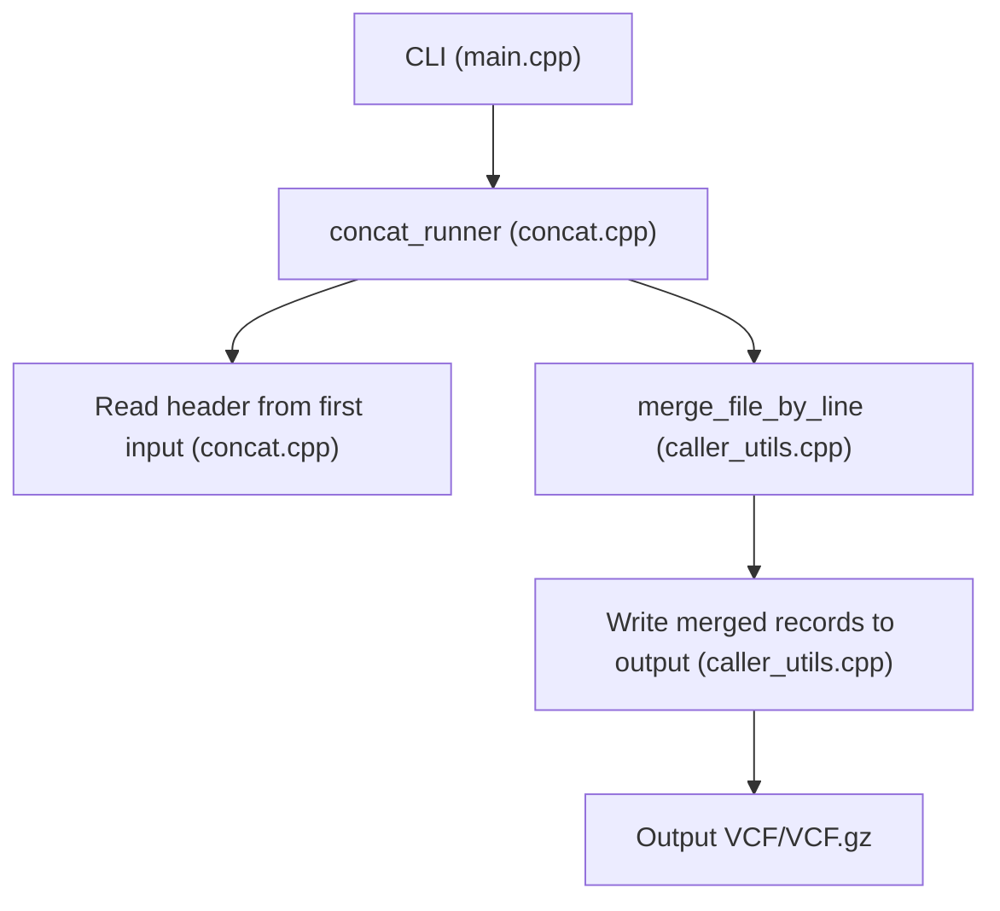
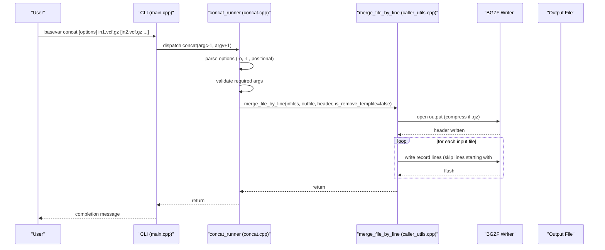
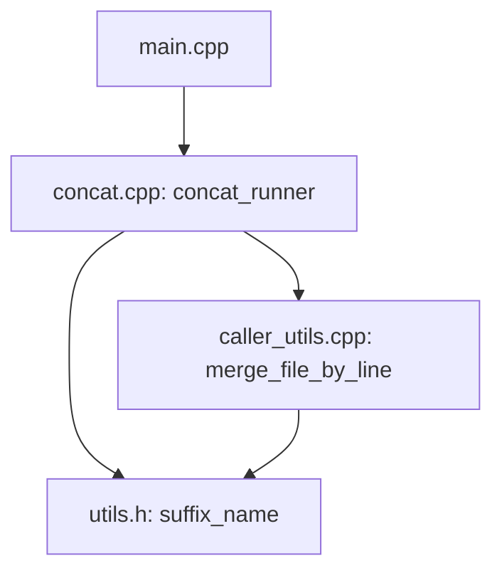

# Concat Command

<cite>
**Referenced Files in This Document**
- [concat.cpp](file://src/concat.cpp)
- [concat.h](file://src/concat.h)
- [main.cpp](file://src/main.cpp)
- [caller_utils.h](file://src/caller_utils.h)
- [caller_utils.cpp](file://src/caller_utils.cpp)
- [vcf.h](file://src/io/vcf.h)
- [vcf_header.h](file://src/io/vcf_header.h)
- [vcf_record.h](file://src/io/vcf_record.h)
- [utils.h](file://src/io/utils.h)
- [README.md](file://README.md)
</cite>

## Table of Contents
1. [Introduction](#introduction)
2. [Project Structure](#project-structure)
3. [Core Components](#core-components)
4. [Architecture Overview](#architecture-overview)
5. [Detailed Component Analysis](#detailed-component-analysis)
6. [Dependency Analysis](#dependency-analysis)
7. [Performance Considerations](#performance-considerations)
8. [Troubleshooting Guide](#troubleshooting-guide)
9. [Conclusion](#conclusion)
10. [Appendices](#appendices)

## Introduction
This document describes the BaseVar2 concat command used to concatenate VCF files produced by BaseVar callers for the same set of samples. It explains the command syntax, input requirements, output generation, and how the concatenation process preserves headers and merges records. It also covers validation, error handling, and best practices for large datasets and multi-center integrations.

## Project Structure
The concat command is implemented as part of the BaseVar2 CLI. The main entry routes the “concat” subcommand to the concat runner, which parses options, validates inputs, and performs the concatenation by merging VCF records while preserving the header from the first input file.

**Diagram sources**
- [main.cpp:39-41](file://src/main.cpp#L39-L41)
- [concat.cpp:27-90](file://src/concat.cpp#L27-L90)
- [caller_utils.cpp:281-306](file://src/caller_utils.cpp#L281-L306)

**Section sources**
- [main.cpp:39-41](file://src/main.cpp#L39-L41)
- [concat.cpp:27-90](file://src/concat.cpp#L27-L90)

## Core Components
- concat_runner: Parses command-line options, collects input files, validates required arguments, and delegates to the merging routine.
- merge_file_by_line: Performs the actual concatenation by streaming lines from input files and writing them to the output, skipping header lines and optionally removing temporary files.
- Header extraction: Reads header lines from the first input file and forwards them to the merger.

Key behaviors:
- Preserves header from the first input file.
- Streams records line-by-line, skipping header lines.
- Does not sort positions; the caller must ensure correct order.
- Supports compressed and uncompressed VCF files.

**Section sources**
- [concat.cpp:11-25](file://src/concat.cpp#L11-L25)
- [concat.cpp:27-90](file://src/concat.cpp#L27-L90)
- [caller_utils.cpp:281-306](file://src/caller_utils.cpp#L281-L306)

## Architecture Overview
The concat command follows a straightforward pipeline:
1. Parse CLI options and collect input files.
2. Read header lines from the first input file.
3. Stream records from all input files, skipping header lines.
4. Write header once and records sequentially to the output file.

**Diagram sources**
- [main.cpp:39-41](file://src/main.cpp#L39-L41)
- [concat.cpp:27-90](file://src/concat.cpp#L27-L90)
- [caller_utils.cpp:281-306](file://src/caller_utils.cpp#L281-L306)

## Detailed Component Analysis

### concat_runner
Responsibilities:
- Define usage and help text.
- Parse options: -o/--output, -L/--file-list, -h/--help.
- Collect positional input files.
- Validate presence of input files and output file.
- Delegate to _concat_basevar_outfile.

Behavior highlights:
- Accepts either positional VCF files or a file list via -L.
- Emits a caution that positions are not sorted; the caller must ensure correct order.
- Prints informational message about number of files to concatenate.

Error handling:
- Throws exceptions for missing required arguments.
- Exits with error on unknown arguments.

**Section sources**
- [concat.cpp:27-90](file://src/concat.cpp#L27-L90)

### _concat_basevar_outfile
Responsibilities:
- Read header lines from the first input file until a non-header line is encountered.
- Invoke merge_file_by_line with the collected header and input file list.

Notes:
- Uses a streaming approach to avoid loading entire files into memory.

**Section sources**
- [concat.cpp:11-25](file://src/concat.cpp#L11-L25)

### merge_file_by_line
Responsibilities:
- Open output file in compressed or uncompressed mode depending on suffix.
- Write the provided header once.
- Iterate through each input file, skipping lines starting with “#”.
- Optionally remove input files after processing (not used by concat).

Behavior:
- Detects compression by file suffix.
- Flushes output after each input file to ensure progress.
- Closes output file upon completion.

**Section sources**
- [caller_utils.cpp:281-306](file://src/caller_utils.cpp#L281-L306)
- [utils.h:54-58](file://src/io/utils.h#L54-L58)

### Header Preservation and Metadata Merging
- Header preservation: The header is extracted from the first input file and written once to the output.
- Metadata merging: The implementation does not merge or reconcile headers from multiple files; it simply uses the header from the first file. This implies that metadata differences across inputs are not reconciled by concat.

Implications:
- Ensure all input files share compatible headers (same sample sets, contigs, and metadata definitions).
- If headers differ, the resulting file may be invalid or inconsistent.

**Section sources**
- [concat.cpp:11-22](file://src/concat.cpp#L11-L22)
- [caller_utils.cpp:281-306](file://src/caller_utils.cpp#L281-L306)

### Sample Consistency Checks
- The concat command does not perform explicit sample consistency checks. It assumes the caller ensures all inputs contain the same set of samples.
- If sample sets differ, downstream tools may report mismatches or errors.

Recommendations:
- Verify that all input files contain identical sample names and order before concatenation.
- Use BaseVar’s subsampling tool to subset samples consistently if needed.

**Section sources**
- [concat.cpp:27-90](file://src/concat.cpp#L27-L90)

### Chromosome Order Preservation
- The concat command does not enforce or validate chromosome ordering. It streams records in the order provided by the input files.
- The usage text explicitly warns that positions are not sorted; the caller must ensure correct order.

Recommendations:
- Ensure inputs are ordered by chromosome and position as desired before concatenation.
- Consider sorting the final output with external tools if strict ordering is required.

**Section sources**
- [concat.cpp:27-31](file://src/concat.cpp#L27-L31)

### File Format Requirements
- Input format: VCF or compressed VCF (.vcf.gz). The merger detects compression by file suffix.
- Output format: Determined by the output file suffix (.vcf or .vcf.gz).
- Header lines: Lines starting with “#” are treated as header and written once from the first input file.
- Records: Non-header lines are concatenated in order.

Validation:
- The concat command does not validate VCF records; it treats all non-header lines as records.
- For robust validation, use external tools (e.g., bcftools) after concatenation.

**Section sources**
- [caller_utils.cpp:281-306](file://src/caller_utils.cpp#L281-L306)
- [utils.h:54-58](file://src/io/utils.h#L54-L58)

### Usage Examples

- Combine results from multiple genomic regions:
  - Provide a list of region-specific VCF files as positional arguments or via -L.
  - Ensure the files are ordered by chromosome and position.

- Batch processing outputs:
  - Use -L to supply a file containing one VCF path per line.
  - This is useful when concatenating many regional outputs.

- Multi-center study integrations:
  - Ensure all centers produce VCFs with identical sample sets and headers.
  - Concatenate after aligning headers and sample orders across centers.

Note: The concat command does not sort positions; ensure inputs are pre-sorted if strict ordering is required.

**Section sources**
- [concat.cpp:27-90](file://src/concat.cpp#L27-L90)

## Dependency Analysis
The concat command depends on:
- CLI routing in main.cpp
- Option parsing and argument validation in concat.cpp
- Header extraction and merging in concat.cpp and caller_utils.cpp
- Utility functions for file suffix detection in utils.h

**Diagram sources**
- [main.cpp:39-41](file://src/main.cpp#L39-L41)
- [concat.cpp:27-90](file://src/concat.cpp#L27-L90)
- [caller_utils.cpp:281-306](file://src/caller_utils.cpp#L281-L306)
- [utils.h:54-58](file://src/io/utils.h#L54-L58)

**Section sources**
- [main.cpp:39-41](file://src/main.cpp#L39-L41)
- [concat.cpp:27-90](file://src/concat.cpp#L27-L90)
- [caller_utils.cpp:281-306](file://src/caller_utils.cpp#L281-L306)
- [utils.h:54-58](file://src/io/utils.h#L54-L58)

## Performance Considerations
- Streaming approach: Records are streamed line-by-line, minimizing memory usage.
- Compression: Output compression is inferred from the suffix; .vcf.gz is compressed.
- No sorting: Avoids expensive sorting steps, reducing runtime and memory footprint.
- Large datasets: For very large concatenated datasets, consider:
  - Pre-sorting inputs to ensure ordered output.
  - Using compressed output to reduce disk I/O.
  - Ensuring sufficient disk space for intermediate and final outputs.

[No sources needed since this section provides general guidance]

## Troubleshooting Guide
Common issues and resolutions:
- Missing output file:
  - Ensure -o/--output is provided; the runner throws an error if missing.
- Missing input files:
  - Provide at least one input file via positional arguments or -L; otherwise, an error is thrown.
- Inconsistent headers:
  - The header is taken from the first input; if other inputs have different headers, the output may be invalid. Align headers across inputs before concatenation.
- Unsorted positions:
  - The command does not sort; ensure inputs are ordered by chromosome and position.
- File suffix issues:
  - Ensure output suffix indicates compression (.vcf.gz) if compression is desired.

Validation and error handling:
- The concat runner validates arguments and exits with errors on invalid options or missing required arguments.
- The merger writes header once and streams records; it does not validate record content.

**Section sources**
- [concat.cpp:79-84](file://src/concat.cpp#L79-L84)
- [concat.cpp:27-31](file://src/concat.cpp#L27-L31)
- [caller_utils.cpp:281-306](file://src/caller_utils.cpp#L281-L306)

## Conclusion
The BaseVar2 concat command provides a fast, memory-efficient way to concatenate VCF files from the same set of samples. It preserves the header from the first input file, streams records line-by-line, and does not sort positions. Users must ensure inputs are pre-sorted and have compatible headers. For robust validation and post-processing, consider using external tools after concatenation.

[No sources needed since this section summarizes without analyzing specific files]

## Appendices

### Command Syntax and Options
- basevar concat [options] -o output.vcf.gz [-L vcf.list] in1.vcf.gz [in2.vcf.gz ...]
- Options:
  - -o, --output=FILE: Output VCF file path.
  - -L, --file-list=FILE: File containing one VCF path per line.
  - -h, --help: Show help message.

**Section sources**
- [concat.cpp:27-38](file://src/concat.cpp#L27-L38)

### Best Practices for Large Datasets and Multi-Center Integrations
- Pre-validate inputs:
  - Confirm identical sample sets and headers across all inputs.
- Pre-sort inputs:
  - Ensure inputs are ordered by chromosome and position to avoid post-processing sorting.
- Compress output:
  - Use .vcf.gz for reduced storage and faster I/O.
- Post-concat validation:
  - Validate the concatenated VCF with external tools to ensure correctness.

**Section sources**
- [concat.cpp:27-31](file://src/concat.cpp#L27-L31)
- [README.md:107-145](file://README.md#L107-L145)