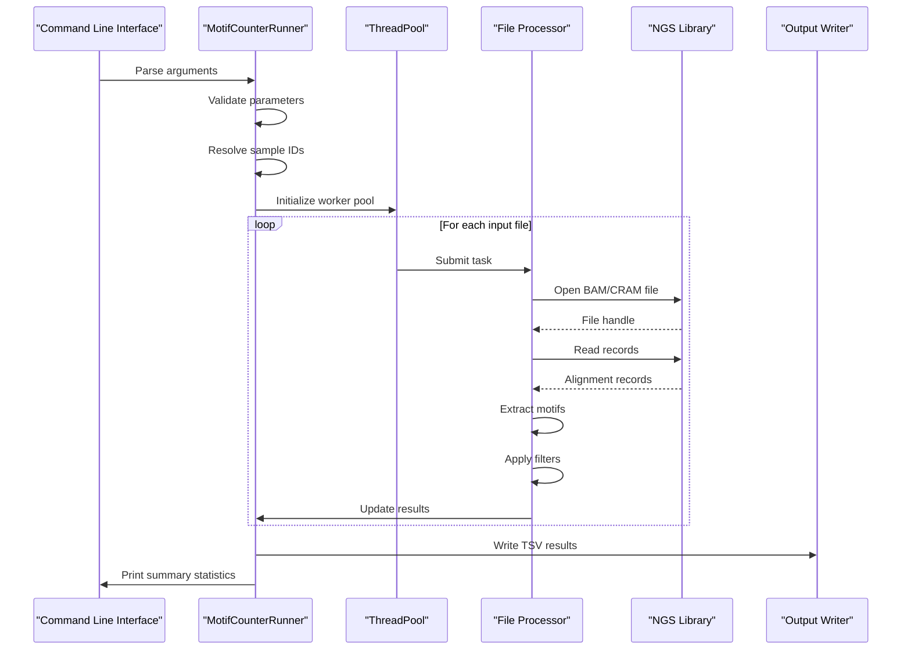
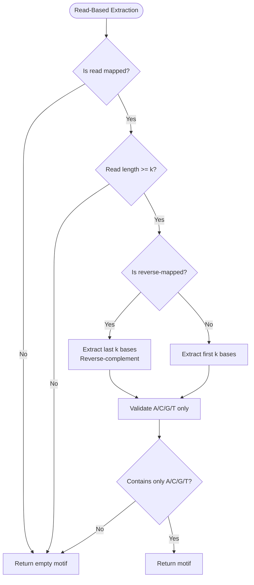
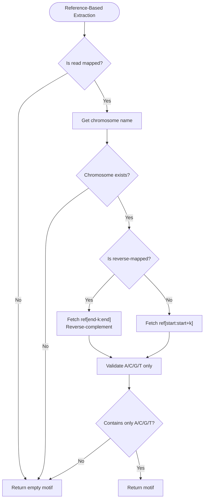
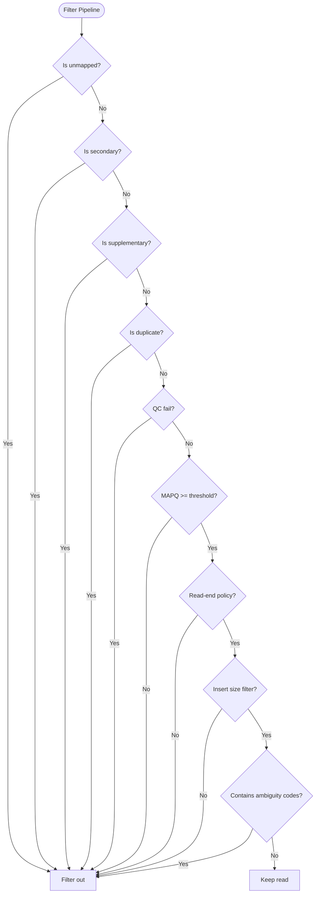
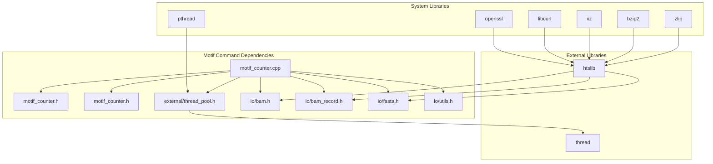

# Motif Command

<cite>
**Referenced Files in This Document**
- [motif_counter.h](file://src/motif_counter.h)
- [motif_counter.cpp](file://src/motif_counter.cpp)
- [main.cpp](file://src/main.cpp)
- [README.md](file://README.md)
- [bam.h](file://src/io/bam.h)
- [bam_record.h](file://src/io/bam_record.h)
- [fasta.h](file://src/io/fasta.h)
- [thread_pool.h](file://src/external/thread_pool.h)
- [test_motif_counter.cpp](file://tests/io/test_motif_counter.cpp)
- [CMakeLists.txt](file://CMakeLists.txt)
- [version.h](file://src/version.h)
</cite>

## Table of Contents
1. [Introduction](#introduction)
2. [Project Structure](#project-structure)
3. [Core Components](#core-components)
4. [Architecture Overview](#architecture-overview)
5. [Detailed Component Analysis](#detailed-component-analysis)
6. [Dependency Analysis](#dependency-analysis)
7. [Performance Considerations](#performance-considerations)
8. [Troubleshooting Guide](#troubleshooting-guide)
9. [Conclusion](#conclusion)

## Introduction

The Motif Command is a specialized subcommand within the BaseVar2 toolkit designed for counting cfDNA end-motif (k-mer) frequencies from BAM/CRAM sequencing alignments. This tool implements the canonical method established by Prof. Y.M. Dennis Lo's group for cell-free DNA fragmentomics analysis, particularly focusing on non-invasive prenatal testing (NIPT) and other low-pass cfDNA studies.

The command extracts the 5' end-motif of each cfDNA fragment from sequencing alignments and reports per-motif counts and frequencies. Each input BAM/CRAM file is treated as one sample, with per-sample results emitted side-by-side in a single TSV format. The tool follows the Jiang et al., Cancer Discovery 2020 protocol and provides both read-based and reference-based extraction methods.

## Project Structure

The Motif Command is part of the larger BaseVar2 project structure, which follows a modular C++ architecture:

```mermaid
graph TB
subgraph "BaseVar2 Project"
subgraph "Core Executable"
MAIN[src/main.cpp]
end
subgraph "Command Modules"
MOTIF[src/motif_counter.{h,cpp}]
CALLER[src/variant_caller.{h,cpp}]
CONCAT[src/concat.{h,cpp}]
PIPELINE[src/pipeline.{h,cpp}]
SUBSAM[src/vcf_subset_samples.{h,cpp}]
end
subgraph "IO Layer"
BAM[src/io/bam.{h,cpp}]
RECORD[src/io/bam_record.{h,cpp}]
FASTA[src/io/fasta.{h,cpp}]
UTILS[src/io/utils.{h,cpp}]
end
subgraph "External Dependencies"
THREADPOOL[src/external/thread_pool.h]
HTSLIB[htslib/]
end
end
MAIN --> MOTIF
MOTIF --> BAM
MOTIF --> RECORD
MOTIF --> FASTA
MOTIF --> THREADPOOL
BAM --> HTSLIB
RECORD --> HTSLIB
FASTA --> HTSLIB
```

**Diagram sources**
- [main.cpp:47-109](file://src/main.cpp#L47-L109)
- [motif_counter.h:36-221](file://src/motif_counter.h#L36-L221)

**Section sources**
- [main.cpp:19-34](file://src/main.cpp#L19-L34)
- [CMakeLists.txt:114-123](file://CMakeLists.txt#L114-L123)

## Core Components

The Motif Command consists of several key components that work together to provide efficient cfDNA end-motif analysis:

### MotifCounterRunner Class
The central orchestrator that handles command-line argument parsing, file processing, and result aggregation. It implements a thread-safe design pattern where each input file is processed independently by separate worker threads.

### MotifArgs Structure
Defines all command-line parameters and their default values, including:
- Motif length (k-mer size) with range validation
- Quality filtering thresholds (MAPQ, minimum read length)
- Read-end selection policies for paired-end data
- Output formatting options (include zeros, filename-based sample names)
- Reference-based vs read-based motif extraction modes

### SampleResult Structure
Encapsulates per-sample statistics and motif counts, including:
- Total read counts and filtering metrics
- Motif frequency distributions
- Sample identification and input file paths

**Section sources**
- [motif_counter.h:111-155](file://src/motif_counter.h#L111-L155)
- [motif_counter.cpp:310-410](file://src/motif_counter.cpp#L310-L410)

## Architecture Overview

The Motif Command follows a sophisticated multi-threaded architecture designed for high-performance processing of large-scale sequencing data:



**Diagram sources**
- [motif_counter.cpp:643-706](file://src/motif_counter.cpp#L643-L706)
- [thread_pool.h:25-134](file://src/external/thread_pool.h#L25-L134)

The architecture implements several key design principles:

1. **File-level parallelism**: Each input file is processed by a dedicated worker thread
2. **Thread-safe operations**: No shared mutable state between workers
3. **Resource isolation**: Each worker maintains its own FASTA instance for reference-based extraction
4. **Efficient I/O**: Uses htslib for high-performance BAM/CRAM access

**Section sources**
- [motif_counter.cpp:670-698](file://src/motif_counter.cpp#L670-L698)
- [bam.h:22-145](file://src/io/bam.h#L22-L145)

## Detailed Component Analysis

### Motif Extraction Algorithms

The Motif Command implements two distinct algorithms for extracting 5' end-motifs:

#### Read-Based Extraction (Default)
This conservative approach extracts motifs directly from read sequences:



**Diagram sources**
- [motif_counter.cpp:114-131](file://src/motif_counter.cpp#L114-L131)

#### Reference-Based Extraction (Canonical Method)
This method follows the Lo lab convention by extracting motifs from the reference genome:



**Diagram sources**
- [motif_counter.cpp:133-182](file://src/motif_counter.cpp#L133-L182)

### Filtering Pipeline

The Motif Command applies a comprehensive filtering pipeline to ensure high-quality motif extraction:



**Diagram sources**
- [motif_counter.cpp:460-493](file://src/motif_counter.cpp#L460-L493)

### Output Generation

The tool generates both machine-readable and human-readable output:

#### TSV Format
The primary output format uses long-format TSV with four columns:
- `sample`: Sample identifier
- `motif`: The k-mer sequence
- `count`: Number of reads with this motif
- `frequency`: Count divided by total valid reads per sample

#### Summary Statistics
The tool provides comprehensive summary statistics including:
- Total reads scanned
- Filtered reads (by various criteria)
- Motifs containing ambiguous bases
- Valid reads used for counting
- Motif Diversity Score (MDS) per sample

**Section sources**
- [motif_counter.cpp:562-641](file://src/motif_counter.cpp#L562-L641)

## Dependency Analysis

The Motif Command has a well-defined dependency graph that ensures modularity and maintainability:



**Diagram sources**
- [motif_counter.cpp:66-86](file://src/motif_counter.cpp#L66-L86)
- [CMakeLists.txt:105-109](file://CMakeLists.txt#L105-L109)

Key dependency characteristics:

1. **Thread Safety**: The FASTA class is explicitly documented as not thread-safe, requiring per-thread instances
2. **Resource Management**: All external resources are properly managed with RAII patterns
3. **Error Propagation**: Exceptions are caught and propagated appropriately through the call chain
4. **Memory Efficiency**: Large data structures use move semantics and efficient container types

**Section sources**
- [motif_counter.cpp:498-505](file://src/motif_counter.cpp#L498-L505)
- [CMakeLists.txt:194-196](file://CMakeLists.txt#L194-L196)

## Performance Considerations

The Motif Command is designed for high-performance processing of large-scale sequencing data:

### Multi-Threading Architecture
- **File-level parallelism**: Each input file processed by a dedicated worker thread
- **Automatic scaling**: Thread count automatically capped at min(thread_count, number_of_files)
- **Single-thread fallback**: When thread_count <= 1 or files <= 1, uses direct processing

### Memory Management
- **Streaming I/O**: Processes alignments sequentially without loading entire files into memory
- **Efficient data structures**: Uses std::map for motif counting with pre-allocation
- **Resource isolation**: Each worker maintains its own FASTA instance

### I/O Optimization
- **htslib integration**: Leverages highly optimized htslib for BAM/CRAM access
- **Region-based processing**: Supports targeted region analysis to reduce I/O
- **Index utilization**: Automatically uses BAM/CRAM indices when available

### Computational Efficiency
- **Pre-computed motif enumeration**: All 4^k possible motifs pre-allocated with zero counts
- **Early filtering**: Applies filters before expensive operations
- **Optimized string operations**: Uses reserve() to minimize memory reallocations

**Section sources**
- [motif_counter.cpp:654-656](file://src/motif_counter.cpp#L654-L656)
- [motif_counter.cpp:208-220](file://src/motif_counter.cpp#L208-L220)

## Troubleshooting Guide

### Common Issues and Solutions

#### Input File Problems
- **Missing input files**: Ensure at least one BAM/CRAM file is provided
- **Invalid file paths**: Verify file permissions and existence
- **Unsupported formats**: Confirm files are properly indexed (BAM/CRAM)

#### Reference Genome Issues
- **CRAM input without reference**: Provide FASTA file with .fai index
- **Reference mismatch**: Ensure reference genome matches sequencing data
- **Missing index files**: Generate .fai index using samtools faidx

#### Runtime Errors
- **Thread pool failures**: Check system resource limits and thread availability
- **Memory allocation errors**: Reduce thread count or increase system RAM
- **File I/O errors**: Verify disk space and file system permissions

#### Output Quality Issues
- **Zero counts**: Check filtering parameters (MAPQ, insert size, read-end policy)
- **Missing samples**: Verify sample ID resolution (RG tags vs filenames)
- **Incomplete results**: Ensure all input files are accessible and readable

### Debugging Strategies

1. **Start with minimal parameters**: Use `-q 0 -t 1` for deterministic testing
2. **Verify sample identification**: Check that sample IDs resolve correctly
3. **Test with small datasets**: Validate workflow before scaling up
4. **Monitor resource usage**: Track memory and CPU consumption during processing

**Section sources**
- [motif_counter.cpp:388-410](file://src/motif_counter.cpp#L388-L410)
- [test_motif_counter.cpp:384-414](file://tests/io/test_motif_counter.cpp#L384-L414)

## Conclusion

The Motif Command represents a sophisticated implementation of cfDNA end-motif analysis within the BaseVar2 ecosystem. Its design emphasizes performance, accuracy, and flexibility while maintaining strict adherence to established scientific protocols.

Key strengths of the implementation include:

1. **Scientific rigor**: Implements the canonical Lo lab method as the default approach
2. **Performance optimization**: Multi-threaded architecture with efficient I/O patterns
3. **Robust error handling**: Comprehensive validation and graceful degradation
4. **Flexible configuration**: Extensive parameter options for diverse use cases
5. **Quality assurance**: Thorough unit testing and validation procedures

The tool serves as an essential component for researchers working with cell-free DNA, particularly in non-invasive prenatal testing and fragmentomic analysis. Its modular design and clear separation of concerns make it maintainable and extensible for future enhancements.

Future development directions could include additional motif extraction methods, enhanced visualization capabilities, and integration with broader variant calling workflows within the BaseVar2 ecosystem.