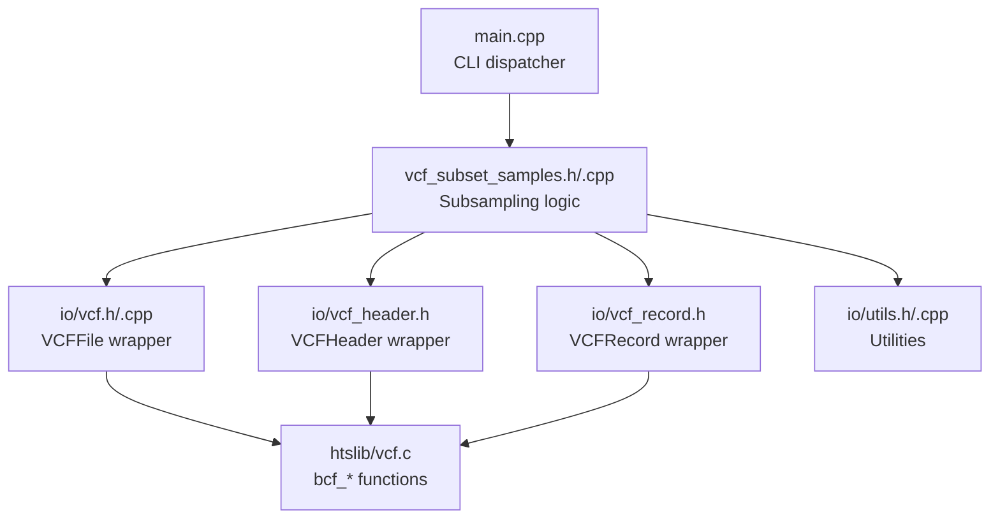
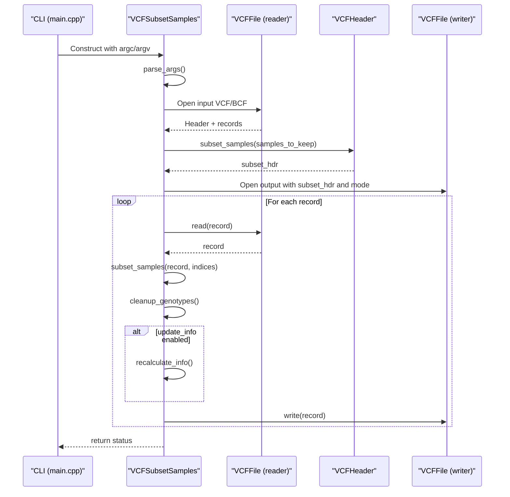
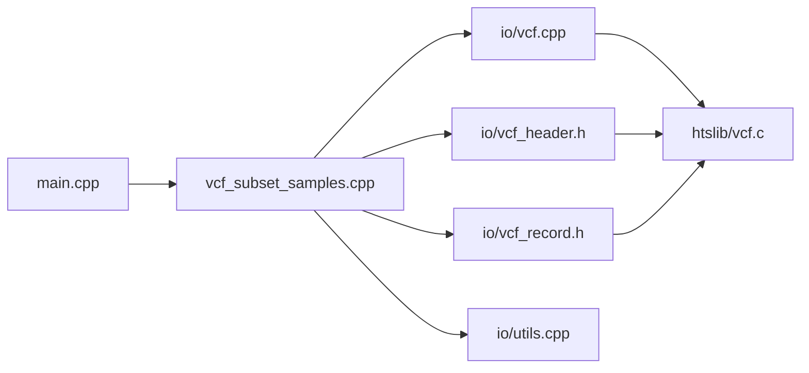

# Subsam Command

<cite>
**Referenced Files in This Document**
- [main.cpp](file://src/main.cpp)
- [vcf_subset_samples.h](file://src/vcf_subset_samples.h)
- [vcf_subset_samples.cpp](file://src/vcf_subset_samples.cpp)
- [vcf.h](file://src/io/vcf.h)
- [vcf.cpp](file://src/io/vcf.cpp)
- [vcf_header.h](file://src/io/vcf_header.h)
- [vcf_header.cpp](file://src/io/vcf_header.cpp)
- [vcf_record.h](file://src/io/vcf_record.h)
- [utils.h](file://src/io/utils.h)
- [utils.cpp](file://src/io/utils.cpp)
- [vcf.c](file://htslib/vcf.c)
- [vcf.c](file://htslib/vcf.c)
- [README.md](file://README.md)
</cite>

## Table of Contents
1. [Introduction](#introduction)
2. [Project Structure](#project-structure)
3. [Core Components](#core-components)
4. [Architecture Overview](#architecture-overview)
5. [Detailed Component Analysis](#detailed-component-analysis)
6. [Dependency Analysis](#dependency-analysis)
7. [Performance Considerations](#performance-considerations)
8. [Troubleshooting Guide](#troubleshooting-guide)
9. [Conclusion](#conclusion)
10. [Appendices](#appendices)

## Introduction
The subsam command extracts variants for specified samples from VCF files and outputs a new VCF/BCF file. It supports:
- Specifying samples via a file list (one sample per line) or inline positional arguments.
- Automatic output format detection from the output file extension or explicit type selection.
- Optional recalculation of INFO fields (AC, AN, AF, CAF) based on the subset samples.
- Optional retention of sites that contain only reference alleles among the kept samples.

It is designed for downstream applications such as population studies, quality control analyses, and targeted variant screening.

## Project Structure
The subsam command is implemented as part of the BaseVar2 toolkit. Key components:
- CLI entrypoint dispatches to the subsam runner.
- Argument parsing and runtime logic for subsampling.
- VCF/BCF I/O wrappers built on htslib.
- Utilities for file and header operations.

**Diagram sources**
- [main.cpp:43-92](file://src/main.cpp#L43-L92)
- [vcf_subset_samples.cpp:25-114](file://src/vcf_subset_samples.cpp#L25-L114)
- [vcf.h:29-179](file://src/io/vcf.h#L29-L179)
- [vcf_header.h:31-239](file://src/io/vcf_header.h#L31-L239)
- [vcf_record.h:31-521](file://src/io/vcf_record.h#L31-L521)
- [utils.h:19-205](file://src/io/utils.h#L19-L205)
- [vcf.c:2275-2280](file://htslib/vcf.c#L2275-L2280)

**Section sources**
- [main.cpp:43-92](file://src/main.cpp#L43-L92)
- [vcf_subset_samples.cpp:25-114](file://src/vcf_subset_samples.cpp#L25-L114)

## Core Components
- Command-line interface and argument parsing:
  - Supports input VCF/BCF, output VCF/BCF, sample list file, output type selection, and toggles for INFO recalculation and site retention.
  - Validates required arguments and prints usage on errors.
- Sample selection:
  - Accepts a list of sample names from a file or positional arguments.
  - Ensures each requested sample exists in the input header.
- Header and record subsetting:
  - Creates a subset header containing only the requested samples.
  - Subsets each record to the selected samples and cleans up unused alleles.
- INFO recalculation:
  - Optionally recalculates AC, AN, AF, and CAF based on the subset samples.
  - Skips records with no usable genotypes for kept samples when configured accordingly.
- Output:
  - Writes the subset VCF/BCF with appropriate compression and format.

**Section sources**
- [vcf_subset_samples.h:26-76](file://src/vcf_subset_samples.h#L26-L76)
- [vcf_subset_samples.cpp:7-22](file://src/vcf_subset_samples.cpp#L7-L22)
- [vcf_subset_samples.cpp:25-114](file://src/vcf_subset_samples.cpp#L25-L114)
- [vcf_subset_samples.cpp:224-316](file://src/vcf_subset_samples.cpp#L224-L316)

## Architecture Overview
End-to-end flow of the subsam command.

**Diagram sources**
- [main.cpp:62-72](file://src/main.cpp#L62-L72)
- [vcf_subset_samples.cpp:224-316](file://src/vcf_subset_samples.cpp#L224-L316)
- [vcf.h:59-81](file://src/io/vcf.h#L59-L81)
- [vcf_header.h:158-164](file://src/io/vcf_header.h#L158-L164)
- [vcf_record.h:499-516](file://src/io/vcf_record.h#L499-L516)

## Detailed Component Analysis

### Command Syntax and Options
- Syntax: basevar subsam [options] -i <input.vcf[.gz]> -o <output.vcf[.gz]> [-s <samplelist>] [<sample1> <sample2> ...]
- Options:
  - -i, --input FILE: Input VCF/BCF (required).
  - -o, --output FILE: Output VCF/BCF (required).
  - -s, --sample FILE: File containing sample names (one per line).
  - -O, --output-type TYPE: Output format selector [v|z|b|u].
  - --no-update-info: Do not update INFO fields (AC/AN/AF).
  - --keep-all-site: Keep sites with only reference alleles among kept samples.
  - -h, --help: Print usage.

Behavior highlights:
- Output type is guessed from the output file extension if not specified.
- At least one sample must be specified (from file or positional).
- Unknown output type triggers an error.

**Section sources**
- [vcf_subset_samples.cpp:7-22](file://src/vcf_subset_samples.cpp#L7-L22)
- [vcf_subset_samples.cpp:25-114](file://src/vcf_subset_samples.cpp#L25-L114)

### Sample Specification Methods
- From file: -s <samplelist>, where each line is a sample name.
- From command line: positional arguments after options.
- Validation: Each requested sample must exist in the input header; otherwise, an error is raised.

Implementation details:
- Sample list file is parsed to extract the first column.
- Samples are deduplicated internally during header subsetting.

**Section sources**
- [vcf_subset_samples.cpp:41-71](file://src/vcf_subset_samples.cpp#L41-L71)
- [utils.cpp:100-119](file://src/io/utils.cpp#L100-L119)
- [vcf_header.cpp:128-156](file://src/io/vcf_header.cpp#L128-L156)

### Output File Generation and Formatting
- Output mode selection:
  - If -O is provided, uses w + letter mapping to htslib modes.
  - Otherwise, infers from output file extension:
    - .bcf -> wb
    - .gz -> wz
    - .vcf or others -> w
- Header preservation:
  - Adds a header line recording the executed command for reproducibility.

**Section sources**
- [vcf_subset_samples.cpp:90-113](file://src/vcf_subset_samples.cpp#L90-L113)
- [vcf.h:69-81](file://src/io/vcf.h#L69-L81)
- [vcf_header.cpp:128-156](file://src/io/vcf_header.cpp#L128-L156)

### Sample Name Matching and Missing Samples
- Matching:
  - Compares requested sample names against the input header’s sample list.
- Missing samples:
  - Throws an error if any requested sample is not found.
- Index mapping:
  - Builds a list of 0-based indices for kept samples to support record subsetting.

**Section sources**
- [vcf_subset_samples.cpp:233-255](file://src/vcf_subset_samples.cpp#L233-L255)

### INFO Field Recalculation
- Enabled by default; can be disabled with --no-update-info.
- Recalculated fields:
  - AC: per-alt allele counts
  - AN: total non-missing alleles
  - AF: derived from AC/AN
  - CAF: alias for AF
- Behavior:
  - Skips records with zero usable genotypes for kept samples unless --keep-all-site is set.
  - Emits warnings when unpacking or GT field issues occur.

**Section sources**
- [vcf_subset_samples.cpp:121-221](file://src/vcf_subset_samples.cpp#L121-L221)

### Record Subsetting and Cleanup
- Header subsetting:
  - Creates a new header with only the requested samples.
- Record subsetting:
  - Produces a new record subset to the selected samples.
- Cleanup:
  - Removes unused ALT alleles and adjusts genotypes accordingly.

**Section sources**
- [vcf_subset_samples.cpp:257-298](file://src/vcf_subset_samples.cpp#L257-L298)
- [vcf_header.h:158-164](file://src/io/vcf_header.h#L158-L164)
- [vcf_record.h:499-516](file://src/io/vcf_record.h#L499-L516)

### Error Handling and Validation
- Required arguments:
  - Missing input or output file triggers an error and usage printing.
- Output type:
  - Invalid -O value triggers an error and usage printing.
- File I/O:
  - Failures to open files, read headers, or write records raise exceptions with descriptive messages.
- Record processing:
  - Errors during record subsetting or cleanup propagate as exceptions.

**Section sources**
- [vcf_subset_samples.cpp:73-88](file://src/vcf_subset_samples.cpp#L73-L88)
- [vcf_subset_samples.cpp:90-99](file://src/vcf_subset_samples.cpp#L90-L99)
- [vcf.cpp:17-54](file://src/io/vcf.cpp#L17-L54)
- [vcf.cpp:200-217](file://src/io/vcf.cpp#L200-L217)

### Usage Examples

- Population study subset:
  - Extract samples from a population cohort for downstream population genetics analysis.
  - Example invocation pattern:
    - basevar subsam -i input.vcf.gz -o pop_subset.vcf.gz -s samples.txt
- Quality control:
  - Retain only high-quality samples for QC filtering.
  - Example invocation pattern:
    - basevar subsam -i raw.vcf -o qc_passed.vcf -s qc_samples.txt --no-update-info
- Targeted variant screening:
  - Screen a predefined set of samples for candidate variants.
  - Example invocation pattern:
    - basevar subsam -i cohort.vcf.gz -o screen.vcf -s targets.txt --keep-all-site

Notes:
- Replace input and output extensions with .bcf or .vcf.gz as needed.
- Ensure the sample list file contains one sample name per line.

**Section sources**
- [vcf_subset_samples.cpp:7-22](file://src/vcf_subset_samples.cpp#L7-L22)

## Dependency Analysis
- Internal dependencies:
  - main.cpp dispatches to VCFSubsetSamples.
  - VCFSubsetSamples depends on VCFFile, VCFHeader, VCFRecord, and utility functions.
- External dependencies:
  - htslib provides core VCF/BCF parsing, writing, and subsetting routines.

**Diagram sources**
- [main.cpp:62-72](file://src/main.cpp#L62-L72)
- [vcf_subset_samples.cpp:224-316](file://src/vcf_subset_samples.cpp#L224-L316)
- [vcf.h:29-179](file://src/io/vcf.h#L29-L179)
- [vcf_header.h:31-239](file://src/io/vcf_header.h#L31-L239)
- [vcf_record.h:31-521](file://src/io/vcf_record.h#L31-L521)
- [utils.h:19-205](file://src/io/utils.h#L19-L205)
- [vcf.c:2275-2280](file://htslib/vcf.c#L2275-L2280)

**Section sources**
- [main.cpp:62-72](file://src/main.cpp#L62-L72)
- [vcf_subset_samples.cpp:224-316](file://src/vcf_subset_samples.cpp#L224-L316)

## Performance Considerations
- Streaming I/O:
  - Reads and writes records sequentially without loading the entire file into memory.
- Header and record operations:
  - Uses htslib’s optimized bcf_* functions for subsetting and writing.
- Progress reporting:
  - Prints periodic progress for long-running jobs.

[No sources needed since this section provides general guidance]

## Troubleshooting Guide
Common issues and resolutions:
- Invalid output type:
  - Ensure -O is one of v, z, b, u. Otherwise, the program exits with an error and usage.
- Missing input or output file:
  - Provide both -i and -o; otherwise, an error is reported and usage is printed.
- Unknown sample names:
  - Confirm sample names exist in the input header; otherwise, an error is thrown.
- Writing failures:
  - Check permissions and disk space; errors during write trigger exceptions.
- INFO recalculation warnings:
  - Missing GT field or unpacking errors lead to skipping INFO updates for that record.

Validation steps:
- Verify sample names match those in the VCF header.
- Confirm output file extension matches desired format (.vcf, .vcf.gz, .bcf).
- Use --no-update-info if GT fields are missing or incompatible.

**Section sources**
- [vcf_subset_samples.cpp:73-88](file://src/vcf_subset_samples.cpp#L73-L88)
- [vcf_subset_samples.cpp:90-99](file://src/vcf_subset_samples.cpp#L90-L99)
- [vcf_subset_samples.cpp:121-142](file://src/vcf_subset_samples.cpp#L121-L142)
- [vcf.cpp:200-217](file://src/io/vcf.cpp#L200-L217)

## Conclusion
The subsam command provides a robust, efficient mechanism to subset VCF/BCF files by sample, with flexible input formats, automatic output inference, and optional INFO recalculation. It integrates tightly with htslib for reliable parsing and writing, and offers practical controls for research workflows ranging from population studies to targeted screening.

[No sources needed since this section summarizes without analyzing specific files]

## Appendices

### Best Practices for Sample Selection and Downstream Analysis
- Prefer explicit sample lists for reproducibility.
- Use --no-update-info when GT fields are absent or when preserving original INFO values is required.
- Use --keep-all-site when retaining reference-only sites is necessary for downstream analysis.
- Validate sample names against the VCF header before running subsam.
- For large cohorts, consider splitting the sample list into manageable chunks.

**Section sources**
- [vcf_subset_samples.cpp:121-221](file://src/vcf_subset_samples.cpp#L121-L221)
- [vcf_header.cpp:128-156](file://src/io/vcf_header.cpp#L128-L156)