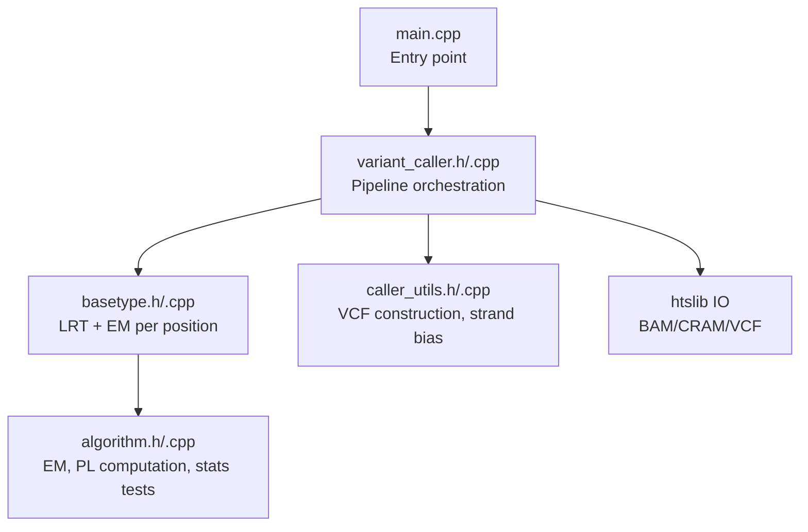
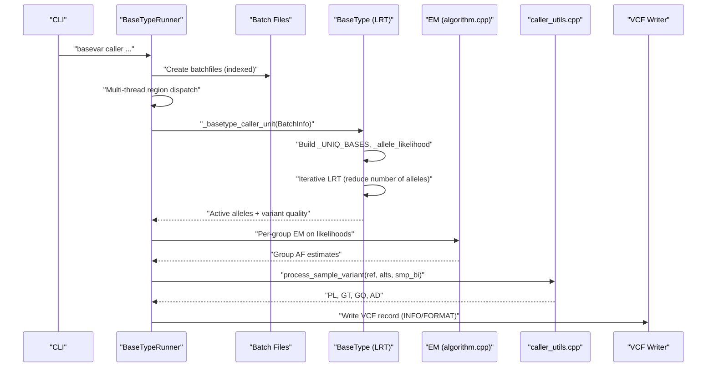
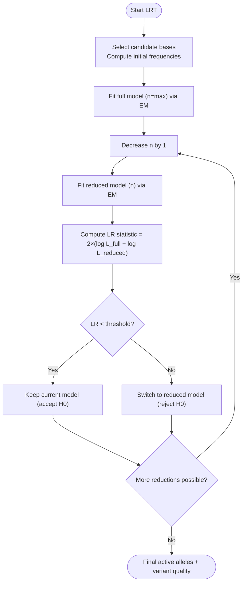
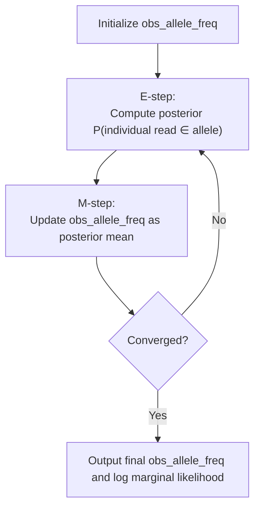
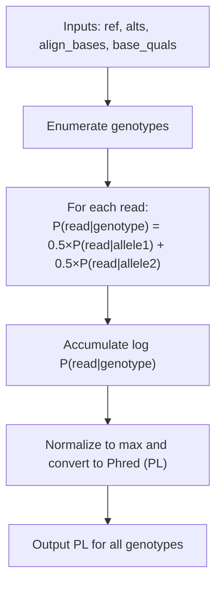
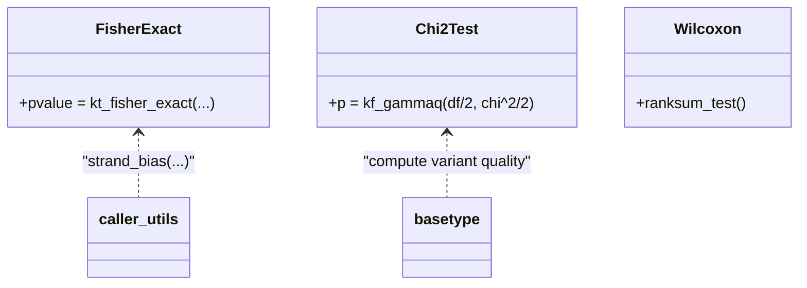
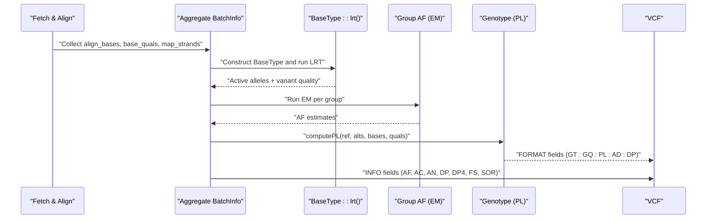
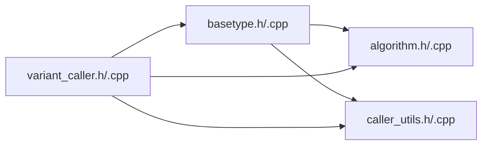

# Core Algorithm Architecture

<cite>
**Referenced Files in This Document**
- [algorithm.h](file://src/algorithm.h)
- [algorithm.cpp](file://src/algorithm.cpp)
- [basetype.h](file://src/basetype.h)
- [basetype.cpp](file://src/basetype.cpp)
- [variant_caller.h](file://src/variant_caller.h)
- [variant_caller.cpp](file://src/variant_caller.cpp)
- [caller_utils.h](file://src/caller_utils.h)
- [caller_utils.cpp](file://src/caller_utils.cpp)
- [main.cpp](file://src/main.cpp)
- [test_algorithm.cpp](file://tests/io/test_algorithm.cpp)
</cite>

## Table of Contents
1. [Introduction](#introduction)
2. [Project Structure](#project-structure)
3. [Core Components](#core-components)
4. [Architecture Overview](#architecture-overview)
5. [Detailed Component Analysis](#detailed-component-analysis)
6. [Dependency Analysis](#dependency-analysis)
7. [Performance Considerations](#performance-considerations)
8. [Troubleshooting Guide](#troubleshooting-guide)
9. [Conclusion](#conclusion)

## Introduction
This document explains the core statistical models and mathematical foundations of BaseVar2’s variant-calling pipeline. It focuses on:
- Likelihood ratio testing (LRT) framework for selecting the optimal number of alleles and estimating variant quality
- Maximum likelihood estimation via Expectation-Maximization (EM) for population-level allele frequency estimation
- Statistical model architecture including probability calculations, hypothesis testing, and allele frequency estimation
- Numerical stability and computational efficiency considerations
- Integration of algorithms within the overall pipeline

## Project Structure
BaseVar2 is organized around a modular pipeline:
- Input parsing and batch file generation
- Per-position variant inference using LRT and EM
- Population-level grouping and per-sample genotyping
- VCF output construction with INFO and FORMAT fields

**Diagram sources**
- [main.cpp:32-36](file://src/main.cpp#L32-L36)
- [variant_caller.h:41-174](file://src/variant_caller.h#L41-L174)
- [basetype.h:30-143](file://src/basetype.h#L30-L143)
- [caller_utils.h:29-229](file://src/caller_utils.h#L29-L229)
- [algorithm.h:90-179](file://src/algorithm.h#L90-L179)

**Section sources**
- [main.cpp:32-36](file://src/main.cpp#L32-L36)
- [variant_caller.h:41-174](file://src/variant_caller.h#L41-L174)
- [variant_caller.cpp:343-438](file://src/variant_caller.cpp#L343-L438)

## Core Components
- LRT engine (BaseType): selects the minimal sufficient set of alleles and computes a quality score via likelihood ratio testing
- EM estimator (algorithm module): estimates population-level allele frequencies using a probabilistic model
- Genotype likelihood calculator (PL): computes per-genotype likelihoods for downstream genotyping
- Statistical tests (Fisher’s exact, Wilcoxon rank-sum, chi-square): support strand bias and ranking-based tests
- Pipeline orchestrator (BaseTypeRunner): coordinates batch creation, multi-threading, and VCF output

**Section sources**
- [basetype.h:30-143](file://src/basetype.h#L30-L143)
- [basetype.cpp:14-212](file://src/basetype.cpp#L14-L212)
- [algorithm.h:90-179](file://src/algorithm.h#L90-L179)
- [algorithm.cpp:12-292](file://src/algorithm.cpp#L12-L292)
- [caller_utils.h:29-229](file://src/caller_utils.h#L29-L229)
- [caller_utils.cpp:144-200](file://src/caller_utils.cpp#L144-L200)

## Architecture Overview
The pipeline proceeds as follows:
- Batch files are created per genomic region and indexed
- For each position, a unified BatchInfo aggregates all samples’ reads
- A BaseType instance infers active alleles and variant quality via LRT
- Population-level AF estimation is performed per group using EM
- Genotype likelihoods (PL) are computed per sample; VCF records are constructed with INFO/FORMAT fields

**Diagram sources**
- [variant_caller.cpp:896-977](file://src/variant_caller.cpp#L896-L977)
- [variant_caller.cpp:1148-1186](file://src/variant_caller.cpp#L1148-L1186)
- [basetype.cpp:137-210](file://src/basetype.cpp#L137-L210)
- [caller_utils.cpp:144-200](file://src/caller_utils.cpp#L144-L200)
- [algorithm.cpp:239-292](file://src/algorithm.cpp#L239-L292)

## Detailed Component Analysis

### Likelihood Ratio Testing (LRT) Framework
- Objective: Select the minimal set of alleles that best explain the data according to LRT
- Procedure:
  - Build candidate bases from observed data and canonical bases
  - Compute likelihoods for decreasing numbers of alleles (n down to 1)
  - Compare nested models using twice the difference in log marginal likelihoods
  - Accept the simpler model if the improvement is not statistically significant

**Diagram sources**
- [basetype.cpp:137-210](file://src/basetype.cpp#L137-L210)
- [basetype.h:103-110](file://src/basetype.h#L103-L110)

**Section sources**
- [basetype.cpp:137-210](file://src/basetype.cpp#L137-L210)
- [basetype.h:24-28](file://src/basetype.h#L24-L28)

### Maximum Likelihood Estimation via EM
- Model: Each read contributes a likelihood for each possible allele at the site
- Latent variables: Individual read’s contributing allele assignment
- Observables: Observed bases and qualities
- Objective: Estimate population-level allele frequencies that maximize the marginal likelihood

**Diagram sources**
- [algorithm.h:150-179](file://src/algorithm.h#L150-L179)
- [algorithm.cpp:194-292](file://src/algorithm.cpp#L194-L292)

**Section sources**
- [algorithm.h:150-179](file://src/algorithm.h#L150-L179)
- [algorithm.cpp:194-292](file://src/algorithm.cpp#L194-L292)

### Genotype Likelihood Calculation (PL)
- Inputs: Reference base, alternate alleles, aligned bases, base qualities
- Model: For each genotype, average per-read likelihood over two alleles
- Output: Phred-scaled likelihoods (PL) for all genotypes

**Diagram sources**
- [algorithm.cpp:12-88](file://src/algorithm.cpp#L12-L88)
- [caller_utils.cpp:144-200](file://src/caller_utils.cpp#L144-L200)

**Section sources**
- [algorithm.cpp:12-88](file://src/algorithm.cpp#L12-L88)
- [caller_utils.cpp:144-200](file://src/caller_utils.cpp#L144-L200)

### Statistical Tests and Hypothesis Testing
- Fisher’s Exact Test: Used for strand-bias assessment (FS)
- Wilcoxon Rank-Sum Test: Optional for ranking-based comparisons
- Chi-square distribution: Used to compute p-values for LRT statistics

**Diagram sources**
- [algorithm.cpp:91-130](file://src/algorithm.cpp#L91-L130)
- [algorithm.cpp:4-6](file://src/algorithm.cpp#L4-L6)
- [caller_utils.cpp:9-62](file://src/caller_utils.cpp#L9-L62)
- [basetype.cpp:194-207](file://src/basetype.cpp#L194-L207)

**Section sources**
- [algorithm.cpp:91-130](file://src/algorithm.cpp#L91-L130)
- [caller_utils.cpp:9-62](file://src/caller_utils.cpp#L9-L62)
- [basetype.cpp:194-207](file://src/basetype.cpp#L194-L207)

### Mathematical Formulations
- Per-read likelihood for a given allele:
  - P(read|allele) = (correct if match) or (error/3 otherwise)
  - Error probability derived from base quality (Phred to probability conversion)
- Genotype likelihood:
  - P(read|genotype) = 0.5 × P(read|allele1) + 0.5 × P(read|allele2)
- LRT statistic:
  - χ² = 2 × (log L_full − log L_reduced)
  - Compared against a threshold to accept or reject the simpler model
- EM updates:
  - Posterior: P(individual read ∈ allele) ∝ P(read|allele) × prior(allele)
  - Prior updated to posterior mean across individuals

**Section sources**
- [algorithm.cpp:12-88](file://src/algorithm.cpp#L12-L88)
- [basetype.cpp:137-210](file://src/basetype.cpp#L137-L210)
- [algorithm.cpp:194-292](file://src/algorithm.cpp#L194-L292)

### Pipeline Integration and Data Flow
- Batch creation: Reads are fetched per region, aligned pairs extracted, and indel handling ensures leftmost representation
- Position aggregation: All samples’ reads are merged into a unified BatchInfo
- Variant inference: LRT selects active alleles; EM estimates AF per group
- Genotyping: PL computed per sample; VCF record assembled with INFO/FORMAT fields

**Diagram sources**
- [variant_caller.cpp:563-757](file://src/variant_caller.cpp#L563-L757)
- [variant_caller.cpp:1008-1146](file://src/variant_caller.cpp#L1008-L1146)
- [basetype.cpp:137-210](file://src/basetype.cpp#L137-L210)
- [caller_utils.cpp:144-200](file://src/caller_utils.cpp#L144-L200)

**Section sources**
- [variant_caller.cpp:563-757](file://src/variant_caller.cpp#L563-L757)
- [variant_caller.cpp:1008-1146](file://src/variant_caller.cpp#L1008-L1146)
- [caller_utils.cpp:144-200](file://src/caller_utils.cpp#L144-L200)

## Dependency Analysis
- BaseType depends on:
  - algorithm.h/cpp for EM and statistical tests
  - caller_utils.h/cpp for VCF record construction and strand bias
- BaseTypeRunner orchestrates:
  - Batch file creation and indexing
  - Multi-thread dispatch and merging
  - VCF header and record emission

**Diagram sources**
- [basetype.h:19-20](file://src/basetype.h#L19-L20)
- [variant_caller.h:28-31](file://src/variant_caller.h#L28-L31)

**Section sources**
- [basetype.h:19-20](file://src/basetype.h#L19-L20)
- [variant_caller.h:28-31](file://src/variant_caller.h#L28-L31)

## Performance Considerations
- Memory footprint:
  - Batch files chunk regions to limit in-memory reads per step
  - Per-position arrays for likelihoods and posteriors are sized by observed depth
- Parallelism:
  - Multi-threaded batch creation and variant calling per region
  - Tabix indexing enables efficient random access to batch files
- Numerical stability:
  - Log-space accumulation for likelihoods and normalization
  - Safe handling of zero-probability events and underflow
- Computational efficiency:
  - Early stopping in LRT loop when model improvement is below threshold
  - Efficient EM convergence via cumulative delta on log marginal likelihoods

[No sources needed since this section provides general guidance]

## Troubleshooting Guide
Common issues and remedies:
- Invalid batchfile headers or mismatched sample orders
  - Verify batchfile headers and sample ordering before processing
- Empty or insufficient coverage at a position
  - LRT skips positions with zero depth; ensure adequate sequencing depth
- Strand bias artifacts
  - FS and SOR are included in INFO; consider filtering or further investigation
- Runtime errors in statistical tests
  - Ensure non-negative contingency table entries for Fisher’s exact test
  - Handle edge cases where tests yield infinite or zero values

**Section sources**
- [variant_caller.cpp:909-913](file://src/variant_caller.cpp#L909-L913)
- [caller_utils.cpp:9-62](file://src/caller_utils.cpp#L9-L62)
- [algorithm.cpp:91-130](file://src/algorithm.cpp#L91-L130)

## Conclusion
BaseVar2 integrates LRT and EM to robustly infer variant alleles and population-level allele frequencies from ultra-low-coverage data. The pipeline emphasizes numerical stability, scalability via batching and threading, and comprehensive statistical reporting in VCF format. The documented components and flows provide a blueprint for extending or adapting the approach to diverse sequencing contexts.