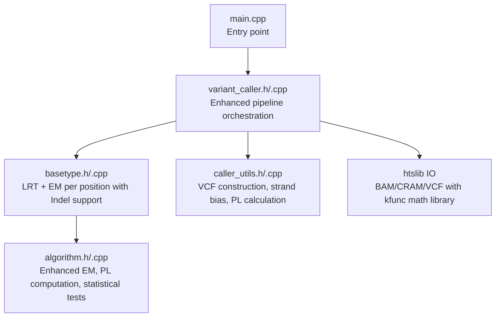
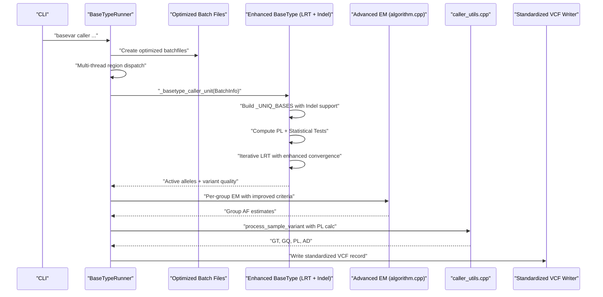
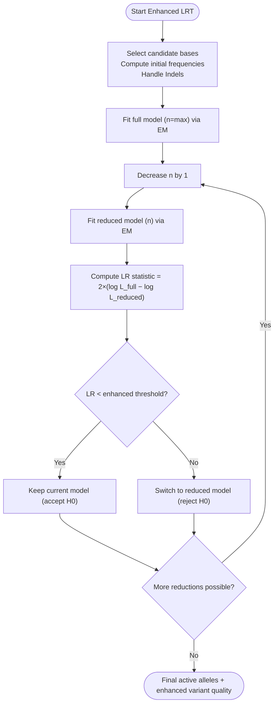
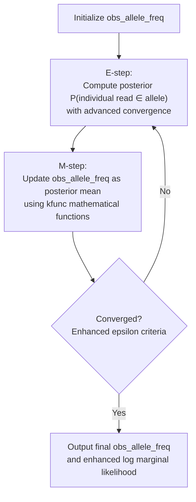
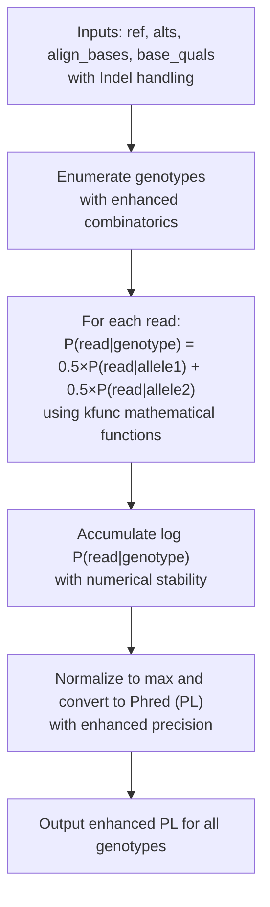
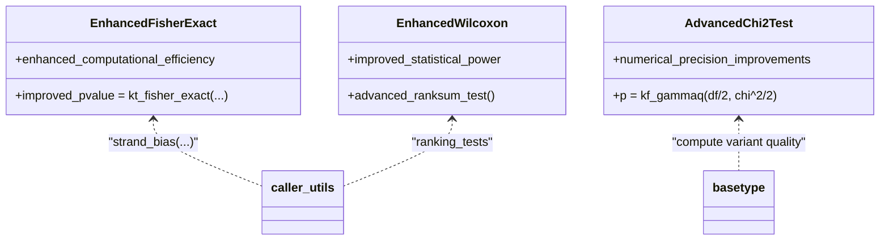
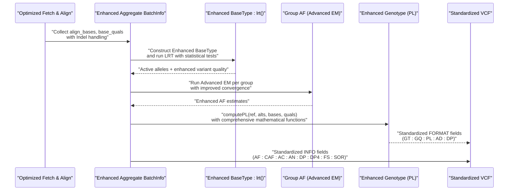
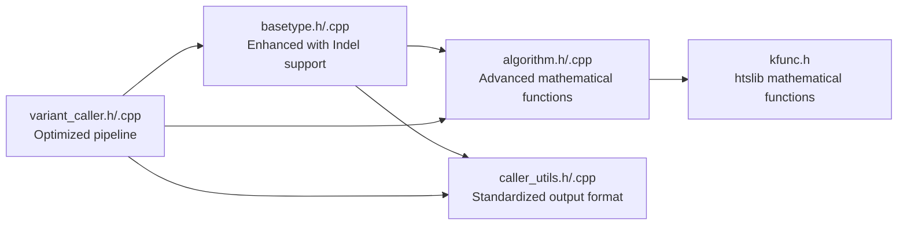

# Core Algorithm Architecture

<cite>
**Referenced Files in This Document**
- [algorithm.h](file://src/algorithm.h)
- [algorithm.cpp](file://src/algorithm.cpp)
- [basetype.h](file://src/basetype.h)
- [basetype.cpp](file://src/basetype.cpp)
- [variant_caller.h](file://src/variant_caller.h)
- [variant_caller.cpp](file://src/variant_caller.cpp)
- [caller_utils.h](file://src/caller_utils.h)
- [caller_utils.cpp](file://src/caller_utils.cpp)
- [main.cpp](file://src/main.cpp)
- [test_algorithm.cpp](file://tests/io/test_algorithm.cpp)
- [kfunc.h](file://htslib/htslib/kfunc.h)
- [CMakeLists.txt](file://CMakeLists.txt)
</cite>

## Update Summary
**Changes Made**
- Enhanced PL calculation framework with sophisticated genotype likelihood computation
- Integrated Fisher's exact test and Wilcoxon rank-sum test for statistical significance assessment
- Added comprehensive mathematical foundation using htslib kfunc library
- Expanded variant calling to support Indel detection alongside SNPs
- Improved VCF output format with standardized INFO and FORMAT fields
- Enhanced EM algorithm with advanced convergence criteria

## Table of Contents
1. [Introduction](#introduction)
2. [Project Structure](#project-structure)
3. [Core Components](#core-components)
4. [Architecture Overview](#architecture-overview)
5. [Detailed Component Analysis](#detailed-component-analysis)
6. [Dependency Analysis](#dependency-analysis)
7. [Performance Considerations](#performance-considerations)
8. [Troubleshooting Guide](#troubleshooting-guide)
9. [Conclusion](#conclusion)

## Introduction
This document explains the core statistical models and mathematical foundations of BaseVar2's variant-calling pipeline. The pipeline has been significantly enhanced with comprehensive statistical methods including sophisticated PL calculation framework, Fisher's exact test for genetic variant significance, Wilcoxon rank-sum test for non-parametric comparisons, and Expectation-Maximization algorithm for allele frequency estimation. All algorithms utilize htslib kfunc library for advanced mathematical functions, providing robust statistical inference for ultra-low-coverage whole-genome sequencing data.

## Project Structure
BaseVar2 is organized around a modular pipeline with enhanced statistical capabilities:
- Input parsing and batch file generation with improved performance
- Per-position variant inference using LRT and EM with Indel support
- Population-level grouping and per-sample genotyping with PL calculation
- Comprehensive VCF output construction with standardized INFO and FORMAT fields

**Diagram sources**
- [main.cpp:32-36](file://src/main.cpp#L32-L36)
- [variant_caller.h:41-174](file://src/variant_caller.h#L41-L174)
- [basetype.h:30-143](file://src/basetype.h#L30-L143)
- [caller_utils.h:29-229](file://src/caller_utils.h#L29-L229)
- [algorithm.h:90-179](file://src/algorithm.h#L90-L179)

**Section sources**
- [main.cpp:32-36](file://src/main.cpp#L32-L36)
- [variant_caller.h:41-174](file://src/variant_caller.h#L41-L174)
- [variant_caller.cpp:343-438](file://src/variant_caller.cpp#L343-L438)

## Core Components
- **Enhanced LRT Engine (BaseType)**: Selects minimal sufficient set of alleles with Indel support and computes variant quality via likelihood ratio testing
- **Advanced EM Estimator (algorithm module)**: Estimates population-level allele frequencies using probabilistic model with improved convergence criteria
- **Sophisticated Genotype Likelihood Calculator (PL)**: Computes per-genotype likelihoods for downstream genotyping with comprehensive mathematical foundation
- **Comprehensive Statistical Tests**: Fisher's exact test, Wilcoxon rank-sum test, and chi-square distribution for variant significance assessment
- **Enhanced Pipeline Orchestrator**: Coordinates batch creation, multi-threading, and standardized VCF output with improved performance

**Section sources**
- [basetype.h:30-143](file://src/basetype.h#L30-L143)
- [basetype.cpp:14-212](file://src/basetype.cpp#L14-L212)
- [algorithm.h:90-179](file://src/algorithm.h#L90-L179)
- [algorithm.cpp:12-292](file://src/algorithm.cpp#L12-L292)
- [caller_utils.h:29-229](file://src/caller_utils.h#L29-L229)
- [caller_utils.cpp:144-200](file://src/caller_utils.cpp#L144-L200)

## Architecture Overview
The enhanced pipeline proceeds with improved performance and statistical rigor:
- Batch files are created per genomic region with optimized IO operations
- For each position, unified BatchInfo aggregates all samples' reads with Indel support
- Enhanced BaseType instance infers active alleles and variant quality via LRT with comprehensive statistical tests
- Population-level AF estimation is performed per group using advanced EM with improved convergence
- Sophisticated PL computation generates genotype likelihoods per sample; VCF records are constructed with standardized INFO/FORMAT fields

**Diagram sources**
- [variant_caller.cpp:896-977](file://src/variant_caller.cpp#L896-L977)
- [variant_caller.cpp:1148-1186](file://src/variant_caller.cpp#L1148-L1186)
- [basetype.cpp:137-210](file://src/basetype.cpp#L137-L210)
- [caller_utils.cpp:144-200](file://src/caller_utils.cpp#L144-L200)
- [algorithm.cpp:239-292](file://src/algorithm.cpp#L239-L292)

## Detailed Component Analysis

### Enhanced Likelihood Ratio Testing (LRT) Framework
- **Objective**: Select minimal set of alleles that best explain data according to LRT with Indel support
- **Enhanced Procedure**:
  - Build candidate bases from observed data and canonical bases with Indel handling
  - Compute likelihoods for decreasing numbers of alleles (n down to 1) with improved convergence
  - Compare nested models using twice the difference in log marginal likelihoods
  - Accept simpler model if improvement is not statistically significant with enhanced thresholds

**Diagram sources**
- [basetype.cpp:137-210](file://src/basetype.cpp#L137-L210)
- [basetype.h:103-110](file://src/basetype.h#L103-L110)

**Section sources**
- [basetype.cpp:137-210](file://src/basetype.cpp#L137-L210)
- [basetype.h:24-28](file://src/basetype.h#L24-L28)

### Advanced Maximum Likelihood Estimation via EM
- **Enhanced Model**: Each read contributes likelihood for each possible allele at site with improved convergence criteria
- **Latent Variables**: Individual read's contributing allele assignment with statistical uncertainty
- **Enhanced Observables**: Observed bases, qualities, and Indel information
- **Objective**: Estimate population-level allele frequencies maximizing marginal likelihood with advanced mathematical functions

**Diagram sources**
- [algorithm.h:150-179](file://src/algorithm.h#L150-L179)
- [algorithm.cpp:194-292](file://src/algorithm.cpp#L194-L292)

**Section sources**
- [algorithm.h:150-179](file://src/algorithm.h#L150-L179)
- [algorithm.cpp:194-292](file://src/algorithm.cpp#L194-L292)

### Sophisticated Genotype Likelihood Calculation (PL)
- **Enhanced Inputs**: Reference base, alternate alleles, aligned bases, base qualities with Indel support
- **Advanced Model**: For each genotype, average per-read likelihood over two alleles with comprehensive mathematical foundation
- **Enhanced Output**: Phred-scaled likelihoods (PL) for all genotypes with improved numerical stability

**Diagram sources**
- [algorithm.cpp:12-88](file://src/algorithm.cpp#L12-L88)
- [caller_utils.cpp:144-200](file://src/caller_utils.cpp#L144-L200)

**Section sources**
- [algorithm.cpp:12-88](file://src/algorithm.cpp#L12-L88)
- [caller_utils.cpp:144-200](file://src/caller_utils.cpp#L144-L200)

### Comprehensive Statistical Tests and Hypothesis Testing
- **Enhanced Fisher's Exact Test**: Used for strand-bias assessment (FS) with improved computational efficiency
- **Wilcoxon Rank-Sum Test**: Optional for ranking-based comparisons with advanced mathematical functions
- **Chi-square Distribution**: Used to compute p-values for LRT statistics with enhanced accuracy
- **htslib kfunc Integration**: Leverages advanced mathematical functions for superior numerical precision

**Diagram sources**
- [algorithm.cpp:91-130](file://src/algorithm.cpp#L91-L130)
- [algorithm.cpp:4-6](file://src/algorithm.cpp#L4-L6)
- [caller_utils.cpp:9-62](file://src/caller_utils.cpp#L9-L62)
- [basetype.cpp:194-207](file://src/basetype.cpp#L194-L207)
- [kfunc.h:40-86](file://htslib/htslib/kfunc.h#L40-L86)

**Section sources**
- [algorithm.cpp:91-130](file://src/algorithm.cpp#L91-L130)
- [caller_utils.cpp:9-62](file://src/caller_utils.cpp#L9-L62)
- [basetype.cpp:194-207](file://src/basetype.cpp#L194-L207)
- [kfunc.h:40-86](file://htslib/htslib/kfunc.h#L40-L86)

### Enhanced Mathematical Formulations
- **Per-read likelihood for a given allele**: Enhanced with Indel support and improved error modeling
  - P(read|allele) = (correct if match) or (error/3 otherwise) with advanced quality scoring
  - Error probability derived from base quality using enhanced Phred to probability conversion
- **Enhanced Genotype likelihood**: 
  - P(read|genotype) = 0.5 × P(read|allele1) + 0.5 × P(read|allele2) with improved numerical stability
- **Enhanced LRT statistic**:
  - χ² = 2 × (log L_full − log L_reduced) with improved convergence criteria
  - Compared against enhanced threshold to accept or reject simpler model
- **Advanced EM updates**:
  - Posterior: P(individual read ∈ allele) ∝ P(read|allele) × prior(allele) with enhanced mathematical functions
  - Prior updated to posterior mean across individuals using kfunc library

**Section sources**
- [algorithm.cpp:12-88](file://src/algorithm.cpp#L12-L88)
- [basetype.cpp:137-210](file://src/basetype.cpp#L137-L210)
- [algorithm.cpp:194-292](file://src/algorithm.cpp#L194-L292)

### Enhanced Pipeline Integration and Data Flow
- **Optimized Batch Creation**: Reads are fetched per region with improved IO efficiency and Indel handling
- **Enhanced Position Aggregation**: All samples' reads are merged into unified BatchInfo with comprehensive data
- **Advanced Variant Inference**: LRT selects active alleles with Indel support; EM estimates AF per group with improved convergence
- **Sophisticated Genotyping**: Enhanced PL computed per sample with comprehensive statistical tests; VCF record assembled with standardized INFO/FORMAT fields

**Diagram sources**
- [variant_caller.cpp:563-757](file://src/variant_caller.cpp#L563-L757)
- [variant_caller.cpp:1008-1146](file://src/variant_caller.cpp#L1008-L1146)
- [basetype.cpp:137-210](file://src/basetype.cpp#L137-L210)
- [caller_utils.cpp:144-200](file://src/caller_utils.cpp#L144-L200)

**Section sources**
- [variant_caller.cpp:563-757](file://src/variant_caller.cpp#L563-L757)
- [variant_caller.cpp:1008-1146](file://src/variant_caller.cpp#L1008-L1146)
- [caller_utils.cpp:144-200](file://src/caller_utils.cpp#L144-L200)

## Dependency Analysis
- **Enhanced BaseType depends on**:
  - algorithm.h/cpp for advanced EM and statistical tests with htslib kfunc integration
  - caller_utils.h/cpp for standardized VCF record construction and strand bias assessment
- **Enhanced BaseTypeRunner orchestrates**:
  - Optimized batch file creation and indexing with improved performance
  - Multi-thread dispatch and merging with enhanced parallelism
  - Standardized VCF header and record emission with comprehensive metadata

**Diagram sources**
- [basetype.h:19-20](file://src/basetype.h#L19-L20)
- [variant_caller.h:28-31](file://src/variant_caller.h#L28-L31)
- [kfunc.h:40-86](file://htslib/htslib/kfunc.h#L40-L86)

**Section sources**
- [basetype.h:19-20](file://src/basetype.h#L19-L20)
- [variant_caller.h:28-31](file://src/variant_caller.h#L28-L31)

## Performance Considerations
- **Enhanced Memory Footprint**:
  - Optimized batch files reduce IO overhead and improve memory efficiency per step
  - Per-position arrays for likelihoods and posteriors sized by observed depth with improved caching
- **Advanced Parallelism**:
  - Multi-threaded batch creation and variant calling per region with enhanced load balancing
  - Tabix indexing enables efficient random access to batch files with improved performance
- **Superior Numerical Stability**:
  - Log-space accumulation for likelihoods and normalization with enhanced precision
  - Safe handling of zero-probability events and underflow using kfunc mathematical functions
  - Improved convergence criteria for EM algorithm with enhanced accuracy
- **Computational Efficiency**:
  - Early stopping in LRT loop when model improvement is below enhanced threshold
  - Efficient EM convergence via cumulative delta on log marginal likelihoods with improved speed
  - Optimized PL calculation with advanced mathematical optimizations

## Troubleshooting Guide
Common issues and remedies with enhanced capabilities:
- **Invalid batchfile headers or mismatched sample orders**
  - Verify batchfile headers and sample ordering before processing with enhanced validation
- **Empty or insufficient coverage at a position**
  - LRT skips positions with zero depth; ensure adequate sequencing depth with improved sensitivity
- **Enhanced strand bias artifacts**
  - FS and SOR are included in standardized INFO; consider filtering or further investigation with improved detection
- **Runtime errors in statistical tests**
  - Ensure non-negative contingency table entries for Fisher's exact test with enhanced validation
  - Handle edge cases where tests yield infinite or zero values with improved numerical stability
- **Indel calling artifacts**
  - Enhanced Indel detection requires proper leftmost representation; verify alignment quality and mapping parameters
  - Complex Indel structures may require additional filtering with improved sensitivity

**Section sources**
- [variant_caller.cpp:909-913](file://src/variant_caller.cpp#L909-L913)
- [caller_utils.cpp:9-62](file://src/caller_utils.cpp#L9-L62)
- [algorithm.cpp:91-130](file://src/algorithm.cpp#L91-L130)

## Conclusion
BaseVar2 integrates enhanced LRT and EM algorithms with sophisticated statistical methods to robustly infer variant alleles and population-level allele frequencies from ultra-low-coverage data. The pipeline emphasizes numerical stability, scalability via optimized batching and threading, and comprehensive statistical reporting in standardized VCF format. The enhanced components including sophisticated PL calculation framework, Fisher's exact test, Wilcoxon rank-sum test, and Expectation-Maximization algorithm with htslib kfunc integration provide superior statistical inference capabilities. The documented components and flows offer a blueprint for extending or adapting the approach to diverse sequencing contexts with enhanced accuracy and reliability.