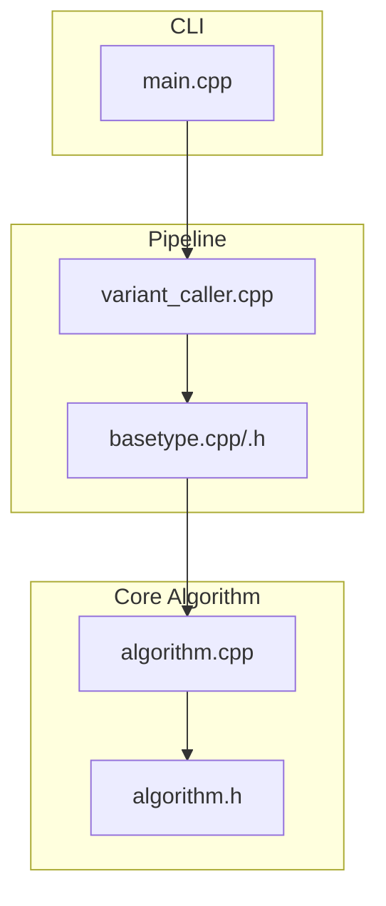
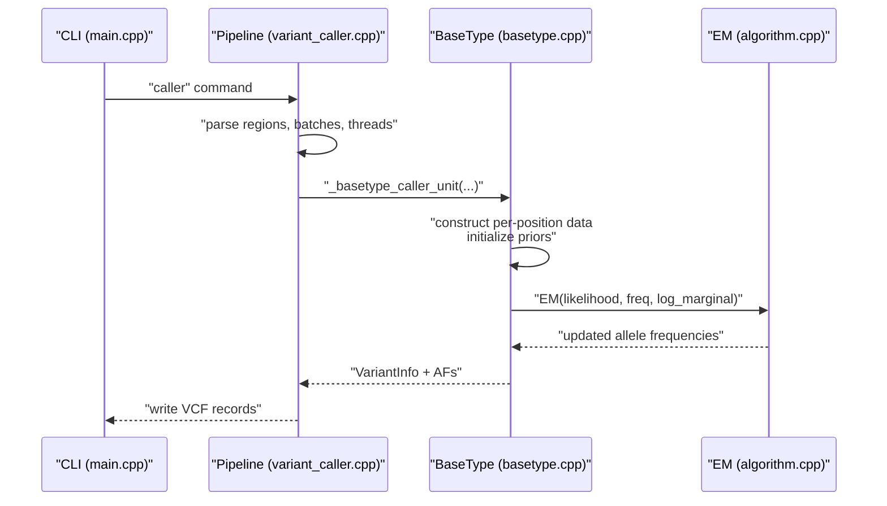
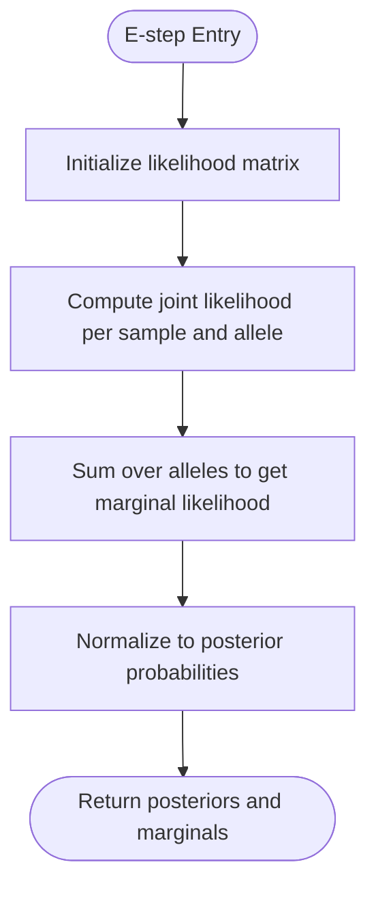
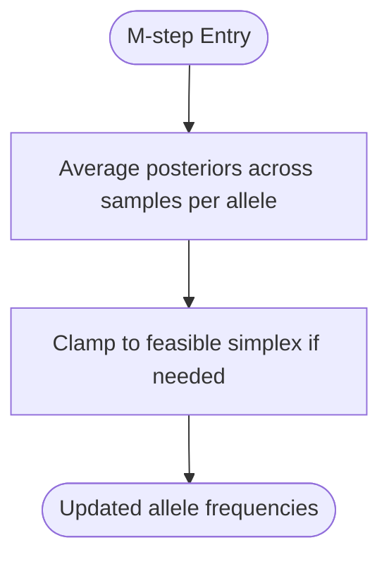
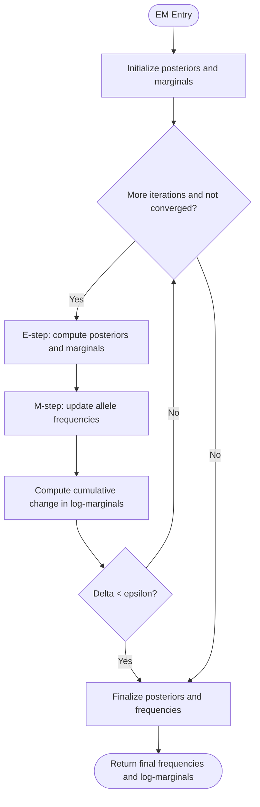
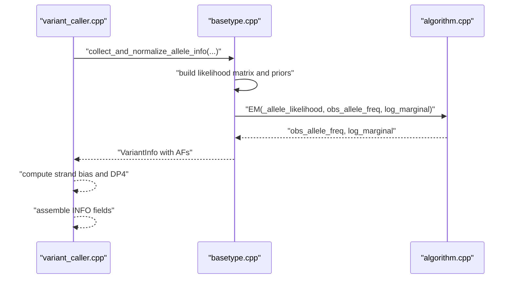
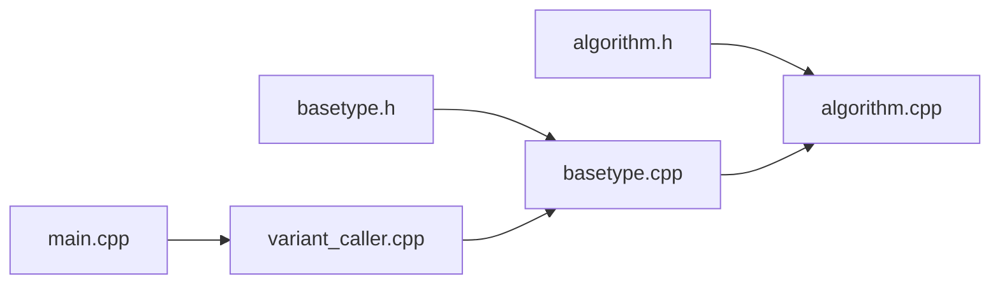

# Expectation-Maximization Algorithm

<cite>
**Referenced Files in This Document**
- [algorithm.h](file://src/algorithm.h)
- [algorithm.cpp](file://src/algorithm.cpp)
- [basetype.h](file://src/basetype.h)
- [basetype.cpp](file://src/basetype.cpp)
- [variant_caller.cpp](file://src/variant_caller.cpp)
- [main.cpp](file://src/main.cpp)
- [README.md](file://README.md)
</cite>

## Table of Contents
1. [Introduction](#introduction)
2. [Project Structure](#project-structure)
3. [Core Components](#core-components)
4. [Architecture Overview](#architecture-overview)
5. [Detailed Component Analysis](#detailed-component-analysis)
6. [Dependency Analysis](#dependency-analysis)
7. [Performance Considerations](#performance-considerations)
8. [Troubleshooting Guide](#troubleshooting-guide)
9. [Conclusion](#conclusion)

## Introduction
This document explains the Expectation-Maximization (EM) algorithm implementation used by BaseVar for estimating population allele frequencies from ultra-low-depth sequencing data. The EM algorithm iteratively maximizes a lower bound on the observed-data log-likelihood by alternating between:
- E-step: computing posterior probabilities of alleles for each sample given current parameter estimates.
- M-step: updating allele frequency parameters by averaging posteriors across samples.

The implementation integrates with BaseVar’s variant-calling pipeline to support robust inference in low-coverage settings, including handling missing data and uncertainty via probabilistic models.

## Project Structure
The EM-related code resides primarily in the algorithm module and is orchestrated by the variant caller and BaseType classes:
- algorithm.h/cpp define the EM interface and core routines (E-step, M-step, and the full EM loop).
- basetype.h/cpp construct per-position datasets and initialize priors, then invoke EM.
- variant_caller.cpp coordinates batch processing, region splitting, and VCF output generation.
- main.cpp provides the CLI entry point.

**Diagram sources**
- [main.cpp:32-36](file://src/main.cpp#L32-L36)
- [variant_caller.cpp:1148-1186](file://src/variant_caller.cpp#L1148-L1186)
- [basetype.cpp:119-135](file://src/basetype.cpp#L119-L135)
- [algorithm.h:150-177](file://src/algorithm.h#L150-L177)
- [algorithm.cpp:194-292](file://src/algorithm.cpp#L194-L292)

**Section sources**
- [README.md:1-181](file://README.md#L1-L181)
- [main.cpp:32-36](file://src/main.cpp#L32-L36)
- [variant_caller.cpp:1148-1186](file://src/variant_caller.cpp#L1148-L1186)
- [basetype.cpp:119-135](file://src/basetype.cpp#L119-L135)
- [algorithm.h:150-177](file://src/algorithm.h#L150-L177)
- [algorithm.cpp:194-292](file://src/algorithm.cpp#L194-L292)

## Core Components
- E-step (posterior computation): Computes likelihoods for each sample and allele, normalizes to posterior probabilities, and accumulates marginal likelihood per sample.
- M-step (parameter update): Updates observed allele frequencies by averaging per-sample posteriors across alleles.
- EM loop: Iterates E-step and M-step until convergence or iteration limit, monitoring the change in log-marginal likelihood.

Key behaviors:
- Marginal likelihood is tracked in log-space to avoid numerical underflow.
- Convergence is controlled by a tolerance threshold on cumulative absolute differences in log-marginal likelihood across samples.
- Initialization uses empirical base frequencies from the current combination of active bases.

**Section sources**
- [algorithm.h:150-177](file://src/algorithm.h#L150-L177)
- [algorithm.cpp:194-292](file://src/algorithm.cpp#L194-L292)

## Architecture Overview
The EM algorithm is embedded within BaseVar’s variant-calling workflow:
- Data ingestion: Reads aligned reads, extracts per-position bases and qualities, and builds per-sample alignment info.
- Per-position model construction: Builds a likelihood matrix for observed bases versus a set of unique bases and initializes priors.
- EM inference: Runs EM to estimate population-level allele frequencies for candidate base sets.
- Variant scoring and output: Uses LRT comparisons and strand-bias metrics to produce VCF records with allele frequencies and group-specific AFs.

**Diagram sources**
- [main.cpp:32-36](file://src/main.cpp#L32-L36)
- [variant_caller.cpp:1148-1186](file://src/variant_caller.cpp#L1148-L1186)
- [basetype.cpp:119-135](file://src/basetype.cpp#L119-L135)
- [algorithm.cpp:239-292](file://src/algorithm.cpp#L239-L292)

## Detailed Component Analysis

### E-step: Posterior Computation
- Inputs:
  - obs_allele_freq: current allele frequency vector (A, C, G, T).
  - ind_allele_likelihood: per-sample likelihood for each allele.
- Outputs:
  - ind_allele_post_prob: posterior probability for each sample and allele.
  - marginal_likelihood: marginal likelihood per sample.
- Mechanism:
  - Multiply per-sample likelihood by current allele frequencies to obtain joint likelihood.
  - Normalize per-sample joint likelihood to posteriors.
  - Sum over alleles to compute marginal likelihood.

**Diagram sources**
- [algorithm.cpp:194-221](file://src/algorithm.cpp#L194-L221)

**Section sources**
- [algorithm.cpp:194-221](file://src/algorithm.cpp#L194-L221)

### M-step: Parameter Update
- Inputs:
  - ind_allele_post_prob: per-sample posterior probabilities for each allele.
- Output:
  - obs_allele_freq: updated allele frequencies by averaging posteriors across samples.
- Notes:
  - Frequencies are averaged per allele across all samples.

**Diagram sources**
- [algorithm.cpp:223-237](file://src/algorithm.cpp#L223-L237)

**Section sources**
- [algorithm.cpp:223-237](file://src/algorithm.cpp#L223-L237)

### EM Loop and Convergence
- Initialization:
  - Uses empirical base frequencies from the current active base combination.
- Iteration:
  - Alternate E-step and M-step.
  - Track log-marginal likelihood per sample and compute cumulative absolute difference across iterations.
- Stopping conditions:
  - Maximum iterations reached.
  - Cumulative absolute change in log-marginal likelihood falls below a small epsilon threshold.

**Diagram sources**
- [algorithm.cpp:239-292](file://src/algorithm.cpp#L239-L292)

**Section sources**
- [algorithm.cpp:239-292](file://src/algorithm.cpp#L239-L292)

### Integration with BaseVar Pipeline
- Data preparation:
  - Extract per-position bases and qualities from aligned reads.
  - Build unique base set and per-read likelihoods for A/C/G/T plus indels.
- Model execution:
  - For each combination of active bases, initialize priors and run EM.
  - Select the best combination via likelihood ratio testing (LRT).
- Output:
  - VCF INFO fields include AF, CAF, AC, AN, DP, DP4, FS, SOR.
  - Optional population-specific AFs and depths.

**Diagram sources**
- [variant_caller.cpp:1148-1186](file://src/variant_caller.cpp#L1148-L1186)
- [basetype.cpp:119-135](file://src/basetype.cpp#L119-L135)
- [algorithm.cpp:239-292](file://src/algorithm.cpp#L239-L292)

**Section sources**
- [variant_caller.cpp:1148-1186](file://src/variant_caller.cpp#L1148-L1186)
- [basetype.cpp:119-135](file://src/basetype.cpp#L119-L135)
- [algorithm.cpp:239-292](file://src/algorithm.cpp#L239-L292)

## Dependency Analysis
- algorithm.h/cpp depends on:
  - htslib math functions for statistical utilities (e.g., regularized gamma functions).
- basetype.cpp invokes:
  - EM from algorithm.cpp.
  - Utility functions for combining bases and managing per-position data.
- variant_caller.cpp orchestrates:
  - Multi-threaded processing of batchfiles and regions.
  - Calls BaseType to compute AFs and aggregates results into VCF.

**Diagram sources**
- [algorithm.h:1-180](file://src/algorithm.h#L1-L180)
- [algorithm.cpp:1-293](file://src/algorithm.cpp#L1-L293)
- [basetype.h:1-146](file://src/basetype.h#L1-L146)
- [basetype.cpp:1-212](file://src/basetype.cpp#L1-L212)
- [variant_caller.cpp:1-1303](file://src/variant_caller.cpp#L1-L1303)
- [main.cpp:1-93](file://src/main.cpp#L1-L93)

**Section sources**
- [algorithm.h:1-180](file://src/algorithm.h#L1-L180)
- [algorithm.cpp:1-293](file://src/algorithm.cpp#L1-L293)
- [basetype.h:1-146](file://src/basetype.h#L1-L146)
- [basetype.cpp:1-212](file://src/basetype.cpp#L1-L212)
- [variant_caller.cpp:1-1303](file://src/variant_caller.cpp#L1-L1303)
- [main.cpp:1-93](file://src/main.cpp#L1-L93)

## Performance Considerations
- Data structures:
  - Likelihood matrices are sized by number of samples and unique bases; memory scales accordingly.
  - Posteriors and marginals are stored per sample and per allele.
- Complexity:
  - Each EM iteration performs O(S × A) computations per sample (S = samples, A = alleles).
  - Typical A ≈ 4 for A/C/G/T plus indels; overhead is modest.
- Convergence:
  - Early stopping via cumulative delta threshold reduces unnecessary iterations.
- Parallelization:
  - Regions and batches are processed in parallel; within a region, per-position EM runs sequentially but is lightweight compared to I/O and parsing.

[No sources needed since this section provides general guidance]

## Troubleshooting Guide
Common issues and remedies:
- Invalid inputs:
  - Non-positive iteration count or epsilon triggers exceptions; ensure positive values are passed to EM.
- Empty coverage:
  - If a combination yields zero coverage, initialization throws an error; verify active base selection and minimum AF thresholds.
- Numerical stability:
  - Log-space marginal likelihood prevents underflow; ensure logs are computed correctly and differences are accumulated safely.
- Convergence stalls:
  - Increase maximum iterations or adjust epsilon; verify that data contains sufficient signal for reliable inference.

**Section sources**
- [algorithm.cpp:244-249](file://src/algorithm.cpp#L244-L249)
- [basetype.cpp:120-122](file://src/basetype.cpp#L120-L122)
- [algorithm.cpp:278-287](file://src/algorithm.cpp#L278-L287)

## Conclusion
BaseVar’s EM implementation provides a robust framework for population allele frequency estimation from ultra-low-depth data. By alternating E-step and M-step updates and leveraging log-marginal likelihood convergence, it effectively handles missing data and uncertainty inherent in low-coverage scenarios. The integration with BaseVar’s multi-threaded pipeline ensures scalable performance for large-scale population analyses.