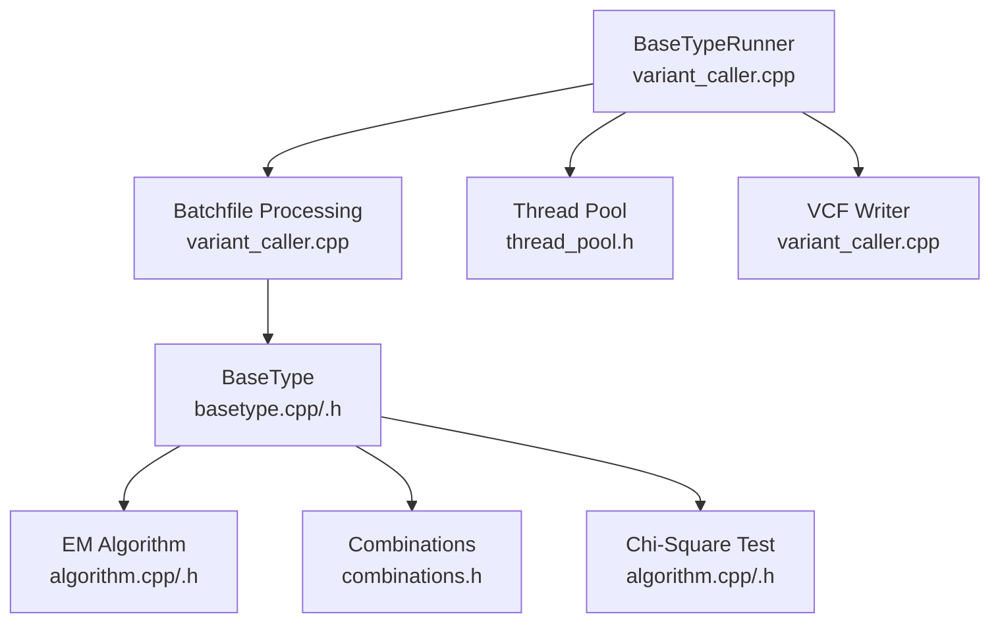
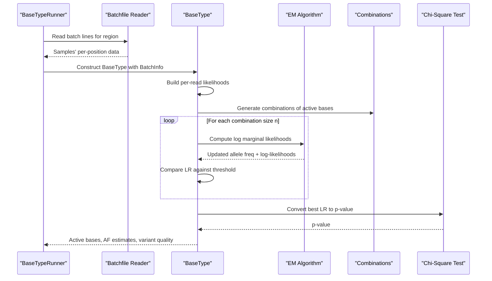
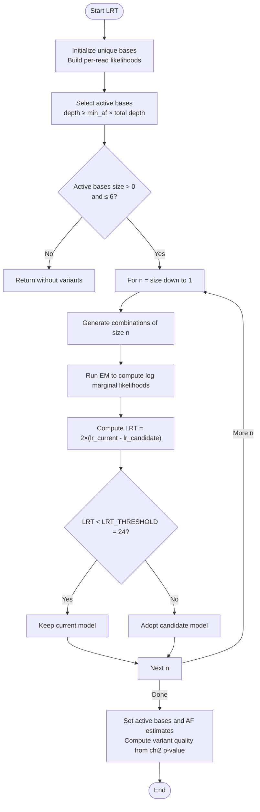
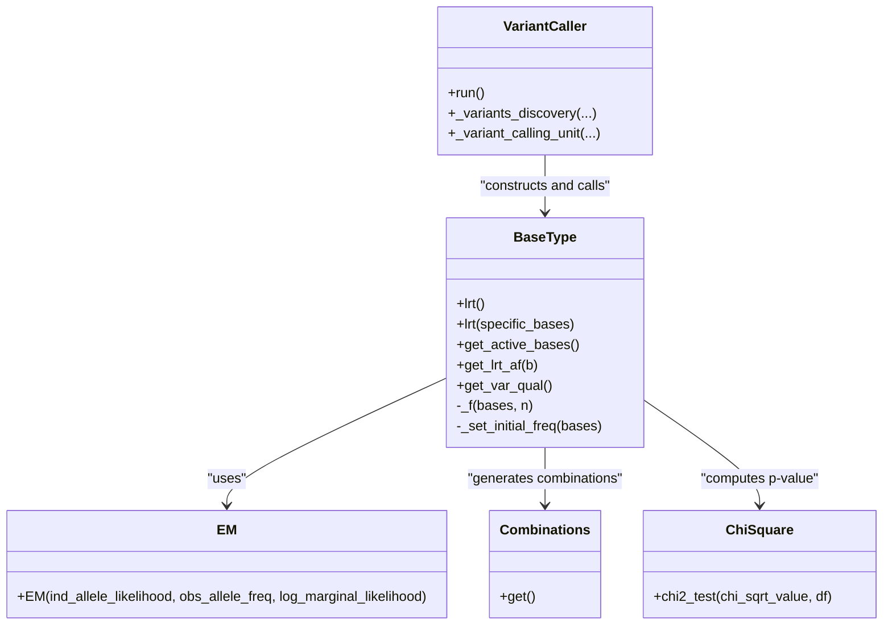

# Likelihood Ratio Testing Framework

<cite>
**Referenced Files in This Document**
- [basetype.h](file://src/basetype.h)
- [basetype.cpp](file://src/basetype.cpp)
- [algorithm.h](file://src/algorithm.h)
- [algorithm.cpp](file://src/algorithm.cpp)
- [combinations.h](file://src/external/combinations.h)
- [variant_caller.h](file://src/variant_caller.h)
- [variant_caller.cpp](file://src/variant_caller.cpp)
- [README.md](file://README.md)
</cite>

## Table of Contents
1. [Introduction](#introduction)
2. [Project Structure](#project-structure)
3. [Core Components](#core-components)
4. [Architecture Overview](#architecture-overview)
5. [Detailed Component Analysis](#detailed-component-analysis)
6. [Dependency Analysis](#dependency-analysis)
7. [Performance Considerations](#performance-considerations)
8. [Troubleshooting Guide](#troubleshooting-guide)
9. [Conclusion](#conclusion)

## Introduction
This document explains BaseVar2’s likelihood ratio testing (LRT) framework for variant calling. It covers the theoretical foundation of LRT in the context of population-level variant detection, the implementation of the LRT algorithm in the BaseType class, and the mathematical formulations used for likelihood calculations, log-likelihood ratios, and significance thresholds. It also documents the LRT_THRESHOLD constant (24, corresponding to a chi-square p-value of approximately 10^-6), practical examples of how LRT distinguishes between reference and variant alleles, and numerical stability and efficiency considerations.

## Project Structure
BaseVar2 is organized around a modular C++ architecture:
- Core variant calling engine resides in the variant_caller module, which orchestrates batch processing, threading, and VCF output.
- The BaseType class encapsulates population-level allele frequency estimation via LRT and EM-based marginal likelihood computation.
- Mathematical primitives (EM, chi-square test, combinatorics) are implemented in dedicated headers and sources.

**Diagram sources**
- [variant_caller.cpp:342-438](file://src/variant_caller.cpp#L342-L438)
- [basetype.cpp:137-210](file://src/basetype.cpp#L137-L210)
- [algorithm.cpp:239-292](file://src/algorithm.cpp#L239-L292)
- [combinations.h:18-49](file://src/external/combinations.h#L18-L49)

**Section sources**
- [README.md:1-181](file://README.md#L1-L181)
- [variant_caller.h:1-180](file://src/variant_caller.h#L1-L180)
- [variant_caller.cpp:342-438](file://src/variant_caller.cpp#L342-L438)

## Core Components
- BaseType: Computes population-level allele frequencies and variant quality scores using LRT. It initializes unique bases, builds per-read likelihoods, runs EM to estimate marginal likelihoods, and compares nested models via log-likelihood ratios.
- EM Algorithm: Performs Expectation-Maximization to estimate per-site allele frequencies and compute log marginal likelihoods for each read.
- Combinations: Generates all combinations of candidate alleles to compare nested models in LRT.
- Chi-Square Test: Converts the LRT statistic into a p-value for significance assessment.

Key constants and thresholds:
- LRT_THRESHOLD = 24 (corresponding to a chi-square p-value of approximately 10^-6).
- QUAL_THRESHOLD = 20 (used elsewhere for quality filtering).
- MLN10TO10 = -ln(10)/10 (conversion factor to natural logarithm for Phred-scaled qualities).

**Section sources**
- [basetype.h:24-27](file://src/basetype.h#L24-L27)
- [basetype.cpp:137-210](file://src/basetype.cpp#L137-L210)
- [algorithm.cpp:4-6](file://src/algorithm.cpp#L4-L6)

## Architecture Overview
The LRT pipeline proceeds as follows:
1. Data ingestion: Batchfiles are created and consumed to collect per-position read information.
2. Per-read likelihood construction: Each read contributes a likelihood over the unique base set, incorporating base quality.
3. Candidate selection: Only bases with sufficient depth relative to the minimum allele frequency threshold are considered.
4. Model comparison: Nested models (smaller vs. larger allele sets) are compared using LRT with a chi-square test.
5. Finalization: The selected model yields active alleles, their frequencies, and a variant quality score.

**Diagram sources**
- [variant_caller.cpp:1008-1146](file://src/variant_caller.cpp#L1008-L1146)
- [basetype.cpp:137-210](file://src/basetype.cpp#L137-L210)
- [algorithm.cpp:239-292](file://src/algorithm.cpp#L239-L292)
- [combinations.h:18-49](file://src/external/combinations.h#L18-L49)

## Detailed Component Analysis

### Theoretical Foundation of LRT in Variant Calling
- Null hypothesis (H0): The observed data are equally well explained by a smaller set of alleles (e.g., a single non-reference allele).
- Alternative hypothesis (H1): A larger set of alleles (e.g., multiple non-reference alleles) provides a significantly better fit.
- LRT statistic: 2 × (log L(H1) − log L(H0)). Under H0, this statistic asymptotically follows a chi-square distribution with degrees of freedom equal to the difference in model parameters.
- Significance threshold: LRT_THRESHOLD = 24 corresponds to a chi-square p-value ≈ 10^-6 for 1 degree of freedom.

Biological significance:
- A high LRT statistic indicates strong evidence favoring the alternative model (more complex composition of alleles), suggesting a true variant requiring further validation.
- The threshold balances sensitivity and specificity for detecting rare variants in low-depth data.

**Section sources**
- [basetype.h:24-27](file://src/basetype.h#L24-L27)
- [basetype.cpp:172-179](file://src/basetype.cpp#L172-L179)

### Implementation Details of the LRT Algorithm in BaseType
- Initialization:
  - Unique bases are constructed from input plus canonical A, C, G, T, excluding ambiguous/N and gap/*.
  - Per-read likelihoods are built using Phred-scaled base qualities converted to error probabilities.
- Candidate selection:
  - Only bases with depth ≥ min_af × total depth are retained as active candidates.
- Model comparison:
  - For decreasing sizes n from active_bases.size() down to 1, combinations are generated.
  - EM computes log marginal likelihoods for each combination.
  - LRT statistic is computed as twice the difference in log-likelihoods between the current best model and each candidate model.
  - If the LRT statistic is below LRT_THRESHOLD, accept the simpler model; otherwise, accept the more complex model and stop.
- Finalization:
  - Active bases and their estimated frequencies are stored.
  - Variant quality is derived from the chi-square p-value of the best LRT statistic.

**Diagram sources**
- [basetype.cpp:137-210](file://src/basetype.cpp#L137-L210)
- [algorithm.cpp:239-292](file://src/algorithm.cpp#L239-L292)
- [combinations.h:18-49](file://src/external/combinations.h#L18-L49)

**Section sources**
- [basetype.cpp:14-76](file://src/basetype.cpp#L14-L76)
- [basetype.cpp:137-210](file://src/basetype.cpp#L137-L210)

### Mathematical Formulations
- Per-read likelihood construction:
  - For each read base b_i at position i, the likelihood over unique bases U is defined such that:
    - P(b_i = u | u) ∝ 1 − ε (correct base probability)
    - P(b_i = u | v ≠ u) ∝ ε / (|U| − 1) (error probability uniformly distributed across other bases)
  - ε is derived from the base quality Q using ε = 10^(-(Q−33)/10) and MLN10TO10 = −ln(10)/10 for conversion to natural logarithm.
- EM algorithm:
  - E-step: Compute posterior probabilities of each base for each read using current allele frequencies and per-read likelihoods.
  - M-step: Update allele frequencies as the average of posteriors across reads.
  - Repeat until convergence or a fixed iteration limit.
  - Log marginal likelihood per read is recorded for LRT comparisons.
- LRT:
  - For a given combination of alleles, compute log L(H1) and compare to log L(H0) from the simpler model.
  - Statistic: χ² = 2 × (log L(H1) − log L(H0)).
  - Significance: p = P(χ² ≥ observed) with df = Δ parameters.

Numerical stability:
- Log-space computations are used throughout (log marginal likelihoods).
- Chi-square p-values are computed via the gamma Q function wrapper to avoid overflow/underflow.

**Section sources**
- [basetype.cpp:65-69](file://src/basetype.cpp#L65-L69)
- [algorithm.cpp:194-292](file://src/algorithm.cpp#L194-L292)
- [algorithm.cpp:4-6](file://src/algorithm.cpp#L4-L6)

### Practical Examples
- Reference vs. variant distinction:
  - If only one non-reference allele passes depth filtering, the model may remain simple; if multiple alleles are supported, the model expands accordingly.
- Multiple base combinations:
  - The algorithm evaluates combinations of increasing size to find the best-fitting model under the LRT criterion.
- Determining variant quality:
  - The best LRT statistic is converted to a p-value using the chi-square distribution; the variant quality is derived from −10 × log10(p), with special handling for extreme values.

**Section sources**
- [basetype.cpp:172-179](file://src/basetype.cpp#L172-L179)
- [basetype.cpp:198-207](file://src/basetype.cpp#L198-L207)

### Numerical Stability and Computational Efficiency
- Numerical stability:
  - All likelihoods and marginal likelihoods are computed in log-space to prevent underflow.
  - Chi-square p-values are computed via the gamma Q function wrapper to ensure robustness.
- Efficiency optimizations:
  - Unique bases are filtered to remove ambiguous and gap-like symbols, reducing dimensionality.
  - Early stopping in LRT when the simpler model is preferred avoids unnecessary computation.
  - EM iterations are bounded and converge quickly due to log-space updates.
  - Parallelism via a thread pool accelerates batchfile creation and variant calling across genomic regions.

**Section sources**
- [basetype.cpp:30-39](file://src/basetype.cpp#L30-L39)
- [basetype.cpp:148-149](file://src/basetype.cpp#L148-L149)
- [algorithm.cpp:239-292](file://src/algorithm.cpp#L239-L292)
- [variant_caller.cpp:440-495](file://src/variant_caller.cpp#L440-L495)

## Dependency Analysis
- BaseType depends on:
  - EM algorithm for estimating allele frequencies and marginal likelihoods.
  - Combinations to enumerate candidate allele sets.
  - Chi-square test for significance evaluation.
- VariantCaller coordinates:
  - Batchfile creation and consumption.
  - Threading for parallel processing.
  - VCF output assembly with INFO fields including AF and DP.

**Diagram sources**
- [basetype.h:29-143](file://src/basetype.h#L29-L143)
- [algorithm.h:150-177](file://src/algorithm.h#L150-L177)
- [combinations.h:18-49](file://src/external/combinations.h#L18-L49)
- [variant_caller.h:41-174](file://src/variant_caller.h#L41-L174)

**Section sources**
- [basetype.h:29-143](file://src/basetype.h#L29-L143)
- [algorithm.h:150-177](file://src/algorithm.h#L150-L177)
- [variant_caller.h:41-174](file://src/variant_caller.h#L41-L174)

## Performance Considerations
- Memory footprint:
  - The algorithm stores per-read likelihoods only for covered positions, avoiding unnecessary allocations.
  - Batch processing limits memory spikes by chunking genomic regions.
- Speed:
  - EM convergence is fast in log-space; early stopping in LRT reduces redundant evaluations.
  - Thread pools parallelize I/O and computation across regions and samples.
- Scalability:
  - The combination size is capped (BIG_N = 6) to prevent combinatorial explosion.

**Section sources**
- [basetype.cpp:50-75](file://src/basetype.cpp#L50-L75)
- [basetype.cpp:148-149](file://src/basetype.cpp#L148-L149)
- [variant_caller.cpp:440-495](file://src/variant_caller.cpp#L440-L495)

## Troubleshooting Guide
- Empty coverage or invalid combinations:
  - The algorithm throws runtime errors when observed frequencies are zero or when a base is not present in the unique set.
- Unexpected variant quality:
  - If chi2_test returns NaN, the code defaults to a high quality score; ensure LRT statistics are positive and finite.
- Parameter tuning:
  - Adjust min_af to balance sensitivity and specificity for low-depth data.
  - Increase thread count and batch size to improve throughput, subject to memory constraints.

**Section sources**
- [basetype.cpp:120-123](file://src/basetype.cpp#L120-L123)
- [basetype.cpp:102-107](file://src/basetype.cpp#L102-L107)
- [basetype.cpp:198-207](file://src/basetype.cpp#L198-L207)

## Conclusion
BaseVar2’s LRT framework provides a robust, numerically stable method for population-level variant detection from low-depth data. By combining per-read likelihood modeling, EM-based marginal likelihood estimation, and nested model comparison guided by LRT, it achieves accurate allele frequency estimation and variant quality scoring. The LRT_THRESHOLD of 24 ensures stringent control of false positives, while practical optimizations enable efficient processing at scale.