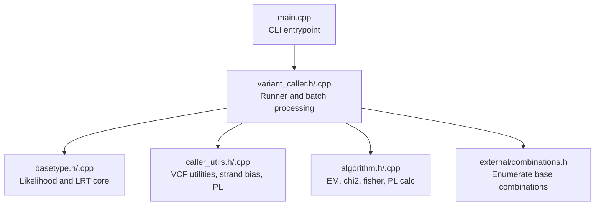
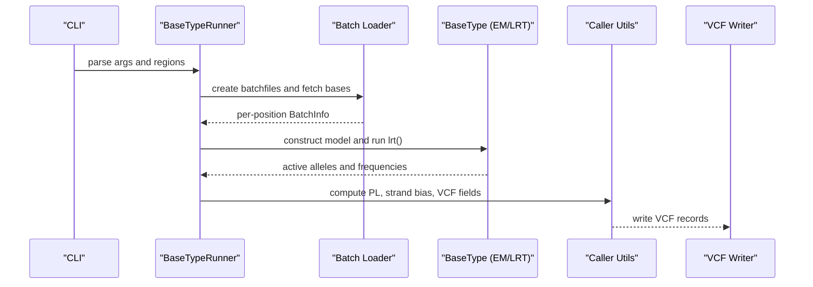
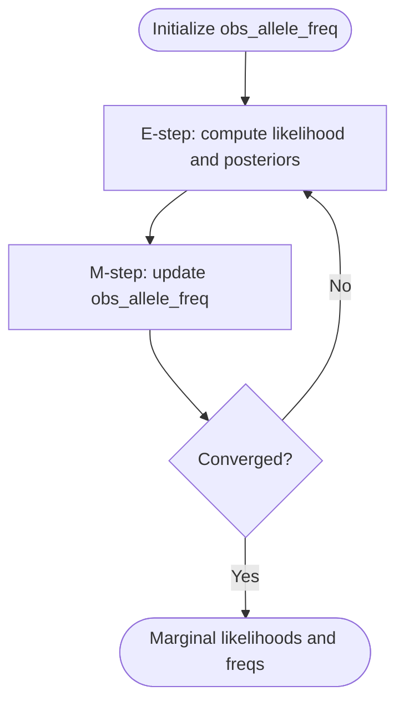
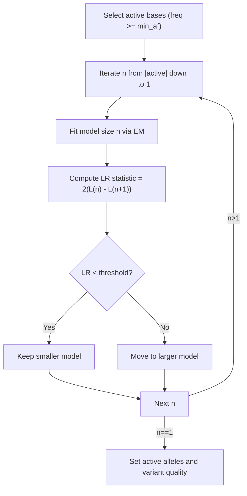
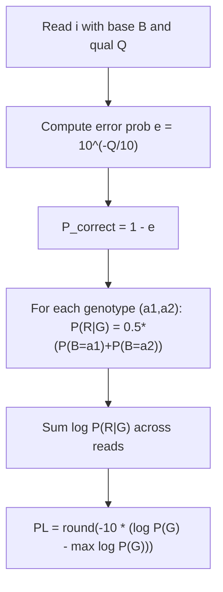
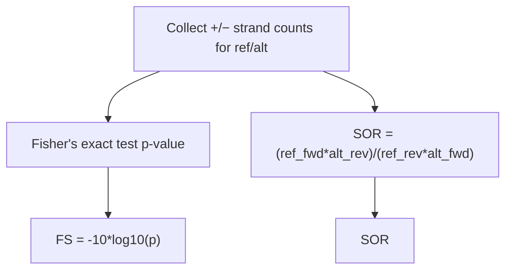
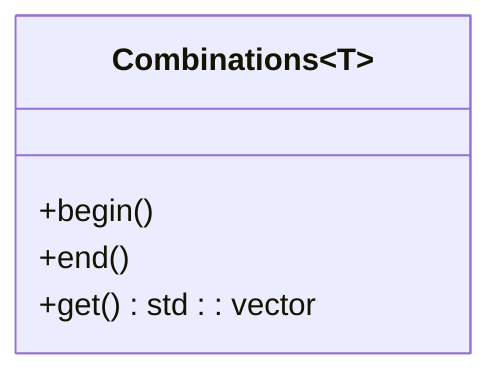
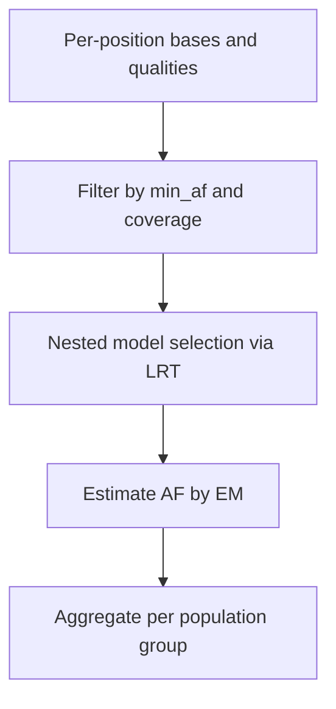
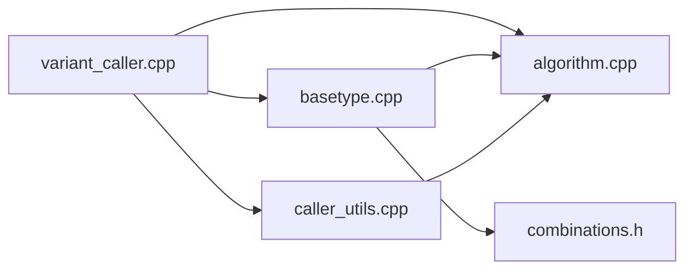

# Mathematical Foundations and Background

<cite>
**Referenced Files in This Document**
- [README.md](file://README.md)
- [main.cpp](file://src/main.cpp)
- [variant_caller.h](file://src/variant_caller.h)
- [variant_caller.cpp](file://src/variant_caller.cpp)
- [basetype.h](file://src/basetype.h)
- [basetype.cpp](file://src/basetype.cpp)
- [caller_utils.h](file://src/caller_utils.h)
- [caller_utils.cpp](file://src/caller_utils.cpp)
- [algorithm.h](file://src/algorithm.h)
- [algorithm.cpp](file://src/algorithm.cpp)
- [combinations.h](file://src/external/combinations.h)
</cite>

## Table of Contents
1. [Introduction](#introduction)
2. [Project Structure](#project-structure)
3. [Core Components](#core-components)
4. [Architecture Overview](#architecture-overview)
5. [Detailed Component Analysis](#detailed-component-analysis)
6. [Dependency Analysis](#dependency-analysis)
7. [Performance Considerations](#performance-considerations)
8. [Troubleshooting Guide](#troubleshooting-guide)
9. [Conclusion](#conclusion)

## Introduction
This document explains the mathematical foundations and background of BaseVar2’s variant calling approach. It focuses on:
- Maximum likelihood estimation (MLE) and Expectation-Maximization (EM)
- Hypothesis testing via likelihood ratio tests (LRT)
- Population genetics principles for allele frequency estimation
- The relationship between observed data (base counts, qualities) and inferred parameters (allele frequencies, genotypes)
- Optimization problems, including constrained optimization with inequality constraints
- Connections between Phred quality scores and error probabilities, including the MLN10TO10 conversion factor
- Combinatorial mathematics for exploring base combinations and computational challenges of exact enumeration
- Numerical analysis aspects including floating-point precision, overflow/underflow handling, and algorithmic stability

## Project Structure
BaseVar2 is organized around a variant caller that:
- Reads aligned reads from BAM/CRAM/SAM
- Builds per-position “batch” data structures
- Performs likelihood-based inference for allele frequencies and genotypes
- Outputs VCF with population-level annotations

**Diagram sources**
- [main.cpp:32-36](file://src/main.cpp#L32-L36)
- [variant_caller.h:41-174](file://src/variant_caller.h#L41-L174)
- [basetype.h:30-143](file://src/basetype.h#L30-L143)
- [caller_utils.h:29-229](file://src/caller_utils.h#L29-L229)
- [algorithm.h:90-177](file://src/algorithm.h#L90-L177)
- [combinations.h:18-49](file://src/external/combinations.h#L18-L49)

**Section sources**
- [README.md:1-181](file://README.md#L1-L181)
- [main.cpp:32-36](file://src/main.cpp#L32-L36)
- [variant_caller.h:41-174](file://src/variant_caller.h#L41-L174)

## Core Components
- Batch data model: per-sample aligned bases, qualities, mapping info, and reference context
- Population-level likelihood modeling: per-allele likelihoods derived from base qualities and EM estimation
- LRT-based selection of active alleles and variant quality
- Genotype likelihood computation (PL) using Phred-scale error probabilities
- Strand-bias metrics (Fisher’s exact test, Symmetric Odds Ratio)

Key mathematical elements:
- Base error probability from Phred quality via exponential transform using MLN10TO10
- EM iterations to estimate allele frequencies from per-read likelihoods
- LRT comparison across nested hypothesis spaces of increasing cardinality
- PL calculation as negative ten times the base-10 logarithm of genotype likelihoods

**Section sources**
- [basetype.h:24-28](file://src/basetype.h#L24-L28)
- [basetype.cpp:65-75](file://src/basetype.cpp#L65-L75)
- [algorithm.cpp:12-88](file://src/algorithm.cpp#L12-L88)
- [caller_utils.cpp:9-62](file://src/caller_utils.cpp#L9-L62)

## Architecture Overview
The caller pipeline:
- Parses CLI and reference
- Creates batchfiles per genomic region
- Loads per-position aligned bases and builds per-site models
- Runs LRT and EM to estimate allele frequencies
- Computes PL and strand bias, writes VCF records

**Diagram sources**
- [variant_caller.cpp:342-438](file://src/variant_caller.cpp#L342-L438)
- [basetype.cpp:137-210](file://src/basetype.cpp#L137-L210)
- [caller_utils.cpp:144-200](file://src/caller_utils.cpp#L144-L200)

## Detailed Component Analysis

### Maximum Likelihood Estimation and EM
- Per-read likelihood: Each read contributes a likelihood vector over the set of unique alleles. Quality scores are converted to base error probabilities using the MLN10TO10 factor, mapping Phred to natural-log scale for numerical stability.
- EM algorithm: Iteratively computes posterior allele assignments and updates allele frequencies until convergence, producing marginal likelihoods used in downstream LRT.

**Diagram sources**
- [algorithm.cpp:194-292](file://src/algorithm.cpp#L194-L292)
- [basetype.cpp:65-75](file://src/basetype.cpp#L65-L75)
- [basetype.h:27](file://src/basetype.h#L27)

**Section sources**
- [algorithm.cpp:194-292](file://src/algorithm.cpp#L194-L292)
- [basetype.cpp:65-75](file://src/basetype.cpp#L65-L75)

### Likelihood Ratio Test (LRT) for Active Alleles
- The algorithm explores nested hypothesis spaces of increasing size (more alleles imply higher likelihood). At each step, it compares the current best model to a simpler one using the difference in log marginal likelihoods.
- A threshold determines whether to accept the simpler model (null) or move to a more complex one (alternative). The final variant quality is derived from the chi-squared p-value of the LRT statistic.

**Diagram sources**
- [basetype.cpp:137-210](file://src/basetype.cpp#L137-L210)
- [basetype.h:25-26](file://src/basetype.h#L25-L26)

**Section sources**
- [basetype.cpp:137-210](file://src/basetype.cpp#L137-L210)

### Genotype Likelihoods (PL) and Phred-Scale Conversion
- For each genotype, compute the product of P(read|allele1) and P(read|allele2) over all reads, then normalize by subtracting the maximum log-likelihood and multiply by -10 to obtain Phred-scaled PL values.
- Base error probability is derived from Phred quality using the standard formula and the MLN10TO10 conversion factor for numerics.

**Diagram sources**
- [algorithm.cpp:12-88](file://src/algorithm.cpp#L12-L88)
- [basetype.cpp:65](file://src/basetype.cpp#L65)

**Section sources**
- [algorithm.cpp:12-88](file://src/algorithm.cpp#L12-L88)
- [basetype.cpp:65](file://src/basetype.cpp#L65)

### Strand Bias Metrics
- Fisher’s Exact Test and Symmetric Odds Ratio are computed from forward/reverse counts for major and alternative alleles to detect strand-specific bias.

**Diagram sources**
- [caller_utils.cpp:9-62](file://src/caller_utils.cpp#L9-L62)

**Section sources**
- [caller_utils.cpp:9-62](file://src/caller_utils.cpp#L9-L62)

### Combinatorial Mathematics and Enumeration
- To explore the hypothesis space of possible sets of alleles, the code enumerates combinations of active bases. The number of combinations grows rapidly with the number of active alleles, and a hard cap prevents excessive computation.

**Diagram sources**
- [combinations.h:18-49](file://src/external/combinations.h#L18-L49)
- [basetype.cpp:113-135](file://src/basetype.cpp#L113-L135)

**Section sources**
- [basetype.cpp:113-135](file://src/basetype.cpp#L113-L135)
- [combinations.h:18-49](file://src/external/combinations.h#L18-L49)

### Population Genetics Principles and Constraints
- Allele frequency estimation is performed per population group when provided. The minimum allele frequency threshold (min_af) acts as a constraint to avoid spurious discoveries at very low coverage.
- The LRT framework naturally enforces constraints: only models supported by the data are accepted, and the threshold ensures parsimony.

**Diagram sources**
- [variant_caller.cpp:184-186](file://src/variant_caller.cpp#L184-L186)
- [basetype.cpp:137-210](file://src/basetype.cpp#L137-L210)

**Section sources**
- [variant_caller.cpp:184-186](file://src/variant_caller.cpp#L184-L186)
- [basetype.cpp:137-210](file://src/basetype.cpp#L137-L210)

## Dependency Analysis
- Variant caller depends on:
  - Batch data structures and utilities for VCF formatting and annotations
  - Mathematical routines for EM, LRT, and PL computation
  - Combinatorial enumerator for hypothesis exploration

**Diagram sources**
- [variant_caller.cpp:342-438](file://src/variant_caller.cpp#L342-L438)
- [basetype.cpp:137-210](file://src/basetype.cpp#L137-L210)
- [caller_utils.cpp:144-200](file://src/caller_utils.cpp#L144-L200)
- [algorithm.cpp:12-88](file://src/algorithm.cpp#L12-L88)
- [combinations.h:18-49](file://src/external/combinations.h#L18-L49)

**Section sources**
- [variant_caller.cpp:342-438](file://src/variant_caller.cpp#L342-L438)
- [basetype.cpp:137-210](file://src/basetype.cpp#L137-L210)
- [caller_utils.cpp:144-200](file://src/caller_utils.cpp#L144-L200)
- [algorithm.cpp:12-88](file://src/algorithm.cpp#L12-L88)
- [combinations.h:18-49](file://src/external/combinations.h#L18-L49)

## Performance Considerations
- Memory footprint is controlled by batching and limiting the window size for fetching reads.
- EM iterations and combination enumeration are bounded to prevent combinatorial explosion.
- Floating-point computations use log-space and normalization to mitigate underflow/overflow.

[No sources needed since this section provides general guidance]

## Troubleshooting Guide
- Low-quality bases are skipped via a base quality threshold.
- Strand bias filtering can be used to flag problematic sites.
- If no variants are found in a region, the pipeline warns and continues.

**Section sources**
- [variant_caller.cpp:563-628](file://src/variant_caller.cpp#L563-L628)
- [caller_utils.cpp:9-62](file://src/caller_utils.cpp#L9-L62)

## Conclusion
BaseVar2 combines rigorous statistical modeling—MLE, EM, and LRT—with practical computational constraints to robustly estimate allele frequencies and call variants from ultra-low-depth data. The approach leverages:
- Accurate conversion of Phred qualities to error probabilities
- Nested hypothesis testing to select active alleles
- Combinatorial enumeration with pruning to manage complexity
- Robust numerical practices for stability