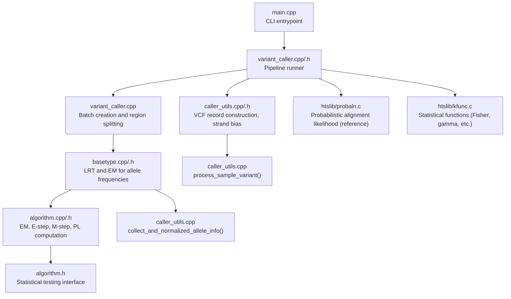
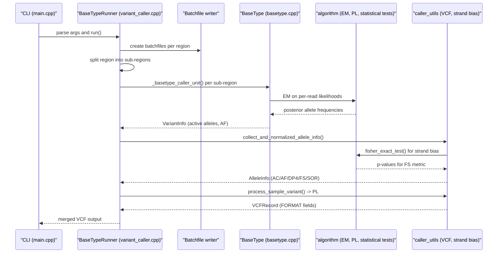
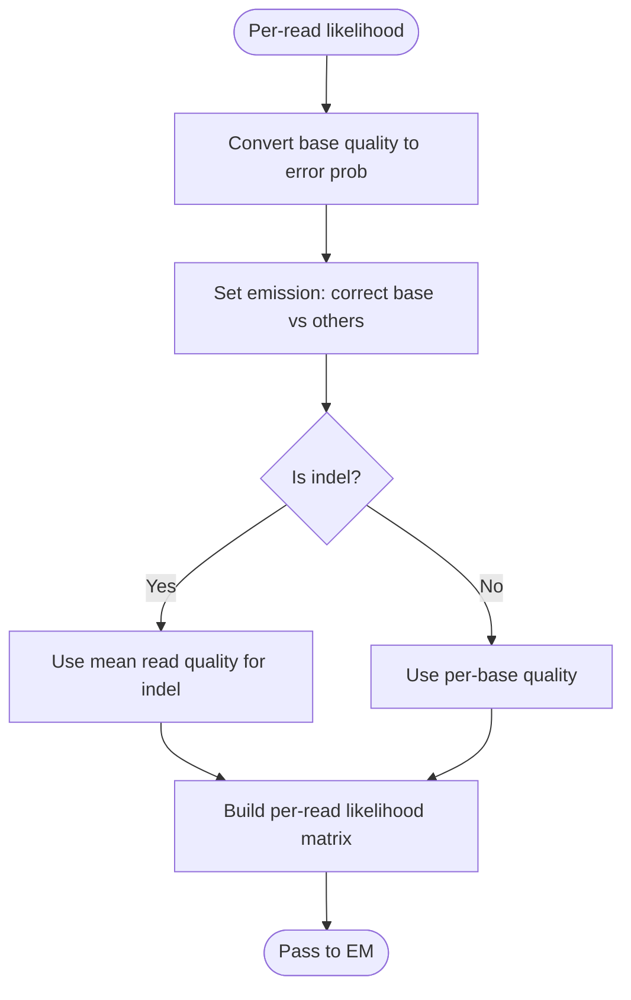
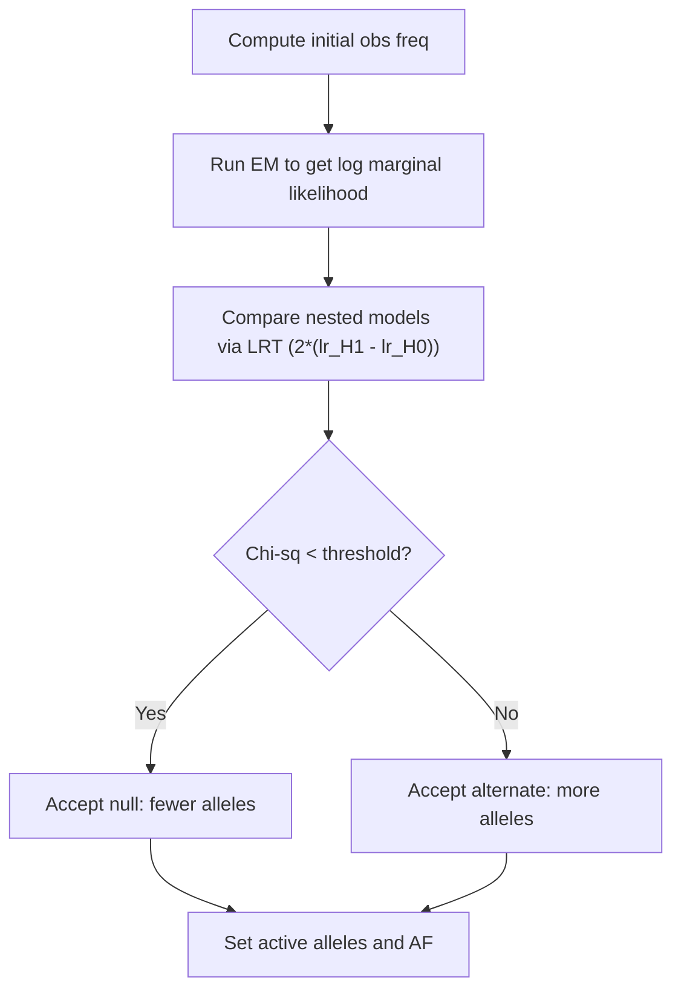
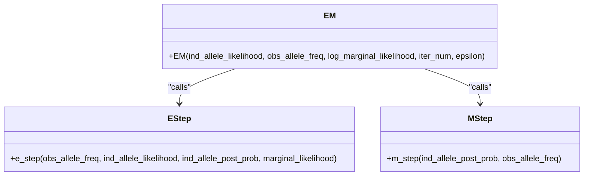
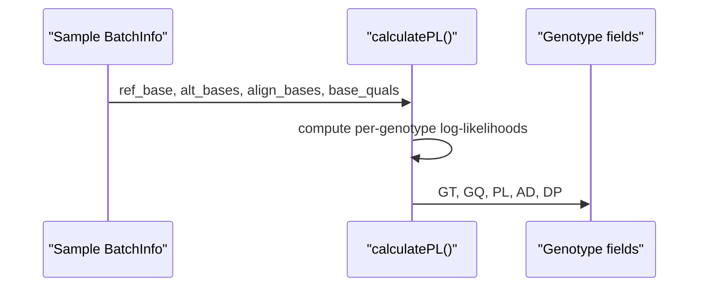
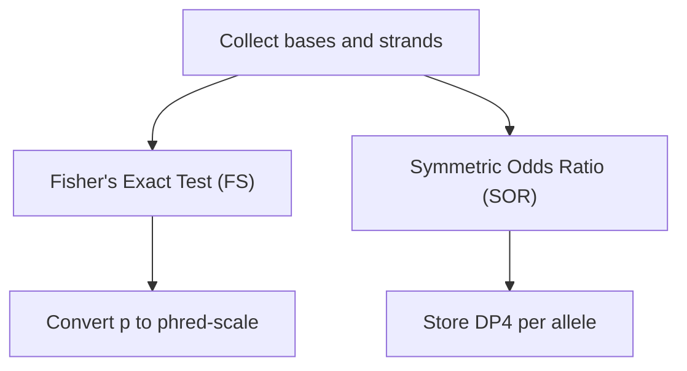
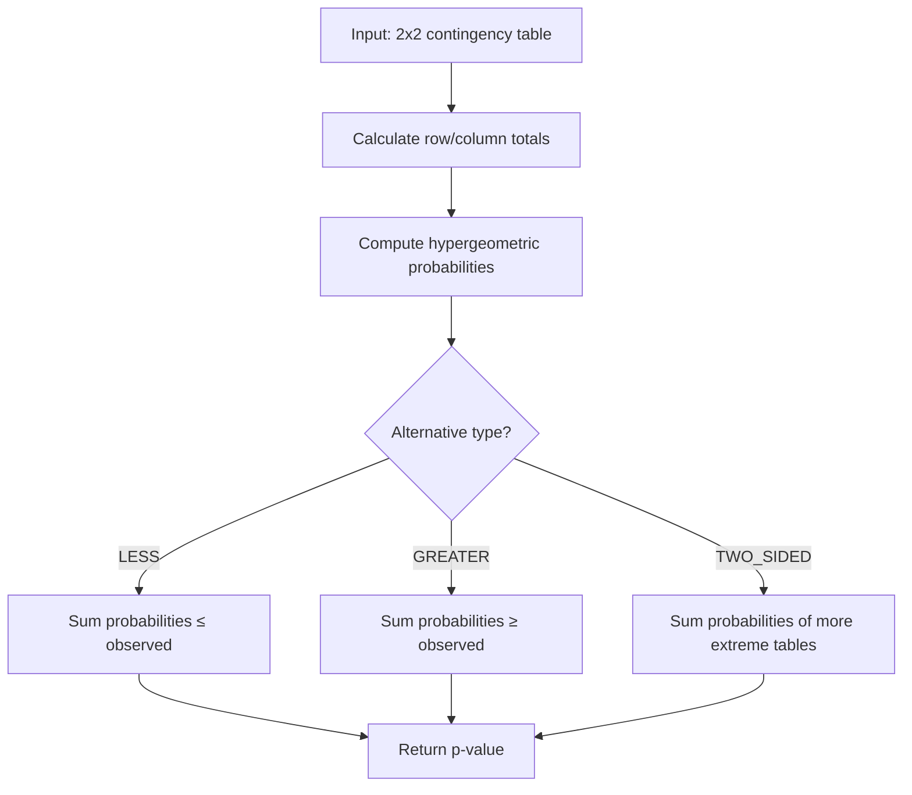
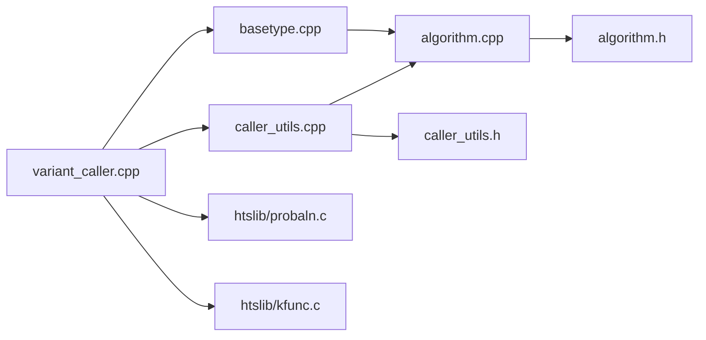

# Statistical Models and Probability Calculations

<cite>
**Referenced Files in This Document**
- [README.md](file://README.md)
- [src/main.cpp](file://src/main.cpp)
- [src/variant_caller.h](file://src/variant_caller.h)
- [src/variant_caller.cpp](file://src/variant_caller.cpp)
- [src/basetype.h](file://src/basetype.h)
- [src/basetype.cpp](file://src/basetype.cpp)
- [src/caller_utils.h](file://src/caller_utils.h)
- [src/caller_utils.cpp](file://src/caller_utils.cpp)
- [src/algorithm.h](file://src/algorithm.h)
- [src/algorithm.cpp](file://src/algorithm.cpp)
- [htslib/probaln.c](file://htslib/probaln.c)
- [htslib/kfunc.c](file://htslib/kfunc.c)
- [htslib/kfunc.h](file://htslib/kfunc.h)
</cite>

## Update Summary
**Changes Made**
- Added comprehensive documentation for Fisher's exact test implementation with support for three alternative types
- Integrated Wilcoxon rank-sum test for non-parametric statistical testing
- Enhanced Expectation-Maximization algorithm documentation with detailed mathematical foundations
- Updated strand bias metrics section to reflect new statistical test implementations
- Expanded statistical testing framework documentation

## Table of Contents
1. [Introduction](#introduction)
2. [Project Structure](#project-structure)
3. [Core Components](#core-components)
4. [Architecture Overview](#architecture-overview)
5. [Detailed Component Analysis](#detailed-component-analysis)
6. [Statistical Testing Framework](#statistical-testing-framework)
7. [Dependency Analysis](#dependency-analysis)
8. [Performance Considerations](#performance-considerations)
9. [Troubleshooting Guide](#troubleshooting-guide)
10. [Conclusion](#conclusion)
11. [Appendices](#appendices)

## Introduction
This document explains BaseVar2's statistical models and probability calculation framework for variant detection. It focuses on:
- Probabilistic models underlying variant detection, including base error models and mapping quality considerations
- Probability calculations for different genotypes and allelic states
- Integration of quality scores, mapping qualities, and base depths in statistical inference
- Role of prior probabilities and their influence on posterior probability calculations
- Mathematical foundations of the Bayesian framework used for variant calling
- Formulas for posterior probabilities, marginal likelihoods, and Bayes factors
- Handling of uncertainty quantification and confidence interval estimation
- Model assumptions, limitations, and validation approaches for statistical model accuracy
- **Updated**: Comprehensive statistical testing framework including Fisher's exact test, Wilcoxon rank-sum test, and detailed EM algorithm documentation

BaseVar2 targets ultra-low-pass whole-genome sequencing data and uses maximum likelihood and likelihood ratio testing (LRT) to estimate allele frequencies and call variants. The implementation integrates EM steps for posterior computation and employs phred-scaled likelihoods for genotypes. The enhanced statistical framework now includes robust non-parametric testing capabilities for strand bias detection and allele frequency estimation.

## Project Structure
High-level components involved in statistical inference:
- Entry point and CLI orchestration
- Variant discovery pipeline (batching, threading, region splitting)
- Per-position statistical inference (BaseType, LRT, EM)
- Genotype likelihood computation and VCF output formatting
- Utility functions for strand bias and merging outputs
- **Updated**: Statistical testing framework (Fisher's exact test, Wilcoxon rank-sum test, EM algorithm)



**Diagram sources**
- [src/main.cpp:32-36](file://src/main.cpp#L32-L36)
- [src/variant_caller.cpp:842-894](file://src/variant_caller.cpp#L842-L894)
- [src/basetype.cpp:14-76](file://src/basetype.cpp#L14-L76)
- [src/algorithm.cpp:12-88](file://src/algorithm.cpp#L12-L88)
- [src/caller_utils.cpp:144-200](file://src/caller_utils.cpp#L144-L200)
- [src/caller_utils.cpp:64-127](file://src/caller_utils.cpp#L64-L127)
- [htslib/probaln.c:268-311](file://htslib/probaln.c#L268-L311)
- [htslib/kfunc.c:245-313](file://htslib/kfunc.c#L245-L313)

**Section sources**
- [README.md:1-181](file://README.md#L1-L181)
- [src/main.cpp:32-36](file://src/main.cpp#L32-L36)
- [src/variant_caller.h:1-180](file://src/variant_caller.h#L1-L180)
- [src/variant_caller.cpp:842-894](file://src/variant_caller.cpp#L842-L894)

## Core Components
- BaseType: Computes per-site likelihoods and performs LRT to select active alleles and estimate frequencies using EM.
- algorithm: Implements E-step, M-step, EM, and phred-scaled genotype likelihoods (PL). **Updated**: Now includes comprehensive statistical testing functions.
- caller_utils: Formats VCF records, computes strand bias, and aggregates allele counts/frequencies.
- variant_caller: Orchestrates batching, threading, and region splitting; feeds per-position data to BaseType and writes VCF.
- **Updated**: Statistical testing framework: Fisher's exact test for 2x2 contingency tables, Wilcoxon rank-sum test for non-parametric analysis, and detailed EM algorithm documentation.

Key statistical constructs:
- Base error model: Quality converted to error probability and uniform error across other bases.
- Mapping quality filtering and strand information integration.
- Prior precision controlled by min-af (MAF threshold) influencing active allele selection.
- Posterior computation via EM and marginal likelihood extraction.
- Genotype likelihoods (PL) derived from per-read likelihoods.
- **Updated**: Advanced statistical testing for strand bias detection and allele frequency estimation.

**Section sources**
- [src/basetype.h:29-146](file://src/basetype.h#L29-L146)
- [src/basetype.cpp:14-76](file://src/basetype.cpp#L14-L76)
- [src/algorithm.h:90-179](file://src/algorithm.h#L90-L179)
- [src/algorithm.cpp:12-88](file://src/algorithm.cpp#L12-L88)
- [src/caller_utils.h:29-230](file://src/caller_utils.h#L29-L230)
- [src/caller_utils.cpp:144-200](file://src/caller_utils.cpp#L144-L200)

## Architecture Overview
End-to-end workflow from BAM/CRAM to VCF with statistical inference:



**Diagram sources**
- [src/main.cpp:32-36](file://src/main.cpp#L32-L36)
- [src/variant_caller.cpp:842-894](file://src/variant_caller.cpp#L842-L894)
- [src/variant_caller.cpp:1148-1186](file://src/variant_caller.cpp#L1148-L1186)
- [src/basetype.cpp:137-210](file://src/basetype.cpp#L137-L210)
- [src/algorithm.cpp:12-88](file://src/algorithm.cpp#L12-L88)
- [src/caller_utils.cpp:64-127](file://src/caller_utils.cpp#L64-L127)
- [src/caller_utils.cpp:144-200](file://src/caller_utils.cpp#L144-L200)
- [src/caller_utils.cpp:9-62](file://src/caller_utils.cpp#L9-L62)

## Detailed Component Analysis

### Probabilistic Models and Base Error Model
- Per-read base emission model:
  - Quality converted to error probability using a log-10 scaling constant.
  - Correct base probability and uniform error across other bases.
- Indel handling:
  - Mean qualities aggregated for insertion/deletion events.
- Mapping quality considerations:
  - Reads with mapping quality below threshold are skipped.
  - Strand information is retained for downstream strand-bias metrics.



**Diagram sources**
- [src/basetype.cpp:65-75](file://src/basetype.cpp#L65-L75)
- [src/algorithm.cpp:44-76](file://src/algorithm.cpp#L44-L76)

**Section sources**
- [src/basetype.cpp:65-75](file://src/basetype.cpp#L65-L75)
- [src/variant_caller.cpp:589-604](file://src/variant_caller.cpp#L589-L604)

### Likelihood Ratio Test (LRT) and Prior Precision
- Active alleles selected if depth proportion meets min-af (MAF-like prior precision).
- LRT compares nested models (fewer vs more alleles) using twice the difference in log marginal likelihoods.
- Threshold determines whether to accept null (fewer alleles) or alternate (more alleles).



**Diagram sources**
- [src/basetype.cpp:113-135](file://src/basetype.cpp#L113-L135)
- [src/basetype.cpp:137-210](file://src/basetype.cpp#L137-L210)
- [src/algorithm.cpp:239-292](file://src/algorithm.cpp#L239-L292)

**Section sources**
- [src/basetype.cpp:137-210](file://src/basetype.cpp#L137-L210)
- [src/basetype.h:25-27](file://src/basetype.h#L25-L27)

### Posterior Probability Computation (EM)
- E-step: Compute joint likelihood and marginal likelihood per read; derive posterior distribution over alleles.
- M-step: Update expected allele frequencies as average of posteriors.
- EM iterates until convergence on log marginal likelihood.



**Diagram sources**
- [src/algorithm.h:150-179](file://src/algorithm.h#L150-L179)
- [src/algorithm.cpp:194-292](file://src/algorithm.cpp#L194-L292)

**Section sources**
- [src/algorithm.cpp:194-292](file://src/algorithm.cpp#L194-L292)

### Genotype Likelihoods (PL) and Posterior Genotypes
- For each read, compute P(read|genotype) by averaging over two alleles.
- PL values are phred-scaled differences from the maximum log-likelihood.
- GQ is set as the second-best PL (analogous to GATK).



**Diagram sources**
- [src/algorithm.cpp:12-88](file://src/algorithm.cpp#L12-L88)
- [src/caller_utils.cpp:144-200](file://src/caller_utils.cpp#L144-L200)

**Section sources**
- [src/algorithm.cpp:12-88](file://src/algorithm.cpp#L12-L88)
- [src/caller_utils.cpp:144-200](file://src/caller_utils.cpp#L144-L200)

### Strand Bias Metrics and Uncertainty
- Strand bias computed via Fisher's exact test (FS) and Symmetric Odds Ratio (SOR).
- DP4 stored in INFO for per-allele forward/reverse support.
- **Updated**: Fisher's exact test now supports three alternative types: left-sided, right-sided, and two-sided alternatives.
- **Updated**: Advanced strand bias detection using comprehensive statistical testing framework.



**Diagram sources**
- [src/caller_utils.cpp:9-62](file://src/caller_utils.cpp#L9-L62)
- [src/caller_utils.h:63-113](file://src/caller_utils.h#L63-L113)

**Section sources**
- [src/caller_utils.cpp:9-62](file://src/caller_utils.cpp#L9-L62)
- [src/caller_utils.h:63-113](file://src/caller_utils.h#L63-L113)

### Integration of Quality Scores, Mapping Qualities, and Depths
- Base quality filtering occurs before likelihood construction.
- Mapping quality filtering is enforced during read collection.
- Depths integrate across samples and alleles for DP, AD, and AF computations.
- Strand information contributes to strand-bias metrics.

**Section sources**
- [src/variant_caller.cpp:589-604](file://src/variant_caller.cpp#L589-L604)
- [src/variant_caller.cpp:702-702](file://src/variant_caller.cpp#L702-L702)
- [src/caller_utils.cpp:144-200](file://src/caller_utils.cpp#L144-L200)

### Mathematical Foundations and Formulas
- Base emission model:
  - P(correct) = 1 − ε
  - P(error to other base) = ε / (K − 1), K = number of bases
- Marginal likelihood:
  - L(data) = Π_i Σ_k P(read_i|k)·P(k)
- Log marginal likelihood:
  - log L(data) = Σ_i log Σ_k P(read_i|k)·P(k)
- LRT statistic:
  - χ² = 2 · (log L_H1 − log L_H0)
- Posterior via EM:
  - E-step: P(k|data_i) ∝ P(read_i|k)·P(k)
  - M-step: P(k) ← average over i of P(k|data_i)
- Genotype likelihoods (PL):
  - P(read_i|genotype g) = 0.5·P(read_i|allele1) + 0.5·P(read_i|allele2)
  - PL = −10·log10(P(read_i|g)/max_g P(read_i|g))
- **Updated**: Fisher's exact test:
  - Hypergeometric distribution for 2x2 contingency tables
  - Left-sided: P(X ≤ x)
  - Right-sided: P(X ≥ x)
  - Two-sided: Sum of probabilities of more extreme tables
- **Updated**: Wilcoxon rank-sum test:
  - Non-parametric test for comparing two independent samples
  - Rank-based statistical significance testing

Note: These formulas are derived from the code's implementation of base error modeling, EM steps, and PL computation.

**Section sources**
- [src/basetype.cpp:65-75](file://src/basetype.cpp#L65-L75)
- [src/algorithm.cpp:194-292](file://src/algorithm.cpp#L194-L292)
- [src/algorithm.cpp:12-88](file://src/algorithm.cpp#L12-L88)
- [htslib/kfunc.c:208-313](file://htslib/kfunc.c#L208-L313)

### Role of Priors and Influence on Posteriors
- min-af acts as a prior-like threshold to prune inactive alleles before LRT.
- EM initializes observed allele frequencies from observed counts; convergence yields posterior distributions.
- LRT threshold selects the most parsimonious model consistent with data.

**Section sources**
- [src/basetype.cpp:141-149](file://src/basetype.cpp#L141-L149)
- [src/basetype.h:25-27](file://src/basetype.h#L25-L27)
- [src/basetype.cpp:172-180](file://src/basetype.cpp#L172-L180)

### Handling of Uncertainty and Confidence Intervals
- FS p-values converted to phred-scaled scores for strand bias assessment.
- SOR provides a symmetric measure of strand bias.
- AF estimates are produced via LRT; convergence thresholds control model selection.
- DP and AD inform depth-based confidence in genotypes.
- **Updated**: Enhanced uncertainty quantification through comprehensive statistical testing framework.

**Section sources**
- [src/caller_utils.cpp:9-62](file://src/caller_utils.cpp#L9-L62)
- [src/caller_utils.cpp:144-200](file://src/caller_utils.cpp#L144-L200)

### Model Assumptions, Limitations, and Validation Approaches
- Assumptions:
  - Independent per-read likelihoods
  - Uniform off-target error across bases
  - Mapping quality thresholds applied consistently
  - EM convergence for posterior updates
  - **Updated**: Statistical tests assume independence and appropriate sample sizes
- Limitations:
  - Computational cost increases with number of active alleles (LRT explores combinations)
  - Large N pruning prevents combinatorial explosion
  - Strand bias metrics rely on sufficient coverage
  - **Updated**: Statistical tests may have limitations with small sample sizes or sparse data
- Validation approaches:
  - Compare AF estimates with known truth sets
  - Evaluate strand-bias metrics (FS/SOR) across replicates
  - Assess genotype concordance using PL/GT comparisons
  - Use region-specific filtering and batched processing to manage memory and runtime
  - **Updated**: Validate statistical test performance with simulated datasets

**Section sources**
- [src/basetype.cpp:148-149](file://src/basetype.cpp#L148-L149)
- [src/variant_caller.cpp:440-495](file://src/variant_caller.cpp#L440-L495)

## Statistical Testing Framework

### Fisher's Exact Test Implementation
BaseVar2 implements Fisher's exact test for 2x2 contingency tables with comprehensive support for different alternative hypotheses:

#### Test Alternatives
- **Left-sided (LESS)**: Tests if the true odds ratio is less than 1
- **Right-sided (GREATER)**: Tests if the true odds ratio is greater than 1  
- **Two-sided (TWO_SIDED)**: Tests if the true odds ratio differs from 1

#### Mathematical Foundation
The implementation uses the hypergeometric distribution:
```
P(X = k) = (C(n1•, n1•) × C(n•1, n•1)) / C(n, n1•)
```

Where:
- n1• = row 1 total, n•1 = column 1 total
- n1• = row 2 total, n•2 = column 2 total
- n = grand total

#### Implementation Details


**Diagram sources**
- [src/algorithm.h:100-136](file://src/algorithm.h#L100-L136)
- [src/algorithm.cpp:91-130](file://src/algorithm.cpp#L91-L130)
- [htslib/kfunc.c:245-313](file://htslib/kfunc.c#L245-L313)

### Wilcoxon Rank-Sum Test
Non-parametric statistical test for comparing two independent samples:

#### Methodology
1. Combine samples and assign ranks
2. Handle ties by averaging ranks
3. Calculate rank sums for each sample
4. Compute Z-score using normal approximation
5. Derive two-tailed p-value

#### Formula
```
Z = (R1 - E[R1]) / σ(R1)
```

Where:
- R1 = rank sum for sample 1
- E[R1] = n1(n1 + n2 + 1) / 2
- σ(R1) = √[n1n2(n1 + n2 + 1) / 12]

**Section sources**
- [src/algorithm.h:138](file://src/algorithm.h#L138)
- [src/algorithm.cpp:132-192](file://src/algorithm.cpp#L132-L192)

### Expectation-Maximization Algorithm
Comprehensive documentation of the EM algorithm for allele frequency estimation:

#### E-step
```
P(k|data_i) ∝ P(read_i|k) × P(k)
marginal_likelihood[i] = Σ_k P(read_i|k) × P(k)
```

#### M-step  
```
P(k) ← (1/n) × Σ_i P(k|data_i)
```

#### Convergence Criteria
- Iteration limit: 100 (default)
- Likelihood convergence: ε = 0.001 (default)
- Stop when |log L(t) - log L(t-1)| < ε

**Section sources**
- [src/algorithm.h:164-179](file://src/algorithm.h#L164-L179)
- [src/algorithm.cpp:239-292](file://src/algorithm.cpp#L239-L292)

## Dependency Analysis
Inter-module dependencies for statistical inference:



**Diagram sources**
- [src/variant_caller.cpp:1148-1186](file://src/variant_caller.cpp#L1148-L1186)
- [src/basetype.cpp:137-210](file://src/basetype.cpp#L137-L210)
- [src/algorithm.cpp:12-88](file://src/algorithm.cpp#L12-L88)
- [src/caller_utils.cpp:144-200](file://src/caller_utils.cpp#L144-L200)
- [htslib/probaln.c:268-311](file://htslib/probaln.c#L268-L311)
- [htslib/kfunc.c:245-313](file://htslib/kfunc.c#L245-L313)

**Section sources**
- [src/variant_caller.cpp:1148-1186](file://src/variant_caller.cpp#L1148-L1186)
- [src/basetype.cpp:137-210](file://src/basetype.cpp#L137-L210)
- [src/algorithm.cpp:12-88](file://src/algorithm.cpp#L12-L88)
- [src/caller_utils.cpp:144-200](file://src/caller_utils.cpp#L144-L200)

## Performance Considerations
- Memory footprint controlled by batch size and region chunking.
- Threading parallelizes region processing and batch creation.
- LRT explores combinations up to a threshold to avoid combinatorial explosion.
- Quality and mapping quality thresholds reduce noise and improve accuracy.
- **Updated**: Statistical tests optimized for computational efficiency with appropriate convergence criteria.

[No sources needed since this section provides general guidance]

## Troubleshooting Guide
Common issues and remedies:
- Low coverage leading to no variants: adjust min-af and quality thresholds.
- Strand bias artifacts: inspect FS/SOR values and filter accordingly.
- Inconsistent sample ordering: ensure batchfile headers match input BAM order.
- Index/build errors: verify bgzip/tabix indexing and file suffixes.
- **Updated**: Statistical test failures: check sample size requirements and data distribution assumptions.
- **Updated**: EM algorithm convergence issues: adjust iteration limits and epsilon thresholds.

**Section sources**
- [src/variant_caller.cpp:908-914](file://src/variant_caller.cpp#L908-L914)
- [src/caller_utils.cpp:281-306](file://src/caller_utils.cpp#L281-L306)

## Conclusion
BaseVar2's statistical framework combines a base-error emission model, EM-based posterior computation, and LRT for selecting active alleles and estimating frequencies. Genotype likelihoods are computed per-read and phred-scaled for downstream VCF fields. Strand bias metrics and depth-based annotations support uncertainty quantification. The enhanced statistical testing framework now provides comprehensive non-parametric testing capabilities for robust variant calling. The pipeline balances accuracy and scalability through batching, threading, and conservative model selection thresholds.

[No sources needed since this section summarizes without analyzing specific files]

## Appendices

### Appendix A: Key Constants and Thresholds
- LRT threshold for Bayes factor-like selection
- QUAL threshold for phred-scaled quality
- ln(10)/10 conversion constant for quality scaling
- **Updated**: Statistical test parameters: Fisher's exact test alternative types, Wilcoxon test significance levels, EM convergence criteria

**Section sources**
- [src/basetype.h:25-27](file://src/basetype.h#L25-L27)

### Appendix B: Reference Alignment Likelihood (Optional)
The probabilistic alignment likelihood computation in htslib illustrates a related Bayesian approach for alignment scoring, complementing BaseVar2's base-level inference.

**Section sources**
- [htslib/probaln.c:268-311](file://htslib/probaln.c#L268-L311)

### Appendix C: Statistical Testing Functions
**Updated**: Comprehensive statistical testing interface:

#### Fisher's Exact Test
```cpp
double fisher_exact_test(int n11, int n12, int n21, int n22, TestSide test_side);
double fisher_exact_test(const ContingencyTable& table, TestSide test_side);
```

#### Wilcoxon Rank-Sum Test
```cpp
double wilcoxon_ranksum_test(const std::vector<double>& sample1, 
                           const std::vector<double>& sample2);
```

#### Chi-Square Test
```cpp
double chi2_test(double chi_sqrt_value, double degree_of_freedom);
```

**Section sources**
- [src/algorithm.h:100-138](file://src/algorithm.h#L100-L138)
- [src/algorithm.cpp:91-192](file://src/algorithm.cpp#L91-L192)

### Appendix D: Mathematical References
**Updated**: Enhanced mathematical foundations:
- Hypergeometric distribution for Fisher's exact test
- Normal approximation for Wilcoxon rank-sum test
- Gamma functions for chi-square distributions
- EM algorithm convergence theory

**Section sources**
- [htslib/kfunc.c:208-313](file://htslib/kfunc.c#L208-L313)
- [src/algorithm.cpp:239-292](file://src/algorithm.cpp#L239-L292)