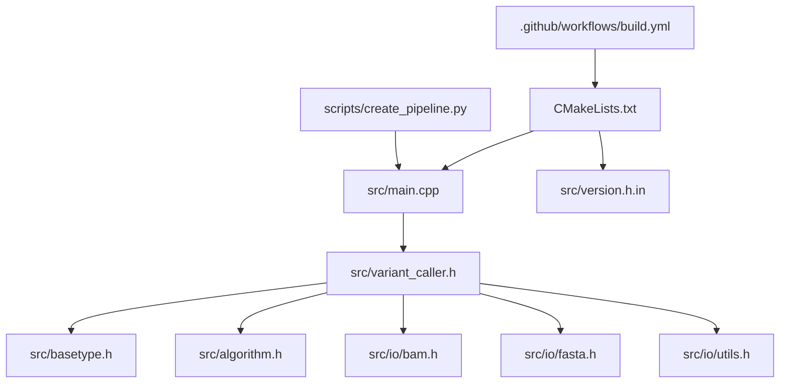
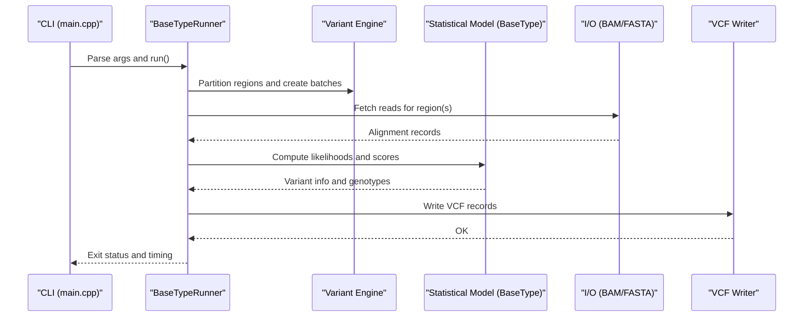
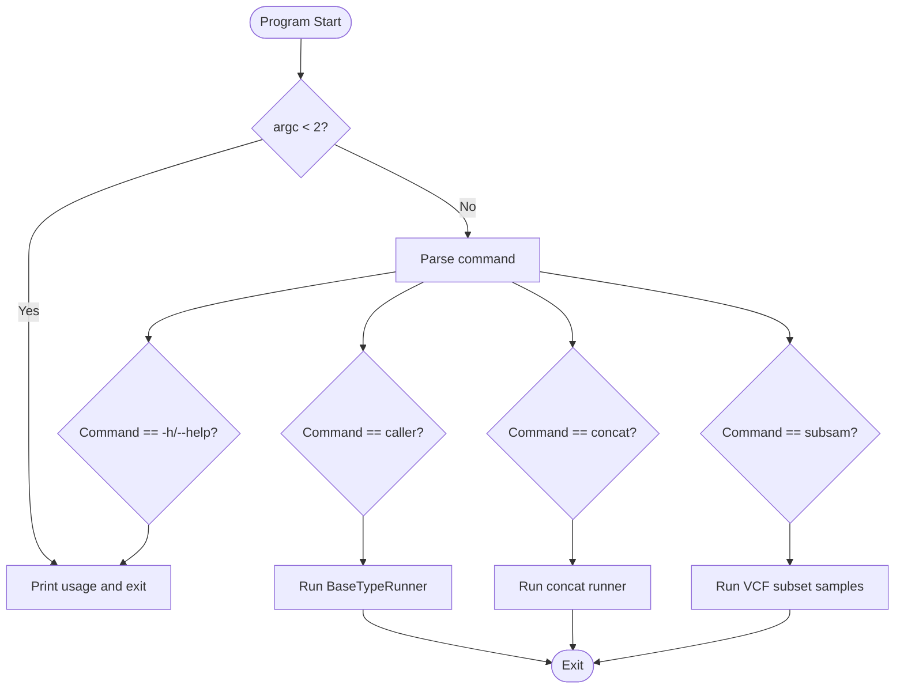
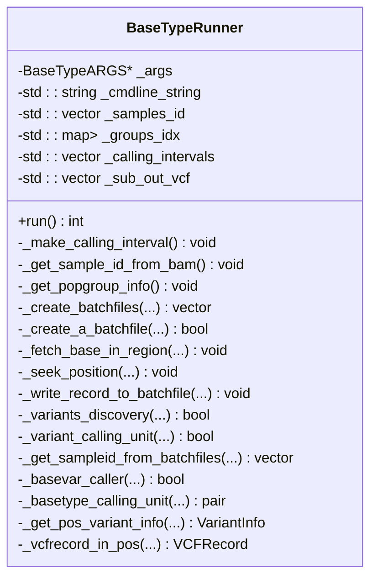
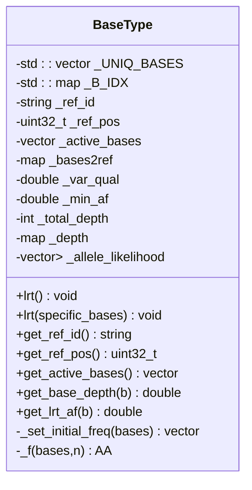
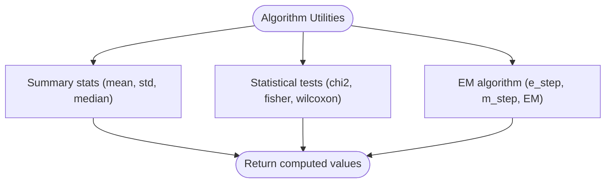
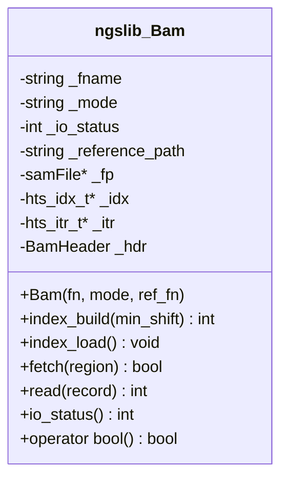
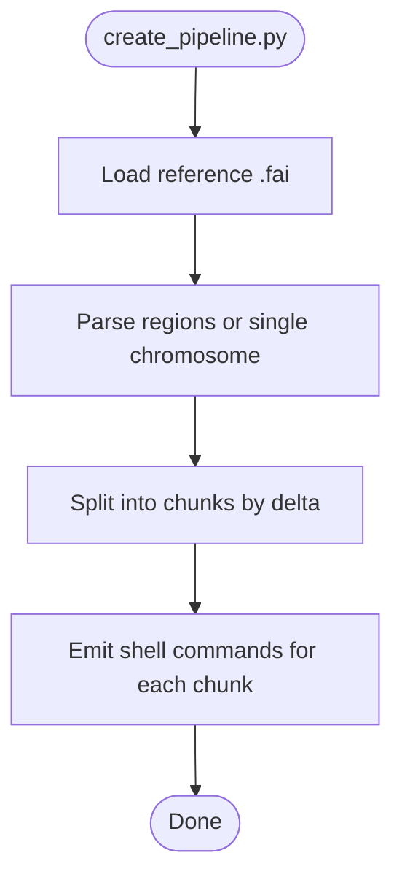
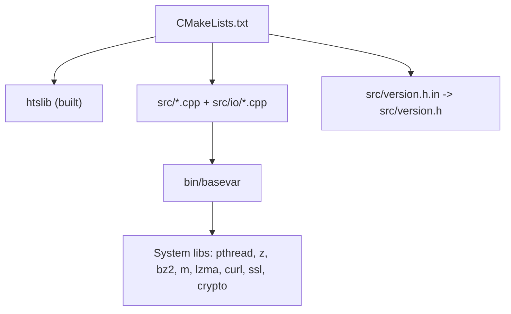

# Developer Guide

<cite>
**Referenced Files in This Document**
- [README.md](file://README.md)
- [CMakeLists.txt](file://CMakeLists.txt)
- [src/main.cpp](file://src/main.cpp)
- [src/variant_caller.h](file://src/variant_caller.h)
- [src/basetype.h](file://src/basetype.h)
- [src/algorithm.h](file://src/algorithm.h)
- [src/version.h.in](file://src/version.h.in)
- [src/io/bam.h](file://src/io/bam.h)
- [.github/workflows/build.yml](file://.github/workflows/build.yml)
- [scripts/create_pipeline.py](file://scripts/create_pipeline.py)
- [bin/manual_install.sh](file://bin/manual_install.sh)
- [note.md](file://note.md)
- [update_note.md](file://update_note.md)
- [tests/io/test_bam.cpp](file://tests/io/test_bam.cpp)
- [tests/io/test_algorithm.cpp](file://tests/io/test_algorithm.cpp)
</cite>

## Table of Contents
1. [Introduction](#introduction)
2. [Project Structure](#project-structure)
3. [Core Components](#core-components)
4. [Architecture Overview](#architecture-overview)
5. [Detailed Component Analysis](#detailed-component-analysis)
6. [Dependency Analysis](#dependency-analysis)
7. [Performance Considerations](#performance-considerations)
8. [Testing Procedures](#testing-procedures)
9. [Development Environment Setup](#development-environment-setup)
10. [Contribution Guidelines](#contribution-guidelines)
11. [Version Control Practices](#version-control-practices)
12. [Pull Request Guidelines](#pull-request-guidelines)
13. [Code Review Process](#code-review-process)
14. [Extending the Codebase](#extending-the-codebase)
15. [Maintaining Backward Compatibility](#maintaining-backward-compatibility)
16. [Debugging Techniques](#debugging-techniques)
17. [Troubleshooting Guide](#troubleshooting-guide)
18. [Conclusion](#conclusion)

## Introduction
BaseVar2 is a C++-based tool designed for variant calling from ultra-low-coverage whole-genome sequencing data, particularly suited for non-invasive prenatal testing applications. It leverages maximum likelihood and likelihood ratio models to detect polymorphisms and estimate allele frequencies efficiently. The project emphasizes high performance and memory efficiency, with a modern C++17 codebase and integrated htslib for NGS file I/O.

## Project Structure
The repository is organized into core source modules, I/O wrappers for NGS formats, tests, scripts, and build configuration. Key areas include:
- src/: Core C++ implementation, including the main entry point, variant caller engine, algorithm utilities, and I/O abstractions.
- src/io/: Thin wrappers around htslib for BAM/CRAM/SAM and FASTA/VCF parsing and writing.
- htslib/: Bundled submodule for NGS file format support.
- tests/: Unit tests for I/O and algorithmic components.
- scripts/: Pipeline generation utilities for distributed execution.
- .github/workflows/: CI configuration for cross-platform builds and testing.
- Root build and documentation files (CMakeLists.txt, README.md, etc.).

**Diagram sources**
- [src/main.cpp:1-93](file://src/main.cpp#L1-L93)
- [src/variant_caller.h:1-180](file://src/variant_caller.h#L1-L180)
- [src/basetype.h:1-146](file://src/basetype.h#L1-L146)
- [src/algorithm.h:1-180](file://src/algorithm.h#L1-L180)
- [src/io/bam.h:1-149](file://src/io/bam.h#L1-L149)
- [CMakeLists.txt:1-62](file://CMakeLists.txt#L1-L62)
- [src/version.h.in:1-13](file://src/version.h.in#L1-L13)
- [.github/workflows/build.yml:1-78](file://.github/workflows/build.yml#L1-L78)
- [scripts/create_pipeline.py:1-103](file://scripts/create_pipeline.py#L1-L103)

**Section sources**
- [README.md:1-181](file://README.md#L1-L181)
- [CMakeLists.txt:1-62](file://CMakeLists.txt#L1-L62)

## Core Components
- Main entry point and CLI dispatcher: routes subcommands to specific runners.
- Variant caller engine: orchestrates region partitioning, batch processing, parallel execution, and VCF output.
- Core statistical model: computes likelihoods and performs likelihood ratio tests for variant detection.
- Algorithm utilities: statistical tests, EM algorithm helpers, and summary statistics.
- I/O abstractions: unified interface for BAM/CRAM/SAM and FASTA/VCF with htslib integration.

Key responsibilities:
- src/main.cpp: Parses top-level commands and prints timing summaries.
- src/variant_caller.h: Encapsulates the caller workflow, region handling, and parallelization.
- src/basetype.h: Implements the core likelihood and variant scoring logic.
- src/algorithm.h: Provides statistical primitives and EM routines.
- src/io/bam.h: Wraps htslib for reading indexed NGS alignments.

**Section sources**
- [src/main.cpp:1-93](file://src/main.cpp#L1-L93)
- [src/variant_caller.h:1-180](file://src/variant_caller.h#L1-L180)
- [src/basetype.h:1-146](file://src/basetype.h#L1-L146)
- [src/algorithm.h:1-180](file://src/algorithm.h#L1-L180)
- [src/io/bam.h:1-149](file://src/io/bam.h#L1-L149)

## Architecture Overview
The system follows a modular architecture:
- CLI layer dispatches to subcommands.
- Variant caller coordinates region splitting, batch creation, parallel worker execution, and output consolidation.
- Statistical model encapsulated in the core class computes per-site likelihoods and variant scores.
- I/O layer abstracts NGS file formats via htslib.

**Diagram sources**
- [src/main.cpp:43-92](file://src/main.cpp#L43-L92)
- [src/variant_caller.h:160-174](file://src/variant_caller.h#L160-L174)
- [src/basetype.h:95-143](file://src/basetype.h#L95-L143)
- [src/io/bam.h:106-143](file://src/io/bam.h#L106-L143)

## Detailed Component Analysis

### Main Entry Point and CLI
- Handles top-level command routing and prints runtime statistics.
- Supports subcommands: caller, concat, subsam.

**Diagram sources**
- [src/main.cpp:43-92](file://src/main.cpp#L43-L92)

**Section sources**
- [src/main.cpp:17-30](file://src/main.cpp#L17-L30)
- [src/main.cpp:32-41](file://src/main.cpp#L32-L41)
- [src/main.cpp:43-92](file://src/main.cpp#L43-L92)

### Variant Caller Engine
- Manages command-line arguments, sample IDs, population groups, and calling intervals.
- Creates temporary batch files per region and coordinates parallel workers.
- Performs variant discovery and writes intermediate outputs.

**Diagram sources**
- [src/variant_caller.h:41-174](file://src/variant_caller.h#L41-L174)

**Section sources**
- [src/variant_caller.h:41-174](file://src/variant_caller.h#L41-L174)

### Statistical Model (BaseType)
- Computes per-site likelihoods and performs likelihood ratio tests.
- Maintains per-base depth, allele frequencies, and variant quality metrics.

**Diagram sources**
- [src/basetype.h:30-143](file://src/basetype.h#L30-L143)

**Section sources**
- [src/basetype.h:29-143](file://src/basetype.h#L29-L143)

### Algorithm Utilities
- Provides statistical tests (Chi-square, Fisher’s exact, Wilcoxon rank-sum), summary statistics, and EM routines.

**Diagram sources**
- [src/algorithm.h:24-178](file://src/algorithm.h#L24-L178)

**Section sources**
- [src/algorithm.h:24-178](file://src/algorithm.h#L24-L178)

### I/O Abstractions (BAM)
- Encapsulates htslib file handles, indexing, and record iteration for SAM/BAM/CRAM.

**Diagram sources**
- [src/io/bam.h:23-145](file://src/io/bam.h#L23-L145)

**Section sources**
- [src/io/bam.h:23-145](file://src/io/bam.h#L23-L145)

### Pipeline Generation Script
- Generates distributed execution commands for BaseVar caller across genomic regions.

**Diagram sources**
- [scripts/create_pipeline.py:26-94](file://scripts/create_pipeline.py#L26-L94)

**Section sources**
- [scripts/create_pipeline.py:26-94](file://scripts/create_pipeline.py#L26-L94)

## Dependency Analysis
- Build system: CMake enforces C++17, configures version header, builds htslib as a prerequisite, and links system libraries.
- Runtime dependencies: htslib (static or shared), zlib, bz2, lzma, pthread, curl, ssl/crypto (Linux).
- Version metadata: Generated from version.h.in via CMake configure_file.

**Diagram sources**
- [CMakeLists.txt:32-61](file://CMakeLists.txt#L32-L61)
- [src/version.h.in:1-13](file://src/version.h.in#L1-L13)

**Section sources**
- [CMakeLists.txt:1-62](file://CMakeLists.txt#L1-L62)
- [bin/manual_install.sh:1-13](file://bin/manual_install.sh#L1-L13)

## Performance Considerations
- Compilation flags: Optimized builds with aggressive optimization and position-independent code.
- Memory footprint: Threaded execution with controlled batch sizes to limit per-thread memory usage.
- Parallelism: Multi-threaded processing of genomic regions; consider tuning thread counts and batch sizes for throughput vs. memory trade-offs.
- I/O efficiency: Index-aware fetching and streaming reads to minimize disk access.
- Statistical computations: Efficient matrix operations and iterative algorithms (EM) with early stopping criteria.

[No sources needed since this section provides general guidance]

## Testing Procedures
- Unit tests: Located under tests/, covering I/O and algorithmic components.
- CI pipeline: Automated builds and tests on Ubuntu and macOS with dependency installation and artifact upload.
- Manual verification: Use provided scripts and example datasets to validate correctness and performance.

Recommended steps:
- Build with BUILD_TESTING enabled.
- Run ctest to execute all tests.
- Validate I/O tests with small datasets.
- Verify algorithmic tests for statistical functions.

**Section sources**
- [.github/workflows/build.yml:50-53](file://.github/workflows/build.yml#L50-L53)
- [tests/io/test_bam.cpp:1-112](file://tests/io/test_bam.cpp#L1-L112)
- [tests/io/test_algorithm.cpp:1-43](file://tests/io/test_algorithm.cpp#L1-L43)

## Development Environment Setup
- Prerequisites: C++17-capable compiler, CMake, Git, and system libraries (zlib, bz2, lzma, pthread, curl, ssl/crypto on Linux).
- Recommended build method: CMake-based build with htslib built as part of the project.
- Alternative manual build: Provided script demonstrates linking against system or bundled htslib.

Steps:
- Clone repository and initialize submodules.
- Configure with CMake and build.
- Optionally enable tests and run ctest.

**Section sources**
- [README.md:19-107](file://README.md#L19-L107)
- [CMakeLists.txt:22-46](file://CMakeLists.txt#L22-L46)
- [bin/manual_install.sh:1-13](file://bin/manual_install.sh#L1-L13)

## Contribution Guidelines
- Coding standards: Use C++17 features, RAII, STL containers, and avoid global mutable state. Keep functions and classes cohesive and focused.
- Naming conventions: Prefer descriptive identifiers; use camelCase for local variables and PascalCase for classes.
- Error handling: Throw exceptions for unrecoverable errors; return error codes for recoverable conditions.
- Documentation: Add comments for complex logic and maintain inline documentation for public APIs.
- Commit hygiene: Keep commits atomic and well-described; reference issues in commit messages.

[No sources needed since this section provides general guidance]

## Version Control Practices
- Branching: Develop features on topic branches; merge to main via pull requests.
- Tags: Use semantic versioning for releases; update version.h.in accordingly.
- Changelog: Maintain update notes for major changes and breaking updates.

**Section sources**
- [update_note.md:1-36](file://update_note.md#L1-L36)

## Pull Request Guidelines
- Scope: Limit PRs to a single concern; reference related issues.
- Tests: Include or update tests; ensure CI passes.
- Reviews: Request reviews from maintainers; address feedback promptly.
- Description: Summarize changes, rationale, and migration notes for breaking changes.

[No sources needed since this section provides general guidance]

## Code Review Process
- Automated checks: CI validates builds on multiple platforms.
- Human review: Ensure adherence to style, correctness, and performance expectations.
- Approval: Require at least one maintainer approval before merging.

**Section sources**
- [.github/workflows/build.yml:11-78](file://.github/workflows/build.yml#L11-L78)

## Extending the Codebase
- New features: Add new modules under src/ or src/io/ as appropriate; integrate via CMake.
- I/O extensions: Wrap htslib APIs in thin classes mirroring existing patterns (see ngslib::Bam).
- Statistical enhancements: Extend algorithm.h with new tests or routines; ensure numerical stability.
- CLI additions: Register new subcommands in main.cpp and add usage/help text.

Guidance:
- Follow existing class and function patterns.
- Keep interfaces minimal and consistent.
- Provide tests for new functionality.

**Section sources**
- [src/io/bam.h:23-145](file://src/io/bam.h#L23-L145)
- [src/algorithm.h:90-178](file://src/algorithm.h#L90-L178)
- [src/main.cpp:17-30](file://src/main.cpp#L17-L30)

## Maintaining Backward Compatibility
- API stability: Avoid removing or renaming public methods and classes.
- CLI compatibility: Preserve existing flags and subcommands; deprecate gradually with warnings.
- Output formats: Maintain VCF field compatibility; document changes in release notes.
- Data model: Keep internal data structures stable; expose via stable interfaces.

**Section sources**
- [update_note.md:25-31](file://update_note.md#L25-L31)

## Debugging Techniques
- Profiling: Use Taskflow profiler to analyze parallel execution bottlenecks; export JSON and visualize online.
- Logging: Print timing and progress markers; leverage runtime diagnostics.
- I/O validation: Verify indices and region queries; confirm read iteration behavior.
- Statistical checks: Validate likelihood computations and edge cases.

**Section sources**
- [note.md:190-211](file://note.md#L190-L211)
- [tests/io/test_bam.cpp:26-112](file://tests/io/test_bam.cpp#L26-L112)

## Troubleshooting Guide
Common issues and resolutions:
- Build failures due to missing dependencies: Install required system packages (zlib, bz2, lzma, curl, ssl/crypto).
- htslib build errors: Ignore non-critical test warnings during htslib configure/make; the library should still compile.
- Linker errors: Ensure correct linking order and inclusion of all required system libraries.
- Runtime crashes: Validate input files and indices; check region specifications.

**Section sources**
- [README.md:70-84](file://README.md#L70-L84)
- [CMakeLists.txt:42-46](file://CMakeLists.txt#L42-L46)

## Conclusion
BaseVar2 offers a robust, high-performance framework for ultra-low-coverage variant calling. Contributors should focus on modular design, rigorous testing, and careful attention to performance and compatibility. The documented architecture and CI practices provide a solid foundation for extending functionality while maintaining reliability.