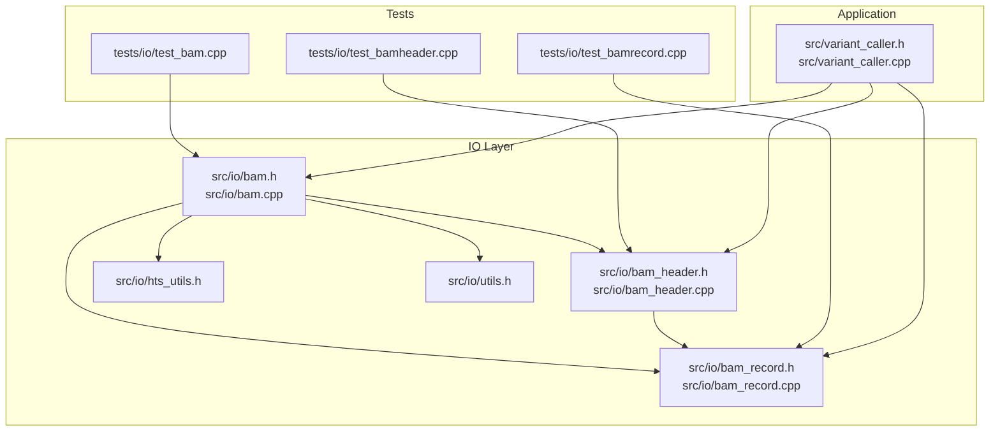
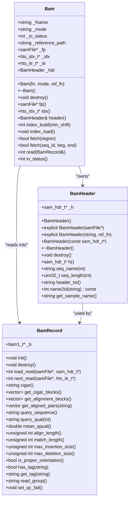
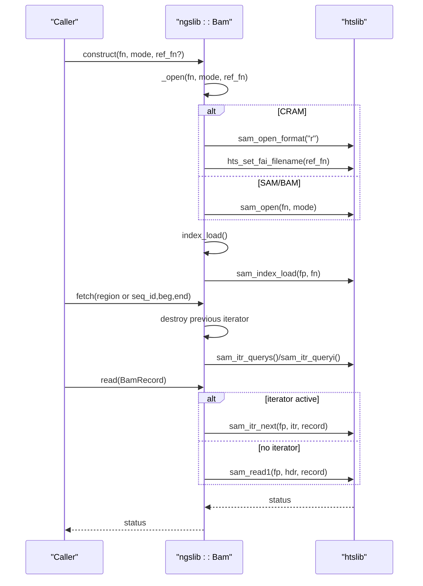
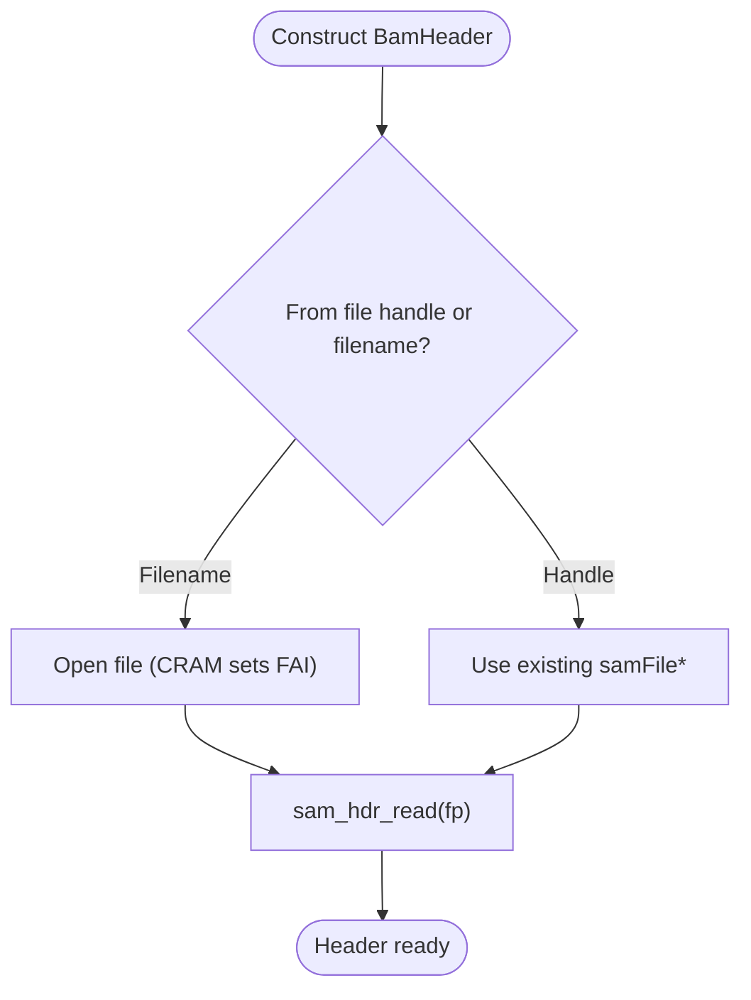
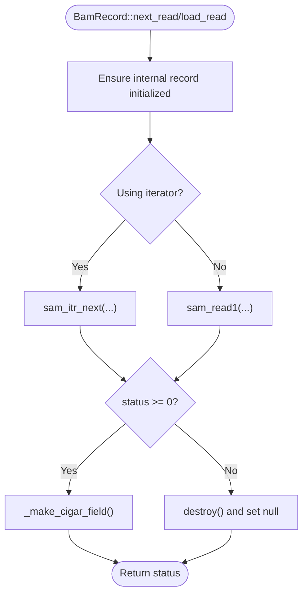
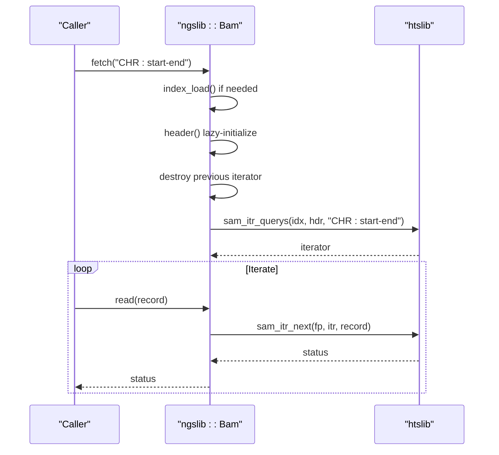
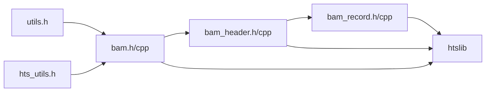

# BAM/CRAM Alignment Processing

<cite>
**Referenced Files in This Document**
- [bam.h](file://src/io/bam.h)
- [bam.cpp](file://src/io/bam.cpp)
- [bam_header.h](file://src/io/bam_header.h)
- [bam_header.cpp](file://src/io/bam_header.cpp)
- [bam_record.h](file://src/io/bam_record.h)
- [bam_record.cpp](file://src/io/bam_record.cpp)
- [hts_utils.h](file://src/io/hts_utils.h)
- [utils.h](file://src/io/utils.h)
- [test_bam.cpp](file://tests/io/test_bam.cpp)
- [test_bamheader.cpp](file://tests/io/test_bamheader.cpp)
- [test_bamrecord.cpp](file://tests/io/test_bamrecord.cpp)
- [variant_caller.h](file://src/variant_caller.h)
- [variant_caller.cpp](file://src/variant_caller.cpp)
</cite>

## Table of Contents
1. [Introduction](#introduction)
2. [Project Structure](#project-structure)
3. [Core Components](#core-components)
4. [Architecture Overview](#architecture-overview)
5. [Detailed Component Analysis](#detailed-component-analysis)
6. [Dependency Analysis](#dependency-analysis)
7. [Performance Considerations](#performance-considerations)
8. [Troubleshooting Guide](#troubleshooting-guide)
9. [Conclusion](#conclusion)
10. [Appendices](#appendices)

## Introduction
This document describes BaseVar2’s BAM/CRAM alignment file processing system centered on the ngslib::Bam class and its supporting classes ngslib::BamHeader and ngslib::BamRecord. The system integrates tightly with htslib to support SAM/BAM/CRAM formats, region-based fetching via iterators, and efficient memory handling for large-scale genomic data. It covers file opening modes, compression handling, index management, region-based retrieval, iterator usage, and practical examples for opening files, fetching regions, and processing alignment records.

## Project Structure
The BAM/CRAM processing resides under src/io and is complemented by tests under tests/io. The variant caller workflow (src/variant_caller.*) demonstrates how the BAM subsystem is used in practice for large-scale variant discovery.

**Diagram sources**
- [bam.h:20-149](file://src/io/bam.h#L20-L149)
- [bam.cpp:4-167](file://src/io/bam.cpp#L4-L167)
- [bam_header.h:18-121](file://src/io/bam_header.h#L18-L121)
- [bam_header.cpp:3-102](file://src/io/bam_header.cpp#L3-L102)
- [bam_record.h:22-455](file://src/io/bam_record.h#L22-L455)
- [bam_record.cpp:4-551](file://src/io/bam_record.cpp#L4-L551)
- [hts_utils.h:10-61](file://src/io/hts_utils.h#L10-L61)
- [utils.h:19-205](file://src/io/utils.h#L19-L205)
- [test_bam.cpp:1-112](file://tests/io/test_bam.cpp#L1-L112)
- [test_bamheader.cpp:1-73](file://tests/io/test_bamheader.cpp#L1-L73)
- [test_bamrecord.cpp:1-146](file://tests/io/test_bamrecord.cpp#L1-L146)
- [variant_caller.h:10-180](file://src/variant_caller.h#L10-L180)
- [variant_caller.cpp:1-200](file://src/variant_caller.cpp#L1-L200)

**Section sources**
- [bam.h:20-149](file://src/io/bam.h#L20-L149)
- [bam.cpp:4-167](file://src/io/bam.cpp#L4-L167)
- [bam_header.h:18-121](file://src/io/bam_header.h#L18-L121)
- [bam_header.cpp:3-102](file://src/io/bam_header.cpp#L3-L102)
- [bam_record.h:22-455](file://src/io/bam_record.h#L22-L455)
- [bam_record.cpp:4-551](file://src/io/bam_record.cpp#L4-L551)
- [hts_utils.h:10-61](file://src/io/hts_utils.h#L10-L61)
- [utils.h:19-205](file://src/io/utils.h#L19-L205)
- [test_bam.cpp:1-112](file://tests/io/test_bam.cpp#L1-L112)
- [test_bamheader.cpp:1-73](file://tests/io/test_bamheader.cpp#L1-L73)
- [test_bamrecord.cpp:1-146](file://tests/io/test_bamrecord.cpp#L1-L146)
- [variant_caller.h:10-180](file://src/variant_caller.h#L10-L180)
- [variant_caller.cpp:1-200](file://src/variant_caller.cpp#L1-L200)

## Core Components
- ngslib::Bam: High-level interface to open SAM/BAM/CRAM files, manage indices, create region iterators, and iterate over records. It wraps htslib’s samFile, hts_idx_t, and hts_itr_t.
- ngslib::BamHeader: Wraps htslib’s sam_hdr_t to expose header metadata, contig name/id mapping, and sample name extraction.
- ngslib::BamRecord: Wraps htslib’s bam1_t and provides convenient accessors for flags, mapping info, query sequence/qualities, CIGAR parsing, alignment blocks, and tags.

Key capabilities:
- File opening modes and compression: Supports reading SAM/BAM/CRAM with automatic detection and compression handling via htslib.
- CRAM specifics: Requires a reference FASTA path; sets FAI filename for CRAM decoding.
- Index management: Loads BAI/BAI-like indices automatically; supports building indices.
- Region-based fetching: Parses region strings and creates iterators for targeted retrieval.
- Iterator usage: Iterators enable streaming reads over specified regions with minimal memory overhead.
- Memory-efficient record processing: Records are loaded on-demand and destroyed upon EOF/error.

**Section sources**
- [bam.h:23-149](file://src/io/bam.h#L23-L149)
- [bam.cpp:6-167](file://src/io/bam.cpp#L6-L167)
- [bam_header.h:22-118](file://src/io/bam_header.h#L22-L118)
- [bam_header.cpp:5-102](file://src/io/bam_header.cpp#L5-L102)
- [bam_record.h:49-455](file://src/io/bam_record.h#L49-L455)
- [bam_record.cpp:64-551](file://src/io/bam_record.cpp#L64-L551)

## Architecture Overview
The system integrates three layers:
- IO Layer: ngslib::Bam, ngslib::BamHeader, ngslib::BamRecord wrap htslib APIs.
- Utilities: Helpers for format detection and general utilities.
- Application Layer: Variant caller orchestrates region splitting, batch processing, and multi-sample workflows.

**Diagram sources**
- [bam.h:23-149](file://src/io/bam.h#L23-L149)
- [bam.cpp:6-167](file://src/io/bam.cpp#L6-L167)
- [bam_header.h:22-118](file://src/io/bam_header.h#L22-L118)
- [bam_header.cpp:5-102](file://src/io/bam_header.cpp#L5-L102)
- [bam_record.h:49-455](file://src/io/bam_record.h#L49-L455)
- [bam_record.cpp:64-551](file://src/io/bam_record.cpp#L64-L551)

## Detailed Component Analysis

### Bam Class: File Opening, Compression, and Index Management
- File opening:
  - Mode parsing follows htslib conventions: [rwa][bcefFguxz0-9]*. Reading mode is validated against readability checks; writing/appending modes are supported with format specifiers for binary/text and compression.
  - CRAM requires a reference FASTA path; the implementation sets the FAI filename via htslib before opening.
- Index management:
  - On open, the system attempts to load an index (BAI/CSI/other) and throws if missing.
  - Provides index_build to generate indices programmatically.
- Region-based fetching:
  - fetch accepts either a region string or explicit seq_id/beg/end.
  - Uses htslib’s iterator creation and destroys previous iterators before creating new ones.

**Diagram sources**
- [bam.cpp:6-167](file://src/io/bam.cpp#L6-L167)
- [bam.h:68-143](file://src/io/bam.h#L68-L143)

**Section sources**
- [bam.h:23-149](file://src/io/bam.h#L23-L149)
- [bam.cpp:6-167](file://src/io/bam.cpp#L6-L167)
- [hts_utils.h:35-56](file://src/io/hts_utils.h#L35-L56)

### BamHeader: Accessing Alignment Header Data
- Construction:
  - From a file handle or filename; for CRAM, ensures FAI is set.
- Exposes:
  - Contig name/id mapping via name2id.
  - Sequence names and lengths by index.
  - Header text and sample name extraction from @RG:SM.

**Diagram sources**
- [bam_header.cpp:5-80](file://src/io/bam_header.cpp#L5-L80)
- [bam_header.h:50-118](file://src/io/bam_header.h#L50-L118)

**Section sources**
- [bam_header.h:22-118](file://src/io/bam_header.h#L22-L118)
- [bam_header.cpp:5-102](file://src/io/bam_header.cpp#L5-L102)

### BamRecord: Accessing Alignment Data
- Loading:
  - load_read for streaming from a file.
  - next_read for streaming from an iterator.
- CIGAR and alignment blocks:
  - get_cigar_blocks and get_alignment_blocks compute block-level coordinates.
  - get_aligned_pairs produces per-base comparisons between read and reference.
- Quality and statistics:
  - query_sequence/query_qual and mean_qqual.
  - align_length, match_length, max insertion/deletion sizes.
- Tags and flags:
  - has_tag and get_tag for generic tag access.
  - Rich flag helpers for paired/mapped/strand/proper-pair/etc.
- Read group:
  - read_group prefers RG tag, falls back to qname parsing.

**Diagram sources**
- [bam_record.cpp:90-120](file://src/io/bam_record.cpp#L90-L120)
- [bam_record.h:94-116](file://src/io/bam_record.h#L94-L116)

**Section sources**
- [bam_record.h:49-455](file://src/io/bam_record.h#L49-L455)
- [bam_record.cpp:64-551](file://src/io/bam_record.cpp#L64-L551)

### Integration with htslib for Compatibility and Performance
- The system relies on htslib for:
  - File format detection and I/O.
  - Index loading/building and region parsing.
  - Iterator-based random access for targeted regions.
  - CRAM decoding and FAI integration.
- This ensures broad compatibility across SAM/BAM/CRAM and leverages htslib’s optimized I/O and compression.

**Section sources**
- [bam.cpp:12-30](file://src/io/bam.cpp#L12-L30)
- [bam_header.cpp:17-31](file://src/io/bam_header.cpp#L17-L31)
- [hts_utils.h:35-56](file://src/io/hts_utils.h#L35-L56)

### Region-Based Fetching Mechanism and Iterator Usage
- Region parsing:
  - Accepts region strings compatible with hts_parse_reg semantics.
  - Supports whole-contig, partial spans, and special tokens.
- Iterator lifecycle:
  - Each fetch invalidates the previous iterator and creates a new one.
  - Subsequent read calls use the iterator until EOF.
- Memory efficiency:
  - Records are processed incrementally; no buffering of entire chromosomes.

**Diagram sources**
- [bam.cpp:103-135](file://src/io/bam.cpp#L103-L135)
- [bam.h:106-135](file://src/io/bam.h#L106-L135)

**Section sources**
- [bam.h:106-135](file://src/io/bam.h#L106-L135)
- [bam.cpp:103-135](file://src/io/bam.cpp#L103-L135)

### Practical Examples
- Opening files:
  - Reading CRAM requires a reference FASTA path; otherwise, SAM/BAM open with mode string.
  - See tests for constructing ngslib::Bam with filenames and modes.
- Fetching regions:
  - Use fetch with region strings or seq_id/beg/end.
  - Iterate over records via next/read until status indicates EOF.
- Processing alignment records:
  - Access flags, mapping info, CIGAR, alignment blocks, and tags via BamRecord methods.

Examples are demonstrated in the test files:
- [test_bam.cpp:26-112](file://tests/io/test_bam.cpp#L26-L112)
- [test_bamheader.cpp:8-73](file://tests/io/test_bamheader.cpp#L8-L73)
- [test_bamrecord.cpp:16-146](file://tests/io/test_bamrecord.cpp#L16-L146)

**Section sources**
- [test_bam.cpp:26-112](file://tests/io/test_bam.cpp#L26-L112)
- [test_bamheader.cpp:8-73](file://tests/io/test_bamheader.cpp#L8-L73)
- [test_bamrecord.cpp:16-146](file://tests/io/test_bamrecord.cpp#L16-L146)

## Dependency Analysis
- Internal dependencies:
  - Bam depends on BamHeader and uses htslib types.
  - BamRecord depends on BamHeader for contig name/id mapping and uses htslib types.
  - Utility helpers (hts_utils.h, utils.h) support format detection and general operations.
- External dependencies:
  - htslib for file I/O, indexing, iteration, and CRAM decoding.
- Application integration:
  - Variant caller uses Bam/BamHeader/BamRecord to process batches of samples and regions.

**Diagram sources**
- [utils.h:19-205](file://src/io/utils.h#L19-L205)
- [hts_utils.h:10-61](file://src/io/hts_utils.h#L10-L61)
- [bam.h:13-18](file://src/io/bam.h#L13-L18)
- [bam_header.h:12-16](file://src/io/bam_header.h#L12-L16)
- [bam_record.h:15-19](file://src/io/bam_record.h#L15-L19)

**Section sources**
- [utils.h:19-205](file://src/io/utils.h#L19-L205)
- [hts_utils.h:10-61](file://src/io/hts_utils.h#L10-L61)
- [bam.h:13-18](file://src/io/bam.h#L13-L18)
- [bam_header.h:12-16](file://src/io/bam_header.h#L12-L16)
- [bam_record.h:15-19](file://src/io/bam_record.h#L15-L19)

## Performance Considerations
- Prefer region-based fetching with iterators to avoid loading entire chromosomes.
- Use appropriate compression and index formats (BAI/CSI) for fast random access.
- Stream records and avoid retaining large buffers; BamRecord manages memory for individual records.
- For multi-sample workflows, process one file at a time and split regions to leverage parallelization safely.

[No sources needed since this section provides general guidance]

## Troubleshooting Guide
Common issues and resolutions:
- CRAM requires a reference FASTA path:
  - Ensure ref_fn is provided when opening CRAM; otherwise, exceptions are thrown.
- Missing index:
  - If index_load fails, build an index using index_build before attempting fetch.
- Invalid region:
  - fetch throws on failure; confirm region syntax and contig names match header.
- EOF handling:
  - read returns negative status on EOF; destroy the record on negative status.

**Section sources**
- [bam.cpp:12-30](file://src/io/bam.cpp#L12-L30)
- [bam.cpp:86-97](file://src/io/bam.cpp#L86-L97)
- [bam.cpp:103-135](file://src/io/bam.cpp#L103-L135)
- [bam_record.cpp:90-120](file://src/io/bam_record.cpp#L90-L120)

## Conclusion
BaseVar2’s BAM/CRAM processing system provides a robust, htslib-backed interface for reading SAM/BAM/CRAM files, managing indices, and iterating over regions efficiently. The ngslib::Bam, ngslib::BamHeader, and ngslib::BamRecord classes encapsulate htslib APIs into a developer-friendly model, enabling scalable, memory-efficient processing of large genomic datasets. The variant caller demonstrates practical usage patterns for multi-sample, multi-region workflows.

[No sources needed since this section summarizes without analyzing specific files]

## Appendices

### API Summary: Key Methods
- ngslib::Bam
  - Constructors, assignment, destroy, fp, idx, header, index_build, index_load, fetch, read, io_status
- ngslib::BamHeader
  - Constructors, destroy, h, seq_name, seq_length, header_txt, name2id, get_sample_name
- ngslib::BamRecord
  - load_read, next_read, cigar, get_cigar_blocks, get_alignment_blocks, get_aligned_pairs, query_sequence, query_qual, mean_qqual, align_length, match_length, max_insertion_size, max_deletion_size, is_proper_orientation, has_tag, get_tag, read_group, set_qc_fail

**Section sources**
- [bam.h:74-149](file://src/io/bam.h#L74-L149)
- [bam_header.h:50-118](file://src/io/bam_header.h#L50-L118)
- [bam_record.h:78-455](file://src/io/bam_record.h#L78-L455)