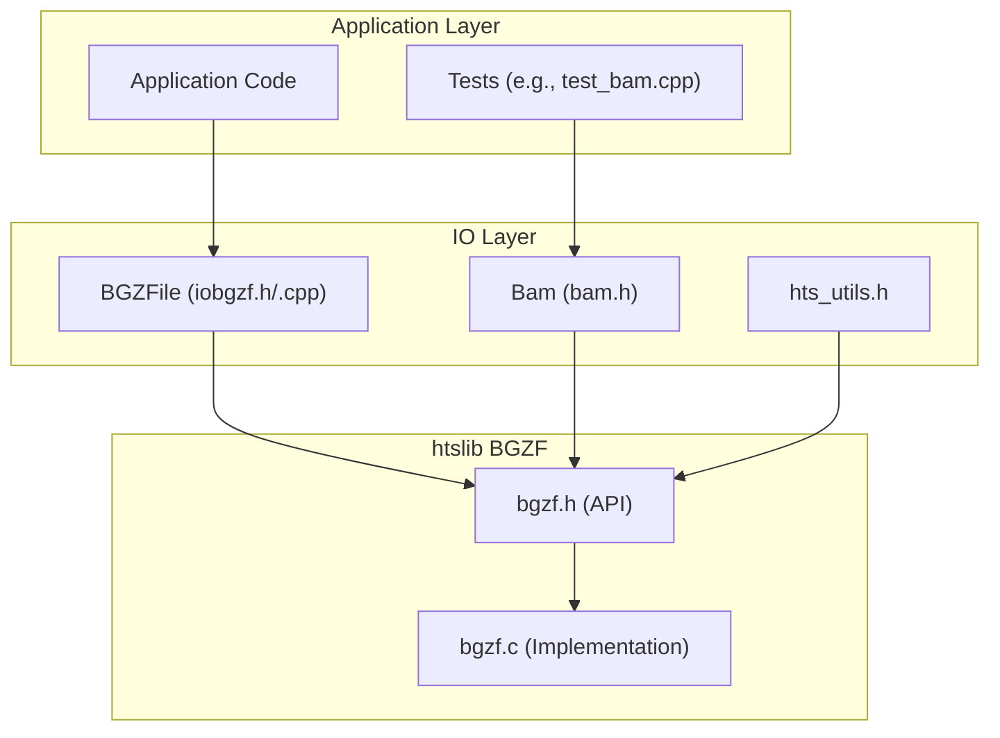
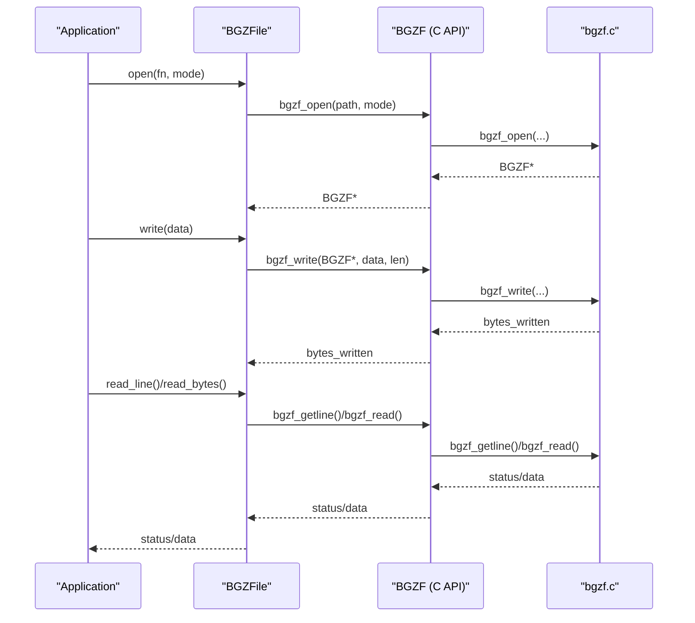
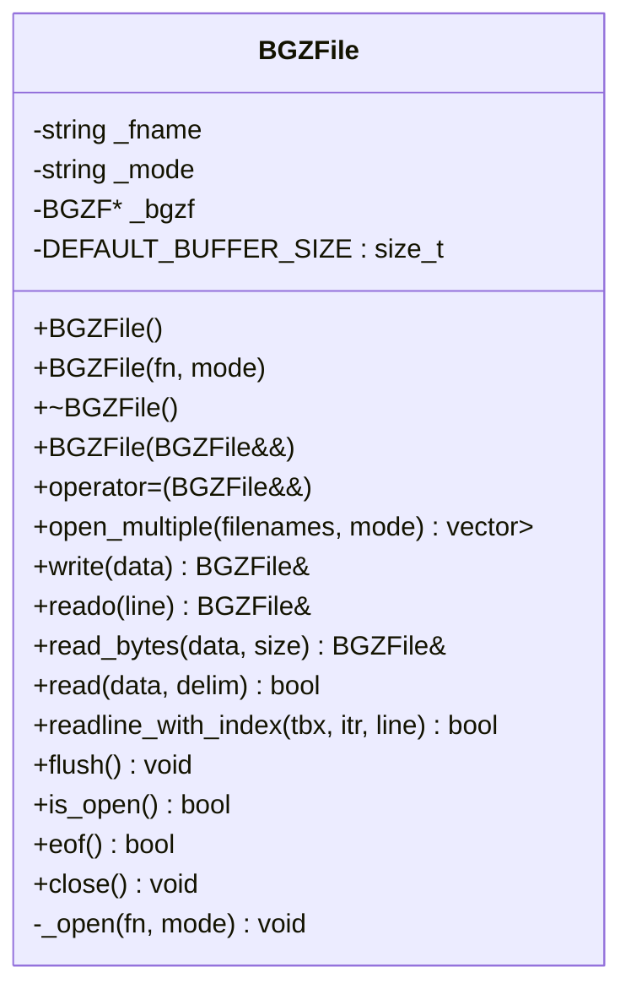
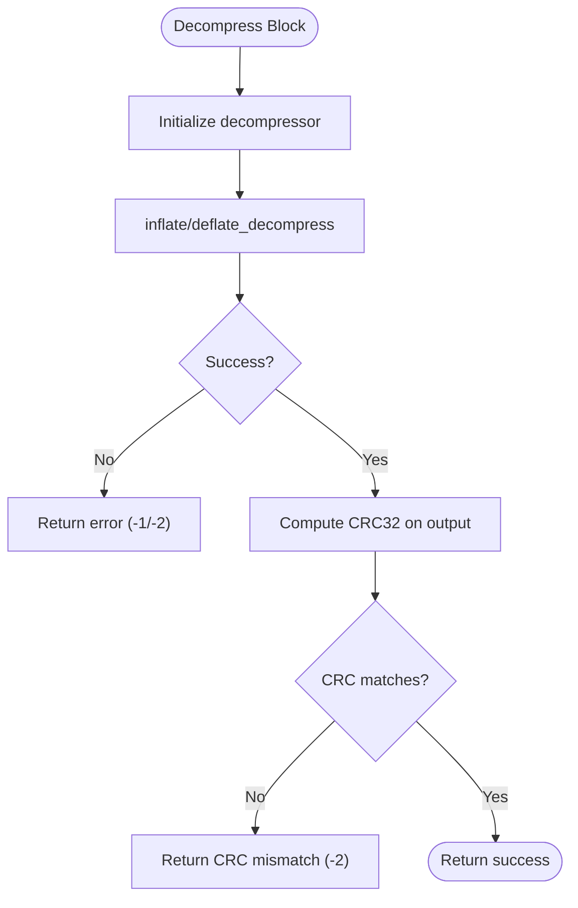
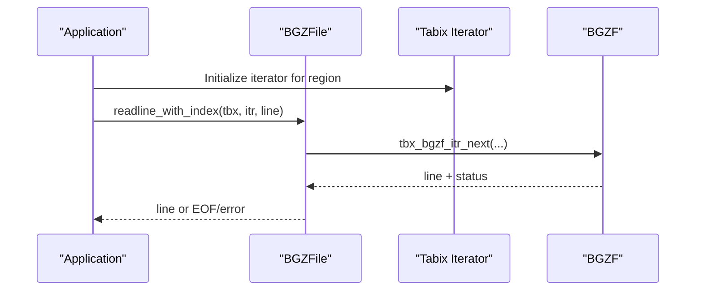
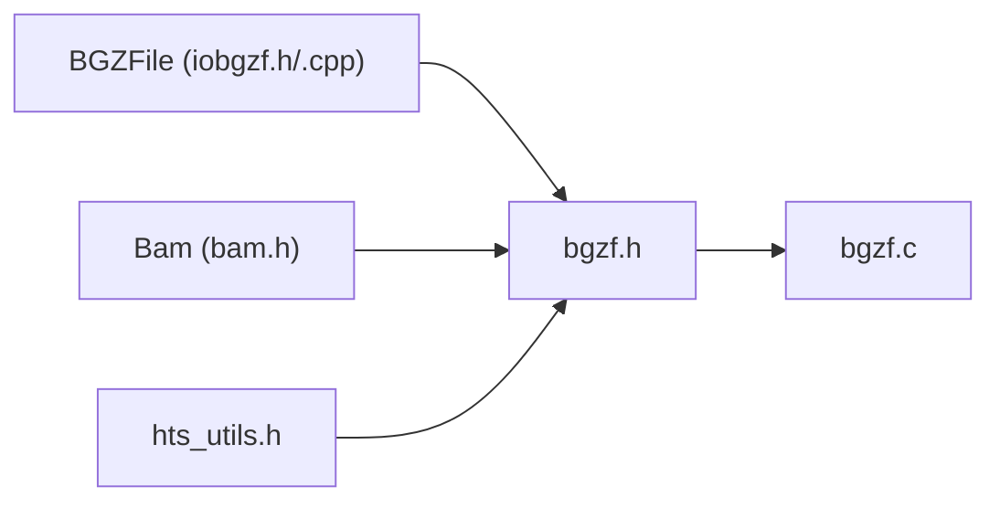

# BGZF Compression and Streaming

<cite>
**Referenced Files in This Document**
- [iobgzf.h](file://src/io/iobgzf.h)
- [iobgzf.cpp](file://src/io/iobgzf.cpp)
- [bgzf.h](file://htslib/htslib/bgzf.h)
- [bgzf.c](file://htslib/bgzf.c)
- [bam.h](file://src/io/bam.h)
- [hts_utils.h](file://src/io/hts_utils.h)
- [test_bam.cpp](file://tests/io/test_bam.cpp)
</cite>

## Table of Contents
1. [Introduction](#introduction)
2. [Project Structure](#project-structure)
3. [Core Components](#core-components)
4. [Architecture Overview](#architecture-overview)
5. [Detailed Component Analysis](#detailed-component-analysis)
6. [Dependency Analysis](#dependency-analysis)
7. [Performance Considerations](#performance-considerations)
8. [Troubleshooting Guide](#troubleshooting-guide)
9. [Conclusion](#conclusion)

## Introduction
This document explains BaseVar2’s BGZF (Blocked GNU Zip Format) compression and streaming system. It covers the C++ wrapper around htslib’s BGZF APIs, block-based compression and decompression, streaming capabilities, memory management, buffer handling, and performance optimizations. It also details error handling for corrupted or malformed compressed data, validation during decompression, and best practices for processing large compressed datasets efficiently.

## Project Structure
BaseVar2 integrates BGZF I/O through a thin C++ wrapper that delegates to htslib’s BGZF implementation. The wrapper exposes convenient C++ semantics for reading and writing BGZF-compressed files, while leveraging htslib’s optimized block-based compression, CRC validation, and optional multi-threading support.

**Diagram sources**
- [iobgzf.h:1-191](file://src/io/iobgzf.h#L1-L191)
- [iobgzf.cpp:1-114](file://src/io/iobgzf.cpp#L1-L114)
- [bgzf.h:1-507](file://htslib/htslib/bgzf.h#L1-L507)
- [bgzf.c:1-800](file://htslib/bgzf.c#L1-L800)
- [bam.h:1-149](file://src/io/bam.h#L1-L149)
- [hts_utils.h:1-61](file://src/io/hts_utils.h#L1-L61)
- [test_bam.cpp:1-112](file://tests/io/test_bam.cpp#L1-L112)

**Section sources**
- [iobgzf.h:1-191](file://src/io/iobgzf.h#L1-L191)
- [iobgzf.cpp:1-114](file://src/io/iobgzf.cpp#L1-L114)
- [bgzf.h:1-507](file://htslib/htslib/bgzf.h#L1-L507)
- [bgzf.c:1-800](file://htslib/bgzf.c#L1-L800)
- [bam.h:1-149](file://src/io/bam.h#L1-L149)
- [hts_utils.h:1-61](file://src/io/hts_utils.h#L1-L61)
- [test_bam.cpp:1-112](file://tests/io/test_bam.cpp#L1-L112)

## Core Components
- BGZFile: A C++ RAII wrapper around htslib’s BGZF file handle. It supports opening, reading, writing, flushing, and closing BGZF streams. It provides convenience methods for reading lines and blocks, and integrates with htslib’s tabix iterator for indexed streaming.
- htslib BGZF: The underlying implementation provides block-based compression/decompression, CRC validation, optional multi-threading, and index building/dumping for random access.
- Bam: A higher-level interface that uses htslib’s generic file opening and indexing mechanisms, including BGZF-aware detection and streaming.

Key responsibilities:
- BGZFile: Manage BGZF file lifecycle, expose C++ stream-like operations, and delegate to htslib BGZF functions.
- htslib BGZF: Provide low-level block management, compression, CRC checks, and optional threading.
- Bam: Coordinate file opening, indexing, and region-based streaming using BGZF-compatible formats.

**Section sources**
- [iobgzf.h:27-148](file://src/io/iobgzf.h#L27-L148)
- [iobgzf.cpp:4-114](file://src/io/iobgzf.cpp#L4-L114)
- [bgzf.h:68-88](file://htslib/htslib/bgzf.h#L68-L88)
- [bgzf.c:489-548](file://htslib/bgzf.c#L489-L548)
- [bam.h:23-145](file://src/io/bam.h#L23-L145)

## Architecture Overview
The BGZF subsystem is layered:
- Application code uses BGZFile for direct BGZF I/O or higher-level formats (e.g., BAM/VCF) via Bam.
- BGZFile wraps htslib BGZF handles and delegates to BGZF APIs for reading/writing, flushing, seeking, and EOF checking.
- htslib BGZF manages block boundaries, compression levels, CRC validation, and optional multi-threading.

**Diagram sources**
- [iobgzf.cpp:4-114](file://src/io/iobgzf.cpp#L4-L114)
- [bgzf.h:118-134](file://htslib/htslib/bgzf.h#L118-L134)
- [bgzf.c:489-548](file://htslib/bgzf.c#L489-L548)

## Detailed Component Analysis

### BGZFile: C++ Wrapper for BGZF
BGZFile encapsulates a BGZF handle and provides:
- Construction and RAII: Opens on construction, closes on destruction.
- Move semantics: Supports move constructor and move assignment for efficient resource transfer.
- I/O operations: write(), read_bytes(), read() with delimiter support, and readline().
- Stream operators: Overloaded insertion/extraction operators for convenient streaming.
- Index-aware reading: readline_with_index() integrates with tabix iterators for indexed streaming.
- Utility: flush(), eof(), is_open().

Memory and buffer handling:
- read_bytes() allocates a temporary buffer sized to requested bytes and transfers to a std::string.
- read() uses htslib’s kstring_t internally for dynamic buffering and frees memory after use.
- flush() ensures pending writes are committed.

Error handling:
- Throws std::runtime_error on open/write/read failures.
- Validates mode before read/write operations.
- Uses bgzf_check_EOF() to detect EOF markers.

Thread safety and multi-threading:
- BGZFile itself is not thread-safe; however, htslib BGZF supports multi-threading via thread pools. This is configured at the BGZF handle level and not exposed through BGZFile.

Integration with tabix:
- readline_with_index() uses tbx_bgzf_itr_next() to fetch lines according to a tabix iterator, enabling indexed streaming.

**Section sources**
- [iobgzf.h:27-148](file://src/io/iobgzf.h#L27-L148)
- [iobgzf.cpp:4-114](file://src/io/iobgzf.cpp#L4-L114)

#### BGZFile Class Diagram

**Diagram sources**
- [iobgzf.h:27-148](file://src/io/iobgzf.h#L27-L148)

### htslib BGZF: Block-Based Compression and Validation
Core responsibilities:
- Block management: Enforces BGZF block size limits and maintains uncompressed/compressed buffers.
- Compression: Supports zlib-compatible deflate and optional libdeflate acceleration.
- CRC validation: Computes and verifies CRC32 on uncompressed data to detect corruption.
- Seeking and indexing: Provides virtual offsets and index building/dumping for random access.
- Multi-threading: Optional thread pool integration for parallel compression/decompression.

Key constants and structures:
- BGZF_BLOCK_SIZE and BGZF_MAX_BLOCK_SIZE define block boundaries.
- BGZF struct holds state for current block, compression level, and optional index.

Error reporting:
- bgzf_zerr() maps zlib/libdeflate error codes to human-readable messages.
- bgzf_uncompress() returns -2 on CRC mismatch, enabling early failure detection.

Indexing and on-the-fly index building:
- bgzf_index_build_init() enables building an index during write.
- bgzf_idx_push() caches index entries for multi-block writes.
- bgzf_index_load()/dump() manage index persistence.

**Section sources**
- [bgzf.h:50-88](file://htslib/htslib/bgzf.h#L50-L88)
- [bgzf.c:550-610](file://htslib/bgzf.c#L550-L610)
- [bgzf.c:722-799](file://htslib/bgzf.c#L722-L799)
- [bgzf.c:194-295](file://htslib/bgzf.c#L194-L295)

#### BGZF Block Decompression Flow

**Diagram sources**
- [bgzf.c:722-799](file://htslib/bgzf.c#L722-L799)

### Indexed Streaming with Tabix
BGZFile’s readline_with_index() integrates with tabix iterators to stream only the requested genomic regions. This avoids loading entire files and leverages BGZF virtual offsets for fast seeking.

**Diagram sources**
- [iobgzf.cpp:96-113](file://src/io/iobgzf.cpp#L96-L113)
- [bgzf.h:348-350](file://htslib/htslib/bgzf.h#L348-L350)

### Higher-Level Integration: Bam
Bam uses htslib’s generic file opening and indexing. It supports BGZF-compressed SAM/BAM/CRAM and transparently detects formats. This allows seamless streaming over BGZF-compressed data.

Highlights:
- Mode parsing includes 'z' for BGZF and 'u' for uncompressed.
- Index building and loading enable region-based streaming.
- Header and record iteration integrate with BGZF-aware formats.

**Section sources**
- [bam.h:35-101](file://src/io/bam.h#L35-L101)
- [test_bam.cpp:26-112](file://tests/io/test_bam.cpp#L26-L112)

## Dependency Analysis
- BGZFile depends on htslib BGZF API for all I/O operations.
- htslib BGZF depends on zlib/libdeflate for compression and CRC computation.
- Bam depends on htslib’s generic file abstraction and BGZF-aware format detection.

**Diagram sources**
- [iobgzf.h:20-22](file://src/io/iobgzf.h#L20-L22)
- [bgzf.h:1-507](file://htslib/htslib/bgzf.h#L1-L507)
- [bgzf.c:1-800](file://htslib/bgzf.c#L1-L800)
- [bam.h:13-18](file://src/io/bam.h#L13-L18)
- [hts_utils.h:15-15](file://src/io/hts_utils.h#L15-L15)

**Section sources**
- [iobgzf.h:20-22](file://src/io/iobgzf.h#L20-L22)
- [bgzf.h:1-507](file://htslib/htslib/bgzf.h#L1-L507)
- [bgzf.c:1-800](file://htslib/bgzf.c#L1-L800)
- [bam.h:13-18](file://src/io/bam.h#L13-L18)
- [hts_utils.h:15-15](file://src/io/hts_utils.h#L15-L15)

## Performance Considerations
- Block size and buffering:
  - BGZF blocks are limited to BGZF_BLOCK_SIZE; BGZFile read_bytes() uses a buffer sized to the requested read length. For repeated small reads, prefer read_bytes() with a larger buffer to reduce syscall overhead.
- Compression level:
  - BGZF supports zlib compression levels. Higher levels increase CPU usage but may improve compression ratios. For streaming, moderate levels often balance throughput and compression effectively.
- CRC validation:
  - BGZF validates CRC on decompression. While this adds CPU cost, it prevents processing corrupted data and reduces downstream errors.
- Multi-threading:
  - htslib BGZF supports multi-threading via thread pools. Configure BGZF handles accordingly to leverage parallelism for large datasets.
- Indexing:
  - Building indices on the fly during write enables random access and indexed streaming. Use bgzf_index_build_init() and bgzf_idx_push() to maintain accurate indices.
- I/O patterns:
  - Prefer sequential access patterns and avoid frequent seeks for large files. For random access, pre-build indices to minimize seek penalties.

[No sources needed since this section provides general guidance]

## Troubleshooting Guide
Common issues and resolutions:
- Open failures:
  - BGZFile throws on bgzf_open() failure. Verify file paths and permissions.
- Write failures:
  - BGZFile throws when bgzf_write() returns fewer bytes than requested. Check disk space and file permissions.
- Read failures:
  - BGZFile throws on bgzf_read() < 0. Validate file integrity and ensure the file is BGZF-compressed.
- CRC mismatches:
  - bgzf_uncompress() returns -2 on CRC mismatch. Indicates corrupted or truncated data. Recompress or replace the file.
- EOF handling:
  - Use bgzf_check_EOF() to detect proper EOF markers. Unexpected EOF may indicate incomplete writes or truncation.
- Mode misuse:
  - BGZFile validates modes before read/write. Opening in read mode for writing or vice versa triggers exceptions.

Validation tips:
- Use bgzf_compression() to confirm BGZF format.
- For BAM/SAM, rely on htslib’s format detection and index presence for reliable streaming.

**Section sources**
- [iobgzf.cpp:4-114](file://src/io/iobgzf.cpp#L4-L114)
- [bgzf.c:351-386](file://htslib/bgzf.c#L351-L386)
- [bgzf.c:722-799](file://htslib/bgzf.c#L722-L799)
- [bgzf.h:286-300](file://htslib/htslib/bgzf.h#L286-L300)

## Conclusion
BaseVar2’s BGZF system combines a clean C++ wrapper with htslib’s robust BGZF implementation. It delivers efficient block-based compression, CRC validation, and streaming capabilities, including indexed access for large datasets. By leveraging BGZF’s virtual offsets and optional multi-threading, applications can achieve high throughput while maintaining strict integrity checks. For best results, use appropriate compression levels, build indices for random access, and validate data integrity early via CRC checks.