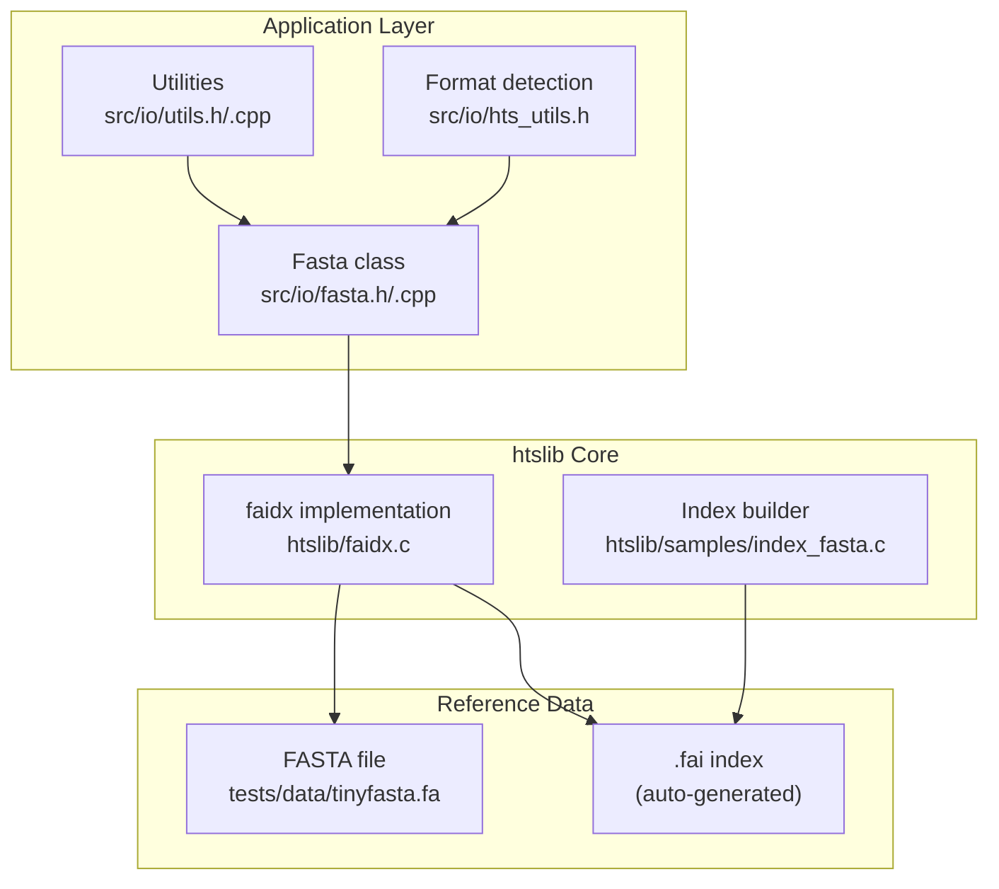
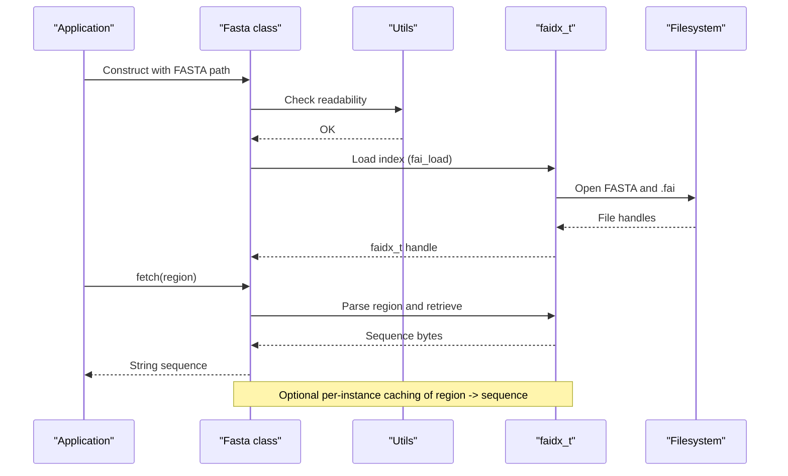
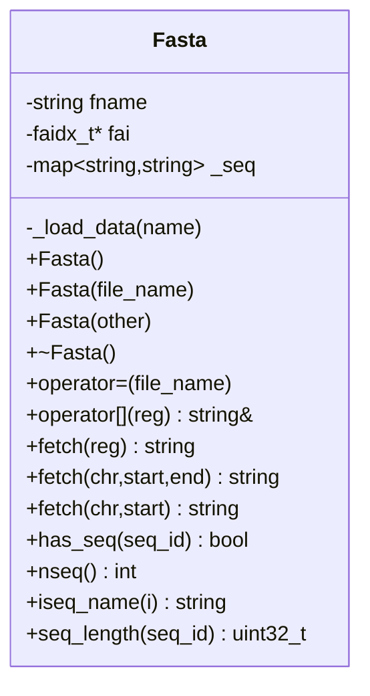
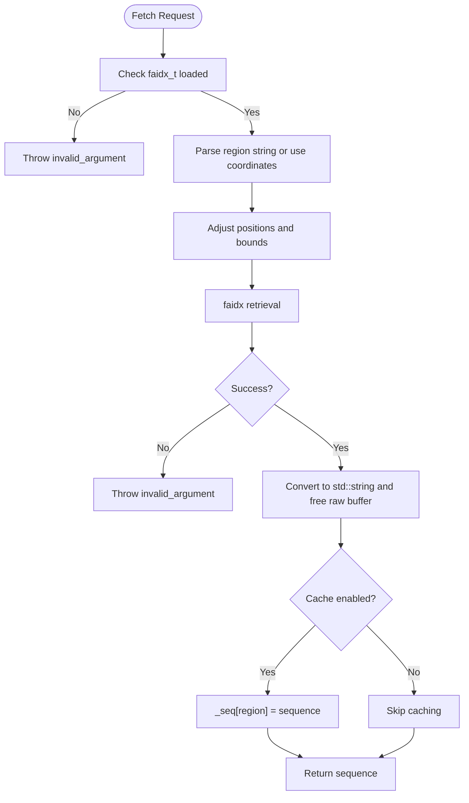
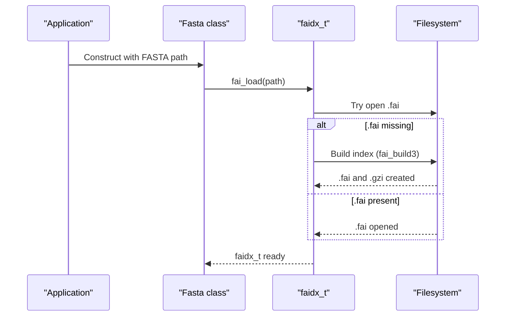
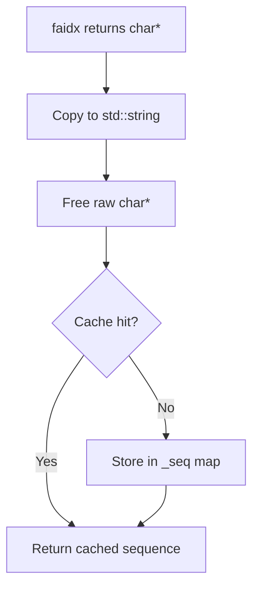
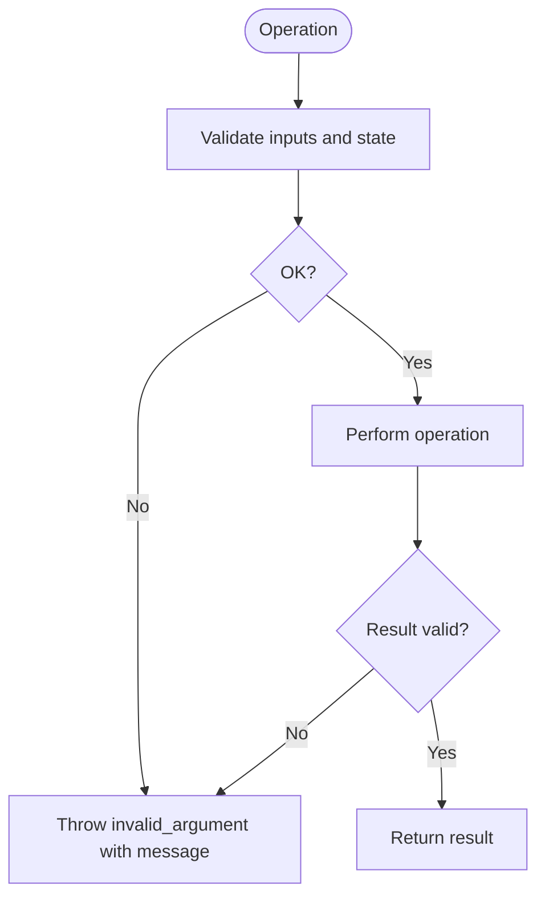
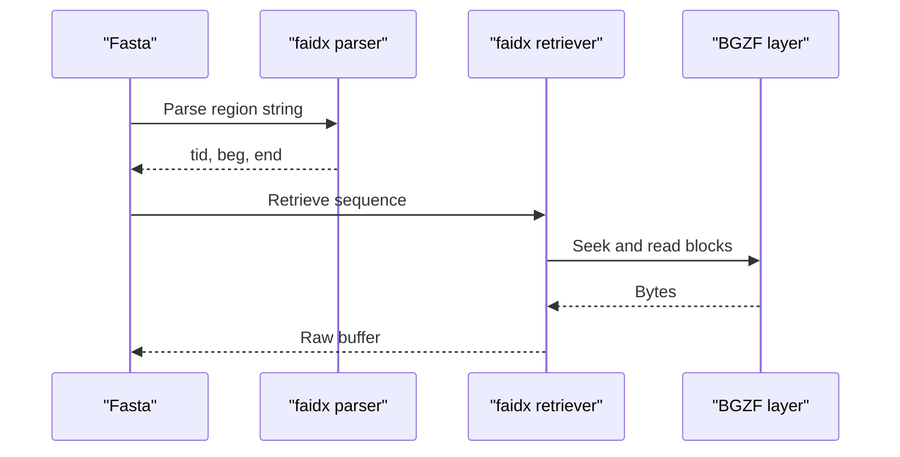
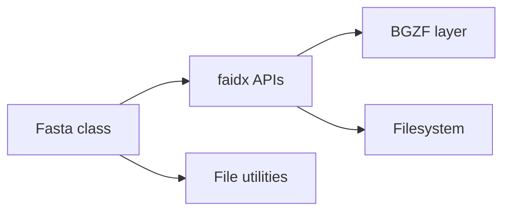

# FASTA Reference Genome Handling

<cite>
**Referenced Files in This Document**
- [src/io/fasta.h](file://src/io/fasta.h)
- [src/io/fasta.cpp](file://src/io/fasta.cpp)
- [src/io/utils.h](file://src/io/utils.h)
- [src/io/utils.cpp](file://src/io/utils.cpp)
- [src/io/hts_utils.h](file://src/io/hts_utils.h)
- [htslib/faidx.c](file://htslib/faidx.c)
- [htslib/samples/index_fasta.c](file://htslib/samples/index_fasta.c)
- [tests/io/test_fasta.cpp](file://tests/io/test_fasta.cpp)
- [tests/data/tinyfasta.fa](file://tests/data/tinyfasta.fa)
</cite>

## Table of Contents
1. [Introduction](#introduction)
2. [Project Structure](#project-structure)
3. [Core Components](#core-components)
4. [Architecture Overview](#architecture-overview)
5. [Detailed Component Analysis](#detailed-component-analysis)
6. [Dependency Analysis](#dependency-analysis)
7. [Performance Considerations](#performance-considerations)
8. [Troubleshooting Guide](#troubleshooting-guide)
9. [Conclusion](#conclusion)

## Introduction
This document describes BaseVar2’s FASTA reference genome file processing system. It explains how reference sequences are retrieved, indexed, and extracted using htslib’s faidx functionality for efficient random access. It also covers memory management strategies for large reference genomes, a simple sequence caching mechanism, validation procedures for reference files, error handling for missing sequences, and performance optimization techniques for repeated access patterns.

## Project Structure
BaseVar2 integrates a lightweight C++ wrapper around htslib’s faidx to support FASTA reference access. The key elements are:
- A C++ interface class that encapsulates faidx operations and adds convenience methods and basic caching.
- Utility helpers for file validation and path manipulation.
- Tests demonstrating usage and expected behavior.
- htslib’s faidx implementation providing the core indexing and retrieval logic.

**Diagram sources**
- [src/io/fasta.h:15-96](file://src/io/fasta.h#L15-L96)
- [src/io/fasta.cpp:9-122](file://src/io/fasta.cpp#L9-L122)
- [src/io/utils.h:68-76](file://src/io/utils.h#L68-L76)
- [src/io/hts_utils.h:35-51](file://src/io/hts_utils.h#L35-L51)
- [htslib/faidx.c:567-702](file://htslib/faidx.c#L567-L702)
- [htslib/samples/index_fasta.c:51-73](file://htslib/samples/index_fasta.c#L51-L73)
- [tests/data/tinyfasta.fa:1-10](file://tests/data/tinyfasta.fa#L1-L10)

**Section sources**
- [src/io/fasta.h:15-96](file://src/io/fasta.h#L15-L96)
- [src/io/fasta.cpp:9-122](file://src/io/fasta.cpp#L9-L122)
- [src/io/utils.h:68-76](file://src/io/utils.h#L68-L76)
- [src/io/hts_utils.h:35-51](file://src/io/hts_utils.h#L35-L51)
- [htslib/faidx.c:567-702](file://htslib/faidx.c#L567-L702)
- [htslib/samples/index_fasta.c:51-73](file://htslib/samples/index_fasta.c#L51-L73)
- [tests/data/tinyfasta.fa:1-10](file://tests/data/tinyfasta.fa#L1-L10)

## Core Components
- Fasta class: Encapsulates a faidx_t handle, exposes methods to fetch sequences by region or by chromosome/start/end coordinates, validates presence of sequences, and prints sequence lengths. It includes a simple per-instance cache keyed by region string.
- Utilities: Provide file readability checks, path normalization, and string helpers used by the FASTA wrapper.
- htslib faidx: Provides robust indexing, region parsing, and retrieval with BGZF-aware seeking and optional BGZF threading and caching.

Key responsibilities:
- Reference loading and indexing via faidx APIs.
- Random-access retrieval of subsequences with bounds checking.
- Basic caching to avoid repeated fetches for identical regions.
- Validation and error reporting for missing files and invalid regions.

**Section sources**
- [src/io/fasta.h:15-96](file://src/io/fasta.h#L15-L96)
- [src/io/fasta.cpp:9-122](file://src/io/fasta.cpp#L9-L122)
- [src/io/utils.h:68-76](file://src/io/utils.h#L68-L76)
- [htslib/faidx.c:846-1012](file://htslib/faidx.c#L846-L1012)

## Architecture Overview
The system builds on htslib’s faidx to enable efficient random access to reference sequences. The application-level Fasta class wraps faidx operations, adding convenience and a minimal cache. Indexing can be performed automatically when loading or explicitly via the provided sample program.

**Diagram sources**
- [src/io/fasta.cpp:9-22](file://src/io/fasta.cpp#L9-L22)
- [src/io/fasta.cpp:50-69](file://src/io/fasta.cpp#L50-L69)
- [src/io/utils.cpp:13-15](file://src/io/utils.cpp#L13-L15)
- [htslib/faidx.c:699-702](file://htslib/faidx.c#L699-L702)

## Detailed Component Analysis

### Fasta Class Design and Methods
The Fasta class encapsulates a faidx_t pointer and provides:
- Construction/loading with automatic index creation if needed.
- Region-based fetching (e.g., “contig:start-end”) and coordinate-based fetching (chromosome, zero-based start, zero-based end).
- Presence checks and sequence length queries.
- A simple map-based cache keyed by region string for repeated access.

**Diagram sources**
- [src/io/fasta.h:16-91](file://src/io/fasta.h#L16-L91)

Implementation highlights:
- Index loading and validation occur during construction and assignment.
- Region parsing delegates to faidx; coordinate-based fetch uses faidx_fetch_seq with zero-based coordinates.
- Memory management ensures the faidx_t handle is destroyed on teardown.
- A per-instance cache stores previously fetched sequences by region string.

**Section sources**
- [src/io/fasta.h:16-91](file://src/io/fasta.h#L16-L91)
- [src/io/fasta.cpp:9-22](file://src/io/fasta.cpp#L9-L22)
- [src/io/fasta.cpp:38-48](file://src/io/fasta.cpp#L38-L48)
- [src/io/fasta.cpp:50-95](file://src/io/fasta.cpp#L50-L95)

### Sequence Retrieval and Region Parsing
Two primary retrieval pathways are supported:
- Region string parsing: “contig:start-end” with 1-based coordinates in the string; internally converted to zero-based for faidx_fetch_seq.
- Coordinate-based fetching: zero-based start and end passed directly to faidx_fetch_seq.

**Diagram sources**
- [src/io/fasta.cpp:50-95](file://src/io/fasta.cpp#L50-L95)
- [htslib/faidx.c:846-884](file://htslib/faidx.c#L846-L884)
- [htslib/faidx.c:972-1012](file://htslib/faidx.c#L972-L1012)

**Section sources**
- [src/io/fasta.cpp:50-95](file://src/io/fasta.cpp#L50-L95)
- [htslib/faidx.c:846-1012](file://htslib/faidx.c#L846-L1012)

### Indexing and Automatic Index Creation
Indexing is handled transparently:
- On load, if an index file is missing, faidx attempts to build it automatically.
- For compressed FASTAs, a corresponding .gzi index may be required for random access; faidx handles creation and loading.
- A dedicated sample program demonstrates explicit indexing.

**Diagram sources**
- [src/io/fasta.cpp:16-22](file://src/io/fasta.cpp#L16-L22)
- [htslib/faidx.c:567-702](file://htslib/faidx.c#L567-L702)
- [htslib/samples/index_fasta.c:63-66](file://htslib/samples/index_fasta.c#L63-L66)

**Section sources**
- [src/io/fasta.cpp:16-22](file://src/io/fasta.cpp#L16-L22)
- [htslib/faidx.c:567-702](file://htslib/faidx.c#L567-L702)
- [htslib/samples/index_fasta.c:63-66](file://htslib/samples/index_fasta.c#L63-L66)

### Memory Management and Caching
- Raw buffers returned by faidx are allocated by the library and must be freed by the caller; the wrapper converts them to std::string and frees the raw buffer.
- Per-instance caching: A std::map caches region strings to fetched sequences to avoid repeated disk access for identical regions.
- Thread safety: The current implementation is not thread-safe; concurrent access should be externally synchronized.

**Diagram sources**
- [src/io/fasta.cpp:50-69](file://src/io/fasta.cpp#L50-L69)
- [src/io/fasta.cpp:38-48](file://src/io/fasta.cpp#L38-L48)

**Section sources**
- [src/io/fasta.cpp:50-69](file://src/io/fasta.cpp#L50-L69)
- [src/io/fasta.cpp:38-48](file://src/io/fasta.cpp#L38-L48)

### Validation and Error Handling
- File readability: The wrapper checks if the FASTA path is readable before attempting to load.
- Index loading: Failure to load or build the index triggers an exception.
- Retrieval errors: Invalid regions, missing sequences, or empty results raise exceptions with descriptive messages.
- Presence checks: has_seq allows callers to verify sequence existence without triggering exceptions.

**Diagram sources**
- [src/io/fasta.cpp:12-21](file://src/io/fasta.cpp#L12-L21)
- [src/io/fasta.cpp:52-68](file://src/io/fasta.cpp#L52-L68)
- [src/io/fasta.cpp:76-94](file://src/io/fasta.cpp#L76-L94)

**Section sources**
- [src/io/fasta.cpp:12-21](file://src/io/fasta.cpp#L12-L21)
- [src/io/fasta.cpp:52-68](file://src/io/fasta.cpp#L52-L68)
- [src/io/fasta.cpp:76-94](file://src/io/fasta.cpp#L76-L94)

### Integration with htslib’s faidx
- Region parsing: Uses hts_parse_region and faidx-specific helpers to interpret region strings and adjust boundaries.
- Retrieval: fai_fetch64/fai_fetch and faidx_fetch_seq64/faidx_fetch_seq perform the actual seek and read operations with BGZF awareness.
- Index metadata: Sequence names, lengths, offsets, and line lengths are stored in the faidx index for fast access.

**Diagram sources**
- [htslib/faidx.c:1021-1026](file://htslib/faidx.c#L1021-L1026)
- [htslib/faidx.c:846-884](file://htslib/faidx.c#L846-L884)
- [htslib/faidx.c:972-1012](file://htslib/faidx.c#L972-L1012)

**Section sources**
- [htslib/faidx.c:1021-1026](file://htslib/faidx.c#L1021-L1026)
- [htslib/faidx.c:846-1012](file://htslib/faidx.c#L846-L1012)

### Testing and Usage Examples
- Tests exercise construction, assignment, fetching by region and coordinates, caching behavior, and sequence metadata queries.
- The test data FASTA contains small reference sequences suitable for validation.

**Section sources**
- [tests/io/test_fasta.cpp:6-51](file://tests/io/test_fasta.cpp#L6-L51)
- [tests/data/tinyfasta.fa:1-10](file://tests/data/tinyfasta.fa#L1-L10)

## Dependency Analysis
The FASTA wrapper depends on:
- htslib faidx for indexing and retrieval.
- Standard filesystem utilities for file checks and path operations.
- Optional BGZF threading and caching can be configured via faidx APIs.

**Diagram sources**
- [src/io/fasta.h:11](file://src/io/fasta.h#L11)
- [src/io/fasta.cpp:16-22](file://src/io/fasta.cpp#L16-L22)
- [htslib/faidx.c:699-702](file://htslib/faidx.c#L699-L702)

**Section sources**
- [src/io/fasta.h:11](file://src/io/fasta.h#L11)
- [src/io/fasta.cpp:16-22](file://src/io/fasta.cpp#L16-L22)
- [htslib/faidx.c:699-702](file://htslib/faidx.c#L699-L702)

## Performance Considerations
- Prefer region-based fetching when repeatedly accessing the same regions to leverage the per-instance cache.
- For high-throughput scenarios, consider:
  - Enabling BGZF threading and cache sizing via faidx APIs to improve IO throughput.
  - Minimizing redundant region parsing by reusing region strings.
  - Using coordinate-based fetching for tight loops to avoid string parsing overhead.
- Large reference genomes benefit from BGZF indexing; ensure .gzi is present for compressed FASTAs to avoid streaming reads.

[No sources needed since this section provides general guidance]

## Troubleshooting Guide
Common issues and resolutions:
- Index not found or unreadable:
  - Ensure the FASTA path is readable and that an .fai index exists or can be built.
  - Verify the FASTA is bgzip-compressed with a matching .gzi index if random access is required.
- Empty or missing sequences:
  - Confirm the sequence name exists and coordinates are within bounds.
  - Use has_seq to check presence before fetching.
- Exceptions on fetch:
  - Catch invalid_argument exceptions and log the region or coordinates causing the issue.
- Threading and performance:
  - Configure BGZF threading and cache size to improve performance on multi-core systems.

**Section sources**
- [src/io/fasta.cpp:12-21](file://src/io/fasta.cpp#L12-L21)
- [src/io/fasta.cpp:52-68](file://src/io/fasta.cpp#L52-L68)
- [src/io/fasta.cpp:76-94](file://src/io/fasta.cpp#L76-L94)
- [htslib/faidx.c:1028-1035](file://htslib/faidx.c#L1028-L1035)

## Conclusion
BaseVar2’s FASTA handling leverages htslib’s faidx to deliver efficient, random-access retrieval of reference sequences. The Fasta wrapper adds convenience methods, basic caching, and validation, while delegating robust indexing and IO to htslib. By following the recommended practices—ensuring proper indexing, leveraging caching, and configuring BGZF threading—the system achieves reliable and performant access to large reference genomes.