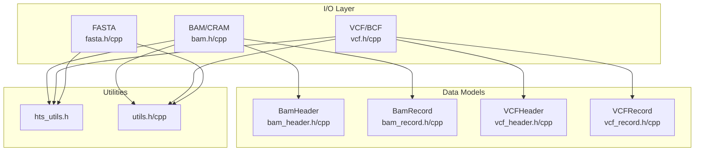
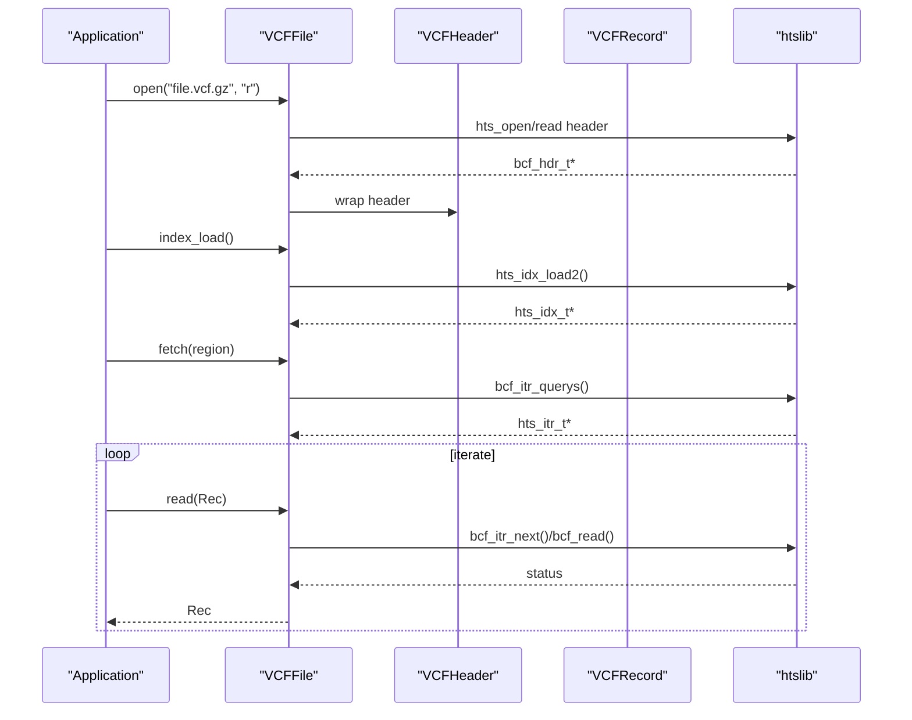
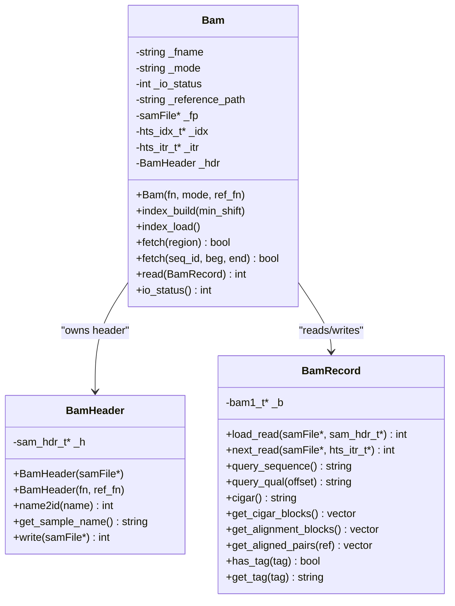
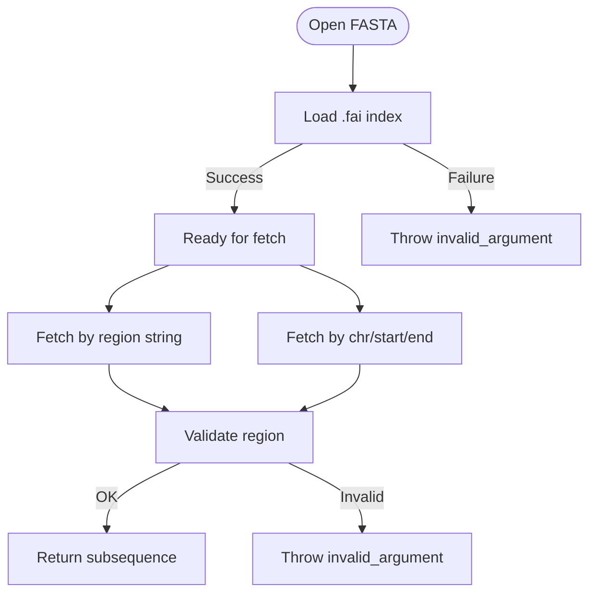
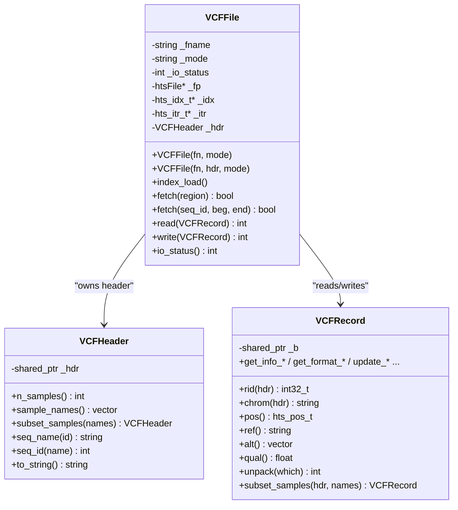
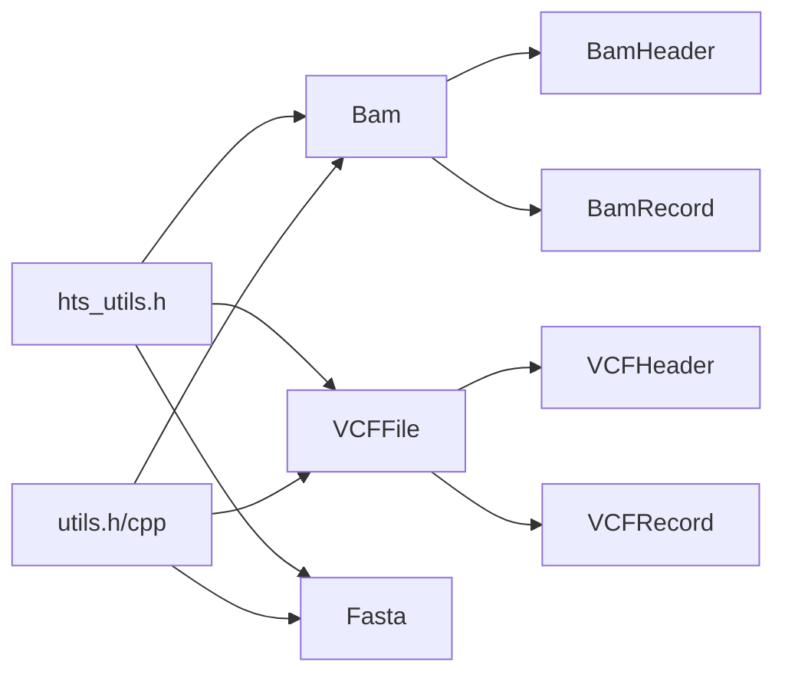

# File Format I/O System

<cite>
**Referenced Files in This Document**
- [bam.h](file://src/io/bam.h)
- [bam.cpp](file://src/io/bam.cpp)
- [bam_header.h](file://src/io/bam_header.h)
- [bam_header.cpp](file://src/io/bam_header.cpp)
- [bam_record.h](file://src/io/bam_record.h)
- [bam_record.cpp](file://src/io/bam_record.cpp)
- [fasta.h](file://src/io/fasta.h)
- [fasta.cpp](file://src/io/fasta.cpp)
- [vcf.h](file://src/io/vcf.h)
- [vcf.cpp](file://src/io/vcf.cpp)
- [vcf_header.h](file://src/io/vcf_header.h)
- [vcf_header.cpp](file://src/io/vcf_header.cpp)
- [vcf_record.h](file://src/io/vcf_record.h)
- [vcf_record.cpp](file://src/io/vcf_record.cpp)
- [hts_utils.h](file://src/io/hts_utils.h)
- [utils.h](file://src/io/utils.h)
- [utils.cpp](file://src/io/utils.cpp)
</cite>

## Table of Contents
1. [Introduction](#introduction)
2. [Project Structure](#project-structure)
3. [Core Components](#core-components)
4. [Architecture Overview](#architecture-overview)
5. [Detailed Component Analysis](#detailed-component-analysis)
6. [Dependency Analysis](#dependency-analysis)
7. [Performance Considerations](#performance-considerations)
8. [Troubleshooting Guide](#troubleshooting-guide)
9. [Conclusion](#conclusion)

## Introduction
This document describes BaseVar2’s file format I/O system with emphasis on:
- BAM/CRAM alignment file processing
- FASTA reference genome handling
- VCF output generation

It explains how the system integrates with htslib for maximum compatibility and performance, details stream processing and compression support, and documents the internal data structures used for file representation and conversion between formats. Error handling, validation procedures, and performance optimization techniques for large file processing are covered.

## Project Structure
The I/O system is organized into focused modules under src/io:
- BAM/CRAM: [bam.h](file://src/io/bam.h), [bam.cpp](file://src/io/bam.cpp), [bam_header.h](file://src/io/bam_header.h), [bam_header.cpp](file://src/io/bam_header.cpp), [bam_record.h](file://src/io/bam_record.h), [bam_record.cpp](file://src/io/bam_record.cpp)
- FASTA: [fasta.h](file://src/io/fasta.h), [fasta.cpp](file://src/io/fasta.cpp)
- VCF/BCF: [vcf.h](file://src/io/vcf.h), [vcf.cpp](file://src/io/vcf.cpp), [vcf_header.h](file://src/io/vcf_header.h), [vcf_header.cpp](file://src/io/vcf_header.cpp), [vcf_record.h](file://src/io/vcf_record.h), [vcf_record.cpp](file://src/io/vcf_record.cpp)
- Utilities: [hts_utils.h](file://src/io/hts_utils.h), [utils.h](file://src/io/utils.h), [utils.cpp](file://src/io/utils.cpp)

**Diagram sources**
- [bam.h:20-149](file://src/io/bam.h#L20-L149)
- [bam.cpp:1-167](file://src/io/bam.cpp#L1-L167)
- [bam_header.h:18-121](file://src/io/bam_header.h#L18-L121)
- [bam_header.cpp:1-102](file://src/io/bam_header.cpp#L1-L102)
- [bam_record.h:49-455](file://src/io/bam_record.h#L49-L455)
- [bam_record.cpp:1-551](file://src/io/bam_record.cpp#L1-L551)
- [fasta.h:14-96](file://src/io/fasta.h#L14-L96)
- [fasta.cpp:1-122](file://src/io/fasta.cpp#L1-L122)
- [vcf.h:29-184](file://src/io/vcf.h#L29-L184)
- [vcf.cpp:1-227](file://src/io/vcf.cpp#L1-L227)
- [vcf_header.h:31-242](file://src/io/vcf_header.h#L31-L242)
- [vcf_header.cpp:1-275](file://src/io/vcf_header.cpp#L1-L275)
- [vcf_record.h:31-525](file://src/io/vcf_record.h#L31-L525)
- [vcf_record.cpp:1-800](file://src/io/vcf_record.cpp#L1-L800)
- [hts_utils.h:17-61](file://src/io/hts_utils.h#L17-L61)
- [utils.h:19-205](file://src/io/utils.h#L19-L205)
- [utils.cpp:1-142](file://src/io/utils.cpp#L1-L142)

**Section sources**
- [bam.h:1-149](file://src/io/bam.h#L1-L149)
- [vcf.h:1-184](file://src/io/vcf.h#L1-L184)
- [fasta.h:1-96](file://src/io/fasta.h#L1-L96)

## Core Components
- BAM/CRAM reader/writer:
  - [Bam:23-145](file://src/io/bam.h#L23-L145): Opens, indexes, iterates, and streams SAM/BAM/CRAM records via htslib. Supports region queries and CRAM with reference.
  - [BamHeader:22-118](file://src/io/bam_header.h#L22-L118): Wraps sam_hdr_t, exposes contig names/lengths, sample name extraction.
  - [BamRecord:49-455](file://src/io/bam_record.h#L49-L455): Encapsulates bam1_t, provides flags, mapping info, CIGAR parsing, aligned pairs, tags, and utilities.

- FASTA reader:
  - [Fasta:16-91](file://src/io/fasta.h#L16-L91): Indexes FASTA via faidx, supports region fetch and basic metadata.

- VCF/BCF reader/writer:
  - [VCFFile:29-179](file://src/io/vcf.h#L29-L179): Opens, reads/writes VCF/BCF, manages header and iterators, supports region queries.
  - [VCFHeader:31-242](file://src/io/vcf_header.h#L31-L242): Manages bcf_hdr_t with shared ownership, sample/contig access, header manipulation.
  - [VCFRecord:31-525](file://src/io/vcf_record.h#L31-L525): Manages bcf1_t with shared ownership, accessors/mutators for core fields, INFO/FILTER/FORMAT.

- Utilities:
  - [hts_utils.h:17-61](file://src/io/hts_utils.h#L17-L61): Format detection helpers and CRAM detection.
  - [utils.h:21-205](file://src/io/utils.h#L21-L205), [utils.cpp:1-142](file://src/io/utils.cpp#L1-L142): File/path helpers, string conversions, splitting, and I/O utilities.

**Section sources**
- [bam.h:20-149](file://src/io/bam.h#L20-L149)
- [bam_header.h:18-121](file://src/io/bam_header.h#L18-L121)
- [bam_record.h:49-455](file://src/io/bam_record.h#L49-L455)
- [fasta.h:14-96](file://src/io/fasta.h#L14-L96)
- [vcf.h:29-184](file://src/io/vcf.h#L29-L184)
- [vcf_header.h:31-242](file://src/io/vcf_header.h#L31-L242)
- [vcf_record.h:31-525](file://src/io/vcf_record.h#L31-L525)
- [hts_utils.h:17-61](file://src/io/hts_utils.h#L17-L61)
- [utils.h:19-205](file://src/io/utils.h#L19-L205)
- [utils.cpp:1-142](file://src/io/utils.cpp#L1-L142)

## Architecture Overview
The system builds on htslib for native support of SAM/BAM/CRAM and VCF/BCF, with thin C++ wrappers that:
- Manage resource lifecycles (RAII) using smart pointers for header/record objects
- Provide region-based streaming via htslib iterators
- Support transparent compression (BGZF/GZIP) and indexing (.bai/.csi/.crai/.tbi)
- Offer convenience APIs for common operations (e.g., fetching FASTA sequences by region)

**Diagram sources**
- [vcf.cpp:8-57](file://src/io/vcf.cpp#L8-L57)
- [vcf.cpp:87-107](file://src/io/vcf.cpp#L87-L107)
- [vcf.cpp:109-161](file://src/io/vcf.cpp#L109-L161)
- [vcf.cpp:164-198](file://src/io/vcf.cpp#L164-L198)

**Section sources**
- [vcf.h:29-179](file://src/io/vcf.h#L29-L179)
- [vcf.cpp:1-227](file://src/io/vcf.cpp#L1-L227)

## Detailed Component Analysis

### BAM/CRAM Processing
- File opening and mode handling:
  - Supports reading/writing modes compatible with htslib, including binary/text, compression, and CRAM with reference.
  - CRAM requires a reference path; the wrapper sets the FAI filename via htslib.
- Indexing and iteration:
  - Loads .bai/.csi as needed; creates iterators for region queries.
  - Iterators support string regions and coordinate-based queries.
- Streaming and record access:
  - Sequential or iterator-based reading via sam_read1/sam_itr_next.
  - Records expose flags, mapping info, CIGAR, query sequences/qualities, and tags.

**Diagram sources**
- [bam.h:23-145](file://src/io/bam.h#L23-L145)
- [bam_header.h:22-118](file://src/io/bam_header.h#L22-L118)
- [bam_record.h:49-455](file://src/io/bam_record.h#L49-L455)

**Section sources**
- [bam.h:20-149](file://src/io/bam.h#L20-L149)
- [bam.cpp:6-46](file://src/io/bam.cpp#L6-L46)
- [bam_header.h:18-118](file://src/io/bam_header.h#L18-L118)
- [bam_header.cpp:5-39](file://src/io/bam_header.cpp#L5-L39)
- [bam_record.h:49-455](file://src/io/bam_record.h#L49-L455)
- [bam_record.cpp:90-120](file://src/io/bam_record.cpp#L90-L120)

### FASTA Reference Handling
- Index-based access:
  - Uses faidx to load .fai indices; supports bgzip-compressed FASTA.
  - Provides region fetch by string ("chr:start-end") or by coordinates.
- Thread safety:
  - The implementation notes that direct fetch is not thread-safe; use per-thread instances or guard access.

**Diagram sources**
- [fasta.cpp:9-22](file://src/io/fasta.cpp#L9-L22)
- [fasta.cpp:50-95](file://src/io/fasta.cpp#L50-L95)

**Section sources**
- [fasta.h:14-96](file://src/io/fasta.h#L14-L96)
- [fasta.cpp:9-122](file://src/io/fasta.cpp#L9-L122)

### VCF/BCF Output Generation
- Reader/writer lifecycle:
  - Opening in read mode reads the header; in write mode writes the header immediately.
  - Index loading supports .tbi/.csi; region queries supported via iterators.
- Record model:
  - VCFRecord wraps bcf1_t with shared ownership; provides accessors for CHROM/POS/ID/REF/ALT/QUAL/FILTER/INFO/FORMAT.
  - Supports unpacking for efficient field access and mutation APIs for INFO/FORMAT updates.
- Header model:
  - VCFHeader wraps bcf_hdr_t with shared ownership; supports sample/contig access, subset operations, and header line manipulation.

**Diagram sources**
- [vcf.h:29-179](file://src/io/vcf.h#L29-L179)
- [vcf.cpp:8-57](file://src/io/vcf.cpp#L8-L57)
- [vcf_header.h:31-242](file://src/io/vcf_header.h#L31-L242)
- [vcf_record.h:31-525](file://src/io/vcf_record.h#L31-L525)

**Section sources**
- [vcf.h:29-184](file://src/io/vcf.h#L29-L184)
- [vcf.cpp:1-227](file://src/io/vcf.cpp#L1-L227)
- [vcf_header.h:31-242](file://src/io/vcf_header.h#L31-L242)
- [vcf_header.cpp:1-275](file://src/io/vcf_header.cpp#L1-L275)
- [vcf_record.h:31-525](file://src/io/vcf_record.h#L31-L525)
- [vcf_record.cpp:1-800](file://src/io/vcf_record.cpp#L1-L800)

## Dependency Analysis
- Internal dependencies:
  - BAM depends on BamHeader and BamRecord; both rely on htslib structs.
  - VCFFile depends on VCFHeader and VCFRecord; both rely on htslib structs.
  - FASTA depends on faidx from htslib.
- External dependencies:
  - htslib for SAM/BAM/CRAM, VCF/BCF, FAI indexing, and compression.
  - Standard C++ filesystem and iostream facilities for path and I/O utilities.

**Diagram sources**
- [hts_utils.h:17-61](file://src/io/hts_utils.h#L17-L61)
- [utils.h:19-205](file://src/io/utils.h#L19-L205)
- [utils.cpp:1-142](file://src/io/utils.cpp#L1-L142)
- [bam.h:13-18](file://src/io/bam.h#L13-L18)
- [vcf.h:13-19](file://src/io/vcf.h#L13-L19)
- [fasta.h:11-11](file://src/io/fasta.h#L11-L11)

**Section sources**
- [hts_utils.h:17-61](file://src/io/hts_utils.h#L17-L61)
- [utils.h:19-205](file://src/io/utils.h#L19-L205)
- [utils.cpp:1-142](file://src/io/utils.cpp#L1-L142)
- [bam.h:13-18](file://src/io/bam.h#L13-L18)
- [vcf.h:13-19](file://src/io/vcf.h#L13-L19)
- [fasta.h:11-11](file://src/io/fasta.h#L11-L11)

## Performance Considerations
- Streaming and indexing:
  - Use region-based queries with pre-built indices (.bai/.csi/.crai/.tbi) to avoid full-file scans.
  - Prefer BGZF-compressed inputs for SAM/BAM/VCF/BCF to enable random access via indices.
- Memory efficiency:
  - Header and record objects use shared ownership to minimize duplication and simplify cleanup.
  - Iterator-based reading avoids loading entire files into memory.
- Compression:
  - Transparent BGZF/GZIP support via htslib; choose appropriate compression levels for output writers.
- Parallelization:
  - The BAM module comments indicate care for thread-safety with iterators; avoid sharing a single file’s iterator across threads. Instead, process separate files concurrently.

[No sources needed since this section provides general guidance]

## Troubleshooting Guide
- File opening failures:
  - Verify readability and existence of input files; exceptions are thrown for missing files or open failures.
  - For CRAM, ensure the reference FASTA path is provided and readable.
- Index-related errors:
  - Ensure index files (.bai/.csi/.crai/.tbi/.tbi) exist and match the input file; the reader throws if index loading fails.
- Region queries:
  - Confirm region strings are valid and contig names exist in the header; invalid regions cause query failures.
- FASTA fetch:
  - Ensure the FASTA file is indexed; fetching by region throws on invalid inputs or empty results.
- Header validation:
  - For VCF writers, ensure the header is valid before opening; invalid headers lead to write failures.

**Section sources**
- [bam.cpp:6-46](file://src/io/bam.cpp#L6-L46)
- [bam.cpp:86-97](file://src/io/bam.cpp#L86-L97)
- [bam.cpp:103-135](file://src/io/bam.cpp#L103-L135)
- [fasta.cpp:9-22](file://src/io/fasta.cpp#L9-L22)
- [fasta.cpp:50-95](file://src/io/fasta.cpp#L50-L95)
- [vcf.cpp:8-57](file://src/io/vcf.cpp#L8-L57)
- [vcf.cpp:87-107](file://src/io/vcf.cpp#L87-L107)
- [vcf.cpp:109-161](file://src/io/vcf.cpp#L109-L161)

## Conclusion
BaseVar2’s I/O system leverages htslib to deliver robust, high-performance processing of alignment and variant data. The modular design with RAII-managed header and record objects, region-based streaming, and transparent compression support enables scalable workflows for large-scale genomics data. The FASTA interface simplifies reference access, while the VCF/BCF stack provides flexible reading and writing with strong validation and error reporting.