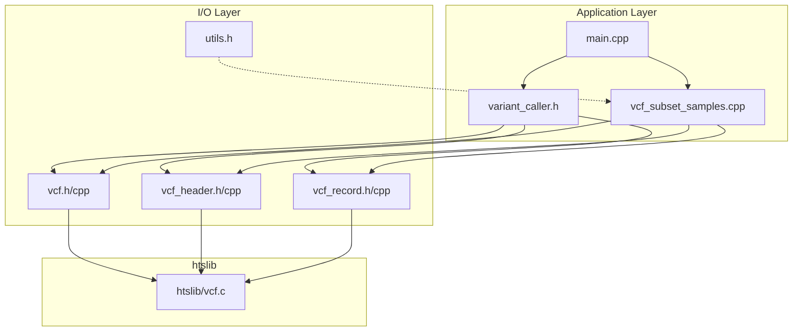
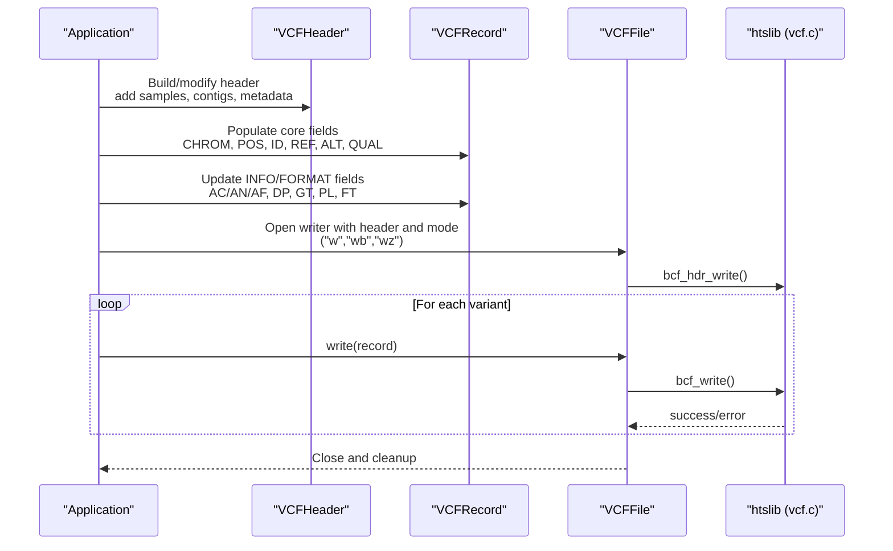
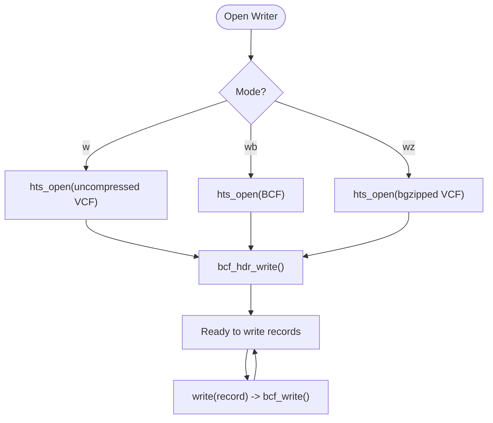
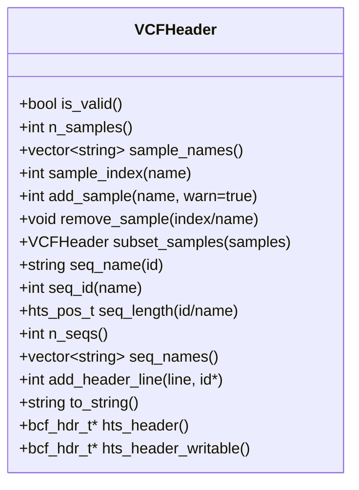
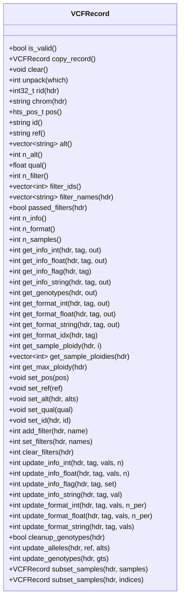
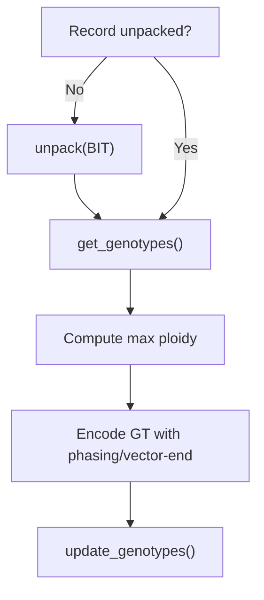
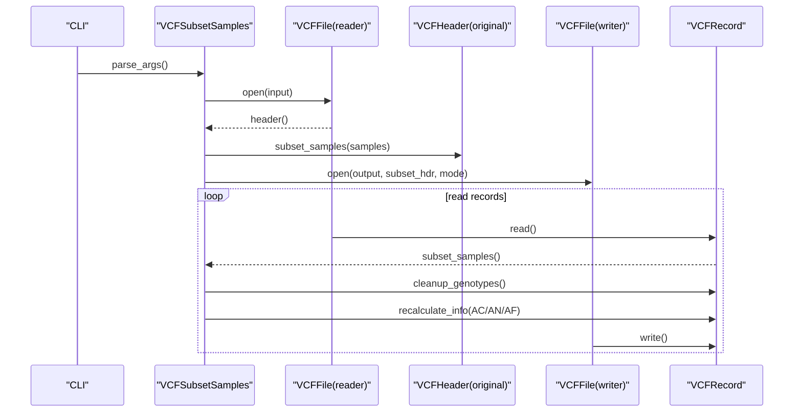
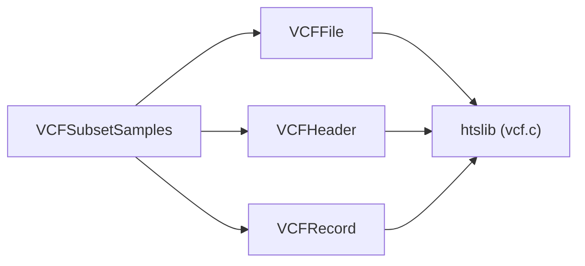

# VCF Output Generation

<cite>
**Referenced Files in This Document**
- [vcf.h](file://src/io/vcf.h)
- [vcf.cpp](file://src/io/vcf.cpp)
- [vcf_header.h](file://src/io/vcf_header.h)
- [vcf_header.cpp](file://src/io/vcf_header.cpp)
- [vcf_record.h](file://src/io/vcf_record.h)
- [vcf_record.cpp](file://src/io/vcf_record.cpp)
- [vcf_subset_samples.h](file://src/vcf_subset_samples.h)
- [vcf_subset_samples.cpp](file://src/vcf_subset_samples.cpp)
- [main.cpp](file://src/main.cpp)
- [variant_caller.h](file://src/variant_caller.h)
- [caller_utils.h](file://src/caller_utils.h)
- [utils.h](file://src/io/utils.h)
- [vcf.c](file://htslib/vcf.c)
</cite>

## Table of Contents
1. [Introduction](#introduction)
2. [Project Structure](#project-structure)
3. [Core Components](#core-components)
4. [Architecture Overview](#architecture-overview)
5. [Detailed Component Analysis](#detailed-component-analysis)
6. [Dependency Analysis](#dependency-analysis)
7. [Performance Considerations](#performance-considerations)
8. [Troubleshooting Guide](#troubleshooting-guide)
9. [Conclusion](#conclusion)

## Introduction
This document describes BaseVar2’s VCF output generation system. It focuses on the VCF writer implementation, header construction, record formatting, and data type handling. It explains the integration with htslib for standardized VCF/BCF output and compression support, and documents the VCFHeader and VCFRecord classes for managing metadata and variant information. It covers INFO, FORMAT, and genotype field handling, quality score formatting, and variant filtering output. Finally, it outlines error handling, validation procedures, and performance optimization strategies for large-scale variant output processing.

## Project Structure
BaseVar2 organizes VCF I/O under src/io with thin C++ wrappers around htslib. The VCF writer is implemented via a VCFFile class that encapsulates htslib’s file and record APIs. VCFHeader and VCFRecord provide safe, RAII-managed access to headers and records. A dedicated subsample tool demonstrates header subsetting, INFO recalculation, and record subsetting.

**Diagram sources**
- [main.cpp:43-92](file://src/main.cpp#L43-L92)
- [variant_caller.h:160-173](file://src/variant_caller.h#L160-L173)
- [vcf.h:29-179](file://src/io/vcf.h#L29-L179)
- [vcf.cpp:8-227](file://src/io/vcf.cpp#L8-L227)
- [vcf_header.h:31-239](file://src/io/vcf_header.h#L31-L239)
- [vcf_header.cpp:8-275](file://src/io/vcf_header.cpp#L8-L275)
- [vcf_record.h:31-521](file://src/io/vcf_record.h#L31-L521)
- [vcf_record.cpp:16-1042](file://src/io/vcf_record.cpp#L16-L1042)
- [vcf_subset_samples.cpp:224-316](file://src/vcf_subset_samples.cpp#L224-L316)
- [utils.h:19-205](file://src/io/utils.h#L19-L205)
- [vcf.c:4221-4260](file://htslib/vcf.c#L4221-L4260)

**Section sources**
- [main.cpp:43-92](file://src/main.cpp#L43-L92)
- [variant_caller.h:160-173](file://src/variant_caller.h#L160-L173)
- [vcf.h:29-179](file://src/io/vcf.h#L29-L179)
- [vcf.cpp:8-227](file://src/io/vcf.cpp#L8-L227)
- [vcf_header.h:31-239](file://src/io/vcf_header.h#L31-L239)
- [vcf_header.cpp:8-275](file://src/io/vcf_header.cpp#L8-L275)
- [vcf_record.h:31-521](file://src/io/vcf_record.h#L31-L521)
- [vcf_record.cpp:16-1042](file://src/io/vcf_record.cpp#L16-L1042)
- [vcf_subset_samples.cpp:224-316](file://src/vcf_subset_samples.cpp#L224-L316)
- [utils.h:19-205](file://src/io/utils.h#L19-L205)
- [vcf.c:4221-4260](file://htslib/vcf.c#L4221-L4260)

## Core Components
- VCFFile: Encapsulates htsFile, header, and iterator lifecycle; supports reading/writing VCF/BCF with automatic index loading and region queries; delegates record I/O to htslib.
- VCFHeader: Safe wrapper for bcf_hdr_t with shared ownership; provides sample/contig accessors, header copying, and metadata line management; formats header to string.
- VCFRecord: Safe wrapper for bcf1_t with shared ownership; provides accessors/mutators for core fields, INFO, FORMAT, and genotypes; supports unpacking and subsetting.

Key responsibilities:
- Header construction: Build/modify header metadata, sample lists, contig definitions, and add structured lines.
- Record formatting: Access and update CHROM, POS, ID, REF, ALT, QUAL, FILTER, INFO, and FORMAT fields.
- Data type handling: Integer, float, string, and flag types for INFO and FORMAT; special missing/vector-end markers; genotypes with phasing.
- Compression: Output modes “w”, “wb”, “wz” map to uncompressed VCF, BCF, and bgzipped VCF respectively via htslib.

**Section sources**
- [vcf.h:29-179](file://src/io/vcf.h#L29-L179)
- [vcf.cpp:8-227](file://src/io/vcf.cpp#L8-L227)
- [vcf_header.h:31-239](file://src/io/vcf_header.h#L31-L239)
- [vcf_header.cpp:8-275](file://src/io/vcf_header.cpp#L8-L275)
- [vcf_record.h:31-521](file://src/io/vcf_record.h#L31-L521)
- [vcf_record.cpp:16-1042](file://src/io/vcf_record.cpp#L16-L1042)

## Architecture Overview
The VCF writer pipeline integrates BaseVar2’s variant calling workflow with htslib’s VCF/BCF output routines. The application constructs a VCFHeader, builds VCFRecord objects from computed variant data, and writes them to disk using VCFFile. Subsetting and INFO recalculation are demonstrated by the subsample tool.

**Diagram sources**
- [vcf.h:72-81](file://src/io/vcf.h#L72-L81)
- [vcf.cpp:39-50](file://src/io/vcf.cpp#L39-L50)
- [vcf.cpp:200-217](file://src/io/vcf.cpp#L200-L217)
- [vcf.c:4232-4260](file://htslib/vcf.c#L4232-L4260)

**Section sources**
- [vcf.h:72-81](file://src/io/vcf.h#L72-L81)
- [vcf.cpp:39-50](file://src/io/vcf.cpp#L39-L50)
- [vcf.cpp:200-217](file://src/io/vcf.cpp#L200-L217)
- [vcf.c:4232-4260](file://htslib/vcf.c#L4232-L4260)

## Detailed Component Analysis

### VCFFile Writer Lifecycle
- Construction for writing: Validates VCFHeader, opens htsFile with mode “w”, “wb”, or “wz”, and writes the header immediately.
- Writing records: Ensures record validity and calls bcf_write with the associated header.
- Indexing and iteration: Supports index loading and region queries for reading; writing does not require indexing.

**Diagram sources**
- [vcf.h:72-81](file://src/io/vcf.h#L72-L81)
- [vcf.cpp:39-50](file://src/io/vcf.cpp#L39-L50)
- [vcf.cpp:200-217](file://src/io/vcf.cpp#L200-L217)
- [vcf.c:4232-4260](file://htslib/vcf.c#L4232-L4260)

**Section sources**
- [vcf.h:72-81](file://src/io/vcf.h#L72-L81)
- [vcf.cpp:39-50](file://src/io/vcf.cpp#L39-L50)
- [vcf.cpp:200-217](file://src/io/vcf.cpp#L200-L217)
- [vcf.c:4232-4260](file://htslib/vcf.c#L4232-L4260)

### VCFHeader: Metadata and Samples
- Shared ownership: Uses shared_ptr with bcf_hdr_destroy for safe lifetime management.
- Sample management: Add/remove/subset samples; sync header after modifications.
- Contig access: Map contig IDs/names and lengths.
- Metadata lines: Append and sync header to update IDs.
- Formatting: Export header to string for output.

**Diagram sources**
- [vcf_header.h:31-239](file://src/io/vcf_header.h#L31-L239)
- [vcf_header.cpp:8-275](file://src/io/vcf_header.cpp#L8-L275)

**Section sources**
- [vcf_header.h:31-239](file://src/io/vcf_header.h#L31-L239)
- [vcf_header.cpp:8-275](file://src/io/vcf_header.cpp#L8-L275)

### VCFRecord: Fields, Types, and Genotypes
- Core fields: rid, chrom, pos, id, ref, alt, n_alt, qual, n_filter, filter_ids, filter_names, passed_filters.
- INFO accessors: get_info_int/float/flag/string; update_info_* for mutation.
- FORMAT accessors: get_format_int/float/string, get_genotypes, get_format_idx, ploidy helpers.
- Modifiers: set_pos, set_ref/set_alt, set_qual, set_id, add_filter/set_filters/clear_filters, update_* for INFO/FORMAT.
- Subsetting: subset_samples by name or index; cleanup_genotypes removes unused ALTs and updates GT accordingly.
- Missing/vector-end constants: INT_MISSING, INT_VECTOR_END, FLOAT_MISSING/FLOAT_VECTOR_END, STRING_MISSING.

**Diagram sources**
- [vcf_record.h:31-521](file://src/io/vcf_record.h#L31-L521)
- [vcf_record.cpp:16-1042](file://src/io/vcf_record.cpp#L16-L1042)

**Section sources**
- [vcf_record.h:31-521](file://src/io/vcf_record.h#L31-L521)
- [vcf_record.cpp:16-1042](file://src/io/vcf_record.cpp#L16-L1042)

### INFO, FORMAT, and Genotype Handling
- INFO fields: Access/update integer, float, flag, and string tags; missing values and vector-end semantics are handled via htslib constants.
- FORMAT fields: Access/update per-sample integer, float, and string fields; GT is a special case with phasing and vector-end semantics.
- Genotypes: get_genotypes returns per-sample alleles and ploidy; update_genotypes encodes alleles with phasing; cleanup_genotypes prunes unused ALTs and renumbers alleles.

**Diagram sources**
- [vcf_record.cpp:299-345](file://src/io/vcf_record.cpp#L299-L345)
- [vcf_record.cpp:957-1023](file://src/io/vcf_record.cpp#L957-L1023)

**Section sources**
- [vcf_record.cpp:299-345](file://src/io/vcf_record.cpp#L299-L345)
- [vcf_record.cpp:957-1023](file://src/io/vcf_record.cpp#L957-L1023)

### Quality Score Formatting
- QUAL is stored as float; missing is represented by FLOAT_MISSING; formatting ensures “.” for missing values when writing.

**Section sources**
- [vcf_record.h:41-48](file://src/io/vcf_record.h#L41-L48)
- [vcf_record.cpp:128-131](file://src/io/vcf_record.cpp#L128-L131)

### Variant Filtering Output
- Filters are accessed via filter_ids and filter_names; PASS is recognized when no filters or only PASS is present; add_filter/set_filters/clear_filters manage FILTER fields.

**Section sources**
- [vcf_record.h:190-212](file://src/io/vcf_record.h#L190-L212)
- [vcf_record.cpp:133-171](file://src/io/vcf_record.cpp#L133-L171)

### Compression Support
- Output modes: “w” (uncompressed VCF), “wb” (BCF), “wz” (bgzipped VCF). htslib’s vcf_write routes to bgzf_write or plain hwrite depending on compression.

**Section sources**
- [vcf.c:4221-4260](file://htslib/vcf.c#L4221-L4260)
- [vcf_subset_samples.cpp:90-113](file://src/vcf_subset_samples.cpp#L90-L113)

### Integration with Variant Calling Workflow
- VariantCaller constructs VCFRecord objects from computed VariantInfo and sample annotations, then writes them via VCFFile.
- The caller’s header definition and record formatting utilities provide a bridge to the VCF writer.

**Section sources**
- [variant_caller.h:160-173](file://src/variant_caller.h#L160-L173)
- [caller_utils.h:123-192](file://src/caller_utils.h#L123-L192)

### Subsetting and INFO Recalculation
- Subsample tool subsets header and records, recalculates AC/AN/AF, optionally cleans up genotypes, and writes filtered output.

**Diagram sources**
- [vcf_subset_samples.cpp:224-316](file://src/vcf_subset_samples.cpp#L224-L316)
- [vcf_record.cpp:736-771](file://src/io/vcf_record.cpp#L736-L771)
- [vcf_record.cpp:122-221](file://src/io/vcf_record.cpp#L122-L221)

**Section sources**
- [vcf_subset_samples.cpp:224-316](file://src/vcf_subset_samples.cpp#L224-L316)
- [vcf_record.cpp:736-771](file://src/io/vcf_record.cpp#L736-L771)
- [vcf_record.cpp:122-221](file://src/io/vcf_record.cpp#L122-L221)

## Dependency Analysis
- VCFFile depends on htslib for file I/O and header/record management.
- VCFHeader and VCFRecord depend on shared_ptr for safe ownership and on htslib’s bcf_* APIs.
- Subsample tool composes VCFFile, VCFHeader, and VCFRecord to produce filtered outputs.

**Diagram sources**
- [vcf.h:29-179](file://src/io/vcf.h#L29-L179)
- [vcf_header.h:31-239](file://src/io/vcf_header.h#L31-L239)
- [vcf_record.h:31-521](file://src/io/vcf_record.h#L31-L521)
- [vcf_subset_samples.cpp:224-316](file://src/vcf_subset_samples.cpp#L224-L316)
- [vcf.c:4232-4260](file://htslib/vcf.c#L4232-L4260)

**Section sources**
- [vcf.h:29-179](file://src/io/vcf.h#L29-L179)
- [vcf_header.h:31-239](file://src/io/vcf_header.h#L31-L239)
- [vcf_record.h:31-521](file://src/io/vcf_record.h#L31-L521)
- [vcf_subset_samples.cpp:224-316](file://src/vcf_subset_samples.cpp#L224-L316)
- [vcf.c:4232-4260](file://htslib/vcf.c#L4232-L4260)

## Performance Considerations
- Memory management: shared_ptr ownership avoids duplication; use copy_header()/copy_record() when modifying to prevent shared-state corruption.
- Unpacking: Call unpack(BCF_UN_INFO | BCF_UN_FMT | BCF_UN_FLT) before accessing INFO/FORMAT/FILTER to avoid repeated unpack overhead.
- Batch writes: Minimize per-record allocations by reusing VCFRecord objects and clearing between uses.
- Compression: Prefer “wb” (BCF) for speed and storage efficiency; “wz” for bgzip-compressed VCF; “w” for uncompressed VCF.
- Subsetting: Subset header and records early to reduce downstream memory and I/O.

[No sources needed since this section provides general guidance]

## Troubleshooting Guide
Common issues and resolutions:
- Invalid header or record: Check is_valid() and handle exceptions thrown during construction or mutation.
- Missing/undefined tags: Ensure header defines INFO/FORMAT tags before accessing/updating; use get_info_* and get_format_* error codes.
- Unpacked fields: Always unpack before reading INFO/FORMAT/FILTER; VCFRecord::unpack() returns negative on error.
- Index not found: Ensure .tbi/.csi exists for indexed queries; index_load() throws if missing.
- Output errors: Verify write() return codes and io_status(); check htslib error messages.

**Section sources**
- [vcf_header.cpp:50-60](file://src/io/vcf_header.cpp#L50-L60)
- [vcf_record.cpp:78-81](file://src/io/vcf_record.cpp#L78-L81)
- [vcf.cpp:87-107](file://src/io/vcf.cpp#L87-L107)
- [vcf.cpp:200-217](file://src/io/vcf.cpp#L200-L217)

## Conclusion
BaseVar2’s VCF output system leverages htslib for robust, standardized VCF/BCF generation with integrated compression. The VCFFile, VCFHeader, and VCFRecord classes provide safe, RAII-managed abstractions over htslib internals, enabling efficient header construction, record formatting, and data type handling. The subsample tool demonstrates practical workflows for header subsetting, INFO recalculation, and genotype cleanup. By following the recommended practices—proper unpacking, careful header management, and appropriate output modes—BaseVar2 achieves reliable, high-performance VCF output suitable for large-scale variant analysis.