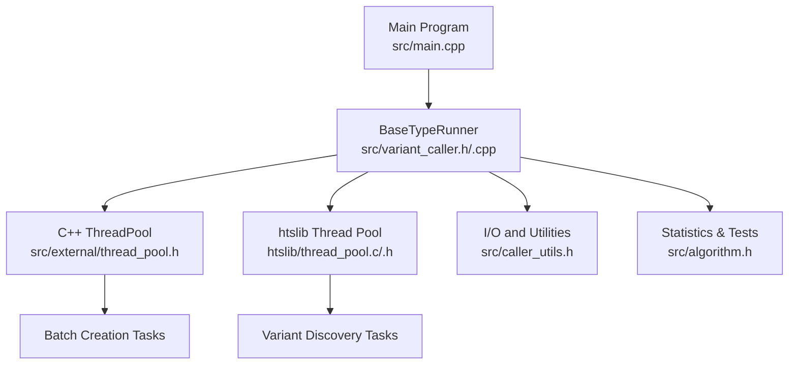
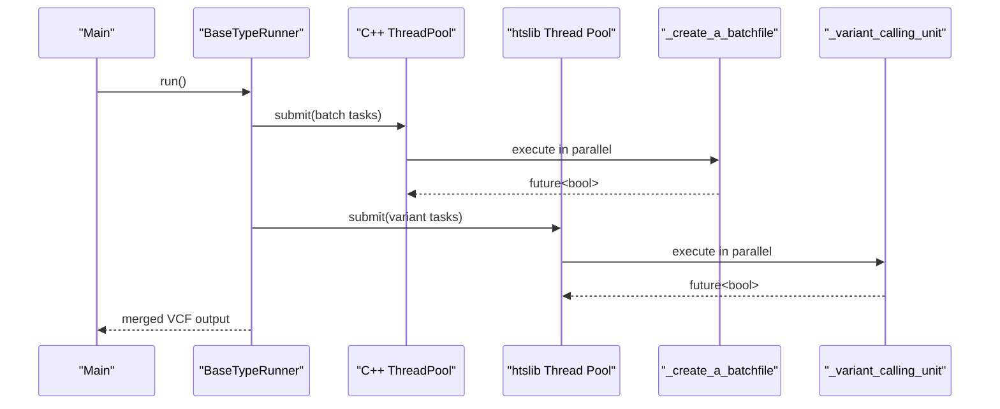
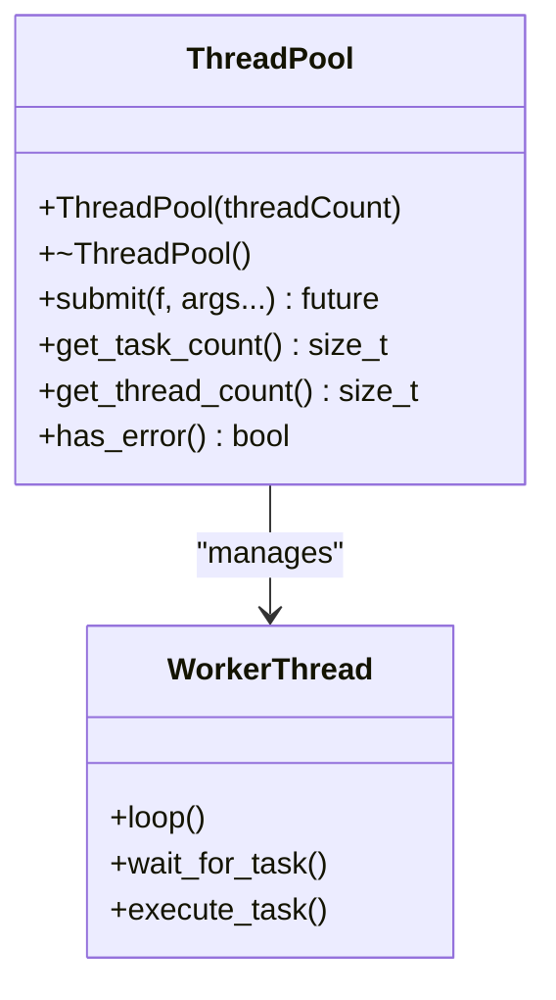
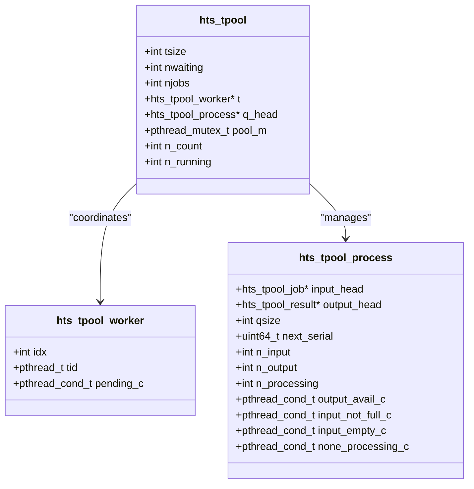
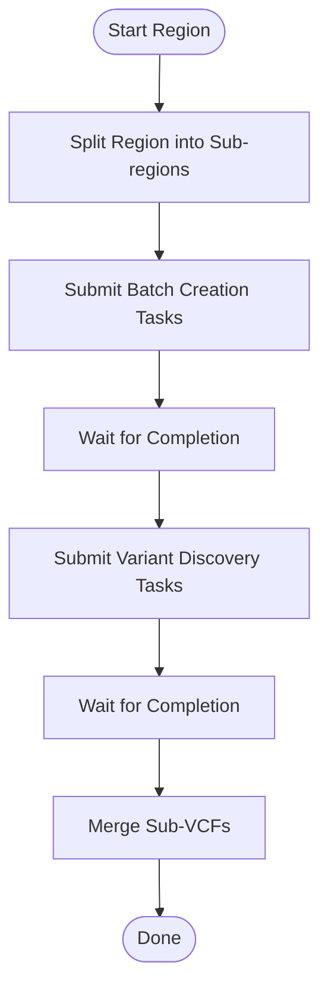
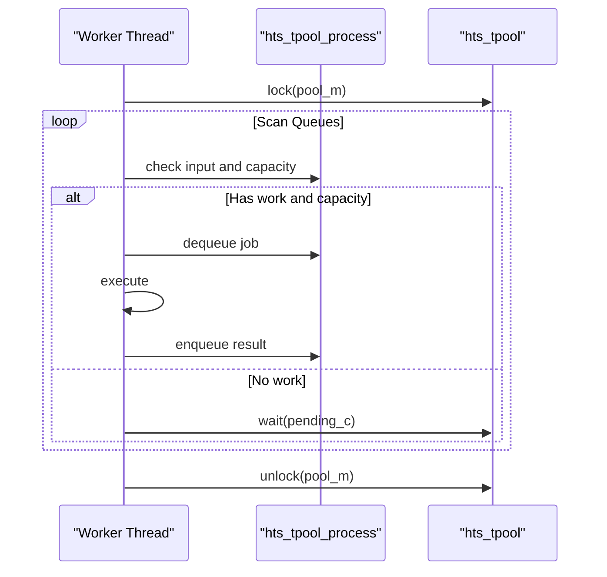
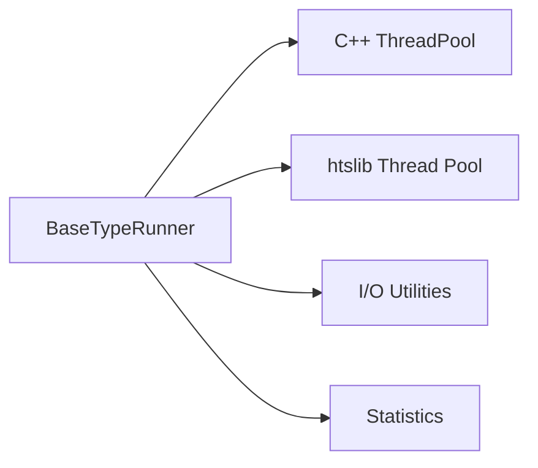

# Parallel Processing Framework

<cite>
**Referenced Files in This Document**
- [thread_pool.c](file://htslib/thread_pool.c)
- [thread_pool_internal.h](file://htslib/thread_pool_internal.h)
- [thread_pool.h](file://htslib/htslib/thread_pool.h)
- [thread_pool.h](file://src/external/thread_pool.h)
- [test_threadpool.cpp](file://tests/io/test_threadpool.cpp)
- [variant_caller.h](file://src/variant_caller.h)
- [variant_caller.cpp](file://src/variant_caller.cpp)
- [main.cpp](file://src/main.cpp)
- [algorithm.h](file://src/algorithm.h)
- [caller_utils.h](file://src/caller_utils.h)
</cite>

## Table of Contents
1. [Introduction](#introduction)
2. [Project Structure](#project-structure)
3. [Core Components](#core-components)
4. [Architecture Overview](#architecture-overview)
5. [Detailed Component Analysis](#detailed-component-analysis)
6. [Dependency Analysis](#dependency-analysis)
7. [Performance Considerations](#performance-considerations)
8. [Troubleshooting Guide](#troubleshooting-guide)
9. [Conclusion](#conclusion)

## Introduction
This document explains BaseVar2’s parallel processing framework and thread pool implementations used in the variant calling pipeline. It covers:
- Custom thread pool architectures (C-style htslib thread pool and C++11 ThreadPool)
- Load balancing and task distribution strategies
- Parallel execution patterns across the pipeline
- Memory management and synchronization in multi-threaded environments
- Performance tuning guidelines, optimal thread counts, and resource allocation strategies
- Thread safety considerations and concurrent data access patterns

## Project Structure
BaseVar2 integrates two complementary thread pool systems:
- A robust C-based thread pool from htslib for structured, ordered, and bounded job queues
- A lightweight C++11 ThreadPool wrapper for simple task submission and futures

These are orchestrated within the variant caller to parallelize batch creation and variant discovery across genomic regions.

**Diagram sources**
- [main.cpp:32-36](file://src/main.cpp#L32-L36)
- [variant_caller.h:41-174](file://src/variant_caller.h#L41-L174)
- [variant_caller.cpp:440-495](file://src/variant_caller.cpp#L440-L495)
- [thread_pool.h:25-137](file://src/external/thread_pool.h#L25-L137)
- [thread_pool.c:721-800](file://htslib/thread_pool.c#L721-L800)

**Section sources**
- [main.cpp:32-36](file://src/main.cpp#L32-L36)
- [variant_caller.h:41-174](file://src/variant_caller.h#L41-L174)
- [variant_caller.cpp:440-495](file://src/variant_caller.cpp#L440-L495)
- [thread_pool.h:25-137](file://src/external/thread_pool.h#L25-L137)
- [thread_pool.c:721-800](file://htslib/thread_pool.c#L721-L800)

## Core Components
- C++ ThreadPool (src/external/thread_pool.h): Provides a simple task queue with futures, designed for straightforward parallelism in the variant calling pipeline.
- htslib Thread Pool (htslib/thread_pool.c/.h): A sophisticated multi-process queue system with ordered results, bounded queues, and worker coordination suitable for I/O-heavy and structured pipelines.
- BaseTypeRunner (src/variant_caller.h/.cpp): Orchestrates parallel batch creation and variant discovery, leveraging both thread pools.

Key responsibilities:
- Task submission and futures handling (C++ ThreadPool)
- Ordered, bounded job/result queues with worker coordination (htslib Thread Pool)
- Pipeline orchestration: batch creation, region splitting, and variant calling

**Section sources**
- [thread_pool.h:25-137](file://src/external/thread_pool.h#L25-L137)
- [thread_pool.c:721-800](file://htslib/thread_pool.c#L721-L800)
- [variant_caller.h:41-174](file://src/variant_caller.h#L41-L174)
- [variant_caller.cpp:440-495](file://src/variant_caller.cpp#L440-L495)

## Architecture Overview
The pipeline splits the genome into regions and parallelizes:
- Batch creation: multiple threads create batchfiles for subsets of input BAMs
- Variant discovery: multiple threads process disjoint genomic regions concurrently

**Diagram sources**
- [variant_caller.cpp:440-495](file://src/variant_caller.cpp#L440-L495)
- [variant_caller.cpp:842-894](file://src/variant_caller.cpp#L842-L894)
- [thread_pool.h:25-137](file://src/external/thread_pool.h#L25-L137)
- [thread_pool.c:721-800](file://htslib/thread_pool.c#L721-L800)

## Detailed Component Analysis

### C++ ThreadPool Implementation
- Purpose: Lightweight task submission with futures for simple parallelism
- Features:
  - Worker threads continuously pull tasks from a shared queue
  - Exception propagation stops the pool and notifies waiting threads
  - Thread-safe queue protected by mutex and condition variable
- Usage in BaseVar2:
  - Batch creation: submits per-batchfile creation tasks
  - Variant discovery: submits per-region tasks

**Diagram sources**
- [thread_pool.h:25-137](file://src/external/thread_pool.h#L25-L137)

**Section sources**
- [thread_pool.h:25-137](file://src/external/thread_pool.h#L25-L137)
- [test_threadpool.cpp:7-29](file://tests/io/test_threadpool.cpp#L7-L29)

### htslib Thread Pool Implementation
- Purpose: Structured multi-process queues with ordered results and bounded buffers
- Key structures:
  - hts_tpool: pool of workers coordinating multiple queues
  - hts_tpool_process: per-process input/output queues with serial ordering
  - hts_tpool_job/results: job and result nodes
- Features:
  - Worker scans queues in circular order, prioritizing those with capacity for results
  - Condition variables coordinate dispatchers, workers, and result consumers
  - Recursive mutex protects shared state
  - Optional “average usage” damping to stabilize CPU utilization

**Diagram sources**
- [thread_pool_internal.h:56-163](file://htslib/thread_pool_internal.h#L56-L163)

**Section sources**
- [thread_pool.c:514-648](file://htslib/thread_pool.c#L514-L648)
- [thread_pool.c:650-713](file://htslib/thread_pool.c#L650-L713)
- [thread_pool_internal.h:56-163](file://htslib/thread_pool_internal.h#L56-L163)

### Parallel Execution Patterns in the Pipeline
- Batch creation:
  - Runner splits input BAMs into batches and submits tasks to C++ ThreadPool
  - Each task writes a batchfile and builds a Tabix index
- Variant discovery:
  - Runner splits the region into sub-regions and submits tasks to htslib Thread Pool
  - Each task opens batchfiles, iterates lines in parallel, and writes VCF records

**Diagram sources**
- [variant_caller.cpp:842-894](file://src/variant_caller.cpp#L842-L894)
- [variant_caller.cpp:440-495](file://src/variant_caller.cpp#L440-L495)

**Section sources**
- [variant_caller.cpp:842-894](file://src/variant_caller.cpp#L842-L894)
- [variant_caller.cpp:440-495](file://src/variant_caller.cpp#L440-L495)

### Load Balancing and Task Distribution
- C++ ThreadPool:
  - Round-robin-like task execution via shared queue; exceptions halt pool to prevent cascading failures
- htslib Thread Pool:
  - Workers scan process queues in circular order, selecting those with capacity for results
  - Condition signaling minimizes contention and avoids busy-waiting
  - Optional “average usage” damping stabilizes CPU usage under bursty workloads

**Diagram sources**
- [thread_pool.c:514-648](file://htslib/thread_pool.c#L514-L648)

**Section sources**
- [thread_pool.c:514-648](file://htslib/thread_pool.c#L514-L648)
- [thread_pool.c:650-713](file://htslib/thread_pool.c#L650-L713)

### Memory Management and Synchronization
- C++ ThreadPool:
  - Uses std::function and std::packaged_task for task encapsulation
  - Futures provide thread-safe result retrieval
- htslib Thread Pool:
  - Recursive mutex for reentrant protection
  - Condition variables coordinate producers/consumers
  - Strict ordering enforced by serial numbers on results
- BaseVar2 pipeline:
  - Uses RAII wrappers for file handles and iterators
  - Pre-sized containers to reduce reallocations
  - Thread-local buffers for per-task processing

**Section sources**
- [thread_pool.h:25-137](file://src/external/thread_pool.h#L25-L137)
- [thread_pool_internal.h:56-163](file://htslib/thread_pool_internal.h#L56-L163)
- [variant_caller.cpp:563-628](file://src/variant_caller.cpp#L563-L628)

## Dependency Analysis
- BaseTypeRunner depends on:
  - C++ ThreadPool for task submission and futures
  - htslib Thread Pool for structured, ordered processing
  - I/O utilities for batchfile and VCF operations
  - Statistics utilities for variant scoring and tests

**Diagram sources**
- [variant_caller.h:41-174](file://src/variant_caller.h#L41-L174)
- [caller_utils.h:21-28](file://src/caller_utils.h#L21-L28)
- [algorithm.h:15-23](file://src/algorithm.h#L15-L23)

**Section sources**
- [variant_caller.h:41-174](file://src/variant_caller.h#L41-L174)
- [caller_utils.h:21-28](file://src/caller_utils.h#L21-L28)
- [algorithm.h:15-23](file://src/algorithm.h#L15-L23)

## Performance Considerations
- Optimal thread count:
  - Use hardware concurrency for CPU-bound tasks; consider I/O overhead for disk-bound stages
  - Adjust per-region thread count to balance workload across sub-regions
- Resource allocation:
  - Pre-size containers to minimize allocations
  - Use streaming I/O and indexing to reduce random access latency
- Throughput stabilization:
  - htslib Thread Pool includes optional “average usage” damping to smooth CPU utilization
- Task granularity:
  - Avoid excessively small tasks to reduce scheduling overhead
  - Ensure sufficient parallelism for multi-core systems

[No sources needed since this section provides general guidance]

## Troubleshooting Guide
Common issues and remedies:
- Thread pool exceptions:
  - C++ ThreadPool halts on task exceptions; inspect futures and logs for failing tasks
- Deadlocks:
  - Ensure recursive mutex usage is consistent; avoid nested locks on shared structures
- Ordering violations:
  - htslib Thread Pool enforces strict result ordering; verify serial numbers and queue sizes
- Resource exhaustion:
  - Monitor queue sizes and adjust qsize to prevent unbounded growth
- I/O bottlenecks:
  - Verify batchfile and VCF indexing; ensure adequate disk bandwidth

**Section sources**
- [thread_pool.h:25-137](file://src/external/thread_pool.h#L25-L137)
- [thread_pool.c:315-327](file://htslib/thread_pool.c#L315-L327)
- [thread_pool.c:650-713](file://htslib/thread_pool.c#L650-L713)

## Conclusion
BaseVar2’s parallel processing framework combines a simple C++ ThreadPool for straightforward task parallelism and a robust htslib Thread Pool for structured, ordered, and bounded job processing. Together, they enable efficient batch creation and variant discovery across large genomic regions, with careful attention to memory management, synchronization, and performance tuning. By understanding the load balancing strategies and task distribution mechanisms, users can optimize thread counts and resource allocation for their specific datasets and hardware configurations.