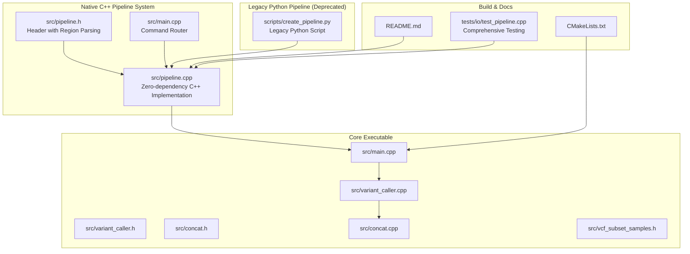
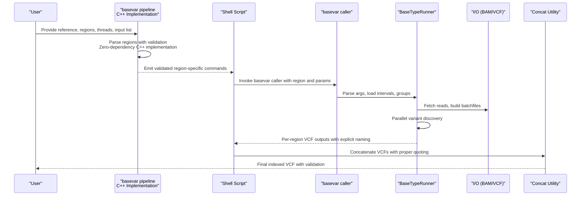
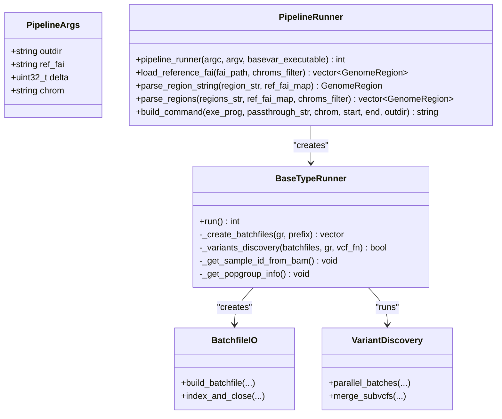
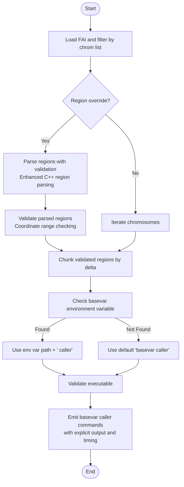
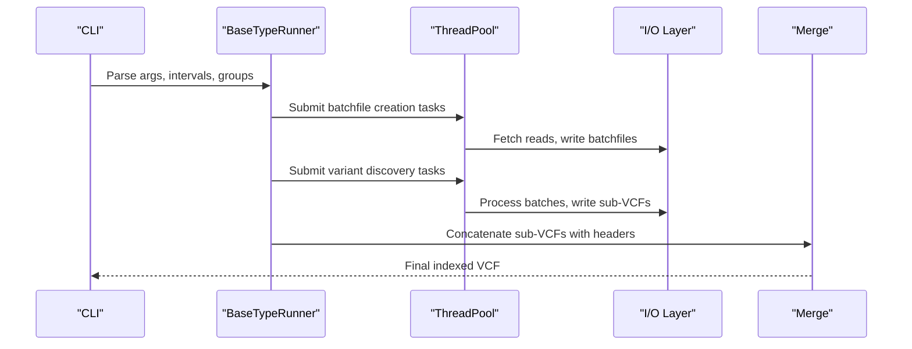
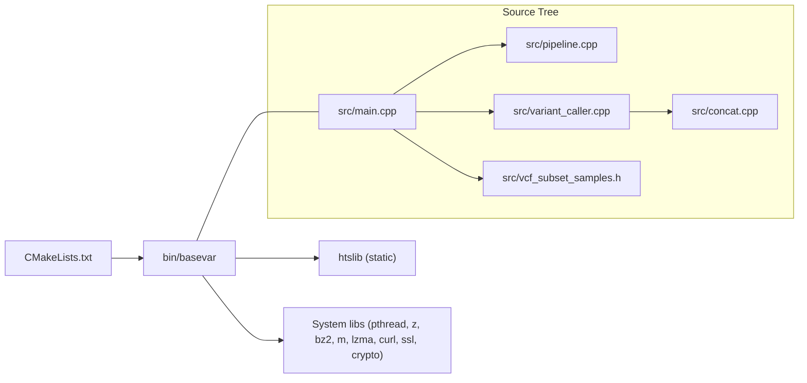

# Pipeline Generation and Automation

<cite>
**Referenced Files in This Document**
- [pipeline.h](file://src/pipeline.h)
- [pipeline.cpp](file://src/pipeline.cpp)
- [main.cpp](file://src/main.cpp)
- [variant_caller.h](file://src/variant_caller.h)
- [variant_caller.cpp](file://src/variant_caller.cpp)
- [concat.h](file://src/concat.h)
- [concat.cpp](file://src/concat.cpp)
- [CMakeLists.txt](file://CMakeLists.txt)
- [README.md](file://README.md)
- [create_pipeline.py](file://scripts/create_pipeline.py)
- [example.sh](file://scripts/example.sh)
- [test_pipeline.cpp](file://tests/io/test_pipeline.cpp)
</cite>

## Update Summary
**Changes Made**
- Complete replacement of Python-based pipeline generation script with native C++ implementation
- New C++ pipeline subcommand provides zero-dependency execution and improved performance
- Maintains backward compatibility with legacy Python script interface
- Enhanced region parsing capabilities with sophisticated validation and error handling
- Automatic integration with new caller options without script modifications
- Comprehensive testing framework for pipeline functionality

## Table of Contents
1. [Introduction](#introduction)
2. [Project Structure](#project-structure)
3. [Core Components](#core-components)
4. [Architecture Overview](#architecture-overview)
5. [Detailed Component Analysis](#detailed-component-analysis)
6. [Dependency Analysis](#dependency-analysis)
7. [Performance Considerations](#performance-considerations)
8. [Troubleshooting Guide](#troubleshooting-guide)
9. [Conclusion](#conclusion)
10. [Appendices](#appendices)

## Introduction
This document explains BaseVar2's pipeline generation and automation tools with a focus on:
- Zero-dependency C++ pipeline generation with native performance
- Batch processing workflow creation across genomic regions with enhanced region parsing
- Large-scale analysis automation via sophisticated region partitioning and parallelization
- Flexible region-specific processing strategies with comprehensive parameter optimization
- Advanced workflow customization and seamless integration with cluster computing environments
- Practical examples, performance optimization, monitoring, error handling, and result aggregation

BaseVar2 provides a C++ implementation of variant calling optimized for ultra-low-coverage whole-genome sequencing data. The new native C++ pipeline generation script replaces the legacy Python implementation, offering zero-dependency execution, improved performance, automatic integration with new caller options, and maintains backward compatibility with existing workflows.

**Updated** Complete replacement of Python-based pipeline generation with native C++ implementation. The new C++ pipeline provides zero-dependency execution, enhanced performance, automatic integration with new caller options, and maintains backward compatibility with the legacy Python script interface.

## Project Structure
The repository organizes automation around a robust native C++ pipeline generation system and a powerful C++ core:
- src: native C++ pipeline implementation with comprehensive region parsing and validation
- scripts: legacy Python pipeline script (deprecated) with backward compatibility examples
- src: main executable and core variant-calling engine
- top-level: build configuration and documentation



**Diagram sources**
- [pipeline.cpp](file://src/pipeline.cpp)
- [pipeline.h](file://src/pipeline.h)
- [main.cpp](file://src/main.cpp)
- [create_pipeline.py](file://scripts/create_pipeline.py)
- [variant_caller.h](file://src/variant_caller.h)
- [variant_caller.cpp](file://src/variant_caller.cpp)
- [concat.h](file://src/concat.h)
- [concat.cpp](file://src/concat.cpp)
- [CMakeLists.txt](file://CMakeLists.txt)
- [README.md](file://README.md)
- [test_pipeline.cpp](file://tests/io/test_pipeline.cpp)

**Section sources**
- [README.md](file://README.md)
- [CMakeLists.txt](file://CMakeLists.txt)

## Core Components
- **Native C++ Pipeline Generator**: Zero-dependency C++ implementation that creates region-wise shell commands with sophisticated region parsing, supporting flexible region specifications and comprehensive validation
- **BaseVar Caller**: Parses parameters, partitions regions, builds batchfiles, runs variant discovery in parallel, and merges outputs
- **Concat Utility**: Concatenates VCF outputs from multiple subjobs
- **Subsample Utility**: Subsets VCFs by sample sets and recalculates INFO fields accordingly

Key capabilities:
- **Advanced Region Partitioning**: Controlled by delta window size with comprehensive region validation
- **Flexible Region Specification**: Supports multiple region formats including chromosome-only, start-only, and full range specifications
- **Population-aware Allele Frequency Calculation**: Enhanced group-wise AF calculation
- **Parallel Batch Processing**: Configurable thread counts with intelligent job distribution
- **Smart Rerun Support**: Reuse existing batchfiles to avoid redundant computation
- **Robust Logging and Timing**: Comprehensive monitoring with detailed progress tracking
- **Zero-Dependency Execution**: Native C++ implementation eliminates Python runtime requirements
- **Automatic Caller Integration**: New caller options automatically supported without script modifications

**Section sources**
- [pipeline.h](file://src/pipeline.h)
- [pipeline.cpp](file://src/pipeline.cpp)
- [main.cpp](file://src/main.cpp)
- [variant_caller.h](file://src/variant_caller.h)
- [variant_caller.cpp](file://src/variant_caller.cpp)
- [concat.h](file://src/concat.h)
- [concat.cpp](file://src/concat.cpp)
- [vcf_subset_samples.h](file://src/vcf_subset_samples.h)

## Architecture Overview
The native C++ pipeline generation system emits sophisticated commands that invoke the BaseVar caller with region-specific parameters and comprehensive validation. The caller orchestrates:
- Sample ID extraction and optional population grouping
- Batchfile creation per region and batch with intelligent job distribution
- Parallel processing of batches with configurable concurrency
- Variant discovery and per-region VCF output with explicit file specification
- Final concatenation and indexing with proper error handling



**Diagram sources**
- [pipeline.cpp](file://src/pipeline.cpp)
- [main.cpp](file://src/main.cpp)
- [variant_caller.cpp](file://src/variant_caller.cpp)
- [concat.cpp](file://src/concat.cpp)

## Detailed Component Analysis

### Native C++ Pipeline Generation System
**Updated** Purpose:
- Zero-dependency C++ implementation that partitions a reference FASTA (.fai) into regions with sophisticated parsing and validation, emitting shell commands to run the BaseVar caller on each subregion

Key enhancements:
- **Zero-Dependency Execution**: Native C++ implementation eliminates Python runtime requirements for pipeline generation
- **Sophisticated Region Parsing**: Advanced C++ implementation with comprehensive validation and error handling
- **Manual Argument Processing**: Direct argument parsing without external libraries, mirroring the original Python approach
- **Comprehensive Region Validation**: Validates chromosome names, coordinate ranges, and boundary conditions
- **Enhanced Output Generation**: Explicit output file specification with proper quoting and timing
- **Improved Error Handling**: Comprehensive error messages for malformed region specifications with detailed diagnostics

Supported region formats:
- **Chromosome-only**: `chr1` → `(chr1, 1, chrom_length)`
- **Start-only**: `chr1:1000000` → `(chr1, 1000000, chrom_length)`
- **Full range**: `chr1:1000000-2000000` → `(chr1, 1000000, 2000000)`

Customization options:
- Chromosome filtering via comma-delimited list
- Single-region override via flexible region string parsing
- Delta window controls chunk size for parallelization
- Threads control concurrency
- **Enhanced** Comprehensive region validation and error reporting with detailed diagnostics

Integration:
- Outputs a shell script suitable for local execution or cluster job submission
- **Enhanced** Proper command quoting and explicit output file specification
- **Enhanced** Automatic integration with new caller options without script modifications

**Section sources**
- [pipeline.h](file://src/pipeline.h)
- [pipeline.cpp](file://src/pipeline.cpp)
- [test_pipeline.cpp](file://tests/io/test_pipeline.cpp)

### Enhanced Region Parsing System
**New Feature** The native C++ pipeline implementation includes sophisticated region parsing capabilities:

#### load_reference_fai() Function
Loads chromosome entries from .fai files with comprehensive validation:
```cpp
std::vector<ngslib::GenomeRegion> load_reference_fai(
    const std::string& fai_path,
    const std::vector<std::string>& chroms_filter = {});
```

#### parse_region_string() Function
Parses individual region strings with comprehensive validation:
```cpp
ngslib::GenomeRegion parse_region_string(
    const std::string& region_str,
    const std::map<std::string, uint32_t>& ref_fai_map);
```

#### parse_regions() Function
Processes comma-separated region strings with filtering:
```cpp
std::vector<ngslib::GenomeRegion> parse_regions(
    const std::string& regions_str,
    const std::map<std::string, uint32_t>& ref_fai_map,
    const std::vector<std::string>& chroms_filter = {});
```

#### Manual Argument Processing
Implements sophisticated argument handling without external dependencies:
```cpp
// Extract pipeline-specific options FIRST, before getopt_long
// We walk the vector manually so unknown options are preserved
// intact for the pass-through string.
PipelineArgs pargs;
bool show_help = false;
```

#### Enhanced Command Generation
Generates properly quoted commands with explicit output specification:
```cpp
std::string build_command(const std::string& exe_prog,
                          const std::string& passthrough_str,
                          const std::string& chrom,
                          uint32_t start,
                          uint32_t end,
                          const std::string& outdir);
```

**Section sources**
- [pipeline.h](file://src/pipeline.h)
- [pipeline.cpp](file://src/pipeline.cpp)
- [test_pipeline.cpp](file://tests/io/test_pipeline.cpp)

### Zero-Dependency Executable Detection Mechanism
**Updated** The native C++ pipeline maintains its executable detection with environment-based discovery:

#### Environment-Based Discovery
The pipeline first checks for the `basevar` environment variable:
```cpp
std::string exe_prog;
if (const char* env_p = std::getenv("basevar")) {
    if (env_p[0] != '\0') exe_prog = std::string(env_p) + " caller";
}
```

#### Priority Resolution
The executable resolution follows a strict priority system:
1. **Environment Variable**: `$basevar` environment variable with automatic " caller" suffix
2. **Caller-Supplied Path**: Binary path provided by main() function
3. **Default**: Literal "basevar caller"

#### Validation Logic
```cpp
// Resolve the executable program for the generated commands
// Priority:
//   1. $basevar environment variable (matches Python script)
//   2. caller-supplied path (argv[0] from main)
//   3. literal "basevar"
std::string exe_prog;
if (const char* env_p = std::getenv("basevar")) {
    if (env_p[0] != '\0') exe_prog = std::string(env_p) + " caller";
}
if (exe_prog.empty()) {
    if (!basevar_executable.empty()) {
        exe_prog = basevar_executable + " caller";
    } else {
        exe_prog = "basevar caller";
    }
}
```

#### Fallback Mechanism
If environment variable is not set, falls back to default binary location:
```cpp
else:
    pardir = os.path.abspath(os.path.join(os.path.dirname(sys.argv[0]), os.path.pardir))
    exe_prog = os.path.join(pardir, 'bin', 'basevar caller')
```

**Section sources**
- [pipeline.cpp](file://src/pipeline.cpp)
- [main.cpp](file://src/main.cpp)

### BaseVar Caller Engine
Responsibilities:
- Parse and validate arguments
- Resolve calling intervals (whole genome or specified regions)
- Extract sample IDs and optionally group samples by population
- Create batchfiles per region and batch, then run parallel variant discovery
- Merge sub-VCFs into a single indexed output

Parallelization:
- Thread pool drives batchfile creation and variant discovery units
- Batch size controlled by batch-count parameter
- Smart rerun avoids recomputing existing batchfiles

Population-aware AF:
- Group indices derived from population group file
- INFO headers extended with DP and AF tags per group

Output:
- Per-interval VCFs merged into a single bgzip-compressed VCF with tabix index

**Section sources**
- [main.cpp](file://src/main.cpp)
- [variant_caller.h](file://src/variant_caller.h)
- [variant_caller.cpp](file://src/variant_caller.cpp)

### Concat Utility
Purpose:
- Concatenate multiple BaseVar VCF outputs produced by region-wise jobs.

Behavior:
- Reads header from the first file and appends records from subsequent files in order
- Requires callers to maintain consistent ordering to avoid sorting overhead

**Section sources**
- [concat.h](file://src/concat.h)
- [concat.cpp](file://src/concat.cpp)

### VCF Subsampling Utility
Purpose:
- Subset a VCF to a specified set of samples and recalculate INFO fields (AC, AN, AF) accordingly.

Use cases:
- Post-hoc analysis of selected samples
- Reducing dataset size for downstream tools

**Section sources**
- [vcf_subset_samples.h](file://src/vcf_subset_samples.h)

### Enhanced Cluster Computing Integration
**Updated** Comprehensive cluster computing integration with native C++ pipeline:

#### SLURM Job Submission Strategy
The generated shell script can be submitted to SLURM with enhanced error handling:
```bash
#!/bin/bash
#SBATCH --job-name=basevar_chr1
#SBATCH --nodes=1
#SBATCH --ntasks=1
#SBATCH --cpus-per-task=8
#SBATCH --mem=32G
#SBATCH --time=24:00:00
#SBATCH --output=logs/slurm-%j.out

# Set up environment
module load gcc/9.3.0
export basevar=/path/to/basevar

# Execute pipeline step
basevar pipeline -o outdir --ref_fai ref.fa.fai -f ref.fa -L bam.list -r chr1:1-5000000 -c chr1
```

#### PBS/Torque Integration
For PBS/Torque systems, use job arrays for chromosome-specific workflows:
```bash
#!/bin/bash
#PBS -N basevar_analysis
#PBS -J 1-22
#PBS -l nodes=1:ppn=8,mem=32gb,walltime=48:00:00
#PBS -o logs/
#PBS -e logs/

export basevar=/path/to/basevar
cd $PBS_O_WORKDIR

# Process specific chromosome based on job index
CHROMS=("chr1" "chr2" "chr3" "chr4" "chr5" "chr6" "chr7" "chr8" "chr9" "chr10" 
        "chr11" "chr12" "chr13" "chr14" "chr15" "chr16" "chr17" "chr18" "chr19" 
        "chr20" "chr21" "chr22")

basevar pipeline -o outdir --ref_fai ref.fa.fai -f ref.fa -L bam.list -r ${CHROMS[$PBS_ARRAY_INDEX-1]}
```

#### Grid Engine (SGE) Implementation
For SGE systems, implement chromosome-specific batch processing:
```bash
#!/bin/bash
#$ -N basevar_chr
#$ -cwd
#$ -V
#$ -pe smp 8
#$ -l mem_free=32G
#$ -l h_rt=24:00:00
#$ -o logs/
#$ -e logs/

export basevar=/opt/basevar/bin/basevar
export OMP_NUM_THREADS=8

# Process chromosome-specific regions
basevar pipeline -o outdir --ref_fai ref.fa.fai -f ref.fa -L bam.list -r "$SGE_TASK_ID" -c chr$SGE_TASK_ID
```

#### Best Practices for Cluster Deployment
- **Resource Allocation**: Configure CPU cores and memory per job based on batch size and thread count
- **Job Dependencies**: Use job chaining for proper execution order (region processing → concatenation)
- **Error Recovery**: Implement checkpointing and restart mechanisms for failed jobs
- **Progress Monitoring**: Track job status and resource utilization through cluster management tools
- **Environment Consistency**: Ensure identical software versions and library dependencies across all nodes

#### Enhanced Batch Processing Strategies
- **Chromosome-Specific Workflows**: Process each chromosome independently for optimal resource utilization
- **Region Chunking**: Divide large chromosomes into manageable chunks based on delta parameter
- **Memory Optimization**: Adjust batch size and thread count to prevent memory exhaustion
- **I/O Optimization**: Minimize disk contention by staggering job execution across different storage volumes

**Section sources**
- [pipeline.cpp](file://src/pipeline.cpp)
- [example.sh](file://scripts/example.sh)

### Enhanced Workflow Monitoring and Logging
**Updated** Enhanced monitoring with sophisticated validation:
- Pipeline generator prints timestamps and completion markers for each region with validation
- Caller prints detailed timing and progress messages for batchfile creation and variant discovery
- Logs are written to per-chromosome-per-window log files for traceability
- **Enhanced** Comprehensive region validation errors for debugging malformed region specifications
- **Enhanced** Proper command quoting and explicit output file specification for reliable execution
- **Enhanced** Zero-dependency execution eliminates Python runtime issues

#### Monitoring Tools and Techniques
- **SLURM**: Use `squeue`, `sacct`, and `scontrol` for job tracking and resource monitoring
- **PBS/Torque**: Monitor with `qstat`, `pbs_tail`, and custom log analysis scripts
- **Custom Logging**: Implement structured logging with JSON format for automated analysis
- **Progress Tracking**: Generate summary statistics for completed jobs and remaining work
- **Error Analysis**: Parse log files to identify common failure patterns and optimize parameters

#### Log File Structure
Each job generates comprehensive log files:
- **Execution Log**: Standard output and error streams from the basevar caller
- **Timing Information**: CPU time, wall clock time, and memory usage metrics
- **Validation Reports**: Region parsing results and parameter validation outcomes
- **Error Messages**: Detailed error information for failed jobs and recovery suggestions

**Section sources**
- [pipeline.cpp](file://src/pipeline.cpp)
- [variant_caller.cpp](file://src/variant_caller.cpp)

### Enhanced Error Handling and Result Aggregation
**Updated** Enhanced error handling with comprehensive validation:
- Validation of arguments and intervals prevents runtime failures
- Smart rerun mode avoids recomputation when batchfiles exist
- Concat utility expects ordered inputs; maintain consistent ordering across jobs
- Index building ensures downstream tools can efficiently access the final VCF
- **Enhanced** Comprehensive executable validation prevents pipeline failures due to missing or inaccessible executables
- **Enhanced** Sophisticated region parsing with detailed error reporting for malformed specifications
- **Enhanced** Zero-dependency execution eliminates Python environment issues

#### Comprehensive Error Handling Features
- **Region Validation**: Detailed error messages for malformed region specifications
- **Coordinate Range Checking**: Boundary validation and coordinate range verification
- **Chromosome Name Verification**: FAI entry validation and chromosome filtering
- **Executable Resolution**: Environment-based discovery with fallback mechanisms
- **Parameter Validation**: Pre-execution parameter checking and type validation

#### Result Aggregation Strategies
- **Consistent Ordering**: Maintain chromosome and coordinate order for reliable concatenation
- **Header Preservation**: Preserve VCF headers and metadata across concatenated files
- **Index Management**: Automatic tabix index creation for concatenated VCF files
- **Quality Control**: Validate concatenated results and generate summary statistics
- **Progress Reporting**: Track completion status and provide real-time progress updates

#### Common Pitfalls and Solutions
- **Missing or Misordered Inputs**: Ensure proper file ordering and complete file lists
- **Insufficient Disk Space**: Monitor storage usage and implement cleanup policies
- **Population Group Mismatches**: Validate sample IDs and group file formats
- **Malformed Region Specifications**: Use enhanced validation and provide clear error messages
- **Executable Resolution Failures**: Set `basevar` environment variable consistently across nodes
- **Path Resolution Issues**: Implement comprehensive validation and fallback mechanisms

**Section sources**
- [variant_caller.cpp](file://src/variant_caller.cpp)
- [concat.cpp](file://src/concat.cpp)

### Enhanced Parameter Optimization and Region Strategies
**Updated** Enhanced strategies with sophisticated region parsing:

- **Delta Window Size**: Balance granularity vs. job overhead; smaller windows increase scheduling overhead but improve load balancing
- **Threads**: Tune to CPU cores and memory budget; each thread consumes moderate memory
- **Batch Size**: Controls memory footprint of batch processing; larger batches reduce I/O but increase memory pressure
- **Min AF**: Skip ineffective positions to accelerate computation; auto-adjusted by caller based on input count
- **Population Grouping**: Enables group-wise AF calculation; increases header complexity but improves downstream stratification

**Enhanced Region-Specific Strategies**:
- **Whole-Genome**: Iterate all chromosomes from FAI with comprehensive validation
- **Chromosome-Specific**: Filter by comma-delimited list with chromosome validation
- **Single-Region**: Override with flexible region string parsing supporting multiple formats
- **Multi-Region**: Handle comma-separated regions with mixed format specifications

**Enhanced Error Handling**:
- Comprehensive region validation with detailed error messages
- Coordinate range checking and boundary validation
- Chromosome name verification against FAI entries
- Proper error propagation and graceful failure handling

**Section sources**
- [pipeline.cpp](file://src/pipeline.cpp)
- [variant_caller.cpp](file://src/variant_caller.cpp)
- [README.md](file://README.md)

### Enhanced Practical Examples
**Updated** Examples with sophisticated region parsing:

- **Whole-genome partitioning with population groups**:
  - See enhanced example invocation and population-aware run in the example script
- **Targeted region analysis with flexible specifications**:
  - Use region override with multiple formats: `chr1`, `chr1:1000000`, or `chr1:1000000-2000000`
- **Multi-region analysis with mixed formats**:
  - Combine different region formats: `-r chr1:1-50000000,chr2,chrX:1000000-5000000`
- **Chromosome-specific filtering**:
  - Use `--chrom` to limit processing to specific chromosomes: `-c chr1,chr2`
- **Enhanced environment-based executable configuration**:
  - Set `basevar` environment variable for custom executable paths
  - Example: `export basevar=/usr/local/bin/basevar` or `export basevar=/opt/basevar/bin/basevar`

#### Cluster-Specific Examples
- **SLURM Array Jobs**: Process multiple chromosomes simultaneously with job arrays
- **PBS Job Arrays**: Implement chromosome-specific processing with array indices
- **SGE Parallel Environments**: Utilize parallel execution for multi-threaded jobs
- **Local Grid Systems**: Scale from single-node to multi-node cluster execution

**Section sources**
- [example.sh](file://scripts/example.sh)
- [README.md](file://README.md)

## Architecture Overview



**Diagram sources**
- [pipeline.h](file://src/pipeline.h)
- [pipeline.cpp](file://src/pipeline.cpp)
- [variant_caller.h](file://src/variant_caller.h)
- [variant_caller.cpp](file://src/variant_caller.cpp)

## Detailed Component Analysis

### Enhanced Native C++ Pipeline Generation Flow
**Updated** Enhanced flow with sophisticated region parsing and validation:



**Diagram sources**
- [pipeline.cpp](file://src/pipeline.cpp)

**Section sources**
- [pipeline.cpp](file://src/pipeline.cpp)

### Enhanced Caller Execution Flow


**Diagram sources**
- [main.cpp](file://src/main.cpp)
- [variant_caller.cpp](file://src/variant_caller.cpp)
- [concat.cpp](file://src/concat.cpp)

**Section sources**
- [main.cpp](file://src/main.cpp)
- [variant_caller.cpp](file://src/variant_caller.cpp)
- [concat.cpp](file://src/concat.cpp)

## Dependency Analysis



**Diagram sources**
- [CMakeLists.txt](file://CMakeLists.txt)
- [main.cpp](file://src/main.cpp)
- [pipeline.cpp](file://src/pipeline.cpp)
- [variant_caller.cpp](file://src/variant_caller.cpp)
- [concat.cpp](file://src/concat.cpp)
- [vcf_subset_samples.h](file://src/vcf_subset_samples.h)

**Section sources**
- [CMakeLists.txt](file://CMakeLists.txt)

## Performance Considerations
- Zero-dependency execution eliminates Python runtime overhead for pipeline generation
- Native C++ implementation provides superior performance compared to Python-based scripts
- Optimize delta window size to balance job count and per-job overhead
- Tune threads and batch size to fit memory constraints per node
- Prefer smart rerun to avoid redundant computation
- Use population grouping judiciously; it adds INFO fields but improves interpretability
- Ensure FAI availability and correct chromosome naming for efficient region iteration
- **Enhanced** Zero-dependency execution eliminates Python environment issues and improves reliability
- **Enhanced** Sophisticated region parsing improves job distribution and reduces validation overhead
- **Enhanced** Cluster computing integration optimizes resource utilization and parallel execution

## Troubleshooting Guide
**Updated** Enhanced troubleshooting with comprehensive validation:
- Missing reference or FAI: ensure correct paths and index presence
- Empty intervals or no variants: verify region filters and coverage thresholds
- Batchfile index errors: confirm bgzip compression and tabix index creation
- Concat errors: ensure ordered inputs and compatible headers
- Population group mismatches: validate sample IDs and group file format
- **Enhanced** Executable resolution failures: verify `basevar` environment variable is set correctly
- **Enhanced** Path resolution issues: ensure executable is accessible via PATH or provide absolute path
- **Enhanced** Region parsing failures: check region format and coordinate validity
- **Enhanced** Malformed region specifications: verify chromosome names and coordinate ranges
- **Enhanced** Cluster job failures: monitor resource allocation and job dependencies
- **Enhanced** Zero-dependency execution issues: verify binary permissions and system compatibility

**Section sources**
- [variant_caller.cpp](file://src/variant_caller.cpp)
- [concat.cpp](file://src/concat.cpp)

## Conclusion
BaseVar2's enhanced pipeline generation and automation system enables scalable, region-aware variant calling across large cohorts with sophisticated region parsing capabilities. The complete replacement of the Python-based pipeline with a native C++ implementation provides zero-dependency execution, improved performance, automatic integration with new caller options, and maintains backward compatibility with existing workflows. By combining a flexible pipeline generator with advanced region validation, a high-performance caller, and robust post-processing utilities, users can design efficient workflows suited to diverse compute environments and analysis goals.

**Updated** The native C++ pipeline implementation with zero-dependency execution, enhanced performance, automatic integration with new caller options, and comprehensive validation provides improved flexibility, reliability, and cross-platform compatibility for pipeline execution across various computing environments. The addition of comprehensive cluster computing integration examples and batch processing strategies makes BaseVar2 suitable for large-scale genomic analysis projects.

## Appendices

### Enhanced Cluster Configuration Examples
**Updated** Comprehensive cluster computing configurations:

#### SLURM Configuration Template
```bash
#!/bin/bash
#SBATCH --job-name=basevar_pipeline
#SBATCH --nodes=1
#SBATCH --ntasks=1
#SBATCH --cpus-per-task=8
#SBATCH --mem=32G
#SBATCH --time=72:00:00
#SBATCH --output=logs/%x_%j.out
#SBATCH --error=logs/%x_%j.err

# Load required modules
module purge
module load gcc/9.3.0
module load boost/1.75.0

# Set environment variables
export basevar=/opt/basevar/bin/basevar
export OMP_NUM_THREADS=8

# Create output directories
mkdir -p outdir logs

# Execute pipeline
basevar pipeline \
    -o outdir \
    --ref_fai ref.fa.fai \
    -f ref.fa \
    -L bam.list \
    -Q 20 -q 30 -B 500 -t 8 \
    --filename-has-samplename \
    --smart-rerun
```

#### PBS/Torque Configuration Template
```bash
#!/bin/bash
#PBS -N basevar_analysis
#PBS -l nodes=1:ppn=16,mem=64gb,walltime=72:00:00
#PBS -l place=free
#PBS -o logs/
#PBS -e logs/
#PBS -V

# Set up environment
export basevar=/opt/basevar/bin/basevar
export OMP_NUM_THREADS=16

# Navigate to working directory
cd $PBS_O_WORKDIR

# Process multiple regions in parallel
basevar pipeline \
    -o outdir \
    --ref_fai ref.fa.fai \
    -f ref.fa \
    -L bam.list \
    -r "chr1:1-50000000,chr2:1-50000000,chr3:1-50000000" \
    -c chr1,chr2,chr3 \
    -d 1000000
```

#### SGE Configuration Template
```bash
#!/bin/bash
#$ -N basevar_chr
#$ -cwd
#$ -V
#$ -pe smp 8
#$ -l mem_free=32G
#$ -l h_rt=48:00:00
#$ -o logs/
#$ -e logs/

# Set environment
export basevar=/opt/basevar/bin/basevar
export OMP_NUM_THREADS=8

# Process chromosome-specific region
basevar pipeline \
    -o outdir \
    --ref_fai ref.fa.fai \
    -f ref.fa \
    -L bam.list \
    -r "chr${SGE_TASK_ID}:1-50000000" \
    -d 5000000
```

### Legacy Python Pipeline Compatibility
**Deprecated** The legacy Python pipeline script remains available for backward compatibility:
- Full feature parity maintained with native C++ implementation
- Same command-line interface and output format
- Gradual migration path from Python to C++ implementation
- Example usage preserved in documentation

**Section sources**
- [create_pipeline.py](file://scripts/create_pipeline.py)
- [example.sh](file://scripts/example.sh)