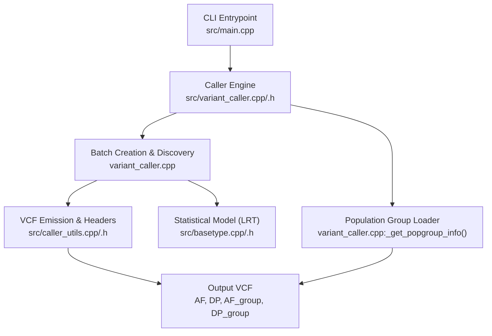
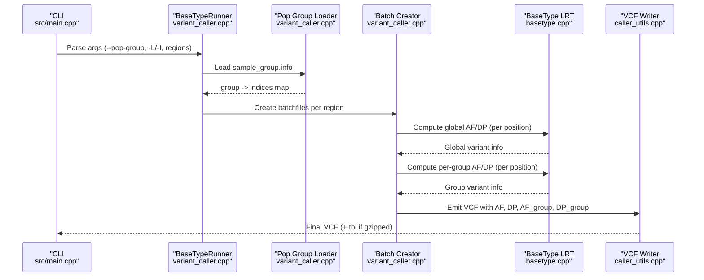
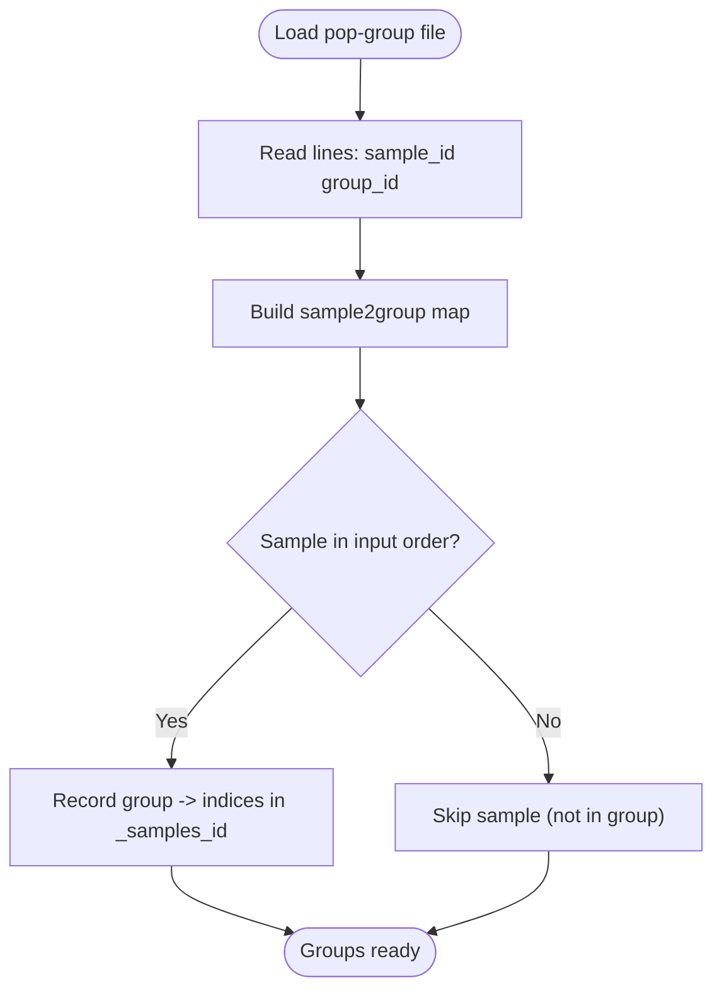
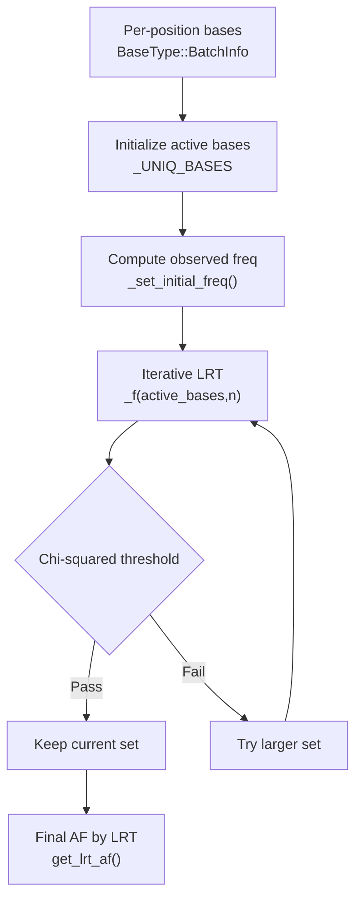
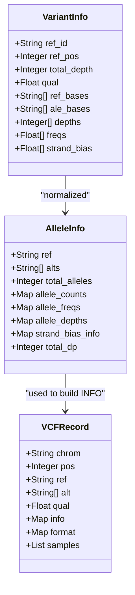
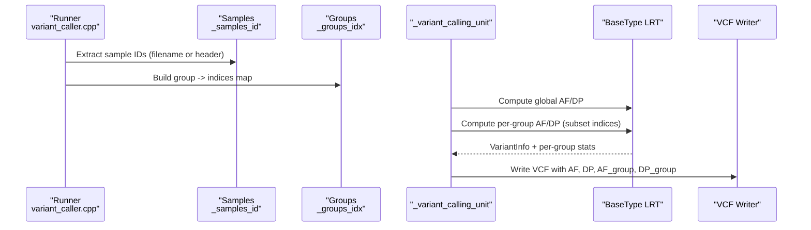
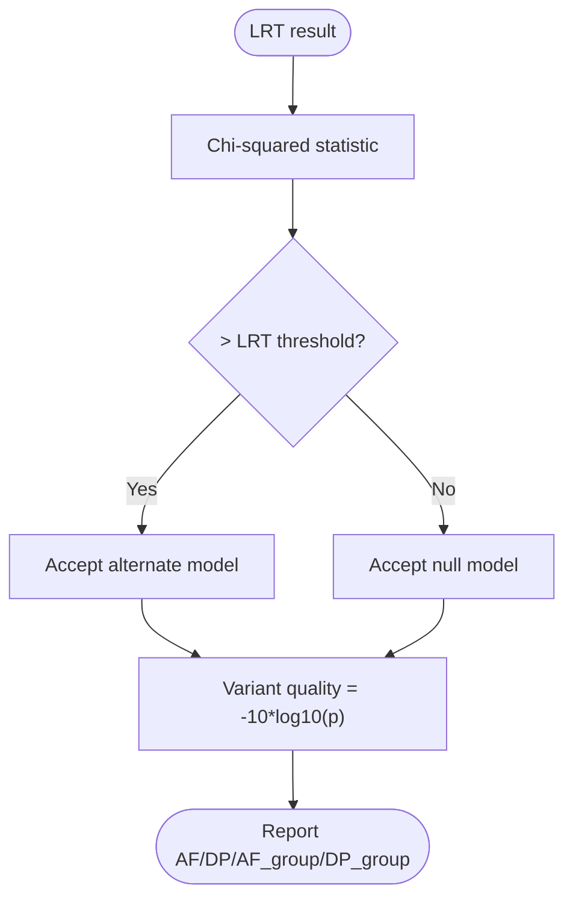
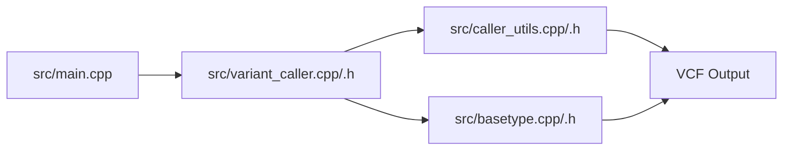

# Population Genetics Analysis

<cite>
**Referenced Files in This Document**
- [README.md](file://README.md)
- [main.cpp](file://src/main.cpp)
- [variant_caller.h](file://src/variant_caller.h)
- [variant_caller.cpp](file://src/variant_caller.cpp)
- [caller_utils.h](file://src/caller_utils.h)
- [caller_utils.cpp](file://src/caller_utils.cpp)
- [basetype.h](file://src/basetype.h)
- [basetype.cpp](file://src/basetype.cpp)
- [sample_group.info](file://tests/data/sample_group.info)
</cite>

## Table of Contents
1. [Introduction](#introduction)
2. [Project Structure](#project-structure)
3. [Core Components](#core-components)
4. [Architecture Overview](#architecture-overview)
5. [Detailed Component Analysis](#detailed-component-analysis)
6. [Dependency Analysis](#dependency-analysis)
7. [Performance Considerations](#performance-considerations)
8. [Troubleshooting Guide](#troubleshooting-guide)
9. [Conclusion](#conclusion)
10. [Appendices](#appendices)

## Introduction
This document explains BaseVar2’s population genetics analysis capabilities with a focus on:
- Population group analysis and allele frequency calculation
- Demographic structure analysis via population-specific variant calling
- Sample grouping mechanisms and statistical inference
- Input format requirements for population group files
- Interpretation of population-specific results
- Practical workflows and output interpretation guidelines
- Statistical significance testing and confidence-related metrics

BaseVar2 performs ultra-low-pass WGS variant calling and estimates allele frequencies using a likelihood ratio test (LRT) framework. When a population group file is provided, it computes population-specific depths (DP_group) and allele frequencies (AF_group) stored in the VCF INFO field, enabling downstream population genetics analyses.

## Project Structure
Key modules involved in population genetics analysis:
- CLI entrypoint and command routing
- Variant caller engine for batch creation, variant discovery, and VCF emission
- Utilities for VCF header construction, INFO fields, and sample formatting
- Core statistical model for allele frequency estimation (LRT)
- Test data for population grouping

**Diagram sources**
- [main.cpp:32-76](file://src/main.cpp#L32-L76)
- [variant_caller.cpp:302-340](file://src/variant_caller.cpp#L302-L340)
- [variant_caller.cpp:842-894](file://src/variant_caller.cpp#L842-L894)
- [basetype.cpp:137-210](file://src/basetype.cpp#L137-L210)
- [caller_utils.cpp:217-262](file://src/caller_utils.cpp#L217-L262)

**Section sources**
- [README.md:107-148](file://README.md#L107-L148)
- [main.cpp:32-76](file://src/main.cpp#L32-L76)
- [variant_caller.h:41-174](file://src/variant_caller.h#L41-L174)
- [variant_caller.cpp:302-340](file://src/variant_caller.cpp#L302-L340)
- [variant_caller.cpp:842-894](file://src/variant_caller.cpp#L842-L894)
- [caller_utils.cpp:217-262](file://src/caller_utils.cpp#L217-L262)
- [basetype.h:29-143](file://src/basetype.h#L29-L143)
- [basetype.cpp:137-210](file://src/basetype.cpp#L137-L210)

## Core Components
- Population group loader: Reads a two-column sample-to-group mapping and builds per-group sample indices used for population-specific variant calling.
- Variant caller engine: Creates batchfiles, discovers variants, and emits a merged VCF with population-specific INFO fields.
- Statistical model (LRT): Estimates allele frequencies and variant quality scores per position and per population.
- VCF header and INFO fields: Defines standard and population-specific INFO keys (AF, DP, AF_group, DP_group) and FORMAT fields (GT:GQ:PL:AD:DP).

Key responsibilities:
- Sample grouping: Ensures samples are matched to groups and maintains order consistent with input BAM files.
- Population-specific variant calling: Runs the LRT model separately for each group to compute group-specific AF and DP.
- Output emission: Writes INFO fields for global and per-population AF/DP and FORMAT fields for per-sample genotypes.

**Section sources**
- [variant_caller.cpp:302-340](file://src/variant_caller.cpp#L302-L340)
- [variant_caller.cpp:1118-1186](file://src/variant_caller.cpp#L1118-L1186)
- [variant_caller.cpp:1219-1302](file://src/variant_caller.cpp#L1219-L1302)
- [caller_utils.cpp:217-262](file://src/caller_utils.cpp#L217-L262)
- [basetype.cpp:137-210](file://src/basetype.cpp#L137-L210)

## Architecture Overview
The population genetics pipeline integrates sample grouping, batch processing, statistical inference, and VCF emission.

**Diagram sources**
- [main.cpp:32-76](file://src/main.cpp#L32-L76)
- [variant_caller.cpp:302-340](file://src/variant_caller.cpp#L302-L340)
- [variant_caller.cpp:842-894](file://src/variant_caller.cpp#L842-L894)
- [variant_caller.cpp:1118-1186](file://src/variant_caller.cpp#L1118-L1186)
- [basetype.cpp:137-210](file://src/basetype.cpp#L137-L210)
- [caller_utils.cpp:217-262](file://src/caller_utils.cpp#L217-L262)

## Detailed Component Analysis

### Population Group Analysis
- Input format: Two-column file mapping sample_id to group_id, whitespace-separated. The example dataset demonstrates two groups (GD and BJ).
- Loading logic: Reads the file, maps sample IDs to group IDs, and records per-group sample indices preserving the original input order.
- Group usage: During variant discovery, the engine runs the LRT model for each group independently to compute group-specific AF and DP.

**Diagram sources**
- [variant_caller.cpp:302-340](file://src/variant_caller.cpp#L302-L340)
- [sample_group.info:1-44](file://tests/data/sample_group.info#L1-L44)

**Section sources**
- [variant_caller.cpp:302-340](file://src/variant_caller.cpp#L302-L340)
- [sample_group.info:1-44](file://tests/data/sample_group.info#L1-L44)

### Allele Frequency Calculation Methods
- Estimation method: Uses a likelihood ratio test (LRT) to select the optimal set of alleles and estimate their frequencies. The model iteratively compares nested hypotheses and applies a threshold to avoid overfitting.
- Quality scoring: Computes variant quality based on the chi-squared distribution derived from the LRT statistic.
- Population-specific AF: For each group, the engine recomputes the LRT on the subset of samples belonging to that group, yielding AF_group.

**Diagram sources**
- [basetype.cpp:96-135](file://src/basetype.cpp#L96-L135)
- [basetype.cpp:137-210](file://src/basetype.cpp#L137-L210)
- [basetype.h:109-141](file://src/basetype.h#L109-L141)

**Section sources**
- [basetype.cpp:96-135](file://src/basetype.cpp#L96-L135)
- [basetype.cpp:137-210](file://src/basetype.cpp#L137-L210)
- [basetype.h:29-28](file://src/basetype.h#L29-L28)

### Demographic Structure Analysis
- Per-population statistics: For each group, BaseVar2 computes total depth (DP_group) and per-ALT allele frequencies (AF_group) and stores them in the VCF INFO field.
- Header emission: Adds INFO lines for DP_group and AF_group dynamically based on detected groups.
- Downstream usage: Researchers can compare AF_group across populations to infer demographic history, admixture, or selection signals.

**Diagram sources**
- [caller_utils.h:69-121](file://src/caller_utils.h#L69-L121)
- [caller_utils.h:123-192](file://src/caller_utils.h#L123-L192)
- [variant_caller.cpp:1219-1302](file://src/variant_caller.cpp#L1219-L1302)

**Section sources**
- [variant_caller.cpp:1219-1302](file://src/variant_caller.cpp#L1219-L1302)
- [caller_utils.cpp:217-262](file://src/caller_utils.cpp#L217-L262)

### Sample Grouping Mechanisms and Population-Specific Variant Calling
- Sample ID extraction: Supports extracting sample IDs from filenames or from BAM headers. When enabled, filenames are parsed directly for speed.
- Grouping consistency: Ensures the order of samples matches the input BAM list; mismatches trigger errors.
- Population-specific calling: For each group, subsets the sample indices and recomputes AF using the same LRT procedure, emitting AF_group and DP_group.

**Diagram sources**
- [variant_caller.cpp:199-250](file://src/variant_caller.cpp#L199-L250)
- [variant_caller.cpp:302-340](file://src/variant_caller.cpp#L302-L340)
- [variant_caller.cpp:896-977](file://src/variant_caller.cpp#L896-L977)
- [variant_caller.cpp:1118-1186](file://src/variant_caller.cpp#L1118-L1186)

**Section sources**
- [variant_caller.cpp:199-250](file://src/variant_caller.cpp#L199-L250)
- [variant_caller.cpp:302-340](file://src/variant_caller.cpp#L302-L340)
- [variant_caller.cpp:896-977](file://src/variant_caller.cpp#L896-L977)
- [variant_caller.cpp:1118-1186](file://src/variant_caller.cpp#L1118-L1186)

### Statistical Significance Testing and Confidence Intervals
- Significance testing: Derived from the likelihood ratio test (LRT) using a chi-squared distribution. A fixed threshold determines whether to accept a simpler or more complex model.
- Quality score: Transformed into a Phred-scale score (-10 log10 p-value) based on the chi-squared test result.
- Confidence intervals: Not directly emitted as explicit intervals. However, AF is estimated via LRT and reported as AF and CAF (counts-based frequency). Users can leverage AF and DP for approximate inference or combine with external tools for formal CI computation.

**Diagram sources**
- [basetype.cpp:137-210](file://src/basetype.cpp#L137-L210)
- [basetype.h:25-27](file://src/basetype.h#L25-L27)

**Section sources**
- [basetype.cpp:137-210](file://src/basetype.cpp#L137-L210)
- [basetype.h:25-27](file://src/basetype.h#L25-L27)

## Dependency Analysis
- CLI depends on the variant caller runner to orchestrate population group loading, batch creation, and VCF emission.
- Variant caller depends on:
  - Population group loader for group-to-sample mapping
  - Batch creation and iteration over batchfiles
  - Statistical model (BaseType LRT) for AF estimation
  - VCF utilities for header and record formatting
- Statistical model depends on:
  - Batch-level base information (ref, alt, quals, positions, strands)
  - Combinatorial enumeration and EM-like updates for likelihoods

**Diagram sources**
- [main.cpp:32-76](file://src/main.cpp#L32-L76)
- [variant_caller.h:41-174](file://src/variant_caller.h#L41-L174)
- [caller_utils.h:215-229](file://src/caller_utils.h#L215-L229)
- [basetype.h:29-143](file://src/basetype.h#L29-L143)

**Section sources**
- [main.cpp:32-76](file://src/main.cpp#L32-L76)
- [variant_caller.h:41-174](file://src/variant_caller.h#L41-L174)
- [caller_utils.h:215-229](file://src/caller_utils.h#L215-L229)
- [basetype.h:29-143](file://src/basetype.h#L29-L143)

## Performance Considerations
- Batch processing: Input BAMs are split into batches to control memory usage and enable parallelism.
- Multi-threading: Regions and sub-regions are processed concurrently to accelerate discovery.
- Memory control: Batchfiles are compressed and indexed; temporary cache directories are optionally cleaned after merging.
- Practical tips:
  - Adjust batch size and thread count according to available RAM and CPU cores.
  - Use targeted regions to reduce runtime.
  - Enable filename-based sample ID parsing to avoid header parsing overhead.

[No sources needed since this section provides general guidance]

## Troubleshooting Guide
Common issues and resolutions:
- Missing population group file: Ensure the file exists and is readable; otherwise, the program exits with an error.
- Mismatched sample IDs: The order of samples in batchfiles must match the input BAM list; mismatches raise runtime errors.
- Invalid batchfile data: Each line must have the expected columns; mismatches trigger errors.
- No variants in region: The engine warns and continues; verify coverage and filtering thresholds.
- Index building failure: Ensure the final VCF is bgzip-compressed and indexed.

**Section sources**
- [variant_caller.cpp:304-308](file://src/variant_caller.cpp#L304-L308)
- [variant_caller.cpp:909-914](file://src/variant_caller.cpp#L909-L914)
- [variant_caller.cpp:1037-1040](file://src/variant_caller.cpp#L1037-L1040)
- [variant_caller.cpp:387-389](file://src/variant_caller.cpp#L387-L389)
- [variant_caller.cpp:427-431](file://src/variant_caller.cpp#L427-L431)

## Conclusion
BaseVar2 provides robust population genetics capabilities by integrating sample grouping, population-specific variant calling, and LRT-based allele frequency estimation. The resulting VCF includes both global and per-population AF/DP annotations, enabling comparative population analyses. By following the input format requirements and interpreting the INFO fields appropriately, researchers can perform demographic structure analyses and population-specific variant investigations.

[No sources needed since this section summarizes without analyzing specific files]

## Appendices

### Input Format Requirements
- Population group file:
  - Two columns: sample_id and group_id, separated by whitespace.
  - One sample per row.
  - Example layout and content are provided in the test data.

**Section sources**
- [sample_group.info:1-44](file://tests/data/sample_group.info#L1-L44)

### Practical Workflow Examples
- Single-sample or multi-sample calling with population groups:
  - Provide a population group file via the dedicated option.
  - Optionally specify regions and batch/thread parameters.
  - The engine emits a VCF with AF, DP, AF_group, and DP_group.

**Section sources**
- [README.md:149-179](file://README.md#L149-L179)
- [variant_caller.cpp:1219-1302](file://src/variant_caller.cpp#L1219-L1302)

### Output Interpretation Guidelines
- INFO fields:
  - AF: Allele frequencies for ALT alleles (LRT-derived).
  - DP: Total depth across all samples.
  - AF_group: Allele frequencies for each population group.
  - DP_group: Total depth for each population group.
- FORMAT fields:
  - GT: Genotype.
  - GQ: Genotype quality.
  - PL: Phred-scaled genotype likelihoods.
  - AD: Allelic depths.
  - DP: Approximate read depth.

**Section sources**
- [caller_utils.cpp:217-262](file://src/caller_utils.cpp#L217-L262)
- [variant_caller.cpp:1219-1302](file://src/variant_caller.cpp#L1219-L1302)