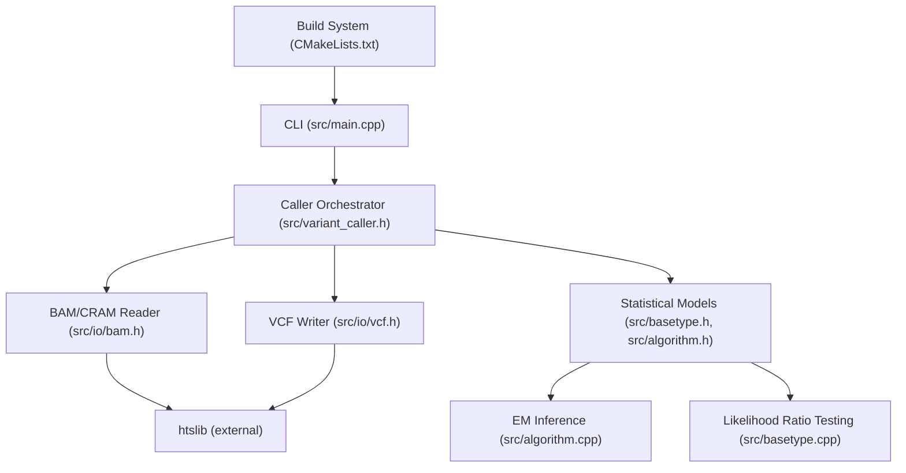
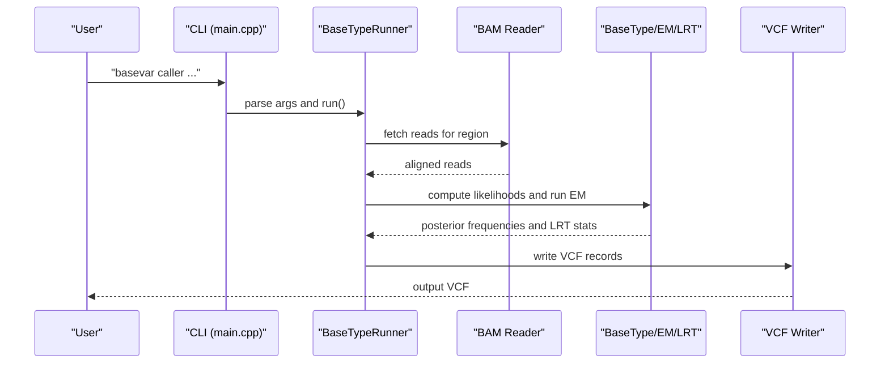
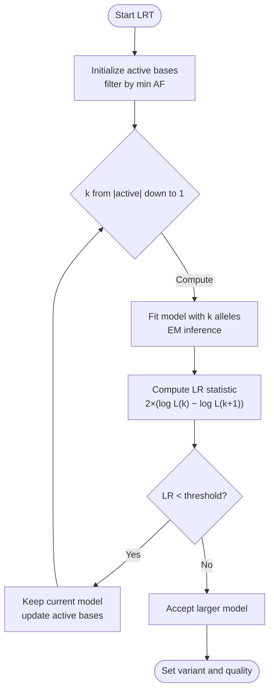
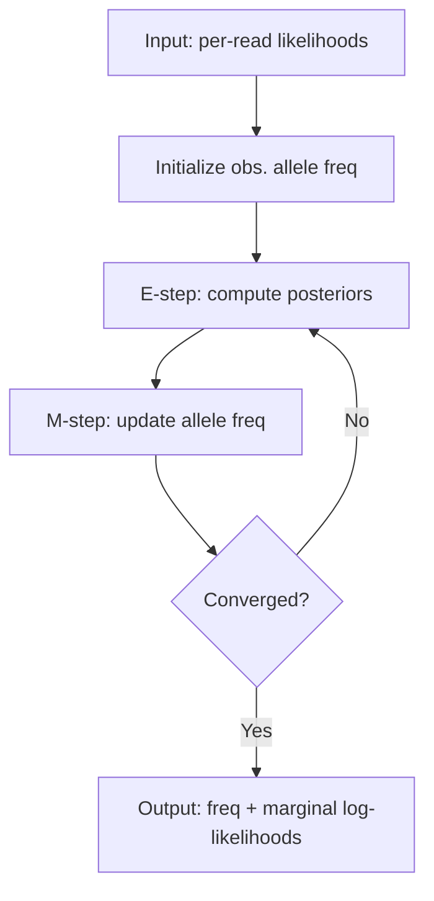
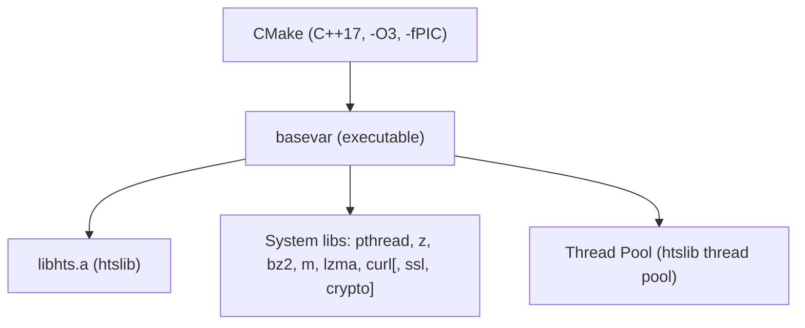

# Introduction and Purpose

<cite>
**Referenced Files in This Document**
- [README.md](file://README.md)
- [CMakeLists.txt](file://CMakeLists.txt)
- [src/main.cpp](file://src/main.cpp)
- [src/version.h](file://src/version.h)
- [src/variant_caller.h](file://src/variant_caller.h)
- [src/basetype.h](file://src/basetype.h)
- [src/basetype.cpp](file://src/basetype.cpp)
- [src/algorithm.h](file://src/algorithm.h)
- [src/algorithm.cpp](file://src/algorithm.cpp)
- [src/io/bam.h](file://src/io/bam.h)
- [src/io/vcf.h](file://src/io/vcf.h)
- [htslib/thread_pool.c](file://htslib/thread_pool.c)
</cite>

## Table of Contents
1. [Introduction](#introduction)
2. [Project Structure](#project-structure)
3. [Core Components](#core-components)
4. [Architecture Overview](#architecture-overview)
5. [Detailed Component Analysis](#detailed-component-analysis)
6. [Dependency Analysis](#dependency-analysis)
7. [Performance Considerations](#performance-considerations)
8. [Troubleshooting Guide](#troubleshooting-guide)
9. [Conclusion](#conclusion)

## Introduction
BaseVar2 is a specialized variant calling tool designed for ultra-low-depth whole genome sequencing data (sub-1x coverage), with primary application in non-invasive prenatal testing (NIPT). It leverages statistical models grounded in maximum likelihood estimation and likelihood ratio testing to detect polymorphic sites and estimate allele frequencies reliably from sparse, noisy signals. Compared to the original Python implementation, BaseVar2 is implemented in modern C++ and achieves over 10x speedup while dramatically reducing memory footprint—each thread consumes only a fraction of the memory required by the previous version.

This document introduces BaseVar2’s purpose, capabilities, and scientific foundations, and provides conceptual guidance for users working with ultra-low-depth datasets and NIPT applications.

## Project Structure
At a high level, BaseVar2 comprises:
- A command-line interface with subcommands for variant calling, concatenation, and subsampling
- A core variant caller orchestrating batch processing, parallelization, and I/O
- Mathematical modules implementing likelihood modeling, EM-based inference, and statistical tests
- I/O wrappers for BAM/CRAM and VCF/BCF leveraging htslib
- A build system ensuring reproducible compilation with optimized flags

**Diagram sources**
- [src/main.cpp:43-92](file://src/main.cpp#L43-L92)
- [src/variant_caller.h:41-174](file://src/variant_caller.h#L41-L174)
- [src/basetype.h:30-143](file://src/basetype.h#L30-L143)
- [src/algorithm.h:12-179](file://src/algorithm.h#L12-L179)
- [src/algorithm.cpp:239-292](file://src/algorithm.cpp#L239-L292)
- [src/io/bam.h:23-145](file://src/io/bam.h#L23-L145)
- [src/io/vcf.h:29-179](file://src/io/vcf.h#L29-L179)
- [CMakeLists.txt:32-61](file://CMakeLists.txt#L32-L61)

**Section sources**
- [README.md:1-181](file://README.md#L1-L181)
- [CMakeLists.txt:1-62](file://CMakeLists.txt#L1-L62)
- [src/main.cpp:1-93](file://src/main.cpp#L1-L93)

## Core Components
- CLI and orchestration: The main entry point routes to subcommands and manages timing and logging.
- Variant caller: Coordinates region partitioning, batch creation, parallel processing, and VCF output generation.
- Statistical model: Implements likelihood computation, EM-based allele frequency estimation, and likelihood ratio testing for polymorphism detection.
- I/O subsystem: Provides robust, efficient reading/writing of BAM/CRAM and VCF/BCF formats via htslib.

Key capabilities:
- Ultra-low-depth (<1x) variant detection and allele frequency estimation
- Population-aware grouping and regional calling
- Multi-threaded processing with configurable batch sizes
- Robust statistical inference using likelihood models

**Section sources**
- [src/main.cpp:17-30](file://src/main.cpp#L17-L30)
- [src/variant_caller.h:41-174](file://src/variant_caller.h#L41-L174)
- [src/basetype.h:30-143](file://src/basetype.h#L30-L143)
- [src/algorithm.h:12-179](file://src/algorithm.h#L12-L179)

## Architecture Overview
BaseVar2 follows a modular architecture:
- CLI parses user options and invokes the caller
- The caller partitions the genome into regions and batches, then dispatches units for parallel execution
- Each unit loads aligned reads, constructs likelihoods, performs EM inference, applies LRT, and writes VCF records
- I/O modules handle compressed formats and indices efficiently

**Diagram sources**
- [src/main.cpp:43-92](file://src/main.cpp#L43-L92)
- [src/variant_caller.h:120-136](file://src/variant_caller.h#L120-L136)
- [src/basetype.cpp:113-135](file://src/basetype.cpp#L113-L135)
- [src/algorithm.cpp:239-292](file://src/algorithm.cpp#L239-L292)
- [src/io/bam.h:125-135](file://src/io/bam.h#L125-L135)
- [src/io/vcf.h:136-161](file://src/io/vcf.h#L136-L161)

## Detailed Component Analysis

### Maximum Likelihood and Likelihood Ratio Foundations
BaseVar2 models each sequenced base as a categorical observation drawn from a multinomial distribution parameterized by unknown allele frequencies. The likelihood is computed per read, incorporating base quality into an error probability. A global EM procedure iteratively refines posterior allele frequencies and marginal likelihoods. Polymorphism detection proceeds via nested likelihood ratio tests comparing models with increasing numbers of alleles, selecting the simplest model that adequately explains the data.

**Diagram sources**
- [src/basetype.cpp:137-210](file://src/basetype.cpp#L137-L210)
- [src/algorithm.cpp:239-292](file://src/algorithm.cpp#L239-L292)
- [src/basetype.h:25-27](file://src/basetype.h#L25-L27)

**Section sources**
- [src/basetype.h:24-27](file://src/basetype.h#L24-L27)
- [src/basetype.cpp:113-135](file://src/basetype.cpp#L113-L135)
- [src/basetype.cpp:137-210](file://src/basetype.cpp#L137-L210)
- [src/algorithm.cpp:239-292](file://src/algorithm.cpp#L239-L292)

### EM Inference for Allele Frequency Estimation
The Expectation-Maximization (EM) algorithm alternates between computing posterior allele assignments (E-step) and updating global allele frequencies (M-step). Marginal likelihoods are tracked to monitor convergence. This iterative refinement stabilizes estimates in ultra-low-depth settings where counts are sparse.

**Diagram sources**
- [src/algorithm.cpp:194-237](file://src/algorithm.cpp#L194-L237)
- [src/algorithm.cpp:239-292](file://src/algorithm.cpp#L239-L292)

**Section sources**
- [src/algorithm.h:140-179](file://src/algorithm.h#L140-L179)
- [src/algorithm.cpp:194-237](file://src/algorithm.cpp#L194-L237)
- [src/algorithm.cpp:239-292](file://src/algorithm.cpp#L239-L292)

### Ultra-Low-Depth Challenges and NIPT Significance
Ultra-low-depth sequencing in NIPT arises from analyzing cell-free DNA (cfDNA) in maternal plasma, yielding highly fragmented, low-abundance fetal-derived sequences. Typical coverage is below 1x, introducing substantial noise and allelic imbalance. BaseVar2 addresses these challenges by:
- Modeling base qualities and sequencing errors explicitly
- Using EM to stabilize frequency estimates across sparse observations
- Employing likelihood ratio testing to select the minimal model explaining the data
- Supporting population-specific grouping to improve signal detection

These features enable reliable detection of fetal aneuploidies and population-scale polymorphism studies from NIPT data.

[No sources needed since this section provides conceptual context]

## Dependency Analysis
BaseVar2 relies on:
- htslib for efficient parsing of BAM/CRAM and VCF/BCF
- A thread pool abstraction for parallelism
- CMake for building with optimized flags

**Diagram sources**
- [CMakeLists.txt:32-61](file://CMakeLists.txt#L32-L61)
- [htslib/thread_pool.c:661-1514](file://htslib/thread_pool.c#L661-L1514)

**Section sources**
- [CMakeLists.txt:22-46](file://CMakeLists.txt#L22-L46)
- [htslib/thread_pool.c:661-1514](file://htslib/thread_pool.c#L661-L1514)

## Performance Considerations
- Speedup over Python: BaseVar2 achieves over 10x improvement by replacing Python loops with compiled C++ and optimizing I/O and math routines.
- Memory footprint: Reduced memory per thread compared to the Python version, enabling scalable processing on modest hardware.
- Build flags: CMake sets -O3 and -fPIC for performance and portability; platform-specific flags are applied conditionally.
- Parallelism: Multi-threaded execution with batched processing minimizes overhead and improves throughput.

Practical tips:
- Adjust batch size (-B) and thread count (-t) according to available RAM and CPU cores
- Use regional calling (-r) to reduce runtime for targeted analyses
- Prefer indexed BAM/CRAM and compressed VCF output for I/O efficiency

**Section sources**
- [README.md:9-11](file://README.md#L9-L11)
- [CMakeLists.txt:22-29](file://CMakeLists.txt#L22-L29)
- [README.md:109-144](file://README.md#L109-L144)

## Troubleshooting Guide
Common issues and resolutions:
- Installation failures: Ensure C++17 support and proper htslib configuration; the manual method documents required system libraries.
- Memory usage: Reduce batch size (-B) or thread count (-t) to fit available RAM.
- I/O errors: Verify BAM/CRAM and VCF indices exist; ensure file permissions and paths are correct.
- Unexpected runtime: Confirm reference FASTA and indexing are consistent with input data.

**Section sources**
- [README.md:19-107](file://README.md#L19-L107)
- [src/io/bam.h:101-101](file://src/io/bam.h#L101-L101)
- [src/io/vcf.h:116-116](file://src/io/vcf.h#L116-L116)

## Conclusion
BaseVar2 delivers a robust, high-performance solution for ultra-low-depth variant calling, especially suited to NIPT applications. By combining precise statistical modeling with efficient C++ implementation and parallel processing, it enables accurate polymorphism detection and allele frequency estimation from challenging, low-coverage datasets. Its modular design and strong I/O foundation make it suitable for both research-scale analyses and production pipelines.