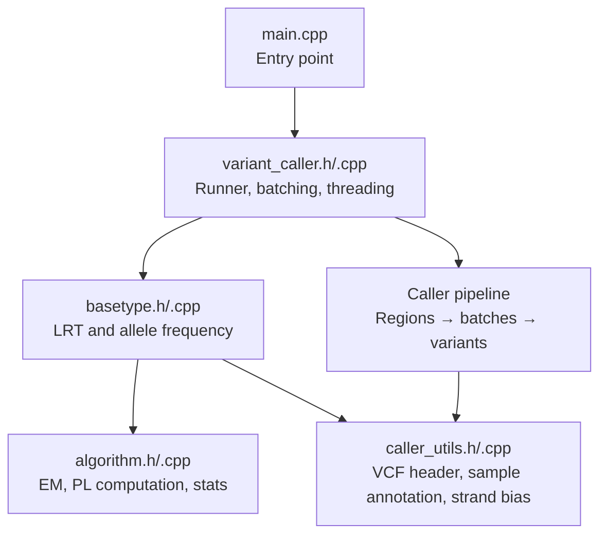
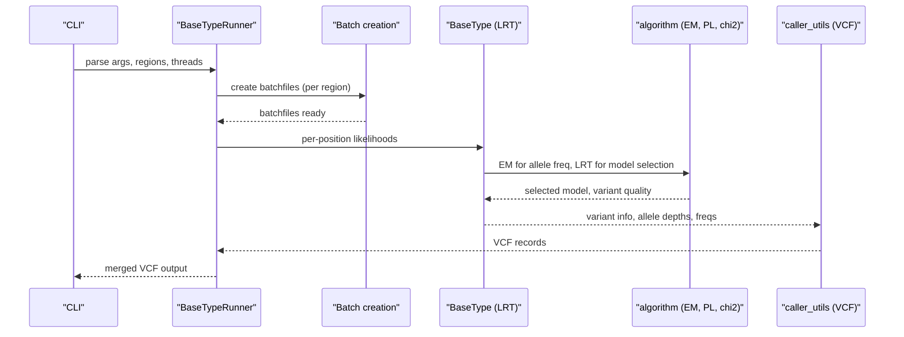
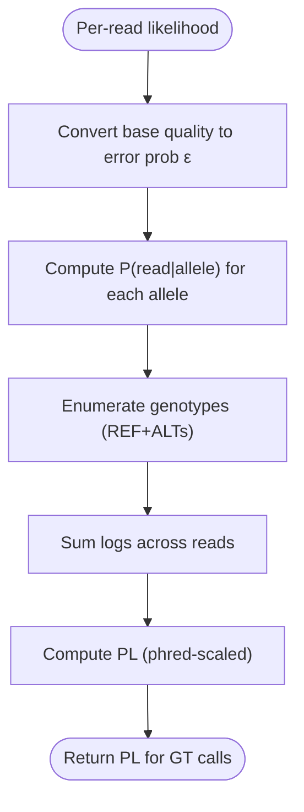
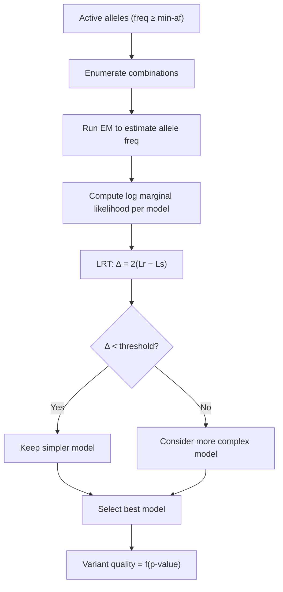
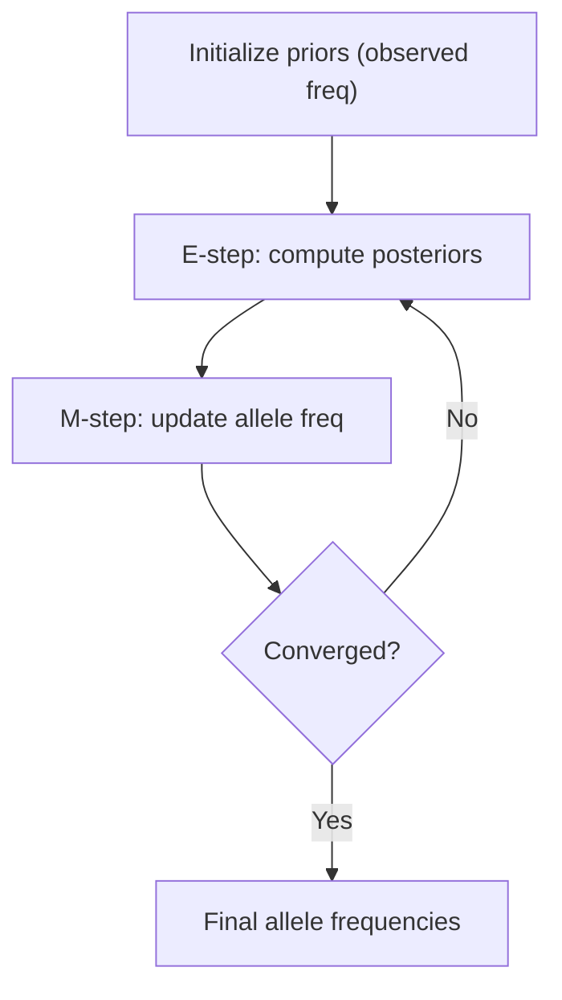
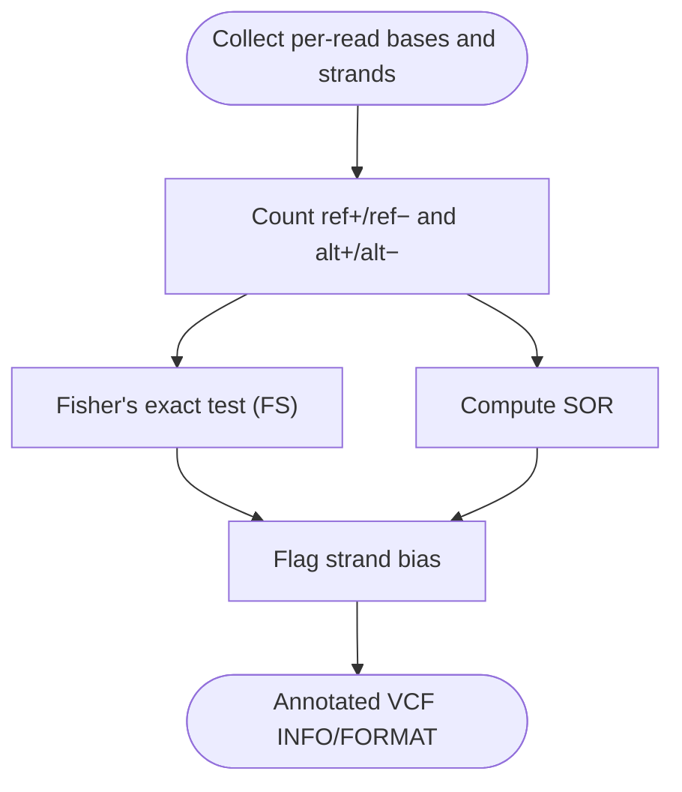

# Mathematical Foundations and Theory

<cite>
**Referenced Files in This Document**
- [README.md](file://README.md)
- [main.cpp](file://src/main.cpp)
- [variant_caller.h](file://src/variant_caller.h)
- [variant_caller.cpp](file://src/variant_caller.cpp)
- [basetype.h](file://src/basetype.h)
- [basetype.cpp](file://src/basetype.cpp)
- [algorithm.h](file://src/algorithm.h)
- [algorithm.cpp](file://src/algorithm.cpp)
- [caller_utils.h](file://src/caller_utils.h)
- [caller_utils.cpp](file://src/caller_utils.cpp)
</cite>

## Table of Contents
1. [Introduction](#introduction)
2. [Project Structure](#project-structure)
3. [Core Components](#core-components)
4. [Architecture Overview](#architecture-overview)
5. [Detailed Component Analysis](#detailed-component-analysis)
6. [Dependency Analysis](#dependency-analysis)
7. [Performance Considerations](#performance-considerations)
8. [Troubleshooting Guide](#troubleshooting-guide)
9. [Conclusion](#conclusion)

## Introduction
This document explains the mathematical foundations and theory behind BaseVar2’s statistical and computational methods for detecting variants from ultra-low-depth (<1x) whole-genome sequencing data. It focuses on:
- Maximum likelihood estimation for variant detection
- Likelihood ratio testing (LRT) framework for selecting the optimal model and computing variant quality
- Expectation-Maximization (EM) algorithm for allele frequency estimation
- Statistical corrections for rare variant detection and strand bias assessment
- Why traditional variant calling fails at sub-1x coverage and how BaseVar2 addresses these challenges

The comprehensive mathematical explanations are referenced from the documentation cited in the project README.

**Section sources**
- [README.md:1-181](file://README.md#L1-L181)

## Project Structure
BaseVar2 organizes its variant-calling pipeline into modular components:
- Entry point and command routing
- Batch data preparation and parallelization
- Variant discovery per genomic region
- Statistical modeling (LRT, EM, strand bias)
- VCF output generation and merging

**Diagram sources**
- [main.cpp:32-36](file://src/main.cpp#L32-L36)
- [variant_caller.h:41-174](file://src/variant_caller.h#L41-L174)
- [variant_caller.cpp:343-438](file://src/variant_caller.cpp#L343-L438)
- [basetype.h:30-143](file://src/basetype.h#L30-L143)
- [basetype.cpp:14-212](file://src/basetype.cpp#L14-L212)
- [algorithm.h:90-178](file://src/algorithm.h#L90-L178)
- [algorithm.cpp:12-293](file://src/algorithm.cpp#L12-L293)
- [caller_utils.h:29-229](file://src/caller_utils.h#L29-L229)
- [caller_utils.cpp:144-215](file://src/caller_utils.cpp#L144-L215)

**Section sources**
- [main.cpp:43-92](file://src/main.cpp#L43-L92)
- [variant_caller.h:41-174](file://src/variant_caller.h#L41-L174)
- [variant_caller.cpp:343-438](file://src/variant_caller.cpp#L343-L438)

## Core Components
- Maximum likelihood model for read support at each position
- Likelihood ratio test (LRT) to select the minimal sufficient model and compute variant quality
- Expectation-Maximization (EM) to estimate allele frequencies across samples
- Genotype likelihoods (PL) computation for downstream VCF fields
- Strand-bias metrics (Fisher’s exact test and Symmetric Odds Ratio) for filtering and annotation

These components are implemented across basetype, algorithm, and caller_utils modules.

**Section sources**
- [basetype.h:30-143](file://src/basetype.h#L30-L143)
- [basetype.cpp:14-212](file://src/basetype.cpp#L14-L212)
- [algorithm.h:90-178](file://src/algorithm.h#L90-L178)
- [algorithm.cpp:12-293](file://src/algorithm.cpp#L12-L293)
- [caller_utils.h:69-229](file://src/caller_utils.h#L69-L229)
- [caller_utils.cpp:144-215](file://src/caller_utils.cpp#L144-L215)

## Architecture Overview
The pipeline proceeds as follows:
- Parse command-line arguments and initialize reference, sample IDs, and calling intervals
- Create batchfiles containing per-position read information
- For each genomic region, parallelize processing across batches
- For each position, construct likelihoods, run LRT to choose the best model, and compute variant quality
- Estimate allele frequencies via EM and annotate VCF fields (PL, GT, GQ, AD, DP, FS, SOR)

**Diagram sources**
- [variant_caller.cpp:343-438](file://src/variant_caller.cpp#L343-L438)
- [basetype.cpp:137-210](file://src/basetype.cpp#L137-L210)
- [algorithm.cpp:239-293](file://src/algorithm.cpp#L239-L293)
- [caller_utils.cpp:144-215](file://src/caller_utils.cpp#L144-L215)

## Detailed Component Analysis

### Maximum Likelihood Estimation for Variant Detection
At each position, BaseVar2 builds a likelihood model for observed bases given a set of candidate alleles. The model converts per-read base qualities into error probabilities and computes the likelihood of observing each read base under each allele hypothesis.

Key steps:
- Compute error probability ε from per-base quality (phred-scale)
- For each read, assign likelihood 1−ε for correct allele and ε/(A−1) for incorrect alleles (A = number of unique alleles)
- Sum logs across reads to obtain log-likelihood for each genotype (homozygous and heterozygous combinations)
- Return PL values (phred-scaled differences from the best model)

**Diagram sources**
- [algorithm.cpp:12-88](file://src/algorithm.cpp#L12-L88)

**Section sources**
- [algorithm.cpp:12-88](file://src/algorithm.cpp#L12-L88)

### Likelihood Ratio Testing Framework
BaseVar2 selects the minimal sufficient model for each position using LRT. It:
- Starts with candidate alleles whose observed frequency exceeds a minimum minor allele frequency threshold
- Iteratively considers smaller sets of alleles and compares models using twice the difference in log marginal likelihoods
- Uses a chi-squared threshold to decide whether to retain a simpler model (null) or accept a more complex one (alternative)
- Computes variant quality as a function of the resulting p-value

**Diagram sources**
- [basetype.cpp:137-210](file://src/basetype.cpp#L137-L210)
- [basetype.h:25-27](file://src/basetype.h#L25-L27)
- [algorithm.cpp:239-293](file://src/algorithm.cpp#L239-L293)

**Section sources**
- [basetype.cpp:137-210](file://src/basetype.cpp#L137-L210)
- [basetype.h:25-27](file://src/basetype.h#L25-L27)

### Expectation-Maximization Algorithm for Allele Frequency Calculation
EM is used to estimate posterior allele frequencies across samples:
- E-step: compute joint likelihood for each sample and allele, multiply by current allele frequency prior, normalize to posterior
- M-step: re-estimate allele frequencies as the mean of posteriors across samples
- Repeat until convergence (difference in log marginal likelihood below threshold)

**Diagram sources**
- [algorithm.h:150-178](file://src/algorithm.h#L150-L178)
- [algorithm.cpp:194-293](file://src/algorithm.cpp#L194-L293)

**Section sources**
- [algorithm.h:150-178](file://src/algorithm.h#L150-L178)
- [algorithm.cpp:194-293](file://src/algorithm.cpp#L194-L293)

### Statistical Corrections for Rare Variant Detection and Strand Bias
- Minimum allele frequency threshold: positions with minor allele frequency below a dynamic threshold are skipped
- Strand bias detection: Fisher’s exact test (FS) and Symmetric Odds Ratio (SOR) are computed for each ALT allele to flag strand-specific artifacts
- VCF annotations include FS and SOR for filtering and downstream interpretation

**Diagram sources**
- [caller_utils.cpp:9-62](file://src/caller_utils.cpp#L9-L62)
- [caller_utils.h:69-113](file://src/caller_utils.h#L69-L113)

**Section sources**
- [caller_utils.cpp:9-62](file://src/caller_utils.cpp#L9-L62)
- [caller_utils.h:69-113](file://src/caller_utils.h#L69-L113)

### Handling Ultra-Low-Depth Sequencing Data
BaseVar2’s methodology is designed for sub-1x coverage where:
- Traditional pileup-based methods often fail due to sparse, noisy observations
- LRT selects the minimal sufficient model, avoiding overfitting
- EM stabilizes allele frequency estimates across samples
- PL-based GT calls and GQ reflect uncertainty in low coverage
- Strand bias metrics help filter false positives caused by systematic biases

References to comprehensive documentation are provided in the README.

**Section sources**
- [README.md:8-9](file://README.md#L8-L9)

## Dependency Analysis
The following diagram shows key module dependencies and their roles in the statistical pipeline.

**Diagram sources**
- [main.cpp:32-36](file://src/main.cpp#L32-L36)
- [variant_caller.h:41-174](file://src/variant_caller.h#L41-L174)
- [basetype.h:30-143](file://src/basetype.h#L30-L143)
- [algorithm.h:90-178](file://src/algorithm.h#L90-L178)
- [caller_utils.h:29-229](file://src/caller_utils.h#L29-L229)

**Section sources**
- [main.cpp:32-36](file://src/main.cpp#L32-L36)
- [variant_caller.h:41-174](file://src/variant_caller.h#L41-L174)
- [basetype.h:30-143](file://src/basetype.h#L30-L143)
- [algorithm.h:90-178](file://src/algorithm.h#L90-L178)
- [caller_utils.h:29-229](file://src/caller_utils.h#L29-L229)

## Performance Considerations
- Memory footprint is controlled by chunking genomic regions and limiting per-batch data sizes
- Parallelization is achieved via thread pools for batch creation and variant calling
- Numerical stability: log-space computations and careful handling of underflow in likelihood calculations
- Practical thresholds (e.g., LRT chi-squared threshold) balance sensitivity and specificity

[No sources needed since this section provides general guidance]

## Troubleshooting Guide
Common issues and remedies grounded in the code:
- Invalid arguments: ensure required inputs (reference FASTA, output VCF, alignment files) and valid ranges for min-BQ, min-MQ, batch count, and threads
- Empty regions or no data: verify calling intervals and that batchfiles were created successfully
- Strand bias artifacts: inspect FS and SOR annotations; consider filtering sites with excessive strand bias
- Convergence warnings in EM: increase iteration limit or adjust epsilon threshold if convergence is slow

**Section sources**
- [variant_caller.cpp:130-149](file://src/variant_caller.cpp#L130-L149)
- [variant_caller.cpp:563-628](file://src/variant_caller.cpp#L563-L628)
- [caller_utils.cpp:9-62](file://src/caller_utils.cpp#L9-L62)

## Conclusion
BaseVar2’s statistical framework combines maximum likelihood modeling, likelihood ratio testing, and EM-based allele frequency estimation to robustly detect variants in ultra-low-depth data. By selecting minimal sufficient models, applying strand bias corrections, and leveraging PL-based genotype calls, it improves reliability compared to traditional methods that struggle with sub-1x coverage. For deeper theoretical background, consult the documentation referenced in the README.

[No sources needed since this section summarizes without analyzing specific files]