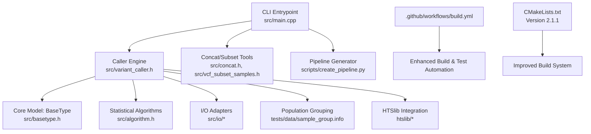
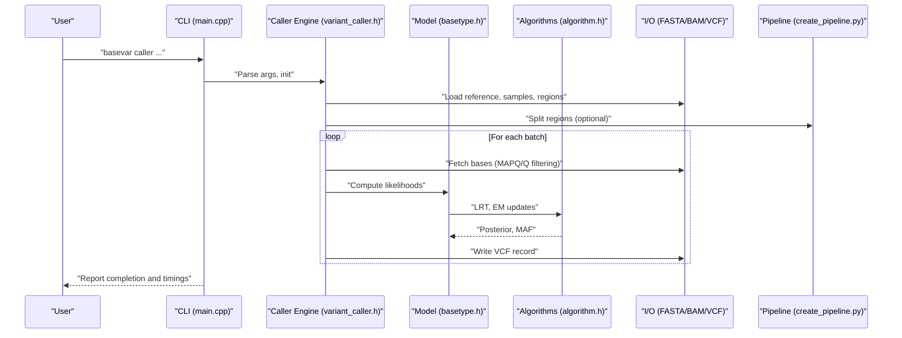
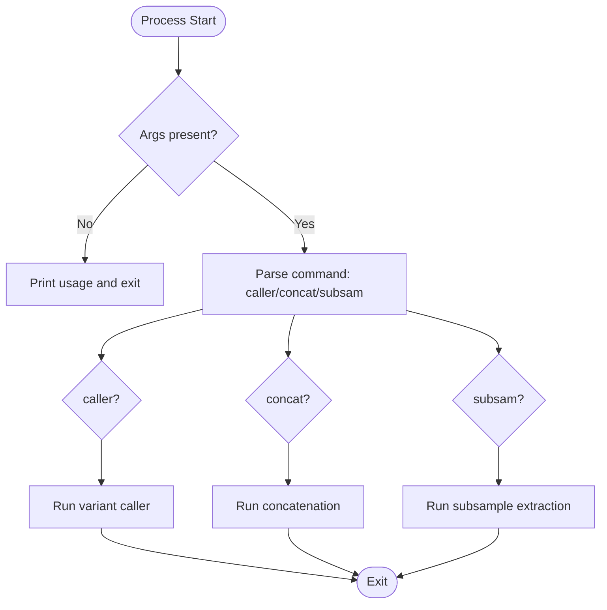
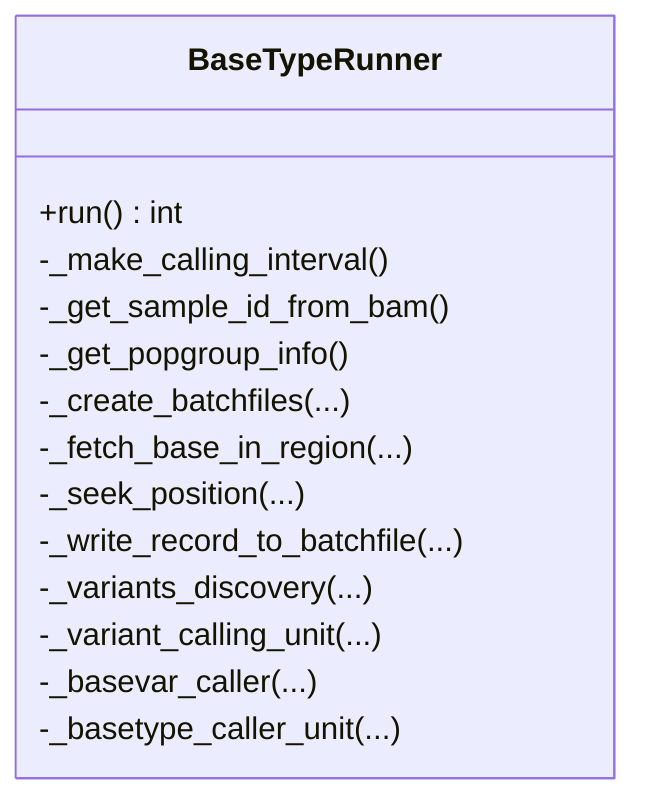
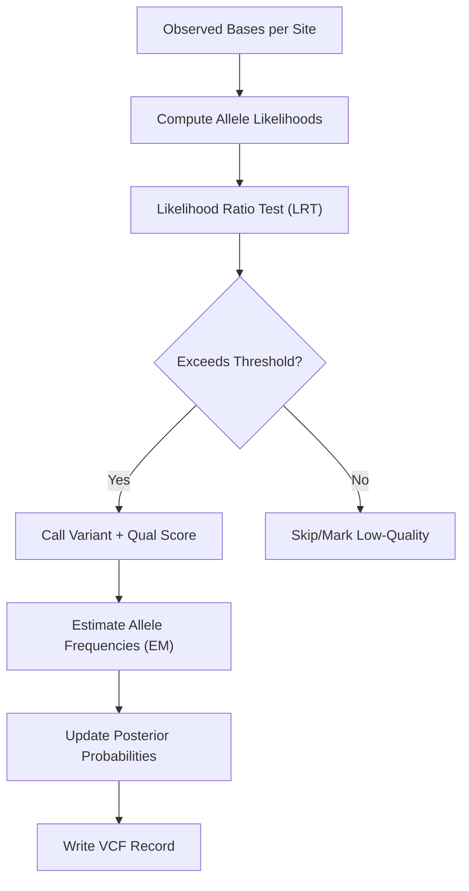
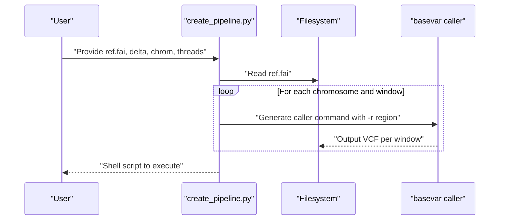
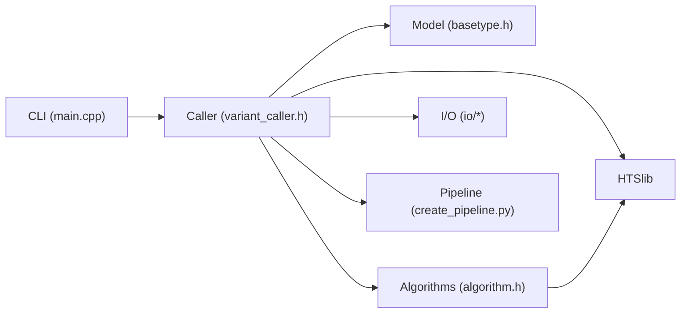

# Project Overview

<cite>
**Referenced Files in This Document**
- [README.md](file://README.md)
- [src/main.cpp](file://src/main.cpp)
- [src/version.h](file://src/version.h)
- [src/variant_caller.h](file://src/variant_caller.h)
- [src/basetype.h](file://src/basetype.h)
- [src/algorithm.h](file://src/algorithm.h)
- [scripts/create_pipeline.py](file://scripts/create_pipeline.py)
- [update_note.md](file://update_note.md)
- [.github/workflows/build.yml](file://.github/workflows/build.yml)
- [tests/data/sample_group.info](file://tests/data/sample_group.info)
- [CMakeLists.txt](file://CMakeLists.txt)
</cite>

## Update Summary
**Changes Made**
- Updated version information to reflect 2.1.1 release with improved build reliability
- Enhanced cross-platform compatibility documentation for static builds
- Added detailed build system improvements and platform-specific optimizations
- Updated installation instructions to reflect new static binary availability

## Table of Contents
1. [Introduction](#introduction)
2. [Project Structure](#project-structure)
3. [Core Components](#core-components)
4. [Architecture Overview](#architecture-overview)
5. [Detailed Component Analysis](#detailed-component-analysis)
6. [Dependency Analysis](#dependency-analysis)
7. [Performance Considerations](#performance-considerations)
8. [Troubleshooting Guide](#troubleshooting-guide)
9. [Conclusion](#conclusion)
10. [Appendices](#appendices)

## Introduction
BaseVar2 is a specialized ultra-low-depth whole genome sequencing (ULDS/WGS) variant caller designed for non-invasive prenatal testing (NIPT) and related human genetic research. The latest 2.1.1 release introduces significant improvements in build reliability and cross-platform compatibility, delivering enhanced performance and deployment flexibility. It targets single-nucleotide polymorphism (SNP) and insertion–deletion (Indel) detection from sub-single-read coverage data (<1x), enabling cost-effective, population-scale NIPT studies. The tool emphasizes:
- Accurate variant detection via likelihood-based inference
- Population-level allele frequency estimation from sparse coverage
- High-performance C++ implementation with substantial speed and memory improvements over the original Python version
- **New in 2.1.1**: Improved build system with enhanced cross-platform compatibility and static binary distribution

Key scientific and technical goals:
- Robust detection of rare variants in extremely shallow coverage
- Reliable estimation of minor allele frequencies (MAF) and genotype likelihoods
- Scalable, parallelized processing suitable for large cohorts and whole-genome analyses
- **Enhanced**: Zero-dependency static binaries for seamless deployment across diverse environments

Citation and publication details:
- Liu et al. (2024). Utilizing non-invasive prenatal test sequencing data for human genetic investigation. Cell Genomics 4(10), 100669. https://doi.org/10.1016/j.xgen.2024.100669

## Project Structure
High-level organization:
- CLI entrypoint and command routing
- Core variant caller engine and batching logic
- Mathematical/statistical modules for likelihoods, tests, and EM-based allele frequency updates
- I/O wrappers for FASTA, BAM/CRAM, and VCF
- Pipeline generation script for chromosome-wise or region-wise parallelization
- HTSlib integration for efficient NGS file parsing
- Build automation and CI workflows with enhanced cross-platform support

**Diagram sources**
- [src/main.cpp:1-93](file://src/main.cpp#L1-L93)
- [src/variant_caller.h:1-180](file://src/variant_caller.h#L1-L180)
- [src/basetype.h:1-146](file://src/basetype.h#L1-L146)
- [src/algorithm.h:1-180](file://src/algorithm.h#L1-L180)
- [scripts/create_pipeline.py:1-103](file://scripts/create_pipeline.py#L1-L103)
- [.github/workflows/build.yml:1-197](file://.github/workflows/build.yml#L1-L197)
- [CMakeLists.txt:1-171](file://CMakeLists.txt#L1-L171)

**Section sources**
- [README.md:1-403](file://README.md#L1-L403)
- [src/main.cpp:1-93](file://src/main.cpp#L1-L93)
- [scripts/create_pipeline.py:1-103](file://scripts/create_pipeline.py#L1-L103)
- [.github/workflows/build.yml:1-197](file://.github/workflows/build.yml#L1-L197)
- [CMakeLists.txt:1-171](file://CMakeLists.txt#L1-L171)

## Core Components
- CLI and Commands
  - Subcommands: caller, concat, subsam
  - Version and author metadata exposed at runtime
- Variant Caller Engine
  - Region-aware batching and parallelization
  - Sample grouping support for population-specific allele frequency calculations
  - Output VCF generation with standardized headers and fields
- Statistical Foundation
  - Likelihood ratio testing (LRT) thresholds and quality filters
  - Fisher's exact test and chi-squared-based tests for significance
  - Expectation–Maximization (EM) algorithm for allele frequency estimation
- I/O Layer
  - FASTA reference handling
  - BAM/CRAM alignment parsing and filtering by MAPQ/Quality
  - BGZF-compressed VCF writing and header management
- Pipeline Utilities
  - Automated chromosome-wise or region-wise job splitting
  - Optional population group file for stratified analyses

Practical examples (usage patterns):
- Single-sample or multi-sample ULDS calling with region selection and population grouping
- Batched processing via a sample list file
- Whole-genome parallelization using the pipeline generator

**Section sources**
- [src/main.cpp:17-30](file://src/main.cpp#L17-L30)
- [src/version.h:1-13](file://src/version.h#L1-L13)
- [src/variant_caller.h:41-174](file://src/variant_caller.h#L41-L174)
- [src/algorithm.h:90-178](file://src/algorithm.h#L90-L178)
- [scripts/create_pipeline.py:26-94](file://scripts/create_pipeline.py#L26-L94)
- [tests/data/sample_group.info:1-44](file://tests/data/sample_group.info#L1-L44)

## Architecture Overview
The system orchestrates a pipeline from input alignments to population-aware variant calls:
- Parse CLI and initialize caller parameters
- Load reference FASTA and optionally population groups
- Partition genome into regions and create batches
- For each batch:
  - Fetch aligned bases per sample and filter by quality/mapping criteria
  - Compute per-site likelihoods and perform LRT-based variant scoring
  - Estimate population-level allele frequencies via EM
  - Write VCF records with FORMAT and INFO fields
- Optionally concatenate outputs and subset samples post-run

**Diagram sources**
- [src/main.cpp:43-92](file://src/main.cpp#L43-L92)
- [src/variant_caller.h:120-137](file://src/variant_caller.h#L120-L137)
- [src/basetype.h:95-143](file://src/basetype.h#L95-L143)
- [src/algorithm.h:150-178](file://src/algorithm.h#L150-L178)
- [scripts/create_pipeline.py:75-94](file://scripts/create_pipeline.py#L75-L94)

## Detailed Component Analysis

### CLI and Command Routing
- Provides top-level command dispatch (caller, concat, subsam)
- Prints version and author metadata
- Captures start/end timestamps and CPU time for performance reporting

**Diagram sources**
- [src/main.cpp:43-92](file://src/main.cpp#L43-L92)

**Section sources**
- [src/main.cpp:17-30](file://src/main.cpp#L17-L30)
- [src/main.cpp:43-92](file://src/main.cpp#L43-L92)
- [src/version.h:1-13](file://src/version.h#L1-L13)

### Variant Calling Engine
- Loads calling intervals and sample IDs
- Supports population grouping for stratified MAF computation
- Implements batch creation and per-region processing
- Integrates quality filters (min MAPQ, min base quality) and region selection

**Diagram sources**
- [src/variant_caller.h:41-174](file://src/variant_caller.h#L41-L174)

**Section sources**
- [src/variant_caller.h:41-174](file://src/variant_caller.h#L41-L174)

### Mathematical Foundation and Model
- LRT-based variant scoring with predefined thresholds
- Quality-based conversion constants for Phred-scale to log-space
- Fisher's exact test and chi-squared tests for significance
- EM algorithm for iterative allele frequency updates across samples

**Diagram sources**
- [src/basetype.h:29-143](file://src/basetype.h#L29-L143)
- [src/algorithm.h:150-178](file://src/algorithm.h#L150-L178)

**Section sources**
- [src/basetype.h:25-28](file://src/basetype.h#L25-L28)
- [src/algorithm.h:100-138](file://src/algorithm.h#L100-L138)
- [src/algorithm.h:150-178](file://src/algorithm.h#L150-L178)

### Pipeline Generation and Parallelization
- Splits a reference FASTA index into fixed-size genomic windows
- Generates shell commands to run caller on each window in parallel
- Supports population grouping and region filtering

**Diagram sources**
- [scripts/create_pipeline.py:26-94](file://scripts/create_pipeline.py#L26-L94)

**Section sources**
- [scripts/create_pipeline.py:26-94](file://scripts/create_pipeline.py#L26-L94)

### Practical Examples and Target Use Cases
- NIPT cohort-wide SNP detection from ULDS data
- Population-level MAF estimation by grouping samples (e.g., regional or ethnic groups)
- Whole-genome analysis via automated chromosome-wise pipelines
- Downstream compatibility with tools expecting standard VCF FORMAT/INFO fields

Target scenarios:
- Large-scale maternal plasma ULDS studies requiring speed and memory efficiency
- Cost-effective screening protocols leveraging shallow coverage
- Research applications needing robust variant detection and frequency estimation

**Section sources**
- [README.md:13-403](file://README.md#L13-L403)
- [tests/data/sample_group.info:1-44](file://tests/data/sample_group.info#L1-L44)

## Dependency Analysis
Internal dependencies:
- CLI depends on caller engine and I/O modules
- Caller engine depends on model (BaseType), algorithms, and I/O adapters
- Algorithms module provides shared statistical primitives
- Pipeline script depends on CLI binary availability

External dependencies:
- HTSlib for NGS file parsing and compression
- Standard system libraries (pthread, zlib, bz2, lzma, curl, OpenSSL on non-macOS)

**Diagram sources**
- [src/main.cpp:12-16](file://src/main.cpp#L12-L16)
- [src/variant_caller.h:23-31](file://src/variant_caller.h#L23-L31)
- [src/algorithm.h:22](file://src/algorithm.h#L22)

**Section sources**
- [CMakeLists.txt:31-62](file://CMakeLists.txt#L31-L62)
- [.github/workflows/build.yml:29-40](file://.github/workflows/build.yml#L29-L40)

## Performance Considerations
- C++ implementation delivers >10x speedup versus the Python predecessor with significantly reduced memory footprint
- Per-thread memory consumption scales with batch size and region size; tuning batch count and threads improves throughput
- Quality filters (min MAPQ and base quality) reduce noise and improve accuracy without heavy computational overhead
- Parallelization via region-wise pipelines accelerates whole-genome analyses
- **Enhanced in 2.1.1**: Improved build system reduces compilation time and build failures across platforms

[No sources needed since this section provides general guidance]

## Troubleshooting Guide
Common issues and resolutions:
- Compilation failures due to missing system libraries (zlib, bz2, lzma, curl, OpenSSL on Linux)
  - Ensure all build dependencies are installed before configuring and building
- HTSlib submodule configuration errors
  - Re-run autotools and configure inside the htslib directory; warnings in tests are often benign
- Memory usage spikes
  - Reduce batch size or thread count; adjust batch count and region granularity
- Incorrect population grouping
  - Verify the population group file format matches sample IDs in BAM headers
- **New in 2.1.1**: Static binary compatibility issues
  - Use pre-built static binaries for zero-dependency deployment
  - Linux static binaries run on any modern distribution without runtime dependencies
  - macOS static binaries require macOS 12+ and have minimal system dependencies

**Section sources**
- [.github/workflows/build.yml:29-40](file://.github/workflows/build.yml#L29-L40)
- [README.md:57-84](file://README.md#L57-L84)
- [update_note.md:7-31](file://update_note.md#L7-L31)

## Conclusion
BaseVar2 advances the state-of-the-art for ULDS variant discovery by combining rigorous statistical modeling with high-performance C++ implementation. The 2.1.1 release introduces significant improvements in build reliability and cross-platform compatibility, making deployment more straightforward across diverse computing environments. Its focus on accurate variant detection and reliable allele frequency estimation from <1x data makes it especially suited for NIPT and population-scale studies. The modular architecture, robust I/O layer, and automated parallelization pipeline enable scalable, reproducible workflows from shallow coverage datasets.

[No sources needed since this section summarizes without analyzing specific files]

## Appendices

### Citation and Publication Details
- Liu et al. (2024). Utilizing non-invasive prenatal test sequencing data for human genetic investigation. Cell Genomics 4(10), 100669. https://doi.org/10.1016/j.xgen.2024.100669

**Section sources**
- [README.md:13-18](file://README.md#L13-L18)

### Ultra-Low-Depth Sequencing Challenges (Beginner-Friendly)
- Coverage limitations: Very low read depth increases uncertainty in genotyping and reduces power to detect rare variants
- Base quality and mapping quality filtering: Essential to mitigate sequencing errors and alignment artifacts
- Allele dropout and bias: Population-level statistics require careful modeling to avoid false positives
- Computational efficiency: Scalable algorithms and parallelization are critical for whole-genome analyses

[No sources needed since this section provides general guidance]

### Version 2.1.1 Build Improvements
**Enhanced Build System Features:**
- **Improved Cross-Platform Compatibility**: Enhanced static linking support for both Linux and macOS
- **Zero-Dependency Static Binaries**: Pre-built binaries available for immediate deployment
- **Streamlined Installation Process**: Simplified build process with better error handling
- **Enhanced CI/CD Pipeline**: More reliable automated testing and release process

**Static Binary Availability:**
- **Linux (x86_64)**: Fully static binary with zero runtime dependencies
- **macOS (arm64/Intel)**: Best-effort static binary with minimal system requirements

**Section sources**
- [README.md:19-43](file://README.md#L19-L43)
- [.github/workflows/build.yml:82-197](file://.github/workflows/build.yml#L82-L197)
- [CMakeLists.txt:46-63](file://CMakeLists.txt#L46-L63)