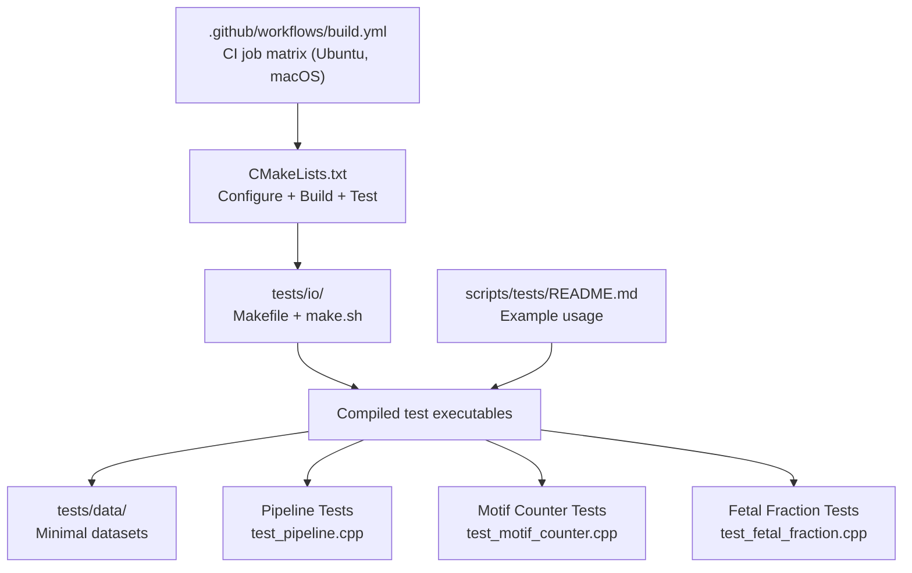
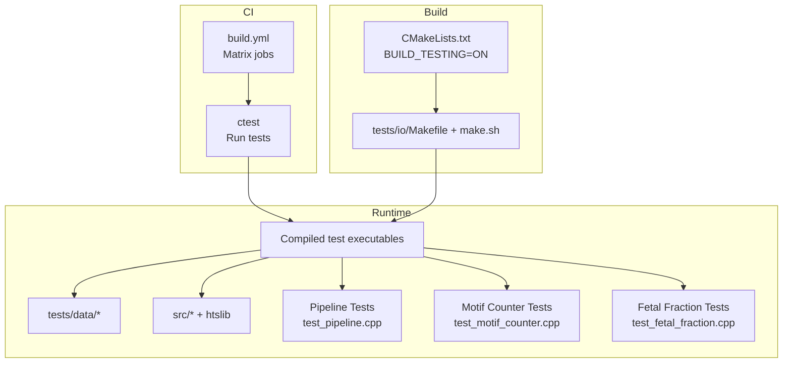
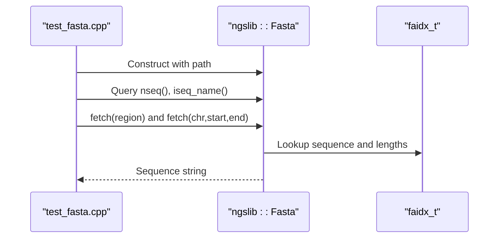
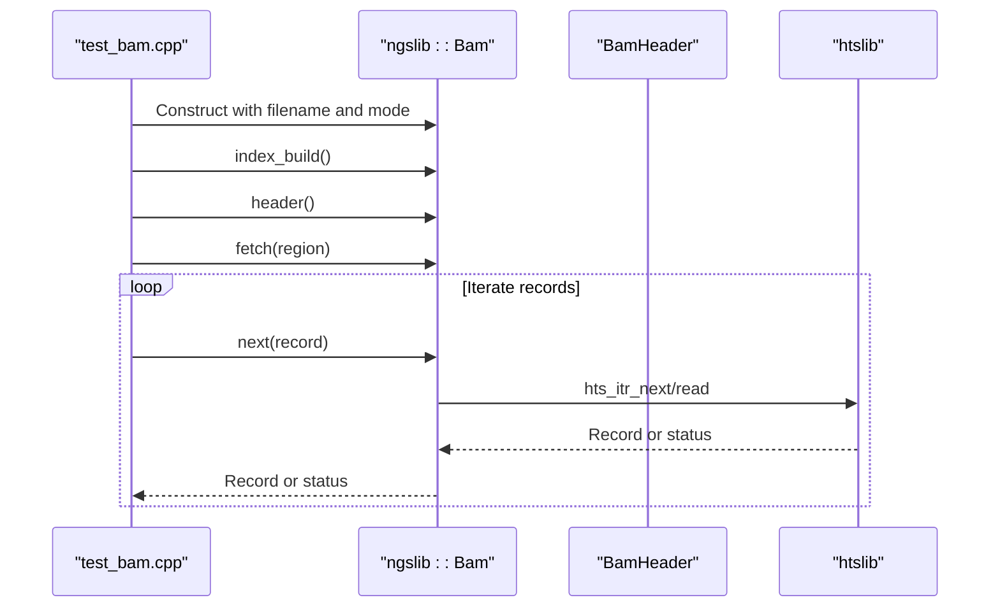
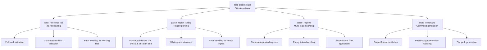
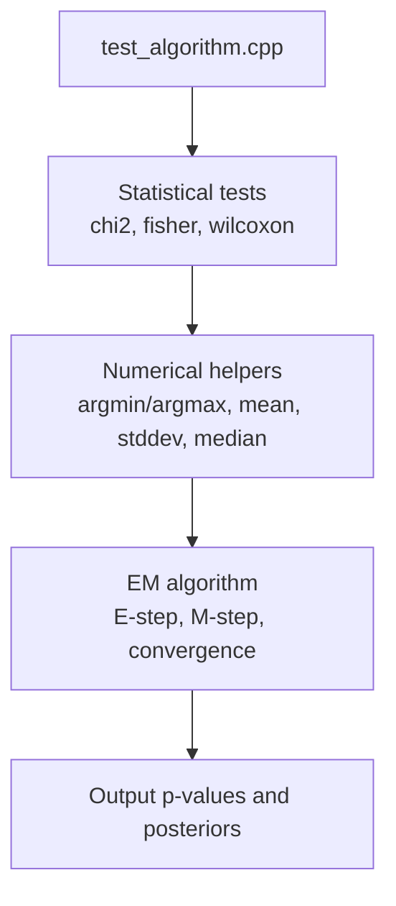
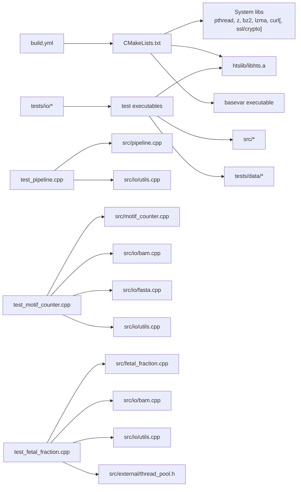

# Testing and Validation

<cite>
**Referenced Files in This Document**
- [.github/workflows/build.yml](file://.github/workflows/build.yml)
- [CMakeLists.txt](file://CMakeLists.txt)
- [tests/io/Makefile](file://tests/io/Makefile)
- [tests/io/make.sh](file://tests/io/make.sh)
- [tests/io/test_algorithm.cpp](file://tests/io/test_algorithm.cpp)
- [tests/io/test_bam.cpp](file://tests/io/test_bam.cpp)
- [tests/io/test_bamheader.cpp](file://tests/io/test_bamheader.cpp)
- [tests/io/test_bamrecord.cpp](file://tests/io/test_bamrecord.cpp)
- [tests/io/test_combinations.cpp](file://tests/io/test_combinations.cpp)
- [tests/io/test_fasta.cpp](file://tests/io/test_fasta.cpp)
- [tests/io/test_fetal_fraction.cpp](file://tests/io/test_fetal_fraction.cpp)
- [tests/io/test_fetal_fraction.bed](file://tests/io/test_fetal_fraction.bed)
- [tests/io/test_motif_counter.cpp](file://tests/io/test_motif_counter.cpp)
- [tests/io/test_pipeline.cpp](file://tests/io/test_pipeline.cpp)
- [tests/io/test_threadpool.cpp](file://tests/io/test_threadpool.cpp)
- [tests/io/test_utils.cpp](file://tests/io/test_utils.cpp)
- [tests/data/xx_minimal.sam](file://tests/data/xx_minimal.sam)
- [tests/data/tinyfasta.fa](file://tests/data/tinyfasta.fa)
- [tests/data/range.bam](file://tests/data/range.bam)
- [tests/data/ce.fa.gz](file://tests/data/ce.fa.gz)
- [scripts/tests/README.md](file://scripts/tests/README.md)
- [src/algorithm.h](file://src/algorithm.h)
- [src/io/bam.h](file://src/io/bam.h)
- [src/io/fasta.h](file://src/io/fasta.h)
- [src/io/utils.h](file://src/io/utils.h)
- [src/io/utils.cpp](file://src/io/utils.cpp)
- [src/motif_counter.h](file://src/motif_counter.h)
- [src/motif_counter.cpp](file://src/motif_counter.cpp)
- [src/pipeline.h](file://src/pipeline.h)
- [src/pipeline.cpp](file://src/pipeline.cpp)
- [src/fetal_fraction.h](file://src/fetal_fraction.h)
- [src/fetal_fraction.cpp](file://src/fetal_fraction.cpp)
- [src/main.cpp](file://src/main.cpp)
</cite>

## Update Summary
**Changes Made**
- Added comprehensive documentation for the new fetal fraction testing framework
- Updated Core Components section to include fetal fraction tests
- Enhanced Detailed Component Analysis with fetal fraction functionality coverage
- Added new Fetal Fraction Tests section documenting the 537-line test suite with 86 assertions covering BED parsing, interval indexing, geometric scaling computation, PAR handling, and end-to-end processing scenarios
- Updated Architecture Overview to include fetal fraction testing components
- Enhanced Dependency Analysis to cover fetal fraction test dependencies
- Added validation of 86 comprehensive assertions for fetal fraction estimation functionality

## Table of Contents
1. [Introduction](#introduction)
2. [Project Structure](#project-structure)
3. [Core Components](#core-components)
4. [Architecture Overview](#architecture-overview)
5. [Detailed Component Analysis](#detailed-component-analysis)
6. [Dependency Analysis](#dependency-analysis)
7. [Performance Considerations](#performance-considerations)
8. [Troubleshooting Guide](#troubleshooting-guide)
9. [Conclusion](#conclusion)
10. [Appendices](#appendices)

## Introduction
This document describes BaseVar2's testing framework and validation procedures. It covers unit test methodology, integration test procedures, performance benchmarking approaches, test data organization, test case design, validation criteria, automated testing workflows, continuous integration practices, and contributor guidelines for writing and running tests. It also addresses performance regression testing and validation of critical algorithms and data structures, including the newly added comprehensive C++ pipeline testing framework with 50+ assertions covering .fai file loading, region parsing, chromosome filtering, and command generation, the comprehensive motif subcommand testing framework with 57 unit tests, and the comprehensive fetal fraction testing framework with 537 lines of code and 86 assertions.

## Project Structure
BaseVar2 organizes tests under the tests directory with a dedicated subdirectory for I/O-focused unit/integration tests. The tests compile standalone executables that exercise core IO and algorithmic components, including the new pipeline testing framework, the comprehensive motif subcommand testing framework, and the comprehensive fetal fraction testing framework. Continuous integration is configured via GitHub Actions to build, test, and produce platform-specific artifacts.

**Diagram sources**
- [build.yml:11-52](file://.github/workflows/build.yml#L11-L52)
- [CMakeLists.txt:42-62](file://CMakeLists.txt#L42-L62)
- [tests/io/Makefile:1-71](file://tests/io/Makefile#L1-L71)
- [tests/io/make.sh:1-24](file://tests/io/make.sh#L1-L24)

**Section sources**
- [build.yml:1-78](file://.github/workflows/build.yml#L1-L78)
- [CMakeLists.txt:1-62](file://CMakeLists.txt#L1-L62)
- [tests/io/Makefile:1-71](file://tests/io/Makefile#L1-L71)
- [tests/io/make.sh:1-24](file://tests/io/make.sh#L1-L24)
- [scripts/tests/README.md:1-2](file://scripts/tests/README.md#L1-L2)

## Core Components
- Unit tests for IO components:
  - FASTA reader and indexing behavior
  - BAM/CRAM/SAM reader, header parsing, and region fetching
  - Utility functions for path manipulation, splitting/joining, duplication detection, and phred conversions
- Algorithm tests:
  - Statistical tests (Chi-square, Fisher's exact, Wilcoxon rank-sum)
  - Numerical helpers (argmin/argmax, mean, stddev, median)
  - EM algorithm for allele frequency estimation
- Pipeline tests (NEW):
  - Comprehensive .fai file loading with full load, chromosome filtering, and error handling
  - Region parsing validation for chr, chr:start, chr:start-end formats with whitespace tolerance
  - Multi-region parsing with empty token handling and chromosome filter application
  - Command generation validation matching Python script output format
- Motif counter tests (NEW):
  - **57 comprehensive unit tests** covering reverse-complement primitives, 5'-end motif extraction from BAM records, end-to-end runner functionality, multi-sample processing, filter options (--proper-pair, --max-insert-size), and reference-based motif extraction
  - Validation of motif extraction from both read sequences and reference genome
  - End-to-end testing with realistic BAM datasets and validation against reference implementations
  - Multi-threaded processing validation and deterministic output verification
- Fetal fraction tests (NEW):
  - **537-line comprehensive test suite** with **86 assertions** covering chromosome name helpers, BED interval indexing, geometric scaling computation, PAR handling, and end-to-end processing scenarios
  - Validation of chromosome name stripping, Y chromosome detection, autosome classification with ALT/decoy/HLA contig rejection
  - Comprehensive BED file parsing with track/browser header skipping, CRLF tolerance, and coordinate conversion from 0-based half-open to 1-based inclusive
  - PAR coordinate validation for hg38 and hg19 builds with built-in coordinate loading and custom PAR BED support
  - Geometric scaling factor computation from genome geometry and BED-derived mappability masks
  - End-to-end runner validation with C. elegans (no autosomes/chrY) and NA12878 chr22 datasets producing UNDETERMINED and FEMALE calls respectively
  - Female refusal logic validation and male FF calculation mathematics
- Integration-style tests:
  - End-to-end reading of minimal datasets and region queries
  - Thread pool and combination utilities

Validation criteria:
- Correctness of IO parsing and indexing
- Consistency of statistical computations
- Deterministic behavior of numerical routines
- Non-regression of performance-sensitive paths
- **NEW**: Comprehensive validation of pipeline functionality with 50+ assertions
- **NEW**: Extensive validation of motif extraction functionality with 57 unit tests
- **NEW**: Comprehensive validation of fetal fraction estimation functionality with 537 lines of code and 86 assertions

**Section sources**
- [tests/io/test_fasta.cpp:1-52](file://tests/io/test_fasta.cpp#L1-L52)
- [tests/io/test_bam.cpp:1-112](file://tests/io/test_bam.cpp#L1-L112)
- [tests/io/test_bamheader.cpp](file://tests/io/test_bamheader.cpp)
- [tests/io/test_bamrecord.cpp](file://tests/io/test_bamrecord.cpp)
- [tests/io/test_utils.cpp:1-115](file://tests/io/test_utils.cpp#L1-L115)
- [tests/io/test_algorithm.cpp:1-43](file://tests/io/test_algorithm.cpp#L1-L43)
- [tests/io/test_threadpool.cpp](file://tests/io/test_threadpool.cpp)
- [tests/io/test_combinations.cpp](file://tests/io/test_combinations.cpp)
- [tests/io/test_pipeline.cpp:1-248](file://tests/io/test_pipeline.cpp#L1-L248)
- [tests/io/test_motif_counter.cpp:1-530](file://tests/io/test_motif_counter.cpp#L1-L530)
- [tests/io/test_fetal_fraction.cpp:1-538](file://tests/io/test_fetal_fraction.cpp#L1-L538)
- [src/algorithm.h:1-180](file://src/algorithm.h#L1-L180)
- [src/io/bam.h:1-149](file://src/io/bam.h#L1-L149)
- [src/io/fasta.h:1-96](file://src/io/fasta.h#L1-L96)
- [src/io/utils.h:1-205](file://src/io/utils.h#L1-L205)
- [src/motif_counter.h:1-224](file://src/motif_counter.h#L1-L224)
- [src/fetal_fraction.h:1-306](file://src/fetal_fraction.h#L1-L306)

## Architecture Overview
The testing architecture comprises:
- CI-driven builds with CMake and ctest
- Per-test executables compiled from tests/io/*.cpp linked against src and htslib
- Minimal datasets under tests/data for deterministic IO validation
- **NEW**: Dedicated pipeline testing framework with comprehensive assertion coverage
- **NEW**: Comprehensive motif subcommand testing framework with 57 unit tests
- **NEW**: Comprehensive fetal fraction testing framework with 537 lines of code and 86 assertions
- Optional script-based post-processing examples

**Diagram sources**
- [build.yml:11-52](file://.github/workflows/build.yml#L11-L52)
- [CMakeLists.txt:42-62](file://CMakeLists.txt#L42-L62)
- [tests/io/Makefile:1-71](file://tests/io/Makefile#L1-L71)
- [tests/io/make.sh:1-24](file://tests/io/make.sh#L1-L24)

## Detailed Component Analysis

### FASTA Reader Tests
Purpose:
- Validate construction, assignment, and copy semantics
- Exercise sequence retrieval by region and by name
- Verify indexing and sequence length queries

Key validations:
- Multiple constructors and operators
- Region fetch semantics and bounds
- Existence checks and iteration over sequences

**Diagram sources**
- [tests/io/test_fasta.cpp:6-48](file://tests/io/test_fasta.cpp#L6-L48)
- [src/io/fasta.h:16-91](file://src/io/fasta.h#L16-L91)

**Section sources**
- [tests/io/test_fasta.cpp:1-52](file://tests/io/test_fasta.cpp#L1-L52)
- [src/io/fasta.h:1-96](file://src/io/fasta.h#L1-L96)

### BAM/CRAM/SAM Reader Tests
Purpose:
- Validate file opening modes and index building
- Exercise region-based fetching and streaming reads
- Demonstrate header access and status reporting

Key validations:
- Index generation and loading
- Region parsing and iteration
- Read status and end-of-stream handling

**Diagram sources**
- [tests/io/test_bam.cpp:26-109](file://tests/io/test_bam.cpp#L26-L109)
- [src/io/bam.h:23-145](file://src/io/bam.h#L23-L145)

**Section sources**
- [tests/io/test_bam.cpp:1-112](file://tests/io/test_bam.cpp#L1-L112)
- [src/io/bam.h:1-149](file://src/io/bam.h#L1-L149)

### Pipeline Tests (NEW)
Purpose:
- Comprehensive validation of the new C++ pipeline implementation
- Coverage of 50+ assertions for critical pipeline functionality
- Validation of .fai file loading, region parsing, chromosome filtering, and command generation

Key validation areas:
- **.fai file loading**: Full load functionality, chromosome filtering, and error handling for missing files
- **Region parsing**: Support for chr, chr:start, chr:start-end formats with whitespace tolerance
- **Multi-region parsing**: Handling of comma-separated regions, empty tokens, and chromosome filters
- **Command generation**: Output format validation matching Python script behavior

**Diagram sources**
- [tests/io/test_pipeline.cpp:85-247](file://tests/io/test_pipeline.cpp#L85-L247)
- [src/pipeline.h:29-91](file://src/pipeline.h#L29-L91)

**Section sources**
- [tests/io/test_pipeline.cpp:1-248](file://tests/io/test_pipeline.cpp#L1-L248)
- [src/pipeline.h:1-125](file://src/pipeline.h#L1-L125)
- [src/pipeline.cpp:1-476](file://src/pipeline.cpp#L1-L476)

### Motif Counter Tests (NEW)
Purpose:
- Comprehensive validation of the new motif subcommand functionality
- **57 unit tests** covering motif extraction primitives, end-to-end runs, and validation against reference implementations
- Coverage of reverse-complement operations, 5'-end motif extraction, filter options, and multi-sample processing

Key validation areas:
- **Reverse-complement primitives**: Testing individual base and string complement operations with edge cases
- **5'-end motif extraction**: Validating extraction from both forward and reverse-mapped reads using real BAM records
- **End-to-end runner tests**: Complete workflow validation with realistic BAM datasets and TSV output verification
- **Multi-sample processing**: Testing multi-threaded processing with multiple input files and distinct sample identification
- **Filter options**: Validation of --proper-pair and --max-insert-size filter functionality with specific read counts
- **Reference-based extraction**: Testing extraction from reference genome versus read sequences, with validation against canonical Lo lab method
- **Deterministic output**: Verification of consistent TSV formatting, count summation, and aggregate statistics

```mermaid
flowchart TD
A["test_motif_counter.cpp<br/>57 Unit Tests"] --> B["Reverse-complement tests<br/>Individual base + string operations"]
B --> B1["Base complement validation"]
B --> B2["String complement validation"]
A --> C["5'-end motif extraction<br/>From real BAM records"]
C --> C1["Forward-mapped read extraction"]
C --> C2["Reverse-mapped read extraction"]
A --> D["End-to-end runner tests<br/>Complete workflow validation"]
D --> D1["Single-sample TSV validation"]
D --> D2["Aggregate count verification"]
D --> D3["Sample ID resolution"]
A --> E["Multi-sample processing<br/>Multi-threaded + distinct samples"]
E --> E1["Two identical samples with different IDs"]
E --> E2["Per-sample count consistency"]
A --> F["Filter option validation<br/>--proper-pair + --max-insert-size"]
F --> F1["Proper pair filtering"]
F --> F2["Insert size cap filtering"]
A --> G["Reference-based extraction<br/>vs read-based extraction"]
G --> G1["Reference validation error handling"]
G --> G2["Canonical method compliance"]
G --> G3["Uppercase motif key validation"]
```

**Diagram sources**
- [tests/io/test_motif_counter.cpp:53-529](file://tests/io/test_motif_counter.cpp#L53-L529)
- [src/motif_counter.h:39-224](file://src/motif_counter.h#L39-L224)

**Section sources**
- [tests/io/test_motif_counter.cpp:1-530](file://tests/io/test_motif_counter.cpp#L1-L530)
- [src/motif_counter.h:1-224](file://src/motif_counter.h#L1-L224)
- [src/motif_counter.cpp:1-724](file://src/motif_counter.cpp#L1-L724)

### Fetal Fraction Tests (NEW)
Purpose:
- Comprehensive validation of the new hidden fetal fraction subcommand functionality
- **537-line test suite** with **86 assertions** covering chromosome name helpers, BED interval indexing, geometric scaling computation, PAR handling, and end-to-end processing scenarios
- Validation of chromosome classification, BED file parsing, PAR coordinate management, and complete runner functionality

Key validation areas:
- **Chromosome name helpers**: Testing strip_chr_prefix, is_y_chrom, and is_autosome functions with various naming conventions and edge cases
- **BedIntervalIndex**: Comprehensive validation of BED file loading, interval merging, contains queries, and total_length calculations with predicate functions
- **Built-in PAR coordinates**: Validation of hg38 and hg19 PAR boundary loading, coordinate conversion, and exclusion logic
- **Geometric scaling computation**: Testing automatic scaling factor calculation from genome geometry and BED-derived mappability masks
- **End-to-end runner tests**: Complete validation with C. elegans (no autosomes/chrY) producing UNDETERMINED calls and NA12878 chr22 dataset producing FEMALE calls
- **Female refusal logic**: Validation of mathematical calculations and threshold semantics for refusing female fetal fraction estimates

```mermaid
flowchart TD
A["test_fetal_fraction.cpp<br/>537 Lines, 86 Assertions"] --> B["Chromosome name helpers<br/>strip_chr_prefix, is_y_chrom, is_autosome"]
B --> B1["Naming convention validation"]
B --> B2["Edge case handling"]
A --> C["BedIntervalIndex<br/>BED parsing + interval management"]
C --> C1["BED file loading with track/browser headers"]
C --> C2["Coordinate conversion 0-based half-open -> 1-based inclusive"]
C --> C3["Interval merging and contains queries"]
C --> C4["Total length calculations with predicates"]
A --> D["PAR handling<br/>Built-in + custom PAR BED"]
D --> D1["hg38 PAR coordinates validation"]
D --> D2["hg19 PAR coordinates validation"]
D --> D3["Custom PAR BED loading"]
A --> E["Geometric scaling computation<br/>Auto-scale calculation"]
E --> E1["BED-derived scaling validation"]
E --> E2["Genome build scaling validation"]
E --> E3["Fallback scaling validation"]
A --> F["End-to-end runner tests<br/>Complete workflow validation"]
F --> F1["C. elegans dataset -> UNDETERMINED"]
F --> F2["NA12878 chr22 -> FEMALE"]
F --> F3["TSV output schema validation"]
A --> G["Female refusal logic<br/>Mathematical validation"]
G --> G1["Threshold semantics validation"]
G --> G2["Male FF calculation validation"]
```

**Diagram sources**
- [tests/io/test_fetal_fraction.cpp:63-538](file://tests/io/test_fetal_fraction.cpp#L63-L538)
- [src/fetal_fraction.h:75-306](file://src/fetal_fraction.h#L75-L306)

**Section sources**
- [tests/io/test_fetal_fraction.cpp:1-538](file://tests/io/test_fetal_fraction.cpp#L1-L538)
- [src/fetal_fraction.h:1-306](file://src/fetal_fraction.h#L1-L306)
- [src/fetal_fraction.cpp:1-1004](file://src/fetal_fraction.cpp#L1-L1004)

### Utility Functions Tests
Purpose:
- Validate string/path utilities, duplication detection, splitting/joining
- Exercise phred conversion and vector slicing
- Confirm safe directory creation/removal and last modification time

Key validations:
- Splitting/joining behavior across delimiters
- Path normalization and existence checks
- Vector slicing and transformation helpers

**Diagram sources**
- [tests/io/test_utils.cpp:12-114](file://tests/io/test_utils.cpp#L12-L114)

**Section sources**
- [tests/io/test_utils.cpp:1-115](file://tests/io/test_utils.cpp#L1-L115)

### Algorithm Tests
Purpose:
- Validate statistical tests and numerical helpers
- Demonstrate EM algorithm usage and convergence behavior

Key validations:
- Chi-square and Fisher's exact test outputs
- Wilcoxon rank-sum test
- argmin/argmax, mean, stddev, median
- EM algorithm updates and log marginal likelihood

**Diagram sources**
- [tests/io/test_algorithm.cpp:11-42](file://tests/io/test_algorithm.cpp#L11-L42)
- [src/algorithm.h:90-178](file://src/algorithm.h#L90-L178)

**Section sources**
- [tests/io/test_algorithm.cpp:1-43](file://tests/io/test_algorithm.cpp#L1-L43)
- [src/algorithm.h:1-180](file://src/algorithm.h#L1-L180)

### Thread Pool and Combinations Tests
Purpose:
- Validate thread pool behavior and workload distribution
- Validate combinatorial utilities

Key validations:
- Thread pool scheduling and completion
- Combination generation correctness

**Section sources**
- [tests/io/test_threadpool.cpp](file://tests/io/test_threadpool.cpp)
- [tests/io/test_combinations.cpp](file://tests/io/test_combinations.cpp)

## Dependency Analysis
- CI depends on CMake configuration enabling tests and invoking ctest
- Tests depend on src headers and htslib static archive
- **NEW**: Pipeline tests depend on src/pipeline.cpp and src/io/utils.cpp
- **NEW**: Motif counter tests depend on src/motif_counter.h/.cpp, src/io/bam.h/.cpp, src/io/bam_record.h/.cpp, src/io/bam_header.h/.cpp, src/io/fasta.h/.cpp, and src/io/utils.h/.cpp
- **NEW**: Fetal fraction tests depend on src/fetal_fraction.h/.cpp, src/io/bam.h/.cpp, src/io/bam_record.h/.cpp, src/io/bam_header.h/.cpp, src/io/utils.h/.cpp, and src/external/thread_pool.h
- Test executables link against system libraries (pthread, zlib, bz2, lzma, curl) and optionally OpenSSL on non-macOS platforms
- Minimal datasets under tests/data support deterministic IO validation
- **NEW**: Pipeline tests require C++17 standard and filesystem library support
- **NEW**: Motif counter tests require comprehensive BaseVar source tree linking and real BAM/FASTA test fixtures
- **NEW**: Fetal fraction tests require comprehensive BaseVar source tree linking, real BAM test fixtures, and BED file support

**Diagram sources**
- [build.yml:41-52](file://.github/workflows/build.yml#L41-L52)
- [CMakeLists.txt:42-62](file://CMakeLists.txt#L42-L62)

**Section sources**
- [build.yml:1-78](file://.github/workflows/build.yml#L1-L78)
- [CMakeLists.txt:1-62](file://CMakeLists.txt#L1-L62)

## Performance Considerations
- Compiler flags enable optimization and position-independent code
- Tests can be used to detect regressions by timing IO operations and algorithmic loops
- **NEW**: Pipeline tests can validate command generation performance and memory usage
- **NEW**: Motif counter tests can profile motif extraction performance and multi-threaded processing efficiency
- **NEW**: Fetal fraction tests can profile BED parsing performance, interval indexing operations, and geometric scaling computations
- Recommended approach:
  - Instrument test_bam.cpp and test_fasta.cpp to measure read/parse durations
  - **NEW**: Profile motif counter test execution for motif extraction and TSV writing performance
  - **NEW**: Profile fetal fraction test execution for BED parsing, interval merging, and scaling computation performance
  - Compare wall-clock times across commits using identical datasets
  - Track critical paths: index building, region fetching, sequence retrieval, command generation, motif extraction, multi-threaded processing, BED parsing, and geometric scaling computation
- For algorithmic performance:
  - Measure EM iterations and convergence thresholds
  - Benchmark statistical test functions with representative datasets
  - **NEW**: Profile motif counting algorithms, filter application performance, and chromosome classification operations

## Troubleshooting Guide
Common issues and resolutions:
- Missing htslib static library:
  - Ensure htslib is built and libhts.a exists before linking
  - Verify HTSSRC path in tests/io/Makefile or pass via environment
- Linker errors on macOS:
  - Confirm OpenSSL headers/libs are available; the build conditionally adds ssl/crypto on non-macOS
- Test failures due to dataset paths:
  - Use relative paths from the tests/io directory or adjust paths in test executables
- CI failures:
  - Review ctest output-on-failure logs
  - Validate dependency installation steps for Ubuntu/macOS runners
- **NEW**: Pipeline test failures:
  - Verify C++17 compiler support for filesystem library
  - Check .fai file format compliance with expected columns
  - Validate chromosome names match between .fai and region specifications
- **NEW**: Motif counter test failures:
  - Ensure test BAM files (range.bam) and FASTA files (ce.fa.gz) are present in tests/data/
  - Verify proper BAM index (.bai) files exist for multi-sample testing
  - Check that reference FASTA files are properly indexed with .fai files
  - Validate that test fixtures match expected read characteristics for filter validation
- **NEW**: Fetal fraction test failures:
  - Ensure test BED files (test_fetal_fraction.bed) are present in tests/io/
  - Verify proper BAM index (.bai) files exist for test datasets (range.bam)
  - Check that chromosome naming conventions match between BED files and BAM files
  - Validate that PAR coordinate files are properly formatted and accessible
  - Confirm that geometric scaling calculations match expected values for test datasets

**Section sources**
- [CMakeLists.txt:32-36](file://CMakeLists.txt#L32-L36)
- [tests/io/Makefile:6-14](file://tests/io/Makefile#L6-L14)
- [build.yml:29-40](file://.github/workflows/build.yml#L29-L40)

## Conclusion
BaseVar2's testing framework combines CI-driven compilation and execution with focused unit and integration tests. Tests validate IO correctness, algorithmic accuracy, and operational robustness, including the newly comprehensive pipeline testing framework with 50+ assertions, the comprehensive motif subcommand testing framework with 57 unit tests, and the comprehensive fetal fraction testing framework with 537 lines of code and 86 assertions. Contributors should add targeted tests alongside new features, use the provided Makefile and make.sh for local runs, and rely on CI for cross-platform verification. The pipeline tests provide extensive coverage of critical functionality with 50+ assertions ensuring reliability of the new C++ implementation, while the motif counter tests ensure comprehensive validation of cfDNA end-motif extraction functionality with 57 unit tests covering all aspects of the motif subcommand, and the fetal fraction tests ensure comprehensive validation of male fetal fraction estimation functionality with 537 lines of code and 86 assertions covering all aspects of the hidden fetal fraction subcommand.

## Appendices

### Automated Testing Workflows and CI Practices
- CI job matrix builds on Ubuntu and macOS
- Dependencies installed per OS
- CMake configured with BUILD_TESTING enabled
- ctest executed with output-on-failure
- Artifacts packaged and optionally released

**Section sources**
- [build.yml:1-78](file://.github/workflows/build.yml#L1-L78)

### Contributor Guidelines: Writing and Running Tests
- Add new tests under tests/io/ with descriptive names
- Use existing patterns from test_fasta.cpp, test_bam.cpp, test_utils.cpp, test_algorithm.cpp, test_pipeline.cpp, test_motif_counter.cpp, and **NEW**: test_fetal_fraction.cpp
- Keep test data small and deterministic; place under tests/data when appropriate
- Run locally via tests/io/make.sh or tests/io/Makefile
- Ensure dependencies are satisfied (htslib static archive, system libs, **NEW**: C++17 compiler for pipeline tests, **NEW**: comprehensive BaseVar source tree for motif and fetal fraction tests)
- Submit changes with passing CI
- **NEW**: For pipeline tests, ensure .fai file format compliance and chromosome name consistency
- **NEW**: For motif tests, ensure test fixtures (range.bam, ce.fa.gz) are available and properly indexed
- **NEW**: For fetal fraction tests, ensure test fixtures (range.bam, test_fetal_fraction.bed) are available and properly indexed

**Section sources**
- [tests/io/make.sh:1-24](file://tests/io/make.sh#L1-L24)
- [tests/io/Makefile:1-71](file://tests/io/Makefile#L1-L71)
- [tests/data/xx_minimal.sam](file://tests/data/xx_minimal.sam)
- [tests/data/tinyfasta.fa](file://tests/data/tinyfasta.fa)

### Test Data Organization
- Minimal FASTA and SAM files for IO validation
- Lists and info files for grouping and metadata scenarios
- **NEW**: Pipeline tests use temporary .fai files with controlled content for validation
- **NEW**: Motif counter tests use real BAM files (range.bam) and FASTA files (ce.fa.gz) for comprehensive validation
- **NEW**: Fetal fraction tests use real BAM files (range.bam), BED files (test_fetal_fraction.bed), and NA12878 chr22 datasets for comprehensive validation
- Use these fixtures to reproduce and verify behaviors deterministically

**Section sources**
- [tests/data/xx_minimal.sam](file://tests/data/xx_minimal.sam)
- [tests/data/tinyfasta.fa](file://tests/data/tinyfasta.fa)
- [tests/data/range.bam](file://tests/data/range.bam)
- [tests/data/ce.fa.gz](file://tests/data/ce.fa.gz)
- [tests/io/test_fetal_fraction.bed](file://tests/io/test_fetal_fraction.bed)

### Scripted Post-Processing Example
- scripts/tests/README.md demonstrates a command-line invocation pattern for downstream analysis

**Section sources**
- [scripts/tests/README.md:1-2](file://scripts/tests/README.md#L1-L2)

### Pipeline Testing Framework Details (NEW)
The pipeline testing framework provides comprehensive validation of the new C++ implementation:

**Core Testing Areas:**
- **.fai file loading**: Validates full file processing, chromosome filtering, and error handling
- **Region parsing**: Tests all supported region formats with comprehensive error validation
- **Multi-region processing**: Handles complex region strings with whitespace and filter application
- **Command generation**: Ensures output format compatibility with Python script

**Assertion Coverage:**
- 50+ assertions across all pipeline functionality
- Error condition validation for malformed inputs
- Boundary condition testing for edge cases
- Performance-oriented validation of critical paths

**Section sources**
- [tests/io/test_pipeline.cpp:1-248](file://tests/io/test_pipeline.cpp#L1-L248)
- [src/pipeline.h:1-125](file://src/pipeline.h#L1-L125)
- [src/pipeline.cpp:1-476](file://src/pipeline.cpp#L1-L476)

### Motif Counter Testing Framework Details (NEW)
The motif counter testing framework provides comprehensive validation of the new cfDNA end-motif extraction functionality:

**Core Testing Areas:**
- **Reverse-complement primitives**: Validates individual base and string complement operations with edge cases
- **5'-end motif extraction**: Tests extraction from both forward and reverse-mapped reads using real BAM records
- **End-to-end runner tests**: Complete workflow validation with realistic BAM datasets and TSV output verification
- **Multi-sample processing**: Tests multi-threaded processing with multiple input files and distinct sample identification
- **Filter options**: Validates --proper-pair and --max-insert-size filter functionality with specific read counts
- **Reference-based extraction**: Tests extraction from reference genome versus read sequences, with validation against canonical Lo lab method

**Assertion Coverage:**
- **57 comprehensive unit tests** across all motif counter functionality
- Error condition validation for malformed inputs and invalid configurations
- Boundary condition testing for edge cases and extreme values
- Performance-oriented validation of critical paths including multi-threaded processing
- Deterministic output validation for TSV formatting and count summation

**Section sources**
- [tests/io/test_motif_counter.cpp:1-530](file://tests/io/test_motif_counter.cpp#L1-L530)
- [src/motif_counter.h:1-224](file://src/motif_counter.h#L1-L224)
- [src/motif_counter.cpp:1-724](file://src/motif_counter.cpp#L1-L724)

### Fetal Fraction Testing Framework Details (NEW)
The fetal fraction testing framework provides comprehensive validation of the new hidden subcommand functionality:

**Core Testing Areas:**
- **Chromosome name helpers**: Validates chromosome name stripping, Y chromosome detection, and autosome classification with ALT/decoy/HLA contig rejection
- **BedIntervalIndex**: Comprehensive validation of BED file parsing, interval merging, contains queries, and total_length calculations with predicate functions
- **Built-in PAR coordinates**: Validates hg38 and hg19 PAR boundary loading, coordinate conversion, and exclusion logic
- **Geometric scaling computation**: Tests automatic scaling factor calculation from genome geometry and BED-derived mappability masks
- **End-to-end runner tests**: Complete validation with C. elegans (no autosomes/chrY) producing UNDETERMINED calls and NA12878 chr22 dataset producing FEMALE calls
- **Female refusal logic**: Validates mathematical calculations and threshold semantics for refusing female fetal fraction estimates

**Assertion Coverage:**
- **537-line test suite** with **86 comprehensive assertions** across all fetal fraction functionality
- Error condition validation for malformed inputs and invalid configurations
- Boundary condition testing for edge cases and extreme values
- Performance-oriented validation of critical paths including BED parsing, interval merging, and scaling computation
- Deterministic output validation for TSV formatting and mathematical calculations

**Section sources**
- [tests/io/test_fetal_fraction.cpp:1-538](file://tests/io/test_fetal_fraction.cpp#L1-L538)
- [src/fetal_fraction.h:1-306](file://src/fetal_fraction.h#L1-L306)
- [src/fetal_fraction.cpp:1-1004](file://src/fetal_fraction.cpp#L1-L1004)