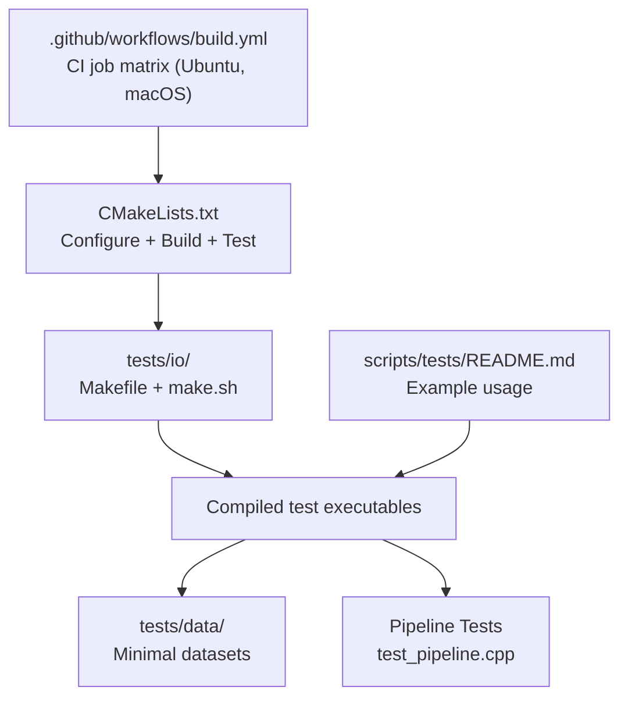
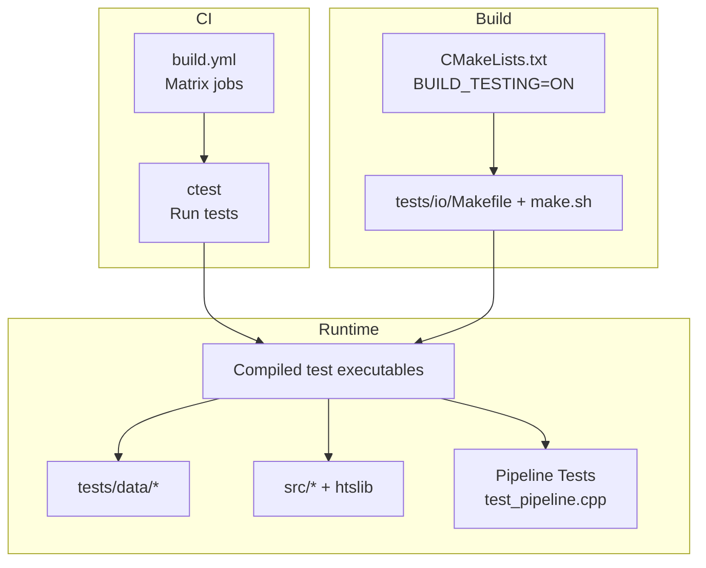
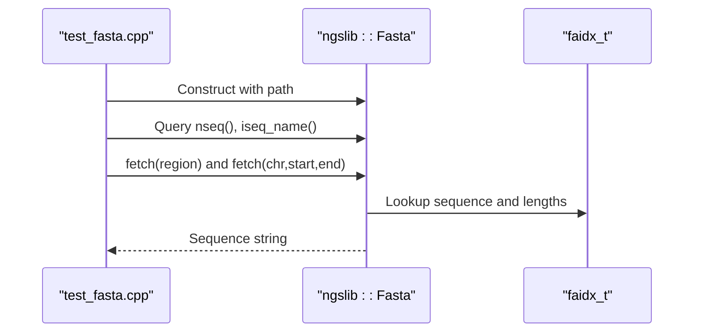
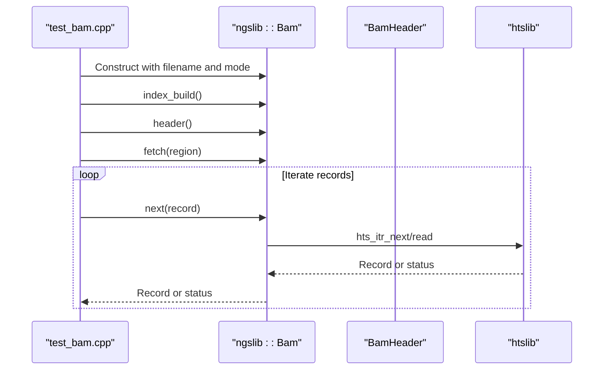
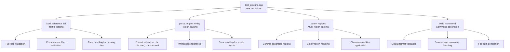
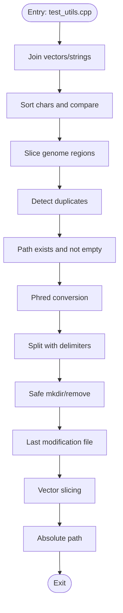
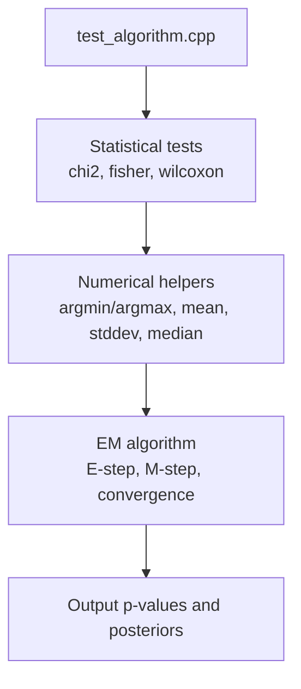
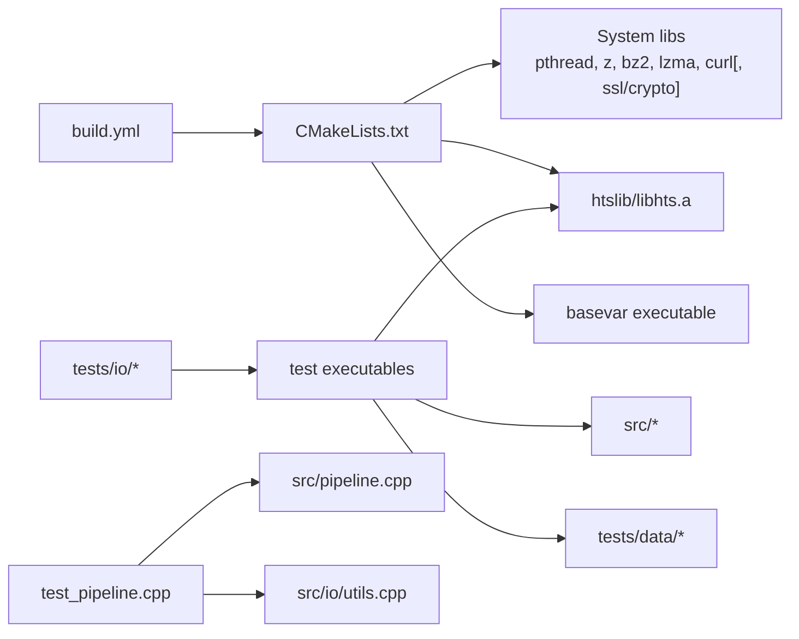

# Testing and Validation

<cite>
**Referenced Files in This Document**
- [.github/workflows/build.yml](file://.github/workflows/build.yml)
- [CMakeLists.txt](file://CMakeLists.txt)
- [tests/io/Makefile](file://tests/io/Makefile)
- [tests/io/make.sh](file://tests/io/make.sh)
- [tests/io/test_algorithm.cpp](file://tests/io/test_algorithm.cpp)
- [tests/io/test_bam.cpp](file://tests/io/test_bam.cpp)
- [tests/io/test_bamheader.cpp](file://tests/io/test_bamheader.cpp)
- [tests/io/test_bamrecord.cpp](file://tests/io/test_bamrecord.cpp)
- [tests/io/test_combinations.cpp](file://tests/io/test_combinations.cpp)
- [tests/io/test_fasta.cpp](file://tests/io/test_fasta.cpp)
- [tests/io/test_pipeline.cpp](file://tests/io/test_pipeline.cpp)
- [tests/io/test_threadpool.cpp](file://tests/io/test_threadpool.cpp)
- [tests/io/test_utils.cpp](file://tests/io/test_utils.cpp)
- [tests/data/xx_minimal.sam](file://tests/data/xx_minimal.sam)
- [tests/data/tinyfasta.fa](file://tests/data/tinyfasta.fa)
- [scripts/tests/README.md](file://scripts/tests/README.md)
- [src/algorithm.h](file://src/algorithm.h)
- [src/io/bam.h](file://src/io/bam.h)
- [src/io/fasta.h](file://src/io/fasta.h)
- [src/io/utils.h](file://src/io/utils.h)
- [src/io/utils.cpp](file://src/io/utils.cpp)
- [src/pipeline.h](file://src/pipeline.h)
- [src/pipeline.cpp](file://src/pipeline.cpp)
- [src/main.cpp](file://src/main.cpp)
</cite>

## Update Summary
**Changes Made**
- Added comprehensive documentation for the new C++ pipeline testing framework
- Updated Core Components section to include pipeline-specific tests
- Enhanced Detailed Component Analysis with pipeline functionality coverage
- Added new Pipeline Tests section documenting 50+ assertions for critical functionality
- Updated Architecture Overview to include pipeline testing components
- Enhanced Dependency Analysis to cover pipeline test dependencies

## Table of Contents
1. [Introduction](#introduction)
2. [Project Structure](#project-structure)
3. [Core Components](#core-components)
4. [Architecture Overview](#architecture-overview)
5. [Detailed Component Analysis](#detailed-component-analysis)
6. [Dependency Analysis](#dependency-analysis)
7. [Performance Considerations](#performance-considerations)
8. [Troubleshooting Guide](#troubleshooting-guide)
9. [Conclusion](#conclusion)
10. [Appendices](#appendices)

## Introduction
This document describes BaseVar2's testing framework and validation procedures. It covers unit test methodology, integration test procedures, performance benchmarking approaches, test data organization, test case design, validation criteria, automated testing workflows, continuous integration practices, and contributor guidelines for writing and running tests. It also addresses performance regression testing and validation of critical algorithms and data structures, including the newly added comprehensive C++ pipeline testing framework with 50+ assertions covering .fai file loading, region parsing, chromosome filtering, and command generation.

## Project Structure
BaseVar2 organizes tests under the tests directory with a dedicated subdirectory for I/O-focused unit/integration tests. The tests compile standalone executables that exercise core IO and algorithmic components, including the new pipeline testing framework. Continuous integration is configured via GitHub Actions to build, test, and produce platform-specific artifacts.

**Diagram sources**
- [build.yml:11-52](file://.github/workflows/build.yml#L11-L52)
- [CMakeLists.txt:42-62](file://CMakeLists.txt#L42-L62)
- [tests/io/Makefile:1-54](file://tests/io/Makefile#L1-L54)
- [tests/io/make.sh:1-24](file://tests/io/make.sh#L1-L24)

**Section sources**
- [build.yml:1-78](file://.github/workflows/build.yml#L1-L78)
- [CMakeLists.txt:1-62](file://CMakeLists.txt#L1-L62)
- [tests/io/Makefile:1-54](file://tests/io/Makefile#L1-L54)
- [tests/io/make.sh:1-24](file://tests/io/make.sh#L1-L24)
- [scripts/tests/README.md:1-2](file://scripts/tests/README.md#L1-L2)

## Core Components
- Unit tests for IO components:
  - FASTA reader and indexing behavior
  - BAM/CRAM/SAM reader, header parsing, and region fetching
  - Utility functions for path manipulation, splitting/joining, duplication detection, and phred conversions
- Algorithm tests:
  - Statistical tests (Chi-square, Fisher's exact, Wilcoxon rank-sum)
  - Numerical helpers (argmin/argmax, mean, stddev, median)
  - EM algorithm for allele frequency estimation
- Pipeline tests (NEW):
  - Comprehensive .fai file loading with full load, chromosome filtering, and error handling
  - Region parsing validation for chr, chr:start, chr:start-end formats with whitespace tolerance
  - Multi-region parsing with empty token handling and chromosome filter application
  - Command generation validation matching Python script output format
- Integration-style tests:
  - End-to-end reading of minimal datasets and region queries
  - Thread pool and combination utilities

Validation criteria:
- Correctness of IO parsing and indexing
- Consistency of statistical computations
- Deterministic behavior of numerical routines
- Non-regression of performance-sensitive paths
- **NEW**: Comprehensive validation of pipeline functionality with 50+ assertions

**Section sources**
- [tests/io/test_fasta.cpp:1-52](file://tests/io/test_fasta.cpp#L1-L52)
- [tests/io/test_bam.cpp:1-112](file://tests/io/test_bam.cpp#L1-L112)
- [tests/io/test_bamheader.cpp](file://tests/io/test_bamheader.cpp)
- [tests/io/test_bamrecord.cpp](file://tests/io/test_bamrecord.cpp)
- [tests/io/test_utils.cpp:1-115](file://tests/io/test_utils.cpp#L1-L115)
- [tests/io/test_algorithm.cpp:1-43](file://tests/io/test_algorithm.cpp#L1-L43)
- [tests/io/test_threadpool.cpp](file://tests/io/test_threadpool.cpp)
- [tests/io/test_combinations.cpp](file://tests/io/test_combinations.cpp)
- [tests/io/test_pipeline.cpp:1-248](file://tests/io/test_pipeline.cpp#L1-L248)
- [src/algorithm.h:1-180](file://src/algorithm.h#L1-L180)
- [src/io/bam.h:1-149](file://src/io/bam.h#L1-L149)
- [src/io/fasta.h:1-96](file://src/io/fasta.h#L1-L96)
- [src/io/utils.h:1-205](file://src/io/utils.h#L1-L205)

## Architecture Overview
The testing architecture comprises:
- CI-driven builds with CMake and ctest
- Per-test executables compiled from tests/io/*.cpp linked against src and htslib
- Minimal datasets under tests/data for deterministic IO validation
- **NEW**: Dedicated pipeline testing framework with comprehensive assertion coverage
- Optional script-based post-processing examples

**Diagram sources**
- [build.yml:11-52](file://.github/workflows/build.yml#L11-L52)
- [CMakeLists.txt:42-62](file://CMakeLists.txt#L42-L62)
- [tests/io/Makefile:1-54](file://tests/io/Makefile#L1-L54)
- [tests/io/make.sh:1-24](file://tests/io/make.sh#L1-L24)

## Detailed Component Analysis

### FASTA Reader Tests
Purpose:
- Validate construction, assignment, and copy semantics
- Exercise sequence retrieval by region and by name
- Verify indexing and sequence length queries

Key validations:
- Multiple constructors and operators
- Region fetch semantics and bounds
- Existence checks and iteration over sequences

**Diagram sources**
- [tests/io/test_fasta.cpp:6-48](file://tests/io/test_fasta.cpp#L6-L48)
- [src/io/fasta.h:16-91](file://src/io/fasta.h#L16-L91)

**Section sources**
- [tests/io/test_fasta.cpp:1-52](file://tests/io/test_fasta.cpp#L1-L52)
- [src/io/fasta.h:1-96](file://src/io/fasta.h#L1-L96)

### BAM/CRAM/SAM Reader Tests
Purpose:
- Validate file opening modes and index building
- Exercise region-based fetching and streaming reads
- Demonstrate header access and status reporting

Key validations:
- Index generation and loading
- Region parsing and iteration
- Read status and end-of-stream handling

**Diagram sources**
- [tests/io/test_bam.cpp:26-109](file://tests/io/test_bam.cpp#L26-L109)
- [src/io/bam.h:23-145](file://src/io/bam.h#L23-L145)

**Section sources**
- [tests/io/test_bam.cpp:1-112](file://tests/io/test_bam.cpp#L1-L112)
- [src/io/bam.h:1-149](file://src/io/bam.h#L1-L149)

### Pipeline Tests (NEW)
Purpose:
- Comprehensive validation of the new C++ pipeline implementation
- Coverage of 50+ assertions for critical pipeline functionality
- Validation of .fai file loading, region parsing, chromosome filtering, and command generation

Key validation areas:
- **.fai file loading**: Full load functionality, chromosome filtering, and error handling for missing files
- **Region parsing**: Support for chr, chr:start, chr:start-end formats with whitespace tolerance
- **Multi-region parsing**: Handling of comma-separated regions, empty tokens, and chromosome filters
- **Command generation**: Output format validation matching Python script behavior

**Diagram sources**
- [tests/io/test_pipeline.cpp:85-247](file://tests/io/test_pipeline.cpp#L85-L247)
- [src/pipeline.h:29-91](file://src/pipeline.h#L29-L91)

**Section sources**
- [tests/io/test_pipeline.cpp:1-248](file://tests/io/test_pipeline.cpp#L1-L248)
- [src/pipeline.h:1-125](file://src/pipeline.h#L1-L125)
- [src/pipeline.cpp:1-476](file://src/pipeline.cpp#L1-L476)

### Utility Functions Tests
Purpose:
- Validate string/path utilities, duplication detection, splitting/joining
- Exercise phred conversion and vector slicing
- Confirm safe directory creation/removal and last modification time

Key validations:
- Splitting/joining behavior across delimiters
- Path normalization and existence checks
- Vector slicing and transformation helpers

**Diagram sources**
- [tests/io/test_utils.cpp:12-114](file://tests/io/test_utils.cpp#L12-L114)

**Section sources**
- [tests/io/test_utils.cpp:1-115](file://tests/io/test_utils.cpp#L1-L115)

### Algorithm Tests
Purpose:
- Validate statistical tests and numerical helpers
- Demonstrate EM algorithm usage and convergence behavior

Key validations:
- Chi-square and Fisher's exact test outputs
- Wilcoxon rank-sum test
- argmin/argmax, mean, stddev, median
- EM algorithm updates and log marginal likelihood

**Diagram sources**
- [tests/io/test_algorithm.cpp:11-42](file://tests/io/test_algorithm.cpp#L11-L42)
- [src/algorithm.h:90-178](file://src/algorithm.h#L90-L178)

**Section sources**
- [tests/io/test_algorithm.cpp:1-43](file://tests/io/test_algorithm.cpp#L1-L43)
- [src/algorithm.h:1-180](file://src/algorithm.h#L1-L180)

### Thread Pool and Combinations Tests
Purpose:
- Validate thread pool behavior and workload distribution
- Validate combinatorial utilities

Key validations:
- Thread pool scheduling and completion
- Combination generation correctness

**Section sources**
- [tests/io/test_threadpool.cpp](file://tests/io/test_threadpool.cpp)
- [tests/io/test_combinations.cpp](file://tests/io/test_combinations.cpp)

## Dependency Analysis
- CI depends on CMake configuration enabling tests and invoking ctest
- Tests depend on src headers and htslib static archive
- **NEW**: Pipeline tests depend on src/pipeline.cpp and src/io/utils.cpp
- Test executables link against system libraries (pthread, zlib, bz2, lzma, curl) and optionally OpenSSL on non-macOS platforms
- Minimal datasets under tests/data support deterministic IO validation
- **NEW**: Pipeline tests require C++17 standard and filesystem library support

**Diagram sources**
- [build.yml:41-52](file://.github/workflows/build.yml#L41-L52)
- [CMakeLists.txt:42-62](file://CMakeLists.txt#L42-L62)

**Section sources**
- [build.yml:1-78](file://.github/workflows/build.yml#L1-L78)
- [CMakeLists.txt:1-62](file://CMakeLists.txt#L1-L62)

## Performance Considerations
- Compiler flags enable optimization and position-independent code
- Tests can be used to detect regressions by timing IO operations and algorithmic loops
- **NEW**: Pipeline tests can validate command generation performance and memory usage
- Recommended approach:
  - Instrument test_bam.cpp and test_fasta.cpp to measure read/parse durations
  - **NEW**: Profile pipeline test execution for .fai file processing and region parsing
  - Compare wall-clock times across commits using identical datasets
  - Track critical paths: index building, region fetching, sequence retrieval, command generation
- For algorithmic performance:
  - Measure EM iterations and convergence thresholds
  - Benchmark statistical test functions with representative datasets

## Troubleshooting Guide
Common issues and resolutions:
- Missing htslib static library:
  - Ensure htslib is built and libhts.a exists before linking
  - Verify HTSSRC path in tests/io/Makefile or pass via environment
- Linker errors on macOS:
  - Confirm OpenSSL headers/libs are available; the build conditionally adds ssl/crypto on non-macOS
- Test failures due to dataset paths:
  - Use relative paths from the tests/io directory or adjust paths in test executables
- CI failures:
  - Review ctest output-on-failure logs
  - Validate dependency installation steps for Ubuntu/macOS runners
- **NEW**: Pipeline test failures:
  - Verify C++17 compiler support for filesystem library
  - Check .fai file format compliance with expected columns
  - Validate chromosome names match between .fai and region specifications

**Section sources**
- [CMakeLists.txt:32-36](file://CMakeLists.txt#L32-L36)
- [tests/io/Makefile:6-14](file://tests/io/Makefile#L6-L14)
- [build.yml:29-40](file://.github/workflows/build.yml#L29-L40)

## Conclusion
BaseVar2's testing framework combines CI-driven compilation and execution with focused unit and integration tests. Tests validate IO correctness, algorithmic accuracy, and operational robustness, including the newly comprehensive pipeline testing framework. Contributors should add targeted tests alongside new features, use the provided Makefile and make.sh for local runs, and rely on CI for cross-platform verification. The pipeline tests provide extensive coverage of critical functionality with 50+ assertions ensuring reliability of the new C++ implementation.

## Appendices

### Automated Testing Workflows and CI Practices
- CI job matrix builds on Ubuntu and macOS
- Dependencies installed per OS
- CMake configured with BUILD_TESTING enabled
- ctest executed with output-on-failure
- Artifacts packaged and optionally released

**Section sources**
- [build.yml:1-78](file://.github/workflows/build.yml#L1-L78)

### Contributor Guidelines: Writing and Running Tests
- Add new tests under tests/io/ with descriptive names
- Use existing patterns from test_fasta.cpp, test_bam.cpp, test_utils.cpp, test_algorithm.cpp, and **NEW**: test_pipeline.cpp
- Keep test data small and deterministic; place under tests/data when appropriate
- Run locally via tests/io/make.sh or tests/io/Makefile
- Ensure dependencies are satisfied (htslib static archive, system libs, **NEW**: C++17 compiler for pipeline tests)
- Submit changes with passing CI
- **NEW**: For pipeline tests, ensure .fai file format compliance and chromosome name consistency

**Section sources**
- [tests/io/make.sh:1-24](file://tests/io/make.sh#L1-L24)
- [tests/io/Makefile:1-54](file://tests/io/Makefile#L1-L54)
- [tests/data/xx_minimal.sam](file://tests/data/xx_minimal.sam)
- [tests/data/tinyfasta.fa](file://tests/data/tinyfasta.fa)

### Test Data Organization
- Minimal FASTA and SAM files for IO validation
- Lists and info files for grouping and metadata scenarios
- **NEW**: Pipeline tests use temporary .fai files with controlled content for validation
- Use these fixtures to reproduce and verify behaviors deterministically

**Section sources**
- [tests/data/xx_minimal.sam](file://tests/data/xx_minimal.sam)
- [tests/data/tinyfasta.fa](file://tests/data/tinyfasta.fa)

### Scripted Post-Processing Example
- scripts/tests/README.md demonstrates a command-line invocation pattern for downstream analysis

**Section sources**
- [scripts/tests/README.md:1-2](file://scripts/tests/README.md#L1-L2)

### Pipeline Testing Framework Details (NEW)
The pipeline testing framework provides comprehensive validation of the new C++ implementation:

**Core Testing Areas:**
- **.fai file loading**: Validates full file processing, chromosome filtering, and error handling
- **Region parsing**: Tests all supported region formats with comprehensive error validation
- **Multi-region processing**: Handles complex region strings with whitespace and filter application
- **Command generation**: Ensures output format compatibility with Python script

**Assertion Coverage:**
- 50+ assertions across all pipeline functionality
- Error condition validation for malformed inputs
- Boundary condition testing for edge cases
- Performance-oriented validation of critical paths

**Section sources**
- [tests/io/test_pipeline.cpp:1-248](file://tests/io/test_pipeline.cpp#L1-L248)
- [src/pipeline.h:1-125](file://src/pipeline.h#L1-L125)
- [src/pipeline.cpp:1-476](file://src/pipeline.cpp#L1-L476)