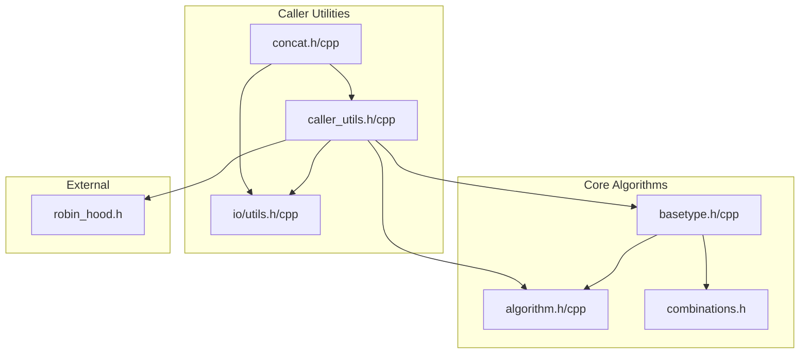
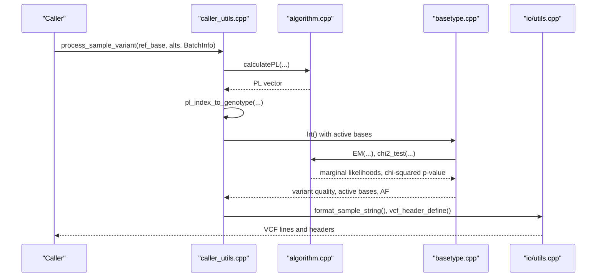
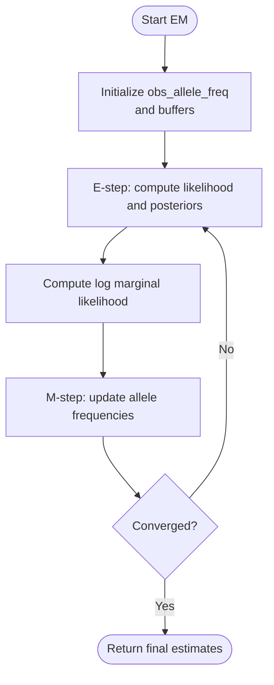
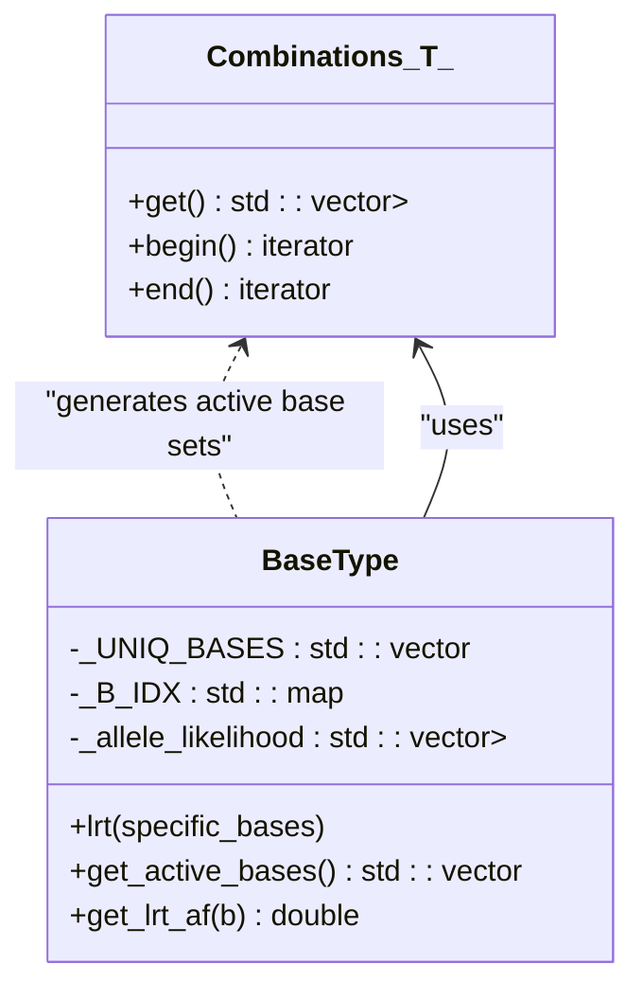
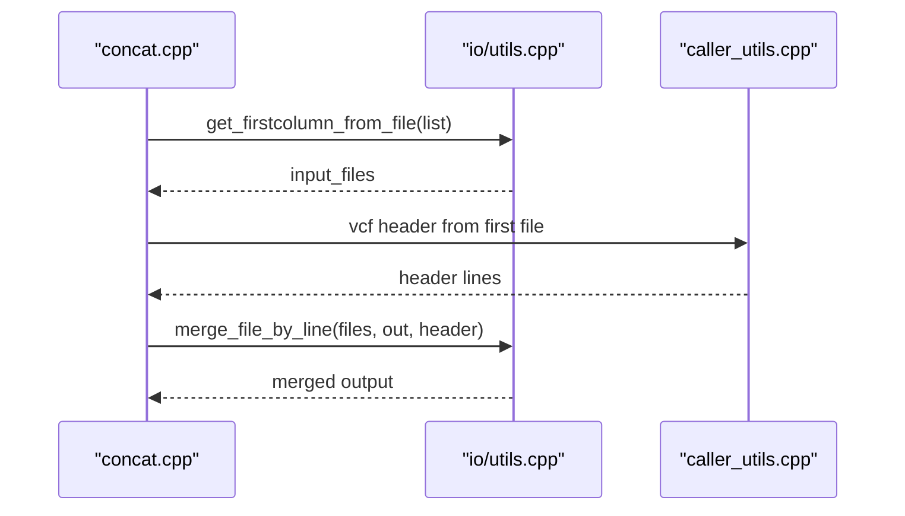
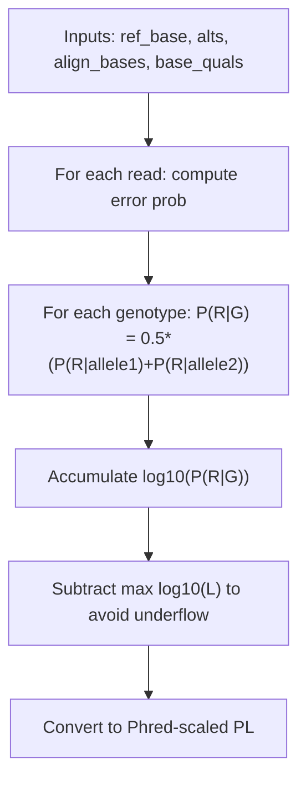
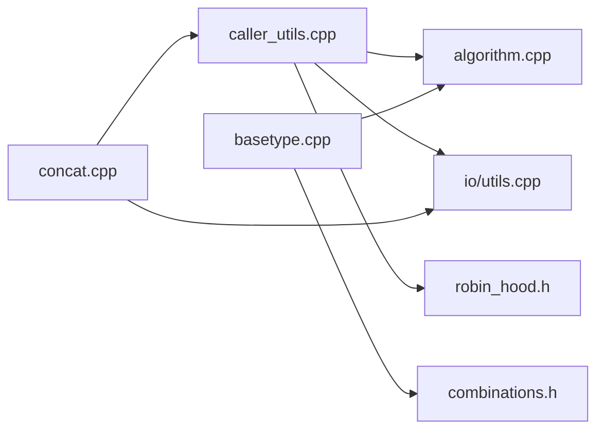

# Utility Functions and Helpers

<cite>
**Referenced Files in This Document**
- [README.md](file://README.md)
- [algorithm.h](file://src/algorithm.h)
- [algorithm.cpp](file://src/algorithm.cpp)
- [basetype.h](file://src/basetype.h)
- [basetype.cpp](file://src/basetype.cpp)
- [caller_utils.h](file://src/caller_utils.h)
- [caller_utils.cpp](file://src/caller_utils.cpp)
- [io/utils.h](file://src/io/utils.h)
- [io/utils.cpp](file://src/io/utils.cpp)
- [concat.h](file://src/concat.h)
- [concat.cpp](file://src/concat.cpp)
- [combinations.h](file://src/external/combinations.h)
- [robin_hood.h](file://src/external/robin_hood.h)
</cite>

## Table of Contents
1. [Introduction](#introduction)
2. [Project Structure](#project-structure)
3. [Core Components](#core-components)
4. [Architecture Overview](#architecture-overview)
5. [Detailed Component Analysis](#detailed-component-analysis)
6. [Dependency Analysis](#dependency-analysis)
7. [Performance Considerations](#performance-considerations)
8. [Troubleshooting Guide](#troubleshooting-guide)
9. [Conclusion](#conclusion)
10. [Appendices](#appendices)

## Introduction
This document describes BaseVar2’s utility functions and helper components that power variant calling from ultra-low-coverage whole-genome sequencing data. It focuses on:
- Mathematical and statistical utilities for likelihood modeling, hypothesis testing, and inference
- Data structures and algorithms for variant likelihood computation and EM estimation
- File processing and data manipulation helpers for FASTA/VCF/CVG workflows
- Specialized functions for strand bias detection, PL calculation, and merging outputs
- Validation, error handling, and performance optimization patterns

The goal is to explain how these utilities integrate across modules and how to use them effectively in practice.

## Project Structure
BaseVar2 organizes utilities primarily under src/, with dedicated modules for:
- Statistical and algorithmic routines (src/algorithm.*)
- Core data model and likelihood computations (src/basetype.*)
- Caller-side helpers and VCF/CVG output (src/caller_utils.*)
- I/O and general utilities (src/io/utils.*)
- External containers and combinatorics (src/external/*)
- Output concatenation (src/concat.*)

**Diagram sources**
- [algorithm.h:1-180](file://src/algorithm.h#L1-L180)
- [algorithm.cpp:1-293](file://src/algorithm.cpp#L1-L293)
- [basetype.h:1-146](file://src/basetype.h#L1-L146)
- [basetype.cpp:1-212](file://src/basetype.cpp#L1-L212)
- [caller_utils.h:1-230](file://src/caller_utils.h#L1-L230)
- [caller_utils.cpp:1-307](file://src/caller_utils.cpp#L1-L307)
- [io/utils.h:1-205](file://src/io/utils.h#L1-L205)
- [io/utils.cpp:1-142](file://src/io/utils.cpp#L1-L142)
- [concat.h:1-27](file://src/concat.h#L1-L27)
- [concat.cpp:1-91](file://src/concat.cpp#L1-L91)
- [combinations.h:1-84](file://src/external/combinations.h#L1-L84)
- [robin_hood.h:1-800](file://src/external/robin_hood.h#L1-L800)

**Section sources**
- [README.md:1-181](file://README.md#L1-L181)

## Core Components
This section summarizes the primary utility categories and their responsibilities.

- Mathematical/statistical utilities
  - Descriptive statistics: sum, mean, standard deviation, standard error, median
  - Distribution and test functions: chi-square via gamma complement, normal distribution, Fisher’s exact test, Wilcoxon rank-sum test
  - EM algorithm for allele frequency estimation with marginal likelihood tracking

- Data structures and algorithms
  - Combinatorial generation for active base sets
  - Likelihood modeling per read base with quality conversion
  - LRT-based selection of active alleles and variant quality scoring

- File processing and data manipulation
  - Path/file utilities: absolute path, directory/name extraction, existence checks, mkdir/safe removal
  - String parsing/splitting/joining, unique sorting, first-column extraction
  - BGZF-aware file I/O helpers for VCF/CVG output
  - VCF header construction and sample annotation formatting
  - Output concatenation of VCF files preserving headers

- Specialized helpers
  - Strand bias metrics (Fisher’s FS and SOR) and normalization of indel alleles
  - Genotype likelihood (PL) calculation for arbitrary alleles
  - Conversion from PL index to diploid genotype codes

**Section sources**
- [algorithm.h:24-178](file://src/algorithm.h#L24-L178)
- [algorithm.cpp:1-293](file://src/algorithm.cpp#L1-L293)
- [basetype.h:24-143](file://src/basetype.h#L24-L143)
- [basetype.cpp:14-212](file://src/basetype.cpp#L14-L212)
- [caller_utils.h:29-229](file://src/caller_utils.h#L29-L229)
- [caller_utils.cpp:1-307](file://src/caller_utils.cpp#L1-L307)
- [io/utils.h:22-204](file://src/io/utils.h#L22-L204)
- [io/utils.cpp:10-142](file://src/io/utils.cpp#L10-L142)
- [concat.h:23-24](file://src/concat.h#L23-L24)
- [concat.cpp:11-91](file://src/concat.cpp#L11-L91)

## Architecture Overview
The utility architecture centers on:
- algorithm.*: Provides math/stat primitives and inference routines
- basetype.*: Encapsulates per-sample likelihood computation and LRT-based selection
- caller_utils.*: Orchestrates data normalization, VCF/CVG formatting, and output writing
- io/utils.*: Offers robust I/O and string/path utilities
- external/*: Combinatorics and high-performance hash containers

**Diagram sources**
- [caller_utils.cpp:144-200](file://src/caller_utils.cpp#L144-L200)
- [algorithm.cpp:12-88](file://src/algorithm.cpp#L12-L88)
- [basetype.cpp:137-210](file://src/basetype.cpp#L137-L210)
- [io/utils.cpp:1-142](file://src/io/utils.cpp#L1-L142)

## Detailed Component Analysis

### Mathematical and Statistical Utilities
- Descriptive statistics
  - Sum, mean, standard deviation, standard error, median
  - Robust error handling for empty or insufficient-size inputs
- Distribution and tests
  - Chi-square via gamma complement and normal CDF
  - Fisher’s exact test with left/greater/two-sided modes
  - Wilcoxon rank-sum test with tied ranks averaging
- EM algorithm
  - E-step: compute per-sample likelihood and posterior
  - M-step: update observed allele frequencies
  - Iterative refinement with convergence threshold on log marginal likelihood

**Diagram sources**
- [algorithm.h:150-178](file://src/algorithm.h#L150-L178)
- [algorithm.cpp:194-292](file://src/algorithm.cpp#L194-L292)

**Section sources**
- [algorithm.h:24-178](file://src/algorithm.h#L24-L178)
- [algorithm.cpp:1-293](file://src/algorithm.cpp#L1-L293)

### Data Structures and Algorithms
- Combinatorics
  - Generates combinations of active bases for LRT comparisons
- Per-read likelihood modeling
  - Quality-to-error conversion and per-base likelihood assignment
- LRT-based selection
  - Iteratively compares reduced vs. expanded base sets using chi-squared thresholds

**Diagram sources**
- [combinations.h:18-84](file://src/external/combinations.h#L18-L84)
- [basetype.h:38-143](file://src/basetype.h#L38-L143)
- [basetype.cpp:113-135](file://src/basetype.cpp#L113-L135)

**Section sources**
- [combinations.h:1-84](file://src/external/combinations.h#L1-L84)
- [basetype.h:38-143](file://src/basetype.h#L38-L143)
- [basetype.cpp:96-210](file://src/basetype.cpp#L96-L210)

### File Processing and Data Manipulation Helpers
- Path and file utilities
  - Absolute path, dirname/basename, suffix extraction, existence checks, safe mkdir/remove
- String and container helpers
  - Join/split, unique sorting by length then ASCII, first-column extraction
- BGZF I/O and header construction
  - VCF header definition, contig metadata, sample formatting
- Output concatenation
  - Preserves headers and merges multiple VCF files

**Diagram sources**
- [concat.cpp:27-91](file://src/concat.cpp#L27-L91)
- [io/utils.cpp:100-119](file://src/io/utils.cpp#L100-L119)
- [caller_utils.cpp:217-262](file://src/caller_utils.cpp#L217-L262)
- [io/utils.cpp:281-306](file://src/io/utils.cpp#L281-L306)

**Section sources**
- [io/utils.h:45-204](file://src/io/utils.h#L45-L204)
- [io/utils.cpp:10-142](file://src/io/utils.cpp#L10-L142)
- [caller_utils.h:224-229](file://src/caller_utils.h#L224-L229)
- [caller_utils.cpp:217-279](file://src/caller_utils.cpp#L217-L279)
- [concat.h:23-24](file://src/concat.h#L23-L24)
- [concat.cpp:11-91](file://src/concat.cpp#L11-L91)

### Specialized Helpers
- Strand bias metrics
  - Fisher’s exact test (FS) and symmetric odds ratio (SOR) for REF/ALT strand support
- Genotype likelihood (PL) calculation
  - Computes log10 likelihoods for all diploid genotypes given reference, alternate alleles, and base qualities
- PL index to genotype conversion
  - Maps flattened PL index to diploid allele indices

**Diagram sources**
- [algorithm.cpp:12-88](file://src/algorithm.cpp#L12-L88)
- [caller_utils.cpp:129-142](file://src/caller_utils.cpp#L129-L142)

**Section sources**
- [caller_utils.h:198-221](file://src/caller_utils.h#L198-L221)
- [caller_utils.cpp:9-62](file://src/caller_utils.cpp#L9-L62)
- [algorithm.cpp:12-88](file://src/algorithm.cpp#L12-L88)

### Data Validation, Error Handling, and Performance Optimization
- Validation
  - Fisher’s exact table entries non-negative; invalid test side raises errors
  - LRT active base set constraints; EM iteration and epsilon bounds enforced
- Error handling
  - Throws on invalid inputs (negative entries, insufficient samples, wrong sizes)
  - Runtime errors for out-of-range lookups and missing bases
- Performance
  - Predefined constants for thresholds and scaling reduce repeated computation
  - Efficient hash maps via robin_hood unordered containers
  - Early exits and underflow-safe calculations (subtracting max log-likelihood)

**Section sources**
- [algorithm.h:128-136](file://src/algorithm.h#L128-L136)
- [algorithm.cpp:91-130](file://src/algorithm.cpp#L91-L130)
- [basetype.cpp:137-210](file://src/basetype.cpp#L137-L210)
- [basetype.h:25-27](file://src/basetype.h#L25-L27)
- [robin_hood.h:1-800](file://src/external/robin_hood.h#L1-L800)

## Dependency Analysis
Key dependencies among utilities:
- caller_utils.cpp depends on algorithm.cpp for PL and statistical tests
- basetype.cpp depends on algorithm.cpp for EM and chi-squared evaluation
- concat.cpp depends on caller_utils.cpp for header retrieval and on io/utils.cpp for file operations
- External dependencies include robin_hood for hash maps and combinations for combinatorial generation

**Diagram sources**
- [caller_utils.cpp:1-307](file://src/caller_utils.cpp#L1-L307)
- [algorithm.cpp:1-293](file://src/algorithm.cpp#L1-L293)
- [basetype.cpp:1-212](file://src/basetype.cpp#L1-L212)
- [concat.cpp:1-91](file://src/concat.cpp#L1-L91)
- [io/utils.cpp:1-142](file://src/io/utils.cpp#L1-L142)
- [combinations.h:1-84](file://src/external/combinations.h#L1-L84)
- [robin_hood.h:1-800](file://src/external/robin_hood.h#L1-L800)

**Section sources**
- [caller_utils.cpp:1-307](file://src/caller_utils.cpp#L1-L307)
- [algorithm.cpp:1-293](file://src/algorithm.cpp#L1-L293)
- [basetype.cpp:1-212](file://src/basetype.cpp#L1-L212)
- [concat.cpp:1-91](file://src/concat.cpp#L1-L91)
- [io/utils.cpp:1-142](file://src/io/utils.cpp#L1-L142)
- [combinations.h:1-84](file://src/external/combinations.h#L1-L84)
- [robin_hood.h:1-800](file://src/external/robin_hood.h#L1-L800)

## Performance Considerations
- Prefer precomputed constants (thresholds, scaling factors) to minimize runtime arithmetic
- Use robin_hood unordered containers for high-throughput key-value operations
- Avoid repeated allocations by reserving vectors and reusing buffers in loops
- Subtract the maximum log-likelihood before exponentiation to prevent numerical underflow
- Limit combinatorial explosion by bounding active base set size in LRT selection

## Troubleshooting Guide
Common issues and resolutions:
- Fisher’s exact test returns infinity or zero
  - Indicates extreme strand bias; code converts to large finite values for reporting
- EM convergence stalls or oscillates
  - Verify iteration count and epsilon; ensure sufficient coverage and valid inputs
- Out-of-range base lookup
  - Ensure bases are part of the predefined unique base set and not masked (N, *)
- File I/O failures
  - Confirm readable paths, proper compression suffixes, and directory permissions

**Section sources**
- [caller_utils.cpp:43-61](file://src/caller_utils.cpp#L43-L61)
- [basetype.cpp:137-210](file://src/basetype.cpp#L137-L210)
- [basetype.cpp:104-111](file://src/basetype.cpp#L104-L111)
- [io/utils.cpp:13-15](file://src/io/utils.cpp#L13-L15)

## Conclusion
BaseVar2’s utilities provide a cohesive toolkit for statistical inference, data modeling, and output generation. They emphasize correctness (robust error handling), performance (optimized containers and numerical stability), and usability (clear APIs for VCF/CVG workflows). Integrating these components enables scalable variant calling from ultra-low-coverage datasets.

## Appendices

### Usage Examples and Integration Patterns
- Computing PL for a sample
  - Inputs: reference base, alternate alleles, aligned bases, base qualities
  - Output: Phred-scaled genotype likelihoods
  - Integration: call in caller_utils::process_sample_variant
- Performing LRT and selecting active alleles
  - Inputs: per-read likelihoods, minimum allele frequency threshold
  - Output: active bases, allele frequencies, variant quality
  - Integration: call BaseType::lrt after constructing a BaseType instance
- Merging VCF outputs
  - Inputs: list of VCF files, output path
  - Behavior: extract header from first file, append body lines from all inputs
  - Integration: use concat_runner and _concat_basevar_outfile

**Section sources**
- [caller_utils.cpp:144-200](file://src/caller_utils.cpp#L144-L200)
- [basetype.cpp:137-210](file://src/basetype.cpp#L137-L210)
- [concat.cpp:27-91](file://src/concat.cpp#L27-L91)