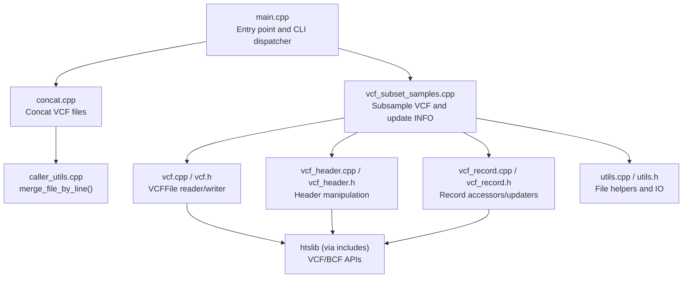
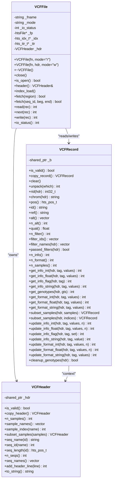
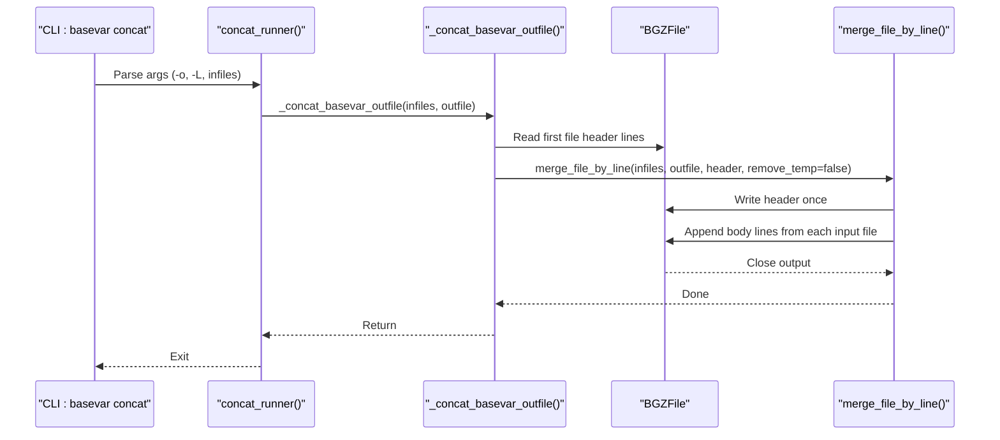
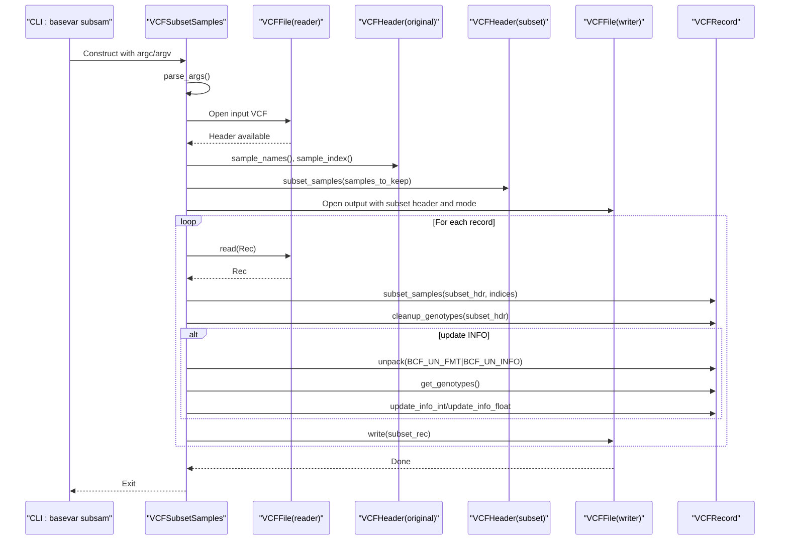
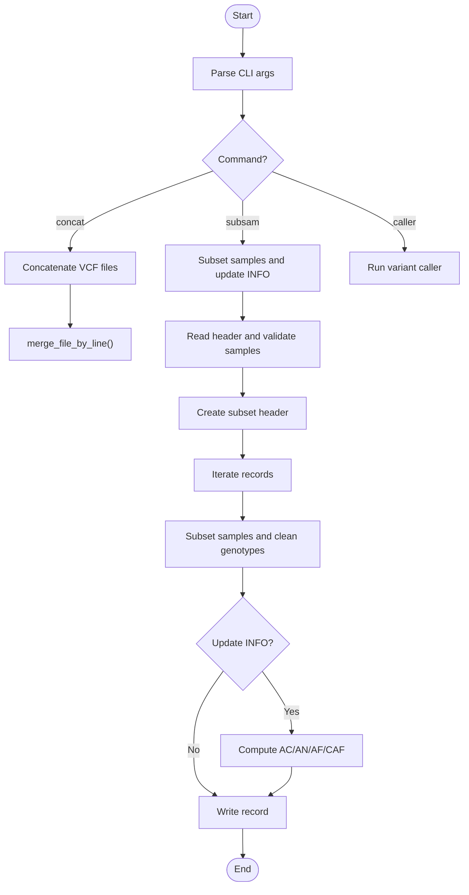
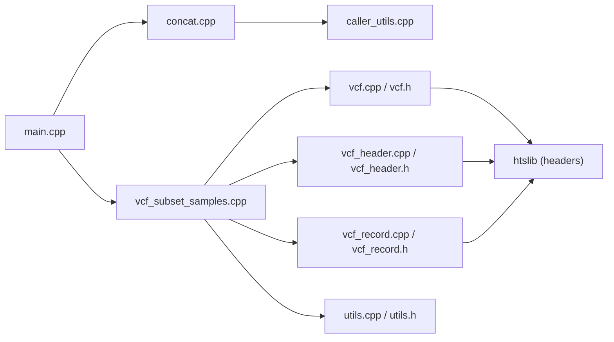

# VCF Processing Tools

<cite>
**Referenced Files in This Document**
- [README.md](file://README.md)
- [main.cpp](file://src/main.cpp)
- [concat.h](file://src/concat.h)
- [concat.cpp](file://src/concat.cpp)
- [vcf_subset_samples.h](file://src/vcf_subset_samples.h)
- [vcf_subset_samples.cpp](file://src/vcf_subset_samples.cpp)
- [vcf.h](file://src/io/vcf.h)
- [vcf.cpp](file://src/io/vcf.cpp)
- [vcf_header.h](file://src/io/vcf_header.h)
- [vcf_header.cpp](file://src/io/vcf_header.cpp)
- [vcf_record.h](file://src/io/vcf_record.h)
- [vcf_record.cpp](file://src/io/vcf_record.cpp)
- [utils.h](file://src/io/utils.h)
- [utils.cpp](file://src/io/utils.cpp)
- [caller_utils.h](file://src/caller_utils.h)
- [caller_utils.cpp](file://src/caller_utils.cpp)
</cite>

## Table of Contents
1. [Introduction](#introduction)
2. [Project Structure](#project-structure)
3. [Core Components](#core-components)
4. [Architecture Overview](#architecture-overview)
5. [Detailed Component Analysis](#detailed-component-analysis)
6. [Dependency Analysis](#dependency-analysis)
7. [Performance Considerations](#performance-considerations)
8. [Troubleshooting Guide](#troubleshooting-guide)
9. [Conclusion](#conclusion)
10. [Appendices](#appendices)

## Introduction
This document describes BaseVar2’s VCF processing tools and utilities, focusing on:
- VCF concatenation for merging multiple VCF files from the same sample sets
- Sample subset extraction for reducing VCF datasets
- File format conversion utilities and quality control validation procedures
- Implementation of VCF manipulation operations integrated into the main variant calling pipeline
- Practical workflows and best practices for data management and quality assurance

These tools are part of the BaseVar2 variant calling suite designed for ultra-low-pass whole-genome sequencing data.

## Project Structure
BaseVar2 organizes VCF processing logic primarily under src/, with dedicated modules for I/O, utilities, and command-line entry points. The VCF processing tools are exposed via the main executable with subcommands for concatenation and sample subsetting.

**Diagram sources**
- [main.cpp:1-93](file://src/main.cpp#L1-L93)
- [concat.cpp:1-91](file://src/concat.cpp#L1-L91)
- [vcf_subset_samples.cpp:1-316](file://src/vcf_subset_samples.cpp#L1-L316)
- [vcf.cpp:1-227](file://src/io/vcf.cpp#L1-L227)
- [vcf_header.cpp:1-275](file://src/io/vcf_header.cpp#L1-L275)
- [vcf_record.cpp:1-800](file://src/io/vcf_record.cpp#L1-L800)
- [utils.cpp:1-142](file://src/io/utils.cpp#L1-L142)
- [caller_utils.cpp:281-307](file://src/caller_utils.cpp#L281-L307)

**Section sources**
- [README.md:1-181](file://README.md#L1-L181)
- [main.cpp:17-30](file://src/main.cpp#L17-L30)

## Core Components
- VCFFile: A high-level wrapper around htslib for reading/writing VCF/BCF with header and iterator support.
- VCFHeader: Safe, shared ownership of VCF headers with sample and contig metadata accessors and subsetting.
- VCFRecord: Safe, shared ownership of VCF records with accessors for INFO/FORMAT fields and mutation helpers.
- Concatenation utility: Line-by-line merge of VCF headers and body lines for BaseVar-generated files.
- Sample subset tool: Extracts specified samples, recalculates INFO (AC/AN/AF/CAF), cleans genotypes, and writes output.

Key integration points:
- The main entry point dispatches to subcommands for concat and subsam.
- VCF manipulation relies on htslib APIs via the wrapper classes.

**Section sources**
- [vcf.h:29-179](file://src/io/vcf.h#L29-L179)
- [vcf.cpp:8-227](file://src/io/vcf.cpp#L8-L227)
- [vcf_header.h:31-239](file://src/io/vcf_header.h#L31-L239)
- [vcf_header.cpp:8-275](file://src/io/vcf_header.cpp#L8-L275)
- [vcf_record.h:31-521](file://src/io/vcf_record.h#L31-L521)
- [vcf_record.cpp:16-800](file://src/io/vcf_record.cpp#L16-L800)
- [concat.h:23-24](file://src/concat.h#L23-L24)
- [concat.cpp:11-25](file://src/concat.cpp#L11-L25)
- [vcf_subset_samples.h:26-76](file://src/vcf_subset_samples.h#L26-L76)
- [vcf_subset_samples.cpp:24-316](file://src/vcf_subset_samples.cpp#L24-L316)

## Architecture Overview
The VCF processing architecture centers on a thin C++ wrapper around htslib, enabling safe memory management and convenient operations. The main CLI routes to subcommands that orchestrate reading, transforming, and writing VCF data.

**Diagram sources**
- [vcf.h:29-179](file://src/io/vcf.h#L29-L179)
- [vcf_header.h:31-239](file://src/io/vcf_header.h#L31-L239)
- [vcf_record.h:31-521](file://src/io/vcf_record.h#L31-L521)

## Detailed Component Analysis

### VCF Concatenation Tool
Purpose:
- Concatenate BaseVar-generated VCF files from the same sample set by merging headers and body lines.

Implementation highlights:
- Reads header lines from the first input file and writes them once to the output.
- Merges remaining lines from all input files in order.
- Does not sort positions; ordering must be ensured by the user.

**Diagram sources**
- [concat.cpp:27-90](file://src/concat.cpp#L27-L90)
- [concat.cpp:11-25](file://src/concat.cpp#L11-L25)
- [caller_utils.cpp:281-307](file://src/caller_utils.cpp#L281-L307)

Practical guidance:
- Ensure input files are produced by the same BaseVar pipeline and represent the same sample set.
- Preserve the intended order of files; BaseVar’s concatenation does not sort genomic positions.

**Section sources**
- [concat.h:23-24](file://src/concat.h#L23-L24)
- [concat.cpp:11-25](file://src/concat.cpp#L11-L25)
- [concat.cpp:27-90](file://src/concat.cpp#L27-L90)
- [caller_utils.cpp:281-307](file://src/caller_utils.cpp#L281-L307)

### Sample Subset Extraction Tool
Purpose:
- Extract variants for specified samples from a VCF and optionally recalculate INFO fields (AC/AN/AF/CAF), while cleaning genotypes and writing a new VCF.

Core workflow:
- Parse arguments for input/output and sample selection.
- Validate requested samples against the header.
- Create a subset header and open output with appropriate mode.
- Iterate records, subset samples, clean genotypes, optionally recalculate INFO, and write.

**Diagram sources**
- [vcf_subset_samples.cpp:224-316](file://src/vcf_subset_samples.cpp#L224-L316)
- [vcf.cpp:164-217](file://src/io/vcf.cpp#L164-L217)
- [vcf_record.cpp:736-771](file://src/io/vcf_record.cpp#L736-L771)
- [vcf_record.cpp:122-221](file://src/io/vcf_record.cpp#L122-L221)

Key operations:
- Subsetting samples: Uses header-level subset and record-level subset to limit samples and their FORMAT fields.
- INFO recalculation: Computes AC/AN/AF/CAF based on kept samples; skips sites with no usable genotypes unless configured otherwise.
- Genotype cleanup: Removes unused ALT alleles and adjusts genotypes accordingly.

Quality control and validation:
- Validates presence of requested samples in the header.
- Skips records when no genotypes remain for kept samples (unless keep-all-site is enabled).
- Reports warnings for unpack failures and missing GT fields.

**Section sources**
- [vcf_subset_samples.h:26-76](file://src/vcf_subset_samples.h#L26-L76)
- [vcf_subset_samples.cpp:24-316](file://src/vcf_subset_samples.cpp#L24-L316)
- [vcf_header.cpp:129-164](file://src/io/vcf_header.cpp#L129-L164)
- [vcf_record.cpp:736-771](file://src/io/vcf_record.cpp#L736-L771)
- [vcf_record.cpp:122-221](file://src/io/vcf_record.cpp#L122-L221)

### VCF Manipulation Utilities and Integration
- VCFFile: Opens, reads/writes VCF/BCF, loads indices, and iterates by region.
- VCFHeader: Provides safe access to sample names, contig metadata, and header subsetting.
- VCFRecord: Offers field accessors and mutators for INFO/FORMAT, plus subsetting and cleanup.

Integration with the main pipeline:
- The main entry point exposes subcommands for caller, concat, and subsam.
- Concat and subsam rely on the same I/O and header/record abstractions used by the variant caller.

**Diagram sources**
- [main.cpp:39-41](file://src/main.cpp#L39-L41)
- [concat.cpp:27-90](file://src/concat.cpp#L27-L90)
- [vcf_subset_samples.cpp:224-316](file://src/vcf_subset_samples.cpp#L224-L316)
- [caller_utils.cpp:281-307](file://src/caller_utils.cpp#L281-L307)

**Section sources**
- [main.cpp:17-30](file://src/main.cpp#L17-L30)
- [vcf.cpp:8-107](file://src/io/vcf.cpp#L8-L107)
- [vcf_header.cpp:49-164](file://src/io/vcf_header.cpp#L49-L164)
- [vcf_record.cpp:62-116](file://src/io/vcf_record.cpp#L62-L116)

## Dependency Analysis
High-level dependencies among VCF processing components:

**Diagram sources**
- [main.cpp:14-15](file://src/main.cpp#L14-L15)
- [concat.cpp:19-21](file://src/concat.cpp#L19-L21)
- [vcf_subset_samples.cpp:16-18](file://src/vcf_subset_samples.cpp#L16-L18)
- [vcf.cpp:13-19](file://src/io/vcf.cpp#L13-L19)
- [vcf_header.cpp:15-19](file://src/io/vcf_header.cpp#L15-L19)
- [vcf_record.cpp:15-19](file://src/io/vcf_record.cpp#L15-L19)
- [utils.cpp:1-142](file://src/io/utils.cpp#L1-L142)
- [caller_utils.cpp:18-24](file://src/caller_utils.cpp#L18-L24)

**Section sources**
- [main.cpp:14-15](file://src/main.cpp#L14-L15)
- [concat.cpp:19-21](file://src/concat.cpp#L19-L21)
- [vcf_subset_samples.cpp:16-18](file://src/vcf_subset_samples.cpp#L16-L18)
- [vcf.cpp:13-19](file://src/io/vcf.cpp#L13-L19)
- [vcf_header.cpp:15-19](file://src/io/vcf_header.cpp#L15-L19)
- [vcf_record.cpp:15-19](file://src/io/vcf_record.cpp#L15-L19)
- [utils.cpp:1-142](file://src/io/utils.cpp#L1-L142)
- [caller_utils.cpp:18-24](file://src/caller_utils.cpp#L18-L24)

## Performance Considerations
- Memory management: Shared ownership via smart pointers avoids duplication of large header/record structures.
- Streaming I/O: Header and body are processed in streaming fashion; concatenation writes header once and appends body lines.
- Subsetting efficiency: Subsetting samples and FORMAT fields is delegated to htslib’s subset routines, minimizing overhead.
- Unpacking: INFO/FORMAT fields are unpacked only when needed (e.g., during INFO recalculation), avoiding unnecessary work.

[No sources needed since this section provides general guidance]

## Troubleshooting Guide
Common issues and resolutions:
- Index not found: Ensure .tbi/.csi index exists alongside the VCF file before invoking region queries.
- Invalid header or mode: Opening a writer requires a valid header; opening with an invalid mode triggers an error.
- Missing samples: Subsetting fails if requested samples are not present in the header; confirm sample names match exactly.
- Unpack failures: INFO recalculation requires FORMAT/INFO to be unpacked; ensure unpack is called or use the provided helpers.
- No genotypes after subsetting: By default, records with no usable genotypes for kept samples are skipped; enable keep-all-site if needed.

**Section sources**
- [vcf.cpp:87-107](file://src/io/vcf.cpp#L87-L107)
- [vcf.cpp:164-198](file://src/io/vcf.cpp#L164-L198)
- [vcf_record.cpp:122-134](file://src/io/vcf_record.cpp#L122-L134)
- [vcf_subset_samples.cpp:122-134](file://src/vcf_subset_samples.cpp#L122-L134)
- [vcf_subset_samples.cpp:188-195](file://src/vcf_subset_samples.cpp#L188-L195)

## Conclusion
BaseVar2’s VCF processing tools provide robust, efficient operations for concatenating BaseVar-generated files and extracting sample subsets with accurate INFO recalculation and genotype cleanup. Built on a safe, shared-ownership wrapper around htslib, the implementation integrates cleanly with the main variant calling pipeline and supports high-throughput workflows.

[No sources needed since this section summarizes without analyzing specific files]

## Appendices

### Practical Workflows and Best Practices
- Concatenation workflow:
  - Prepare a list of BaseVar VCF files from the same sample set.
  - Run concatenation ensuring the desired order; remember that concatenation does not sort positions.
  - Validate merged output with a quick header check and random record inspection.

- Sample subset workflow:
  - Prepare a list of sample names to keep.
  - Optionally disable INFO updates if downstream processing will recalculate them.
  - Enable keep-all-site if you need to retain sites with only reference alleles in the subset.
  - Verify output by inspecting a few records and confirming sample count and FORMAT fields.

- Quality assurance:
  - Confirm sample names match the VCF header exactly.
  - After subsetting, validate that AC/AN/AF/CAF reflect the subset composition.
  - Ensure FORMAT fields are subset correctly and genotypes are cleaned.

**Section sources**
- [concat.cpp:27-90](file://src/concat.cpp#L27-L90)
- [vcf_subset_samples.cpp:224-316](file://src/vcf_subset_samples.cpp#L224-L316)
- [vcf_record.cpp:773-800](file://src/io/vcf_record.cpp#L773-L800)