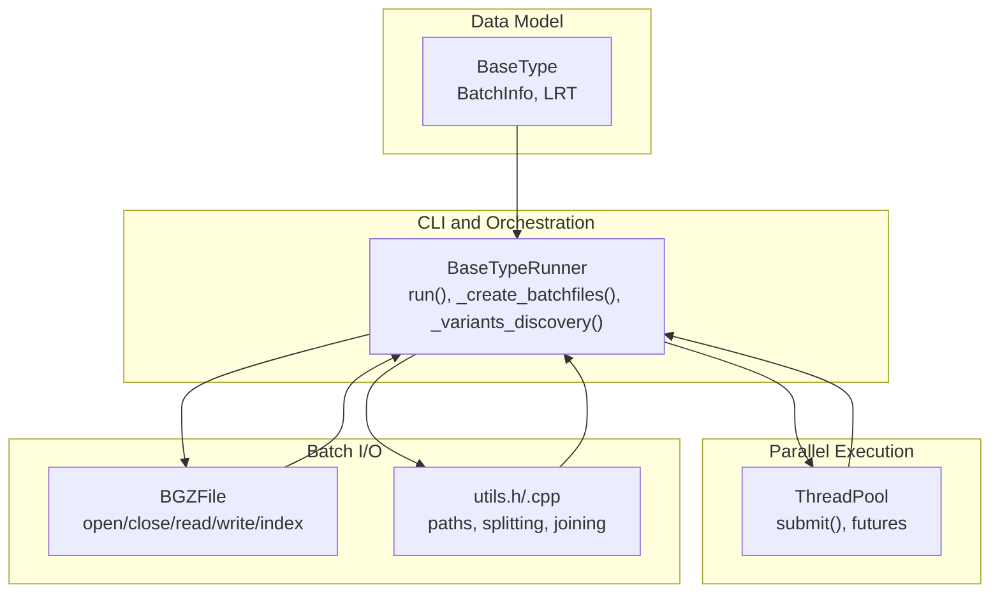
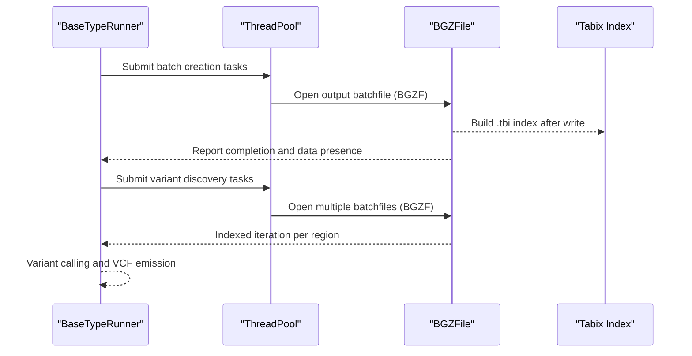
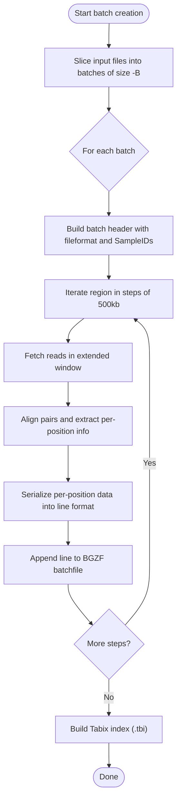
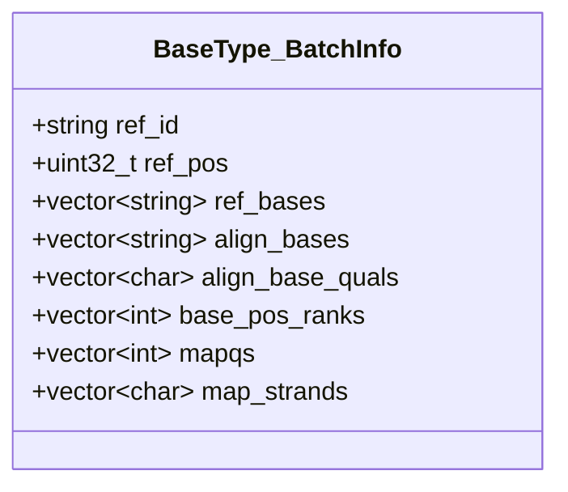
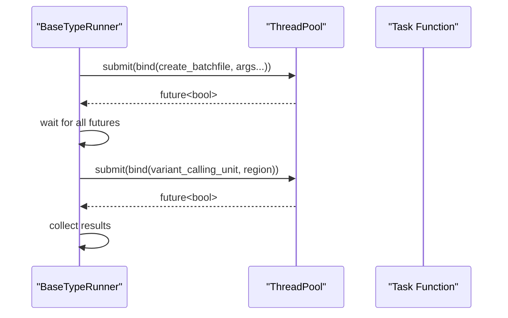
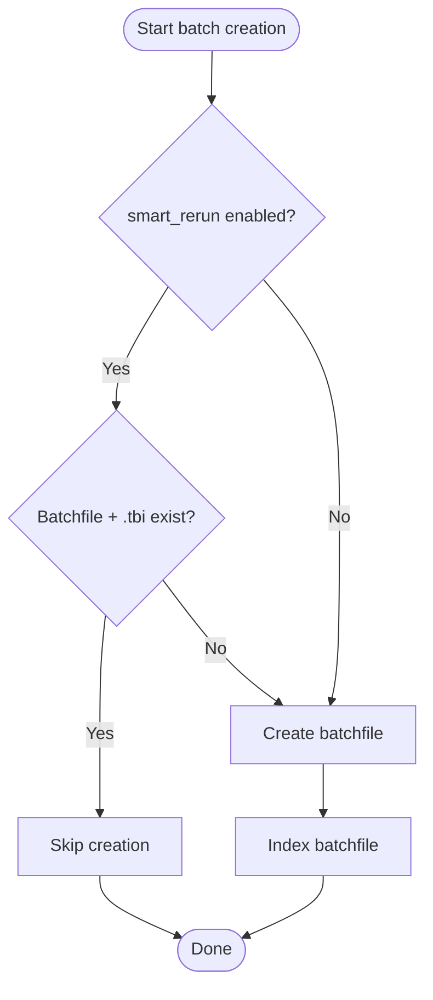
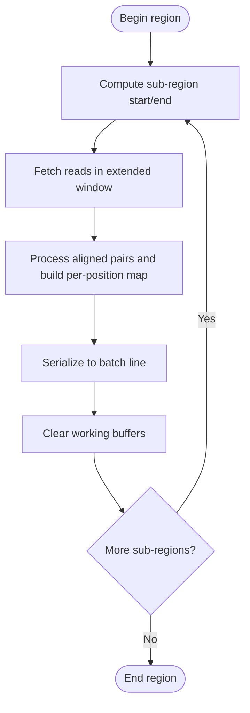
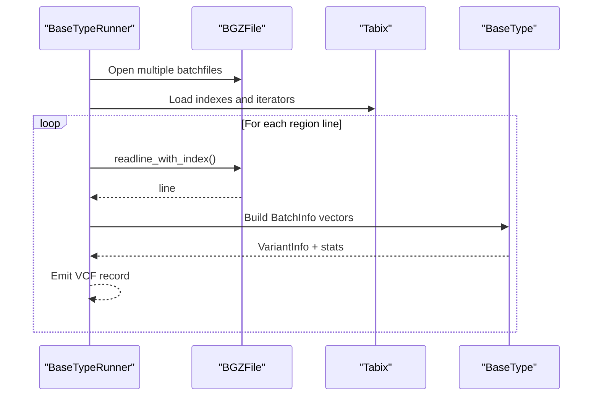
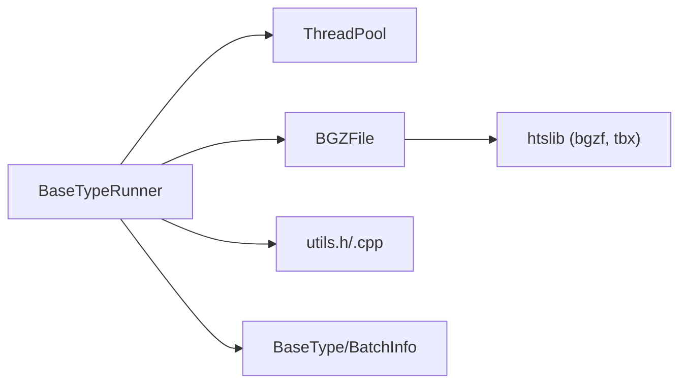

# Batch Processing System

<cite>
**Referenced Files in This Document**
- [variant_caller.cpp](file://src/variant_caller.cpp)
- [variant_caller.h](file://src/variant_caller.h)
- [thread_pool.h](file://src/external/thread_pool.h)
- [iobgzf.h](file://src/io/iobgzf.h)
- [iobgzf.cpp](file://src/io/iobgzf.cpp)
- [utils.h](file://src/io/utils.h)
- [utils.cpp](file://src/io/utils.cpp)
- [basetype.h](file://src/basetype.h)
</cite>

## Table of Contents
1. [Introduction](#introduction)
2. [Project Structure](#project-structure)
3. [Core Components](#core-components)
4. [Architecture Overview](#architecture-overview)
5. [Detailed Component Analysis](#detailed-component-analysis)
6. [Dependency Analysis](#dependency-analysis)
7. [Performance Considerations](#performance-considerations)
8. [Troubleshooting Guide](#troubleshooting-guide)
9. [Conclusion](#conclusion)

## Introduction
This document describes the batch processing system architecture used by the variant caller. It explains how batch files are created, how temporary files are managed, and how the batch-based workflow integrates with parallel execution. It also covers batch size optimization, memory management, disk I/O efficiency, the batch file format and header, serialization methods, smart re-run functionality, cleanup and error handling, and recovery mechanisms.

## Project Structure
The batch processing pipeline spans several modules:
- CLI runner and orchestration: BaseTypeRunner
- Parallel execution: ThreadPool
- Batch file I/O: BGZFile wrapper around htslib/bgzf
- Utilities: filesystem helpers, string operations, and region handling
- Data model: batch record structure and likelihood-based variant caller

**Diagram sources**
- [variant_caller.cpp:343-438](file://src/variant_caller.cpp#L343-L438)
- [thread_pool.h:25-134](file://src/external/thread_pool.h#L25-L134)
- [iobgzf.h:27-148](file://src/io/iobgzf.h#L27-L148)
- [utils.h:21-43](file://src/io/utils.h#L21-L43)
- [basetype.h:30-93](file://src/basetype.h#L30-L93)

**Section sources**
- [variant_caller.cpp:343-438](file://src/variant_caller.cpp#L343-L438)
- [variant_caller.h:41-174](file://src/variant_caller.h#L41-L174)
- [thread_pool.h:25-134](file://src/external/thread_pool.h#L25-L134)
- [iobgzf.h:27-148](file://src/io/iobgzf.h#L27-L148)
- [utils.h:21-43](file://src/io/utils.h#L21-L43)
- [basetype.h:30-93](file://src/basetype.h#L30-L93)

## Core Components
- BaseTypeRunner orchestrates the entire pipeline: parsing arguments, building calling intervals, creating batchfiles, and performing variant discovery.
- ThreadPool manages asynchronous batch creation and variant discovery units.
- BGZFile provides streaming read/write and indexed iteration over batch files.
- utils encapsulate filesystem and string operations used across the pipeline.
- BaseType::BatchInfo defines the per-position serialized representation stored in batch files.

Key responsibilities:
- Batch creation: chunk input BAM/CRAM files into batches, iterate over genomic regions in steps, serialize per-position data into BGZF-compressed batch files with Tabix index.
- Parallelism: launch multiple batch creation and variant discovery tasks concurrently.
- Discovery: read batch files in region chunks, merge lines across batchfiles, compute variants via likelihood ratio testing.

**Section sources**
- [variant_caller.h:96-132](file://src/variant_caller.h#L96-L132)
- [variant_caller.cpp:440-561](file://src/variant_caller.cpp#L440-L561)
- [thread_pool.h:25-134](file://src/external/thread_pool.h#L25-L134)
- [iobgzf.h:27-148](file://src/io/iobgzf.h#L27-L148)
- [basetype.h:79-93](file://src/basetype.h#L79-L93)

## Architecture Overview
The system follows a two-phase batch architecture:
1) Precomputation phase: Create batch files per genomic region, each containing per-position records for a fixed set of samples.
2) Discovery phase: Iterate over the same region partitions, reading aligned lines from all batch files, and calling variants using likelihood-based inference.

**Diagram sources**
- [variant_caller.cpp:440-561](file://src/variant_caller.cpp#L440-L561)
- [variant_caller.cpp:842-977](file://src/variant_caller.cpp#L842-L977)
- [iobgzf.cpp:27-39](file://src/io/iobgzf.cpp#L27-L39)
- [iobgzf.cpp:96-113](file://src/io/iobgzf.cpp#L96-L113)

## Detailed Component Analysis

### Batch Creation Workflow
- Input batching: The runner divides the input BAM/CRAM list into batches of size -B (default 500) and creates a batchfile per batch.
- Region stepping: Each batchfile is generated for a calling interval by iterating sub-regions of fixed step length (500,000 bp) to bound memory usage.
- Per-position serialization: For each sub-region, the runner collects aligned reads, computes per-position bases and qualities, and writes a single line per position with per-sample fields joined by spaces and per-allele fields joined by pipes.

**Diagram sources**
- [variant_caller.cpp:440-561](file://src/variant_caller.cpp#L440-L561)
- [variant_caller.cpp:563-628](file://src/variant_caller.cpp#L563-L628)
- [variant_caller.cpp:760-840](file://src/variant_caller.cpp#L760-L840)

**Section sources**
- [variant_caller.cpp:440-561](file://src/variant_caller.cpp#L440-L561)
- [variant_caller.cpp:563-628](file://src/variant_caller.cpp#L563-L628)
- [variant_caller.cpp:760-840](file://src/variant_caller.cpp#L760-L840)

### Batch File Format and Serialization
- File format: BGZF-compressed text with a Tabix index built on top.
- Header: Contains fileformat identifier and a comma-separated list of sample IDs.
- Columns per position:
  - Chromosome, Position, Reference base(s), Total depth, Mapping quality(s), Read base(s), Base quality(s), Read position ranks, Strand(s).
- Within a position, per-sample arrays are space-delimited; within a sample, per-allele arrays are pipe-delimited.

**Diagram sources**
- [basetype.h:79-93](file://src/basetype.h#L79-L93)

**Section sources**
- [variant_caller.cpp:510-517](file://src/variant_caller.cpp#L510-L517)
- [variant_caller.cpp:760-840](file://src/variant_caller.cpp#L760-L840)
- [basetype.h:79-93](file://src/basetype.h#L79-L93)

### Parallel Execution Patterns
- Batch creation: ThreadPool submits per-batch creation tasks; futures are collected to ensure completion.
- Discovery: The region is partitioned into sub-regions equal to thread count; each sub-region is processed by a separate task that iterates batch files in lockstep.

**Diagram sources**
- [variant_caller.cpp:473-491](file://src/variant_caller.cpp#L473-L491)
- [variant_caller.cpp:871-878](file://src/variant_caller.cpp#L871-L878)
- [thread_pool.h:82-110](file://src/external/thread_pool.h#L82-L110)

**Section sources**
- [variant_caller.cpp:473-491](file://src/variant_caller.cpp#L473-L491)
- [variant_caller.cpp:871-878](file://src/variant_caller.cpp#L871-L878)
- [thread_pool.h:82-110](file://src/external/thread_pool.h#L82-L110)

### Smart Re-Run and Temporary File Management
- Smart re-run: When enabled, the runner checks for existing batchfiles and their Tabix indices; if present, creation is skipped to avoid redundant work.
- Temporary cache: Batchfiles are written under a cache directory derived from the output VCF path; upon success, the runner optionally removes batchfiles and their indices immediately after merging, and cleans the cache directory at the end.

**Diagram sources**
- [variant_caller.cpp:459-464](file://src/variant_caller.cpp#L459-L464)
- [variant_caller.cpp:400-408](file://src/variant_caller.cpp#L400-L408)

**Section sources**
- [variant_caller.cpp:459-464](file://src/variant_caller.cpp#L459-L464)
- [variant_caller.cpp:400-408](file://src/variant_caller.cpp#L400-L408)
- [variant_caller.h:35-35](file://src/variant_caller.h#L35-L35)

### Memory Management and Batch Size Optimization
- Sub-region stepping: The runner iterates the calling region in fixed-size steps (500,000 bp) to cap peak memory usage when collecting per-position data.
- Pre-sizing containers: Vectors are reserved to reduce reallocation overhead.
- Per-task batching: Input files are sliced into batches of configurable size (-B) to balance I/O and parallel throughput.

**Diagram sources**
- [variant_caller.cpp:524-540](file://src/variant_caller.cpp#L524-L540)
- [variant_caller.cpp:563-628](file://src/variant_caller.cpp#L563-L628)
- [variant_caller.cpp:760-840](file://src/variant_caller.cpp#L760-L840)

**Section sources**
- [variant_caller.cpp:508-508](file://src/variant_caller.cpp#L508-L508)
- [variant_caller.cpp:524-540](file://src/variant_caller.cpp#L524-L540)
- [variant_caller.cpp:563-628](file://src/variant_caller.cpp#L563-L628)
- [variant_caller.cpp:760-840](file://src/variant_caller.cpp#L760-L840)

### Disk I/O Efficiency Techniques
- BGZF streaming: Batch files are written using BGZF compression to enable random-access via Tabix indexing.
- Indexed iteration: During discovery, batch files are opened and iterated using Tabix cursors to read only the requested region lines.
- Buffered reads: BGZFile supports buffered reads and line-wise iteration to minimize syscalls.

**Section sources**
- [iobgzf.h:27-148](file://src/io/iobgzf.h#L27-L148)
- [iobgzf.cpp:27-39](file://src/io/iobgzf.cpp#L27-L39)
- [iobgzf.cpp:96-113](file://src/io/iobgzf.cpp#L96-L113)
- [variant_caller.cpp:934-935](file://src/variant_caller.cpp#L934-L935)

### Variant Discovery Pipeline
- Header validation: The runner verifies that batchfiles’ sample ID order matches input BAMs.
- Multi-file iteration: For each position, the runner reads one line from each batchfile and merges per-sample data.
- Likelihood-based calling: A likelihood ratio test is applied to detect variants and compute allele frequencies and population-specific statistics.

**Diagram sources**
- [variant_caller.cpp:906-977](file://src/variant_caller.cpp#L906-L977)
- [variant_caller.cpp:1008-1146](file://src/variant_caller.cpp#L1008-L1146)
- [basetype.h:109-110](file://src/basetype.h#L109-L110)

**Section sources**
- [variant_caller.cpp:906-977](file://src/variant_caller.cpp#L906-L977)
- [variant_caller.cpp:1008-1146](file://src/variant_caller.cpp#L1008-L1146)
- [basetype.h:109-110](file://src/basetype.h#L109-L110)

## Dependency Analysis
The batch processing system exhibits clear layering:
- CLI layer (BaseTypeRunner) depends on ThreadPool for concurrency and BGZFile for I/O.
- BGZFile wraps htslib’s BGZF and Tabix APIs.
- Utilities support path manipulation and string operations.
- Data model (BaseType and BatchInfo) is consumed by the discovery stage.

**Diagram sources**
- [variant_caller.cpp:343-438](file://src/variant_caller.cpp#L343-L438)
- [iobgzf.h:27-148](file://src/io/iobgzf.h#L27-L148)
- [utils.h:21-43](file://src/io/utils.h#L21-L43)
- [basetype.h:30-93](file://src/basetype.h#L30-L93)

**Section sources**
- [variant_caller.cpp:343-438](file://src/variant_caller.cpp#L343-L438)
- [iobgzf.h:27-148](file://src/io/iobgzf.h#L27-L148)
- [utils.h:21-43](file://src/io/utils.h#L21-L43)
- [basetype.h:30-93](file://src/basetype.h#L30-L93)

## Performance Considerations
- Batch size (-B): Controls the number of samples per batchfile; larger batches reduce I/O overhead but increase memory pressure. Default is 500.
- Region step size: Fixed 500,000 bp step reduces peak memory by limiting the window of reads processed at once.
- Thread count: Matches the number of sub-regions for discovery; each sub-region is processed independently.
- Compression and indexing: BGZF with Tabix enables efficient random access and reduces storage.
- Container pre-sizing: Reserving vectors minimizes allocations during serialization.

[No sources needed since this section provides general guidance]

## Troubleshooting Guide
Common issues and remedies:
- Missing or mismatched sample IDs: The discovery stage validates that batchfile headers match input BAM sample order; mismatches trigger an error.
- Index build failures: If Tabix index creation fails, the batchfile is likely not BGZF-compressed or corrupted.
- Empty regions: The pipeline reports when no variants are found in a region.
- Cleanup: On success, batchfiles and indices can be removed; the cache directory is deleted if configured.

**Section sources**
- [variant_caller.cpp:908-913](file://src/variant_caller.cpp#L908-L913)
- [variant_caller.cpp:546-549](file://src/variant_caller.cpp#L546-L549)
- [variant_caller.cpp:387-389](file://src/variant_caller.cpp#L387-L389)
- [variant_caller.cpp:400-408](file://src/variant_caller.cpp#L400-L408)

## Conclusion
The batch processing system combines region-based partitioning, per-position serialization, and parallel execution to scale variant discovery across many samples efficiently. By leveraging BGZF compression and Tabix indexing, it achieves strong I/O performance and random access. Smart re-run and temporary file management reduce redundant work and keep the workspace tidy. The design balances memory footprint with throughput and provides robust error handling and recovery pathways.