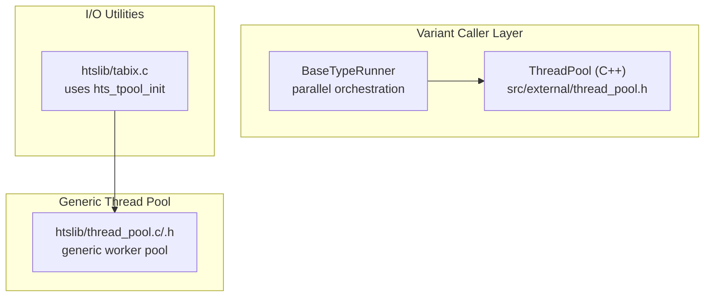
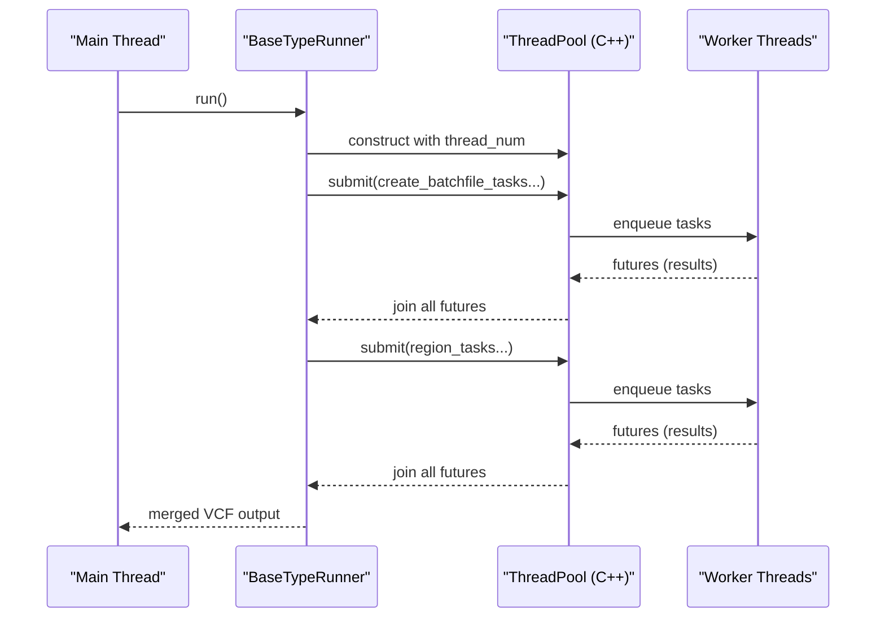
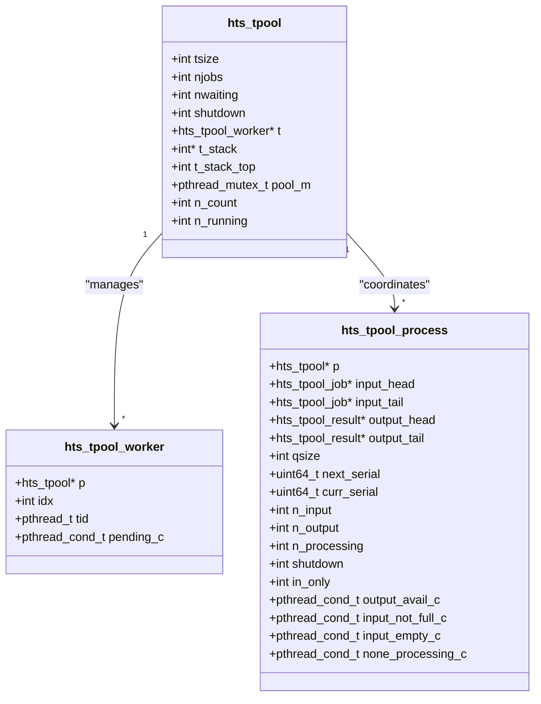
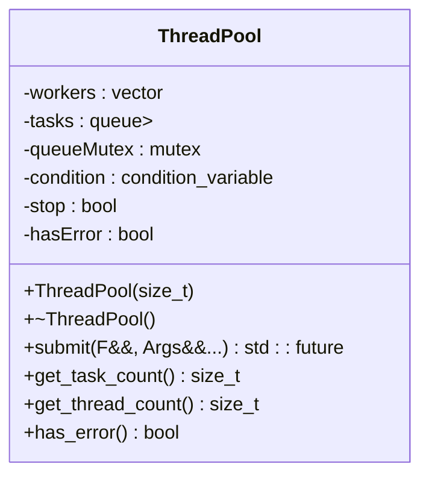
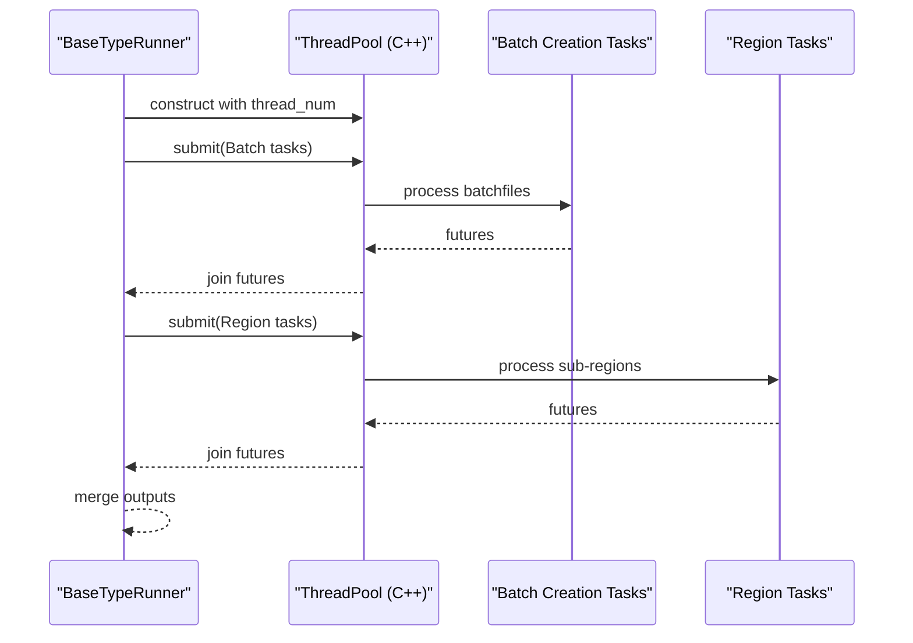
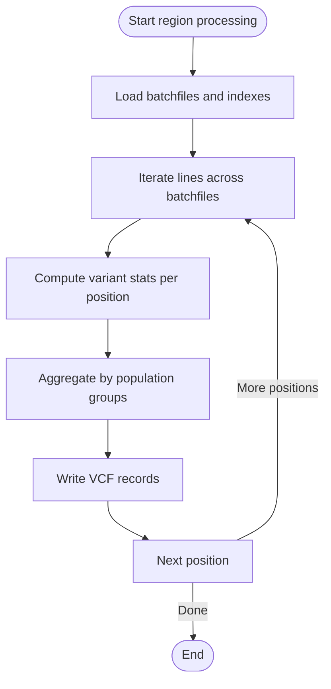
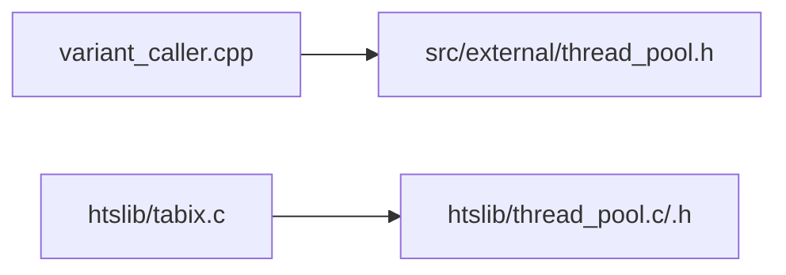

# Parallel Execution Framework

<cite>
**Referenced Files in This Document**
- [thread_pool.h](file://htslib/htslib/thread_pool.h)
- [thread_pool.c](file://htslib/thread_pool.c)
- [thread_pool_internal.h](file://htslib/thread_pool_internal.h)
- [tabix.c](file://htslib/tabix.c)
- [variant_caller.h](file://src/variant_caller.h)
- [variant_caller.cpp](file://src/variant_caller.cpp)
- [caller_utils.h](file://src/caller_utils.h)
- [caller_utils.cpp](file://src/caller_utils.cpp)
- [thread_pool.h](file://src/external/thread_pool.h)
- [test_threadpool.cpp](file://tests/io/test_threadpool.cpp)
</cite>

## Table of Contents
1. [Introduction](#introduction)
2. [Project Structure](#project-structure)
3. [Core Components](#core-components)
4. [Architecture Overview](#architecture-overview)
5. [Detailed Component Analysis](#detailed-component-analysis)
6. [Dependency Analysis](#dependency-analysis)
7. [Performance Considerations](#performance-considerations)
8. [Troubleshooting Guide](#troubleshooting-guide)
9. [Conclusion](#conclusion)

## Introduction
This document explains the parallel execution framework used in variant calling within the BaseVar2 project. It covers the thread pool implementation, task distribution strategies, load balancing mechanisms, and how parallelism is applied to batch processing, region-based analysis, and statistical computations. It also documents thread safety, shared resource management, synchronization primitives, performance optimizations such as dynamic load balancing and memory locality, and debugging/profiling approaches for parallel execution.

## Project Structure
The parallel execution framework spans multiple layers:
- A generic C thread pool (htslib) used by core I/O utilities
- A lightweight C++ thread pool (src/external) used by the variant caller
- The variant caller orchestrates parallel batch creation and region-based variant discovery

**Diagram sources**
- [variant_caller.cpp:342-438](file://src/variant_caller.cpp#L342-L438)
- [tabix.c:206-235](file://htslib/tabix.c#L206-L235)
- [thread_pool.c:721-810](file://htslib/thread_pool.c#L721-L810)

**Section sources**
- [variant_caller.cpp:342-438](file://src/variant_caller.cpp#L342-L438)
- [tabix.c:206-235](file://htslib/tabix.c#L206-L235)
- [thread_pool.h:107-108](file://htslib/htslib/thread_pool.h#L107-L108)

## Core Components
- Generic thread pool (htslib): Provides a reusable worker pool with per-process queues, ordered result delivery, and dynamic load balancing.
- C++ thread pool (src/external): Lightweight wrapper around std::thread with futures for simple task submission and coordination.
- Variant caller orchestrator: Uses the C++ thread pool to parallelize batch creation and region-based variant discovery.

Key capabilities:
- Work distribution across multiple heterogeneous tasks via per-process queues
- Ordered result consumption with strict serial numbering
- Dynamic load balancing to adapt to varying job durations
- Backpressure via bounded queues and condition-variable signaling
- Shutdown and flush semantics for graceful termination

**Section sources**
- [thread_pool.h:98-199](file://htslib/htslib/thread_pool.h#L98-L199)
- [thread_pool.c:514-648](file://htslib/thread_pool.c#L514-L648)
- [thread_pool.c:825-913](file://htslib/thread_pool.c#L825-L913)
- [thread_pool.c:937-995](file://htslib/thread_pool.c#L937-L995)
- [thread_pool_internal.h:100-163](file://htslib/thread_pool_internal.h#L100-L163)
- [thread_pool.h:25-386](file://htslib/htslib/thread_pool.h#L25-L386)
- [thread_pool.h:25-386](file://src/external/thread_pool.h#L25-L137)

## Architecture Overview
The system combines a generic thread pool for I/O-bound tasks and a lightweight C++ thread pool for computation-heavy tasks in the variant caller.

**Diagram sources**
- [variant_caller.cpp:440-495](file://src/variant_caller.cpp#L440-L495)
- [variant_caller.cpp:842-894](file://src/variant_caller.cpp#L842-L894)
- [thread_pool.h:25-137](file://src/external/thread_pool.h#L25-L137)

## Detailed Component Analysis

### Generic Thread Pool (htslib)
The generic thread pool manages:
- A fixed-size set of worker threads
- Multiple per-process queues with bounded input/output buffers
- Strict serial ordering of results via per-queue serial numbers
- Dynamic load balancing to keep throughput high without oversubscription
- Robust shutdown and flush semantics

**Diagram sources**
- [thread_pool_internal.h:136-163](file://htslib/thread_pool_internal.h#L136-L163)
- [thread_pool_internal.h:100-127](file://htslib/thread_pool_internal.h#L100-L127)
- [thread_pool_internal.h:81-86](file://htslib/thread_pool_internal.h#L81-L86)

Key behaviors:
- Worker scanning: Iterates through attached process queues to find eligible jobs (input queue not full and output queue has room).
- Work-stealing: After exhausting a queue, the worker advances to the next queue, enabling dynamic load balancing.
- Dynamic wake-up: When input backlog exceeds a threshold, the pool proactively wakes a waiting worker to maintain saturation.
- Ordered consumption: Results are appended to the output queue with serial numbers and consumed in-order.

**Section sources**
- [thread_pool.c:514-648](file://htslib/thread_pool.c#L514-L648)
- [thread_pool.c:650-713](file://htslib/thread_pool.c#L650-L713)
- [thread_pool.c:825-913](file://htslib/thread_pool.c#L825-L913)
- [thread_pool.c:937-995](file://htslib/thread_pool.c#L937-L995)
- [thread_pool.h:98-199](file://htslib/htslib/thread_pool.h#L98-L199)

### C++ Thread Pool (src/external)
The C++ thread pool provides a minimal wrapper around std::thread with futures:
- Fixed-size thread pool initialized with a configurable number of threads
- Task submission via submit() returning std::future
- Exception propagation and coordinated shutdown

**Diagram sources**
- [thread_pool.h:25-137](file://src/external/thread_pool.h#L25-L137)

Usage in variant caller:
- Parallel batch creation: Splits input files into batches and submits tasks to the C++ thread pool.
- Parallel region-based calling: Splits the calling region into sub-regions and submits tasks to the C++ thread pool.

**Section sources**
- [thread_pool.h:25-137](file://src/external/thread_pool.h#L25-L137)
- [variant_caller.cpp:440-495](file://src/variant_caller.cpp#L440-L495)
- [variant_caller.cpp:842-894](file://src/variant_caller.cpp#L842-L894)

### Variant Caller Parallelization
The variant caller applies parallelism at two levels:
- Batch processing: Parallel creation of batchfiles from input BAM/CRAM files.
- Region-based analysis: Parallel variant discovery across genomic sub-regions.

**Diagram sources**
- [variant_caller.cpp:440-495](file://src/variant_caller.cpp#L440-L495)
- [variant_caller.cpp:842-894](file://src/variant_caller.cpp#L842-L894)

Parallelization strategies:
- Batch creation: Uses a sliding window over input files with a fixed batch size to balance workload and memory usage.
- Region-based calling: Divides the genomic region into equal-sized sub-regions and assigns each to a worker.

Memory locality:
- Each worker processes a contiguous subset of the genome, improving cache locality.
- Batchfiles are indexed with Tabix for efficient random access by sub-region.

**Section sources**
- [variant_caller.cpp:440-495](file://src/variant_caller.cpp#L440-L495)
- [variant_caller.cpp:842-894](file://src/variant_caller.cpp#L842-L894)

### Statistical Computations and Parallelism
Statistical computations (e.g., allele frequency estimation, strand bias) are performed per position and per group. These are distributed across sub-regions, allowing independent processing and aggregation.

**Diagram sources**
- [variant_caller.cpp:934-977](file://src/variant_caller.cpp#L934-L977)
- [caller_utils.cpp:64-127](file://src/caller_utils.cpp#L64-L127)

**Section sources**
- [variant_caller.cpp:934-977](file://src/variant_caller.cpp#L934-L977)
- [caller_utils.cpp:64-127](file://src/caller_utils.cpp#L64-L127)

## Dependency Analysis
- The variant caller depends on the C++ thread pool for task submission and future-based coordination.
- I/O utilities (e.g., tabix) depend on the generic htslib thread pool for parallelized operations.
- Both thread pools coordinate via condition variables and mutexes to manage work distribution and backpressure.

**Diagram sources**
- [variant_caller.cpp:440-495](file://src/variant_caller.cpp#L440-L495)
- [tabix.c:206-235](file://htslib/tabix.c#L206-L235)
- [thread_pool.c:721-810](file://htslib/thread_pool.c#L721-L810)

**Section sources**
- [tabix.c:206-235](file://htslib/tabix.c#L206-L235)
- [thread_pool.h:107-108](file://htslib/htslib/thread_pool.h#L107-L108)

## Performance Considerations
- Dynamic load balancing: The generic thread pool proactively wakes workers when input backlog exceeds a threshold, preventing saturation and maintaining throughput.
- Work-stealing: Workers scan across attached process queues, enabling flexible assignment of heterogeneous tasks.
- Backpressure and bounded queues: Input/output queue sizes cap memory usage and prevent unbounded growth.
- Memory locality: Region-based partitioning improves cache reuse and reduces contention.
- Thread pool sizing: The C++ thread pool size equals the configured number of threads, while the generic pool size is determined by initialization.

[No sources needed since this section provides general guidance]

## Troubleshooting Guide
Common issues and remedies:
- Deadlocks on ordered results: Use non-blocking dispatch when output queues fill up, or separate dispatch/consumption threads.
- Excessive memory usage: Reduce queue sizes or increase region granularity to limit in-flight jobs.
- Uneven load: Adjust thread pool size or region partitioning to balance workload.
- Shutdown hangs: Ensure proper flush and destroy sequences for process queues and thread pools.

Diagnostic techniques:
- Enable debug logging in the generic thread pool to trace worker activity and queue transitions.
- Monitor queue lengths and processing times to identify bottlenecks.
- Profile CPU time versus wall-clock time to assess I/O versus compute dominance.

**Section sources**
- [thread_pool.c:1136-1143](file://htslib/thread_pool.c#L1136-L1143)
- [thread_pool.c:937-995](file://htslib/thread_pool.c#L937-L995)
- [thread_pool.c:1154-1535](file://htslib/thread_pool.c#L1154-L1535)

## Conclusion
The BaseVar2 parallel execution framework combines a robust generic thread pool for I/O-bound tasks and a lightweight C++ thread pool for computation-heavy workloads. Through dynamic load balancing, work-stealing, and ordered result delivery, it achieves scalable and predictable performance for variant calling. Proper configuration of thread counts, queue sizes, and region partitioning enables efficient resource utilization and strong scalability across diverse datasets.