# Pipeline Orchestration

<cite>
**Referenced Files in This Document**
- [main.cpp](file://src/main.cpp)
- [variant_caller.h](file://src/variant_caller.h)
- [variant_caller.cpp](file://src/variant_caller.cpp)
- [basetype.h](file://src/basetype.h)
- [basetype.cpp](file://src/basetype.cpp)
- [caller_utils.h](file://src/caller_utils.h)
- [caller_utils.cpp](file://src/caller_utils.cpp)
- [algorithm.h](file://src/algorithm.h)
- [algorithm.cpp](file://src/algorithm.cpp)
- [thread_pool.h](file://src/external/thread_pool.h)
- [README.md](file://README.md)
</cite>

## Table of Contents
1. [Introduction](#introduction)
2. [Project Structure](#project-structure)
3. [Core Components](#core-components)
4. [Architecture Overview](#architecture-overview)
5. [Detailed Component Analysis](#detailed-component-analysis)
6. [Dependency Analysis](#dependency-analysis)
7. [Performance Considerations](#performance-considerations)
8. [Troubleshooting Guide](#troubleshooting-guide)
9. [Conclusion](#conclusion)

## Introduction
This document explains the variant calling pipeline orchestration system centered around the BaseTypeRunner class. It covers the entire workflow from command-line argument parsing and configuration management to input processing, batch file creation, region-based parallel processing, and output generation. It also details the integration with thread pools for parallel execution and the smart re-run mechanism for efficient batch processing. The document aims to be accessible to users with limited technical background while providing sufficient depth for developers.

## Project Structure
The variant calling pipeline is implemented primarily in the src directory. The main entry point delegates to the BaseTypeRunner class, which orchestrates:
- Argument parsing and configuration
- Reference genome and calling region setup
- Sample identification and population grouping
- Batch file creation from BAM/CRAM inputs
- Region-based parallel variant discovery
- VCF output generation and merging

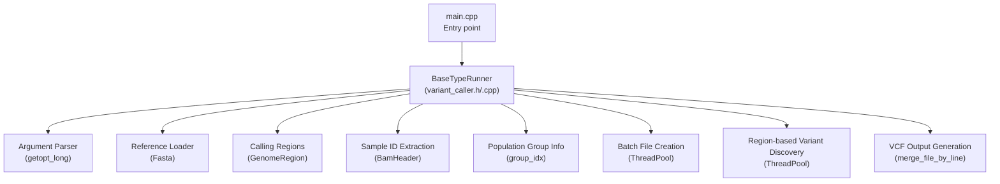

**Diagram sources**
- [main.cpp:43-92](file://src/main.cpp#L43-L92)
- [variant_caller.h:41-174](file://src/variant_caller.h#L41-L174)
- [variant_caller.cpp:50-197](file://src/variant_caller.cpp#L50-L197)

**Section sources**
- [main.cpp:1-93](file://src/main.cpp#L1-L93)
- [README.md:109-147](file://README.md#L109-L147)

## Core Components
- BaseTypeRunner: Central orchestrator managing the entire pipeline lifecycle, including argument parsing, batch creation, parallel region processing, and output generation.
- BaseType: Core statistical model for base likelihood and allele frequency estimation using likelihood ratio tests and EM algorithm.
- Caller Utilities: Data structures and helper functions for alignment records, variant information, VCF record construction, and strand bias calculations.
- Algorithm Library: Mathematical routines for PL calculation, chi-square test, Fisher’s exact test, and EM algorithm for allele frequency estimation.
- Thread Pool: A lightweight C++11 thread pool abstraction enabling parallelization across batch creation and region-based variant discovery.

Key responsibilities:
- Argument parsing and validation
- Reference genome and calling region management
- Sample identification and population grouping
- Batch file creation with Tabix indexing
- Region subdivision and parallel processing
- Variant detection and VCF record emission
- Output merging and indexing

**Section sources**
- [variant_caller.h:41-174](file://src/variant_caller.h#L41-L174)
- [basetype.h:30-143](file://src/basetype.h#L30-L143)
- [caller_utils.h:29-229](file://src/caller_utils.h#L29-L229)
- [algorithm.h:90-177](file://src/algorithm.h#L90-L177)
- [thread_pool.h:25-134](file://src/external/thread_pool.h#L25-L134)

## Architecture Overview
The pipeline follows a staged architecture:
1. Input processing: Parse arguments, load reference, resolve calling regions, extract sample IDs, and load population groups.
2. Batch file creation: For each calling region, slice input BAM/CRAM files into batches and create compressed batch files with Tabix indices.
3. Region-based processing: Subdivide each region into sub-regions and process them in parallel using thread pools.
4. Variant discovery: For each position, aggregate per-sample alignment data, run likelihood ratio testing, and emit VCF records.
5. Output generation: Merge sub-VCF files and create a final indexed VCF.

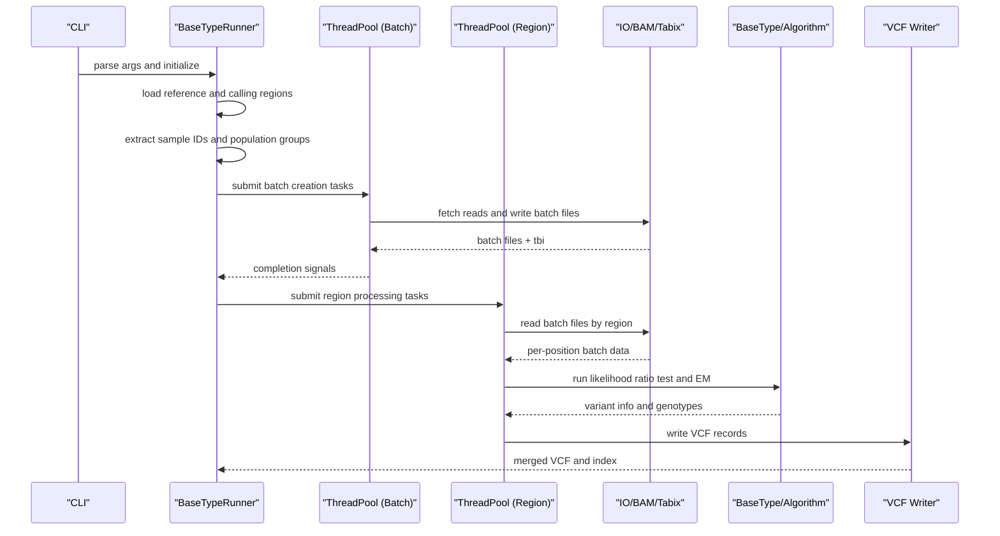

**Diagram sources**
- [variant_caller.cpp:342-438](file://src/variant_caller.cpp#L342-L438)
- [variant_caller.cpp:440-495](file://src/variant_caller.cpp#L440-L495)
- [variant_caller.cpp:842-894](file://src/variant_caller.cpp#L842-L894)
- [variant_caller.cpp:896-977](file://src/variant_caller.cpp#L896-L977)

## Detailed Component Analysis

### BaseTypeRunner: Central Orchestrator
BaseTypeRunner encapsulates the entire pipeline:
- Argument parsing: Uses getopt_long to parse long options and validate ranges.
- Configuration management: Stores runtime parameters and derived settings (e.g., min AF).
- Region management: Converts user-provided regions into GenomeRegion objects or defaults to whole chromosomes.
- Sample and group handling: Extracts sample IDs from filenames or BAM headers and loads population group mappings.
- Batch creation: Creates batch files per region with Tabix indexing, supporting smart re-run by checking existing files.
- Parallel processing: Uses ThreadPool to parallelize batch creation and region-based variant discovery.
- Output generation: Builds VCF headers, writes records, merges sub-VCFs, and creates indexes.

Key methods and responsibilities:
- run(): Top-level orchestration for region iteration, batch creation, variant discovery, and output merging.
- _create_batchfiles(): Splits input files into batches and creates compressed batch files with Tabix indices.
- _variants_discovery(): Subdivides regions and processes them in parallel.
- _variant_calling_unit(): Reads batch files by region, aggregates per-position data, and emits VCF records.
- _basevar_caller(): Drives variant detection per position using BaseType and caller utilities.
- _basetype_caller_unit(): Aggregates per-sample data and runs likelihood ratio testing.
- _get_pos_variant_info() and _vcfrecord_in_pos(): Build VariantInfo and construct VCFRecord.

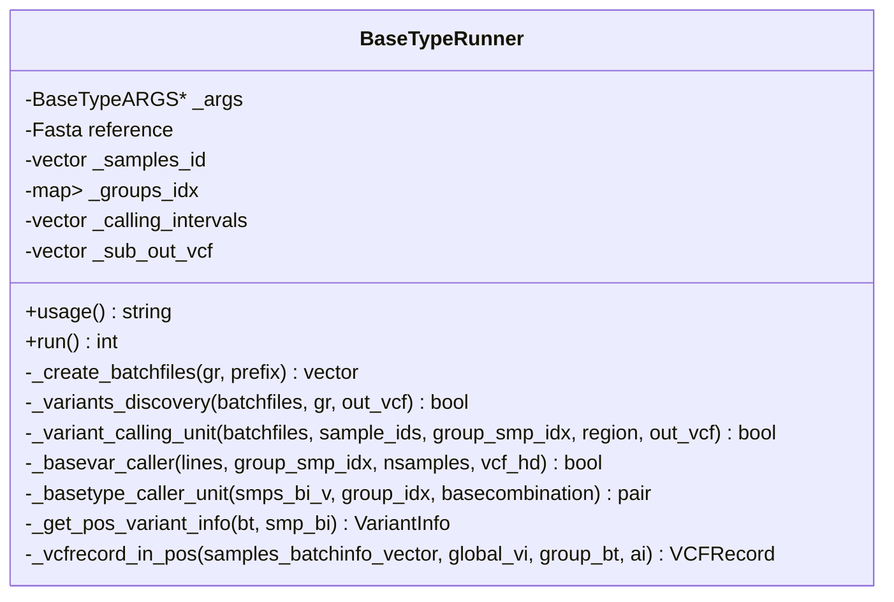

**Diagram sources**
- [variant_caller.h:41-174](file://src/variant_caller.h#L41-L174)
- [variant_caller.cpp:342-438](file://src/variant_caller.cpp#L342-L438)

**Section sources**
- [variant_caller.h:41-174](file://src/variant_caller.h#L41-L174)
- [variant_caller.cpp:50-197](file://src/variant_caller.cpp#L50-L197)
- [variant_caller.cpp:342-438](file://src/variant_caller.cpp#L342-L438)
- [variant_caller.cpp:440-495](file://src/variant_caller.cpp#L440-L495)
- [variant_caller.cpp:842-894](file://src/variant_caller.cpp#L842-L894)
- [variant_caller.cpp:896-977](file://src/variant_caller.cpp#L896-L977)
- [variant_caller.cpp:1008-1146](file://src/variant_caller.cpp#L1008-L1146)
- [variant_caller.cpp:1148-1186](file://src/variant_caller.cpp#L1148-L1186)
- [variant_caller.cpp:1188-1217](file://src/variant_caller.cpp#L1188-L1217)
- [variant_caller.cpp:1219-1302](file://src/variant_caller.cpp#L1219-L1302)

### BaseType: Statistical Model for Allele Frequency Estimation
BaseType performs:
- Initialization from per-sample alignment data aggregated into BatchInfo.
- Base likelihood computation and EM algorithm updates.
- Likelihood ratio testing to select active alleles and compute variant quality.
- Frequency estimation and depth tracking per base.

Core methods:
- lrt(): Performs likelihood ratio testing across combinations of active bases.
- get_* accessors: Retrieve reference position, active bases, depths, and frequencies.

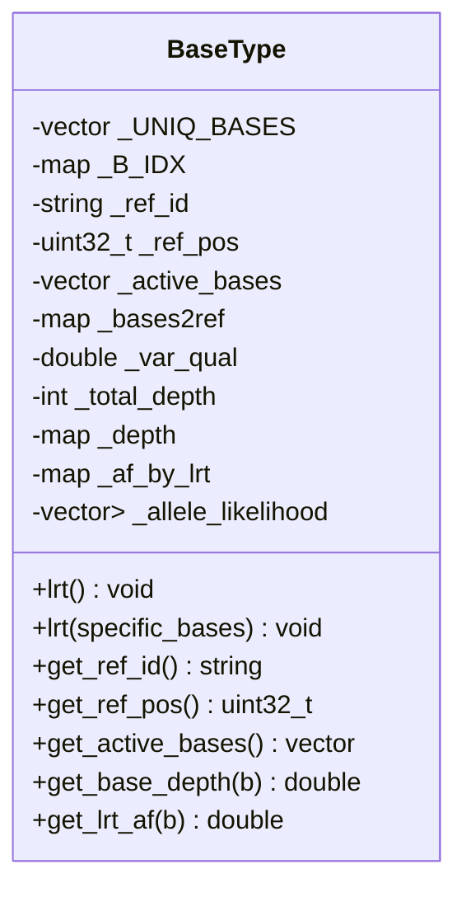

**Diagram sources**
- [basetype.h:30-143](file://src/basetype.h#L30-L143)
- [basetype.cpp:14-76](file://src/basetype.cpp#L14-L76)
- [basetype.cpp:137-210](file://src/basetype.cpp#L137-L210)

**Section sources**
- [basetype.h:30-143](file://src/basetype.h#L30-L143)
- [basetype.cpp:14-76](file://src/basetype.cpp#L14-L76)
- [basetype.cpp:137-210](file://src/basetype.cpp#L137-L210)

### Caller Utilities: Data Structures and Helpers
Provides:
- AlignBase, AlignInfo, PosMap, PosMapVector for per-position alignment aggregation.
- VariantInfo for storing per-position variant statistics.
- AlleleInfo for normalized REF/ALT representation and strand bias metrics.
- VCFRecord for constructing VCF lines with INFO and FORMAT fields.
- Helper functions for strand bias calculation, PL computation, and file merging.

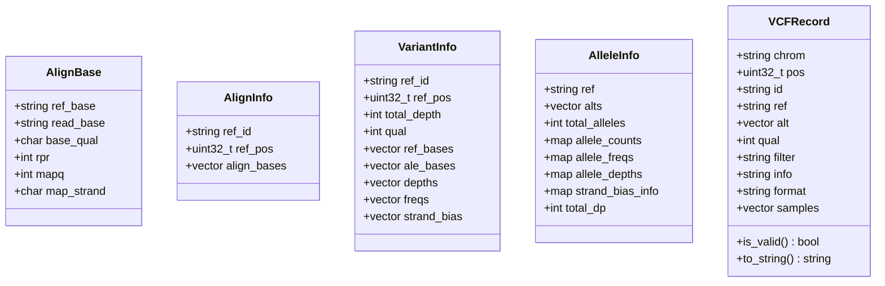

**Diagram sources**
- [caller_utils.h:29-229](file://src/caller_utils.h#L29-L229)

**Section sources**
- [caller_utils.h:29-229](file://src/caller_utils.h#L29-L229)
- [caller_utils.cpp:64-127](file://src/caller_utils.cpp#L64-L127)
- [caller_utils.cpp:144-200](file://src/caller_utils.cpp#L144-L200)
- [caller_utils.cpp:217-262](file://src/caller_utils.cpp#L217-L262)

### Algorithm Library: Mathematical Foundations
Implements:
- PL calculation for genotypes given reference and alternate alleles.
- Chi-square test and Fisher’s exact test for statistical inference.
- EM algorithm for allele frequency estimation with posterior probabilities.
- Utility functions for argmin/argmax, sums, means, and standard deviations.

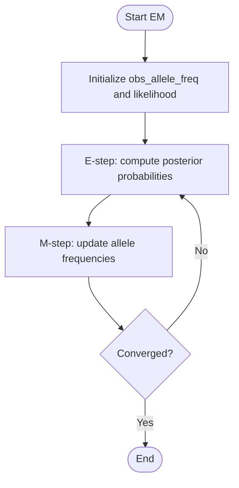

**Diagram sources**
- [algorithm.cpp:194-292](file://src/algorithm.cpp#L194-L292)

**Section sources**
- [algorithm.h:90-177](file://src/algorithm.h#L90-L177)
- [algorithm.cpp:12-88](file://src/algorithm.cpp#L12-L88)
- [algorithm.cpp:194-292](file://src/algorithm.cpp#L194-L292)

### Thread Pool: Parallel Execution
A simple C++11 thread pool that:
- Maintains a queue of tasks and worker threads.
- Provides submit() to enqueue callable tasks and returns futures.
- Handles exceptions by stopping and signaling errors.
- Supports querying task and thread counts.

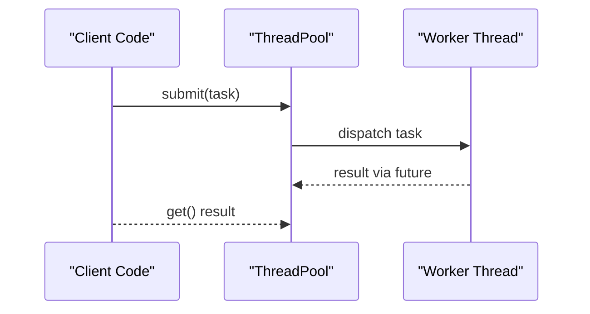

**Diagram sources**
- [thread_pool.h:25-134](file://src/external/thread_pool.h#L25-L134)

**Section sources**
- [thread_pool.h:25-134](file://src/external/thread_pool.h#L25-L134)

### Pipeline Stages and Data Flow

#### Stage 1: Input Processing and Configuration
- Command-line parsing with getopt_long and validation.
- Reference genome loading and calling region resolution.
- Sample ID extraction from filenames or BAM headers.
- Population group mapping for stratified AF calculation.

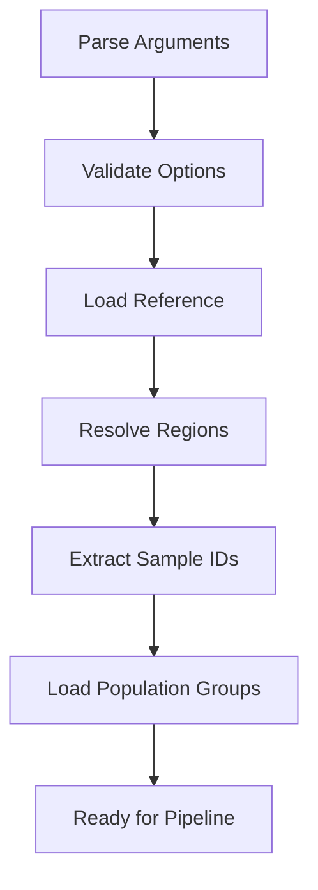

**Diagram sources**
- [variant_caller.cpp:50-197](file://src/variant_caller.cpp#L50-L197)
- [variant_caller.cpp:252-300](file://src/variant_caller.cpp#L252-L300)
- [variant_caller.cpp:199-250](file://src/variant_caller.cpp#L199-L250)
- [variant_caller.cpp:302-340](file://src/variant_caller.cpp#L302-L340)

**Section sources**
- [variant_caller.cpp:50-197](file://src/variant_caller.cpp#L50-L197)
- [variant_caller.cpp:252-300](file://src/variant_caller.cpp#L252-L300)
- [variant_caller.cpp:199-250](file://src/variant_caller.cpp#L199-L250)
- [variant_caller.cpp:302-340](file://src/variant_caller.cpp#L302-L340)

#### Stage 2: Batch File Creation
- Slice input files into batches according to batch-count.
- For each batch, create a compressed batch file with Tabix index.
- Smart re-run checks existing batchfiles and skip creation when present.

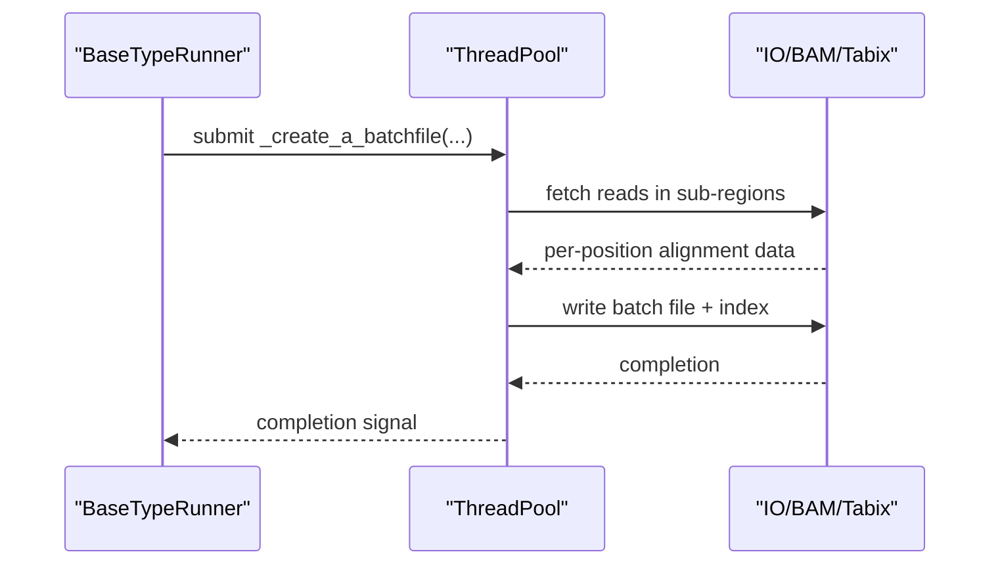

**Diagram sources**
- [variant_caller.cpp:440-495](file://src/variant_caller.cpp#L440-L495)
- [variant_caller.cpp:497-561](file://src/variant_caller.cpp#L497-L561)

**Section sources**
- [variant_caller.cpp:440-495](file://src/variant_caller.cpp#L440-L495)
- [variant_caller.cpp:497-561](file://src/variant_caller.cpp#L497-L561)

#### Stage 3: Region-Based Processing
- Subdivide each region into sub-regions sized by thread count.
- Parallelize per-sub-region processing using thread pool.
- Read batch files by region and process per-position data.

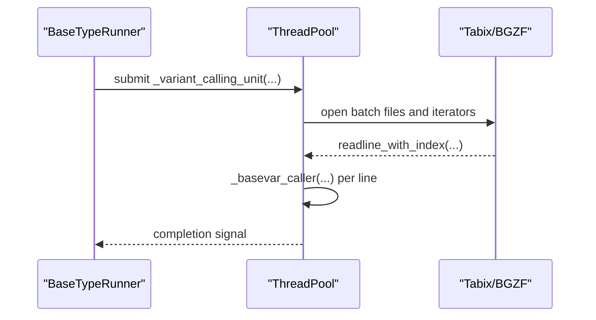

**Diagram sources**
- [variant_caller.cpp:842-894](file://src/variant_caller.cpp#L842-L894)
- [variant_caller.cpp:896-977](file://src/variant_caller.cpp#L896-L977)

**Section sources**
- [variant_caller.cpp:842-894](file://src/variant_caller.cpp#L842-L894)
- [variant_caller.cpp:896-977](file://src/variant_caller.cpp#L896-L977)

#### Stage 4: Variant Discovery and Output
- Aggregate per-position alignment data from batch files.
- Run likelihood ratio testing and EM to estimate allele frequencies.
- Construct VCF records with INFO and FORMAT fields.
- Merge sub-VCF files and create index.

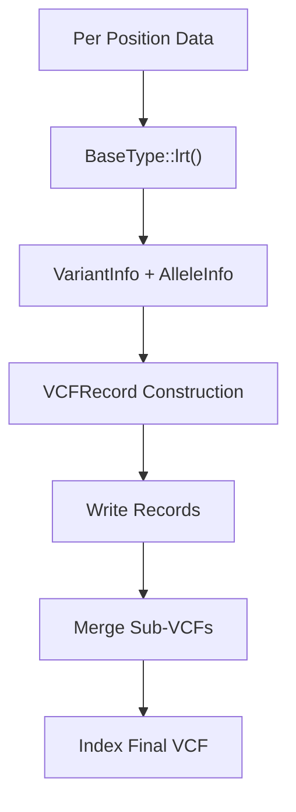

**Diagram sources**
- [variant_caller.cpp:1008-1146](file://src/variant_caller.cpp#L1008-L1146)
- [variant_caller.cpp:1148-1186](file://src/variant_caller.cpp#L1148-L1186)
- [variant_caller.cpp:1188-1217](file://src/variant_caller.cpp#L1188-L1217)
- [variant_caller.cpp:1219-1302](file://src/variant_caller.cpp#L1219-L1302)
- [variant_caller.cpp:424-432](file://src/variant_caller.cpp#L424-L432)

**Section sources**
- [variant_caller.cpp:1008-1146](file://src/variant_caller.cpp#L1008-L1146)
- [variant_caller.cpp:1148-1186](file://src/variant_caller.cpp#L1148-L1186)
- [variant_caller.cpp:1188-1217](file://src/variant_caller.cpp#L1188-L1217)
- [variant_caller.cpp:1219-1302](file://src/variant_caller.cpp#L1219-L1302)
- [variant_caller.cpp:424-432](file://src/variant_caller.cpp#L424-L432)

## Dependency Analysis
The pipeline exhibits layered dependencies:
- Entry point depends on BaseTypeRunner.
- BaseTypeRunner depends on IO utilities, algorithm library, and thread pool.
- Caller utilities depend on algorithm library and IO helpers.
- BaseType depends on algorithm library and combinatorics for base combinations.

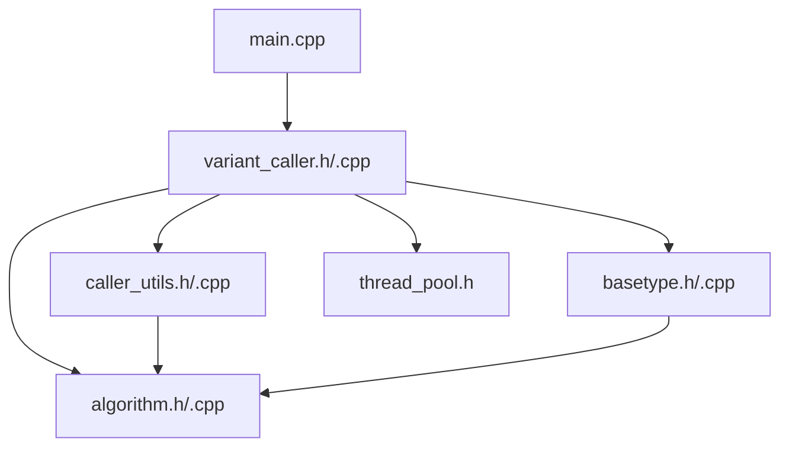

**Diagram sources**
- [main.cpp:13-15](file://src/main.cpp#L13-L15)
- [variant_caller.h:28-33](file://src/variant_caller.h#L28-L33)
- [basetype.h:19-22](file://src/basetype.h#L19-L22)
- [caller_utils.h:21-27](file://src/caller_utils.h#L21-L27)
- [algorithm.h:15-27](file://src/algorithm.h#L15-L27)

**Section sources**
- [main.cpp:13-15](file://src/main.cpp#L13-L15)
- [variant_caller.h:28-33](file://src/variant_caller.h#L28-L33)
- [basetype.h:19-22](file://src/basetype.h#L19-L22)
- [caller_utils.h:21-27](file://src/caller_utils.h#L21-L27)
- [algorithm.h:15-27](file://src/algorithm.h#L15-L27)

## Performance Considerations
- Memory footprint: The pipeline controls memory by processing regions in chunks and limiting per-batch region size during batch file creation.
- Parallelism: Two thread pools enable parallel batch creation and region-based processing, scaling with available cores.
- I/O efficiency: Batch files are compressed and indexed, enabling fast random access by region.
- Computational cost: Likelihood ratio testing and EM iterations are performed per position; thresholds and batch sizes influence runtime.
- Smart re-run: Existing batch files and indices are reused to avoid redundant computation.

[No sources needed since this section provides general guidance]

## Troubleshooting Guide
Common issues and remedies:
- Invalid arguments: Ensure required options (-f/--reference, -o/--output-vcf) and valid ranges are provided.
- Missing sample IDs: Verify BAM headers or use --filename-has-samplename to derive IDs from filenames.
- Index building failures: Confirm batch files are bgzip-compressed and Tabix index can be built.
- Empty regions: The pipeline warns when no variants are found in a region.
- Duplicate samples: The pipeline detects and reports duplicates in sample IDs.

**Section sources**
- [variant_caller.cpp:130-149](file://src/variant_caller.cpp#L130-L149)
- [variant_caller.cpp:229-231](file://src/variant_caller.cpp#L229-L231)
- [variant_caller.cpp:544-549](file://src/variant_caller.cpp#L544-L549)
- [variant_caller.cpp:387-389](file://src/variant_caller.cpp#L387-L389)

## Conclusion
The BaseTypeRunner class serves as the central coordinator for BaseVar’s variant calling pipeline. It integrates argument parsing, configuration management, parallel batch creation, region-based processing, and VCF output generation. The system leverages thread pools for efficient parallelization, employs robust statistical models for allele frequency estimation, and provides mechanisms for smart re-run and memory control. Together, these components deliver a scalable and reliable pipeline for variant discovery from ultra-low-pass WGS data.