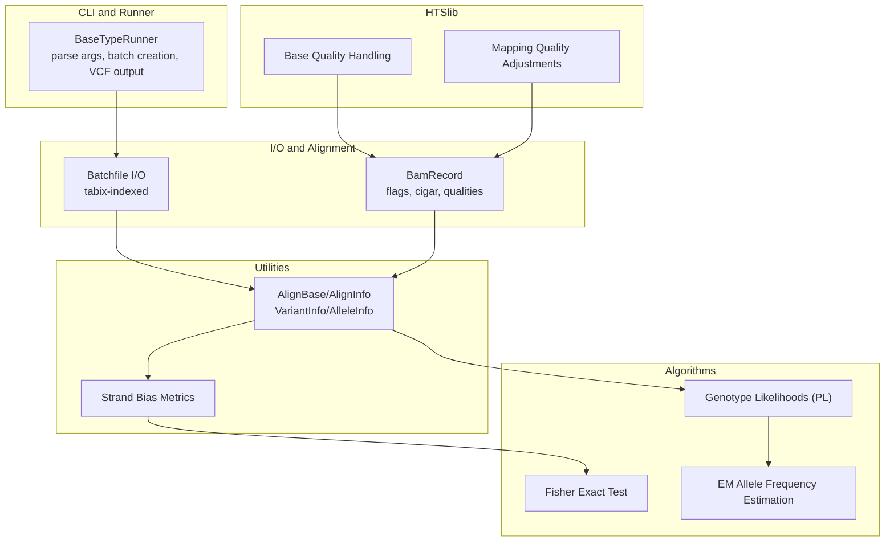
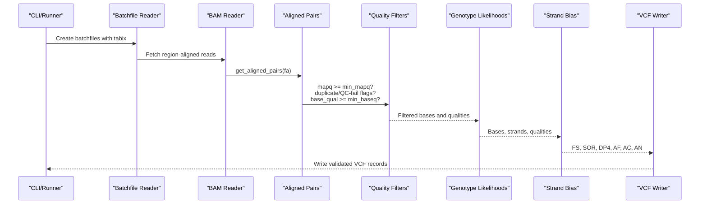
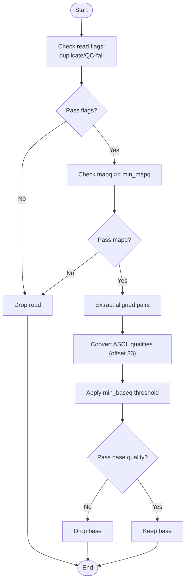
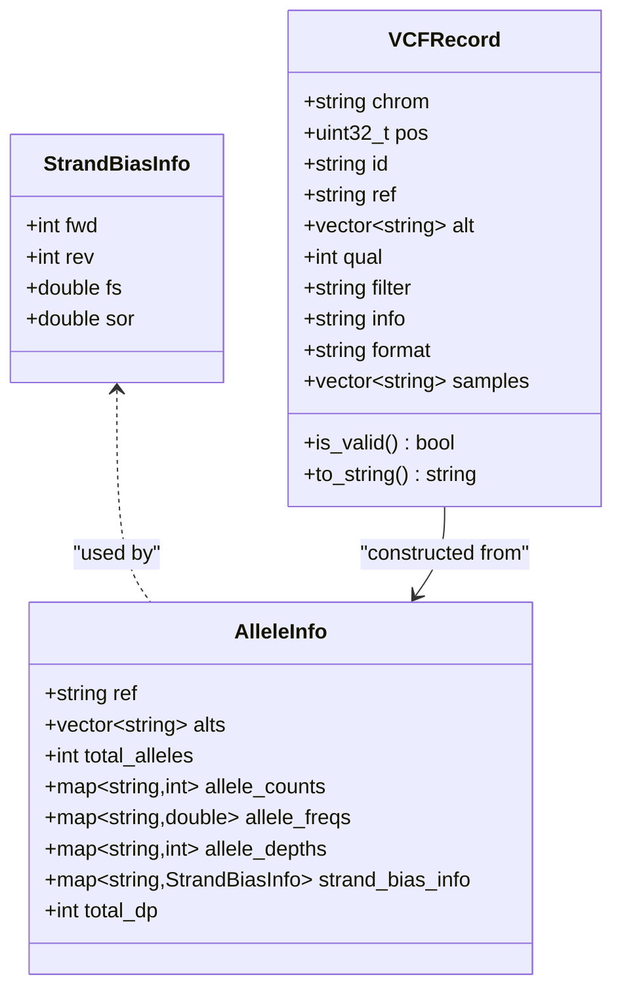
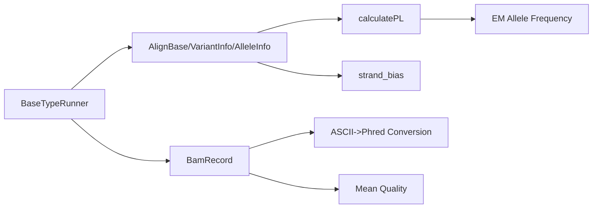

# Quality Control and Filtering

<cite>
**Referenced Files in This Document**
- [variant_caller.h](file://src/variant_caller.h)
- [variant_caller.cpp](file://src/variant_caller.cpp)
- [caller_utils.h](file://src/caller_utils.h)
- [caller_utils.cpp](file://src/caller_utils.cpp)
- [algorithm.h](file://src/algorithm.h)
- [algorithm.cpp](file://src/algorithm.cpp)
- [bam_record.h](file://src/io/bam_record.h)
- [bam_record.cpp](file://src/io/bam_record.cpp)
- [realn.c](file://htslib/realn.c)
</cite>

## Table of Contents
1. [Introduction](#introduction)
2. [Project Structure](#project-structure)
3. [Core Components](#core-components)
4. [Architecture Overview](#architecture-overview)
5. [Detailed Component Analysis](#detailed-component-analysis)
6. [Dependency Analysis](#dependency-analysis)
7. [Performance Considerations](#performance-considerations)
8. [Troubleshooting Guide](#troubleshooting-guide)
9. [Conclusion](#conclusion)

## Introduction
This document explains the quality control and filtering mechanisms in the variant calling engine. It covers:
- Base quality filtering and mapping quality thresholds
- Minimum allele frequency settings and their role in variant calling
- Base quality score handling, including ASCII-to-numeric conversion
- Filtering criteria for reads, bases, and variants
- Quality metric calculations and validation processes
- The relationship between quality parameters and variant calling accuracy
- Common quality control scenarios and their impact on downstream analysis

## Project Structure
The quality control pipeline spans several modules:
- CLI and runner: parses parameters, manages batching, and orchestrates variant discovery
- I/O and alignment: reads BAM/CRAM, extracts aligned pairs, and applies read-level filters
- Utilities: defines data structures for alignment and variant records, computes strand bias metrics
- Algorithms: computes genotype likelihoods, Fisher’s exact test, and EM-based allele frequency estimation
- HTSlib integration: provides base quality handling and mapping quality adjustments

**Diagram sources**
- [variant_caller.cpp:563-757](file://src/variant_caller.cpp#L563-L757)
- [caller_utils.h:29-122](file://src/caller_utils.h#L29-L122)
- [caller_utils.cpp:9-62](file://src/caller_utils.cpp#L9-L62)
- [algorithm.cpp:12-88](file://src/algorithm.cpp#L12-L88)
- [algorithm.h:90-136](file://src/algorithm.h#L90-L136)
- [bam_record.h:120-177](file://src/io/bam_record.h#L120-L177)
- [bam_record.cpp:313-338](file://src/io/bam_record.cpp#L313-L338)
- [realn.c:39-319](file://htslib/realn.c#L39-L319)

**Section sources**
- [variant_caller.h:41-174](file://src/variant_caller.h#L41-L174)
- [variant_caller.cpp:563-757](file://src/variant_caller.cpp#L563-L757)
- [caller_utils.h:29-122](file://src/caller_utils.h#L29-L122)
- [caller_utils.cpp:9-62](file://src/caller_utils.cpp#L9-L62)
- [algorithm.h:90-136](file://src/algorithm.h#L90-L136)
- [algorithm.cpp:12-88](file://src/algorithm.cpp#L12-L88)
- [bam_record.h:120-177](file://src/io/bam_record.h#L120-L177)
- [bam_record.cpp:313-338](file://src/io/bam_record.cpp#L313-L338)
- [realn.c:39-319](file://htslib/realn.c#L39-L319)

## Core Components
- Quality thresholds and defaults:
  - Minimum base quality: default 10
  - Minimum mapping quality: default 5
  - Minimum allele frequency (MAF): default 0.001, adjusted to a data-driven bound
- Read-level filtering:
  - Exclude duplicates and QC-failed reads
  - Exclude secondary and supplementary alignments
  - Apply mapping quality threshold
- Base-level filtering:
  - Exclude bases below minimum base quality
  - Convert ASCII quality scores to numeric using offset 33
- Variant-level filtering and validation:
  - VCF record validation (required fields, REF validity)
  - Strand bias metrics (Fisher’s exact test and Symmetric Odds Ratio)
  - Genotype likelihood computation (PL) and GQ derivation

**Section sources**
- [variant_caller.h:44-71](file://src/variant_caller.h#L44-L71)
- [variant_caller.cpp:137-148](file://src/variant_caller.cpp#L137-L148)
- [variant_caller.cpp:589-702](file://src/variant_caller.cpp#L589-L702)
- [caller_utils.cpp:142-166](file://src/caller_utils.cpp#L142-L166)
- [algorithm.cpp:12-88](file://src/algorithm.cpp#L12-L88)

## Architecture Overview
End-to-end flow from input alignments to validated VCF records:
1. Parse CLI arguments and initialize thresholds
2. Create batchfiles with tabix indices
3. Fetch reads in genomic windows, apply read filters, and extract aligned pairs
4. Compute base qualities and indel qualities, apply base filters
5. Aggregate per-position evidence, estimate allele frequencies, and compute strand bias
6. Derive PL and GQ, construct VCF records, and validate outputs

**Diagram sources**
- [variant_caller.cpp:563-757](file://src/variant_caller.cpp#L563-L757)
- [variant_caller.cpp:1008-1146](file://src/variant_caller.cpp#L1008-L1146)
- [caller_utils.cpp:9-62](file://src/caller_utils.cpp#L9-L62)
- [algorithm.cpp:12-88](file://src/algorithm.cpp#L12-L88)
- [bam_record.cpp:212-278](file://src/io/bam_record.cpp#L212-L278)

**Section sources**
- [variant_caller.cpp:563-757](file://src/variant_caller.cpp#L563-L757)
- [variant_caller.cpp:1008-1146](file://src/variant_caller.cpp#L1008-L1146)
- [caller_utils.cpp:9-62](file://src/caller_utils.cpp#L9-L62)
- [algorithm.cpp:12-88](file://src/algorithm.cpp#L12-L88)
- [bam_record.cpp:212-278](file://src/io/bam_record.cpp#L212-L278)

## Detailed Component Analysis

### Base Quality Filtering and ASCII Conversion
- Base quality filtering:
  - Reads failing QC or marked duplicate are excluded
  - Mapping quality below threshold are skipped
  - Base quality below threshold are skipped
- ASCII-to-numeric conversion:
  - Base qualities are stored as ASCII characters in alignments
  - Conversion uses an offset of 33 to obtain numeric Phred scores
  - Indel qualities are computed as mean per-read qualities and converted similarly

**Diagram sources**
- [variant_caller.cpp:589-702](file://src/variant_caller.cpp#L589-L702)
- [bam_record.cpp:313-338](file://src/io/bam_record.cpp#L313-L338)

**Section sources**
- [variant_caller.cpp:589-702](file://src/variant_caller.cpp#L589-L702)
- [bam_record.cpp:313-338](file://src/io/bam_record.cpp#L313-L338)

### Mapping Quality Thresholds
- Read-level thresholds:
  - Duplicate and QC-failed reads are discarded
  - Secondary and supplementary alignments are ignored
  - Only reads with mapq >= min_mapq are considered
- Windowed processing:
  - Regions are processed in chunks to manage memory and improve throughput

**Section sources**
- [variant_caller.cpp:589-604](file://src/variant_caller.cpp#L589-L604)
- [variant_caller.cpp:524-540](file://src/variant_caller.cpp#L524-L540)

### Minimum Allele Frequency Settings
- Parameter behavior:
  - min_af default is 0.001
  - Automatically adjusted to min(0.001, 100 / number_of_samples)
- Role in variant calling:
  - Guides effective caller positions and allele frequency estimation
  - Used by the LRT-based estimator to compute AF and CAF

**Section sources**
- [variant_caller.h:49-71](file://src/variant_caller.h#L49-L71)
- [variant_caller.cpp:184-186](file://src/variant_caller.cpp#L184-L186)
- [variant_caller.cpp:1176-1183](file://src/variant_caller.cpp#L1176-L1183)

### Base Quality Score Handling for Indels
- Indel quality computation:
  - For insertions: mean of per-base qualities across the inserted sequence
  - For deletions: mean of per-base qualities across the deleted sequence
- Quality encoding:
  - Numeric qualities converted back to ASCII using offset 33 for storage and output

**Section sources**
- [variant_caller.cpp:675-694](file://src/variant_caller.cpp#L675-L694)
- [variant_caller.cpp](file://src/variant_caller.cpp#L702)

### Filtering Criteria for Reads, Bases, and Variants
- Read-level:
  - Exclude duplicates, QC-fail, secondary, supplementary
  - Require mapq >= min_mapq
- Base-level:
  - Require base quality >= min_baseq
  - Convert ASCII qualities using offset 33
- Variant-level:
  - Validate VCF record fields and REF validity
  - Compute strand bias (FS, SOR) and DP4
  - Derive GQ from second-best PL

**Section sources**
- [variant_caller.cpp:589-702](file://src/variant_caller.cpp#L589-L702)
- [caller_utils.h:142-166](file://src/caller_utils.h#L142-L166)
- [caller_utils.cpp:144-200](file://src/caller_utils.cpp#L144-L200)

### Quality Metrics Calculation and Validation
- Strand bias:
  - Fisher’s exact test and Symmetric Odds Ratio computed per allele
- Genotype likelihoods:
  - PL computed from base qualities and emission probabilities
  - GQ set as second-best PL
- VCF validation:
  - Checks required fields and REF validity; skips invalid records

**Diagram sources**
- [caller_utils.h:61-122](file://src/caller_utils.h#L61-L122)
- [caller_utils.cpp:9-62](file://src/caller_utils.cpp#L9-L62)
- [caller_utils.cpp:142-200](file://src/caller_utils.cpp#L142-L200)

**Section sources**
- [caller_utils.cpp:9-62](file://src/caller_utils.cpp#L9-L62)
- [caller_utils.cpp:144-200](file://src/caller_utils.cpp#L144-L200)
- [algorithm.cpp:12-88](file://src/algorithm.cpp#L12-L88)

### Relationship Between Quality Parameters and Accuracy
- Lower min_mapq increases noise from poor alignments; improves sensitivity at cost of specificity
- Lower min_baseq increases false positives; raising it reduces false positives but may miss true variants
- min_af affects detection power for rare variants; too high may suppress real rare events
- Proper base quality conversion ensures accurate PL and GQ, reducing genotyping errors

**Section sources**
- [variant_caller.h:49-71](file://src/variant_caller.h#L49-L71)
- [variant_caller.cpp:137-148](file://src/variant_caller.cpp#L137-L148)
- [algorithm.cpp:12-88](file://src/algorithm.cpp#L12-L88)

### Common Quality Control Scenarios and Downstream Impact
- High duplicate rate:
  - Leads to excessive duplicate filtering; consider library prep optimization
- Low mapping quality:
  - Increase min_mapq; assess aligner settings or enrichment strategy
- Low base quality:
  - Increase min_baseq; review sequencing chemistry and trimming
- Strand bias signals:
  - Investigate potential PCR or sequencing artifacts; consider filtering or targeted validation
- VCF validation failures:
  - Check REF formatting and ALT uniqueness; ensure consistent normalization

**Section sources**
- [variant_caller.cpp:589-702](file://src/variant_caller.cpp#L589-L702)
- [caller_utils.h:142-166](file://src/caller_utils.h#L142-L166)
- [caller_utils.cpp:144-200](file://src/caller_utils.cpp#L144-L200)

## Dependency Analysis
Key dependencies among modules:
- Runner depends on I/O and alignment modules to gather per-position evidence
- Utilities define data structures consumed by algorithms and used for VCF construction
- Algorithms rely on HTSlib-provided quality and alignment utilities

**Diagram sources**
- [variant_caller.cpp:563-757](file://src/variant_caller.cpp#L563-L757)
- [caller_utils.h:29-122](file://src/caller_utils.h#L29-L122)
- [caller_utils.cpp:144-200](file://src/caller_utils.cpp#L144-L200)
- [algorithm.cpp:12-88](file://src/algorithm.cpp#L12-L88)
- [bam_record.cpp:313-338](file://src/io/bam_record.cpp#L313-L338)

**Section sources**
- [variant_caller.cpp:563-757](file://src/variant_caller.cpp#L563-L757)
- [caller_utils.h:29-122](file://src/caller_utils.h#L29-L122)
- [caller_utils.cpp:144-200](file://src/caller_utils.cpp#L144-L200)
- [algorithm.cpp:12-88](file://src/algorithm.cpp#L12-L88)
- [bam_record.cpp:313-338](file://src/io/bam_record.cpp#L313-L338)

## Performance Considerations
- Memory control:
  - Batched processing with windowed regions prevents excessive memory usage
- Parallelization:
  - Multi-threaded batch creation and variant calling improve throughput
- Quality filtering early:
  - Reduces downstream computational load by discarding low-quality data early

[No sources needed since this section provides general guidance]

## Troubleshooting Guide
- Missing sample IDs:
  - Ensure RG tags are present or enable filename-based sample name extraction
- Index/build issues:
  - Verify batchfiles and VCFs are bgzip-compressed and indexed appropriately
- Unexpected no-variants regions:
  - Check min_mapq and min_baseq thresholds; confirm coverage and region selection
- Strand bias warnings:
  - Investigate potential PCR/sequencing artifacts; consider additional filtering
- VCF validation errors:
  - Confirm REF validity and ALT uniqueness; ensure normalization is applied

**Section sources**
- [variant_caller.cpp:199-250](file://src/variant_caller.cpp#L199-L250)
- [variant_caller.cpp:427-432](file://src/variant_caller.cpp#L427-L432)
- [caller_utils.h:142-166](file://src/caller_utils.h#L142-L166)

## Conclusion
The variant caller enforces robust quality control at read, base, and variant levels. By combining strict filtering thresholds, accurate base quality handling, and validated metrics (strand bias, PL/GQ), it produces reliable variant calls suitable for downstream analyses. Tuning min_mapq, min_baseq, and min_af balances sensitivity and specificity, while proper indexing and batched processing ensure scalable performance.