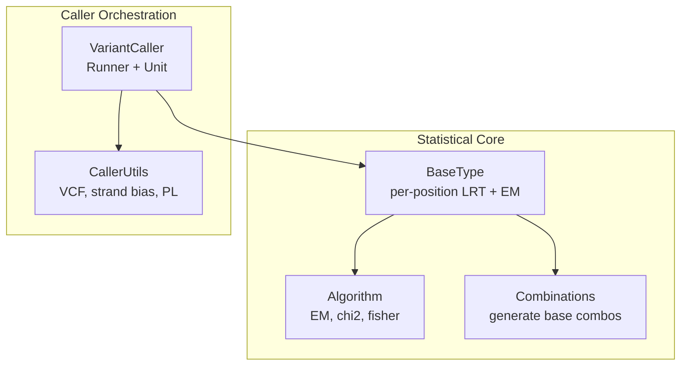
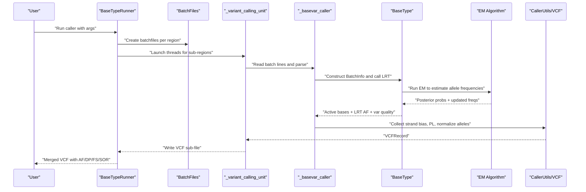
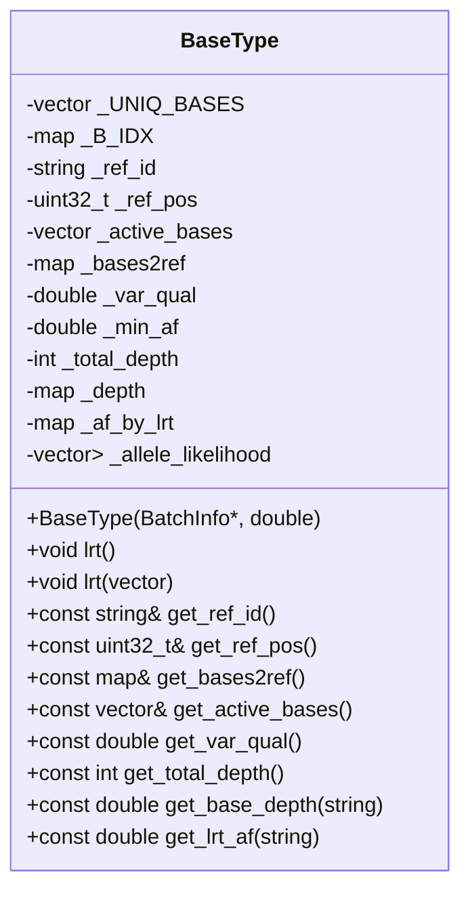
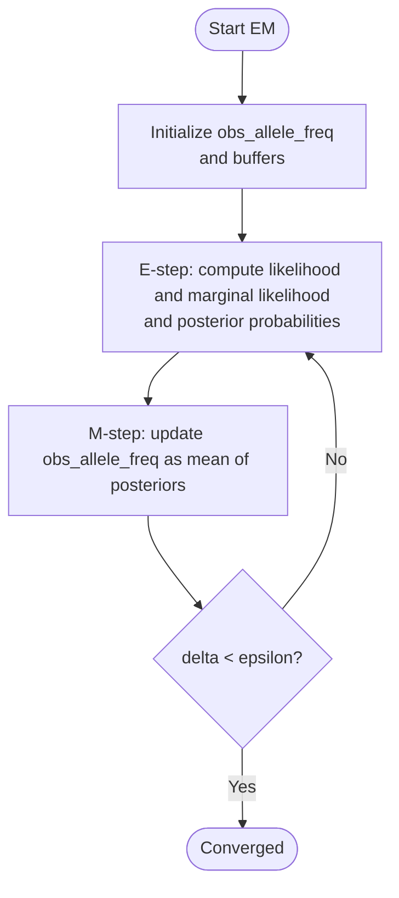
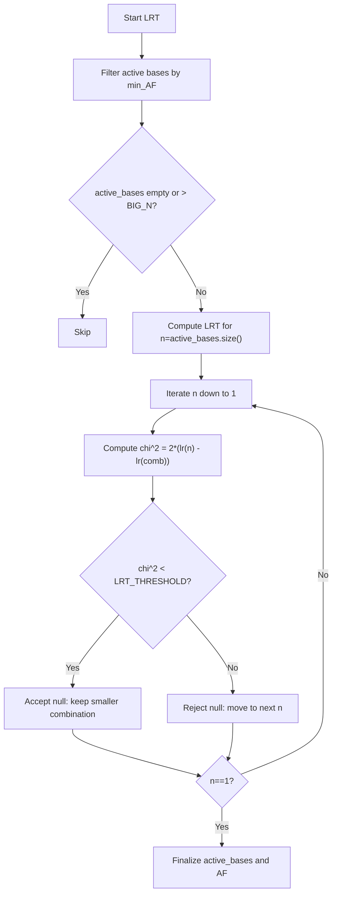
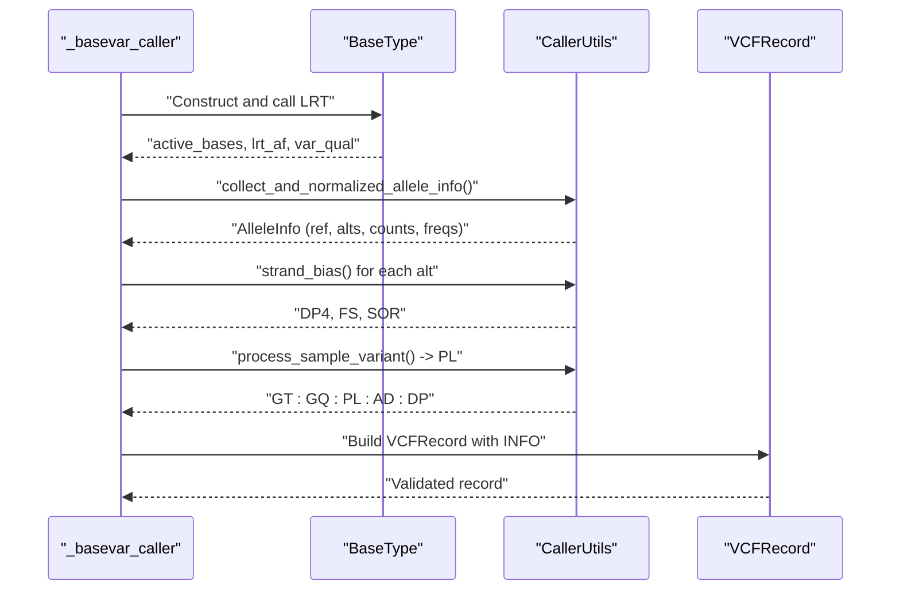
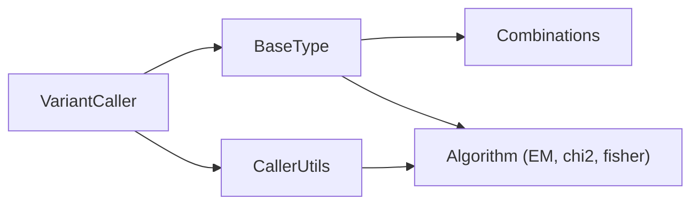

# Statistical Analysis Core

<cite>
**Referenced Files in This Document**
- [README.md](file://README.md)
- [src/basetype.h](file://src/basetype.h)
- [src/basetype.cpp](file://src/basetype.cpp)
- [src/algorithm.h](file://src/algorithm.h)
- [src/algorithm.cpp](file://src/algorithm.cpp)
- [src/variant_caller.h](file://src/variant_caller.h)
- [src/variant_caller.cpp](file://src/variant_caller.cpp)
- [src/caller_utils.h](file://src/caller_utils.h)
- [src/caller_utils.cpp](file://src/caller_utils.cpp)
- [src/external/combinations.h](file://src/external/combinations.h)
</cite>

## Table of Contents
1. [Introduction](#introduction)
2. [Project Structure](#project-structure)
3. [Core Components](#core-components)
4. [Architecture Overview](#architecture-overview)
5. [Detailed Component Analysis](#detailed-component-analysis)
6. [Dependency Analysis](#dependency-analysis)
7. [Performance Considerations](#performance-considerations)
8. [Troubleshooting Guide](#troubleshooting-guide)
9. [Conclusion](#conclusion)
10. [Appendices](#appendices)

## Introduction
This document explains the statistical analysis core of the variant calling engine, focusing on:
- Likelihood ratio testing (LRT) for variant detection
- Expectation-Maximization (EM) algorithm for population-level allele frequency estimation
- Maximum likelihood estimation methods for base likelihood modeling
- The BaseType class and its role in batch information processing, position-based analysis, and variant detection
- Mathematical foundations for ultra-low-depth sequencing data
- Numerical stability and convergence criteria
- Biological interpretation of statistical outputs

The project targets ultra-low-depth whole-genome sequencing (e.g., non-invasive prenatal testing) and emphasizes speed and memory efficiency while maintaining robust statistical inference.

**Section sources**
- [README.md:1-181](file://README.md#L1-L181)

## Project Structure
The statistical analysis core spans several modules:
- BaseType: per-position statistical model and LRT
- EM algorithm: iterative population frequency estimation
- Variant caller orchestration: batch processing, threading, and VCF output
- Utility structures: alignment info, variant info, and VCF record construction

**Diagram sources**
- [src/basetype.h:29-143](file://src/basetype.h#L29-L143)
- [src/algorithm.h:140-178](file://src/algorithm.h#L140-L178)
- [src/variant_caller.h:41-174](file://src/variant_caller.h#L41-L174)
- [src/caller_utils.h:29-192](file://src/caller_utils.h#L29-L192)
- [src/external/combinations.h:18-31](file://src/external/combinations.h#L18-L31)

**Section sources**
- [src/basetype.h:1-146](file://src/basetype.h#L1-L146)
- [src/algorithm.h:1-180](file://src/algorithm.h#L1-L180)
- [src/variant_caller.h:1-180](file://src/variant_caller.h#L1-L180)
- [src/caller_utils.h:1-230](file://src/caller_utils.h#L1-L230)
- [src/external/combinations.h:1-31](file://src/external/combinations.h#L1-L31)

## Core Components
- BaseType: encapsulates per-position base likelihoods, EM-based frequency estimation, and LRT-based variant detection. It maintains unique bases, depths, and likelihood matrices, and exposes active bases and LRT-derived allele frequencies.
- EM algorithm: E-step computes posterior probabilities and marginal likelihood; M-step updates allele frequencies; convergence is monitored via the change in log marginal likelihood.
- Variant caller: orchestrates batch creation, multi-threaded calling, and VCF output generation, integrating strand bias and genotype likelihoods.

Key responsibilities:
- Per-position likelihood modeling and base error probability conversion
- Population frequency estimation via EM
- LRT-based selection of active alleles and variant quality scoring
- Multi-sample integration and VCF emission

**Section sources**
- [src/basetype.h:29-143](file://src/basetype.h#L29-L143)
- [src/basetype.cpp:14-212](file://src/basetype.cpp#L14-L212)
- [src/algorithm.cpp:194-293](file://src/algorithm.cpp#L194-L293)
- [src/variant_caller.cpp:842-1303](file://src/variant_caller.cpp#L842-L1303)

## Architecture Overview
The system follows a pipeline:
- Input: BAM/CRAM/SAM plus reference FASTA
- Batch creation: per-region, per-batch files containing per-position alignment info
- Multi-threaded calling: each thread processes a sub-region and emits VCF records
- Statistical inference: per-position LRT and EM for allele frequency and variant quality

**Diagram sources**
- [src/variant_caller.cpp:342-438](file://src/variant_caller.cpp#L342-L438)
- [src/variant_caller.cpp:440-561](file://src/variant_caller.cpp#L440-L561)
- [src/variant_caller.cpp:842-977](file://src/variant_caller.cpp#L842-L977)
- [src/variant_caller.cpp:1008-1146](file://src/variant_caller.cpp#L1008-L1146)
- [src/variant_caller.cpp:1148-1303](file://src/variant_caller.cpp#L1148-L1303)
- [src/basetype.cpp:137-210](file://src/basetype.cpp#L137-L210)
- [src/algorithm.cpp:239-293](file://src/algorithm.cpp#L239-L293)

## Detailed Component Analysis

### BaseType: Per-Position Statistical Model
BaseType builds a per-position model for base observation and performs:
- Initialization from BatchInfo: unique bases, depth map, and per-read likelihood vectors
- Initial frequency estimation from observed depths
- LRT across combinations of active bases using EM
- Variant quality computation via chi-square test and thresholding

**Diagram sources**
- [src/basetype.h:29-143](file://src/basetype.h#L29-L143)

Key behaviors:
- BatchInfo normalization and filtering of invalid bases
- Per-read base error probability conversion and likelihood initialization
- Combination generation via Combinations and LRT evaluation
- Convergence monitoring and variant quality scoring

**Section sources**
- [src/basetype.h:29-143](file://src/basetype.h#L29-L143)
- [src/basetype.cpp:14-76](file://src/basetype.cpp#L14-L76)
- [src/basetype.cpp:96-111](file://src/basetype.cpp#L96-L111)
- [src/basetype.cpp:113-135](file://src/basetype.cpp#L113-L135)
- [src/basetype.cpp:137-210](file://src/basetype.cpp#L137-L210)

### EM Algorithm: Expectation-Maximization
The EM algorithm estimates population-level allele frequencies by iteratively:
- E-step: compute posterior probabilities and marginal likelihood for each read
- M-step: update allele frequencies as the mean of posteriors
- Convergence: stop when the change in log marginal likelihood falls below epsilon

**Diagram sources**
- [src/algorithm.cpp:194-293](file://src/algorithm.cpp#L194-L293)
- [src/algorithm.h:140-178](file://src/algorithm.h#L140-L178)

Implementation highlights:
- Marginal likelihood computed per read; log marginal likelihood tracked for convergence
- Posterior normalization ensures probabilities sum to 1
- Iteration limit prevents infinite loops

**Section sources**
- [src/algorithm.cpp:194-293](file://src/algorithm.cpp#L194-L293)
- [src/algorithm.h:140-178](file://src/algorithm.h#L140-L178)

### Likelihood Ratio Testing (LRT)
BaseType::lrt evaluates candidate variant sets by:
- Selecting active bases with frequency >= min_AF
- Generating combinations of active bases up to size N
- Computing LRT statistic as twice the difference in log marginal likelihoods between nested models
- Greedy selection: accept null hypothesis if chi-squared threshold is not exceeded

Thresholds and conversions:
- LRT_THRESHOLD corresponds to a chi-squared cutoff for significance
- Quality converted from p-value using phred-scaled formula

**Diagram sources**
- [src/basetype.cpp:137-210](file://src/basetype.cpp#L137-L210)
- [src/algorithm.h:96-98](file://src/algorithm.h#L96-L98)

**Section sources**
- [src/basetype.cpp:137-210](file://src/basetype.cpp#L137-L210)
- [src/algorithm.h:96-98](file://src/algorithm.h#L96-L98)

### Variant Detection and VCF Output
The caller integrates:
- Strand bias computation via Fisher’s exact test and symmetric odds ratio
- Genotype likelihood (PL) calculation for genotypes
- VCF record construction with INFO fields (AF, CAF, AC, AN, DP, DP4, FS, SOR)
- Population group statistics when provided

**Diagram sources**
- [src/variant_caller.cpp:1008-1146](file://src/variant_caller.cpp#L1008-L1146)
- [src/caller_utils.cpp:64-127](file://src/caller_utils.cpp#L64-L127)
- [src/caller_utils.cpp:144-200](file://src/caller_utils.cpp#L144-L200)
- [src/caller_utils.h:69-192](file://src/caller_utils.h#L69-L192)

**Section sources**
- [src/variant_caller.cpp:1008-1146](file://src/variant_caller.cpp#L1008-L1146)
- [src/caller_utils.cpp:64-127](file://src/caller_utils.cpp#L64-L127)
- [src/caller_utils.cpp:144-200](file://src/caller_utils.cpp#L144-L200)
- [src/caller_utils.h:69-192](file://src/caller_utils.h#L69-L192)

## Dependency Analysis
- BaseType depends on:
  - BatchInfo for per-read alignment data
  - Combinations for enumerating candidate base sets
  - EM algorithm for frequency estimation
  - Statistical tests (chi2, Fisher’s exact) for variant quality and strand bias
- VariantCaller orchestrates:
  - Batch creation and indexing
  - Multi-threaded processing
  - VCF emission and merging

**Diagram sources**
- [src/basetype.cpp:113-135](file://src/basetype.cpp#L113-L135)
- [src/variant_caller.cpp:1148-1186](file://src/variant_caller.cpp#L1148-L1186)
- [src/algorithm.cpp:194-293](file://src/algorithm.cpp#L194-L293)

**Section sources**
- [src/basetype.cpp:113-135](file://src/basetype.cpp#L113-L135)
- [src/variant_caller.cpp:1148-1186](file://src/variant_caller.cpp#L1148-L1186)
- [src/algorithm.cpp:194-293](file://src/algorithm.cpp#L194-L293)

## Performance Considerations
- Memory footprint: per-thread memory scales with batch size and region length; batch size controls memory usage.
- Threading: multi-threaded batch creation and per-region calling reduce wall-clock time.
- Numerical stability:
  - Log-space computations for marginal likelihoods
  - Safe handling of zero-probability events and underflow
  - Convergence threshold epsilon prevents oscillation
- Ultra-low-depth focus: the model accounts for base errors and sparse coverage, enabling reliable inference at minimal depth.

[No sources needed since this section provides general guidance]

## Troubleshooting Guide
Common issues and remedies:
- Empty coverage at a position: LRT returns early; ensure sufficient mapping quality and base quality thresholds.
- Invalid batch data: mismatched columns or coordinates trigger runtime errors; verify batchfile format and index integrity.
- Strand bias artifacts: high FS/SOR values may indicate strand-specific biases; consider filtering or additional QC.
- Convergence warnings: if EM fails to converge, adjust iteration limits or epsilon; verify input likelihoods.

**Section sources**
- [src/basetype.cpp:137-210](file://src/basetype.cpp#L137-L210)
- [src/variant_caller.cpp:1042-1101](file://src/variant_caller.cpp#L1042-L1101)
- [src/caller_utils.cpp:91-130](file://src/caller_utils.cpp#L91-L130)

## Conclusion
The statistical core of BaseVar combines per-position likelihood modeling, EM-based population frequency estimation, and LRT-based variant detection to deliver robust inference on ultra-low-depth data. The design emphasizes numerical stability, scalability via batching and threading, and biological interpretability through standardized VCF fields and strand bias metrics.

[No sources needed since this section summarizes without analyzing specific files]

## Appendices

### Mathematical Foundations and Biological Interpretations
- Base error modeling: per-read base quality is converted to error probability; likelihoods reflect correct vs. incorrect base assignment across alleles.
- Population frequency estimation: EM iteratively refines allele frequencies using posterior probabilities, enabling robust AF estimation even with sparse coverage.
- LRT for variant detection: nested models compare single-allele vs. multi-allele hypotheses; significance determined by chi-squared threshold; variant quality derived from p-values.
- Biological interpretations:
  - AF and CAF: population-level and raw allele frequencies
  - DP and DP4: depth and strand-specific support
  - FS and SOR: strand bias metrics to assess technical artifacts

[No sources needed since this section provides general guidance]