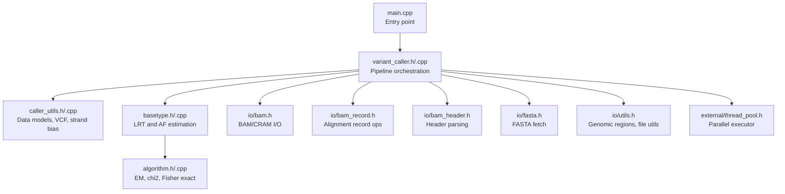
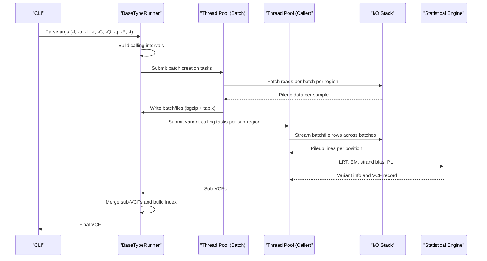
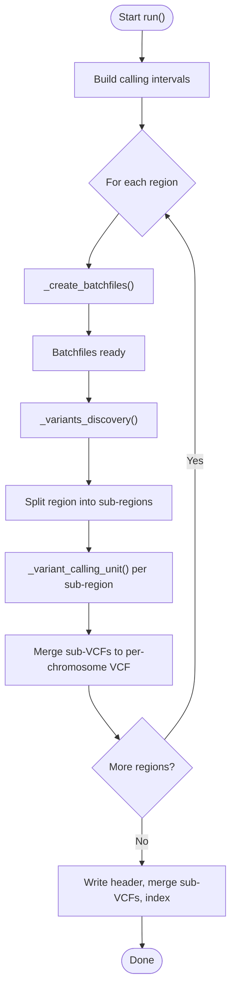
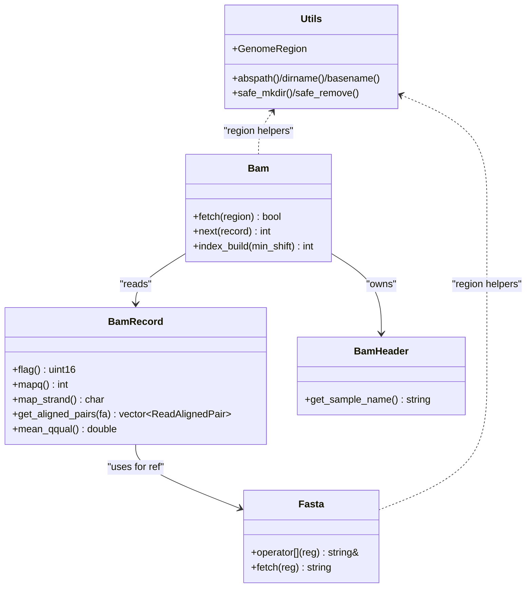
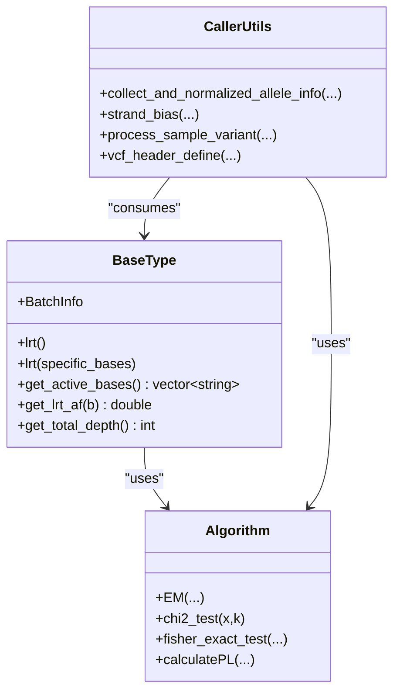
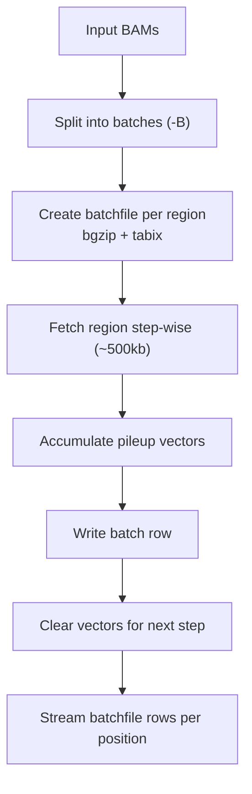
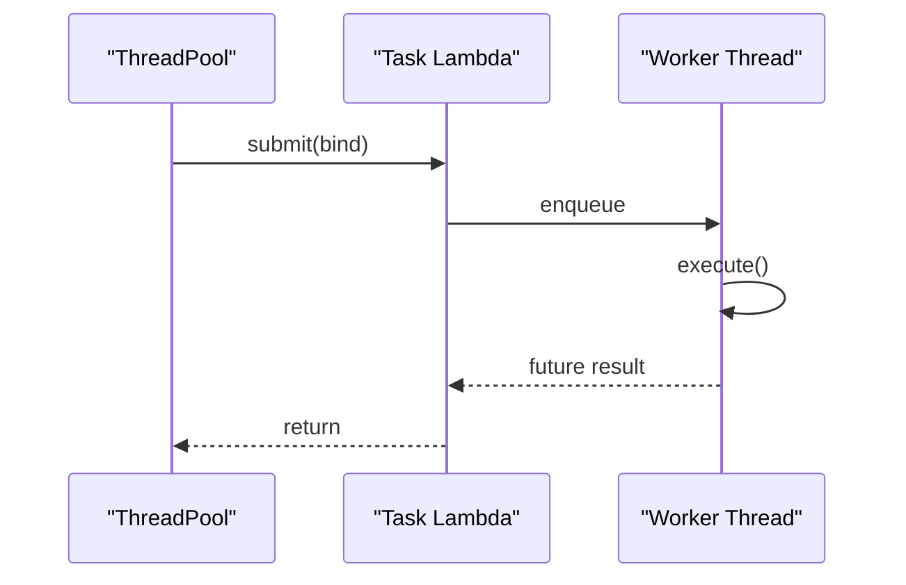
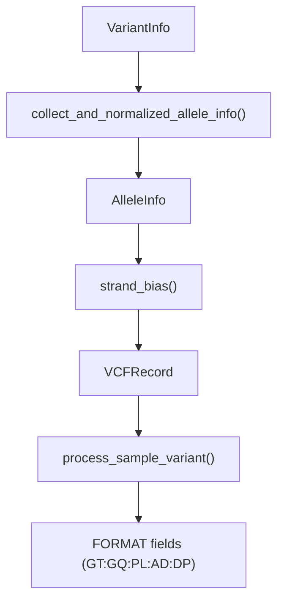
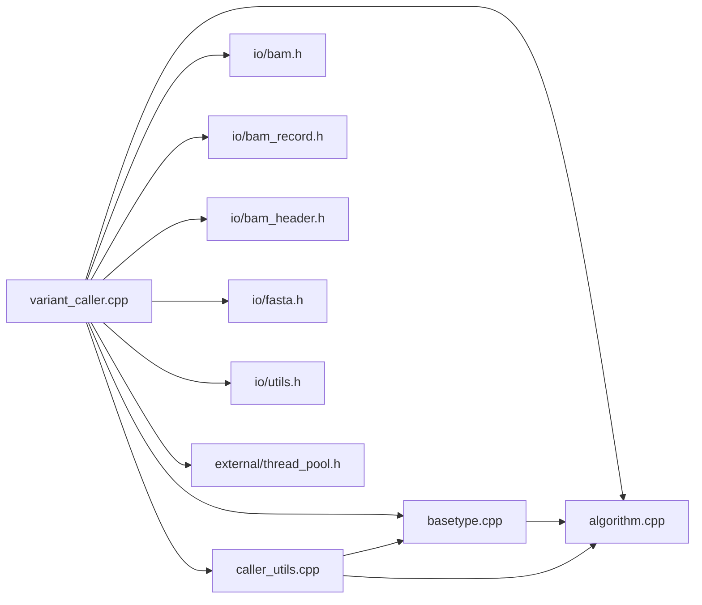

# Variant Calling Engine

<cite>
**Referenced Files in This Document**
- [README.md](file://README.md)
- [main.cpp](file://src/main.cpp)
- [variant_caller.h](file://src/variant_caller.h)
- [variant_caller.cpp](file://src/variant_caller.cpp)
- [caller_utils.h](file://src/caller_utils.h)
- [caller_utils.cpp](file://src/caller_utils.cpp)
- [basetype.h](file://src/basetype.h)
- [basetype.cpp](file://src/basetype.cpp)
- [algorithm.h](file://src/algorithm.h)
- [algorithm.cpp](file://src/algorithm.cpp)
- [bam.h](file://src/io/bam.h)
- [bam_record.h](file://src/io/bam_record.h)
- [bam_header.h](file://src/io/bam_header.h)
- [fasta.h](file://src/io/fasta.h)
- [utils.h](file://src/io/utils.h)
- [thread_pool.h](file://src/external/thread_pool.h)
</cite>

## Table of Contents
1. [Introduction](#introduction)
2. [Project Structure](#project-structure)
3. [Core Components](#core-components)
4. [Architecture Overview](#architecture-overview)
5. [Detailed Component Analysis](#detailed-component-analysis)
6. [Dependency Analysis](#dependency-analysis)
7. [Performance Considerations](#performance-considerations)
8. [Troubleshooting Guide](#troubleshooting-guide)
9. [Conclusion](#conclusion)

## Introduction
BaseVar2 is a C++-based variant calling engine designed for ultra-low-coverage whole-genome sequencing data, especially non-invasive prenatal testing (NIPT). It implements a likelihood-based approach to discover variants and estimate allele frequencies across thousands of samples efficiently. The engine orchestrates batch processing, alignment data ingestion, quality control, statistical inference, and VCF output generation with strong emphasis on memory management and parallelism.

Key capabilities:
- Ultra-low-pass WGS variant discovery and allele frequency estimation
- Batch-oriented processing with configurable batch sizes and parallelization
- Robust quality filtering (mapping quality, base quality, duplicate removal)
- Population-aware statistics and strand-bias assessment
- Scalable memory footprint and fast runtime via thread pools and streaming I/O

**Section sources**
- [README.md:1-181](file://README.md#L1-L181)

## Project Structure
High-level layout:
- src/: Core engine and algorithms
  - variant_caller.*: Pipeline orchestration, batch creation, region splitting, VCF emission
  - caller_utils.*: Data models, VCF record construction, strand bias, PL computation
  - basetype.*: Maximum likelihood and likelihood ratio test (LRT) for variant detection
  - algorithm.*: Statistical helpers (EM, chi-square, Fisher’s exact test)
  - io/*: I/O wrappers for FASTA, BAM/CRAM, records, headers, and utilities
  - external/thread_pool.h: Minimal thread pool for parallelism
- htslib/: Integrated htslib submodule for efficient alignment and indexing
- scripts/: Pipeline helper utilities
- tests/: Unit tests for IO and algorithms

**Diagram sources**
- [main.cpp:1-93](file://src/main.cpp#L1-L93)
- [variant_caller.h:1-180](file://src/variant_caller.h#L1-L180)
- [variant_caller.cpp:1-1303](file://src/variant_caller.cpp#L1-L1303)
- [caller_utils.h:1-230](file://src/caller_utils.h#L1-L230)
- [caller_utils.cpp:1-307](file://src/caller_utils.cpp#L1-L307)
- [basetype.h:1-146](file://src/basetype.h#L1-L146)
- [basetype.cpp:1-212](file://src/basetype.cpp#L1-L212)
- [algorithm.h:1-180](file://src/algorithm.h#L1-L180)
- [algorithm.cpp:1-293](file://src/algorithm.cpp#L1-L293)
- [bam.h:1-149](file://src/io/bam.h#L1-L149)
- [bam_record.h:1-455](file://src/io/bam_record.h#L1-L455)
- [bam_header.h:1-121](file://src/io/bam_header.h#L1-L121)
- [fasta.h:1-96](file://src/io/fasta.h#L1-L96)
- [utils.h:1-205](file://src/io/utils.h#L1-L205)
- [thread_pool.h:1-137](file://src/external/thread_pool.h#L1-L137)

**Section sources**
- [main.cpp:1-93](file://src/main.cpp#L1-L93)
- [variant_caller.h:1-180](file://src/variant_caller.h#L1-L180)
- [variant_caller.cpp:1-1303](file://src/variant_caller.cpp#L1-L1303)
- [caller_utils.h:1-230](file://src/caller_utils.h#L1-L230)
- [caller_utils.cpp:1-307](file://src/caller_utils.cpp#L1-L307)
- [basetype.h:1-146](file://src/basetype.h#L1-L146)
- [basetype.cpp:1-212](file://src/basetype.cpp#L1-L212)
- [algorithm.h:1-180](file://src/algorithm.h#L1-L180)
- [algorithm.cpp:1-293](file://src/algorithm.cpp#L1-L293)
- [bam.h:1-149](file://src/io/bam.h#L1-L149)
- [bam_record.h:1-455](file://src/io/bam_record.h#L1-L455)
- [bam_header.h:1-121](file://src/io/bam_header.h#L1-L121)
- [fasta.h:1-96](file://src/io/fasta.h#L1-L96)
- [utils.h:1-205](file://src/io/utils.h#L1-L205)
- [thread_pool.h:1-137](file://src/external/thread_pool.h#L1-L137)

## Core Components
- BaseTypeRunner: Orchestrates the entire pipeline from argument parsing to final VCF concatenation. Handles batch creation, region splitting, parallel variant calling units, and merging outputs.
- Caller utilities: Defines data models (AlignBase, AlignInfo, VariantInfo, AlleleInfo, VCFRecord), VCF header construction, strand bias metrics, and PL computation.
- BaseType: Implements the likelihood model and likelihood ratio test (LRT) to select active alleles and compute variant quality.
- Algorithms: Provides EM algorithm for allele frequency estimation, chi-square test, Fisher’s exact test, and PL calculation.
- I/O stack: ngslib wrappers for FASTA, BAM/CRAM, records, and utilities for region handling and file operations.
- Parallel executor: Minimal thread pool for asynchronous task submission and synchronization.

**Section sources**
- [variant_caller.h:41-174](file://src/variant_caller.h#L41-L174)
- [caller_utils.h:29-192](file://src/caller_utils.h#L29-L192)
- [caller_utils.cpp:1-307](file://src/caller_utils.cpp#L1-L307)
- [basetype.h:30-143](file://src/basetype.h#L30-L143)
- [basetype.cpp:14-212](file://src/basetype.cpp#L14-L212)
- [algorithm.h:24-177](file://src/algorithm.h#L24-L177)
- [algorithm.cpp:1-293](file://src/algorithm.cpp#L1-L293)
- [bam.h:22-145](file://src/io/bam.h#L22-L145)
- [bam_record.h:49-455](file://src/io/bam_record.h#L49-L455)
- [bam_header.h:22-118](file://src/io/bam_header.h#L22-L118)
- [fasta.h:16-91](file://src/io/fasta.h#L16-L91)
- [utils.h:22-205](file://src/io/utils.h#L22-L205)
- [thread_pool.h:25-134](file://src/external/thread_pool.h#L25-L134)

## Architecture Overview
The engine follows a batch-and-region parallel architecture:
- Input: BAM/CRAM list and FASTA reference
- Region partitioning: Whole genome or user-specified regions
- Batch creation: Split input files into batches sized by -B/--batch-count
- Per-batch processing: For each region, create a compressed batchfile with per-sample pileup columns
- Parallel variant discovery: Split region into sub-regions and call variants in parallel
- Population grouping: Optional per-population LRT and AF calculation
- Output: Per-region VCFs merged into a single bgzip-compressed VCF with index

**Diagram sources**
- [variant_caller.cpp:342-438](file://src/variant_caller.cpp#L342-L438)
- [variant_caller.cpp:440-495](file://src/variant_caller.cpp#L440-L495)
- [variant_caller.cpp:497-561](file://src/variant_caller.cpp#L497-L561)
- [variant_caller.cpp:842-894](file://src/variant_caller.cpp#L842-L894)
- [variant_caller.cpp:896-977](file://src/variant_caller.cpp#L896-L977)
- [basetype.cpp:137-210](file://src/basetype.cpp#L137-L210)
- [algorithm.cpp:12-88](file://src/algorithm.cpp#L12-L88)

**Section sources**
- [variant_caller.cpp:342-438](file://src/variant_caller.cpp#L342-L438)
- [variant_caller.cpp:440-495](file://src/variant_caller.cpp#L440-L495)
- [variant_caller.cpp:497-561](file://src/variant_caller.cpp#L497-L561)
- [variant_caller.cpp:842-894](file://src/variant_caller.cpp#L842-L894)
- [variant_caller.cpp:896-977](file://src/variant_caller.cpp#L896-L977)
- [basetype.cpp:137-210](file://src/basetype.cpp#L137-L210)
- [algorithm.cpp:12-88](file://src/algorithm.cpp#L12-L88)

## Detailed Component Analysis

### Pipeline Orchestration (BaseTypeRunner)
Responsibilities:
- Argument parsing and validation
- Region enumeration (whole genome or user-specified)
- Sample ID extraction (from filename or RG header)
- Population group mapping
- Batch creation with parallel thread pool
- Region subdivision and parallel variant calling
- Per-chromosome VCF subfile generation and merging
- Index building and cache cleanup

Key methods and flows:
- run(): Top-level orchestration, creates cache directory, loops regions, merges outputs
- _create_batchfiles(): Computes number of batches, submits tasks, builds Tabix index
- _create_a_batchfile(): Writes per-position pileup columns to batchfile
- _variants_discovery(): Splits region into sub-regions, parallel calling, merges sub-VCFs
- _variant_calling_unit(): Streams batchfile rows, invokes _basevar_caller per position
- _basevar_caller(): Aggregates per-sample pileup, computes variant and VCF record
- _basetype_caller_unit(): Aggregates samples or groups, runs LRT, collects VariantInfo
- _vcfrecord_in_pos(): Constructs VCF record, INFO fields, FORMAT fields

**Diagram sources**
- [variant_caller.cpp:342-438](file://src/variant_caller.cpp#L342-L438)
- [variant_caller.cpp:440-495](file://src/variant_caller.cpp#L440-L495)
- [variant_caller.cpp:842-894](file://src/variant_caller.cpp#L842-L894)
- [variant_caller.cpp:896-977](file://src/variant_caller.cpp#L896-L977)

**Section sources**
- [variant_caller.cpp:342-438](file://src/variant_caller.cpp#L342-L438)
- [variant_caller.cpp:440-495](file://src/variant_caller.cpp#L440-L495)
- [variant_caller.cpp:497-561](file://src/variant_caller.cpp#L497-L561)
- [variant_caller.cpp:842-894](file://src/variant_caller.cpp#L842-L894)
- [variant_caller.cpp:896-977](file://src/variant_caller.cpp#L896-L977)

### Alignment Data Processing and Quality Control
- I/O: ngslib::Bam wraps htslib for indexed fetching, iterator usage, and record traversal
- Record ops: ngslib::BamRecord exposes flags, mapping info, CIGAR, query sequence/qualities, and aligned pairs
- Header parsing: ngslib::BamHeader extracts sample IDs from RG tags
- FASTA: ngslib::Fasta provides indexed fetch for reference sequences
- Filtering: Mapping quality threshold (-q), base quality threshold (-Q), duplicate and QC-fail flags, secondary/supplementary alignment exclusion

**Diagram sources**
- [bam.h:22-145](file://src/io/bam.h#L22-L145)
- [bam_record.h:49-455](file://src/io/bam_record.h#L49-L455)
- [bam_header.h:22-118](file://src/io/bam_header.h#L22-L118)
- [fasta.h:16-91](file://src/io/fasta.h#L16-L91)
- [utils.h:22-205](file://src/io/utils.h#L22-L205)

**Section sources**
- [bam.h:22-145](file://src/io/bam.h#L22-L145)
- [bam_record.h:49-455](file://src/io/bam_record.h#L49-L455)
- [bam_header.h:22-118](file://src/io/bam_header.h#L22-L118)
- [fasta.h:16-91](file://src/io/fasta.h#L16-L91)
- [utils.h:22-205](file://src/io/utils.h#L22-L205)

### Statistical Analysis and Variant Calling Algorithms
- LRT selection: BaseType::lrt selects candidate alleles by increasing complexity and applies likelihood ratio test against null hypothesis
- EM algorithm: Estimates allele frequencies per sample and computes marginal likelihoods used in LRT
- Post-processing: Strand bias (Fisher’s exact test and Symmetric Odds Ratio), PL computation for genotypes, INFO fields (AF, AC, AN, DP, DP4, FS, SOR)

**Diagram sources**
- [basetype.h:30-143](file://src/basetype.h#L30-L143)
- [basetype.cpp:137-210](file://src/basetype.cpp#L137-L210)
- [algorithm.h:90-177](file://src/algorithm.h#L90-L177)
- [algorithm.cpp:194-292](file://src/algorithm.cpp#L194-L292)
- [caller_utils.cpp:64-200](file://src/caller_utils.cpp#L64-L200)

**Section sources**
- [basetype.h:30-143](file://src/basetype.h#L30-L143)
- [basetype.cpp:137-210](file://src/basetype.cpp#L137-L210)
- [algorithm.h:90-177](file://src/algorithm.h#L90-L177)
- [algorithm.cpp:194-292](file://src/algorithm.cpp#L194-L292)
- [caller_utils.cpp:64-200](file://src/caller_utils.cpp#L64-L200)

### Batch Processing Strategy and Memory Management
- Batch creation: Split input BAMs into batches sized by -B; each batch produces a compressed batchfile with Tabix index
- Streaming per region: Batchfiles are streamed by region using Tabix iterators to avoid loading entire datasets
- Memory control: Fixed-size step regions (default ~500kb) for pileup accumulation; vectors cleared between steps; Tabix indices reduce random access overhead
- Parallelism: Two thread pools—batch creation and variant calling—each sized by -t; futures synchronize completion

**Diagram sources**
- [variant_caller.cpp:440-495](file://src/variant_caller.cpp#L440-L495)
- [variant_caller.cpp:497-561](file://src/variant_caller.cpp#L497-L561)
- [variant_caller.cpp:842-894](file://src/variant_caller.cpp#L842-L894)

**Section sources**
- [variant_caller.cpp:440-495](file://src/variant_caller.cpp#L440-L495)
- [variant_caller.cpp:497-561](file://src/variant_caller.cpp#L497-L561)
- [variant_caller.cpp:842-894](file://src/variant_caller.cpp#L842-L894)

### Parallel Execution Patterns
- Thread pool abstraction: Submit lambdas capturing bound member functions; futures collect results
- Region-level parallelism: Each region spawns sub-region tasks sized by thread count
- Batch-level parallelism: Multiple batch creation tasks executed concurrently

**Diagram sources**
- [thread_pool.h:25-134](file://src/external/thread_pool.h#L25-L134)
- [variant_caller.cpp:440-495](file://src/variant_caller.cpp#L440-L495)
- [variant_caller.cpp:842-894](file://src/variant_caller.cpp#L842-L894)

**Section sources**
- [thread_pool.h:25-134](file://src/external/thread_pool.h#L25-L134)
- [variant_caller.cpp:440-495](file://src/variant_caller.cpp#L440-L495)
- [variant_caller.cpp:842-894](file://src/variant_caller.cpp#L842-L894)

### Caller Utility Functions and Helper Algorithms
- Data models: AlignBase, AlignInfo, VariantInfo, AlleleInfo, VCFRecord encapsulate per-position data and validation
- Strand bias: Computes Fisher’s exact test and Symmetric Odds Ratio per allele
- PL computation: calculatePL generates genotype likelihoods for downstream GQ/PL
- Header and merging: vcf_header_define, merge_file_by_line produce standardized VCFs

**Diagram sources**
- [caller_utils.h:69-192](file://src/caller_utils.h#L69-L192)
- [caller_utils.cpp:64-200](file://src/caller_utils.cpp#L64-L200)
- [algorithm.cpp:12-88](file://src/algorithm.cpp#L12-L88)

**Section sources**
- [caller_utils.h:69-192](file://src/caller_utils.h#L69-L192)
- [caller_utils.cpp:64-200](file://src/caller_utils.cpp#L64-L200)
- [algorithm.cpp:12-88](file://src/algorithm.cpp#L12-L88)

## Dependency Analysis
Internal dependencies:
- variant_caller depends on caller_utils, basetype, algorithm, io modules, and thread_pool
- basetype depends on algorithm for EM and chi-square tests
- caller_utils depends on basetype and algorithm for VCF construction and metrics
- io modules depend on htslib and expose ngslib wrappers

External dependencies:
- htslib for BAM/CRAM/FASTA/Tabix operations
- Standard C++17 libraries for threading, containers, and utilities

**Diagram sources**
- [variant_caller.cpp:1-1303](file://src/variant_caller.cpp#L1-L1303)
- [caller_utils.cpp:1-307](file://src/caller_utils.cpp#L1-L307)
- [basetype.cpp:1-212](file://src/basetype.cpp#L1-L212)
- [algorithm.cpp:1-293](file://src/algorithm.cpp#L1-L293)
- [bam.h:1-149](file://src/io/bam.h#L1-L149)
- [bam_record.h:1-455](file://src/io/bam_record.h#L1-L455)
- [bam_header.h:1-121](file://src/io/bam_header.h#L1-L121)
- [fasta.h:1-96](file://src/io/fasta.h#L1-L96)
- [utils.h:1-205](file://src/io/utils.h#L1-L205)
- [thread_pool.h:1-137](file://src/external/thread_pool.h#L1-L137)

**Section sources**
- [variant_caller.cpp:1-1303](file://src/variant_caller.cpp#L1-L1303)
- [caller_utils.cpp:1-307](file://src/caller_utils.cpp#L1-L307)
- [basetype.cpp:1-212](file://src/basetype.cpp#L1-L212)
- [algorithm.cpp:1-293](file://src/algorithm.cpp#L1-L293)
- [bam.h:1-149](file://src/io/bam.h#L1-L149)
- [bam_record.h:1-455](file://src/io/bam_record.h#L1-L455)
- [bam_header.h:1-121](file://src/io/bam_header.h#L1-L121)
- [fasta.h:1-96](file://src/io/fasta.h#L1-L96)
- [utils.h:1-205](file://src/io/utils.h#L1-L205)
- [thread_pool.h:1-137](file://src/external/thread_pool.h#L1-L137)

## Performance Considerations
- Memory footprint
  - Step-wise region processing (~500kb) bounds per-iteration memory growth
  - Vector pre-allocation and clearing between iterations
  - Batchfiles are compressed and indexed to minimize I/O overhead
- Parallelism
  - Two thread pools: one for batch creation, one for variant calling
  - Sub-region splitting scales with available cores
- I/O efficiency
  - Tabix indices enable fast region streaming
  - Single-pass merging avoids temporary file accumulation
- Quality filtering
  - Early filtering reduces downstream computation
  - Base quality thresholds prevent noisy calls

[No sources needed since this section provides general guidance]

## Troubleshooting Guide
Common issues and remedies:
- Invalid arguments: Ensure required inputs (-f, -o) and valid ranges for -Q/-q/-B/-t
- Missing sample IDs: Verify RG tags or use --filename-has-samplename to derive from filenames
- Empty regions: Regions without coverage yield empty sub-VCFs; verify -r and input data
- Index errors: Ensure bgzip-compressed batchfiles and valid Tabix indices; rebuild if corrupted
- Duplicate samples: Detected during sample ID extraction; deduplicate input BAM list
- Runtime exceptions: Many operations throw on invalid data or mismatched batchfile headers; validate inputs and parameters

**Section sources**
- [variant_caller.cpp:130-149](file://src/variant_caller.cpp#L130-L149)
- [variant_caller.cpp:199-250](file://src/variant_caller.cpp#L199-L250)
- [variant_caller.cpp:906-914](file://src/variant_caller.cpp#L906-L914)
- [variant_caller.cpp:544-550](file://src/variant_caller.cpp#L544-L550)

## Conclusion
BaseVar2’s variant calling engine combines robust statistical modeling with efficient I/O and parallel execution to deliver scalable, memory-efficient variant discovery for ultra-low-coverage data. Its batch-oriented design, region subdivision, and dual thread pools enable high throughput while maintaining strict quality controls and accurate population-level statistics. The modular architecture supports easy maintenance and extension for future enhancements.

[No sources needed since this section summarizes without analyzing specific files]