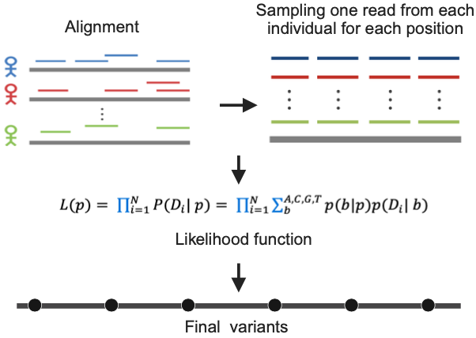

# BaseVar: Call variants from ultra low-pass WGS data

<p align="center">
  
</p>

---

<p align="center">
  
</p>

<!-- [](https://github.com/ShujiaHuang/basevar2) -->

*BaseVar* is a specialized tool for variant calling from ultra low-depth (<1x) sequencing data, with particular focus on non-invasive prenatal testing (NIPT) and large-scale population genomics. Leveraging maximum likelihood and likelihood ratio models, BaseVar accurately identifies polymorphisms at genomic positions and estimates allele frequencies across thousands of samples simultaneously. For the mathematical foundations, refer to the [BaseVar publication in Cell Genomics](https://doi.org/10.1016/j.xgen.2024.100669).

BaseVar is fully implemented in C++17 and delivers over **10×** the speed of its [original Python counterpart](https://github.com/ShujiaHuang/basevar/tree/python-version-0.6.1.1), while using dramatically less memory. With `-B 200` and one thread, memory usage is typically 3–4 GB per thread — compared to 20+ GB in the Python version.

## Citation

If you use `BaseVar` in your research work, please cite the following paper:

> Liu, S., Liu, Y., Gu, Y., Lin, X., Zhu, H., Liu, H., Xu, Z., Cheng, S., Lan, X., Li, L., Huang, M., Li, H., Nielsen, R., Davies, RW., Albrechtsen, A., Chen, GB., Qiu, X., Jin, X., **Huang, S.**, (2024). Utilizing non-invasive prenatal test sequencing data for human genetic investigation. *Cell Genomics* 4(10), 100669. [doi:10.1016/j.xgen.2024.100669](https://www.cell.com/cell-genomics/fulltext/S2666-979X(24)00288-X)

---

## Installation

### Option 1 — Download pre-built binary (Recommended, no compilation needed)

Pre-built static binaries are available on the [GitHub Releases page](https://github.com/ShujiaHuang/BaseVar2/releases).

| Platform | Download | Notes |
| -------- | -------- | ----- |
| Linux (x86_64) | [basevar-linux-static](https://github.com/ShujiaHuang/BaseVar2/releases/download/v2.2.3/basevar-linux-static) | Requires **glibc ≥ 2.35** (see below) |
| macOS (arm64 / Intel) | [basevar-macos-static](https://github.com/ShujiaHuang/BaseVar2/releases/download/v2.2.3/basevar-macos-static) | Requires **macOS 12+** |

#### System requirements for `basevar-linux-static`

The Linux binary is a partial-static build (built on Ubuntu 22.04 / glibc 2.35 in CI). It bundles `libstdc++`, `libgcc`, `htslib`, `zlib`, `bzip2`, `xz` and `openssl` statically; only the system C library (**glibc**) is linked dynamically — and glibc symbol versions are forward-compatible only, so the binary requires the **host glibc to be ≥ 2.35**.

**Confirmed compatible distributions** (glibc ≥ 2.35):

| Distribution | glibc | `basevar-linux-static` |
| ------------ | ----- | :--------------------: |
| Ubuntu 22.04 LTS | 2.35 | ✅ |
| Ubuntu 24.04 LTS | 2.39 | ✅ |
| Debian 12 (bookworm) | 2.36 | ✅ |
| Fedora 36+ | 2.35+ | ✅ |
| openSUSE Tumbleweed | rolling | ✅ |

**Distributions where `basevar-linux-static` will NOT run** (glibc too old — please [compile from source](#option-2--compile-from-source) instead):

| Distribution | glibc | `basevar-linux-static` |
| ------------ | ----- | :--------------------: |
| CentOS 7 / RHEL 7 | 2.17 | ❌ |
| CentOS 8 / RHEL 8 / Rocky 8 / Alma 8 | 2.28 | ❌ |
| CentOS 9 / RHEL 9 / Rocky 9 / Alma 9 | 2.34 | ❌ |
| Ubuntu 18.04 / 20.04 | 2.27 / 2.31 | ❌ |
| Debian 10 / 11 | 2.28 / 2.31 | ❌ |

**Quick check on your machine:**

```bash
# If the printed glibc version is >= 2.35, basevar-linux-static will run.
ldd --version | head -1
```

A typical incompatibility error looks like:

```bash
./basevar-linux-static: /lib64/libc.so.6: version `GLIBC_2.35' not found (required by ./basevar-linux-static)
```

If you see this — or you are on CentOS / RHEL / Rocky / AlmaLinux / older Ubuntu / older Debian — please use [Option 2: compile from source](#option-2--compile-from-source). The build is straightforward and takes only a few minutes.

```bash
# Linux
wget https://github.com/ShujiaHuang/BaseVar2/releases/download/v2.2.3/basevar-linux-static
chmod +x basevar-linux-static
./basevar-linux-static --help
```

```bash
# macOS
curl -LO https://github.com/ShujiaHuang/BaseVar2/releases/download/v2.2.3/basevar-macos-static
chmod +x basevar-macos-static
./basevar-macos-static --help
```

---

### Option 2 — Compile from source

*Requires: C++17 compiler (GCC 7+ or Apple Clang 10+), CMake ≥ 3.12, and system libraries: zlib, bzip2, xz-utils, libcurl.*

#### Step 1 — Clone the repository (including htslib submodule)

```bash
git clone --recursive https://github.com/ShujiaHuang/basevar2.git
cd basevar2
```

> If you forgot `--recursive`, run: `git submodule update --init --recursive`

#### Step 2 — Build with CMake (standard dynamic build)

```bash
cmake -B build -DCMAKE_BUILD_TYPE=Release
cmake --build build
```

The executable `bin/basevar` will be produced. Verify with:

```bash
./bin/basevar --help
```

#### Step 3 (Optional) — Build a static binary locally

**macOS** (requires Homebrew):

```bash
brew install zlib bzip2 xz
cmake -B build-static -DSTATIC_BUILD=ON -DCMAKE_BUILD_TYPE=Release
cmake --build build-static
```

**Linux** (portable static via Ubuntu/glibc — same approach used in CI):

```bash
sudo apt-get install -y build-essential cmake autoconf automake \
    zlib1g-dev libbz2-dev liblzma-dev libssl-dev
cmake -B build-static -DSTATIC_BUILD=ON -DCMAKE_BUILD_TYPE=Release
cmake --build build-static
```

This bundles `libstdc++`, `libgcc`, `htslib`, and the compression libs statically; glibc remains dynamic. The resulting binary runs on the build host and on any other host with the same-or-newer glibc.

---

### Option 3 — Manual g++ compilation (fallback)

First, build htslib:

```bash
cd htslib && autoreconf -i && ./configure && make && cd ..
```

Then compile manually:

**Linux:**

```bash
cd bin/
g++ -O3 -fPIC ../src/*.cpp ../src/io/*.cpp ../htslib/libhts.a \
    -I ../htslib -lz -lbz2 -lm -llzma -lpthread -lcurl -lssl -lcrypto -o basevar
```

**macOS:**

```bash
cd bin/
g++ -O3 -fPIC ../src/*.cpp ../src/io/*.cpp ../htslib/libhts.a \
    -I ../htslib -lz -lbz2 -lm -llzma -lpthread -lcurl -o basevar
```

> **Note:** If you encounter a `test/test_khash.c` compilation error during `make` in htslib, you can safely ignore it — the required `libhts.a` archive is still produced correctly.

---

## Commands overview

```bash
Usage: basevar <command> [options]

Commands:
  caller    Call variants and estimate allele frequencies
  pipeline  Generate per-region `basevar caller` commands for whole-genome calling
  concat    Concatenate per-region VCF files into a whole-genome VCF
  subsam    Extract a subset of samples from a VCF file
```

---

## `basevar caller` — Variant calling

### Full parameter reference

```bash
About: Call variants and estimate allele frequency by BaseVar.
Usage: basevar caller [options] <-f Fasta> <-o output_file> [-L bam.list/cram.list] in1.bam [in2.bam ...] ...

Required arguments:
  -f, --reference FILE         Input reference FASTA file.
  -o, --output    FILE         Output VCF file (supports .vcf.gz).

Optional options:
  -L, --align-file-list=FILE   BAM/CRAM files list, one file per row.
  -r, --regions=REG[,...]      Restrict calling to these regions (comma-separated).
                               Formats: chr  |  chr:start  |  chr:start-end
                               Example: chr1,chr2:1000000,chr3:5000000-10000000
  -G, --pop-group=FILE         Calculate allele frequency per population group.

  -m, --min-af=float           Prior MAF threshold; positions below this are skipped.
                               Default: min(0.001, 100/num_samples). Usually auto-set.
  -Q, --min-BQ INT             Minimum base quality [10]
  -q, --mapq=INT               Minimum mapping quality [5]
  -B, --batch-count=INT        Samples per batch file [500]
  -t, --thread=INT             Number of threads [14]

  --filename-has-samplename    If BAM/CRAM filenames start with the sample ID
                               (e.g. SampleID.bam), set this flag to skip reading
                               the BAM header for sample names — saves significant time.
  --smart-rerun                Skip completed batch files and resume an interrupted run.
  -h, --help                   Show this help message and exit.
```

### Usage examples

**Minimal call from a list of BAM files (or CRAM files):**

```bash
basevar caller \
    -f reference.fasta \
    -o output.vcf.gz \
    -L bamfile.list
```

**Recommended call with quality filters and sample name optimization:**

```bash
basevar caller \
    -f reference.fasta \
    -o output.vcf.gz \
    -Q 20 -q 30 -B 500 -t 24 \
    --filename-has-samplename \
    -L bamfile.list
```

**Call a specific region:**

```bash
basevar caller \
    -f reference.fasta \
    -o chr11_region.vcf.gz \
    -Q 20 -q 30 -B 500 -t 24 \
    --filename-has-samplename \
    -r chr11:5246595-5248428 \
    -L bamfile.list
```

**Call multiple disjoint regions in one run:**

```bash
basevar caller \
    -f reference.fasta \
    -o multi_region.vcf.gz \
    -Q 20 -q 30 -B 500 -t 24 \
    --regions chr11:5246595-5248428,chr17:41197764-41276135 \
    -L bamfile.list
```

**Include BAM files directly on the command line:**

```bash
basevar caller \
    -f reference.fasta \
    -o output.vcf.gz \
    -Q 20 -q 30 -B 500 \
    --filename-has-samplename \
    -L bamfile.list \
    sample1.cram sample2.bam sample3.bam
```

**Per-population allele frequency calculation:**

```bash
basevar caller \
    -f reference.fasta \
    -o output.vcf.gz \
    -Q 20 -q 30 -B 500 -t 24 \
    --filename-has-samplename \
    --pop-group sample_group.info \
    -L bamfile.list
```

See the [example `sample_group.info` file](https://github.com/ShujiaHuang/BaseVar2/blob/main/tests/data/sample_group.info) for the expected format.

**Resume an interrupted run:**

```bash
basevar caller \
    -f reference.fasta \
    -o output.vcf.gz \
    -Q 20 -q 30 -B 500 -t 24 \
    --filename-has-samplename \
    --smart-rerun \
    -L bamfile.list
```

---

## `basevar pipeline` — Whole-genome pipeline generator

For whole-genome variant calling, the `pipeline` subcommand splits the genome into sub-regions and prints one `basevar caller` command per sub-region to stdout. The resulting shell script can be executed sequentially, in parallel with GNU `parallel`, or submitted to a job scheduler (SGE / SLURM / PBS).

> Since **v2.2.0**, this functionality is built directly into the `basevar` binary as a native C++ subcommand. The older `scripts/create_pipeline.py` Python script is still shipped for backward compatibility and produces identical output.

### Pipeline-specific options

| Option | Description | Default |
| ------ | ----------- | ------- |
| `-o, --outdir` | Output directory for VCF files and logs | **required** |
| `--ref_fai` | Reference FASTA index file (`.fai`) | **required** |
| `-d, --delta` | Size of each sub-region (bp) | `2000000` |
| `-c, --chrom` | Restrict to comma-separated chromosome(s) | all chromosomes |

All other options (`-f`, `-L`, `-r`, `-Q`, `-q`, `-B`, `-t`, `--filename-has-samplename`, `--pop-group`, ...) are passed through verbatim to `basevar caller`. This means any new `caller` option works automatically without changes to the pipeline subcommand.

When `-r/--regions` is supplied, those regions are further split into `--delta`-sized windows; otherwise every chromosome in the `.fai` (filtered by `--chrom` if set) is processed.

### Examples

**Generate whole-genome pipeline (all chromosomes, 2 Mb windows):**

```bash
basevar pipeline \
    -o /path/to/outdir \
    --ref_fai reference.fasta.fai \
    -f reference.fasta \
    -L bamfile.list \
    -Q 20 -q 30 -B 500 -t 4 \
    --filename-has-samplename \
    > basevar_wgs.sh
```

**Generate pipeline for a single chromosome (5 Mb windows):**

```bash
basevar pipeline \
    -o /path/to/outdir \
    --ref_fai reference.fasta.fai \
    -c chr20 -d 5000000 \
    -f reference.fasta \
    -L bamfile.list \
    -Q 20 -q 30 -B 500 -t 4 \
    --filename-has-samplename \
    > basevar.chr20.sh
```

**Generate pipeline for specific regions (split into 1 Mb windows):**

```bash
basevar pipeline \
    -o /path/to/outdir \
    --ref_fai reference.fasta.fai \
    -d 1000000 \
    -r chr11:5000000-7000000,chr17 \
    -f reference.fasta \
    -L bamfile.list \
    -Q 20 -q 30 -B 500 -t 4 \
    --filename-has-samplename \
    > basevar.targets.sh
```

**Run the generated pipeline:**

```bash
# Sequential (local):
bash basevar.chr20.sh

# Parallel with GNU parallel:
cat basevar_wgs.sh | parallel -j 8

# Or submit each line as a cluster job (SGE/SLURM example):
while IFS= read -r cmd; do
    echo "$cmd" | qsub -V -cwd -pe smp 4
done < basevar_wgs.sh
```

After all sub-jobs finish, concatenate the per-region VCFs:

```bash
ls /path/to/outdir/*.vcf.gz | sort -V > vcf.list
basevar concat -L vcf.list -o final_output.vcf.gz
```

> The legacy Python script `scripts/create_pipeline.py` remains available and produces byte-identical output; replace `basevar pipeline` with `basevar=./bin/basevar python scripts/create_pipeline.py` to use it instead.

---

## `basevar concat` — Concatenate VCF files

Concatenate per-region VCF files produced by `basevar caller` into a single VCF. The files must be provided in the correct genomic order (the tool does not sort positions).

```bash
Usage: basevar concat [options] <-o output.vcf.gz> [-L vcf.list] in1.vcf.gz [in2.vcf.gz ...]

Required:
  -o, --output=FILE      Output VCF file.

Optional:
  -L, --file-list=FILE   List of input VCF files, one per line.
```

**Example:**

```bash
# From a file list
ls outdir/*.vcf.gz | sort -V > vcf.list
basevar concat -L vcf.list -o merged.vcf.gz

# From inline file arguments
basevar concat chr1_1_2000000.vcf.gz chr1_2000001_4000000.vcf.gz -o chr1.vcf.gz
```

> You may also use `bcftools concat` as a drop-in alternative.

---

## `basevar subsam` — Extract samples from VCF

Extract a subset of samples from a BaseVar VCF and output a new VCF with recalculated INFO fields (AC/AN/AF).

```bash
Usage: basevar subsam [options] -i <input.vcf[.gz]> -o <output.vcf[.gz]> [-s <samplelist>]

Options:
  -i, --input FILE      Input VCF/BCF file (required).
  -o, --output FILE     Output VCF/BCF file (required).
  -s, --sample FILE     File with sample names to keep (one per line).
  -O, --output-type     v: VCF | z: bgzipped VCF | b: BCF | u: uncompressed BCF
                        Default: inferred from output filename extension.
  --no-update-info      Do not recalculate AC/AN/AF INFO fields.
  --keep-all-site       Retain sites that become reference-only after subsetting.
```

**Examples:**

```bash
# Extract samples listed in a file
basevar subsam \
    -i full_cohort.vcf.gz \
    -o subset.vcf.gz \
    -s sample_names.txt

# Extract two specific samples, output as plain VCF
basevar subsam \
    -i full_cohort.vcf.gz \
    -o subset.vcf \
    -O v \
    SampleA SampleB

# Keep all sites (including ref-only after subsetting) and skip INFO update
basevar subsam \
    -i full_cohort.vcf.gz \
    -o subset.vcf.gz \
    -s sample_names.txt \
    --keep-all-site --no-update-info
```

---

## Tips and best practices

- **`-B / --batch-count`**: Controls how many samples are processed per batch. Lower values reduce per-thread memory but increase I/O. For large cohorts (>5000 samples) `-B 500` is a good starting point.
- **`--filename-has-samplename`**: If your BAM files are named `{SampleID}.bam` or `{SampleID}.cram`, always set this flag — it avoids reading every BAM header and can save hours on large cohorts.
- **`--smart-rerun`**: Safe to add on any re-run; the program checks existing batch files and skips completed work.
- **Memory estimation**: `threads × batch_size / 200 × ~3–4 GB`. E.g., 24 threads, `-B 200` → ~72–96 GB total.
- **Output compression**: Always use `.vcf.gz` as the output filename — BaseVar automatically writes bgzipped output when the extension is `.vcf.gz`.

---

## Development

BaseVar is under active development. To update to the latest version:

```bash
git pull
git submodule update --recursive
cmake -B build -DCMAKE_BUILD_TYPE=Release
cmake --build build
```
