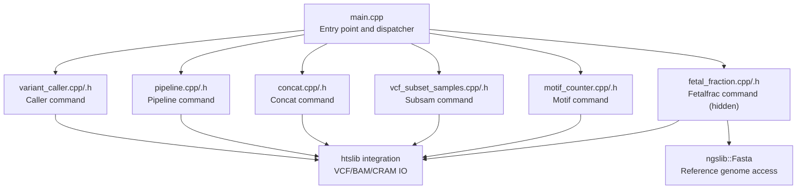
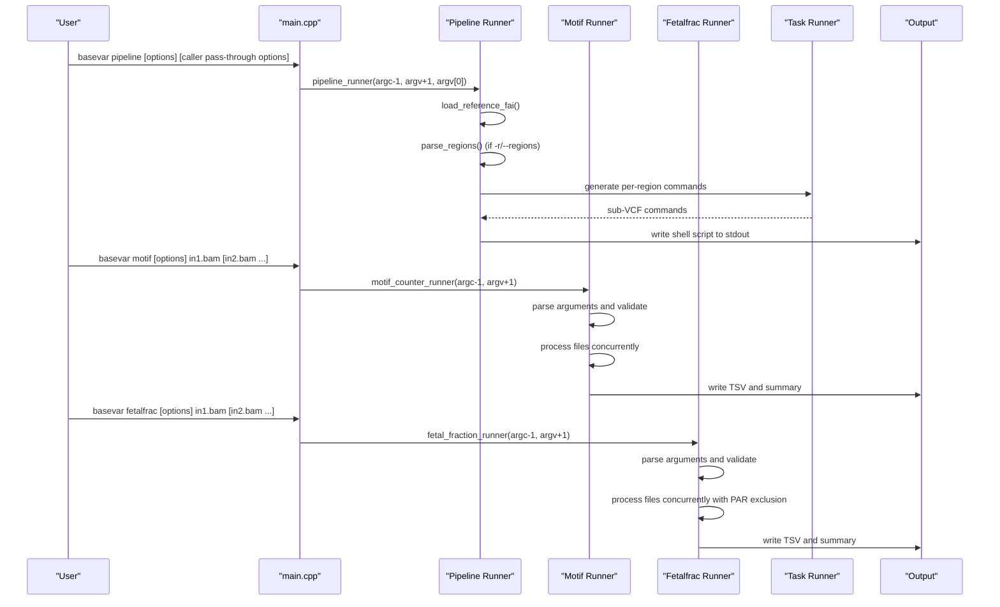
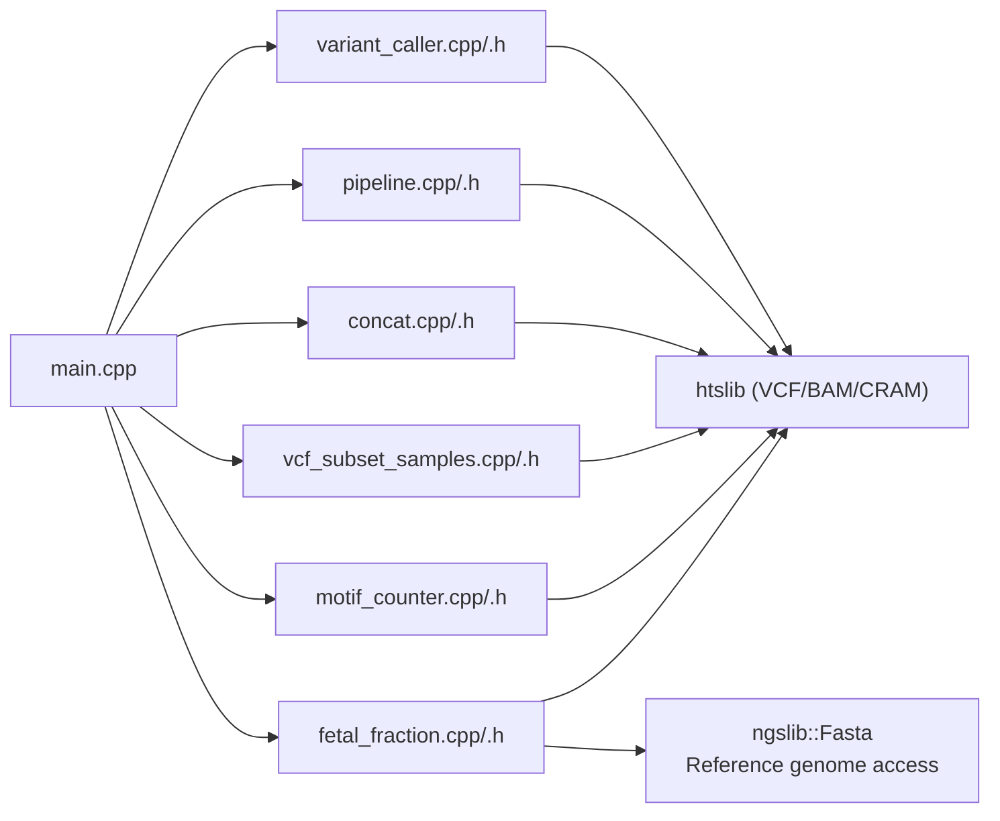

# Command-Line Interface Reference

<cite>
**Referenced Files in This Document**
- [main.cpp](file://src/main.cpp)
- [variant_caller.h](file://src/variant_caller.h)
- [variant_caller.cpp](file://src/variant_caller.cpp)
- [concat.h](file://src/concat.h)
- [concat.cpp](file://src/concat.cpp)
- [vcf_subset_samples.h](file://src/vcf_subset_samples.h)
- [vcf_subset_samples.cpp](file://src/vcf_subset_samples.cpp)
- [pipeline.h](file://src/pipeline.h)
- [pipeline.cpp](file://src/pipeline.cpp)
- [motif_counter.h](file://src/motif_counter.h)
- [motif_counter.cpp](file://src/motif_counter.cpp)
- [fetal_fraction.h](file://src/fetal_fraction.h)
- [fetal_fraction.cpp](file://src/fetal_fraction.cpp)
- [README.md](file://README.md)
- [sample_group.info](file://tests/data/sample_group.info)
- [bam90.list](file://tests/data/bam90.list)
- [test_motif_counter.cpp](file://tests/io/test_motif_counter.cpp)
- [test_fetal_fraction.cpp](file://tests/io/test_fetal_fraction.cpp)
</cite>

## Update Summary
**Changes Made**
- Enhanced --noise calibration functionality documentation with comprehensive platform-specific reference values
- Added mandatory empirical calibration workflow requiring at least 30 confirmed-female-fetus samples processed through identical pipeline configurations
- Updated fetalfrac command documentation to include detailed calibration procedures, scientific rationale, and extensive citations
- Added platform-specific noise floor reference values from MGI DNBSEQ/BGISEQ, NovaSeq + UDI, HiSeq X/non-UDI dual, and HiSeq 2500 single-index platforms
- Updated troubleshooting guidance to address calibration workflow requirements

## Table of Contents
1. [Introduction](#introduction)
2. [Project Structure](#project-structure)
3. [Core Components](#core-components)
4. [Architecture Overview](#architecture-overview)
5. [Detailed Component Analysis](#detailed-component-analysis)
6. [Dependency Analysis](#dependency-analysis)
7. [Performance Considerations](#performance-considerations)
8. [Troubleshooting Guide](#troubleshooting-guide)
9. [Conclusion](#conclusion)

## Introduction
This document provides a comprehensive command-line interface (CLI) reference for BaseVar2, covering all six primary commands: caller, pipeline, concat, subsam, motif, and the hidden fetalfrac subcommand. It explains syntax, parameters, defaults, output formats, and practical usage scenarios. The caller command focuses on ultra-low-pass WGS variant calling with population-aware allele frequency estimation. The pipeline subcommand generates per-region caller commands for whole-genome analysis. The concat command merges BaseVar-produced VCF files, while subsam extracts specified samples with optional INFO recalculation. The motif subcommand provides cfDNA end-motif counting functionality following the Lo lab convention. The fetalfrac subcommand offers specialized NIPT cfDNA male fetal fraction estimation using chrY read counting methodology, designed for internal/corporate applications and intentionally hidden from main help output.

**Updated** Enhanced documentation for the fetalfrac subcommand with mandatory empirical calibration workflow and comprehensive platform-specific noise floor reference values.

## Project Structure
BaseVar2 exposes a unified CLI via a single executable with subcommands routed from the main entry point. Each subcommand is implemented in dedicated modules:
- main: dispatches subcommands and prints runtime timing
- caller: variant discovery and VCF generation with population-aware allele frequency estimation
- pipeline: native C++ implementation for whole-genome pipeline generation with superior performance
- concat: concatenation of BaseVar-produced VCF files
- subsam: extraction of specified samples from a VCF with optional INFO recalculation
- motif: cfDNA end-motif counting with Lo lab convention compliance
- fetalfrac: hidden NIPT cfDNA male fetal fraction estimation using chrY read counting

**Diagram sources**
- [main.cpp:45-104](file://src/main.cpp#L45-L104)
- [variant_caller.cpp:11-48](file://src/variant_caller.cpp#L11-L48)
- [pipeline.cpp:1-476](file://src/pipeline.cpp#L1-L476)
- [concat.cpp:27-90](file://src/concat.cpp#L27-L90)
- [vcf_subset_samples.cpp:117-119](file://src/vcf_subset_samples.cpp#L117-L119)
- [motif_counter.cpp:1-724](file://src/motif_counter.cpp#L1-L724)
- [fetal_fraction.cpp:1-1003](file://src/fetal_fraction.cpp#L1-L1003)

**Section sources**
- [main.cpp:18-32](file://src/main.cpp#L18-L32)
- [README.md:175-188](file://README.md#L175-L188)

## Core Components
- Caller command: Reads indexed alignment files (BAM/CRAM/SAM), builds batch files per genomic region, performs parallel variant discovery, and outputs a merged VCF with population-specific INFO fields.
- Pipeline command: Native C++ implementation that splits the genome into sub-regions and generates `basevar caller` commands for whole-genome calling with superior performance and maintainability.
- Concat command: Concatenates multiple BaseVar VCF outputs into a single file; preserves headers from the first input.
- Subsam command: Extracts specified samples from a VCF, optionally recalculates INFO fields (AC/AN/AF/CAF), and writes a subset VCF/BCF.
- Motif command: Counts cfDNA end-motifs (k-mers) from BAM/CRAM alignments following the Lo lab convention, supporting both read-based and reference-based extraction methods.
- Fetalfrac command: Hidden subcommand for NIPT cfDNA male fetal fraction estimation using chrY read counting methodology with PAR exclusion and mappability filtering.

Key defaults and behaviors:
- Caller defaults: min-af (auto-calculated as min(0.001, 100/N)), min-mapq (5), min-baseq (10), batch-count (500), thread count (hardware concurrency), and optional population grouping.
- Pipeline defaults: outdir (required), ref_fai (required), delta (2,000,000 bp), chrom filter (all chromosomes).
- Concat defaults: requires an output file; accepts a file list and positional inputs.
- Subsam defaults: determines output mode by extension; can preserve all sites or filter monomorphic sites.
- Motif defaults: motif length (4), min-mapq (30), thread count (hardware concurrency), read end policy (R1), proper pair filtering (off), insert size cap (0), reference-based extraction (off).
- Fetalfrac defaults: min-mapq (30), thread count (hardware concurrency), PAR exclusion (enabled), scaling factor (auto-computed), noise floor (0.0), male threshold (1e-4).

**Section sources**
- [variant_caller.h:63-71](file://src/variant_caller.h#L63-L71)
- [variant_caller.cpp:130-149](file://src/variant_caller.cpp#L130-L149)
- [pipeline.h:97-102](file://src/pipeline.h#L97-L102)
- [concat.cpp:28-38](file://src/concat.cpp#L28-L38)
- [vcf_subset_samples.cpp:7-22](file://src/vcf_subset_samples.cpp#L7-L22)
- [motif_counter.h:124-155](file://src/motif_counter.h#L124-L155)
- [fetal_fraction.h:195-228](file://src/fetal_fraction.h#L195-L228)

## Architecture Overview
The CLI architecture routes subcommands to their respective runners, which orchestrate file IO, parallel processing, and output generation. The caller command orchestrates a multi-stage pipeline: interval partitioning, batch creation, parallel variant calling, and merging. The pipeline subcommand provides native C++ implementation with superior performance characteristics. The motif subcommand implements a specialized end-motif counting pipeline with configurable filtering and extraction methods. The fetalfrac subcommand implements a specialized NIPT analysis pipeline with PAR exclusion, mappability filtering, and automated scaling factor computation.

**Diagram sources**
- [main.cpp:56-61](file://src/main.cpp#L56-L61)
- [main.cpp:88-90](file://src/main.cpp#L88-L90)
- [main.cpp:92-96](file://src/main.cpp#L92-L96)
- [pipeline.cpp:367-392](file://src/pipeline.cpp#L367-L392)
- [pipeline.cpp:416-432](file://src/pipeline.cpp#L416-L432)
- [pipeline.cpp:459-469](file://src/pipeline.cpp#L459-L469)
- [motif_counter.cpp:643-706](file://src/motif_counter.cpp#L643-L706)
- [fetal_fraction.cpp:992-1000](file://src/fetal_fraction.cpp#L992-L1000)

## Detailed Component Analysis

### Pipeline Command
The pipeline subcommand generates per-region `basevar caller` commands for whole-genome calling. It provides native C++ implementation with superior performance characteristics while maintaining full backward compatibility with existing workflows.

**Purpose**: Generate per-region `basevar caller` commands for whole-genome calling. Native C++ implementation replaces the legacy Python script with improved performance characteristics.

**Required arguments**:
- -o, --outdir: Output directory for per-region VCF files and logs (required)
- --ref_fai: Reference FASTA index file (.fai) used to determine chromosome lengths (required)

**Optional arguments**:
- -d, --delta: Size of each sub-region in bp (default: 2,000,000)
- -c, --chrom: Only process these comma-delimited chromosomes (e.g., chr1,chr2)
- -h, --help: Print usage

**Pass-through Options**: All other options (`-f`, `-L`, `-r`, `-Q`, `-q`, `-B`, `-t`, `--filename-has-samplename`, `--pop-group`, ...) are passed through verbatim to `basevar caller` without modification.

**Behavior**:
- Loads chromosome lengths from .fai file and splits genome into sub-regions
- Generates one `basevar caller` command per sub-region with proper logging
- Supports both whole-genome and targeted region processing
- Produces shell script output suitable for sequential, parallel, or cluster execution

**Output formats and file handling**:
- Writes generated shell commands to stdout (redirect to file for execution)
- Each sub-job creates individual VCF files with log files in the specified output directory
- Uses `time` command wrapper and completion markers for progress tracking

**Practical usage scenarios**:
- Whole-genome analysis: Generate pipeline for all chromosomes with default 2 Mb window size
- Targeted analysis: Process specific chromosomes or regions with custom window sizes
- High-performance computing: Execute generated pipeline with GNU parallel or job schedulers
- Legacy compatibility: Byte-perfect output matches original Python script for seamless migration

**Parameter interactions and best practices**:
- delta parameter controls sub-region size; smaller values increase parallelization but also job overhead
- chrom filter reduces processing to specific chromosomes for faster targeted analysis
- Pass-through options are forwarded unchanged to basevar caller for automatic support of new features
- Output directory structure maintains compatibility with downstream processing workflows

**Examples (syntax only)**:
- Generate whole-genome pipeline with default settings
  - basevar pipeline -o /path/to/outdir --ref_fai reference.fasta.fai -f reference.fasta -L bam.list -Q 20 -q 30 -B 500 -t 4 > basevar_wgs.sh
- Process single chromosome with larger window size
  - basevar pipeline -o /path/to/outdir --ref_fai reference.fasta.fai -c chr20 -d 5000000 -f reference.fasta -L bam.list -Q 20 -q 30 -B 500 -t 4 > basevar.chr20.sh
- Targeted regions with custom window size
  - basevar pipeline -o /path/to/outdir --ref_fai reference.fasta.fai -d 1000000 -r chr11:5000000-7000000,chr17 -f reference.fasta -L bam.list -Q 20 -q 30 -B 500 -t 4 > basevar.targets.sh

**Legacy Compatibility**: Full backward compatibility with `scripts/create_pipeline.py` output. Replace `basevar pipeline` with `basevar=./bin/basevar python scripts/create_pipeline.py` for legacy workflows.

**Section sources**
- [pipeline.h:1-125](file://src/pipeline.h#L1-L125)
- [pipeline.cpp:218-251](file://src/pipeline.cpp#L218-L251)
- [pipeline.cpp:262-472](file://src/pipeline.cpp#L262-L472)
- [README.md:307-393](file://README.md#L307-L393)

### Caller Command
The caller command performs ultra-low-pass WGS variant calling with allele frequency estimation and optional population grouping.

**Purpose**: Ultra-low-pass WGS variant calling with allele frequency estimation and optional population grouping.

**Required arguments**:
- -f, --reference: Reference FASTA file
- -o, --output: Output VCF file (supports .gz and .bcf via extension)

**Optional arguments**:
- -L, --align-file-list: File containing one alignment path per line
- -r, --regions: Comma-delimited list of regions (e.g., chr:start-end)
- -G, --pop-group: Population group file mapping sample to group
- -m, --min-af: Minimum alternate frequency threshold (default derived)
- -Q, --min-BQ: Minimum base quality (default 10)
- -q, --mapq: Minimum mapping quality (default 5)
- -B, --batch-count: Samples per batch file (default 500)
- -t, --thread: Number of threads (default hardware concurrency)
- --filename-has-samplename: Infer sample IDs from filenames
- --smart-rerun: Reuse existing batchfiles and indexes
- -h, --help: Print usage

**Parameter defaults and behavior**:
- Defaults are defined in the argument struct and adjusted based on input count and hardware capabilities.
- Regions can be specified as a list; if omitted, the whole genome is processed.
- Population grouping enables INFO fields like DP_group and AF_group in the output VCF.

**Output formats and file handling**:
- Output VCF is bgzip-compressed when suffixed with .gz and indexed with tbi.
- Temporary batch files are created per interval and removed after merging unless smart rerun is enabled.

**Practical usage scenarios**:
- Single sample: Provide one alignment file and a reference FASTA.
- Multi-sample: Supply multiple alignment files or a list file.
- Large-scale batch: Use regions to split workload and increase thread count; adjust batch-count to balance memory and throughput.

**Parameter interactions and best practices**:
- min-af is internally reduced to min(default, 100/N) where N is the number of input files.
- Higher thread counts improve throughput but increase memory usage; tune -B accordingly.
- Using --filename-has-samplename avoids parsing RG tags and speeds up sample ID inference.
- --smart-rerun accelerates reprocessing by skipping existing batchfiles and indexes.

**Examples (syntax only)**:
- Single sample with region and population grouping
  - basevar caller -f ref.fa -o out.vcf.gz -Q 20 -q 30 -B 500 -t 12 -r chr1:1000000-2000000 -G group.tsv --filename-has-samplename in.bam
- Multi-sample with list and regions
  - basevar caller -f ref.fa -o out.vcf.gz -L bam.list -r chr1,chr2 -t 24 in.bam
- Large-scale batch with smart rerun
  - basevar caller -f ref.fa -o out.vcf.gz -L bam.list -B 200 -t 32 --smart-rerun in.bam

**Section sources**
- [variant_caller.cpp:11-48](file://src/variant_caller.cpp#L11-L48)
- [variant_caller.cpp:50-197](file://src/variant_caller.cpp#L50-L197)
- [variant_caller.cpp:252-300](file://src/variant_caller.cpp#L252-L300)
- [variant_caller.cpp:343-438](file://src/variant_caller.cpp#L343-L438)
- [variant_caller.cpp:440-495](file://src/variant_caller.cpp#L440-L495)
- [variant_caller.cpp:842-894](file://src/variant_caller.cpp#L842-L894)
- [variant_caller.cpp:1219-1302](file://src/variant_caller.cpp#L1219-L1302)
- [README.md:189-304](file://README.md#L189-L304)
- [sample_group.info:1-44](file://tests/data/sample_group.info#L1-L44)
- [bam90.list:1-91](file://tests/data/bam90.list#L1-L91)

### Concat Command
The concat command concatenates BaseVar-produced VCF files into a single output.

**Purpose**: Concatenate BaseVar-produced VCF files into a single output.

**Required arguments**:
- -o, --output: Output VCF file

**Optional arguments**:
- -L, --file-list: File containing one VCF path per line
- -h, --help: Print usage

**Behavior**:
- Reads header from the first input file and appends subsequent files in order.
- Does not sort positions; users must ensure concat order is appropriate.

**Output formats and file handling**:
- Output format inferred from extension (.gz implies bgzip-compressed VCF).

**Examples (syntax only)**:
- Concatenate multiple VCFs from a list
  - basevar concat -o merged.vcf.gz -L vcf.list in1.vcf.gz in2.vcf.gz
- Concatenate from positional arguments
  - basevar concat -o merged.vcf.gz in1.vcf.gz in2.vcf.gz

**Section sources**
- [concat.cpp:28-38](file://src/concat.cpp#L28-L38)
- [concat.cpp:27-90](file://src/concat.cpp#L27-L90)
- [README.md:396-422](file://README.md#L396-L422)

### Subsam Command
The subsam command extracts specified samples from a VCF and optionally recalculates INFO fields.

**Purpose**: Extract specified samples from a VCF and optionally recalculate INFO fields (AC/AN/AF/CAF).

**Required arguments**:
- -i, --input: Input VCF/BCF file
- -o, --output: Output VCF/BCF file

**Optional arguments**:
- -s, --sample-list: File containing sample names (one per line)
- -O, --output-type: Output type v|z|b|u (v: VCF, z: bgzip-compressed VCF, b: BCF, u: uncompressed BCF)
- --no-update-info: Do not recalculate INFO fields
- --keep-all-site: Keep sites with only reference alleles among extracted samples
- -h, --help: Print usage

**Behavior**:
- Validates presence of requested samples in the header.
- Creates a subset header and writes records with cleaned genotypes.
- Optionally recalculates AC/AN/AF/CAF and filters monomorphic sites depending on flags.

**Output formats and file handling**:
- Output mode determined by -O or guessed from extension.

**Examples (syntax only)**:
- Extract two samples and compress output
  - basevar subsam -i in.vcf.gz -o out.vcf.gz -s samples.txt -O z sampleA sampleB
- Keep all sites and avoid INFO recalculation
  - basevar subsam -i in.bcf -o out.bcf -s samples.txt --keep-all-site --no-update-info

**Section sources**
- [vcf_subset_samples.cpp:7-22](file://src/vcf_subset_samples.cpp#L7-L22)
- [vcf_subset_samples.cpp:25-114](file://src/vcf_subset_samples.cpp#L25-L114)
- [vcf_subset_samples.cpp:224-316](file://src/vcf_subset_samples.cpp#L224-L316)
- [README.md:425-465](file://README.md#L425-L465)

### Motif Command
The motif subcommand counts cfDNA end-motifs (k-mers) from BAM/CRAM alignments following the Lo lab convention. It provides comprehensive cfDNA fragmentomic analysis capabilities with configurable filtering and extraction methods.

**Purpose**: Count cfDNA end-motif (k-mer) frequencies from BAM/CRAM alignments following the Lo lab convention established by Jiang et al., Cancer Discovery 2020.

**Required arguments**:
- -o, --output: Output TSV file (sample, motif, count, frequency)

**Optional arguments**:
- -L, --align-file-list: BAM/CRAM files list, one path per row
- -f, --reference: Reference FASTA file (required for CRAM input)
- -r, --regions: Restrict counting to these regions, comma-separated (e.g., chr,chr:start,chr:start-end)
- -l, --length: Motif length k, range [1, 10] (default: 4)
- -q, --mapq: Minimum MAPQ to keep a read (default: 30)
- -t, --thread: Number of worker threads (default: hardware concurrency)
- --reads: Which read in a pair to use for the 5' end-motif (R1|R2|both, default: R1)
- --include-zero: Emit all 4^k motifs (zeros included) in TSV (default: ON)
- --no-include-zero: Suppress motifs with zero count in TSV
- --filename-has-samplename: Derive sample IDs from filenames instead of reading @RG SM tag
- --proper-pair: Only count reads flagged as properly paired (BAM_FPROPER_PAIR)
- --max-insert-size: Discard reads whose |insert size| > INT (0 = no limit)
- --from-reference: Extract motifs from the reference genome at each fragment's 5' alignment position
- -h, --help: Show help message

**Parameter defaults and behavior**:
- Defaults are designed to be conservative for non-cfDNA workflows while enabling Lo lab convention compliance
- Motif length k ranges from 1 to 10; default is 4 (standard for cfDNA analysis)
- Min-mapq is 30 by default, matching Lo lab recommendations
- Read end policy defaults to R1 for broad compatibility
- Proper pair filtering and insert size caps are disabled by default to avoid excluding cfDNA signals
- Reference-based extraction requires -f/--reference and is recommended for cfDNA/NIPT/fragmentomic analyses

**Output formats and file handling**:
- Output TSV uses long format with one row per (sample, motif) pair
- Header: #sample	motif	count	frequency
- Frequencies are computed per-sample, not against pooled totals
- All 4^k motifs are emitted by default (when --include-zero is enabled)

**Practical usage scenarios**:
- Single sample cfDNA analysis: Provide one BAM/CRAM file with reference FASTA for Lo lab convention
- Multi-sample cfDNA cohort: Process multiple samples with file list and appropriate filtering
- Targeted region analysis: Restrict to specific genomic regions for focused cfDNA analysis
- Quality control: Use strict MAPQ thresholds and insert size caps for high-confidence cfDNA signals

**Parameter interactions and best practices**:
- --from-reference requires -f/--reference and enables canonical Lo lab method compliance
- --reads both doubles the number of end-motifs by counting both R1 and R2 fragment ends
- --proper-pair and --max-insert-size 1000 replicate Lo lab recommendations for cfDNA analysis
- Use -t to control memory usage; file-level parallelism with one thread per file
- --include-zero creates tidy, ML-ready fixed-shape matrices for downstream analysis

**Examples (syntax only)**:
- Reproduce Lo lab convention (recommended for cfDNA/NIPT)
  - basevar motif --from-reference -f reference.fa --reads both --proper-pair --max-insert-size 1000 -q 30 -l 4 -o out.tsv in1.bam in2.bam
- Multi-sample analysis with regions
  - basevar motif -o end_motif.tsv -r chr11:5246595-5248428 -q 30 -t 8 -L bamfile.list
- Read-based extraction (BaseVar's conservative default)
  - basevar motif -o end_motif_readbased.tsv -t 8 -L bamfile.list
- Process CRAM files
  - basevar motif -o end_motif_cram.tsv -f reference.fasta -L cram.list

**Section sources**
- [motif_counter.h:124-155](file://src/motif_counter.h#L124-L155)
- [motif_counter.cpp:243-296](file://src/motif_counter.cpp#L243-L296)
- [motif_counter.cpp:310-410](file://src/motif_counter.cpp#L310-L410)
- [motif_counter.cpp:643-706](file://src/motif_counter.cpp#L643-L706)
- [README.md:428-626](file://README.md#L428-L626)
- [test_motif_counter.cpp:156-221](file://tests/io/test_motif_counter.cpp#L156-L221)

### Fetalfrac Command
The fetalfrac subcommand provides specialized NIPT cfDNA male fetal fraction estimation using chrY read counting methodology. This is a hidden subcommand that is intentionally not advertised in the main help output and is designed for internal/corporate applications.

**Scientific Rationale**: For a male fetus, the cfDNA pool in maternal plasma is a mixture of maternal (XX) and fetal (XY) DNA. The mathematical relationship is:
- Mother (XX): contributes 0 chrY copies and 2 autosomal copies
- Fetus (XY): contributes 1 chrY and 2 autosomal copies
- Therefore: Y_ratio = Y / Autosomal = p × L_chrY_uniq / (2 × L_autosome)
- Fetal Fraction (FF) = Y_ratio × SCALE = Y_ratio × (2 × L_autosome / L_chrY_uniq)

**Hidden Status**: This subcommand is intentionally hidden from `basevar --help` output. It can only be invoked directly as `basevar fetalfrac ...` and is not advertised in the main usage description.

**Required arguments**:
- -o, --output: Output TSV file containing per-sample fetal fraction estimates

**Optional arguments**:
- -L, --align-file-list: BAM/CRAM files list, one path per row
- -f, --reference: Reference FASTA file (required for CRAM input)
- -r, --regions: Restrict counting to these regions, comma-separated (e.g., chr,chr:start,chr:start-end)
- -B, --mappability-bed: Genome-wide inclusion-mask BED file for mappability filtering
- --par-bed: Custom PAR exclusion BED file (overrides --build)
- --build: Reference genome build for PAR coordinates (hg38|hg19|none, default: hg38)
- -q, --mapq: Minimum MAPQ to keep a read (default: 30)
- -t, --thread: Number of worker threads (default: hardware concurrency)
- --proper-pair: Only count reads flagged as properly paired (BAM_FPROPER_PAIR)
- --max-insert-size: Discard reads whose |insert size| > INT (0 = no limit)
- --scale: FF scaling factor (default: auto-computed)
- --noise: Background Y/Auto ratio to subtract before scaling (default: 0.0)
- --male-threshold: Threshold to call MALE vs FEMALE (default: 1e-4)
- --filename-has-samplename: Derive sample IDs from filenames instead of reading @RG SM tag
- -h, --help: Show help message

**Parameter defaults and behavior**:
- Defaults are optimized for NIPT cfDNA analysis with conservative filtering
- Min-mapq is 30 by default, matching typical cfDNA pipeline requirements
- PAR exclusion is enabled by default using built-in coordinates for hg38/hg19
- Scaling factor is auto-computed from genome geometry when not supplied
- Noise floor and male threshold enable female fetus detection and reporting
- Thread count equals hardware concurrency with file-level parallelism

**Output formats and file handling**:
- Output TSV uses long format with one row per input BAM/CRAM file
- Columns: sample, sex, fetal_fraction, y_ratio, valid_autosomal, valid_y, y_par_excluded, total_reads, filtered_reads, scale, noise, male_threshold
- Fetal fraction is reported as decimal (0..1) for MALE samples; -1 for FEMALE/UNDETERMINED
- Sex determination uses --male-threshold to detect female fetuses from background-only Y signal

**Practical usage scenarios**:
- Single sample NIPT analysis: Provide one cfDNA BAM/CRAM file with default parameters
- Multi-sample NIPT cohort: Process multiple samples with file list and custom calibration
- Research applications: Use with mappability BED for repeat-rich regions like chrY
- Quality control: Apply strict MAPQ thresholds and insert size caps for cfDNA-grade analysis

**Parameter interactions and best practices**:
- --scale is auto-computed from genome geometry when not supplied; recalibration required for clinical reporting
- --build parameter affects PAR exclusion coordinates; use hg19 for older references
- --mappability-bed is strongly recommended for chrY analysis due to repetitive sequences
- --proper-pair and --max-insert-size 1000 replicate typical cfDNA pipeline QC
- --noise and --male-threshold enable robust female fetus detection and reporting
- Use --filename-has-samplename when @RG SM tags are unavailable or unreliable

**Updated** Enhanced documentation for mandatory empirical calibration workflow:

**Mandatory Empirical Calibration Workflow (REQUIRED for clinical use)**:
1. Run >=30 confirmed-female-fetus samples through the SAME pipeline configuration (same -B / --build / -q / --proper-pair / --max-insert-size / library prep / sequencer model)
2. From the output TSV, take the empirical y_ratio distribution of those female samples
3. Set --noise to the median (or 95th percentile) of that distribution
4. Set --male-threshold to clearly above the noise floor (>= 5x the chosen --noise) so the MALE/FEMALE call is robust
5. Recalibrate whenever ANY of the inputs in step 1 change

**Platform-Specific Noise Floor Reference Values**:
- MGI DNBSEQ / BGISEQ: 1e-5 .. 5e-5 (DNB rolling-circle amplification is immune to ExAmp index hopping)
- NovaSeq + UDI: 1e-5 .. 5e-5
- HiSeq X / non-UDI dual: 5e-5 .. 1e-4
- HiSeq 2500 single-index: 1e-4 .. 5e-4

**Scientific Rationale for Calibration Coupling**:
- --noise and --male-threshold are coupled: if --noise >= --male-threshold, every borderline MALE call is corrected to FF=0 then re-thresholded to FEMALE -- a discontinuity
- Keep --noise < --male-threshold / 5 to ensure robust MALE/FEMALE classification

**Examples (syntax only)**:
- Basic NIPT analysis with default scaling
  - basevar fetalfrac -o ff.tsv sample.bam
- Multi-sample analysis with mappability filtering and custom calibration
  - basevar fetalfrac -t 8 -B chrY.unique.bed --build hg38 --scale 105.3 --noise 1e-5 -o cohort.ff.tsv -L bam.list
- CRAM input processing
  - basevar fetalfrac -f hg38.fa -o ff.tsv sample.cram

**Section sources**
- [fetal_fraction.h:1-56](file://src/fetal_fraction.h#L1-L56)
- [fetal_fraction.h:195-228](file://src/fetal_fraction.h#L195-L228)
- [fetal_fraction.cpp:301-415](file://src/fetal_fraction.cpp#L301-L415)
- [fetal_fraction.cpp:433-603](file://src/fetal_fraction.cpp#L433-L603)
- [fetal_fraction.cpp:671-699](file://src/fetal_fraction.cpp#L671-L699)
- [test_fetal_fraction.cpp:188-320](file://tests/io/test_fetal_fraction.cpp#L188-L320)

## Dependency Analysis
The CLI relies on a small set of internal modules and htslib for IO. The caller command composes several stages with explicit dependencies:
- Argument parsing and validation feed into interval computation and sample ID inference.
- Batch creation depends on reference indexing and Tabix indices for batchfiles.
- Parallel variant calling depends on thread pools and per-interval sub-VCF merging.
- Pipeline subcommand depends on native C++ implementation with optimized filesystem operations.
- Motif subcommand depends on specialized end-motif extraction algorithms and reference genome access.
- Fetalfrac subcommand depends on specialized NIPT analysis algorithms, PAR exclusion indexing, and reference genome access.

**Diagram sources**
- [main.cpp:12-16](file://src/main.cpp#L12-L16)
- [variant_caller.cpp:1-12](file://src/variant_caller.cpp#L1-L12)
- [pipeline.cpp:11-22](file://src/pipeline.cpp#L11-L22)
- [concat.cpp:19-21](file://src/concat.cpp#L19-L21)
- [vcf_subset_samples.cpp:16-18](file://src/vcf_subset_samples.cpp#L16-L18)
- [motif_counter.cpp:82-86](file://src/motif_counter.cpp#L82-L86)
- [fetal_fraction.cpp:62-68](file://src/fetal_fraction.cpp#L62-L68)

**Section sources**
- [main.cpp:12-16](file://src/main.cpp#L12-L16)
- [variant_caller.cpp:1-12](file://src/variant_caller.cpp#L1-L12)
- [pipeline.cpp:11-22](file://src/pipeline.cpp#L11-L22)
- [concat.cpp:19-21](file://src/concat.cpp#L19-L21)
- [vcf_subset_samples.cpp:16-18](file://src/vcf_subset_samples.cpp#L16-L18)
- [motif_counter.cpp:82-86](file://src/motif_counter.cpp#L82-L86)
- [fetal_fraction.cpp:62-68](file://src/fetal_fraction.cpp#L62-L68)

## Performance Considerations
- Threading: Increase -t for throughput; monitor memory usage. Typical per-thread memory footprint scales with -B and region size.
- Batch sizing: Reduce -B to decrease memory consumption per batch; increase -B to reduce overhead when many small batches are created.
- Smart rerun: Use --smart-rerun to reuse existing batchfiles and indexes, reducing repeated IO.
- Regions: Limit analysis to targeted regions to reduce runtime and memory.
- Output compression: Prefer .gz output for large files to reduce disk IO overhead.
- Pipeline Performance: The native C++ implementation provides superior performance compared to the legacy Python script while maintaining full backward compatibility. Use `basevar pipeline` for optimal performance in whole-genome workflows.
- Delta sizing: Choose appropriate sub-region size (-d/--delta) based on computational resources and desired parallelization level.
- Memory estimation: Pipeline memory usage scales with number of sub-jobs and per-job memory requirements.
- Motif Performance: File-level parallelism with one worker thread per input file; memory usage scales with number of files and motif complexity (4^k).
- Reference Access: --from-reference requires loading FASTA index; consider caching reference files for repeated runs.
- Fetalfrac Performance: File-level parallelism with one worker thread per input file; memory usage scales with number of files and PAR/mappability indexing overhead.
- PAR Indexing: Building PAR exclusion indices adds startup overhead but improves accuracy for NIPT analysis.
- Calibration Workflow: The mandatory empirical calibration process requires additional computational resources for processing ≥30 confirmed-female-fetus samples but ensures clinically accurate results.

## Troubleshooting Guide
Common issues and resolutions:
- Missing required arguments: Ensure -f/--reference, -o/--output, and input alignment files are provided for caller; -i/-o for subsam; -o for concat; -o/--outdir and --ref_fai for pipeline; -o for motif; -f for motif when using --from-reference; -o for fetalfrac; -f for fetalfrac when using CRAM.
- Invalid parameter ranges: min-af, min-BQ, min-mapq, batch-count, thread, delta, and motif length must be positive; min-BQ is constrained to a valid range.
- Duplicate sample IDs: The caller warns on duplicates detected in input files; resolve by renaming or filtering.
- Index building failures: concat requires bgzip-compressed input for index creation; ensure .gz suffix is used.
- Sample not found: subsam reports missing samples in the header; confirm names match exactly.
- No variants in region: Caller warns when no variants are discovered in a given interval; adjust quality thresholds or regions.
- Pipeline errors: Verify .fai file readability and chromosome names match reference; check output directory permissions; ensure pass-through options are valid for basevar caller.
- Legacy compatibility: Use `scripts/create_pipeline.py` for exact byte-perfect compatibility with legacy workflows; `basevar pipeline` provides enhanced performance with identical output format.
- Motif errors: Verify BAM/CRAM files are indexed; ensure reference FASTA has .fai index when using --from-reference; check that read lengths are sufficient for chosen motif length k.
- Memory issues: Reduce -t for motif command or use fewer input files; consider --no-include-zero to reduce output size.
- Fetalfrac errors: Verify BAM/CRAM files are indexed; ensure reference FASTA has .fai index when using CRAM; check that chrY and autosomal regions are present; validate BED files for PAR exclusion and mappability filtering.
- Calibration workflow errors: Ensure ≥30 confirmed-female-fetus samples are processed through identical pipeline configuration; verify --noise is set to median/95th percentile of female cohort distribution; confirm --male-threshold is ≥5x --noise; validate platform-specific noise floor references.
- Hidden subcommand: The fetalfrac subcommand is intentionally hidden; ensure you're invoking it directly as `basevar fetalfrac ...` rather than expecting it in `basevar --help`.
- Calibration coupling violations: If --noise >= --male-threshold, the program will force MALE calls to FF=0 and reclassify as FEMALE; adjust thresholds to maintain robust classification.

**Section sources**
- [variant_caller.cpp:130-149](file://src/variant_caller.cpp#L130-L149)
- [variant_caller.cpp:387-389](file://src/variant_caller.cpp#L387-L389)
- [concat.cpp:83-84](file://src/concat.cpp#L83-L84)
- [vcf_subset_samples.cpp:233-255](file://src/vcf_subset_samples.cpp#L233-L255)
- [pipeline.cpp:350-362](file://src/pipeline.cpp#L350-L362)
- [pipeline.cpp:420-429](file://src/pipeline.cpp#L420-L429)
- [motif_counter.cpp:388-410](file://src/motif_counter.cpp#L388-L410)
- [fetal_fraction.cpp:529-556](file://src/fetal_fraction.cpp#L529-L556)

## Conclusion
BaseVar2's CLI offers a streamlined workflow for ultra-low-pass WGS variant calling, pipeline generation, concatenation, sample subsetting, cfDNA end-motif counting, and specialized NIPT fetal fraction estimation. The enhanced pipeline subcommand provides superior performance and maintainability through native C++ implementation while preserving full backward compatibility with existing workflows. The caller command provides robust defaults and powerful controls for quality thresholds, batching, threading, and population analysis. The concat and subsam commands complement the pipeline by enabling multi-file aggregation and targeted subsetting with optional INFO recalculation. The new motif subcommand represents a major advancement in fragmentomic analysis capabilities, providing comprehensive cfDNA end-motif counting following the Lo lab convention established in Jiang et al., Cancer Discovery 2020. The hidden fetalfrac subcommand provides specialized NIPT cfDNA male fetal fraction estimation using chrY read counting methodology, designed for internal/corporate applications and intentionally hidden from main help output.

**Updated** The fetalfrac subcommand now includes mandatory empirical calibration workflow requiring at least 30 confirmed-female-fetus samples processed through identical pipeline configurations, with comprehensive platform-specific reference values and scientific rationale. This enhancement ensures clinically accurate results across different sequencing platforms and library preparation methods.

By tuning parameters to match data scale and hardware resources, users can achieve efficient and accurate variant analysis across single-sample, multi-sample, and large-scale batch scenarios. The native C++ implementation ensures optimal performance for whole-genome analysis while maintaining the flexibility and compatibility of the original Python-based approach. The addition of cfDNA end-motif counting and specialized fetal fraction estimation functionality positions BaseVar2 as a comprehensive toolkit for both traditional variant calling and modern fragmentomic analysis applications, with specialized tools for NIPT clinical workflows and mandatory calibration requirements for regulatory compliance.