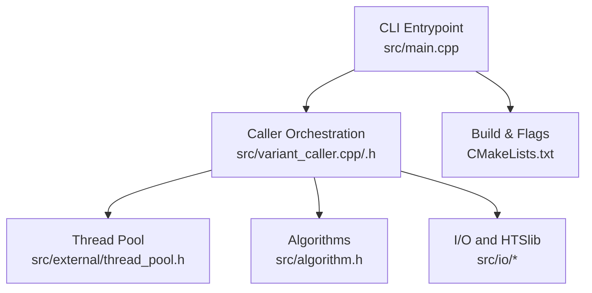
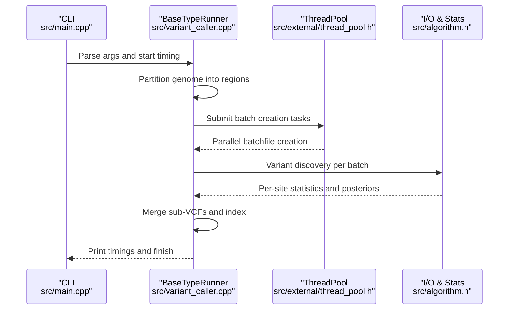
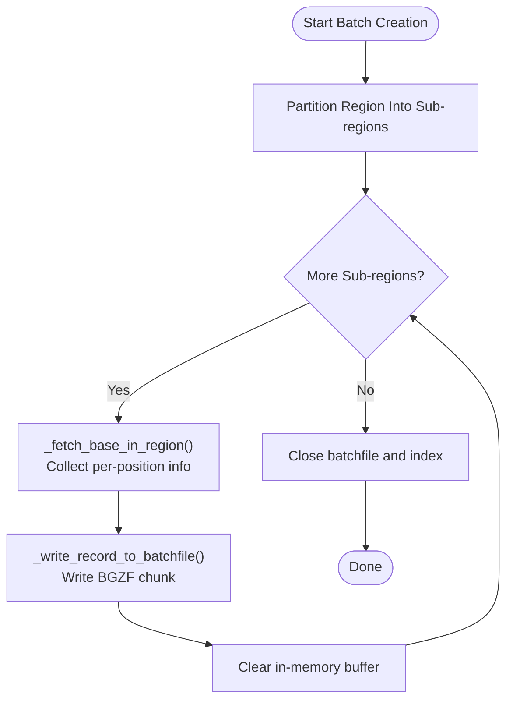
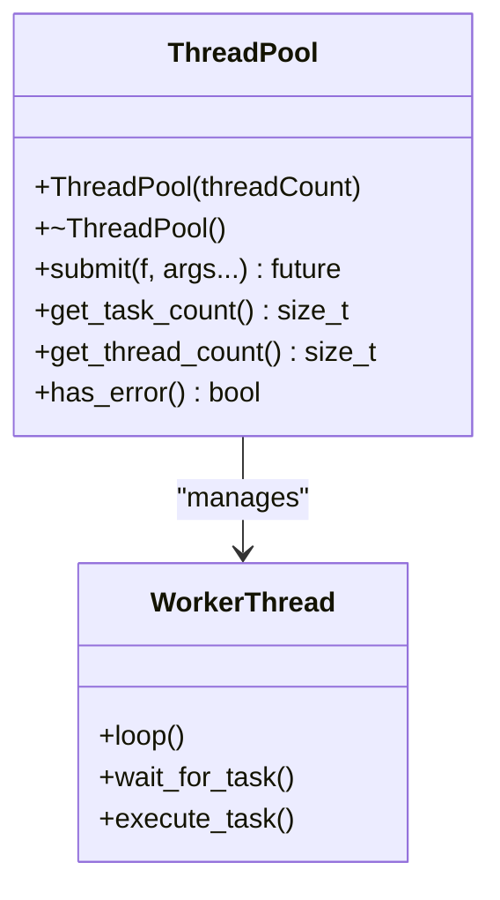
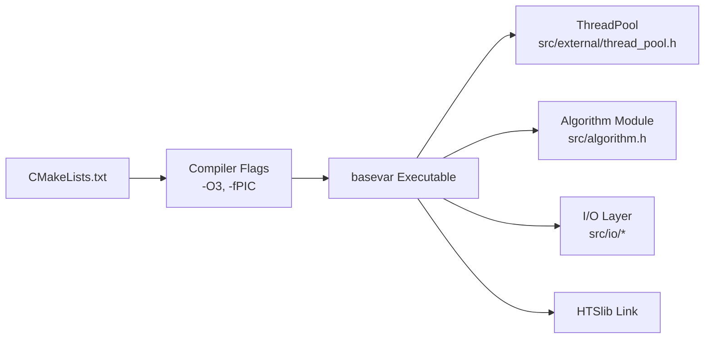

# Performance Characteristics and Advantages

<cite>
**Referenced Files in This Document**
- [README.md](file://README.md)
- [CMakeLists.txt](file://CMakeLists.txt)
- [src/main.cpp](file://src/main.cpp)
- [src/variant_caller.h](file://src/variant_caller.h)
- [src/variant_caller.cpp](file://src/variant_caller.cpp)
- [src/algorithm.h](file://src/algorithm.h)
- [src/external/thread_pool.h](file://src/external/thread_pool.h)
- [tests/io/test_threadpool.cpp](file://tests/io/test_threadpool.cpp)
- [scripts/example.sh](file://scripts/example.sh)
</cite>

## Table of Contents
1. [Introduction](#introduction)
2. [Project Structure](#project-structure)
3. [Core Components](#core-components)
4. [Architecture Overview](#architecture-overview)
5. [Detailed Component Analysis](#detailed-component-analysis)
6. [Dependency Analysis](#dependency-analysis)
7. [Performance Considerations](#performance-considerations)
8. [Troubleshooting Guide](#troubleshooting-guide)
9. [Conclusion](#conclusion)

## Introduction
This document focuses on BaseVar2’s performance characteristics and the computational advantages delivered by its C++ implementation over the original Python version. It documents:
- The 10x+ speed improvement enabled by native C++ execution
- Memory efficiency improvements (3–4 GB per thread vs. over 20 GB in Python)
- Batch processing optimizations and thread pool efficiency
- Practical configuration guidance for different data sizes and environments
- Scalability characteristics and benchmark-oriented recommendations

These claims are grounded in the project’s own documentation and implementation details.

## Project Structure
BaseVar2 is organized around a C++ core with a modular design:
- CLI entrypoint and runtime timing
- Variant calling orchestration with batch creation and merging
- Algorithmic modules for statistical inference
- A lightweight thread pool for parallelism
- HTSlib integration for efficient I/O

**Diagram sources**
- [src/main.cpp:43-92](file://src/main.cpp#L43-L92)
- [src/variant_caller.h:41-174](file://src/variant_caller.h#L41-L174)
- [src/variant_caller.cpp:343-438](file://src/variant_caller.cpp#L343-L438)
- [src/external/thread_pool.h:25-134](file://src/external/thread_pool.h#L25-L134)
- [src/algorithm.h:12-179](file://src/algorithm.h#L12-L179)
- [CMakeLists.txt:22-61](file://CMakeLists.txt#L22-L61)

**Section sources**
- [README.md:11](file://README.md#L11)
- [CMakeLists.txt:1-62](file://CMakeLists.txt#L1-L62)
- [src/main.cpp:1-93](file://src/main.cpp#L1-L93)
- [src/variant_caller.h:1-180](file://src/variant_caller.h#L1-L180)
- [src/variant_caller.cpp:1-1303](file://src/variant_caller.cpp#L1-L1303)
- [src/algorithm.h:1-180](file://src/algorithm.h#L1-L180)
- [src/external/thread_pool.h:1-137](file://src/external/thread_pool.h#L1-L137)

## Core Components
- CLI and timing: The main entrypoint logs start/end timestamps and CPU time for end-to-end execution.
- Variant caller: Orchestrates region partitioning, batch creation, parallel variant discovery, and VCF merging.
- Thread pool: A minimal C++11 thread pool used for parallel batch creation and processing.
- Algorithms: Statistical routines for genotype likelihoods, tests, and EM steps used during variant inference.
- Build configuration: CMake sets C++17 and enables aggressive optimization flags.

Key performance-relevant elements:
- Batch count controls memory footprint and throughput.
- Thread count controls parallelism.
- Stepwise region processing bounds memory growth.
- BGZF compression and indexing reduce I/O overhead.

**Section sources**
- [src/main.cpp:43-92](file://src/main.cpp#L43-L92)
- [src/variant_caller.h:41-174](file://src/variant_caller.h#L41-L174)
- [src/variant_caller.cpp:343-438](file://src/variant_caller.cpp#L343-L438)
- [src/external/thread_pool.h:25-134](file://src/external/thread_pool.h#L25-L134)
- [src/algorithm.h:12-179](file://src/algorithm.h#L12-L179)
- [CMakeLists.txt:22-61](file://CMakeLists.txt#L22-L61)

## Architecture Overview
The runtime architecture emphasizes:
- Region-based partitioning to bound memory and enable parallelism
- Batch creation with controlled batch sizes
- A thread pool for parallel batch generation
- Efficient I/O via BGZF and tabix indexing

**Diagram sources**
- [src/main.cpp:43-92](file://src/main.cpp#L43-L92)
- [src/variant_caller.cpp:343-438](file://src/variant_caller.cpp#L343-L438)
- [src/external/thread_pool.h:25-134](file://src/external/thread_pool.h#L25-L134)
- [src/algorithm.h:12-179](file://src/algorithm.h#L12-L179)

## Detailed Component Analysis

### Batch Creation and Memory Control
BaseVar2 partitions each calling region into fixed-size sub-regions to cap memory usage during base fetching and batch writing. The batch creation process:
- Uses a thread pool to parallelize batchfile generation
- Writes batchfiles in BGZF-compressed form with indices
- Supports “smart rerun” to avoid recomputation

**Diagram sources**
- [src/variant_caller.cpp:440-495](file://src/variant_caller.cpp#L440-L495)
- [src/variant_caller.cpp:497-542](file://src/variant_caller.cpp#L497-L542)

**Section sources**
- [src/variant_caller.cpp:440-495](file://src/variant_caller.cpp#L440-L495)
- [src/variant_caller.cpp:497-542](file://src/variant_caller.cpp#L497-L542)

### Thread Pool Efficiency
BaseVar2 implements a minimal C++11 thread pool with:
- Worker threads consuming a shared task queue
- Exception propagation to halt gracefully
- Futures for task result retrieval

**Diagram sources**
- [src/external/thread_pool.h:25-134](file://src/external/thread_pool.h#L25-L134)

**Section sources**
- [src/external/thread_pool.h:25-134](file://src/external/thread_pool.h#L25-L134)
- [tests/io/test_threadpool.cpp:7-29](file://tests/io/test_threadpool.cpp#L7-L29)

### Algorithmic Complexity and Statistics
The algorithm module provides:
- Vectorized math operations (sum, mean, std dev)
- Statistical tests (Fisher exact, Wilcoxon rank-sum)
- EM steps for allele frequency estimation

These routines are designed for moderate-sized vectors typical of per-site computations and benefit from C++’s memory locality and vectorization-friendly layouts.

**Section sources**
- [src/algorithm.h:24-179](file://src/algorithm.h#L24-L179)

### CLI Timing and Reporting
The CLI records wall-clock and CPU time for end-to-end execution, enabling straightforward benchmarking across configurations.

**Section sources**
- [src/main.cpp:43-92](file://src/main.cpp#L43-L92)

## Dependency Analysis
- Build flags: CMake sets C++17 and -O3 for aggressive optimization.
- Runtime libraries: Linkage to HTSlib and system libraries for I/O and compression.
- Internal dependencies: Caller orchestrator depends on thread pool, algorithms, and I/O helpers.

**Diagram sources**
- [CMakeLists.txt:22-61](file://CMakeLists.txt#L22-L61)
- [src/external/thread_pool.h:25-134](file://src/external/thread_pool.h#L25-L134)
- [src/algorithm.h:12-179](file://src/algorithm.h#L12-L179)

**Section sources**
- [CMakeLists.txt:22-61](file://CMakeLists.txt#L22-L61)

## Performance Considerations

### Speedup vs. Python: 10x+
- The project explicitly reports that the C++ implementation exceeds 10 times the speed of the original Python version while using substantially less memory.
- This is primarily attributed to native execution, reduced interpreter overhead, and efficient I/O via HTSlib.

**Section sources**
- [README.md:11](file://README.md#L11)

### Memory Efficiency: 3–4 GB per Thread vs. >20 GB
- With batch count tuned to 200 and per-thread memory in the 3–4 GB range, BaseVar2 achieves a dramatic reduction in memory usage compared to the Python version’s >20 GB per thread.
- The memory footprint is bounded by:
  - Fixed-size sub-region processing
  - Controlled batch sizes
  - BGZF streaming writes

**Section sources**
- [README.md:11](file://README.md#L11)
- [src/variant_caller.cpp:506-542](file://src/variant_caller.cpp#L506-L542)

### Batch Processing Optimizations
- Batch count controls the number of input files grouped per batch, balancing throughput and memory.
- Smart rerun avoids recomputation when outputs already exist.
- Region-wise partitioning ensures predictable memory growth and parallelism.

Practical guidance:
- Larger batch counts improve throughput but increase peak memory; tune to stay within 3–4 GB per thread.
- Enable smart rerun for iterative runs to avoid redundant work.

**Section sources**
- [src/variant_caller.cpp:440-495](file://src/variant_caller.cpp#L440-L495)
- [src/variant_caller.cpp:497-542](file://src/variant_caller.cpp#L497-L542)

### Thread Pool Efficiency
- The thread pool scales with the number of batches and region partitions.
- Use thread counts aligned with available cores and I/O capacity.
- Monitor task queue length to avoid saturation.

Validation example:
- A simple enqueue test demonstrates futures and basic throughput.

**Section sources**
- [src/external/thread_pool.h:25-134](file://src/external/thread_pool.h#L25-L134)
- [tests/io/test_threadpool.cpp:7-29](file://tests/io/test_threadpool.cpp#L7-L29)

### Configuration Examples for Optimal Settings
Below are recommended configurations derived from documented defaults and performance characteristics. Replace placeholders with your environment specifics.

- Small-scale (low memory, modest cores):
  - Threads: 4–8
  - Batch count: 200–500
  - Regions: targeted subset
  - Example invocation:
    - basevar caller -f reference.fasta -o output.vcf.gz -Q 20 -q 30 -B 200 -t 6 -r chr1:1000000-2000000 in1.bam in2.bam ...

- Medium-scale (balanced throughput and memory):
  - Threads: 12–24
  - Batch count: 200–500
  - Regions: chromosome-wide or selected chromosomes
  - Example invocation:
    - basevar caller -f reference.fasta -o output.vcf.gz -Q 20 -q 30 -B 300 -t 16 -L bam.list in1.bam ...

- Large-scale (high-throughput, sufficient RAM):
  - Threads: up to machine cores
  - Batch count: 200–500
  - Regions: whole genome or chromosome-wise
  - Example invocation:
    - basevar caller -f reference.fasta -o output.vcf.gz -Q 20 -q 30 -B 500 -t 24 in1.bam in2.bam ...

- Pipeline-driven distribution:
  - Use the pipeline generator to split work by chromosome and delta, then run BaseVar per partition.
  - Example:
    - basevar pipeline -o output_directory/ --ref_fai human_reference.fa.fai -c chr1 -d 5000000 -f human_reference.fa -t 24 -L input_bamfile.list > run_chr1_basevar_shell.sh

Notes:
- Adjust -Q and -q to filter low-quality bases and reads according to data quality.
- Use -r to restrict analysis to candidate regions to reduce runtime and memory.
- Use --filename-has-samplename to accelerate sample ID extraction when filenames encode sample IDs.

**Section sources**
- [README.md:132-144](file://README.md#L132-L144)
- [scripts/example.sh:1-8](file://scripts/example.sh#L1-L8)

### Scalability Characteristics and Benchmarks
- Region partitioning and batch creation scale linearly with the number of regions and batches.
- Throughput increases approximately linearly with thread count up to I/O limits.
- Memory footprint remains bounded by sub-region size and batch count, enabling predictable resource planning.

Benchmarking tips:
- Measure wall-clock and CPU time using the CLI timing output.
- Compare runs with varying -B and -t to identify the sweet spot for your hardware.
- Use targeted regions (-r) for quick iterations; expand to whole genome for production.

**Section sources**
- [src/main.cpp:43-92](file://src/main.cpp#L43-L92)
- [src/variant_caller.cpp:343-438](file://src/variant_caller.cpp#L343-L438)

## Troubleshooting Guide
- Symptom: Excessive memory usage
  - Cause: Very large batch counts or very large regions
  - Fix: Reduce -B and use -r to limit regions
- Symptom: Slow performance
  - Cause: Too few threads or I/O-bound bottlenecks
  - Fix: Increase -t; ensure fast storage and index availability
- Symptom: Repeated recomputation cost
  - Fix: Use --smart-rerun to reuse existing batchfiles and indexes
- Symptom: Unexpected errors in parallel tasks
  - Fix: Inspect thread pool error reporting; reduce concurrency or adjust workload

**Section sources**
- [src/variant_caller.cpp:440-495](file://src/variant_caller.cpp#L440-L495)
- [src/external/thread_pool.h:25-134](file://src/external/thread_pool.h#L25-L134)

## Conclusion
BaseVar2’s C++ implementation delivers substantial performance gains over the Python predecessor, with a documented 10x+ speedup and dramatically lower memory usage (3–4 GB per thread vs. >20 GB). These improvements arise from:
- Native execution and optimized builds
- Region-wise processing and controlled batch sizes
- A lightweight thread pool for parallelism
- Efficient I/O via BGZF and HTSlib

By tuning -B and -t appropriately and leveraging region targeting and smart reruns, users can achieve scalable, memory-efficient variant calling across diverse data sizes and computational environments.