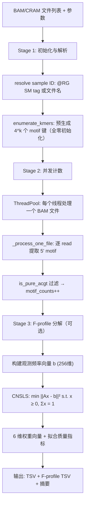
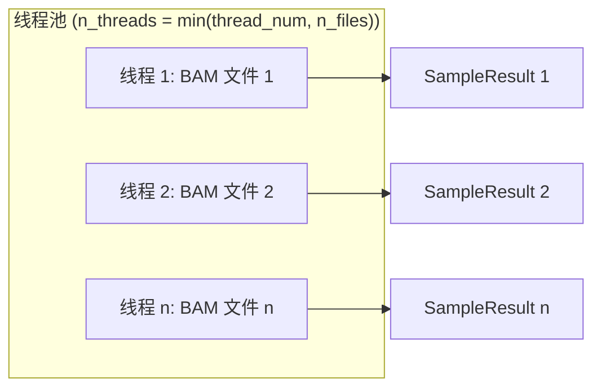
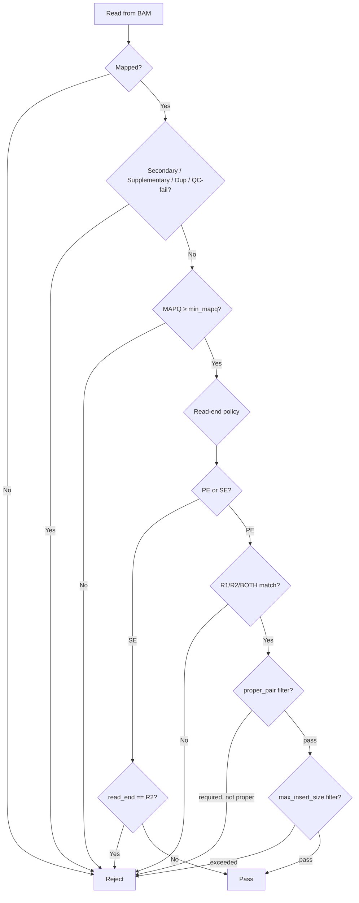

# Handoff — `basevar motif`：BaseVar cfDNA End-Motif 计数与分析子命令方法详解

> 核心文件：`src/motif_counter.h`、`src/motif_counter.cpp`  
> 依赖文件：`src/fprofile_data.h`、`src/io/bam.h/.cpp`、`src/io/bam_record.h`、`src/io/bam_header.h`、`src/io/fasta.h`、`src/io/utils.h`、`src/external/thread_pool.h`  
> 作者：Shujia Huang

---

**文档结构总览**：

| 章节 | 内容 |
|---|---|
| **§1 模块概述** | 功能定位、Lo 惯例、推荐调用方式 |
| **§2 整体架构与数据流** | 三阶段流水线（解析→并发计数→F-profile）、Mermaid 流程图 |
| **§3 核心数据结构** | SampleResult、MotifArgs、MotifCounterRunner |
| **§4 方法详解（15 个方法）** | 从参数解析到 TSV 输出，含设计原因和实例 |
| **§5 cfDNA End-Motif 生物学与 Lo 惯例** | 5' end-motif 定义、read-based vs reference-based 差异、文献溯源 |
| **§6 F-profile 分解** | NMF 背景、CNSLS 算法（投影梯度下降，已修复 PE1）、Gauss-Jordan 消元，含数值实例 |
| **§7 Motif Diversity Score（MDS）** | Shannon 熵归一化、生物学含义，含数值实例 |
| **§8 端到端实例** | 从输入 BAM 到 TSV 输出的完整追踪 |
| **§9 方法优势与缺陷分析** | 8 项优势 + 6 项局限 + 2 项原理性错误（PE1-PE2，均已修复）；§9.3 原理性错误分析；§9.4 改进方向 |
| **§10 关键设计决策** | 8 项核心设计决策及原因 |
| **§11 文件索引** | 7 个关键源文件及其职责 |
| **附录 A** | 参考文献 |

## 1. 模块概述

### 1.1 这个模块做什么？

`basevar motif` 是 BaseVar 的 cfDNA end-motif（末端序列基序）计数子命令，专为**非侵入性产前检测（NIPT）**和**液体活检**等低深度 cfDNA 全基因组测序场景设计。它从 BAM/CRAM 比对文件中提取每个 cfDNA 片段的 **5' 末端 k-mer**（默认 $k=4$），统计各 motif 的出现频次，并输出 per-sample TSV 文件。

模块遵循 **Lo 实验室（Dennis Lo 教授团队）** 建立的 canonical 方法（Jiang et al., Cancer Discovery 2020），同时提供灵活的参数以适配不同实验场景。

### 1.2 核心能力

| 能力 | 说明 |
|---|---|
| **End-motif 提取** | 从 BAM SEQ 或参考基因组 FASTA 提取 5' 末端 k-mer |
| **多样本并行** | 每个 BAM/CRAM 文件由独立线程处理，互不干扰 |
| **灵活过滤** | MAPQ、proper pair、insert size、read end (R1/R2/BOTH) |
| **F-profile 分解** | CNSLS 将 256 种 4-mer 频率分解为 6 个组织特征权重（Zhou et al., PNAS 2023） |
| **MDS 多样性评分** | 归一化 Shannon 熵，量化 motif 分布的多样性 |

### 1.3 推荐调用方式（复现 Lo 惯例）

```bash
# Lo lab canonical method (Jiang et al., Cancer Discovery 2020)
basevar motif --from-reference -f ref.fa \
              --reads both --proper-pair --max-insert-size 1000 \
              -q 30 -l 4 -o out.tsv  in1.bam in2.bam ...

# 保守默认（不需要 FASTA）
basevar motif -l 4 -q 30 -o out.tsv in1.bam in2.bam
```

---

## 2. 整体架构与数据流

### 2.1 三阶段流水线



### 2.2 并行化策略

模块采用**文件级并行**：每个输入 BAM/CRAM 文件由线程池中的一个独立线程处理。



**为什么不需要锁？**

每个线程仅访问自己的 `SampleResult` 实例，不共享任何可变状态。`_process_one_file()` 的参数为 `SampleResult&`（引用），线程间通过索引隔离。Fasta 实例也是 per-worker（因为 `ngslib::Fasta` 非线程安全）。

---

## 3. 核心数据结构

### 3.1 SampleResult

```cpp
struct SampleResult {
    std::string sample_id;        // 样本 ID（@RG SM tag 或文件名）
    std::string input_path;       // 输入 BAM/CRAM 路径
    uint64_t total_reads     = 0; // 扫描的所有 reads
    uint64_t filtered_reads  = 0; // 未通过过滤器的 reads
    uint64_t used_reads      = 0; // 贡献到 motif 计数的 reads
    uint64_t n_motifs_with_n = 0; // 含非 ACGT 碱基的 motif（被排除）
    std::map<std::string, uint64_t> motif_counts;  // 4^k 个 motif → 计数
    std::vector<double> fprofile_weights;           // F-profile 权重（6 维）
    double fprofile_raw_sum   = 0.0;                // CNSLS 权重和（约束下 = 1.0）
    double fprofile_residual  = 0.0;                // ||Ax - b||² 残差
};
```

**数据流**：

$$
\text{BAM reads} \xrightarrow{\text{filter}} \text{used\_reads} \xrightarrow{\text{extract\_motif}} \text{motif\_counts} \xrightarrow{\text{CNSLS}} \text{fprofile\_weights}
$$

### 3.2 MotifArgs

存储所有命令行参数，含默认值：

| 参数 | 标志 | 默认值 | 说明 |
|---|---|---|---|
| `motif_length` | `-l` | 4 | k-mer 长度，范围 [1, 10] |
| `min_mapq` | `-q` | 30 | 最低比对质量 |
| `thread_num` | `-t` | 硬件并发数 | 工作线程数 |
| `read_end` | `--reads` | R1 | Read 端选择策略 |
| `include_zero` | `--include-zero` | true | TSV 中是否输出零计数 motif |
| `from_reference` | `--from-reference` | false | 从 FASTA 而非 BAM SEQ 提取 motif |
| `proper_pair` | `--proper-pair` | false | 仅保留 proper pair reads |
| `max_insert_size` | `--max-insert-size` | 0 (禁用) | 最大插入片段长度 |
| `fprofile` | `--fprofile` | false | 是否计算 F-profile 分解 |

### 3.3 ReadEnd 枚举

```cpp
enum class ReadEnd { R1, R2, BOTH };
```

控制 paired-end 数据中使用哪个 read end：
- **R1**（默认）：仅使用 read 1 的 5' 端
- **R2**：仅使用 read 2 的 5' 端
- **BOTH**：每个片段贡献两个 end-motif（Lo 惯例）

---

## 4. 方法详解

### 4.1 `reverse_complement_base(char base)` — 单碱基反向互补

**文件**：`motif_counter.cpp` 第 97-105 行

$$
\text{rc}(b) = \begin{cases}
T & b \in \{A, a\} \\
G & b \in \{C, c\} \\
C & b \in \{G, g\} \\
A & b \in \{T, t\} \\
N & \text{otherwise}
\end{cases}
$$

非 ACGT 字符统一映射为 N。大小写均处理。

#### 数值实例

| 输入 | A | C | G | T | N | X | a |
|---|---|---|---|---|---|---|---|
| 输出 | T | G | C | A | N | N | T |

### 4.2 `reverse_complement(const string& s)` — 字符串反向互补

**文件**：`motif_counter.cpp` 第 107-114 行

$$
\text{RC}(s) = \text{rc}(s_{|s|}) \circ \text{rc}(s_{|s|-1}) \circ \cdots \circ \text{rc}(s_1)
$$

即反转字符串后对每个碱基取互补。

#### 数值实例

| 输入 | ACGT | AAAA | CCATG |
|---|---|---|---|
| 输出 | ACGT | TTTT | CATGG |

注意 `ACGT` 的反向互补是自身（回文序列）。

### 4.3 `extract_5p_motif(BamRecord& r, int k)` — 从 BAM SEQ 提取 5' end-motif

**文件**：`motif_counter.cpp` 第 116-133 行

这是 BaseVar 的**保守默认路径**，不需要 FASTA 文件。

```
extract_5p_motif(r, k):
    if r is unmapped or k ≤ 0:
        return ""
    
    seq ← r.query_sequence()    // BAM SEQ 字段（reference-forward 方向）
    if |seq| < k:
        return ""
    
    if r.is_mapped_reverse():
        // 反向比对：原始 read 的 5' 端在 SEQ 末尾
        return reverse_complement(seq[|seq|-k : |seq|])
    else:
        // 正向比对：原始 read 的 5' 端在 SEQ 开头
        return seq[0 : k]
```

**关键设计**：BAM 的 SEQ 字段以 reference-forward 方向存储。对于反向比对的 read，其原始测序方向的 5' 端位于 SEQ 末尾，需要取最后 $k$ 个碱基并反向互补。

#### 数值实例

设 $k=4$，read 的 BAM SEQ = `ACGTACGT`：

| 比对方向 | 提取位置 | 提取结果 | RC 后 | 最终 motif |
|---|---|---|---|---|
| Forward (+) | SEQ[0:4] = `ACGT` | `ACGT` | — | **ACGT** |
| Reverse (−) | SEQ[4:8] = `ACGT` | `ACGT` | RC(`ACGT`) = `ACGT` | **ACGT** |

设 BAM SEQ = `AATTCCGG`：

| 比对方向 | 提取位置 | 提取结果 | RC 后 | 最终 motif |
|---|---|---|---|---|
| Forward (+) | SEQ[0:4] = `AATT` | `AATT` | — | **AATT** |
| Reverse (−) | SEQ[4:8] = `CCGG` | `CCGG` | RC(`CCGG`) = `CCGG` | **CCGG** |

### 4.4 `extract_5p_motif_from_reference()` — 从参考基因组提取 5' end-motif

**文件**：`motif_counter.cpp` 第 135-185 行

这是 **Lo 实验室 canonical 方法**，从参考基因组 FASTA 提取 motif。

```
extract_5p_motif_from_reference(r, fa, hdr, k):
    if r is unmapped or k ≤ 0:
        return ""
    
    chrom ← r.tid_name(hdr)
    chrom_len ← fa.seq_length(chrom)
    if chrom is empty or chrom_len = 0:
        return ""
    
    if r.is_mapped_reverse():
        end ← r.map_ref_end_pos()    // 半开区间的右端
        if end < k or end > chrom_len:
            return ""
        ref_kmer ← fa.fetch(chrom, end - k, end - 1)    // 取 end 前 k 个碱基
        ref_kmer ← to_uppercase(ref_kmer)                // 处理 soft-masked 序列
        return reverse_complement(ref_kmer)
    else:
        pos ← r.map_ref_start_pos()  // 0-based 起始位置
        if pos < 0 or pos + k > chrom_len:
            return ""
        ref_kmer ← fa.fetch(chrom, pos, pos + k - 1)    // 取 pos 处 k 个碱基
        ref_kmer ← to_uppercase(ref_kmer)
        return ref_kmer
```

**为什么要 `to_uppercase`？** 某些参考基因组（如人类 hg38）包含 soft-masked 区域（小写重复序列），必须统一为大写 ACGT。

#### 数值实例

设 $k=4$，参考基因组 chr1 序列为 `...ATGCGATCGATCG...`：

| read 比对 | pos | end | 提取区间 | ref kmer | RC 后 | 最终 motif |
|---|---|---|---|---|---|---|
| Forward | 3 | 10 | [3, 6] | `GCGA` | — | **GCGA** |
| Reverse | 3 | 10 | [6, 9] | `TCGA` | RC(`TCGA`) = `TCGA` | **TCGA** |

### 4.5 `_resolve_sample_id(filename)` — 样本 ID 解析

**文件**：`motif_counter.cpp` 第 623-637 行

优先级：
1. 若 `--filename-has-samplename`：从文件名提取（去除路径和扩展名）
2. 否则：从 BAM `@RG` 的 `SM` 标签读取
3. 回退：使用文件名 stem

```
_resolve_sample_id(fn):
    if filename_has_samplename:
        return filename_stem(fn)    // /path/SampleA.sort.bam → "SampleA"
    
    try:
        sm ← bam_header.get_sample_name()
        if sm is non-empty:
            return sm
    catch:
        warn("Cannot read @RG SM tag")
    
    return filename_stem(fn)    // 回退
```

### 4.6 `_passes_filters(BamRecord& r)` — Read 过滤策略

**文件**：`motif_counter.cpp` 第 639-672 行

```
_passes_filters(r):
    if r is unmapped:         return false
    if r is secondary:        return false    // 次优比对
    if r is supplementary:    return false    // chimeric 拆分片段
    if r is duplicate:        return false    // PCR 重复
    if r is qc_fail:          return false
    if r.mapq < min_mapq:     return false
    
    // Read-end 策略
    if r is paired:
        switch read_end:
            R1:   if not is_read1: return false
            R2:   if not is_read2: return false
            BOTH: accept either
    else:  // single-end
        if read_end == R2: return false
    
    // PE 专属过滤
    if r is paired and proper_pair and not is_proper_pair:
        return false
    if r is paired and max_insert_size > 0:
        if |r.insert_size| > max_insert_size:
            return false
    
    return true
```

**过滤逻辑流程图**：



### 4.7 `_process_one_file(SampleResult& s)` — 单文件处理核心

**文件**：`motif_counter.cpp` 第 674-739 行

这是每个 worker 线程的核心逻辑。

```
_process_one_file(s):
    bam ← open(s.input_path)
    fa  ← if from_reference: open_fasta(reference)    // per-worker Fasta
    hdr ← bam.header()
    k   ← motif_length
    
    regions ← parse(comma-separated regions)
    
    for each read r in bam:
        total_reads++
        
        if not _passes_filters(r):
            filtered_reads++
            continue
        
        motif ← if from_reference:
                    extract_5p_motif_from_reference(r, fa, hdr, k)
                else:
                    extract_5p_motif(r, k)
        
        if motif is empty:
            filtered_reads++
            continue
        
        if not is_pure_acgt(motif):    // 含 N 或 IUPAC 模糊码
            n_motifs_with_n++
            continue
        
        motif_counts[motif]++
        used_reads++
```

**区域模式下的去重**：当指定 `-r` 时，多个区域可能重叠，同一条 read 可能被多次访问。使用 `unordered_set<string>` 存储已处理的 read key（`qname + "/1"` 或 `qname + "/0"`）来去重。

### 4.8 `is_pure_acgt(string& s)` — ACGT 纯度检查

**文件**：`motif_counter.cpp` 第 235-240 行

$$
\text{is\_pure\_acgt}(s) = (|s| > 0) \land \forall c \in s: c \in \{A, C, G, T\}
$$

**为什么不能只用 `find('N')`？**

BAM 的 4-bit SEQ 编码中，`ngslib::_BASES[16]` 将代码 1/2/4/8/15 映射为 A/C/G/T/N，但**所有其他代码**（IUPAC 模糊码 M/R/W/S/Y/K/V/H/D/B = 3/5/6/7/9/10/11/12/13/14）映射为**空格字符 `' '`**，而非 `'N'`。简单的 `find('N')` 检查会让这些模糊码通过，产生格式错误的 TSV 行。

### 4.9 `enumerate_kmers(k, dst)` — 全 k-mer 枚举

**文件**：`motif_counter.cpp` 第 211-223 行

生成所有 $4^k$ 个 k-mer 并初始化为零计数：

$$
\mathcal{M}_k = \{A, C, G, T\}^k = \{b_1 b_2 \cdots b_k : b_i \in \{A, C, G, T\}\}
$$

$|\mathcal{M}_k| = 4^k$。对于 $k=4$：$|\mathcal{M}_4| = 256$。

生成顺序为字典序：AAAA, AAAC, AAAG, ..., TTTT。使用递归回溯实现。

### 4.10 `_write_tsv(path)` — TSV 输出

**文件**：`motif_counter.cpp` 第 741-759 行

输出格式：

```
#sample	motif	count	frequency
SampleA	AAAA	1234	0.012340
SampleA	AAAC	567	0.005670
...
SampleB	AAAA	2345	0.023450
```

频率计算：

$$
\text{freq}(m) = \frac{\text{count}(m)}{\text{used\_reads}}
$$

其中 `used_reads` 不包含含非 ACGT 碱基的 motif（即 `n_motifs_with_n` 被排除）。

### 4.11 `run()` — 主控制流

**文件**：`motif_counter.cpp` 第 872-985 行

```
run():
    // Stage 1: 初始化（顺序执行）
    validate output paths
    n_threads ← min(thread_num, n_files)
    
    for i = 0 to n_files-1:
        results[i].input_path ← input_bf[i]
        results[i].sample_id  ← _resolve_sample_id(input_bf[i])
        _initialize_motifs_for(results[i])    // 生成 4^k 个零键
    
    // Stage 2: 并发处理
    if n_threads ≤ 1 or n_files ≤ 1:
        for each file: _process_one_file(results[i])
    else:
        pool ← ThreadPool(n_threads)
        for each file: pool.submit(() => _process_one_file(results[i]))
        for each future: future.get()
    
    // Stage 3: F-profile 分解（可选，仅 k=4）
    if fprofile:
        warn_if_non_canonical_params()    // PE2 修复：参数偏离 canonical 时警告
        A ← FPROFILE_DATA (256 × 6)
        for each sample s:
            b ← observed frequency vector (256维)
            x ← cnls_solve(A, b, 256, 6)    // CNSLS: x ≥ 0, Σx = 1
            compute residual ||Ax - b||²
            x → fprofile_weights
    
    _print_summary(stdout)
    if output_file: _write_tsv(output_file)
    if fprofile_output: _write_fprofile_tsv(fprofile_output)
```

---

## 5. cfDNA End-Motif 生物学与 Lo 惯例

### 5.1 什么是 End-Motif？

cfDNA（cell-free DNA）片段在血液中被核小体保护并经过核酸酶切割后，其 5' 末端具有**非随机的序列偏好**。这种偏好反映了产生 cfDNA 的细胞类型和组织来源。

**5' end-motif** 定义为 cfDNA 片段 5' 末端的前 $k$ 个碱基（默认 $k=4$），即 256 种可能的 4-mer。

### 5.2 Lo 实验室 Canonical 方法

| 要素 | Lo 惯例 | BaseVar 默认 |
|---|---|---|
| Motif 来源 | 参考基因组 FASTA | BAM SEQ（保守回退） |
| Read end | BOTH（每个片段两个 motif） | R1（仅 read 1） |
| Proper pair | 是 | 否 |
| Insert size cap | ~1000 bp | 无限制 |
| MAPQ 阈值 | ≥ 30 | ≥ 30 |
| 非 ACGT motif | 排除 | 排除 |

**文献溯源**：
1. Jiang et al. (2020) 首次建立 end-motif 谱作为癌症、妊娠和移植的片段组学标志物
2. Mao et al. (Cell Genomics 2026) 明确声明 EM5/EM3 motifs "were deduced from the reference genome"
3. FinaleToolkit (Zheng et al., bioRxiv 2024) 是开源参考实现，始终从 FASTA 提取

**read-based vs reference-based 的差异**：

| 场景 | read-based | reference-based |
|---|---|---|
| 需要 FASTA | 否 | 是 |
| 测序错误影响 | 是（read 末端的测序错误会改变 motif） | 否（使用参考碱基） |
| Soft-clipping | 可能丢失 motif（read 5' 端被裁剪） | 不受影响 |
| 一致性 | 与 FinaleToolkit 不一致 | 与 FinaleToolkit 一致 |

---

## 6. F-profile 分解

### 6.1 背景：NMF 与 F-profile

Zhou et al. (PNAS 2023) 通过对大规模 cfDNA 队列进行 **非负矩阵分解（NMF）**，发现了 6 个 "founder" end-motif 谱（F-profile I-VI），每个谱是一个 256 维向量，代表特定组织/细胞类型的 end-motif 特征。

F-profile 分解的目标：将观测到的 256 种 4-mer 频率向量 $\mathbf{b}$ 分解为 6 个参考谱的非负线性组合：

$$
\mathbf{b} \approx \sum_{j=1}^{6} x_j \mathbf{a}_j = A \mathbf{x}, \quad x_j \geq 0
$$

其中 $A$ 是 $256 \times 6$ 的参考矩阵（`FPROFILE_DATA`），$\mathbf{a}_j$ 是第 $j$ 个 F-profile。

### 6.2 NNLS 与 CNSLS 优化问题

> **已修复**：原无约束 NNLS + 后验归一化已替换为带单纯形约束的 CNSLS（见 §6.2.1）。

原始 formulation 为无约束非负最小二乘：

$$\min_{\mathbf{x}} \|A\mathbf{x} - \mathbf{b}\|^2 \quad \text{s.t.} \quad x_j \geq 0, \; \forall j$$

修复后的 formulation 嵌入 $\sum x_j = 1$ 约束（概率单纯形）：

$$\min_{\mathbf{x}} \|A\mathbf{x} - \mathbf{b}\|^2 \quad \text{s.t.} \quad x_j \geq 0, \; \sum_{j=1}^{n} x_j = 1$$

这是一个凸优化问题，使用**投影梯度下降法**（见 §6.2.1）在概率单纯形上求解。

### 6.3 CNSLS 算法：概率单纯形上的投影梯度下降（已修复 PE1）

```
cnls_solve(A, b, m, n):    // m=256, n=6
    // 预计算 Gram 矩阵
    G ← A^T A              // n × n
    Atb ← A^T b            // n × 1
    x ← [1/n, 1/n, ..., 1/n]    // 初始可行解（均匀分布）
    step ← 1 / trace(G)         // 保守步长（trace ≥ spectral norm）
    
    for iter = 1 to MAX_ITER:
        // 梯度：grad = Gx - A^T b
        grad ← G * x - Atb
        
        // 投影梯度步
        x_new ← project_onto_simplex(x - step * grad)
        
        // 收敛检查
        if ||x_new - x|| < ε:
            break
        x ← x_new
    
    return x
```

**`project_onto_simplex(v)`** 使用 Michelot (1986) / Duchi et al. (2008) 排序算法：

```
project_onto_simplex(v, n):
    u ← sort(v, descending)
    find ρ = max{j : u[j] - (Σ_{i=1}^{j} u[i] - 1)/j > 0}
    θ = (Σ_{i=1}^{ρ} u[i] - 1) / ρ
    for i = 0 to n-1:
        x[i] = max(v[i] - θ, 0)
    return x
```

对于 $n=6$ 的小系统，投影梯度法通常在几百次迭代内收敛，每次迭代仅 $O(n^2) = O(36)$ 运算。收敛性由凸目标 + 凸约束集 + 保守步长保证。

**与旧方法（NNLS + 后验归一化）的区别**：

| 对比项 | 旧方法（NNLS + 归一化） | 新方法（CNSLS） |
|---|---|---|
| 优化约束 | $x \geq 0$（无求和约束） | $x \geq 0$, $\sum x_j = 1$ |
| 后处理 | 除以 $\sum x_j$ 强制归一化 | 无需后处理（约束已嵌入） |
| 数学最优性 | 归一化后解**不是** CNSLS 最优解 | 严格满足 CNSLS 最优性条件 |
| 残差 | $\sum x_j \neq 1$ 时残差偏大 | 在约束下最小化残差 |
| 实现 | Lawson-Hanson NNLS | 投影梯度下降 + Simplex 投影 |

> **注意**：旧方法的 Lawson-Hanson NNLS 实现（`nnls_solve()`）保留在代码中，但 Stage 3 已不再调用。以下为旧算法伪代码，仅作参考：

```
nnls_solve(A, b, m, n):    // legacy, no longer called by Stage 3
    // 预计算 Gram 矩阵
    G ← A^T A              // n × n
    Atb ← A^T b            // n × 1
    x ← [0, 0, ..., 0]     // 初始解
    passive ← [false, false, ..., false]    // 被动集（允许非零的变量）
    
    for outer = 1 to 3n:
        // 梯度：w = A^T(b - Ax) = Atb - Gx
        w ← Atb - G * x
        
        // 找到活跃集中梯度最大的变量
        max_t ← argmax{j : not passive[j]} w[j]
        if max_t < 0 or w[max_t] ≤ ε:
            break    // 收敛
        
        passive[max_t] ← true    // 加入被动集
        
        for inner = 1 to 3n:
            // 在被动集上求解无约束子系统
            G_P ← G[passive, passive]
            b_P ← Atb[passive]
            s_P ← solve(G_P, b_P)    // Gauss-Jordan 消元
            
            if all(s_P > 0):
                x[passive] ← s_P     // 接受无约束解
                break
            
            // 插值：找到最大的 α ∈ [0,1] 使 x + α(s-x) ≥ 0
            α ← min{1, x[i]/(x[i]-s_P[i]) : s_P[i] ≤ 0}
            x[passive] ← x[passive] + α * (s_P - x[passive])
            
            // 将降为零的变量移回活跃集
            for i in passive:
                if x[i] < ε:
                    x[i] ← 0
                    passive[i] ← false
    
    // 归一化
    wsum ← Σ x[j]
    return x / wsum
```

### 6.4 Gauss-Jordan 消元（线性子系统求解）

```
solve_linear_system(M, rhs, k):    // M: k×k, rhs: k×1
    for col = 0 to k-1:
        // 部分主元选取
        max_row ← argmax{row ≥ col} |M[row][col]|
        if |M[max_row][col]| < 1e-15:
            return false    // 奇异矩阵
        
        swap rows col and max_row
        
        // 归一化主元行
        pivot ← M[col][col]
        M[col][col:] /= pivot
        rhs[col] /= pivot
        
        // 消元其他行
        for row ≠ col:
            factor ← M[row][col]
            M[row][col:] -= factor * M[col][col:]
            rhs[row] -= factor * rhs[col]
    
    return rhs    // 即为解 x
```

### 6.5 数值实例：旧 NNLS 算法演示（仅供参考）

> **注意**：以下实例演示的是已废弃的 Lawson-Hanson NNLS 算法流程。当前代码使用 CNSLS（见 §6.3）。保留此实例仅供理解旧算法和对比之用。

设简化场景：$m=4$ 个观测，$n=2$ 个 F-profile，$k=2$：

$$
A = \begin{pmatrix} 0.3 & 0.1 \\ 0.2 & 0.4 \\ 0.4 & 0.2 \\ 0.1 & 0.3 \end{pmatrix}, \quad
\mathbf{b} = \begin{pmatrix} 0.26 \\ 0.28 \\ 0.36 \\ 0.14 \end{pmatrix}
$$

**Step 1**：预计算 Gram 矩阵：

$$
G = A^T A = \begin{pmatrix} 0.3^2+0.2^2+0.4^2+0.1^2 & 0.3\times0.1+0.2\times0.4+0.4\times0.2+0.1\times0.3 \\ \cdots & 0.1^2+0.4^2+0.2^2+0.3^2 \end{pmatrix} = \begin{pmatrix} 0.30 & 0.22 \\ 0.22 & 0.30 \end{pmatrix}
$$

$$
A^T\mathbf{b} = \begin{pmatrix} 0.3\times0.26+0.2\times0.28+0.4\times0.36+0.1\times0.14 \\ 0.1\times0.26+0.4\times0.28+0.2\times0.36+0.3\times0.14 \end{pmatrix} = \begin{pmatrix} 0.292 \\ 0.252 \end{pmatrix}
$$

**Step 2**：初始梯度 $\mathbf{w} = A^T\mathbf{b} - G\mathbf{x} = (0.292, 0.252)$（$\mathbf{x} = \mathbf{0}$）。最大梯度为 $w_0 = 0.292$，将变量 0 加入被动集。

**Step 3**：在被动集 $\{0\}$ 上求解子系统：$G_{00} s_0 = (A^T\mathbf{b})_0$，即 $0.30 s_0 = 0.292$，$s_0 = 0.973 > 0$。接受，$\mathbf{x} = (0.973, 0)$。

**Step 4**：更新梯度，检查是否还需加入变量 1。若 $w_1 > \epsilon$，将变量 1 加入被动集，重新求解 $2 \times 2$ 子系统。

**实际场景**：在旧代码中，$m=256$（所有 4-mer），$n=6$（6 个 F-profile），Lawson-Hanson 保证在 $3 \times 6 = 18$ 次外循环内收敛。当前 CNSLS 对同样规模的问题通常在几百次投影梯度迭代内收敛。

---

## 7. Motif Diversity Score（MDS）

### 7.1 定义

MDS 是归一化 Shannon 熵，度量 motif 分布的多样性：

$$
\text{MDS} = \frac{H}{\log_2(4^k)} = \frac{-\sum_{m \in \mathcal{M}_k} p_m \log_2 p_m}{2k}
$$

其中 $p_m = \text{count}(m) / \text{used\_reads}$。

**范围**：$\text{MDS} \in [0, 1]$

| MDS | 含义 |
|---|---|
| 1.0 | 完全均匀分布（所有 256 种 motif 等概率） |
| ≈ 0.8-0.9 | 健康 cfDNA 样本的典型范围 |
| ≈ 0 | 所有 reads 共享同一种 motif |

### 7.2 数值实例

设 $k=2$（$4^2=16$ 种 motif），观测到 100 条 reads，其中 AA=60, CC=30, GG=8, TT=2（其余为零）：

| motif | count | $p_m$ | $-p_m \log_2 p_m$ |
|---|---|---|---|
| AA | 60 | 0.60 | $-0.60 \times (-0.737) = 0.442$ |
| CC | 30 | 0.30 | $-0.30 \times (-1.737) = 0.521$ |
| GG | 8 | 0.08 | $-0.08 \times (-3.644) = 0.292$ |
| TT | 2 | 0.02 | $-0.02 \times (-5.644) = 0.113$ |
| 其余 12 种 | 0 | 0 | 0 |

$$
H = 0.442 + 0.521 + 0.292 + 0.113 = 1.368
$$

$$
\text{MDS} = \frac{1.368}{2 \times 2} = \frac{1.368}{4} = 0.342
$$

**对比**：若 100 条 reads 均匀分布在 16 种 motif（各 6-7 条），则 $H \approx \log_2 16 = 4$，$\text{MDS} = 1.0$。

---

## 8. 端到端实例

### 8.1 输入

```bash
basevar motif -l 4 -q 30 --reads R1 -o result.tsv sample.bam
```

### 8.2 处理流程追踪

```
Stage 1: 初始化
  ├─ resolve sample_id: @RG SM:"PatientA" → "PatientA"
  └─ enumerate_kmers(4): 生成 AAAA..TTTT (256 个键，全零)

Stage 2: _process_one_file
  ├─ 打开 sample.bam，创建 per-worker 资源
  ├─ 遍历所有 reads:
  │   ├─ read 1: mapped, MAPQ=40, R1 → extract_5p_motif(r, 4) = "CCAG" → motif_counts["CCAG"]++
  │   ├─ read 2: MAPQ=15 < 30 → filtered_reads++
  │   ├─ read 3: is_secondary → filtered_reads++
  │   ├─ read 4: MAPQ=60, R1, motif = "AAAT" → motif_counts["AAAT"]++
  │   ├─ read 5: MAPQ=50, R2 → filtered (R1-only policy)
  │   └─ ... (继续处理)
  └─ 统计: total=100000, filtered=45000, used=54800, N-motifs=200

Stage 3: 无 F-profile (未指定 --fprofile)

输出:
  ├─ stdout: 摘要表 (sample, total, filtered, used, N-motifs, MDS)
  └─ result.tsv: 257 行 (1 header + 256 motifs × 1 sample)
```

### 8.3 TSV 输出示例

```
#sample	motif	count	frequency
PatientA	AAAA	1234	0.022518
PatientA	AAAC	567	0.010347
PatientA	AAAG	890	0.016241
...
PatientA	TTTT	432	0.007883
```

### 8.4 F-profile 输出示例

```bash
basevar motif -l 4 -q 30 --fprofile --fprofile-output fp.tsv sample.bam
```

fp.tsv 内容：
```
sample	F-profile I	F-profile II	F-profile III	F-profile IV	F-profile V	F-profile VI
PatientA	0.320000	0.180000	0.120000	0.080000	0.200000	0.100000
```

权重之和 $\sum x_j = 1.0$，每个权重表示对应 F-profile 在样本中的贡献比例。

---

## 9. 方法优势与局限分析

### 9.1 核心优势

| 编号 | 优势 | 说明 |
|---|---|---|
| S1 | **Lo 惯例兼容** | `--from-reference --reads both --proper-pair` 完整复现 canonical 方法 |
| S2 | **灵活的双路径提取** | 提供 read-based（无需 FASTA）和 reference-based 两种模式 |
| S3 | **文件级并行** | 每个 BAM 独立线程，无需锁机制，扩展性好 |
| S4 | **per-worker Fasta** | 避免 ngslib::Fasta 的线程安全问题 |
| S5 | **严格的 ACGT 过滤** | `is_pure_acgt` 正确处理 IUPAC 模糊码和空格字符 |
| S6 | **全 k-mer 初始化** | 保证 TSV 始终包含所有 $4^k$ 行（含零计数），便于下游分析 |
| S7 | **F-profile CNSLS** | 内置投影梯度下降 + Simplex 投影求解器，无外部依赖 |
| S8 | **区域去重** | `-r` 模式下使用 read key 去重，避免重叠区域的重复计数 |

### 9.2 已知局限

| 编号 | 局限 | 严重性 | 说明 |
|---|---|---|---|
| D1 | **read-based 路径偏离 canonical 方法** | 中 | BAM SEQ 包含测序错误，与 reference-based 结果有差异 |
| D2 | **区域去重内存开销** | 低 | `-r` 模式下使用 `unordered_set` 存储所有 read key，大规模区域时内存增长 |
| D3 | **CNSLS 仅支持 k=4** | 低 | F-profile 参考数据仅对 $k=4$ 定义，这是生物学限制而非代码限制 |
| D4 | **无标准化 MDS 输出** | 低 | MDS 仅在 stdout 摘要中显示，不写入 TSV |
| D5 | **无 GC 校正** | 中 | 不同 GC 含量的 motif 可能受 PCR 偏差影响 |
| D6 | **单线程顺序区域处理** | 低 | 多区域模式下区域间顺序处理，未并行化 |

### 9.3 原理性错误分析

以下问题不仅仅是设计局限或次优实现，而是**算法原理或数学方法层面存在明确的错误**，在特定条件下会产生系统性偏差，需要优先修复。

> **已修复 2 项**：PE1（CNSLS 求解器替换后验归一化）、PE2（自动参数警告机制）。详见各条目。

#### PE1. F-profile NNLS 后验归一化改变数学最优解 **[已修复]**

**类型**：原理性错误（数学不一致）

**严重性**：中

**问题代码**（已修复）：`motif_counter.cpp` 旧版第 960-970 行（`run()` 方法 Stage 3）

```cpp
// 1. 求解无约束 NNLS: min ||Ax - b||² s.t. x ≥ 0
std::vector<double> raw = nnls_solve(A, b, NUM_KMERS_FPROFILE, NUM_FPROFILES);

// 2. 后验归一化: 强制 sum(x) = 1
double wsum = 0.0;
for (double w : raw) wsum += w;
if (wsum > 0.0) {
    for (double& w : raw) w /= wsum;  // ← 改变了 NNLS 最优解
}
```

**问题分析**：

代码先求解**无求和约束**的 NNLS 问题：

$$\min_{\mathbf{x} \geq 0} \|A\mathbf{x} - \mathbf{b}\|^2$$

得到最优解 $\mathbf{x}^*$ 后，再除以 $\sum x_j^*$ 使其和为 1。但归一化后的 $\mathbf{x}^{**} = \mathbf{x}^* / \sum x_j^*$ **不是**带求和约束的 NNLS（CNSLS）问题的最优解：

$$\min_{\mathbf{x} \geq 0,\; \sum x_j = 1} \|A\mathbf{x} - \mathbf{b}\|^2$$

当 $\sum x_j^* \approx 1$ 时（观测频率能被 F-profile 良好拟合时），后验归一化近似无害。但当 $\sum x_j^*$ 显著偏离 1 时（如低覆盖度样本、非典型组织组成），归一化会**均匀放大/缩小**所有权重，改变其相对比例，导致组织来源比例估计偏差。

##### 数值实例：后验归一化 vs CNSLS

设简化场景：2 个 F-profile，3 种 4-mer，观测频率 $\mathbf{b} = (0.1, 0.1, 0.2)^T$：

$$A = \begin{pmatrix} 0.4 & 0.1 \\ 0.2 & 0.3 \\ 0 & 0 \end{pmatrix}$$

**Step 1**：求解无约束 NNLS

$$G = A^T A = \begin{pmatrix} 0.20 & 0.10 \\ 0.10 & 0.10 \end{pmatrix}, \quad A^T\mathbf{b} = \begin{pmatrix} 0.08 \\ 0.04 \end{pmatrix}$$

初始梯度 $\mathbf{w} = A^T\mathbf{b} = (0.08, 0.04)$。最大梯度 $w_1 = 0.08$，将变量 1 加入被动集。

在被动集 $\{1\}$ 上求解：$0.20 s_1 = 0.08 \Rightarrow s_1 = 0.40 > 0$，接受。

检查变量 2 的梯度：$w_2 = 0.04 - 0.10 \times 0.40 = 0 \leq \epsilon$。收敛。

**NNLS 解**：$\mathbf{x}^* = (0.40, 0)$，$\sum x_j^* = 0.40$。

**Step 2**：后验归一化（旧代码行为，已修复）

$$\mathbf{x}^{**} = (0.40/0.40,\; 0/0.40) = (1.0,\; 0.0)$$

重建：$A\mathbf{x}^{**} = (0.4, 0.2, 0)^T$

残差：$\mathbf{b} - A\mathbf{x}^{**} = (-0.3, -0.1, 0.2)^T$，$\|r\|^2 = 0.09 + 0.01 + 0.04 = 0.140$

**Step 3**：CNSLS 正确解（带 $\sum x_j = 1$ 约束）

代入 $x_2 = 1 - x_1$：

$$\|A\mathbf{x} - \mathbf{b}\|^2 = (0.3x_1 - 0.1)^2 + (0.3 - 0.1x_1)^2 + 0.04$$

对 $x_1$ 求导并令为零：$0.20x_1 - 0.09 = 0 \Rightarrow x_1 = 0.45, \; x_2 = 0.55$

重建：$A\mathbf{x}_{\text{CNSLS}} = (0.235, 0.255, 0)^T$

残差：$\mathbf{b} - A\mathbf{x}_{\text{CNSLS}} = (-0.135, -0.155, 0.2)^T$，$\|r\|^2 = 0.018 + 0.024 + 0.04 = 0.082$

##### 结果对比

| 方法 | $x_1$ | $x_2$ | $\|r\|^2$ | 组织比例 |
|---|---|---|---|---|
| NNLS + 后验归一化（旧代码） | 1.000 | 0.000 | **0.140** | 100% profile 1, 0% profile 2 |
| CNSLS（正确方法） | 0.450 | 0.550 | **0.082** | 45% profile 1, 55% profile 2 |

**关键差异**：

- CNSLS 的重建误差比后验归一化**低 41%**（0.082 vs 0.140）
- 后验归一化报告 100% profile 1，而 CNSLS 报告 45%/55% 的混合——**组织来源估计完全不同**
- 原因：当 $\sum x_j^* = 0.40$ 远小于 1 时，后验归一化将唯一的非零权重 $x_1$ 从 0.40 强制放大到 1.0，完全丢失了「观测中只有 40% 能被 profile 1 解释」的信息

**此问题在以下条件下更严重**：

1. 低覆盖度样本（观测频率噪声大，NNLS 拟合不完全）
2. 样本包含 F-profile 参考矩阵未涵盖的组织来源（如肿瘤特异性片段谱）
3. 技术偏差（GC bias、PCR 重复）导致观测频率系统性偏离真实分布

**修复方向**：

| 方案 | 方法 | 优劣 |
|---|---|---|
| **A. CNSLS 求解器** | 在 NNLS 中嵌入 $\sum x_j = 1$ 约束（如 projected gradient 或 active-set 方法） | 数学正确；需重写求解器 |
| **B. 增广矩阵法** | 在 $A$ 和 $\mathbf{b}$ 末尾添加一行 $\lambda \cdot \mathbf{1}^T$ 和 $\lambda$，以软约束方式鼓励 $\sum x_j \approx 1$ | 简单；$\lambda$ 的选择需要调优 |
| **C. 不后验归一化** | 直接报告 NNLS 原始权重，将 $\sum x_j$ 作为 "拟合优度" 指标 | 信息更完整；需要下游工具适配 |

**修复实现**（方案 A）：已用 CNSLS 求解器（概率单纯形上的投影梯度下降法）替换 NNLS + 后验归一化。CNSLS 直接求解 $\min_{\mathbf{x} \geq 0, \sum x_j = 1} \|A\mathbf{x} - \mathbf{b}\|^2$，保证组织比例估计的数学正确性。算法详见 §6.3。同时输出拟合质量指标（$\sum x_j$、$\|r\|^2$）帮助用户评估分解可信度。

---

#### PE2. F-profile 分解的观测频率默认来自非 canonical 提取方法 **[已修复]**

**类型**：原理性错误（方法论不一致）

**严重性**：低-中

**问题代码**（已修复）：`motif_counter.cpp` 旧版第 938-971 行（`run()` Stage 3）+ 默认参数

**问题分析**：

Zhou et al. (PNAS 2023) 的 F-profile 参考矩阵 $A$（`fprofile_data.h` 中的 `FPROFILE_DATA[256][6]`）是从 FinaleToolkit 的 `end_motif_f_profiles.tsv` 转录而来。FinaleToolkit 是 Lo 实验室方法的开源参考实现（Zheng et al., bioRxiv 2024），其 F-profile 推导**始终**使用以下 canonical 参数：

| 参数 | F-profile 推导方法 | BaseVar 默认 |
|---|---|---|
| Motif 来源 | **参考基因组 FASTA** | BAM SEQ（read-based） |
| Read end | **BOTH**（每个片段两个 motif） | R1（仅 read 1） |
| Proper pair | **是** | 否 |
| Insert size cap | **~1000 bp** | 无限制 |

当用户使用**默认参数** `basevar motif --fprofile` 时：

1. 观测频率向量 $\mathbf{b}$ 由 **read-based + R1-only** 方法生成
2. 参考矩阵 $A$ 由 **reference-based + BOTH-reads + proper-pair** 方法生成
3. NNLS 求解 $\min \|A\mathbf{x} - \mathbf{b}\|^2$ 中，$A$ 和 $\mathbf{b}$ 来自**不同的方法论空间**

这类似于用「全基因组测序的突变谱」去拟合「外显子组测序的参考突变签名」——两种方法产生的频率分布存在系统性差异：

| 差异来源 | read-based（默认） | reference-based（F-profile 推导） |
|---|---|---|
| 测序错误 | read 5' 末端的测序错误改变 motif | 使用参考碱基，无测序错误 |
| Soft-clipping | 5' 端 soft-clip 导致 motif 缺失或偏移 | 不受 soft-clipping 影响 |
| 单端 vs 双端 | 仅 R1 的 5' 端，丢失片段右端信息 | BOTH 包含片段两端的完整谱 |
| Proper pair 过滤 | 包含 discordant pairs 的 motif | 仅保留正确配对，排除异常片段 |

##### 数值实例：方法论不一致的影响

假设 F-profile 参考矩阵中 profile I 在 reference-based + BOTH 条件下的特征为：CCAG 高表达（权重 0.023，见 `fprofile_data.h` 第 119 行）。

| 条件 | CCAG 频率 |
|---|---|
| Reference-based + BOTH（F-profile 推导条件） | ~0.023 |
| Read-based + R1（BaseVar 默认） | 可能偏低（5' 端测序错误将部分 CCAG 变为 CCGG 等） |

当观测频率 $\mathbf{b}$ 中 CCAG 系统性偏低时，NNLS 会降低 profile I 的权重来适配，导致 profile I 对应的组织来源被**系统性低估**。

**修复方向**：

1. **短期（推荐）**：当 `--fprofile` 被启用时，自动验证或提示用户确认是否使用了 canonical 参数组合（`--from-reference --reads both --proper-pair --max-insert-size 1000`）
2. **中期**：提供两套参考矩阵（canonical + read-based），根据用户的提取方法自动选择
3. **长期**：允许用户提供自定义 F-profile 参考矩阵（通过 `--fprofile-matrix` 参数），适配不同实验方案

**修复实现**（短期方案）：当 `--fprofile` 启用但参数非 canonical 时，自动在 stderr 输出详细警告，列出每个偏离项及其对应的 canonical 推荐值。不自动修改参数，避免隐式行为变更。

---

#### 原理性错误汇总表

| 编号 | 错误 | 类型 | 严重性 | 影响范围 |
|---|---|---|---|---|
| **PE1** | **F-profile NNLS 后验归一化改变数学最优解** | **数学不一致** | **中** | 所有 `--fprofile` 分析，低覆盖度/非典型样本更严重 |
| **PE2** | **F-profile 参考矩阵与默认观测频率方法论不一致** | **方法论不一致** | **低-中** | 使用默认参数 + `--fprofile` 的用户 |

### 9.4 潜在改进方向

| 改进 | 说明 |
|---|---|
| **MDS 写入 TSV** | 在 TSV 文件末尾添加 MDS 行或单独的 MDS 列 |
| **流式区域处理** | 对大规模 `-r` 场景使用流式去重替代 `unordered_set` |
| **支持自定义参考谱** | 允许用户提供自己的 F-profile 参考矩阵（而非仅内置 6 个） |
| **分层 MDS** | 按 GC 含量分层计算 MDS，消除 PCR 偏差影响 |
| ~~**CNSLS 求解器（修复 PE1）**~~ | ~~已实现：投影梯度下降 + Simplex 投影，见 §6.3~~ |
| ~~**F-profile 参数提示（修复 PE2）**~~ | ~~已实现：`--fprofile` 启用时自动检测并警告非 canonical 参数~~ |
| ~~**拟合优度输出**~~ | ~~已实现：输出 `sum(x)` 和 `residual` 至摘要和 stderr~~ |

---

## 10. 关键设计决策

| 编号 | 决策 | 原因 |
|---|---|---|
| 1 | 默认 read-based 提取 | 不依赖 FASTA，降低使用门槛 |
| 2 | 默认 R1 only | 保守策略，适用于任何 BAM/CRAM（包括非 cfDNA） |
| 3 | 默认 MAPQ ≥ 30 | 与 Lo 惯例一致，过滤低质量比对 |
| 4 | per-worker Fasta 实例 | ngslib::Fasta 非线程安全，per-worker 消除竞争 |
| 5 | `is_pure_acgt` 而非 `find('N')` | BAM 4-bit 编码中 IUPAC 模糊码映射为空格而非 N |
| 6 | 全 $4^k$ 零初始化 | 保证 TSV 输出形状一致，便于多样本合并 |
| 7 | `std::map` 而非 `std::unordered_map` | motif 数量固定（256），map 的有序遍历使 TSV 输出可预测 |
| 8 | CNSLS 内置实现 | 避免引入 Eigen/LAPACK 等外部依赖，$n=6$ 的小系统无需高性能库 |

---

## 11. 文件索引

| 文件 | 职责 |
|---|---|
| `src/motif_counter.h` | 头文件：SampleResult、MotifArgs、MotifCounterRunner 声明 |
| `src/motif_counter.cpp` | 实现：参数解析、motif 提取、过滤、计数、CNSLS、TSV 输出 |
| `src/fprofile_data.h` | 编译时常量：6 个 F-profile 的 256 维参考数据（Zhou et al., 2023） |
| `src/io/bam.h` | BAM/CRAM 文件读取接口 |
| `src/io/bam_record.h` | 单条 BAM record 封装（query_sequence, is_mapped_reverse, mapq 等） |
| `src/io/fasta.h` | FASTA 随机访问（faidx 封装） |
| `src/external/thread_pool.h` | 线程池（std::future-based） |

---

## 附录 A. 参考文献

1. **Jiang P. et al.** (2020). "Plasma DNA End-Motif Profiling as a Fragmentomic Marker in Cancer, Pregnancy, and Transplantation." *Cancer Discovery*, 10(5):664-673. PMID: 32111602.

2. **Zhou Z. et al.** (2023). "Fragmentation landscape of cell-free DNA revealed by deconvolutional analysis of end motifs." *PNAS*, 120. doi: 10.1073/pnas.2220982120.

3. **Mao et al.** (2026). *Cell Genomics*. EM5/EM3 motifs "were deduced from the reference genome".

4. **Zheng et al.** (2024). FinaleToolkit. *bioRxiv* 2024.05.29.596414.

5. **Lawson C.L. & Hanson R.J.** (1974). *Solving Least Squares Problems*. Prentice-Hall. Chapter 23: Non-negative least squares algorithm.

6. **Michelot C.** (1986). "A finite algorithm for finding the projection of a point onto the canonical simplex of $\mathbb{R}^n$." *Journal of Optimization Theory and Applications*, 50(1):195-200.

7. **Duchi J., Shalev-Shwartz S., Singer Y., Chandra T.** (2008). "Efficient projections onto the $\ell_1$-ball for learning in high dimensions." *Proceedings of the 25th International Conference on Machine Learning (ICML)*.
